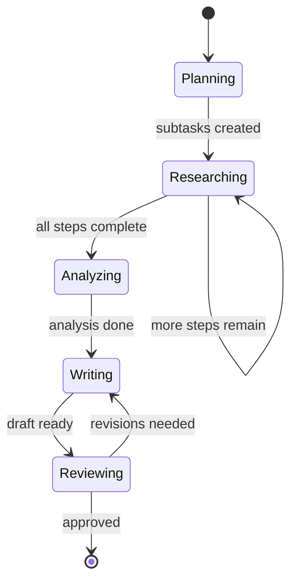

# Agent State Representation

## Introduction

Every agent has state — the data that captures where it is, what it knows, and what it's working on. In a simple chatbot, state might be just a list of messages. In a complex research agent, state includes the current task, intermediate results, sources found, decisions made, and progress toward the goal. How you design this state schema determines everything: what your agent can remember, how updates flow between nodes, and whether your system breaks at scale.

This lesson covers the practical engineering of agent state: how to define typed schemas, how framework reducers handle concurrent updates, how to track task progress, and how to carry intermediate results through multi-step execution.

### What we'll cover

- State schema design with TypedDict, dataclasses, and Pydantic
- LangGraph reducers and how they merge state updates
- The `MessagesState` pattern for conversation-based agents
- Tracking current task state and progress indicators
- Carrying intermediate results through agent execution

### Prerequisites

- Familiarity with Python type hints and `TypedDict`
- Understanding of [Agent Fundamentals](../01-agent-fundamentals/00-agent-fundamentals.md)
- Basic knowledge of [Agent Memory Systems](../04-agent-memory-systems/00-agent-memory-systems.md)

---

## State schema design

Agent state starts with a schema — a typed definition of every piece of data your agent tracks. In LangGraph, the dominant framework for stateful agents, you define state using Python's `TypedDict`:

```python
from typing import TypedDict

class AgentState(TypedDict):
    messages: list[dict]
    current_task: str
    results: list[str]
    iteration_count: int
```

This schema serves three purposes:

1. **Contract** — Every node in the graph receives and returns data matching this shape
2. **Validation** — Type checkers catch mismatches before runtime
3. **Documentation** — The schema tells other developers exactly what the agent tracks

### TypedDict vs dataclass vs Pydantic

LangGraph supports three approaches for defining state schemas. Each has distinct trade-offs:

```python
from typing import TypedDict
from dataclasses import dataclass, field
from pydantic import BaseModel, Field

# Option 1: TypedDict — fastest, recommended default
class TypedDictState(TypedDict):
    query: str
    results: list[str]
    status: str

# Option 2: dataclass — supports default values
@dataclass
class DataclassState:
    query: str = ""
    results: list[str] = field(default_factory=list)
    status: str = "pending"

# Option 3: Pydantic — validates data at runtime
class PydanticState(BaseModel):
    query: str = Field(description="The user's search query")
    results: list[str] = Field(default_factory=list)
    status: str = Field(default="pending", pattern="^(pending|running|complete|error)$")
```

| Approach | Default Values | Runtime Validation | Performance |
|----------|:-:|:-:|:-:|
| **TypedDict** | ❌ | ❌ | ⚡ Fastest |
| **dataclass** | ✅ | ❌ | ⚡ Fast |
| **Pydantic** | ✅ | ✅ | 🐢 Slower |

> **🤖 AI Context:** For most agent applications, TypedDict strikes the best balance. Use Pydantic only when you need recursive validation of untrusted input — the performance cost matters when your agent runs dozens of steps.

### Multiple schemas for input/output separation

Large agents benefit from separating what goes in from what comes out. LangGraph supports explicit input, output, and internal schemas:

```python
from typing import TypedDict

class InputState(TypedDict):
    user_query: str

class OutputState(TypedDict):
    final_answer: str
    sources: list[str]

class InternalState(TypedDict):
    user_query: str
    final_answer: str
    sources: list[str]
    # Internal-only fields
    search_results: list[dict]
    reasoning_steps: list[str]
    retry_count: int

from langgraph.graph import StateGraph

graph = StateGraph(
    InternalState,
    input_schema=InputState,
    output_schema=OutputState
)
```

**Output:**
```
# When invoked, the graph:
# - Accepts only: {"user_query": "..."}
# - Returns only: {"final_answer": "...", "sources": [...]}
# - Internally tracks: search_results, reasoning_steps, retry_count
```

This pattern keeps your API clean while allowing rich internal tracking. Nodes can freely read and write internal fields, but callers only see the input/output contract.

---

## Reducers — how state updates merge

When a node returns a state update, LangGraph needs to know *how* to merge that update with the existing state. This is where **reducers** come in. Without a reducer, new values simply overwrite old ones:

```python
from typing import TypedDict

class State(TypedDict):
    count: int
    items: list[str]

# Node returns: {"items": ["new_item"]}
# Result: items becomes ["new_item"] — previous items are LOST
```

### The `Annotated` reducer pattern

To accumulate values instead of replacing them, annotate the field with a reducer function:

```python
from typing import Annotated, TypedDict
from operator import add

class State(TypedDict):
    count: int                              # No reducer — overwrites
    items: Annotated[list[str], add]        # Reducer — appends

# Node returns: {"items": ["new_item"]}
# Result: items becomes ["old_item", "new_item"] — previous items KEPT
```

The `operator.add` reducer concatenates lists. When a node returns `{"items": ["new_item"]}`, the framework calls `add(existing_items, ["new_item"])`, producing the merged result.

### The `add_messages` reducer

For conversation-based agents, LangGraph provides a specialized reducer that handles message ID tracking:

```python
from typing import Annotated
from langchain_core.messages import AnyMessage
from langgraph.graph.message import add_messages

class ConversationState(TypedDict):
    messages: Annotated[list[AnyMessage], add_messages]
    context: dict
```

The `add_messages` reducer does more than simple concatenation:

- **New messages** (no matching ID) get appended
- **Existing messages** (matching ID) get updated in place
- **Deserialization** happens automatically — you can pass dict or `Message` objects

```python
# Both formats work with add_messages:
{"messages": [HumanMessage(content="Hello")]}
{"messages": [{"type": "human", "content": "Hello"}]}
```

### The `MessagesState` shortcut

Since most agents need a messages list with `add_messages`, LangGraph provides a pre-built state:

```python
from langgraph.graph import MessagesState

# This is equivalent to:
# class MessagesState(TypedDict):
#     messages: Annotated[list[AnyMessage], add_messages]

# Extend it for your agent:
class ResearchState(MessagesState):
    documents: list[str]
    search_query: str
    iteration: int
```

**Output:**
```
# ResearchState has:
# - messages: list[AnyMessage]  (with add_messages reducer)
# - documents: list[str]        (overwrites)
# - search_query: str           (overwrites)
# - iteration: int              (overwrites)
```

> **💡 Tip:** Start with `MessagesState` and add fields as needed. It handles the most common pattern — conversation tracking — correctly out of the box.

### Custom reducers

For complex merging logic, write your own reducer:

```python
from typing import Annotated, TypedDict

def merge_sources(existing: list[dict], new: list[dict]) -> list[dict]:
    """Deduplicate sources by URL."""
    seen_urls = {s["url"] for s in existing}
    merged = list(existing)
    for source in new:
        if source["url"] not in seen_urls:
            merged.append(source)
            seen_urls.add(source["url"])
    return merged

class ResearchState(TypedDict):
    query: str
    sources: Annotated[list[dict], merge_sources]
    summary: str
```

**Output:**
```
# Node 1 returns: {"sources": [{"url": "a.com", "title": "A"}]}
# Node 2 returns: {"sources": [{"url": "a.com", "title": "A"}, {"url": "b.com", "title": "B"}]}
# Result: [{"url": "a.com", "title": "A"}, {"url": "b.com", "title": "B"}]
# Duplicate "a.com" was automatically removed
```

---

## Current task state and progress indicators

Real-world agents need to track more than messages. They need to know *what* they're doing and *how far along* they are. We model this with explicit state fields:

```python
from typing import Annotated, Literal, TypedDict
from operator import add
from langgraph.graph import MessagesState

class TaskState(MessagesState):
    # What the agent is doing
    current_phase: Literal["planning", "researching", "analyzing", "writing", "reviewing"]
    current_task: str
    
    # How far along
    total_steps: int
    completed_steps: int
    
    # What it has found so far
    findings: Annotated[list[dict], add]
    
    # Error tracking
    errors: Annotated[list[str], add]
    retry_count: int
```

### Using task state in nodes

Nodes read the current state, do their work, and return updates:

```python
from langgraph.graph import StateGraph, START, END

def planning_node(state: TaskState) -> dict:
    """Break the user's request into subtasks."""
    query = state["messages"][-1].content
    
    # LLM call to generate a plan (simplified)
    subtasks = generate_plan(query)
    
    return {
        "current_phase": "researching",
        "current_task": subtasks[0],
        "total_steps": len(subtasks),
        "completed_steps": 0,
        "findings": []
    }

def research_node(state: TaskState) -> dict:
    """Execute the current research task."""
    task = state["current_task"]
    
    # Perform research (simplified)
    result = search_and_analyze(task)
    
    return {
        "completed_steps": state["completed_steps"] + 1,
        "findings": [{"task": task, "result": result}]
    }

def should_continue(state: TaskState) -> str:
    """Check if all steps are complete."""
    if state["completed_steps"] >= state["total_steps"]:
        return "writing"
    return "researching"
```

**Output:**
```
# After planning: {"current_phase": "researching", "completed_steps": 0, "total_steps": 3}
# After step 1:   {"current_phase": "researching", "completed_steps": 1, "total_steps": 3}
# After step 2:   {"current_phase": "researching", "completed_steps": 2, "total_steps": 3}
# After step 3:   Route to "writing" node
```



---

## Intermediate results

Complex agents generate intermediate results at each step — search results, extracted entities, partial summaries, draft sections. These need to flow through the graph without being lost.

### Accumulating results with reducers

The `Annotated[list, add]` pattern is perfect for intermediate results:

```python
from typing import Annotated, TypedDict
from operator import add

class AnalysisState(TypedDict):
    query: str
    
    # Each node appends its findings
    search_results: Annotated[list[dict], add]
    extracted_entities: Annotated[list[str], add]
    analysis_notes: Annotated[list[str], add]
    
    # Final output (overwrites)
    final_report: str

def search_node(state: AnalysisState) -> dict:
    """Search and return results."""
    results = perform_search(state["query"])
    return {
        "search_results": results,
        "analysis_notes": [f"Found {len(results)} results for '{state['query']}'"]
    }

def extract_node(state: AnalysisState) -> dict:
    """Extract entities from search results."""
    entities = extract_entities(state["search_results"])
    return {
        "extracted_entities": entities,
        "analysis_notes": [f"Extracted {len(entities)} entities"]
    }

def report_node(state: AnalysisState) -> dict:
    """Generate final report from all findings."""
    report = generate_report(
        results=state["search_results"],
        entities=state["extracted_entities"],
        notes=state["analysis_notes"]
    )
    return {"final_report": report}
```

**Output:**
```
# After search:  search_results=[{...}, {...}], analysis_notes=["Found 5 results..."]
# After extract: extracted_entities=["Entity1", "Entity2"], analysis_notes=["Found 5...", "Extracted 2..."]
# After report:  final_report="Complete analysis..."
# All intermediate results are preserved and available to the report node
```

### Private state for node-to-node communication

Sometimes intermediate data is only needed between specific nodes — it shouldn't appear in the graph's input or output. LangGraph handles this through the multiple schema pattern:

```python
from typing import TypedDict

class InputState(TypedDict):
    question: str

class OutputState(TypedDict):
    answer: str
    confidence: float

class InternalState(TypedDict):
    question: str
    answer: str
    confidence: float
    # Private intermediate data
    raw_search_hits: list[dict]
    reranked_results: list[dict]
    draft_answers: list[str]
    scoring_breakdown: dict

class PrivateNodeState(TypedDict):
    """Additional state only used between specific nodes."""
    embedding_cache: dict
    token_counts: list[int]
```

**Output:**
```
# Graph input: {"question": "What is state management?"}
# Graph output: {"answer": "State management is...", "confidence": 0.92}
# Internal (never exposed): raw_search_hits, reranked_results, draft_answers, etc.
```

> **🔑 Key concept:** Nodes can write to *any* state channel defined in any schema the graph knows about. A node receiving `InputState` can still write to fields defined in `InternalState` — the graph state is the union of all schemas.

---

## OpenAI Agents SDK — state through sessions

The OpenAI Agents SDK takes a different approach to state. Instead of typed schemas with reducers, it manages conversation state through **Sessions**:

```python
from agents import Agent, Runner, SQLiteSession

agent = Agent(
    name="Research Assistant",
    instructions="Help with research tasks. Track what you've found.",
)

# Session automatically manages conversation state
session = SQLiteSession("research_session_42")

# Turn 1 — agent sees no history
result = await Runner.run(
    agent,
    "Find information about transformer architectures",
    session=session
)

# Turn 2 — agent sees Turn 1's full conversation
result = await Runner.run(
    agent,
    "Now compare them to RNNs based on what you found",
    session=session
)
```

**Output:**
```
# Turn 1: Agent searches for transformer information
# Turn 2: Agent remembers Turn 1 and compares with RNNs
# No manual state management needed — session handles it
```

The session automatically stores all conversation items (user messages, assistant responses, tool calls) and prepends them to subsequent runs. This is simpler than LangGraph's graph-based state but less flexible for non-conversational workflows.

---

## Best practices

| Practice | Why It Matters |
|----------|----------------|
| Start with `MessagesState` and extend | Handles the most common pattern correctly |
| Use `Annotated` reducers for lists | Prevents accidental data loss from overwrites |
| Separate input/output/internal schemas | Keeps your API clean, allows rich internal tracking |
| Keep state flat, not deeply nested | Reducers work on top-level keys only |
| Use `Literal` types for phase/status fields | Catches invalid transitions at type-check time |
| Add `retry_count` and `errors` fields | Makes debugging failures much easier |

---

## Common pitfalls

| ❌ Mistake | ✅ Solution |
|-----------|-------------|
| Forgetting a reducer on a list field | Always use `Annotated[list, add]` for accumulating data |
| Storing large blobs in state | Keep state lean — store references (URLs, IDs), not full content |
| Using Pydantic everywhere "for safety" | Use TypedDict by default; Pydantic only for untrusted input validation |
| No status/phase tracking | Add explicit `current_phase` and `completed_steps` fields |
| Returning full state from every node | Return only the *changed* fields — the graph merges them |
| Deeply nested state objects | Keep state flat — reducers only apply to top-level keys |

---

## Hands-on exercise

### Your task

Design a state schema for a multi-step **code review agent** that analyzes a pull request. The agent goes through phases: parsing, style check, logic review, security scan, and report generation. Each phase produces findings that feed into the final report.

### Requirements

1. Define a `CodeReviewState` using TypedDict with appropriate reducers
2. Include fields for: PR metadata, current phase, findings per phase, overall score, final report
3. Create a `parse_node` that extracts file information from a mock PR
4. Create a `style_check_node` that adds style findings
5. Wire them into a LangGraph `StateGraph` that runs both nodes in sequence
6. Print the state after each node to verify accumulation

### Expected result

The state should show accumulated findings from both nodes, with the phase progressing from "parsing" to "style_check" and findings accumulating (not overwriting).

<details>
<summary>💡 Hints (click to expand)</summary>

- Use `Annotated[list[dict], add]` for the findings field
- Use `Literal["parsing", "style_check", "logic_review", "security_scan", "reporting"]` for phase tracking
- Each node should return only the fields it changes
- Use `graph.invoke()` with a starting state that includes the PR URL

</details>

<details>
<summary>✅ Solution (click to expand)</summary>

```python
from typing import Annotated, Literal, TypedDict
from operator import add
from langgraph.graph import StateGraph, START, END

class CodeReviewState(TypedDict):
    pr_url: str
    files: list[str]
    current_phase: Literal[
        "parsing", "style_check", "logic_review", "security_scan", "reporting"
    ]
    findings: Annotated[list[dict], add]
    overall_score: float
    final_report: str

def parse_node(state: CodeReviewState) -> dict:
    """Extract files from the PR."""
    # Simulated PR parsing
    files = ["src/auth.py", "src/api.py", "tests/test_auth.py"]
    return {
        "files": files,
        "current_phase": "style_check",
        "findings": [
            {"phase": "parsing", "type": "info", "message": f"Found {len(files)} files"}
        ]
    }

def style_check_node(state: CodeReviewState) -> dict:
    """Check code style across files."""
    # Simulated style checking
    style_findings = []
    for f in state["files"]:
        style_findings.append({
            "phase": "style_check",
            "file": f,
            "type": "warning",
            "message": f"Line length exceeds 100 chars in {f}"
        })
    
    return {
        "current_phase": "logic_review",
        "findings": style_findings,
        "overall_score": 7.5
    }

# Build graph
builder = StateGraph(CodeReviewState)
builder.add_node("parse", parse_node)
builder.add_node("style_check", style_check_node)
builder.add_edge(START, "parse")
builder.add_edge("parse", "style_check")
builder.add_edge("style_check", END)

graph = builder.compile()

# Run
result = graph.invoke({
    "pr_url": "https://github.com/org/repo/pull/42",
    "files": [],
    "current_phase": "parsing",
    "findings": [],
    "overall_score": 0.0,
    "final_report": ""
})

print(f"Phase: {result['current_phase']}")
print(f"Findings: {len(result['findings'])} total")
for f in result["findings"]:
    print(f"  [{f['phase']}] {f['message']}")
print(f"Score: {result['overall_score']}")
```

**Output:**
```
Phase: logic_review
Findings: 4 total
  [parsing] Found 3 files
  [style_check] Line length exceeds 100 chars in src/auth.py
  [style_check] Line length exceeds 100 chars in src/api.py
  [style_check] Line length exceeds 100 chars in tests/test_auth.py
Score: 7.5
```

</details>

### Bonus challenges

- [ ] Add a `security_scan_node` that checks for hardcoded secrets in filenames containing "auth"
- [ ] Add a `report_node` that generates a summary from all accumulated findings
- [ ] Use separate input/output schemas so the graph accepts only `pr_url` and returns only `final_report` and `overall_score`

---

## Summary

✅ Agent state schemas define what your agent tracks — use TypedDict for performance, Pydantic for validation

✅ Reducers control how node outputs merge with existing state — use `Annotated[list, add]` to accumulate, leave unannotated to overwrite

✅ `MessagesState` with `add_messages` handles conversation tracking with automatic ID-based deduplication

✅ Task progress needs explicit fields — `current_phase`, `completed_steps`, and `total_steps` make agent behavior visible

✅ Intermediate results flow through the graph via reducer-backed fields, while private schemas keep internal data hidden from external callers

**Next:** [State Persistence](./02-state-persistence.md)

---

## Further reading

- [LangGraph Graph API — State, Schemas, Reducers](https://docs.langchain.com/oss/python/langgraph/graph-api) — Complete reference for state design
- [LangGraph MessagesState](https://docs.langchain.com/oss/python/langgraph/graph-api#messagesstate) — Pre-built conversation state
- [OpenAI Agents SDK Sessions](https://openai.github.io/openai-agents-python/sessions/) — Session-based state management
- [Python TypedDict docs](https://docs.python.org/3/library/typing.html#typing.TypedDict) — Standard library typing

---

*[Back to State Management Overview](./00-state-management.md)*

<!-- 
Sources Consulted:
- LangGraph Graph API (State, Schemas, Reducers): https://docs.langchain.com/oss/python/langgraph/graph-api
- LangGraph Persistence (Threads, Checkpoints): https://docs.langchain.com/oss/python/langgraph/persistence
- OpenAI Agents SDK Sessions: https://openai.github.io/openai-agents-python/sessions/
-->
