# Checkpointing for Recovery

## Introduction

Production agents fail. Network calls time out. APIs return errors. Servers restart. Without checkpointing, every failure means starting over from scratch — losing minutes or hours of work. Checkpointing captures the agent's state at regular intervals so it can resume from where it left off, replay past execution, and even "time travel" to explore alternative paths.

This lesson covers LangGraph's automatic checkpointing system: how checkpoints are created, what they contain, how to resume from them after failures, how to replay and fork execution history, and how to clean up old checkpoints. We'll also explore durable execution patterns from the OpenAI ecosystem for truly fault-tolerant agents.

### What we'll cover

- How and when checkpoints are created (super-steps)
- StateSnapshot structure and what gets saved
- Resuming from checkpoints after failures
- Time travel — replaying and forking from past checkpoints
- Updating state manually with `graph.update_state()`
- Fault tolerance and durable execution patterns

### Prerequisites

- Understanding of [State Persistence](./02-state-persistence.md)
- Familiarity with LangGraph checkpointers and `thread_id`
- Basic understanding of graph execution (nodes and edges)

---

## How checkpoints work

LangGraph creates a checkpoint **after every super-step** — each time a node (or set of parallel nodes) completes execution. This happens automatically when you compile a graph with a checkpointer:

```python
from langgraph.graph import StateGraph, MessagesState, START, END
from langgraph.checkpoint.memory import InMemorySaver

class ResearchState(MessagesState):
    query: str
    sources: list[str]
    summary: str

def search_node(state: ResearchState) -> dict:
    # Super-step 1: search completes → checkpoint saved
    return {"sources": ["source_1.pdf", "source_2.pdf"]}

def analyze_node(state: ResearchState) -> dict:
    # Super-step 2: analyze completes → checkpoint saved
    return {"summary": f"Found {len(state['sources'])} sources"}

builder = StateGraph(ResearchState)
builder.add_node("search", search_node)
builder.add_node("analyze", analyze_node)
builder.add_edge(START, "search")
builder.add_edge("search", "analyze")
builder.add_edge("analyze", END)

graph = builder.compile(checkpointer=InMemorySaver())

config = {"configurable": {"thread_id": "research_001"}}
result = graph.invoke(
    {"messages": [], "query": "state management", "sources": [], "summary": ""},
    config
)
```

**Output:**
```
# Checkpoint 0: Initial state (before any node runs)
# Checkpoint 1: After __start__ node processes input
# Checkpoint 2: After search_node completes
# Checkpoint 3: After analyze_node completes
# Total: 4 checkpoints for a 2-node graph
```


> **🔑 Key concept:** A super-step is one "tick" of the graph — all nodes that run in parallel belong to the same super-step. Sequential nodes create separate super-steps, each with its own checkpoint.

---

## StateSnapshot — what gets saved

Each checkpoint is stored as a `StateSnapshot` object. You can inspect it to see exactly what the agent knew at any point in time:

```python
# Get the latest checkpoint
snapshot = graph.get_state(config)

print(f"Values:   {snapshot.values}")
print(f"Next:     {snapshot.next}")
print(f"Config:   {snapshot.config}")
print(f"Metadata: {snapshot.metadata}")
print(f"Tasks:    {snapshot.tasks}")
```

**Output:**
```
Values:   {'messages': [...], 'query': 'state management', 'sources': ['source_1.pdf', 'source_2.pdf'], 'summary': 'Found 2 sources'}
Next:     ()
Config:   {'configurable': {'thread_id': 'research_001', 'checkpoint_id': '...'}}
Metadata: {'source': 'loop', 'writes': {'analyze': {'summary': 'Found 2 sources'}}, 'step': 3}
Tasks:    ()
```

### StateSnapshot properties

| Property | Type | Description |
|----------|------|-------------|
| `values` | `dict` | The full state at this checkpoint |
| `next` | `tuple[str]` | Nodes that will execute next (empty if complete) |
| `config` | `dict` | Thread ID and checkpoint ID |
| `metadata` | `dict` | Source node, writes, step number |
| `tasks` | `tuple` | Pending tasks (for interrupted graphs) |

The `metadata` is particularly useful for debugging:

- `metadata["source"]` — What created this checkpoint (`"loop"`, `"input"`, `"update"`)
- `metadata["writes"]` — What the last node wrote to state
- `metadata["step"]` — The sequential step number

---

## Browsing state history

Every checkpoint is saved. You can walk through the entire execution history:

```python
# Get all checkpoints, most recent first
for snapshot in graph.get_state_history(config):
    step = snapshot.metadata.get("step", "?")
    source = snapshot.metadata.get("source", "?")
    writes = snapshot.metadata.get("writes", {})
    node_name = list(writes.keys())[0] if writes else "—"
    
    print(f"Step {step} | Source: {source} | Node: {node_name}")
    print(f"  State: {snapshot.values}")
    print(f"  Next:  {snapshot.next}")
    print()
```

**Output:**
```
Step 3 | Source: loop | Node: analyze
  State: {'query': 'state management', 'sources': [...], 'summary': 'Found 2 sources'}
  Next:  ()

Step 2 | Source: loop | Node: search
  State: {'query': 'state management', 'sources': ['source_1.pdf', 'source_2.pdf'], 'summary': ''}
  Next:  ('analyze',)

Step 1 | Source: loop | Node: __start__
  State: {'query': 'state management', 'sources': [], 'summary': ''}
  Next:  ('search',)

Step 0 | Source: input | Node: —
  State: {}
  Next:  ('__start__',)
```

> **💡 Tip:** `get_state_history()` returns checkpoints in reverse chronological order. The most recent checkpoint comes first.

---

## Resuming from checkpoints

When an agent fails mid-execution, you can resume from the last successful checkpoint. Because LangGraph saves state after every super-step, you only lose the work from the node that failed:

```python
import random

class FailableState(MessagesState):
    data: list[str]
    processed: list[str]

def fetch_node(state: FailableState) -> dict:
    """Fetches data — might fail."""
    return {"data": ["item_1", "item_2", "item_3"]}

def process_node(state: FailableState) -> dict:
    """Processes data — randomly fails to simulate real conditions."""
    if random.random() < 0.5:
        raise ConnectionError("API timeout during processing")
    return {"processed": [f"processed_{d}" for d in state["data"]]}

builder = StateGraph(FailableState)
builder.add_node("fetch", fetch_node)
builder.add_node("process", process_node)
builder.add_edge(START, "fetch")
builder.add_edge("fetch", "process")
builder.add_edge("process", END)

graph = builder.compile(checkpointer=InMemorySaver())
config = {"configurable": {"thread_id": "resilient_001"}}

# First attempt — might fail at process_node
try:
    result = graph.invoke(
        {"messages": [], "data": [], "processed": []},
        config
    )
    print("Success:", result["processed"])
except ConnectionError:
    print("Failed! But fetch_node's work is saved...")
    
    # Check what was saved
    snapshot = graph.get_state(config)
    print(f"Saved state: data={snapshot.values.get('data', [])}")
    print(f"Next nodes:  {snapshot.next}")
    
    # Resume — only process_node re-runs, fetch_node is skipped
    result = graph.invoke(None, config)
    print("Resumed successfully:", result["processed"])
```

**Output:**
```
Failed! But fetch_node's work is saved...
Saved state: data=['item_1', 'item_2', 'item_3']
Next nodes:  ('process',)
Resumed successfully: ['processed_item_1', 'processed_item_2', 'processed_item_3']
```

The key insight: passing `None` as input with the same config tells LangGraph to resume from the last checkpoint rather than starting over. The fetch_node doesn't re-run because its checkpoint already exists.

### Fault tolerance for pending writes

LangGraph preserves **pending writes** from nodes that completed successfully, even if the overall super-step failed. If two nodes run in parallel and one succeeds while the other fails, the successful node's writes are saved:

```mermaid
flowchart TD
    A[Start] --> B[Node A ✅]
    A --> C[Node B ❌]
    B --> D["Pending write saved"]
    C --> E["Failure"]
    E -->|Resume| F[Node B retry]
    D --> G[Continue]
    F --> G
```



This means retrying after a failure only re-executes the failed nodes, not the ones that already succeeded.

---

## Time travel — replay and fork

Time travel lets you go back to any checkpoint and either replay the execution or fork it in a new direction. This is invaluable for debugging and testing alternative agent behaviors.

### Replaying past execution

Invoke the graph with a specific `checkpoint_id` to replay from that point:

```python
# Get all checkpoints
history = list(graph.get_state_history(config))

# Find the checkpoint after search_node (step 2)
search_checkpoint = None
for snapshot in history:
    if snapshot.metadata.get("step") == 2:
        search_checkpoint = snapshot.config
        break

# Replay from that checkpoint — re-executes analyze_node
replay_result = graph.invoke(None, search_checkpoint)
print("Replayed from search:", replay_result["summary"])
```

**Output:**
```
Replayed from search: Found 2 sources
# analyze_node ran again using the state from after search_node
```

### Forking to explore alternatives

You can update state at a checkpoint and then continue execution from the modified state. This creates a *fork* — a new branch of execution:

```python
# Go back to the search checkpoint
search_checkpoint_config = search_checkpoint

# Modify state — add more sources
graph.update_state(
    search_checkpoint_config,
    values={"sources": ["extra_source_3.pdf", "extra_source_4.pdf"]},
    as_node="search"  # Attribute this update to the search node
)

# Continue from the modified state
forked_result = graph.invoke(None, search_checkpoint_config)
print("Forked result:", forked_result["summary"])
```

**Output:**
```
Forked result: Found 4 sources
# analyze_node saw the modified sources (2 original + 2 added)
```

> **🤖 AI Context:** Time travel is powerful for agent development. When your agent makes a bad decision at step 5, you can fork from step 4, modify the state, and test whether a different input leads to a better outcome — without re-running steps 1 through 3.

---

## Updating state manually

`graph.update_state()` lets you inject changes into the state at any point. The values go through the normal reducer logic:

```python
from typing import Annotated, TypedDict
from operator import add

class AccumulatingState(TypedDict):
    items: Annotated[list[str], add]
    status: str

# If items has an `add` reducer, manual updates ACCUMULATE:
graph.update_state(
    config,
    values={"items": ["manually_added"]},
    as_node="human"  # Attribute to a virtual "human" node
)

# The "manually_added" item is APPENDED to existing items via the reducer
# For fields without reducers (like status), updates OVERWRITE:
graph.update_state(
    config,
    values={"status": "manually_approved"},
    as_node="human"
)
```

### The `as_node` parameter

The `as_node` parameter controls which node is considered the "author" of the update. This affects what runs next:

```python
# If the graph has: search → analyze → report
# And the graph is currently at the "analyze" checkpoint:

# Option 1: Update as "analyze" — next node is "report"
graph.update_state(config, values={"data": "new"}, as_node="analyze")

# Option 2: Update as "search" — next node is "analyze" (re-runs)
graph.update_state(config, values={"data": "new"}, as_node="search")
```

This is how human-in-the-loop works — a human reviews state, makes changes, and the graph resumes from the appropriate point.

---

## Durable execution patterns

For agents that run for hours or days, standard checkpointing may not be enough. The OpenAI Agents SDK ecosystem supports integration with **durable execution frameworks** that guarantee completion:

### Temporal, Restate, and DBOS

These frameworks wrap agent execution in transactions that survive process crashes, server restarts, and network failures:

```python
# Conceptual example — Temporal durable execution
from temporalio import workflow, activity

@activity.defn
async def run_agent_step(step_input: dict) -> dict:
    """Each agent step is a durable activity."""
    result = await agent.run_step(step_input)
    return result  # Automatically persisted by Temporal

@workflow.defn
class AgentWorkflow:
    @workflow.run
    async def run(self, query: str) -> str:
        # Each step is individually durable
        plan = await workflow.execute_activity(
            run_agent_step, {"type": "plan", "query": query},
            start_to_close_timeout=timedelta(minutes=5)
        )
        
        research = await workflow.execute_activity(
            run_agent_step, {"type": "research", "plan": plan},
            start_to_close_timeout=timedelta(minutes=10)
        )
        
        # If the server crashes here, Temporal resumes from
        # the last completed activity — research isn't re-run
        report = await workflow.execute_activity(
            run_agent_step, {"type": "report", "research": research},
            start_to_close_timeout=timedelta(minutes=5)
        )
        return report
```

| Framework | Approach | Best For |
|-----------|----------|----------|
| **Temporal** | Workflow-as-code, activity retries | Complex multi-step agent workflows |
| **Restate** | Event-sourced state machines | Stateful agent services |
| **DBOS** | Database-backed durable execution | Transactional agent operations |

> **Note:** These frameworks are for advanced use cases where agents run for extended periods. For most applications, LangGraph's built-in checkpointing is sufficient.

---

## Checkpoint cleanup

Over time, checkpoints accumulate. A chatbot with thousands of conversations generates millions of checkpoints. Plan for cleanup:

```python
# Strategy 1: TTL-based expiration (if your backend supports it)
# PostgreSQL example with partitioned tables
# Set up table partitioning by timestamp, drop old partitions

# Strategy 2: Manual cleanup for important conversations
import time

def cleanup_old_threads(checkpointer, max_age_days=30):
    """Remove checkpoints older than max_age_days."""
    cutoff = time.time() - (max_age_days * 86400)
    
    # Implementation depends on your checkpointer backend
    # For PostgreSQL:
    # DELETE FROM checkpoints WHERE created_at < cutoff
    pass

# Strategy 3: Keep only latest N checkpoints per thread
def trim_thread_history(graph, config, keep_last=10):
    """Keep only the most recent checkpoints for a thread."""
    history = list(graph.get_state_history(config))
    if len(history) > keep_last:
        old_checkpoints = history[keep_last:]
        # Delete old checkpoints via backend-specific API
        print(f"Would delete {len(old_checkpoints)} old checkpoints")
```

| Strategy | When to Use | Trade-off |
|----------|-------------|-----------|
| **TTL expiration** | High-volume chatbots | Lose old conversations |
| **Keep latest N** | Debugging-focused apps | Limited time travel depth |
| **Archive then delete** | Compliance requirements | Storage cost for archives |
| **Never delete** | Low-volume, audit-critical | Unbounded storage growth |

---

## Best practices

| Practice | Why It Matters |
|----------|----------------|
| Use checkpointing in production by default | The cost is minimal; the recovery benefit is enormous |
| Log checkpoint IDs on failures | Enables targeted replay and debugging |
| Test resume-from-failure scenarios | Don't wait for production to discover checkpointing gaps |
| Use `as_node` correctly with `update_state` | Wrong attribution causes wrong nodes to execute next |
| Plan checkpoint cleanup from day one | Unbounded growth causes storage and performance issues |
| Use durable execution for multi-hour agents | Standard checkpointing can't survive process restarts |

---

## Common pitfalls

| ❌ Mistake | ✅ Solution |
|-----------|-------------|
| Assuming checkpoints survive process restarts with `InMemorySaver` | Use `SqliteSaver` or `PostgresSaver` for true persistence |
| Not testing resume after failure | Write integration tests that kill and resume the graph |
| Modifying state without `as_node` | Always specify which node the update "came from" |
| Keeping all checkpoints forever | Implement TTL or retention policies |
| Replaying without understanding reducer effects | Manual updates go through reducers — `add` reducer will append, not replace |
| Ignoring `metadata.step` in state history | Step numbers help you find the exact checkpoint to fork from |

---

## Hands-on exercise

### Your task

Build a 3-node research pipeline with checkpointing. Simulate a failure in the middle node, then resume from the checkpoint to complete execution.

### Requirements

1. Create nodes: `gather_sources` → `analyze_sources` → `write_report`
2. Make `analyze_sources` fail on its first invocation (use a counter or random flag)
3. Compile with `InMemorySaver` checkpointer
4. Run the graph — it should fail at `analyze_sources`
5. Verify that `gather_sources` results are saved in the checkpoint
6. Resume the graph with `graph.invoke(None, config)` — only `analyze_sources` and `write_report` should run
7. Print the state history showing all checkpoints

### Expected result

The graph fails once, resumes successfully, and the state history shows that `gather_sources` only ran once while `analyze_sources` ran twice (once failed, once succeeded).

<details>
<summary>💡 Hints (click to expand)</summary>

- Use a mutable object (like a list) outside the graph to track invocation counts
- Check `snapshot.next` to verify which node runs next after failure
- Pass `None` as input when resuming — this tells LangGraph to continue from the last checkpoint
- Use `graph.get_state_history(config)` to inspect all checkpoints

</details>

<details>
<summary>✅ Solution (click to expand)</summary>

```python
from typing import Annotated, TypedDict
from operator import add
from langgraph.graph import StateGraph, START, END
from langgraph.checkpoint.memory import InMemorySaver

class PipelineState(TypedDict):
    query: str
    sources: Annotated[list[str], add]
    analysis: str
    report: str

# Track invocations outside the graph
analyze_calls = []

def gather_sources(state: PipelineState) -> dict:
    print("  [gather_sources] Running...")
    return {"sources": ["paper_1.pdf", "paper_2.pdf", "paper_3.pdf"]}

def analyze_sources(state: PipelineState) -> dict:
    analyze_calls.append(1)
    print(f"  [analyze_sources] Attempt {len(analyze_calls)}...")
    
    if len(analyze_calls) == 1:
        raise ConnectionError("Simulated API failure!")
    
    return {"analysis": f"Analyzed {len(state['sources'])} sources successfully"}

def write_report(state: PipelineState) -> dict:
    print("  [write_report] Running...")
    return {"report": f"Report: {state['analysis']}. Based on {len(state['sources'])} sources."}

builder = StateGraph(PipelineState)
builder.add_node("gather", gather_sources)
builder.add_node("analyze", analyze_sources)
builder.add_node("report", write_report)
builder.add_edge(START, "gather")
builder.add_edge("gather", "analyze")
builder.add_edge("analyze", "report")
builder.add_edge("report", END)

graph = builder.compile(checkpointer=InMemorySaver())
config = {"configurable": {"thread_id": "pipeline_001"}}

# First attempt — fails at analyze
print("=== First attempt ===")
try:
    result = graph.invoke(
        {"query": "state management", "sources": [], "analysis": "", "report": ""},
        config
    )
except ConnectionError as e:
    print(f"  Failed: {e}")
    snapshot = graph.get_state(config)
    print(f"  Saved sources: {snapshot.values.get('sources', [])}")
    print(f"  Next node: {snapshot.next}")

# Resume — only analyze and report run
print("\n=== Resuming ===")
result = graph.invoke(None, config)
print(f"  Final report: {result['report']}")

# Show history
print("\n=== Checkpoint History ===")
for snap in graph.get_state_history(config):
    step = snap.metadata.get("step", "?")
    writes = snap.metadata.get("writes", {})
    node = list(writes.keys())[0] if writes else "initial"
    print(f"  Step {step}: {node}")
```

**Output:**
```
=== First attempt ===
  [gather_sources] Running...
  [analyze_sources] Attempt 1...
  Failed: Simulated API failure!
  Saved sources: ['paper_1.pdf', 'paper_2.pdf', 'paper_3.pdf']
  Next node: ('analyze',)

=== Resuming ===
  [analyze_sources] Attempt 2...
  [write_report] Running...
  Final report: Report: Analyzed 3 sources successfully. Based on 3 sources.

=== Checkpoint History ===
  Step 4: report
  Step 3: analyze
  Step 2: gather
  Step 1: __start__
  Step 0: initial
```

</details>

### Bonus challenges

- [ ] Add time travel: fork from the `gather` checkpoint, add extra sources, and re-run
- [ ] Use `graph.update_state()` to manually inject analysis results without running `analyze_sources`
- [ ] Implement a retry wrapper that automatically resumes up to 3 times on failure

---

## Summary

✅ LangGraph creates a checkpoint after every super-step — each node completion saves a StateSnapshot with values, metadata, and next-node information

✅ `graph.get_state()` and `graph.get_state_history()` let you inspect any checkpoint's values, step number, and which node wrote what

✅ Resume after failure by calling `graph.invoke(None, config)` — only un-executed nodes run, saving all previous work

✅ Time travel lets you replay from any checkpoint or fork execution by updating state at a past checkpoint with `graph.update_state()`

✅ For multi-hour agents, durable execution frameworks (Temporal, Restate, DBOS) provide process-level fault tolerance beyond standard checkpointing

**Next:** [State Debugging](./04-state-debugging.md)

---

## Further reading

- [LangGraph Persistence — Checkpoints](https://docs.langchain.com/oss/python/langgraph/persistence) — Official checkpoint documentation
- [LangGraph Time Travel](https://docs.langchain.com/oss/python/langgraph/persistence#replay) — Replay and fork guide
- [OpenAI Running Agents — Durable Execution](https://openai.github.io/openai-agents-python/running_agents/) — Temporal, Restate, DBOS integrations
- [LangGraph Human-in-the-Loop](https://docs.langchain.com/oss/python/langgraph/interrupts) — Using update_state for human review

---

*[Back to State Management Overview](./00-state-management.md)*

<!-- 
Sources Consulted:
- LangGraph Persistence (Checkpoints, Replay, Time Travel): https://docs.langchain.com/oss/python/langgraph/persistence
- LangGraph Graph API (Super-steps, State Updates): https://docs.langchain.com/oss/python/langgraph/graph-api
- OpenAI Running Agents (Durable Execution): https://openai.github.io/openai-agents-python/running_agents/
-->
