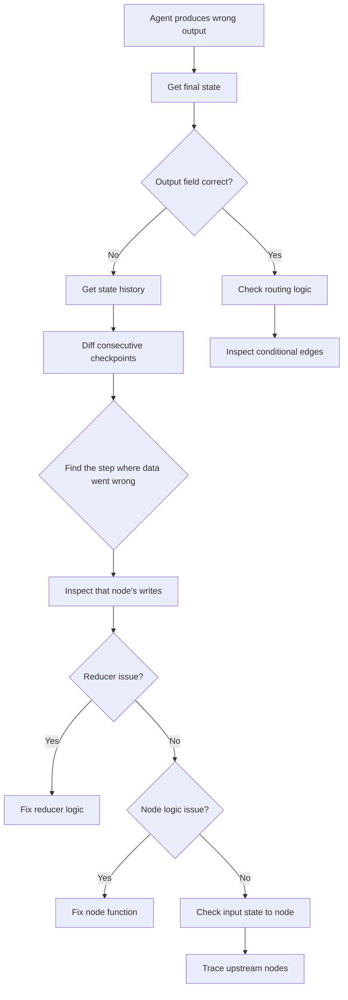

# State Debugging

## Introduction

When an agent produces the wrong answer, gives a bizarre response, or gets stuck in a loop, the first question is always: "What was the state?" Unlike a simple function you can step through with a debugger, agents execute across multiple nodes, accumulate state through reducers, and make branching decisions based on intermediate data. Without the right tools, debugging is guesswork.

This lesson covers practical techniques for debugging agent state: inspecting current state with `get_state()`, walking through execution history with `get_state_history()`, visualizing how state changes between steps, asserting that state meets expectations, and integrating with tracing tools for production observability.

### What we'll cover

- Inspecting current state with `graph.get_state()`
- Walking execution history with `graph.get_state_history()`
- Diffing state between checkpoints to find where things went wrong
- Adding state assertions to catch invalid transitions
- Integrating state debugging with tracing and logging

### Prerequisites

- Understanding of [Checkpointing for Recovery](./03-checkpointing-for-recovery.md)
- Familiarity with `StateSnapshot` properties
- Basic Python debugging experience

---

## Inspecting current state

The most basic debugging tool is `graph.get_state()` — it returns a `StateSnapshot` of the latest checkpoint for a thread:

```python
from langgraph.graph import StateGraph, MessagesState, START, END
from langgraph.checkpoint.memory import InMemorySaver
from typing import Annotated
from operator import add

class DebugState(MessagesState):
    query: str
    sources: Annotated[list[str], add]
    analysis: str
    confidence: float

def search_node(state: DebugState) -> dict:
    return {
        "sources": ["doc_1.pdf", "doc_2.pdf"],
        "confidence": 0.7
    }

def analyze_node(state: DebugState) -> dict:
    return {
        "analysis": f"Found {len(state['sources'])} relevant sources",
        "confidence": 0.85
    }

builder = StateGraph(DebugState)
builder.add_node("search", search_node)
builder.add_node("analyze", analyze_node)
builder.add_edge(START, "search")
builder.add_edge("search", "analyze")
builder.add_edge("analyze", END)

graph = builder.compile(checkpointer=InMemorySaver())
config = {"configurable": {"thread_id": "debug_001"}}

# Run the graph
result = graph.invoke(
    {"messages": [], "query": "state management", "sources": [], "analysis": "", "confidence": 0.0},
    config
)

# Inspect final state
snapshot = graph.get_state(config)
print("=== Current State ===")
print(f"Values:     {snapshot.values}")
print(f"Next:       {snapshot.next}")
print(f"Step:       {snapshot.metadata['step']}")
print(f"Last write: {snapshot.metadata['writes']}")
```

**Output:**
```
=== Current State ===
Values:     {'messages': [], 'query': 'state management', 'sources': ['doc_1.pdf', 'doc_2.pdf'], 'analysis': 'Found 2 relevant sources', 'confidence': 0.85}
Next:       ()
Step:       3
Last write: {'analyze': {'analysis': 'Found 2 relevant sources', 'confidence': 0.85}}
```

### Targeting a specific checkpoint

If you know the `checkpoint_id`, you can inspect state at any point in time:

```python
# Get state at a specific checkpoint
specific_config = {
    "configurable": {
        "thread_id": "debug_001",
        "checkpoint_id": "some-checkpoint-id-here"
    }
}
past_snapshot = graph.get_state(specific_config)
```

---

## Walking execution history

`graph.get_state_history()` returns every checkpoint for a thread, letting you trace exactly how state evolved:

```python
def print_execution_history(graph, config):
    """Print a formatted execution history."""
    print("=" * 60)
    print("EXECUTION HISTORY")
    print("=" * 60)
    
    for snapshot in graph.get_state_history(config):
        step = snapshot.metadata.get("step", "?")
        source = snapshot.metadata.get("source", "?")
        writes = snapshot.metadata.get("writes", {})
        
        if writes:
            node_name = list(writes.keys())[0]
            changes = writes[node_name]
        else:
            node_name = "—"
            changes = {}
        
        print(f"\n--- Step {step} ({source}) ---")
        print(f"  Node:    {node_name}")
        print(f"  Wrote:   {changes}")
        print(f"  Next:    {snapshot.next}")
        
        # Show key state values
        vals = snapshot.values
        print(f"  Sources: {vals.get('sources', [])}")
        print(f"  Conf:    {vals.get('confidence', 'N/A')}")

# Use it
print_execution_history(graph, config)
```

**Output:**
```
============================================================
EXECUTION HISTORY
============================================================

--- Step 3 (loop) ---
  Node:    analyze
  Wrote:   {'analysis': 'Found 2 relevant sources', 'confidence': 0.85}
  Next:    ()
  Sources: ['doc_1.pdf', 'doc_2.pdf']
  Conf:    0.85

--- Step 2 (loop) ---
  Node:    search
  Wrote:   {'sources': ['doc_1.pdf', 'doc_2.pdf'], 'confidence': 0.7}
  Next:    ('analyze',)
  Sources: ['doc_1.pdf', 'doc_2.pdf']
  Conf:    0.7

--- Step 1 (loop) ---
  Node:    __start__
  Wrote:   {'__start__': {'query': 'state management', ...}}
  Next:    ('search',)
  Sources: []
  Conf:    0.0

--- Step 0 (input) ---
  Node:    —
  Wrote:   {}
  Next:    ('__start__',)
  Sources: []
  Conf:    N/A
```

> **💡 Tip:** When debugging an issue, start from the last step and work backwards. The `writes` field tells you exactly what each node changed — find the step where things went wrong.

---

## Diffing state between checkpoints

The most powerful debugging technique is comparing state between consecutive steps. This reveals exactly what changed and when:

```python
def diff_checkpoints(graph, config):
    """Show what changed between each checkpoint."""
    history = list(graph.get_state_history(config))
    
    # Reverse to chronological order
    history.reverse()
    
    print("=" * 60)
    print("STATE DIFF ANALYSIS")
    print("=" * 60)
    
    for i in range(1, len(history)):
        prev = history[i - 1].values
        curr = history[i].values
        step = history[i].metadata.get("step", "?")
        writes = history[i].metadata.get("writes", {})
        node = list(writes.keys())[0] if writes else "unknown"
        
        print(f"\n--- Step {step}: {node} ---")
        
        # Find changes
        all_keys = set(list(prev.keys()) + list(curr.keys()))
        changes_found = False
        
        for key in sorted(all_keys):
            old_val = prev.get(key)
            new_val = curr.get(key)
            
            if old_val != new_val:
                changes_found = True
                if old_val is None:
                    print(f"  + {key}: {new_val}")
                elif new_val is None:
                    print(f"  - {key}: {old_val}")
                else:
                    print(f"  ~ {key}:")
                    print(f"      before: {old_val}")
                    print(f"      after:  {new_val}")
        
        if not changes_found:
            print("  (no state changes)")

# Use it
diff_checkpoints(graph, config)
```

**Output:**
```
============================================================
STATE DIFF ANALYSIS
============================================================

--- Step 1: __start__ ---
  + analysis: 
  + confidence: 0.0
  + messages: []
  + query: state management
  + sources: []

--- Step 2: search ---
  ~ confidence:
      before: 0.0
      after:  0.7
  ~ sources:
      before: []
      after:  ['doc_1.pdf', 'doc_2.pdf']

--- Step 3: analyze ---
  ~ analysis:
      before: 
      after:  Found 2 relevant sources
  ~ confidence:
      before: 0.7
      after:  0.85
```

This immediately shows that the `search` node set confidence to 0.7, and the `analyze` node overwrote it to 0.85. If confidence was supposed to accumulate, this diff reveals the missing reducer.

---

## State assertions

Assertions catch invalid state transitions before they propagate through the graph. Add validation logic at critical points:

```python
from typing import Annotated, Literal, TypedDict
from operator import add

class ValidatedState(TypedDict):
    phase: Literal["init", "search", "analyze", "report", "complete"]
    sources: Annotated[list[str], add]
    confidence: float
    errors: Annotated[list[str], add]

# Valid phase transitions
VALID_TRANSITIONS = {
    "init": {"search"},
    "search": {"analyze", "search"},  # Can retry search
    "analyze": {"report", "search"},  # Can go back to search
    "report": {"complete"},
    "complete": set()
}

def assert_valid_state(state: ValidatedState, node_name: str):
    """Validate state invariants after a node executes."""
    errors = []
    
    # Check confidence bounds
    if not (0.0 <= state.get("confidence", 0) <= 1.0):
        errors.append(f"confidence out of bounds: {state['confidence']}")
    
    # Check sources exist before analysis
    if state["phase"] == "analyze" and not state.get("sources"):
        errors.append("Cannot analyze without sources")
    
    # Check for empty report
    if state["phase"] == "complete" and not state.get("report"):
        errors.append("Cannot complete without a report")
    
    if errors:
        error_msg = f"[{node_name}] State assertion failures: {'; '.join(errors)}"
        print(f"⚠️ {error_msg}")
        return {"errors": [error_msg]}
    
    return {}

def validate_phase_transition(old_phase: str, new_phase: str, node_name: str):
    """Check if phase transition is valid."""
    valid = VALID_TRANSITIONS.get(old_phase, set())
    if new_phase not in valid:
        raise ValueError(
            f"Invalid transition in {node_name}: "
            f"'{old_phase}' → '{new_phase}'. "
            f"Valid: {valid}"
        )
```

### Using assertions in nodes

```python
def search_node(state: ValidatedState) -> dict:
    old_phase = state["phase"]
    
    # Do search work
    results = ["source_1.pdf", "source_2.pdf"]
    new_state = {
        "phase": "analyze",
        "sources": results,
        "confidence": 0.6
    }
    
    # Validate transition
    validate_phase_transition(old_phase, "analyze", "search_node")
    
    # Validate result state
    merged = {**state, **new_state}
    assertion_updates = assert_valid_state(merged, "search_node")
    
    return {**new_state, **assertion_updates}
```

**Output:**
```
# If search tries to go to "complete" directly:
# ValueError: Invalid transition in search_node: 'search' → 'complete'. Valid: {'analyze', 'search'}

# If confidence is negative:
# ⚠️ [search_node] State assertion failures: confidence out of bounds: -0.5
```

### Assertion decorator pattern

For cleaner code, wrap assertions in a decorator:

```python
from functools import wraps

def with_state_assertions(func):
    """Decorator that validates state after node execution."""
    @wraps(func)
    def wrapper(state, *args, **kwargs):
        result = func(state, *args, **kwargs)
        
        # Merge result with current state for validation
        merged = {**state, **result}
        
        # Run assertions
        assertion_errors = assert_valid_state(merged, func.__name__)
        if assertion_errors:
            result = {**result, **assertion_errors}
        
        return result
    return wrapper

@with_state_assertions
def analyze_node(state: ValidatedState) -> dict:
    """Analyze sources — assertions run automatically after."""
    summary = f"Analyzed {len(state['sources'])} sources"
    return {
        "phase": "report",
        "confidence": min(state["confidence"] + 0.2, 1.0)
    }
```

---

## Logging state transitions

For production systems, log state transitions to external systems for observability:

```python
import logging
import json
from datetime import datetime

# Configure structured logging
logger = logging.getLogger("agent.state")
logger.setLevel(logging.DEBUG)

def log_state_transition(node_name: str, state_before: dict, state_after: dict):
    """Log state changes in a structured format."""
    changes = {}
    all_keys = set(list(state_before.keys()) + list(state_after.keys()))
    
    for key in all_keys:
        old = state_before.get(key)
        new = state_after.get(key)
        if old != new:
            changes[key] = {"before": str(old)[:100], "after": str(new)[:100]}
    
    log_entry = {
        "timestamp": datetime.utcnow().isoformat(),
        "node": node_name,
        "changes": changes,
        "keys_changed": list(changes.keys())
    }
    
    logger.info(json.dumps(log_entry))

# Usage in a node wrapper
def logging_node(func):
    """Decorator that logs state changes."""
    @wraps(func)
    def wrapper(state, *args, **kwargs):
        result = func(state, *args, **kwargs)
        log_state_transition(func.__name__, state, {**state, **result})
        return result
    return wrapper

@logging_node
def search_node(state: dict) -> dict:
    return {"sources": ["a.pdf", "b.pdf"], "confidence": 0.7}
```

**Output:**
```json
{
  "timestamp": "2025-01-15T10:30:00.000000",
  "node": "search_node",
  "changes": {
    "sources": {"before": "[]", "after": "['a.pdf', 'b.pdf']"},
    "confidence": {"before": "0.0", "after": "0.7"}
  },
  "keys_changed": ["sources", "confidence"]
}
```

### Integrating with LangSmith

LangGraph integrates with LangSmith for production tracing. Every node execution, state update, and LLM call is automatically captured:

```python
import os

# Enable LangSmith tracing
os.environ["LANGCHAIN_TRACING_V2"] = "true"
os.environ["LANGCHAIN_API_KEY"] = "your-api-key"
os.environ["LANGCHAIN_PROJECT"] = "agent-state-debugging"

# All graph executions are now traced automatically
# View in LangSmith dashboard: https://smith.langchain.com
```

### Using LangGraph metadata for debugging

Every node has access to execution metadata through the config:

```python
from langchain_core.runnables import RunnableConfig

def debug_aware_node(state: dict, config: RunnableConfig) -> dict:
    """A node that uses metadata for debugging."""
    metadata = config.get("metadata", {})
    
    current_step = metadata.get("langgraph_step", "unknown")
    current_node = metadata.get("langgraph_node", "unknown")
    triggers = metadata.get("langgraph_triggers", [])
    checkpoint_ns = metadata.get("langgraph_checkpoint_ns", "")
    
    print(f"Debug: step={current_step}, node={current_node}")
    print(f"  Triggered by: {triggers}")
    print(f"  Checkpoint NS: {checkpoint_ns}")
    
    # Use step count for proactive debugging
    if current_step > 20:
        print(f"  ⚠️ High step count ({current_step}) — possible loop?")
    
    return {"status": "processed"}
```

**Output:**
```
Debug: step=3, node=search_node
  Triggered by: ['analyze_node']
  Checkpoint NS: 
  ⚠️ High step count detected — possible loop?
```

---

## Debugging workflow

When an agent produces incorrect output, follow this systematic approach:



1. **Start at the end** — `graph.get_state(config)` shows the final output
2. **Walk backwards** — `graph.get_state_history(config)` shows every step
3. **Diff adjacent steps** — Find where the data diverged from expectations
4. **Check the writes** — `metadata["writes"]` shows exactly what the node returned
5. **Verify the reducer** — Is the update being merged correctly?
6. **Inspect the input** — What state did the node actually receive?

---

## Best practices

| Practice | Why It Matters |
|----------|----------------|
| Build `diff_checkpoints` into your development workflow | Catches reducer bugs and unexpected overwrites immediately |
| Use structured logging for state transitions | Enables searching and filtering in production monitoring |
| Add state assertions for critical invariants | Catches impossible states before they cause downstream failures |
| Use the assertion decorator pattern | Keeps node logic clean while adding validation |
| Log checkpoint IDs with errors | Enables exact state reproduction for bug reports |
| Monitor step counts in production | High counts indicate potential infinite loops |

---

## Common pitfalls

| ❌ Mistake | ✅ Solution |
|-----------|-------------|
| Only checking final output, not intermediate state | Use `get_state_history()` to trace every step |
| Assuming reducers work correctly without testing | Diff consecutive checkpoints to verify merge behavior |
| No assertions on state transitions | Add phase-transition validation and value-range checks |
| Logging entire state objects | Log only changed keys — state can be enormous |
| Debugging without tracing enabled | Enable LangSmith or structured logging from day one |
| Ignoring `metadata["writes"]` | The writes field is the most direct debugging signal |

---

## Hands-on exercise

### Your task

Build a debugging toolkit for a 3-node agent. The agent has a subtle bug — one node overwrites data that another node set. Use state inspection and diffing to find and fix the bug.

### Requirements

1. Create a graph with nodes: `collect` → `enrich` → `summarize`
2. The `collect` node sets `sources` and `confidence`
3. The `enrich` node is supposed to add more sources but accidentally overwrites them (the bug)
4. The `summarize` node generates a summary based on `sources`
5. Implement a `diff_checkpoints` function to detect the overwrite
6. Fix the bug by adding the correct reducer
7. Run both versions and compare the diffs

### Expected result

Before fix: diff shows `sources` being overwritten at the `enrich` step. After fix: diff shows `sources` being accumulated.

<details>
<summary>💡 Hints (click to expand)</summary>

- The "bug" is a missing `Annotated[list[str], add]` on the `sources` field
- Without the reducer, `enrich` returning `{"sources": ["new"]}` overwrites `["old"]`
- With the reducer, it becomes `["old", "new"]`
- The diff function should clearly show the `before` and `after` values

</details>

<details>
<summary>✅ Solution (click to expand)</summary>

```python
from typing import Annotated, TypedDict
from operator import add
from langgraph.graph import StateGraph, START, END
from langgraph.checkpoint.memory import InMemorySaver

# BUGGY version — missing reducer
class BuggyState(TypedDict):
    query: str
    sources: list[str]         # No reducer — overwrites!
    confidence: float
    summary: str

# FIXED version — with reducer
class FixedState(TypedDict):
    query: str
    sources: Annotated[list[str], add]  # Reducer — accumulates!
    confidence: float
    summary: str

def collect_node(state):
    return {"sources": ["paper_1.pdf", "paper_2.pdf"], "confidence": 0.6}

def enrich_node(state):
    return {"sources": ["paper_3.pdf", "paper_4.pdf"], "confidence": 0.8}

def summarize_node(state):
    return {"summary": f"Summary based on {len(state['sources'])} sources"}

def diff_checkpoints(graph, config, label):
    history = list(graph.get_state_history(config))
    history.reverse()
    
    print(f"\n{'=' * 50}")
    print(f"DIFF: {label}")
    print(f"{'=' * 50}")
    
    for i in range(1, len(history)):
        prev = history[i - 1].values
        curr = history[i].values
        writes = history[i].metadata.get("writes", {})
        node = list(writes.keys())[0] if writes else "init"
        
        for key in ["sources", "confidence"]:
            old_val = prev.get(key)
            new_val = curr.get(key)
            if old_val != new_val:
                print(f"  Step {history[i].metadata['step']} ({node}) | {key}:")
                print(f"    before: {old_val}")
                print(f"    after:  {new_val}")

def build_graph(state_class):
    builder = StateGraph(state_class)
    builder.add_node("collect", collect_node)
    builder.add_node("enrich", enrich_node)
    builder.add_node("summarize", summarize_node)
    builder.add_edge(START, "collect")
    builder.add_edge("collect", "enrich")
    builder.add_edge("enrich", "summarize")
    builder.add_edge("summarize", END)
    return builder.compile(checkpointer=InMemorySaver())

# Run buggy version
buggy_graph = build_graph(BuggyState)
buggy_config = {"configurable": {"thread_id": "buggy"}}
buggy_result = buggy_graph.invoke(
    {"query": "test", "sources": [], "confidence": 0.0, "summary": ""},
    buggy_config
)
print(f"BUGGY result: {buggy_result['summary']}")
diff_checkpoints(buggy_graph, buggy_config, "BUGGY (no reducer)")

# Run fixed version
fixed_graph = build_graph(FixedState)
fixed_config = {"configurable": {"thread_id": "fixed"}}
fixed_result = fixed_graph.invoke(
    {"query": "test", "sources": [], "confidence": 0.0, "summary": ""},
    fixed_config
)
print(f"\nFIXED result: {fixed_result['summary']}")
diff_checkpoints(fixed_graph, fixed_config, "FIXED (with reducer)")
```

**Output:**
```
BUGGY result: Summary based on 2 sources

==================================================
DIFF: BUGGY (no reducer)
==================================================
  Step 2 (collect) | sources:
    before: []
    after:  ['paper_1.pdf', 'paper_2.pdf']
  Step 2 (collect) | confidence:
    before: 0.0
    after:  0.6
  Step 3 (enrich) | sources:
    before: ['paper_1.pdf', 'paper_2.pdf']
    after:  ['paper_3.pdf', 'paper_4.pdf']     ← OVERWRITE! Lost paper_1, paper_2
  Step 3 (enrich) | confidence:
    before: 0.6
    after:  0.8

FIXED result: Summary based on 4 sources

==================================================
DIFF: FIXED (with reducer)
==================================================
  Step 2 (collect) | sources:
    before: []
    after:  ['paper_1.pdf', 'paper_2.pdf']
  Step 2 (collect) | confidence:
    before: 0.0
    after:  0.6
  Step 3 (enrich) | sources:
    before: ['paper_1.pdf', 'paper_2.pdf']
    after:  ['paper_1.pdf', 'paper_2.pdf', 'paper_3.pdf', 'paper_4.pdf']  ← ACCUMULATED!
  Step 3 (enrich) | confidence:
    before: 0.6
    after:  0.8
```

</details>

### Bonus challenges

- [ ] Add the `logging_node` decorator to all nodes and inspect the log output
- [ ] Add state assertions that catch when `confidence` is outside `[0.0, 1.0]`
- [ ] Create a `validate_phase_transition` function that prevents `summarize` from running with empty sources

---

## Summary

✅ `graph.get_state(config)` returns the latest StateSnapshot — use it to inspect what the agent knows right now

✅ `graph.get_state_history(config)` returns all checkpoints — walk backwards to find where things went wrong

✅ Diffing consecutive checkpoints reveals overwrites, missing reducers, and unexpected state mutations

✅ State assertions (phase transitions, value bounds, required fields) catch impossible states before they propagate

✅ Structured logging and LangSmith tracing give you production observability over state transitions and node execution

**Next:** [Concurrent State Access](./05-concurrent-state-access.md)

---

## Further reading

- [LangGraph Persistence — Get State](https://docs.langchain.com/oss/python/langgraph/persistence) — State inspection API
- [LangGraph Graph API — Runtime Context](https://docs.langchain.com/oss/python/langgraph/graph-api#runtime-context) — Accessing metadata in nodes
- [LangSmith Tracing](https://docs.smith.langchain.com/) — Production observability for LangGraph agents
- [Python logging module](https://docs.python.org/3/library/logging.html) — Structured logging patterns

---

*[Back to State Management Overview](./00-state-management.md)*

<!-- 
Sources Consulted:
- LangGraph Persistence (Get State, State History): https://docs.langchain.com/oss/python/langgraph/persistence
- LangGraph Graph API (Runtime Context, Metadata): https://docs.langchain.com/oss/python/langgraph/graph-api
- LangSmith Documentation: https://docs.smith.langchain.com/
-->
