# Concurrent State Access

## Introduction

When multiple nodes run in parallel, multiple agents share state, or multiple users interact simultaneously, concurrent state access becomes a critical concern. Without proper handling, two nodes can read the same state, both modify it, and one's changes silently overwrite the other's. This is the classic "lost update" problem — and in agent systems, it leads to lost research results, corrupted conversation history, and agents that forget what they just did.

This lesson covers how frameworks handle concurrent state access: LangGraph's thread-based isolation and reducer-based merging, locking strategies for shared resources, optimistic concurrency patterns, and state isolation in multi-agent architectures.

### What we'll cover

- Thread isolation — how `thread_id` prevents cross-user contamination
- Reducers as concurrent update handlers
- Race conditions in parallel node execution
- Locking strategies for shared external resources
- Optimistic concurrency for Memory Store access
- State isolation in multi-agent systems

### Prerequisites

- Understanding of [State Persistence](./02-state-persistence.md) and thread_id
- Familiarity with [Agent State Representation](./01-agent-state-representation.md) and reducers
- Basic understanding of concurrency concepts

---

## Thread isolation

LangGraph's primary concurrency model is **thread isolation** — each `thread_id` maintains a completely independent state timeline. Two threads sharing the same checkpointer database never interfere with each other:

```python
from langgraph.graph import StateGraph, MessagesState, START, END
from langgraph.checkpoint.memory import InMemorySaver

class ChatState(MessagesState):
    user_name: str
    topic: str

def respond_node(state: ChatState) -> dict:
    return {
        "messages": [{
            "role": "assistant",
            "content": f"Hello {state['user_name']}! Let's discuss {state['topic']}."
        }]
    }

builder = StateGraph(ChatState)
builder.add_node("respond", respond_node)
builder.add_edge(START, "respond")
builder.add_edge("respond", END)

graph = builder.compile(checkpointer=InMemorySaver())

# User A — their own thread
config_a = {"configurable": {"thread_id": "alice_session_1"}}
result_a = graph.invoke(
    {"messages": [{"role": "user", "content": "Hi"}], "user_name": "Alice", "topic": "Python"},
    config_a
)

# User B — completely isolated
config_b = {"configurable": {"thread_id": "bob_session_1"}}
result_b = graph.invoke(
    {"messages": [{"role": "user", "content": "Hey"}], "user_name": "Bob", "topic": "Rust"},
    config_b
)

# Verify isolation
state_a = graph.get_state(config_a)
state_b = graph.get_state(config_b)
print(f"Alice sees: {state_a.values['user_name']}, {state_a.values['topic']}")
print(f"Bob sees:   {state_b.values['user_name']}, {state_b.values['topic']}")
```

**Output:**
```
Alice sees: Alice, Python
Bob sees:   Bob, Rust
```


> **🔑 Key concept:** Thread isolation is automatic and guaranteed. You don't need locks, mutexes, or synchronization between threads. The `thread_id` is the partition key — each thread's checkpoints are stored and retrieved independently.

### Thread ID design patterns

How you structure thread IDs determines your isolation boundaries:

```python
# Pattern 1: User-scoped — one thread per user session
config = {"configurable": {"thread_id": f"user_{user_id}_session_{session_id}"}}

# Pattern 2: Task-scoped — one thread per task
config = {"configurable": {"thread_id": f"task_{task_id}"}}

# Pattern 3: Conversation-scoped — one thread per conversation
config = {"configurable": {"thread_id": f"conv_{conversation_id}"}}

# Pattern 4: Composite — user + feature + session
config = {"configurable": {"thread_id": f"{user_id}:support:{ticket_id}"}}
```

| Pattern | Isolation Level | Use Case |
|---------|:---:|----------|
| User + Session | Per conversation | Chatbots, support agents |
| Task ID | Per task | Background processing, research agents |
| User + Feature | Per feature per user | Multi-feature dashboards |
| Global singleton | None (shared) | System-wide state (avoid in production) |

---

## Reducers as concurrent update handlers

When multiple nodes run in the **same super-step** (parallel execution), they may both write to the same state key. Reducers handle this automatically:

```python
from typing import Annotated, TypedDict
from operator import add
from langgraph.graph import StateGraph, START, END

class ParallelState(TypedDict):
    query: str
    results: Annotated[list[dict], add]      # Reducer — accumulates
    best_score: float                          # No reducer — last write wins

def web_search(state: ParallelState) -> dict:
    """Search the web."""
    return {
        "results": [{"source": "web", "content": "Web result", "score": 0.8}],
        "best_score": 0.8
    }

def doc_search(state: ParallelState) -> dict:
    """Search internal documents."""
    return {
        "results": [{"source": "docs", "content": "Doc result", "score": 0.9}],
        "best_score": 0.9
    }

builder = StateGraph(ParallelState)
builder.add_node("web_search", web_search)
builder.add_node("doc_search", doc_search)

# Both run in parallel
builder.add_edge(START, "web_search")
builder.add_edge(START, "doc_search")
builder.add_edge("web_search", END)
builder.add_edge("doc_search", END)

graph = builder.compile()

result = graph.invoke({"query": "state management", "results": [], "best_score": 0.0})
print(f"Results count: {len(result['results'])}")
print(f"Best score: {result['best_score']}")
```

**Output:**
```
Results count: 2
Best score: 0.9  # or 0.8 — depends on which node finishes last!
```

### The overwrite vs accumulate problem

The `results` field uses `add` as a reducer, so both nodes' outputs are combined: `[web_result] + [doc_result]` = 2 results. But `best_score` has no reducer — whichever node finishes last overwrites the other's score.

```mermaid
flowchart TD
    A[Start] --> B[web_search\nscore=0.8]
    A --> C[doc_search\nscore=0.9]
    B --> D{"results: uses add reducer\n→ both results kept"}
    C --> D
    B --> E{"best_score: no reducer\n→ last write wins ⚠️"}
    C --> E
```



### Solving with a custom reducer

To handle `best_score` correctly under concurrency, use a reducer that picks the maximum:

```python
def max_reducer(existing: float, new: float) -> float:
    """Always keep the higher score."""
    return max(existing, new)

class SafeParallelState(TypedDict):
    query: str
    results: Annotated[list[dict], add]
    best_score: Annotated[float, max_reducer]  # Now safe under concurrency
```

**Output:**
```
# Regardless of execution order:
# best_score = max(0.8, 0.9) = 0.9
```

> **Warning:** Any time two or more nodes can write to the same key during the same super-step, that key needs a reducer. Without one, you have a race condition.

---

## Race conditions in practice

Race conditions in agent systems are subtle. Here are common scenarios and their solutions:

### Scenario 1: Counter increments

```python
# BROKEN — race condition with parallel nodes
class BrokenState(TypedDict):
    count: int  # No reducer

def node_a(state: BrokenState) -> dict:
    return {"count": state["count"] + 1}  # Reads 0, writes 1

def node_b(state: BrokenState) -> dict:
    return {"count": state["count"] + 1}  # Also reads 0, writes 1
    # Expected: count = 2
    # Actual: count = 1 (last write wins)

# FIXED — use a reducer
class FixedState(TypedDict):
    count: Annotated[int, lambda a, b: a + b]

def node_a(state: FixedState) -> dict:
    return {"count": 1}  # Adds 1 via reducer

def node_b(state: FixedState) -> dict:
    return {"count": 1}  # Adds 1 via reducer
    # Result: count = 0 + 1 + 1 = 2 ✅
```

### Scenario 2: Status tracking

```python
# BROKEN — both nodes try to set status
class BrokenStatus(TypedDict):
    status: str  # Last writer wins

# If web_search sets "web_done" and doc_search sets "doc_done",
# only one survives

# FIXED — track per-node status
class FixedStatus(TypedDict):
    node_statuses: Annotated[dict, lambda old, new: {**old, **new}]

def web_search(state: FixedStatus) -> dict:
    return {"node_statuses": {"web_search": "done"}}

def doc_search(state: FixedStatus) -> dict:
    return {"node_statuses": {"doc_search": "done"}}
    # Result: {"web_search": "done", "doc_search": "done"} ✅
```

---

## Locking strategies for external resources

Sometimes agents need to coordinate access to external resources — a shared database, a rate-limited API, or a file. LangGraph's reducers handle graph state, but external resources need explicit locking:

```python
import asyncio
from contextlib import asynccontextmanager

class ExternalResourceLock:
    """Simple lock for external resource access."""
    
    def __init__(self):
        self._locks: dict[str, asyncio.Lock] = {}
    
    def _get_lock(self, resource_id: str) -> asyncio.Lock:
        if resource_id not in self._locks:
            self._locks[resource_id] = asyncio.Lock()
        return self._locks[resource_id]
    
    @asynccontextmanager
    async def acquire(self, resource_id: str):
        lock = self._get_lock(resource_id)
        async with lock:
            yield

# Usage in agent nodes
resource_lock = ExternalResourceLock()

async def write_to_database(state: dict) -> dict:
    """Write results to a shared database with locking."""
    async with resource_lock.acquire("results_database"):
        # Only one node can write at a time
        await db.insert(state["results"])
    return {"db_write_complete": True}
```

### Rate limiting shared API access

```python
import asyncio
import time

class RateLimiter:
    """Token bucket rate limiter for shared API access."""
    
    def __init__(self, calls_per_second: float):
        self.min_interval = 1.0 / calls_per_second
        self.last_call = 0.0
        self._lock = asyncio.Lock()
    
    async def acquire(self):
        async with self._lock:
            now = time.monotonic()
            wait = self.last_call + self.min_interval - now
            if wait > 0:
                await asyncio.sleep(wait)
            self.last_call = time.monotonic()

# Shared across all nodes
api_limiter = RateLimiter(calls_per_second=5)

async def call_external_api(state: dict) -> dict:
    """Call an API with rate limiting."""
    await api_limiter.acquire()
    response = await api_client.search(state["query"])
    return {"api_results": response}
```

---

## Optimistic concurrency for Memory Store

LangGraph's Memory Store (cross-thread shared state) uses a simpler model — **last write wins** by default. For scenarios where concurrent updates to the same memory need coordination, use optimistic concurrency:

```python
from langgraph.store.memory import InMemoryStore

store = InMemoryStore()

def update_user_preference_safely(store, user_id, key, new_value):
    """Update a preference with read-modify-write safety."""
    namespace = (user_id, "preferences")
    
    # Read current value
    items = store.search(namespace)
    existing = {item.key: item for item in items}
    
    if key in existing:
        current_item = existing[key]
        # Merge instead of overwrite
        merged_value = {**current_item.value, **new_value}
        store.put(namespace, key, merged_value)
    else:
        store.put(namespace, key, new_value)

# Two nodes updating the same user's preferences
update_user_preference_safely(
    store, "alice", "settings",
    {"theme": "dark"}
)

update_user_preference_safely(
    store, "alice", "settings",
    {"language": "python"}
)

# Result: {"theme": "dark", "language": "python"} — both preserved
```

### Version-based optimistic concurrency

For stricter consistency, implement version checking:

```python
class VersionedStore:
    """Memory store wrapper with version-based optimistic concurrency."""
    
    def __init__(self, store):
        self.store = store
    
    def read(self, namespace, key):
        """Read value and its version."""
        items = self.store.search(namespace)
        for item in items:
            if item.key == key:
                version = item.value.get("_version", 0)
                return item.value, version
        return None, 0
    
    def write(self, namespace, key, value, expected_version):
        """Write only if current version matches expected."""
        current_value, current_version = self.read(namespace, key)
        
        if current_version != expected_version:
            raise ConflictError(
                f"Version conflict: expected {expected_version}, "
                f"found {current_version}"
            )
        
        value_with_version = {**value, "_version": current_version + 1}
        self.store.put(namespace, key, value_with_version)
        return current_version + 1

class ConflictError(Exception):
    pass

# Usage
versioned = VersionedStore(store)

# Read current state
data, version = versioned.read(("alice", "profile"), "settings")

# Modify and write — fails if someone else changed it
try:
    versioned.write(
        ("alice", "profile"), "settings",
        {"theme": "dark"},
        expected_version=version
    )
except ConflictError:
    # Re-read and retry
    data, version = versioned.read(("alice", "profile"), "settings")
    versioned.write(
        ("alice", "profile"), "settings",
        {**data, "theme": "dark"},
        expected_version=version
    )
```

---

## State isolation in multi-agent systems

When multiple agents operate within the same graph (via subgraphs or handoffs), they need clear state boundaries:

### Subgraph state isolation

Each subgraph has its own state schema. Communication happens through explicitly shared keys:

```python
from typing import TypedDict, Annotated
from operator import add
from langgraph.graph import StateGraph, START, END

# Parent graph state
class OrchestratorState(TypedDict):
    query: str
    results: Annotated[list[dict], add]
    final_answer: str

# Subgraph 1: Research agent — its own state
class ResearchState(TypedDict):
    query: str
    sources: list[str]
    findings: str

def research_agent(state: ResearchState) -> dict:
    return {
        "sources": ["paper.pdf"],
        "findings": f"Research findings for: {state['query']}"
    }

# Subgraph 2: Analysis agent — its own state
class AnalysisState(TypedDict):
    query: str
    data: list[dict]
    conclusion: str

def analysis_agent(state: AnalysisState) -> dict:
    return {
        "conclusion": f"Analysis of {len(state['data'])} data points"
    }

# Build subgraphs
research_builder = StateGraph(ResearchState)
research_builder.add_node("research", research_agent)
research_builder.add_edge(START, "research")
research_builder.add_edge("research", END)
research_graph = research_builder.compile()

analysis_builder = StateGraph(AnalysisState)
analysis_builder.add_node("analyze", analysis_agent)
analysis_builder.add_edge(START, "analyze")
analysis_builder.add_edge("analyze", END)
analysis_graph = analysis_builder.compile()
```

**Output:**
```
# ResearchState and AnalysisState are completely separate
# The orchestrator maps data between them explicitly
# No accidental cross-contamination between agents
```

### Isolation through namespaced Memory Store

Multiple agents sharing a Memory Store should use separate namespaces:

```python
from langgraph.store.memory import InMemoryStore
from langgraph.store.base import BaseStore

store = InMemoryStore()

def research_agent_node(state: dict, store: BaseStore) -> dict:
    """Research agent — only accesses its own namespace."""
    user_id = state["user_id"]
    
    # This agent's namespace
    namespace = (user_id, "research_agent")
    
    # Save findings
    store.put(namespace, "last_search", {"query": state["query"], "results": [...]})
    
    # Cannot accidentally read analysis_agent's data
    # unless it explicitly uses (user_id, "analysis_agent")
    return {"status": "research_complete"}

def analysis_agent_node(state: dict, store: BaseStore) -> dict:
    """Analysis agent — reads from research, writes to its own namespace."""
    user_id = state["user_id"]
    
    # Read research results (explicit cross-agent access)
    research_data = store.search((user_id, "research_agent"))
    
    # Write to own namespace
    store.put(
        (user_id, "analysis_agent"),
        "conclusion",
        {"data": "analysis result"}
    )
    return {"status": "analysis_complete"}
```


---

## Best practices

| Practice | Why It Matters |
|----------|----------------|
| Use unique `thread_id` per conversation | Prevents state leakage between users |
| Add reducers to all list fields | Parallel nodes will overwrite without them |
| Use custom reducers for numeric aggregations | `max`, `sum`, `mean` reducers prevent lost updates |
| Namespace Memory Store by agent + user | Clear boundaries prevent cross-agent contamination |
| Lock external resources, not graph state | Graph state is handled by reducers; external resources need explicit locks |
| Test with parallel node execution | Race conditions only appear under concurrency |

---

## Common pitfalls

| ❌ Mistake | ✅ Solution |
|-----------|-------------|
| Sharing `thread_id` across users | Generate unique IDs: `f"user_{uid}_session_{sid}"` |
| No reducer on fields written by parallel nodes | Add `Annotated[type, reducer]` — race conditions are silent |
| Using global variables for shared state | Use Memory Store with namespaces instead |
| Locking inside graph nodes for graph state | Use reducers — they're the framework's built-in concurrency solution |
| Single namespace for all agents in Memory Store | Namespace by `(user_id, agent_name)` for clear isolation |
| Ignoring execution order for non-reducer fields | Last write wins — this may be non-deterministic for parallel nodes |

---

## Hands-on exercise

### Your task

Build a parallel search agent where two nodes (web search and document search) run simultaneously, writing to shared state. Demonstrate both a race condition (buggy version) and its fix (with proper reducers).

### Requirements

1. Create `ParallelSearchState` with fields: `query`, `results`, `total_score`, `search_count`
2. Create `web_search_node` and `doc_search_node` that both write to all shared fields
3. Wire them to run in parallel (both connected from START)
4. Run the buggy version (no reducers) and show that `total_score` is wrong
5. Fix with reducers: `add` for results, sum reducer for total_score, sum reducer for search_count
6. Verify the fixed version produces correct totals

### Expected result

Buggy: `search_count` is 1 (one node's write lost). Fixed: `search_count` is 2 (both counted).

<details>
<summary>💡 Hints (click to expand)</summary>

- Use `builder.add_edge(START, "web_search")` and `builder.add_edge(START, "doc_search")` for parallel execution
- Both nodes need `builder.add_edge(node, END)` to complete
- For the sum reducer: `Annotated[int, lambda a, b: a + b]`
- For the max reducer: `Annotated[float, lambda a, b: max(a, b)]`

</details>

<details>
<summary>✅ Solution (click to expand)</summary>

```python
from typing import Annotated, TypedDict
from operator import add
from langgraph.graph import StateGraph, START, END

# BUGGY — no reducers on shared fields
class BuggySearchState(TypedDict):
    query: str
    results: list[dict]        # No reducer
    total_score: float         # No reducer
    search_count: int          # No reducer

# FIXED — proper reducers
class FixedSearchState(TypedDict):
    query: str
    results: Annotated[list[dict], add]
    total_score: Annotated[float, lambda a, b: a + b]
    search_count: Annotated[int, lambda a, b: a + b]

def web_search_node(state):
    return {
        "results": [{"source": "web", "title": "Web Result 1", "score": 0.8}],
        "total_score": 0.8,
        "search_count": 1
    }

def doc_search_node(state):
    return {
        "results": [{"source": "docs", "title": "Doc Result 1", "score": 0.9}],
        "total_score": 0.9,
        "search_count": 1
    }

def merge_node(state):
    """Final node that reports results."""
    return {}

def build_parallel_graph(state_class):
    builder = StateGraph(state_class)
    builder.add_node("web_search", web_search_node)
    builder.add_node("doc_search", doc_search_node)
    builder.add_node("merge", merge_node)
    builder.add_edge(START, "web_search")
    builder.add_edge(START, "doc_search")
    builder.add_edge("web_search", "merge")
    builder.add_edge("doc_search", "merge")
    builder.add_edge("merge", END)
    return builder.compile()

initial = {"query": "concurrency", "results": [], "total_score": 0.0, "search_count": 0}

# Buggy version
buggy = build_parallel_graph(BuggySearchState)
buggy_result = buggy.invoke(initial)
print("=== BUGGY ===")
print(f"  Results: {len(buggy_result['results'])} (expected 2)")
print(f"  Total score: {buggy_result['total_score']} (expected 1.7)")
print(f"  Search count: {buggy_result['search_count']} (expected 2)")

# Fixed version
fixed = build_parallel_graph(FixedSearchState)
fixed_result = fixed.invoke(initial)
print("\n=== FIXED ===")
print(f"  Results: {len(fixed_result['results'])} (expected 2)")
print(f"  Total score: {fixed_result['total_score']} (expected 1.7)")
print(f"  Search count: {fixed_result['search_count']} (expected 2)")
```

**Output:**
```
=== BUGGY ===
  Results: 1 (expected 2)         ← One result lost!
  Total score: 0.9 (expected 1.7) ← Score from web_search lost!
  Search count: 1 (expected 2)    ← Count from one node lost!

=== FIXED ===
  Results: 2 (expected 2)         ✅
  Total score: 1.7 (expected 1.7) ✅
  Search count: 2 (expected 2)    ✅
```

</details>

### Bonus challenges

- [ ] Add a `best_score` field with a `max` reducer to track the highest individual score
- [ ] Add a third parallel search node (API search) and verify all three results are combined
- [ ] Implement a version-based Memory Store wrapper and test it with concurrent writes from two agents

---

## Summary

✅ Thread isolation via `thread_id` guarantees that different conversations, users, and sessions never interfere — it's automatic with any checkpointer

✅ Reducers are the framework's built-in solution for concurrent state updates — use `add` for lists, custom functions for numbers, and always annotate fields written by parallel nodes

✅ Race conditions in agent systems are silent — fields without reducers lose updates non-deterministically when parallel nodes write to them

✅ External resources (databases, APIs) need explicit locking or rate limiting — graph state reducers don't help with resources outside the graph

✅ Multi-agent state isolation comes from subgraph state schemas and namespaced Memory Store access — explicit boundaries prevent cross-agent data contamination

**Next:** [Error Handling and Recovery](../08-error-handling-recovery/00-error-handling-recovery.md)

---

## Further reading

- [LangGraph Graph API — Reducers](https://docs.langchain.com/oss/python/langgraph/graph-api#reducers) — How reducers handle concurrent updates
- [LangGraph Persistence — Threads](https://docs.langchain.com/oss/python/langgraph/persistence) — Thread-based state isolation
- [LangGraph Graph API — Send](https://docs.langchain.com/oss/python/langgraph/graph-api#send) — Map-reduce parallel execution
- [Python asyncio Locks](https://docs.python.org/3/library/asyncio-sync.html) — Async locking primitives

---

*[Back to State Management Overview](./00-state-management.md)*

<!-- 
Sources Consulted:
- LangGraph Graph API (Reducers, State, Parallel Execution): https://docs.langchain.com/oss/python/langgraph/graph-api
- LangGraph Persistence (Threads, Memory Store): https://docs.langchain.com/oss/python/langgraph/persistence
- OpenAI Agents SDK Sessions (Multiple/Shared Sessions): https://openai.github.io/openai-agents-python/sessions/
-->
