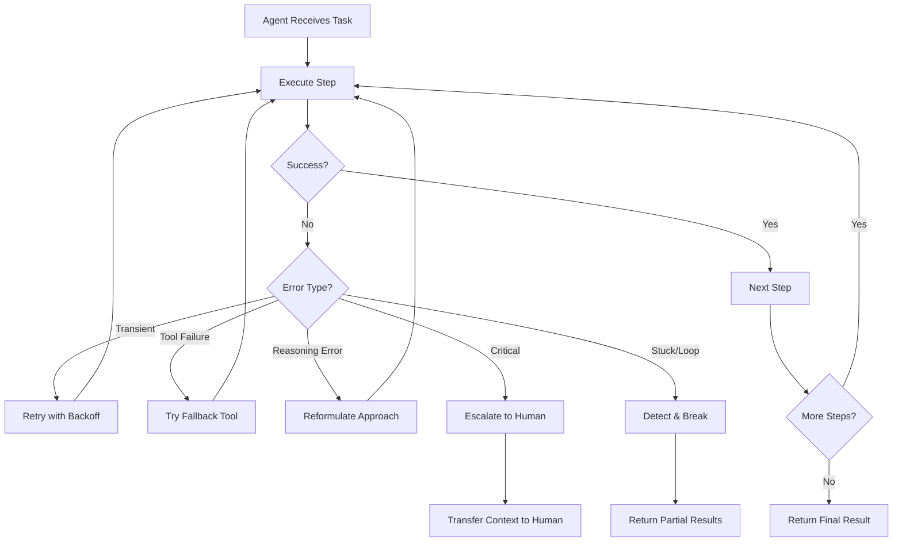

# Error Handling & Recovery

## Introduction

AI agents operate in inherently unpredictable environments — APIs go down, models hallucinate, tools return malformed data, and execution loops spin endlessly. Unlike traditional software where error handling follows well-defined exception hierarchies, agent errors span a spectrum from infrastructure failures (network timeouts) to cognitive failures (reasoning errors). Building agents that handle these failures gracefully is the difference between a demo that impresses and a production system that delivers.

This lesson covers the complete error handling lifecycle for AI agents: identifying what goes wrong, degrading gracefully when it does, retrying intelligently, falling back to simpler approaches, detecting when agents are stuck, and knowing when to escalate to humans.

### What we'll cover

| # | Topic | Description |
|---|-------|-------------|
| 01 | [Common Failure Modes](./01-common-failure-modes.md) | Tool failures, API errors, reasoning errors, infinite loops, and resource exhaustion |
| 02 | [Graceful Degradation](./02-graceful-degradation.md) | Partial success handling, reduced capability mode, and best-effort results |
| 03 | [Retry Strategies](./03-retry-strategies.md) | Intelligent retry, exponential backoff, retry limits, and alternative approaches |
| 04 | [Fallback Behaviors](./04-fallback-behaviors.md) | Simpler task execution, cached results, model fallbacks, and conservative defaults |
| 05 | [Stuck Detection](./05-stuck-detection.md) | Loop detection, progress monitoring, timeout triggers, and pattern recognition |
| 06 | [Human Escalation Triggers](./06-human-escalation-triggers.md) | Escalation conditions, handoff procedures, context transfer, and user notification |

### Prerequisites

- Understanding of [Agent Fundamentals](../01-agent-fundamentals/00-agent-fundamentals.md) and the agent loop
- Familiarity with [Execution Loop Patterns](../06-execution-loop-patterns/00-execution-loop-patterns.md) and step counting
- Knowledge of [State Management](../07-state-management/00-state-management.md) and checkpointing
- Basic Python exception handling (`try/except`, custom exceptions)

---

## Why error handling matters for agents

Traditional software errors are relatively predictable — you can enumerate most failure cases at design time. Agent errors are different because agents make autonomous decisions about which tools to call, what data to process, and how to combine results. A single user query can trigger dozens of API calls, each of which can fail independently.

Consider this real-world scenario: a research agent tasked with "Compare Q2 earnings for the top 5 tech companies." This single request might:

1. Call a search API to identify the top 5 companies — which could timeout
2. Call a financial API for each company — one might return a 429 rate limit error
3. Ask the LLM to analyze the data — which might hallucinate a number
4. Try to generate a chart — using a tool that's temporarily unavailable
5. Loop back to verify results — potentially spinning forever

Without proper error handling, *any* of these failures crashes the entire workflow. With proper error handling, the agent delivers partial results, retries where appropriate, falls back to simpler approaches, and escalates to humans when truly stuck.

---

## Framework error handling landscape

Each major agent framework provides different mechanisms for error handling:

| Framework | Key Error Handling Features |
|-----------|---------------------------|
| **OpenAI Agents SDK** | `max_turns`, `error_handlers`, guardrails (input/output/tool), exception hierarchy (`MaxTurnsExceeded`, `ModelBehaviorError`, `GuardrailTripwireTriggered`) |
| **LangGraph** | `recursion_limit`, `RemainingSteps` managed value, `interrupt()` for human escalation, node retry policies, checkpointing for recovery |
| **LangChain** | `max_iterations`, `handle_parsing_errors`, fallback chains with `.with_fallbacks()` |
| **CrewAI** | `max_iter`, `max_rpm`, task-level error handling, agent delegation |

> **🤖 AI Context:** Error handling in agent systems is fundamentally different from traditional software. You're not just catching exceptions — you're managing *cognitive failures* where the LLM itself makes incorrect decisions. This requires layered strategies: infrastructure-level retries, logic-level fallbacks, and human-level escalation.

---

## Summary

✅ Agent errors span infrastructure failures (network, API) to cognitive failures (reasoning, hallucination)

✅ Effective error handling requires a layered approach: retry → fallback → degrade → escalate

✅ Every major framework provides error handling primitives, but they must be combined into coherent strategies

✅ The goal is never "zero errors" — it's graceful recovery that preserves user trust

**Next:** [Common Failure Modes](./01-common-failure-modes.md)

---

## Further reading

- [OpenAI Agents SDK — Running Agents (Error Handlers & Exceptions)](https://openai.github.io/openai-agents-python/running_agents/) — Official SDK docs on error_handlers, max_turns, and exception types
- [LangGraph — Graph API (Recursion Limit & RemainingSteps)](https://docs.langchain.com/oss/python/langgraph/graph-api) — Proactive vs reactive recursion handling
- [LangGraph — Interrupts](https://docs.langchain.com/oss/python/langgraph/interrupts) — Human-in-the-loop error recovery via interrupt()
- [OpenAI Agents SDK — Guardrails](https://openai.github.io/openai-agents-python/guardrails/) — Input, output, and tool guardrails for error prevention
- [Tenacity Documentation](https://tenacity.readthedocs.io/en/latest/) — Python retry library with exponential backoff

*[Back to Error Handling & Recovery overview](./00-error-handling-recovery.md)*

<!--
Sources Consulted:
- OpenAI Agents SDK Running Agents: https://openai.github.io/openai-agents-python/running_agents/
- OpenAI Agents SDK Guardrails: https://openai.github.io/openai-agents-python/guardrails/
- LangGraph Graph API: https://docs.langchain.com/oss/python/langgraph/graph-api
- LangGraph Interrupts: https://docs.langchain.com/oss/python/langgraph/interrupts
- LangGraph Workflows and Agents: https://docs.langchain.com/oss/python/langgraph/workflows-agents
- Tenacity: https://tenacity.readthedocs.io/en/latest/
-->
