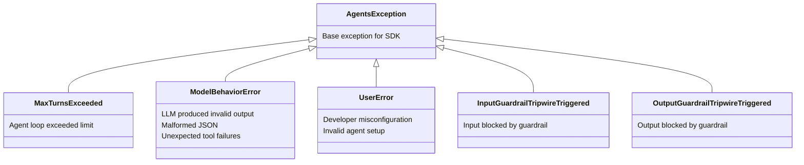

# Common Failure Modes

## Introduction

Before we can handle errors, we need to understand what goes wrong. Agent failures fall into five distinct categories: tool failures (external systems break), API errors (the LLM provider returns errors), reasoning errors (the model makes logically incorrect decisions), infinite loops (the agent cycles without progress), and resource exhaustion (time, money, or compute runs out). Each category demands a different handling strategy, and real-world agents often encounter multiple failure types simultaneously.

This lesson catalogs each failure mode with its root causes, how to detect it, and what it looks like across the OpenAI Agents SDK and LangGraph frameworks.

### What we'll cover

- Tool execution failures and their root causes
- API and LLM provider errors (rate limits, token limits, model errors)
- Reasoning and cognitive failures (hallucination, wrong tool selection)
- Infinite loops and recursive cycling
- Resource exhaustion (time, tokens, cost)

### Prerequisites

- Understanding of [Agent Fundamentals](../../01-agent-fundamentals/00-agent-fundamentals.md) and the agent loop
- Familiarity with [Tool Integration](../../05-tool-integration/00-tool-integration.md)
- Basic understanding of API error codes (HTTP 4xx/5xx)

---

## Tool execution failures

Tool failures are the most common error type in agent systems. When an agent calls a tool — a web search, database query, file reader, or API call — anything in the external world can fail. The agent framework captures the error and sends it back to the LLM as a tool result, but what happens next depends on your error handling strategy.

### Common tool failure causes

| Failure | Root Cause | Example |
|---------|-----------|---------|
| Network timeout | External service too slow | Search API takes 30+ seconds |
| Authentication failure | Invalid or expired credentials | API key rotated, token expired |
| Invalid input | Agent passes wrong arguments | Passing a string where an integer is expected |
| Service unavailable | External service is down | Database server restarted |
| Parsing failure | Unexpected response format | API returns HTML instead of JSON |
| Permission denied | Insufficient access rights | Agent tries to write to a read-only resource |

### What tool failures look like in practice

When a tool raises an exception, the framework converts it to a tool error message and sends it back to the LLM. The LLM then decides what to do — retry, try a different tool, or give up.

```python
from agents import Agent, Runner, function_tool

@function_tool
def search_web(query: str) -> str:
    """Search the web for information."""
    import httpx
    try:
        response = httpx.get(
            "https://api.search.example.com/search",
            params={"q": query},
            timeout=10.0
        )
        response.raise_for_status()
        return response.json()["results"]
    except httpx.TimeoutException:
        raise Exception(f"Search timed out for query: {query}")
    except httpx.HTTPStatusError as e:
        raise Exception(f"Search API error {e.response.status_code}: {e.response.text}")

agent = Agent(
    name="Researcher",
    instructions="Search for information. If a search fails, try rephrasing the query.",
    tools=[search_web],
)

# The SDK automatically converts tool exceptions to error messages
# that the LLM sees and can respond to
result = Runner.run_sync(agent, "Find recent AI research papers")
```

**Output (when tool succeeds):**
```
Here are some recent AI research papers I found...
```

**Output (when tool fails):**
```
I encountered an error searching for that. Let me try a different query...
```

> **Note:** By default, both OpenAI Agents SDK and LangGraph convert tool exceptions into error messages that the LLM receives. The LLM can then decide to retry, try a different approach, or report the failure. You don't need to catch every exception inside your tool — let the framework handle the conversion.

### Tool failure in LangGraph

In LangGraph, tool failures within a `tool_node` follow the same pattern — the exception becomes a `ToolMessage` with an error status:

```python
from langchain.tools import tool
from langgraph.graph import StateGraph, MessagesState, START, END

@tool
def query_database(sql: str) -> str:
    """Execute a SQL query against the analytics database."""
    import sqlite3
    try:
        conn = sqlite3.connect("analytics.db")
        result = conn.execute(sql).fetchall()
        conn.close()
        return str(result)
    except sqlite3.OperationalError as e:
        raise ValueError(f"SQL error: {e}")

def tool_node(state: MessagesState):
    """Execute tool calls, handling errors gracefully."""
    results = []
    for tool_call in state["messages"][-1].tool_calls:
        try:
            tool_fn = {"query_database": query_database}[tool_call["name"]]
            output = tool_fn.invoke(tool_call["args"])
        except Exception as e:
            output = f"Error executing {tool_call['name']}: {e}"
        
        from langchain.messages import ToolMessage
        results.append(
            ToolMessage(content=str(output), tool_call_id=tool_call["id"])
        )
    return {"messages": results}
```

**Output (on SQL error):**
```
Error executing query_database: SQL error: no such table: users
```

---

## API and LLM provider errors

API errors come from the LLM provider itself — OpenAI, Anthropic, Google, or any other service. These are fundamentally different from tool errors because they prevent the *agent loop itself* from progressing.

### Common API error types

| HTTP Status | Error Type | Cause | Retryable? |
|-------------|-----------|-------|------------|
| 429 | Rate limit exceeded | Too many requests per minute | ✅ Yes, with backoff |
| 400 | Invalid request | Malformed input, context too long | ❌ No (fix input) |
| 401 | Authentication error | Invalid API key | ❌ No (fix credentials) |
| 500 | Server error | Provider-side issue | ✅ Yes, with backoff |
| 503 | Service unavailable | Provider overloaded | ✅ Yes, with backoff |
| — | Context window exceeded | Input + output exceeds token limit | ❌ No (reduce input) |

### Distinguishing retryable vs non-retryable errors

This distinction is critical for building effective retry strategies. Retrying a 401 (bad API key) wastes time and money, while *not* retrying a 429 (rate limit) gives up prematurely.

```python
import httpx

def is_retryable_error(error: Exception) -> bool:
    """Determine if an API error is worth retrying."""
    if isinstance(error, httpx.HTTPStatusError):
        # Retry on rate limits and server errors
        return error.response.status_code in (429, 500, 502, 503, 504)
    if isinstance(error, (httpx.TimeoutException, httpx.ConnectError)):
        # Retry on network issues
        return True
    # Don't retry on client errors (400, 401, 403, 404)
    return False

# Example usage
try:
    response = httpx.post("https://api.openai.com/v1/chat/completions", ...)
except httpx.HTTPStatusError as e:
    if is_retryable_error(e):
        print(f"Retryable error: {e.response.status_code}")
    else:
        print(f"Fatal error: {e.response.status_code} — do not retry")
```

**Output (429 error):**
```
Retryable error: 429
```

**Output (401 error):**
```
Fatal error: 401 — do not retry
```

### OpenAI Agents SDK exception hierarchy

The OpenAI Agents SDK provides a structured exception hierarchy that helps classify errors:

```python
from agents.exceptions import (
    AgentsException,              # Base class for all SDK exceptions
    MaxTurnsExceeded,             # Agent exceeded max_turns limit
    ModelBehaviorError,           # LLM produced invalid output
    UserError,                    # Developer misconfiguration
    InputGuardrailTripwireTriggered,   # Input guardrail blocked execution
    OutputGuardrailTripwireTriggered,  # Output guardrail blocked execution
)
```



> **🤖 AI Context:** `ModelBehaviorError` is unique to LLM systems — it occurs when the model produces output that is structurally invalid (malformed JSON, impossible tool arguments). This sits between a traditional "server error" (not the model's fault) and a "logic error" (the model's fault), making it one of the hardest error types to handle consistently.

---

## Reasoning and cognitive failures

Reasoning errors occur when the LLM makes logically incorrect decisions — not because an API failed or a tool broke, but because the model's judgment was wrong. These are the hardest failures to detect because no exception is thrown.

### Types of reasoning failures

| Failure Type | Description | Detection Difficulty |
|-------------|-------------|---------------------|
| Hallucination | Model generates plausible but incorrect information | 🔴 Hard — requires external verification |
| Wrong tool selection | Model calls a tool that doesn't match the task | 🟡 Medium — can validate tool/task alignment |
| Incorrect arguments | Model passes plausible but wrong arguments to tools | 🟡 Medium — can validate with schemas |
| Premature completion | Model declares "done" before finishing all subtasks | 🟡 Medium — can check against task list |
| Circular reasoning | Model repeats the same reasoning without progress | 🟢 Easy — can detect repeated states |
| Ignoring context | Model ignores relevant information in its context window | 🔴 Hard — requires output analysis |

### Detecting reasoning errors with output guardrails

Output guardrails in the OpenAI Agents SDK allow you to validate agent responses before they reach the user:

```python
from pydantic import BaseModel
from agents import (
    Agent,
    GuardrailFunctionOutput,
    OutputGuardrailTripwireTriggered,
    RunContextWrapper,
    Runner,
    output_guardrail,
)

class FactCheckResult(BaseModel):
    contains_unverified_claims: bool
    reasoning: str

fact_check_agent = Agent(
    name="Fact Checker",
    instructions="Check if the response contains unverified factual claims.",
    output_type=FactCheckResult,
)

@output_guardrail
async def fact_check_guardrail(
    ctx: RunContextWrapper[None], agent: Agent, output: str
) -> GuardrailFunctionOutput:
    result = await Runner.run(fact_check_agent, output, context=ctx.context)
    return GuardrailFunctionOutput(
        output_info=result.final_output,
        tripwire_triggered=result.final_output.contains_unverified_claims,
    )

research_agent = Agent(
    name="Researcher",
    instructions="Answer research questions accurately.",
    output_guardrails=[fact_check_guardrail],
)

async def main():
    try:
        result = await Runner.run(
            research_agent, 
            "What is the current GDP of Atlantis?"
        )
        print(result.final_output)
    except OutputGuardrailTripwireTriggered:
        print("Response contained unverified claims — blocked by guardrail")
```

**Output:**
```
Response contained unverified claims — blocked by guardrail
```

### Validating tool selection with input guardrails

You can also prevent reasoning errors *before* they happen by validating the agent's plan:

```python
from agents import input_guardrail, InputGuardrailTripwireTriggered

@input_guardrail
async def validate_financial_request(
    ctx: RunContextWrapper[None], agent: Agent, input
) -> GuardrailFunctionOutput:
    """Block requests that require real-time financial data we can't verify."""
    input_text = str(input)
    dangerous_patterns = ["current stock price", "live trading", "real-time market"]
    is_dangerous = any(p in input_text.lower() for p in dangerous_patterns)
    
    return GuardrailFunctionOutput(
        output_info={"blocked": is_dangerous},
        tripwire_triggered=is_dangerous,
    )
```

**Output (on blocked request):**
```
InputGuardrailTripwireTriggered: Request for real-time financial data blocked
```

---

## Infinite loops and recursive cycling

Infinite loops occur when an agent repeats the same actions without making progress toward its goal. This is one of the most insidious failure modes because the agent *appears* to be working — it's calling tools, processing results, making decisions — but it's going in circles.

### Common causes of agent loops

1. **Contradictory instructions**: "Always verify your answer" + "Don't use tools" creates an unresolvable loop
2. **Ambiguous stopping conditions**: Agent doesn't know when it has "enough" information
3. **Tool output that re-triggers the same action**: Search returns "no results," agent retries with the same query
4. **Handoff cycles**: Agent A hands off to Agent B, which hands back to Agent A

### Framework protections against loops

Both frameworks provide built-in loop protection:

```python
# OpenAI Agents SDK — max_turns limits the total number of turns
from agents import Agent, Runner, MaxTurnsExceeded

agent = Agent(
    name="Researcher",
    instructions="Research this topic thoroughly.",
)

try:
    result = Runner.run_sync(agent, "Explain quantum computing", max_turns=5)
    print(result.final_output)
except MaxTurnsExceeded:
    print("Agent exceeded 5 turns without completing")
```

**Output (when loop detected):**
```
Agent exceeded 5 turns without completing
```

```python
# LangGraph — recursion_limit caps the number of super-steps
from langgraph.errors import GraphRecursionError

try:
    result = graph.invoke(
        {"messages": [HumanMessage(content="Research quantum computing")]},
        config={"recursion_limit": 25}
    )
except GraphRecursionError:
    print("Graph exceeded recursion limit of 25 steps")
```

**Output:**
```
Graph exceeded recursion limit of 25 steps
```

> **Warning:** `max_turns` and `recursion_limit` are safety nets, not solutions. If your agent regularly hits these limits, the root cause is usually in your instructions, tool design, or stopping conditions — not in the limit being too low.

---

## Resource exhaustion

Resource exhaustion occurs when an agent consumes too much of a bounded resource — time, tokens, API calls, or money. Unlike other failure modes, resource exhaustion often happens gradually and can be hard to detect until it's too late.

### Types of resource exhaustion

| Resource | Limit | Consequence | Detection |
|----------|-------|-------------|-----------|
| Tokens (input) | Context window size | Request rejected by API | API returns 400 error |
| Tokens (output) | Max output tokens | Response truncated | Check `finish_reason` |
| API calls | Rate limits | Requests throttled or rejected | 429 status code |
| Time | User patience / SLA | User abandons task | Wall clock monitoring |
| Cost | Budget limits | Bill shock | Token counting + pricing |
| Memory | System RAM | Process crashes | Memory monitoring |

### Tracking token usage

The OpenAI Agents SDK provides usage tracking through the run result:

```python
from agents import Agent, Runner

agent = Agent(
    name="Verbose Assistant",
    instructions="Provide extremely detailed answers.",
)

result = Runner.run_sync(agent, "Explain the history of computing")

# Access usage information
usage = result.raw_responses[-1].usage
print(f"Input tokens:  {usage.input_tokens}")
print(f"Output tokens: {usage.output_tokens}")
print(f"Total tokens:  {usage.total_tokens}")

# Cost estimation (example rates)
INPUT_COST = 0.003 / 1000   # $3 per 1M input tokens
OUTPUT_COST = 0.015 / 1000  # $15 per 1M output tokens
estimated_cost = (
    usage.input_tokens * INPUT_COST + 
    usage.output_tokens * OUTPUT_COST
)
print(f"Estimated cost: ${estimated_cost:.4f}")
```

**Output:**
```
Input tokens:  156
Output tokens: 1247
Total tokens:  1403
Estimated cost: $0.0192
```

### Implementing cost budgets

```python
class CostTracker:
    """Track cumulative costs across an agent session."""
    
    def __init__(self, budget: float):
        self.budget = budget
        self.total_cost = 0.0
        self.call_count = 0
    
    def record(self, input_tokens: int, output_tokens: int):
        cost = input_tokens * 0.003 / 1000 + output_tokens * 0.015 / 1000
        self.total_cost += cost
        self.call_count += 1
        
        if self.total_cost > self.budget:
            raise BudgetExceededError(
                f"Budget of ${self.budget:.2f} exceeded. "
                f"Total cost: ${self.total_cost:.4f} across {self.call_count} calls"
            )
    
    @property
    def remaining(self) -> float:
        return max(0, self.budget - self.total_cost)

class BudgetExceededError(Exception):
    pass

# Usage
tracker = CostTracker(budget=0.50)  # $0.50 budget
try:
    tracker.record(input_tokens=1000, output_tokens=5000)
    print(f"Cost so far: ${tracker.total_cost:.4f}, remaining: ${tracker.remaining:.4f}")
except BudgetExceededError as e:
    print(f"Budget exceeded: {e}")
```

**Output:**
```
Cost so far: $0.0780, remaining: $0.4220
```

---

## Best practices

| Practice | Why It Matters |
|----------|----------------|
| Classify errors as retryable vs fatal | Avoids wasting resources on unrecoverable errors |
| Let frameworks convert tool exceptions | The LLM can often self-correct when it sees the error message |
| Use guardrails for reasoning error prevention | Catches cognitive failures before they reach users |
| Set both `max_turns` *and* `recursion_limit` | Defense-in-depth against infinite loops |
| Track token usage and costs per session | Prevents bill shock and enables budget enforcement |
| Log every error with full context | Post-mortem analysis requires knowing the agent's state at failure time |

---

## Common pitfalls

| ❌ Mistake | ✅ Solution |
|-----------|-------------|
| Catching all exceptions inside tools (hiding errors from the LLM) | Let exceptions propagate — the framework converts them to informative error messages |
| Setting `max_turns` too high "just in case" | Start with a low limit (10–25) and increase based on observed behavior |
| Ignoring `ModelBehaviorError` | Handle it explicitly — it indicates the model produced structurally invalid output |
| Not distinguishing 429 from 401 errors | Retry 429s with backoff; fail fast on 401s |
| Assuming tool errors mean the task is impossible | The LLM can often reformulate its approach after seeing an error |
| Skipping cost tracking in development | Development costs add up; budget limits catch runaway loops early |

---

## Hands-on exercise

### Your task

Build an error classification system that categorizes agent errors and recommends the appropriate handling strategy.

### Requirements

1. Create an `AgentError` class hierarchy with at least 4 error types (tool, API, reasoning, resource)
2. Implement a `classify_error` function that takes an exception and returns the error category
3. Implement a `recommend_action` function that suggests retry, fallback, escalate, or abort based on the error type
4. Test with at least 5 different error scenarios

### Expected result

The classifier correctly categorizes different exception types and recommends appropriate actions (e.g., retry for timeouts, escalate for authentication failures, fallback for tool failures).

<details>
<summary>💡 Hints (click to expand)</summary>

- Use Python's exception hierarchy with a base `AgentError` class
- Include metadata like `retryable: bool` and `severity: str` in each error class
- Consider both the exception type *and* the HTTP status code when classifying
- Map each error category to a recommended action: retry, fallback, degrade, escalate, abort

</details>

<details>
<summary>✅ Solution (click to expand)</summary>

```python
from enum import Enum
from dataclasses import dataclass

class ErrorCategory(Enum):
    TOOL_FAILURE = "tool_failure"
    API_ERROR = "api_error"
    REASONING_ERROR = "reasoning_error"
    RESOURCE_EXHAUSTION = "resource_exhaustion"
    LOOP_DETECTED = "loop_detected"
    UNKNOWN = "unknown"

class RecommendedAction(Enum):
    RETRY = "retry"
    FALLBACK = "fallback"
    DEGRADE = "degrade"
    ESCALATE = "escalate"
    ABORT = "abort"

@dataclass
class ErrorClassification:
    category: ErrorCategory
    action: RecommendedAction
    retryable: bool
    severity: str  # low, medium, high, critical
    message: str

class AgentError(Exception):
    """Base class for agent errors."""
    pass

class ToolExecutionError(AgentError):
    def __init__(self, tool_name: str, original_error: Exception):
        self.tool_name = tool_name
        self.original_error = original_error
        super().__init__(f"Tool '{tool_name}' failed: {original_error}")

class APIProviderError(AgentError):
    def __init__(self, status_code: int, message: str):
        self.status_code = status_code
        super().__init__(f"API error {status_code}: {message}")

class ReasoningError(AgentError):
    def __init__(self, description: str):
        super().__init__(f"Reasoning failure: {description}")

class ResourceExhaustedError(AgentError):
    def __init__(self, resource: str, limit: str):
        self.resource = resource
        super().__init__(f"{resource} exhausted: {limit}")

def classify_error(error: Exception) -> ErrorClassification:
    """Classify an error and recommend an action."""
    if isinstance(error, ToolExecutionError):
        # Check if the underlying error is retryable
        original = error.original_error
        if isinstance(original, (TimeoutError, ConnectionError)):
            return ErrorClassification(
                category=ErrorCategory.TOOL_FAILURE,
                action=RecommendedAction.RETRY,
                retryable=True,
                severity="medium",
                message=f"Tool '{error.tool_name}' had a transient failure"
            )
        return ErrorClassification(
            category=ErrorCategory.TOOL_FAILURE,
            action=RecommendedAction.FALLBACK,
            retryable=False,
            severity="medium",
            message=f"Tool '{error.tool_name}' failed permanently"
        )
    
    if isinstance(error, APIProviderError):
        if error.status_code == 429:
            return ErrorClassification(
                category=ErrorCategory.API_ERROR,
                action=RecommendedAction.RETRY,
                retryable=True,
                severity="low",
                message="Rate limited — retry with exponential backoff"
            )
        if error.status_code in (500, 502, 503):
            return ErrorClassification(
                category=ErrorCategory.API_ERROR,
                action=RecommendedAction.RETRY,
                retryable=True,
                severity="medium",
                message="Server error — retry with backoff"
            )
        return ErrorClassification(
            category=ErrorCategory.API_ERROR,
            action=RecommendedAction.ABORT,
            retryable=False,
            severity="critical",
            message="Non-retryable API error"
        )
    
    if isinstance(error, ReasoningError):
        return ErrorClassification(
            category=ErrorCategory.REASONING_ERROR,
            action=RecommendedAction.ESCALATE,
            retryable=False,
            severity="high",
            message="Agent reasoning failure — requires human review"
        )
    
    if isinstance(error, ResourceExhaustedError):
        return ErrorClassification(
            category=ErrorCategory.RESOURCE_EXHAUSTION,
            action=RecommendedAction.DEGRADE,
            retryable=False,
            severity="high",
            message=f"Resource limit reached: {error.resource}"
        )
    
    return ErrorClassification(
        category=ErrorCategory.UNKNOWN,
        action=RecommendedAction.ESCALATE,
        retryable=False,
        severity="high",
        message=f"Unknown error: {error}"
    )

# Test scenarios
test_errors = [
    ToolExecutionError("search_web", TimeoutError("Connection timed out")),
    ToolExecutionError("database", PermissionError("Access denied")),
    APIProviderError(429, "Rate limit exceeded"),
    APIProviderError(401, "Invalid API key"),
    ReasoningError("Model hallucinated financial data"),
    ResourceExhaustedError("tokens", "Context window of 128K exceeded"),
]

for error in test_errors:
    result = classify_error(error)
    print(f"Error: {error}")
    print(f"  Category: {result.category.value}")
    print(f"  Action:   {result.action.value}")
    print(f"  Retry:    {result.retryable}")
    print(f"  Severity: {result.severity}")
    print()
```

**Output:**
```
Error: Tool 'search_web' failed: Connection timed out
  Category: tool_failure
  Action:   retry
  Retry:    True
  Severity: medium

Error: Tool 'database' failed: Access denied
  Category: tool_failure
  Action:   fallback
  Retry:    False
  Severity: medium

Error: API error 429: Rate limit exceeded
  Category: api_error
  Action:   retry
  Retry:    True
  Severity: low

Error: API error 401: Invalid API key
  Category: api_error
  Action:   abort
  Retry:    False
  Severity: critical

Error: Reasoning failure: Model hallucinated financial data
  Category: reasoning_error
  Action:   escalate
  Retry:    False
  Severity: high

Error: tokens exhausted: Context window of 128K exceeded
  Category: resource_exhaustion
  Action:   degrade
  Retry:    False
  Severity: high
```

</details>

### Bonus challenges

- [ ] Add a `LoopDetectedError` type that triggers when the same tool is called more than N times with identical arguments
- [ ] Integrate with Python's `logging` module to record error classifications with structured metadata
- [ ] Build a simple error dashboard that counts errors by category over time

---

## Summary

✅ Agent failures fall into five categories: tool failures, API errors, reasoning errors, infinite loops, and resource exhaustion

✅ Each category requires a different handling strategy — retrying a 401 error is as wasteful as not retrying a 429

✅ The OpenAI Agents SDK provides a structured exception hierarchy (`MaxTurnsExceeded`, `ModelBehaviorError`, guardrail exceptions) for programmatic error handling

✅ Reasoning errors are the hardest to detect because they don't throw exceptions — use output guardrails and validation to catch them

✅ Resource exhaustion (tokens, cost, time) requires proactive monitoring, not reactive exception handling

**Next:** [Graceful Degradation](./02-graceful-degradation.md)

---

## Further reading

- [OpenAI Agents SDK — Exceptions](https://openai.github.io/openai-agents-python/ref/exceptions/) — Complete exception reference
- [OpenAI Agents SDK — Guardrails](https://openai.github.io/openai-agents-python/guardrails/) — Input, output, and tool guardrails
- [HTTP Status Codes (MDN)](https://developer.mozilla.org/en-US/docs/Web/HTTP/Status) — Reference for API error codes
- [LangGraph — Graph API (Recursion Limit)](https://docs.langchain.com/oss/python/langgraph/graph-api) — Recursion limit and `RemainingSteps`

*[Back to Error Handling & Recovery overview](./00-error-handling-recovery.md)*

<!--
Sources Consulted:
- OpenAI Agents SDK Running Agents: https://openai.github.io/openai-agents-python/running_agents/
- OpenAI Agents SDK Guardrails: https://openai.github.io/openai-agents-python/guardrails/
- LangGraph Graph API: https://docs.langchain.com/oss/python/langgraph/graph-api
- Tenacity: https://tenacity.readthedocs.io/en/latest/
-->
