# Retry Strategies

## Introduction

Not every error is permanent. Network timeouts resolve, rate limits reset, and even LLM API servers recover from brief outages. Retry strategies let agents automatically recover from transient failures without human intervention. But retrying carelessly — too fast, too many times, or on the wrong error types — wastes resources and can make problems worse (a server already struggling under load doesn't need more requests).

This lesson covers intelligent retry strategies for AI agents: how to decide *what* to retry, *when* to wait, *how long* to keep trying, and *what alternatives* to try when retries fail. We'll use both the Python `tenacity` library for general-purpose retries and framework-specific retry mechanisms in LangGraph and the OpenAI Agents SDK.

### What we'll cover

- Deciding what to retry (retryable vs non-retryable errors)
- Exponential backoff and jitter patterns
- Retry limits and timeout budgets
- The `tenacity` library for production-grade retries
- Alternative approaches when retries fail
- Framework-specific retry support

### Prerequisites

- Understanding of [Common Failure Modes](./01-common-failure-modes.md) (especially retryable vs non-retryable errors)
- Familiarity with [Graceful Degradation](./02-graceful-degradation.md)
- Basic Python async/await knowledge

---

## When to retry (and when not to)

The first rule of retry strategies is: **only retry transient errors.** Retrying a permanent error (wrong API key, invalid input, insufficient permissions) wastes time and money without any chance of success.

### The retry decision matrix

```mermaid
flowchart TD
    A[Error Occurred] --> B{Is error transient?}
    B -->|Yes| C{Under retry limit?}
    B -->|No| D[Fail Immediately]
    C -->|Yes| E{Under time budget?}
    C -->|No| F[Fail — Retries Exhausted]
    E -->|Yes| G[Wait with Backoff]
    E -->|No| H[Fail — Timeout Budget Exceeded]
    G --> I[Retry Operation]
    I --> J{Success?}
    J -->|Yes| K[Return Result]
    J -->|No| A
```



### Classifying retryable errors

```python
# Errors that ARE worth retrying
RETRYABLE_ERRORS = {
    "rate_limit":       "429 Too Many Requests — wait and retry",
    "server_error":     "500/502/503 — provider-side issue, likely temporary",
    "timeout":          "Request timed out — network or server overload",
    "connection_reset": "Connection dropped — network interruption",
    "model_overloaded": "Model temporarily at capacity",
}

# Errors that are NOT worth retrying
NON_RETRYABLE_ERRORS = {
    "auth_error":       "401 — Invalid API key, won't fix itself",
    "bad_request":      "400 — Malformed input, same input = same error",
    "not_found":        "404 — Resource doesn't exist",
    "forbidden":        "403 — Insufficient permissions",
    "context_overflow": "Input too long for context window",
    "content_filter":   "Response blocked by safety filters",
    "invalid_schema":   "Structured output doesn't match expected schema",
}

def should_retry(error: Exception, status_code: int | None = None) -> bool:
    """Determine if an error is worth retrying."""
    # Network-level errors are always retryable
    if isinstance(error, (TimeoutError, ConnectionError, ConnectionResetError)):
        return True
    
    # HTTP status code-based decision
    if status_code is not None:
        return status_code in (429, 500, 502, 503, 504)
    
    # Check error message patterns
    error_msg = str(error).lower()
    retryable_patterns = ["rate limit", "overloaded", "timeout", "temporarily"]
    return any(p in error_msg for p in retryable_patterns)

# Test
print(should_retry(TimeoutError("Connection timed out")))        # True
print(should_retry(ValueError("Invalid API key"), 401))          # False
print(should_retry(Exception("Rate limit exceeded"), 429))       # True
print(should_retry(Exception("Invalid request body"), 400))      # False
```

**Output:**
```
True
False
True
False
```

---

## Exponential backoff

Exponential backoff is the most important retry pattern for distributed systems. Instead of retrying immediately (which hammers the already-struggling server), we wait progressively longer between each attempt: 1s → 2s → 4s → 8s → 16s. This gives the server time to recover.

### How exponential backoff works

The wait time follows the formula: $\text{wait} = \min(\text{base} \times 2^{\text{attempt}}, \text{max\_wait})$

```python
import time
import random

def exponential_backoff(
    attempt: int,
    base: float = 1.0,
    max_wait: float = 60.0,
    jitter: bool = True
) -> float:
    """Calculate wait time with exponential backoff and optional jitter."""
    # Base exponential: 1, 2, 4, 8, 16, 32, 60 (capped)
    wait = min(base * (2 ** attempt), max_wait)
    
    if jitter:
        # Add randomness to prevent thundering herd
        wait = random.uniform(0, wait)
    
    return round(wait, 2)

# Show backoff progression
print("Attempt | Backoff (no jitter) | Backoff (with jitter)")
print("--------|---------------------|---------------------")
for attempt in range(7):
    no_jitter = exponential_backoff(attempt, jitter=False)
    with_jitter = exponential_backoff(attempt, jitter=True)
    print(f"   {attempt}    |      {no_jitter:5.1f}s          |      {with_jitter:5.2f}s")
```

**Output:**
```
Attempt | Backoff (no jitter) | Backoff (with jitter)
--------|---------------------|---------------------
   0    |        1.0s          |      0.73s
   1    |        2.0s          |      1.42s
   2    |        4.0s          |      2.89s
   3    |        8.0s          |      5.17s
   4    |       16.0s          |     12.33s
   5    |       32.0s          |     21.06s
   6    |       60.0s          |     48.91s
```

> **💡 Tip:** Always add jitter (randomness) to exponential backoff. Without jitter, if 100 clients hit a rate limit at the same time, they all retry at exactly the same times — creating repeated traffic spikes. Jitter spreads retries across the wait window, preventing this "thundering herd" problem.

### Manual retry implementation

Before reaching for a library, it's important to understand the core pattern:

```python
import asyncio
import random

async def retry_with_backoff(
    operation,
    max_attempts: int = 5,
    base_delay: float = 1.0,
    max_delay: float = 60.0,
    retryable_exceptions: tuple = (TimeoutError, ConnectionError),
):
    """Retry an async operation with exponential backoff."""
    last_error = None
    
    for attempt in range(max_attempts):
        try:
            result = await operation()
            if attempt > 0:
                print(f"  ✅ Succeeded on attempt {attempt + 1}")
            return result
        except retryable_exceptions as e:
            last_error = e
            if attempt == max_attempts - 1:
                break  # Don't wait after last attempt
            
            delay = min(base_delay * (2 ** attempt), max_delay)
            delay = random.uniform(0, delay)  # Add jitter
            print(f"  ⚠️ Attempt {attempt + 1} failed: {e}. Retrying in {delay:.1f}s...")
            await asyncio.sleep(delay)
        except Exception as e:
            # Non-retryable error — fail immediately
            print(f"  ❌ Non-retryable error: {e}")
            raise
    
    raise Exception(f"All {max_attempts} attempts failed. Last error: {last_error}")

# Example usage
call_count = 0

async def flaky_api_call():
    """Simulates an API that fails twice then succeeds."""
    global call_count
    call_count += 1
    if call_count <= 2:
        raise TimeoutError("Request timed out")
    return "Success: data retrieved"

# result = await retry_with_backoff(flaky_api_call)
```

**Output:**
```
  ⚠️ Attempt 1 failed: Request timed out. Retrying in 0.7s...
  ⚠️ Attempt 2 failed: Request timed out. Retrying in 1.4s...
  ✅ Succeeded on attempt 3
```

---

## The tenacity library

For production agents, use the `tenacity` library instead of hand-rolling retry logic. It handles edge cases (async support, statistics, callbacks, retry state) that are easy to get wrong.

### Basic tenacity usage

```python
from tenacity import (
    retry,
    stop_after_attempt,
    stop_after_delay,
    wait_exponential,
    wait_random_exponential,
    retry_if_exception_type,
    retry_if_not_exception_type,
    before_sleep_log,
    RetryError,
)
import logging

logger = logging.getLogger(__name__)

# Retry up to 5 times with exponential backoff
@retry(
    stop=stop_after_attempt(5),
    wait=wait_exponential(multiplier=1, min=2, max=30),
    retry=retry_if_exception_type((TimeoutError, ConnectionError)),
    reraise=True,
)
def call_llm_api(prompt: str) -> str:
    """Call the LLM API with automatic retry."""
    # Simulated API call
    import random
    if random.random() < 0.5:
        raise TimeoutError("API timed out")
    return f"Response to: {prompt}"

try:
    result = call_llm_api("What is machine learning?")
    print(f"Result: {result}")
except TimeoutError:
    print("All retries exhausted")
```

**Output (when succeeds on attempt 3):**
```
Result: Response to: What is machine learning?
```

### Advanced tenacity patterns

```python
from tenacity import (
    retry,
    stop_after_attempt,
    stop_after_delay,
    wait_exponential,
    wait_random_exponential,
    retry_if_exception_type,
    before_sleep_log,
    after_log,
)

# Combine multiple stop conditions with |
@retry(
    stop=(stop_after_attempt(5) | stop_after_delay(30)),  # Whichever comes first
    wait=wait_random_exponential(multiplier=1, max=10),   # Random exponential
    retry=retry_if_exception_type((TimeoutError, ConnectionError)),
    before_sleep=before_sleep_log(logger, logging.WARNING),
    reraise=True,
)
def search_api(query: str) -> str:
    """Search with combined stop conditions."""
    # Stop after 5 attempts OR 30 seconds, whichever comes first
    pass

# Retry on specific HTTP status codes
import httpx

@retry(
    stop=stop_after_attempt(3),
    wait=wait_exponential(multiplier=1, min=1, max=10),
    retry=retry_if_exception_type(httpx.HTTPStatusError),
    reraise=True,
)
def fetch_with_retry(url: str) -> str:
    """Fetch a URL, retrying on server errors."""
    response = httpx.get(url, timeout=10.0)
    if response.status_code in (429, 500, 502, 503):
        response.raise_for_status()  # This triggers the retry
    return response.text
```

### Async tenacity for agent tools

```python
from tenacity import retry, stop_after_attempt, wait_exponential

@retry(
    stop=stop_after_attempt(3),
    wait=wait_exponential(multiplier=1, min=2, max=15),
    reraise=True,
)
async def async_tool_call(tool_name: str, args: dict) -> str:
    """Async tool execution with retry."""
    import httpx
    async with httpx.AsyncClient() as client:
        response = await client.post(
            f"https://api.tools.example.com/{tool_name}",
            json=args,
            timeout=10.0,
        )
        response.raise_for_status()
        return response.json()
```

### Accessing retry statistics

```python
from tenacity import retry, stop_after_attempt, wait_fixed

@retry(stop=stop_after_attempt(5), wait=wait_fixed(1))
def unreliable_operation():
    import random
    if random.random() < 0.7:
        raise Exception("Random failure")
    return "success"

try:
    result = unreliable_operation()
    stats = unreliable_operation.retry.statistics
    print(f"Result: {result}")
    print(f"Attempts: {stats.get('attempt_number', 'N/A')}")
    print(f"Total delay: {stats.get('idle_for', 0):.1f}s")
except Exception:
    print("All retries failed")
    stats = unreliable_operation.retry.statistics
    print(f"Total attempts: {stats.get('attempt_number', 'N/A')}")
```

**Output:**
```
Result: success
Attempts: 3
Total delay: 2.0s
```

---

## Alternative approaches when retries fail

Sometimes all retries fail for a specific approach, but an *alternative approach* can succeed. This is the bridge between retry strategies and fallback behaviors.

### Strategy rotation

```python
from dataclasses import dataclass
from typing import Callable, Any

@dataclass
class Strategy:
    name: str
    execute: Callable
    max_retries: int = 3

class StrategyRotator:
    """Try multiple strategies for the same goal."""
    
    def __init__(self, strategies: list[Strategy]):
        self.strategies = strategies
    
    async def execute(self, *args, **kwargs) -> dict:
        """Try each strategy in order with retries."""
        errors = []
        
        for strategy in self.strategies:
            for attempt in range(strategy.max_retries):
                try:
                    result = await strategy.execute(*args, **kwargs)
                    return {
                        "result": result,
                        "strategy_used": strategy.name,
                        "attempts": attempt + 1,
                        "strategies_tried": len(errors) + 1,
                    }
                except Exception as e:
                    errors.append({
                        "strategy": strategy.name,
                        "attempt": attempt + 1,
                        "error": str(e),
                    })
        
        raise Exception(
            f"All strategies failed after {len(errors)} total attempts: "
            + "; ".join(f"{e['strategy']}({e['attempt']}): {e['error']}" for e in errors)
        )

# Example: multiple search strategies
async def search_via_api(query: str) -> str:
    raise ConnectionError("API unavailable")

async def search_via_scraping(query: str) -> str:
    raise TimeoutError("Page load timed out")

async def search_via_cache(query: str) -> str:
    return f"Cached results for '{query}' (may be stale)"

rotator = StrategyRotator([
    Strategy("API Search", search_via_api, max_retries=2),
    Strategy("Web Scraping", search_via_scraping, max_retries=2),
    Strategy("Cache Lookup", search_via_cache, max_retries=1),
])

# result = await rotator.execute("transformer architectures")
# Output: {"result": "Cached results for...", "strategy_used": "Cache Lookup", ...}
```

### LLM-guided rephrasing

When a tool call fails, the agent can ask the LLM to reformulate the approach:

```python
from agents import Agent, function_tool, Runner

@function_tool
def search(query: str) -> str:
    """Search for information. Will fail on overly broad queries."""
    if len(query.split()) < 3:
        raise ValueError(
            f"Query too broad: '{query}'. "
            "Please use a more specific search query with at least 3 words."
        )
    return f"Results for: {query}"

agent = Agent(
    name="Adaptive Researcher",
    instructions=(
        "Search for information. If a search fails, "
        "read the error message carefully and reformulate your query. "
        "Try up to 3 different query formulations before giving up."
    ),
    tools=[search],
)

# The agent will see the error message and reformulate automatically
result = Runner.run_sync(agent, "Tell me about AI", max_turns=10)
print(result.final_output)
```

**Output:**
```
I found information about AI using the query "artificial intelligence recent developments"...
```

> **🤖 AI Context:** One of the most powerful retry strategies for LLM agents is *not* retrying the same call, but having the LLM *reformulate* its approach based on the error message. This is fundamentally different from traditional retry logic because the retry is *intelligent* — the agent learns from each failure and adapts its strategy.

---

## OpenAI Agents SDK error handlers

The OpenAI Agents SDK provides a built-in mechanism for handling `MaxTurnsExceeded` gracefully instead of raising an exception:

```python
from agents import (
    Agent,
    RunErrorHandlerInput,
    RunErrorHandlerResult,
    Runner,
)

agent = Agent(
    name="Research Assistant",
    instructions="Research the topic thoroughly. Use multiple sources.",
)

def on_max_turns(data: RunErrorHandlerInput[None]) -> RunErrorHandlerResult:
    """Handle max turns gracefully instead of raising an exception."""
    return RunErrorHandlerResult(
        final_output=(
            "I wasn't able to complete the full research within the turn limit. "
            "Here's what I found so far based on my partial analysis."
        ),
        include_in_history=False,  # Don't pollute conversation history
    )

result = Runner.run_sync(
    agent,
    "Conduct a comprehensive analysis of global AI regulation",
    max_turns=3,
    error_handlers={"max_turns": on_max_turns},
)
print(result.final_output)
```

**Output:**
```
I wasn't able to complete the full research within the turn limit. Here's what I found so far based on my partial analysis.
```

---

## Best practices

| Practice | Why It Matters |
|----------|----------------|
| Only retry transient errors | Retrying permanent errors wastes time and money |
| Always use exponential backoff | Prevents hammering overloaded services |
| Add jitter to backoff | Prevents thundering herd when many clients retry simultaneously |
| Set both attempt limits AND time budgets | Prevents unbounded retry loops |
| Use `tenacity` in production | Handles edge cases (async, stats, callbacks) that manual code misses |
| Let the LLM reformulate on failure | Intelligent retry beats blind retry |
| Log every retry with context | Post-mortem analysis needs to know what was retried and why |

---

## Common pitfalls

| ❌ Mistake | ✅ Solution |
|-----------|-------------|
| Retrying immediately without delay | Use exponential backoff — start at 1–2 seconds |
| No jitter on backoff | Add `random.uniform(0, wait)` to prevent thundering herd |
| Retrying non-retryable errors (401, 400) | Check `should_retry()` before each retry attempt |
| Unlimited retries | Set both `stop_after_attempt` AND `stop_after_delay` |
| Same retry strategy for all error types | Use different backoff profiles for rate limits vs server errors |
| Retrying the exact same request on tool failure | Let the LLM reformulate its approach based on the error message |
| Not tracking retry statistics | Use tenacity's `.retry.statistics` to monitor retry rates |

---

## Hands-on exercise

### Your task

Build a retry-aware API client using `tenacity` that handles different error types with appropriate strategies.

### Requirements

1. Create a `ResilientAPIClient` class that wraps HTTP calls with retry logic
2. Implement different retry strategies for different error types:
   - Rate limits (429): Exponential backoff starting at 5 seconds
   - Server errors (500/502/503): Exponential backoff starting at 1 second
   - Timeouts: 3 quick retries with 2-second fixed delay
3. Non-retryable errors (400, 401, 404) should fail immediately
4. Track and report retry statistics after each call
5. Set a global timeout budget of 60 seconds

### Expected result

The client handles rate limits with patient retries, server errors with moderate retries, and timeouts with quick retries. Non-retryable errors fail immediately without any retry attempts.

<details>
<summary>💡 Hints (click to expand)</summary>

- Use `tenacity.retry` with `retry_if_exception_type` to target specific exceptions
- Create custom exception classes for each error type (RateLimitError, ServerError, etc.)
- Use `stop=(stop_after_attempt(n) | stop_after_delay(60))` for combined limits
- Access statistics via `function.retry.statistics` after the call

</details>

<details>
<summary>✅ Solution (click to expand)</summary>

```python
from tenacity import (
    retry,
    stop_after_attempt,
    stop_after_delay,
    wait_exponential,
    wait_fixed,
    retry_if_exception_type,
    RetryError,
)

class RateLimitError(Exception):
    pass

class ServerError(Exception):
    pass

class TimeoutError_(Exception):  # Avoid shadowing builtin
    pass

class ClientError(Exception):
    """Non-retryable client error (400, 401, 404)."""
    pass

class ResilientAPIClient:
    def __init__(self, timeout_budget: float = 60.0):
        self.timeout_budget = timeout_budget
        self.total_retries = 0
    
    @retry(
        stop=(stop_after_attempt(5) | stop_after_delay(60)),
        wait=wait_exponential(multiplier=5, min=5, max=60),
        retry=retry_if_exception_type(RateLimitError),
        reraise=True,
    )
    def _handle_rate_limit(self, operation):
        return operation()
    
    @retry(
        stop=(stop_after_attempt(4) | stop_after_delay(60)),
        wait=wait_exponential(multiplier=1, min=1, max=30),
        retry=retry_if_exception_type(ServerError),
        reraise=True,
    )
    def _handle_server_error(self, operation):
        return operation()
    
    @retry(
        stop=stop_after_attempt(3),
        wait=wait_fixed(2),
        retry=retry_if_exception_type(TimeoutError_),
        reraise=True,
    )
    def _handle_timeout(self, operation):
        return operation()
    
    def call(self, operation, error_type: str = "auto"):
        """Execute with appropriate retry strategy."""
        handlers = {
            "rate_limit": self._handle_rate_limit,
            "server_error": self._handle_server_error,
            "timeout": self._handle_timeout,
        }
        
        handler = handlers.get(error_type)
        if handler is None:
            # No retry — execute directly
            return operation()
        
        try:
            result = handler(operation)
            stats = handler.retry.statistics
            print(f"  Strategy: {error_type}")
            print(f"  Attempts: {stats.get('attempt_number', 1)}")
            print(f"  Idle time: {stats.get('idle_for', 0):.1f}s")
            return result
        except RetryError as e:
            print(f"  All retries exhausted for {error_type}")
            raise e.last_attempt.result()

# Test scenarios
client = ResilientAPIClient()

# Test 1: Rate limit that resolves
attempt_count = 0
def rate_limited_api():
    global attempt_count
    attempt_count += 1
    if attempt_count <= 2:
        raise RateLimitError("429: Too Many Requests")
    return "Data retrieved successfully"

print("Test: Rate limit recovery")
result = client.call(rate_limited_api, "rate_limit")
print(f"  Result: {result}\n")

# Test 2: Client error (no retry)
print("Test: Client error (no retry)")
try:
    client.call(lambda: (_ for _ in ()).throw(ClientError("401: Unauthorized")))
except ClientError as e:
    print(f"  Failed immediately: {e}\n")
```

**Output:**
```
Test: Rate limit recovery
  Strategy: rate_limit
  Attempts: 3
  Idle time: 10.2s
  Result: Data retrieved successfully

Test: Client error (no retry)
  Failed immediately: 401: Unauthorized
```

</details>

### Bonus challenges

- [ ] Add a circuit breaker pattern that stops retrying after N consecutive failures across calls
- [ ] Implement adaptive backoff that uses the `Retry-After` header from 429 responses
- [ ] Create a retry dashboard that visualizes retry rates and success percentages over time

---

## Summary

✅ Only retry transient errors — retrying permanent errors wastes resources and delays failure notification

✅ Exponential backoff with jitter is the gold standard for distributed systems — prevents thundering herd

✅ The `tenacity` library provides production-grade retry logic with async support, statistics, and composable stop/wait/retry conditions

✅ LLM agents can perform *intelligent* retries by reformulating their approach based on error messages, not just repeating the same request

✅ The OpenAI Agents SDK `error_handlers` provide graceful completion instead of exception-based failure on `max_turns`

**Next:** [Fallback Behaviors](./04-fallback-behaviors.md)

---

## Further reading

- [Tenacity Documentation](https://tenacity.readthedocs.io/en/latest/) — Full reference for the Python retry library
- [AWS — Exponential Backoff and Jitter](https://aws.amazon.com/blogs/architecture/exponential-backoff-and-jitter/) — Classic article on backoff patterns
- [OpenAI Agents SDK — Error Handlers](https://openai.github.io/openai-agents-python/running_agents/) — `error_handlers` for graceful max_turns handling
- [Google Cloud — Retry Strategy Best Practices](https://cloud.google.com/apis/design/errors#retry_strategy) — Enterprise retry patterns

*[Back to Error Handling & Recovery overview](./00-error-handling-recovery.md)*

<!--
Sources Consulted:
- Tenacity docs: https://tenacity.readthedocs.io/en/latest/
- OpenAI Agents SDK Running Agents (error_handlers): https://openai.github.io/openai-agents-python/running_agents/
- LangGraph Graph API: https://docs.langchain.com/oss/python/langgraph/graph-api
-->
