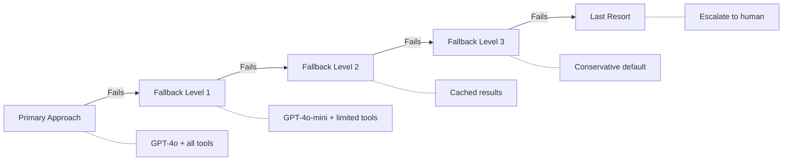

# Fallback Behaviors

## Introduction

Retries assume the same operation will eventually succeed. Fallbacks assume it won't — and switch to an *alternative* approach entirely. When the primary model is down, fall back to a simpler one. When a tool is unavailable, use a cached result. When a complex plan fails, execute a simpler version of the task. Fallback behaviors are the safety nets that keep agents functional when their preferred approaches are unavailable.

This lesson covers how to design and implement fallback chains for AI agents: simpler task execution, manual fallbacks to human input, cached result serving, conservative defaults, and model fallback chains that degrade gracefully.

### What we'll cover

- Fallback chains — cascading through alternatives
- Simpler task execution — reducing task complexity
- Cached results — serving stale data when fresh data is unavailable
- Conservative defaults — safe answers when uncertain
- Model fallback chains — degrading across model tiers
- Tool fallback patterns

### Prerequisites

- Understanding of [Retry Strategies](./03-retry-strategies.md) (fallbacks come after retries fail)
- Familiarity with [Graceful Degradation](./02-graceful-degradation.md)
- Basic knowledge of caching concepts

---

## Fallback chain architecture

A fallback chain defines a sequence of increasingly simpler approaches to accomplish a task. Each level in the chain trades quality for reliability — a simpler model is less capable but more available, cached data is stale but instant.



### Implementing a generic fallback chain

```python
from dataclasses import dataclass
from typing import Any, Callable

@dataclass
class FallbackLevel:
    name: str
    execute: Callable
    description: str

class FallbackChain:
    """Execute a chain of fallback strategies until one succeeds."""
    
    def __init__(self, levels: list[FallbackLevel]):
        self.levels = levels
    
    async def execute(self, *args, **kwargs) -> dict[str, Any]:
        """Try each level in order until one succeeds."""
        errors = []
        
        for i, level in enumerate(self.levels):
            try:
                result = await level.execute(*args, **kwargs)
                return {
                    "result": result,
                    "level_used": level.name,
                    "level_index": i,
                    "is_fallback": i > 0,
                    "errors_before": errors,
                }
            except Exception as e:
                errors.append({"level": level.name, "error": str(e)})
                print(f"  ⚠️ {level.name} failed: {e}")
        
        # All levels exhausted
        return {
            "result": None,
            "level_used": None,
            "is_fallback": True,
            "errors_before": errors,
            "error": "All fallback levels exhausted",
        }

# Example: search with multiple fallback levels
async def search_primary(query: str) -> str:
    raise ConnectionError("Primary search API is down")

async def search_backup(query: str) -> str:
    raise TimeoutError("Backup search timed out")

async def search_cache(query: str) -> str:
    return f"[Cached] Results for '{query}' from 2 hours ago"

async def search_default(query: str) -> str:
    return "I don't have access to search right now. Please try again later."

chain = FallbackChain([
    FallbackLevel("Primary API", search_primary, "Full-featured search"),
    FallbackLevel("Backup API", search_backup, "Secondary search provider"),
    FallbackLevel("Cache", search_cache, "Cached results (may be stale)"),
    FallbackLevel("Default", search_default, "Static fallback message"),
])

# result = await chain.execute("latest AI research")
```

**Output:**
```
  ⚠️ Primary API failed: Primary search API is down
  ⚠️ Backup API failed: Backup search timed out
Result: [Cached] Results for 'latest AI research' from 2 hours ago
Level used: Cache (fallback level 2)
```

---

## Simpler task execution

When an agent can't complete a complex task, it can fall back to a simpler version of that task. Instead of "analyze, compare, and visualize Q2 earnings for 5 companies," fall back to "summarize what you already know about Q2 earnings."

### Task simplification strategies

| Original Task | Simplified Fallback |
|---------------|-------------------|
| Multi-source research with analysis | Single-source lookup |
| Generate chart from live data | Describe data in text form |
| Execute SQL and analyze results | Return raw query results |
| Multi-step reasoning chain | Direct single-prompt answer |
| Real-time data aggregation | Use cached/historical data |

### Implementing task simplification

```python
from dataclasses import dataclass

@dataclass
class TaskVariant:
    complexity: str   # "full", "reduced", "minimal"
    description: str
    instructions: str
    tools: list[str]
    max_turns: int

class AdaptiveTask:
    """A task that can simplify itself when complex execution fails."""
    
    def __init__(self, task_name: str, variants: list[TaskVariant]):
        self.task_name = task_name
        self.variants = sorted(
            variants,
            key=lambda v: {"full": 0, "reduced": 1, "minimal": 2}[v.complexity]
        )
    
    def get_variant(self, index: int) -> TaskVariant | None:
        if index < len(self.variants):
            return self.variants[index]
        return None
    
    def simplification_message(self, current: TaskVariant, next_variant: TaskVariant) -> str:
        return (
            f"Simplifying '{self.task_name}' from {current.complexity} to "
            f"{next_variant.complexity} mode. {next_variant.description}"
        )

# Example: research task with multiple complexity levels
research_task = AdaptiveTask("market_research", [
    TaskVariant(
        complexity="full",
        description="Multi-source research with cross-referencing and visualization",
        instructions=(
            "Search multiple sources, cross-reference findings, "
            "identify trends, and generate a summary with data tables."
        ),
        tools=["web_search", "database_query", "chart_generator", "calculator"],
        max_turns=15,
    ),
    TaskVariant(
        complexity="reduced",
        description="Single-source research with text summary",
        instructions=(
            "Search for key information and provide a text summary. "
            "Skip cross-referencing and visualization."
        ),
        tools=["web_search", "calculator"],
        max_turns=8,
    ),
    TaskVariant(
        complexity="minimal",
        description="Direct answer from model knowledge",
        instructions=(
            "Based on your training data, provide the best answer you can. "
            "Clearly state that you could not access live data."
        ),
        tools=[],
        max_turns=3,
    ),
])

# Simulate cascade
for i, variant in enumerate(research_task.variants):
    print(f"Level {i}: {variant.complexity}")
    print(f"  Tools: {variant.tools}")
    print(f"  Max turns: {variant.max_turns}")
    print(f"  Description: {variant.description}")
    print()
```

**Output:**
```
Level 0: full
  Tools: ['web_search', 'database_query', 'chart_generator', 'calculator']
  Max turns: 15
  Description: Multi-source research with cross-referencing and visualization

Level 1: reduced
  Tools: ['web_search', 'calculator']
  Max turns: 8
  Description: Single-source research with text summary

Level 2: minimal
  Tools: []
  Max turns: 3
  Description: Direct answer from model knowledge
```

---

## Cached results

When live data sources are unavailable, serving cached (stale) results is often better than returning nothing. The key is clearly marking cached results with their age and expiry status.

### Cache-aware tool design

```python
import time
from dataclasses import dataclass, field
from typing import Any

@dataclass
class CacheEntry:
    key: str
    value: Any
    created_at: float
    ttl: float  # Time to live in seconds
    
    @property
    def age_seconds(self) -> float:
        return time.time() - self.created_at
    
    @property
    def is_expired(self) -> bool:
        return self.age_seconds > self.ttl
    
    @property
    def freshness(self) -> str:
        age = self.age_seconds
        if age < 60:
            return "fresh (< 1 minute old)"
        elif age < 3600:
            return f"recent ({age / 60:.0f} minutes old)"
        elif age < 86400:
            return f"stale ({age / 3600:.0f} hours old)"
        else:
            return f"very stale ({age / 86400:.0f} days old)"

class ToolCache:
    """Cache for tool results with staleness tracking."""
    
    def __init__(self, default_ttl: float = 3600):
        self.default_ttl = default_ttl
        self._cache: dict[str, CacheEntry] = {}
    
    def get(self, key: str) -> CacheEntry | None:
        return self._cache.get(key)
    
    def set(self, key: str, value: Any, ttl: float | None = None):
        self._cache[key] = CacheEntry(
            key=key,
            value=value,
            created_at=time.time(),
            ttl=ttl or self.default_ttl,
        )
    
    def get_or_fetch(self, key: str, fetch_fn, allow_stale: bool = True) -> dict:
        """Try to fetch fresh data; fall back to cache on failure."""
        try:
            # Try fresh fetch
            result = fetch_fn()
            self.set(key, result)
            return {
                "data": result,
                "source": "live",
                "freshness": "fresh (just fetched)",
            }
        except Exception as e:
            # Try cache
            cached = self.get(key)
            if cached is not None:
                if not cached.is_expired or allow_stale:
                    return {
                        "data": cached.value,
                        "source": "cache",
                        "freshness": cached.freshness,
                        "warning": f"Live fetch failed ({e}). Using cached data.",
                    }
            
            # No cache available
            raise Exception(
                f"Live fetch failed ({e}) and no cached data available for '{key}'"
            )

# Usage
cache = ToolCache(default_ttl=3600)

# Simulate: first call succeeds and populates cache
cache.set("weather_nyc", {"temp": 72, "condition": "sunny"})

# Later: live API fails, but cache saves us
result = cache.get_or_fetch(
    "weather_nyc",
    fetch_fn=lambda: (_ for _ in ()).throw(ConnectionError("Weather API down")),
    allow_stale=True,
)
print(f"Data: {result['data']}")
print(f"Source: {result['source']}")
print(f"Freshness: {result['freshness']}")
if "warning" in result:
    print(f"Warning: {result['warning']}")
```

**Output:**
```
Data: {'temp': 72, 'condition': 'sunny'}
Source: cache
Freshness: fresh (< 1 minute old)
Warning: Live fetch failed (Weather API down). Using cached data.
```

---

## Conservative defaults

When no data is available — not from live sources, not from cache — the safest fallback is a conservative default: an answer that's correct but general, or a clear "I don't know" that avoids making up information.

### Default response strategy

```python
from dataclasses import dataclass

@dataclass
class DefaultResponse:
    message: str
    confidence: float
    action_items: list[str]

# Domain-specific conservative defaults
CONSERVATIVE_DEFAULTS = {
    "financial": DefaultResponse(
        message=(
            "I'm unable to access current financial data at this time. "
            "For financial decisions, please consult a licensed financial advisor "
            "or check official sources like SEC.gov."
        ),
        confidence=0.0,
        action_items=[
            "Try again later when data sources are available",
            "Check official financial sources directly",
            "Consult a financial advisor for investment decisions",
        ],
    ),
    "medical": DefaultResponse(
        message=(
            "I'm unable to provide medical information right now. "
            "Please consult a healthcare professional for medical advice."
        ),
        confidence=0.0,
        action_items=[
            "Contact your healthcare provider",
            "Call emergency services if urgent",
        ],
    ),
    "general": DefaultResponse(
        message=(
            "I wasn't able to find a reliable answer to your question. "
            "This could be due to temporary service issues. "
            "Please try again shortly."
        ),
        confidence=0.0,
        action_items=["Try again in a few minutes"],
    ),
}

def get_safe_default(domain: str = "general") -> DefaultResponse:
    """Return a conservative default response for the given domain."""
    return CONSERVATIVE_DEFAULTS.get(domain, CONSERVATIVE_DEFAULTS["general"])

# Example usage
default = get_safe_default("financial")
print(f"Message: {default.message}")
print(f"Confidence: {default.confidence}")
print(f"Suggested actions:")
for action in default.action_items:
    print(f"  - {action}")
```

**Output:**
```
Message: I'm unable to access current financial data at this time. For financial decisions, please consult a licensed financial advisor or check official sources like SEC.gov.
Confidence: 0.0
Suggested actions:
  - Try again later when data sources are available
  - Check official financial sources directly
  - Consult a financial advisor for investment decisions
```

> **Warning:** Conservative defaults must be *truly* conservative. A financial agent that falls back to "Based on general trends, the stock should go up" is worse than one that says "I can't access financial data right now." The default must never hallucinate.

---

## Model fallback chains

When a primary model is unavailable or too slow, falling back to a simpler model is often the right trade-off. The key is adjusting expectations (instructions, output format, tool availability) for each model tier.

### Configuring model fallbacks in the OpenAI Agents SDK

```python
from agents import Agent, Runner, RunConfig
from agents.exceptions import AgentsException

async def run_with_model_fallback(
    prompt: str,
    model_chain: list[str],
    instructions: str = "You are a helpful assistant.",
) -> dict:
    """Try models in order until one succeeds."""
    for i, model_id in enumerate(model_chain):
        try:
            agent = Agent(
                name="Assistant",
                instructions=instructions,
                model=model_id,
            )
            result = await Runner.run(agent, prompt)
            return {
                "output": result.final_output,
                "model_used": model_id,
                "is_fallback": i > 0,
                "models_tried": i + 1,
            }
        except AgentsException as e:
            print(f"  ⚠️ {model_id} failed: {e}")
            if i == len(model_chain) - 1:
                raise  # Last model — propagate the error
    
    raise AgentsException("All models in fallback chain failed")

# Usage
# result = await run_with_model_fallback(
#     prompt="Explain quantum entanglement",
#     model_chain=["gpt-4o", "gpt-4o-mini", "gpt-3.5-turbo"],
# )
```

### Using RunConfig for model override

The OpenAI Agents SDK's `RunConfig` lets you override the model at runtime without changing the agent definition:

```python
from agents import Agent, Runner, RunConfig

agent = Agent(
    name="Analyzer",
    instructions="Analyze the given data thoroughly.",
    model="gpt-4o",  # Default model
)

# Override model at runtime via RunConfig
result = Runner.run_sync(
    agent,
    "Summarize this report",
    run_config=RunConfig(model="gpt-4o-mini"),  # Use cheaper model
)
```

### LangChain fallback chains

LangChain provides a built-in `.with_fallbacks()` method for model fallback:

```python
from langchain_openai import ChatOpenAI

# Primary model with fallbacks
primary = ChatOpenAI(model="gpt-4o", timeout=10)
fallback_1 = ChatOpenAI(model="gpt-4o-mini", timeout=10)
fallback_2 = ChatOpenAI(model="gpt-3.5-turbo", timeout=10)

# Chain them — tries each in order
model_with_fallback = primary.with_fallbacks([fallback_1, fallback_2])

# This transparently tries gpt-4o first, then gpt-4o-mini, then gpt-3.5-turbo
# response = model_with_fallback.invoke("Explain neural networks")
```

> **🤖 AI Context:** Model fallback chains trade capability for reliability. A GPT-4o response will be more nuanced than GPT-3.5-turbo, but a GPT-3.5-turbo response is infinitely better than an error message. Always design your instructions and output schemas to work across all models in the chain.

---

## Best practices

| Practice | Why It Matters |
|----------|----------------|
| Define fallback chains at design time | Runtime improvisation leads to inconsistent behavior |
| Clearly mark fallback responses | Users need to know when they're getting degraded service |
| Cache aggressively for tool results | Cached data is the cheapest, fastest fallback |
| Adjust instructions per model tier | Simpler models need simpler instructions |
| Set domain-specific defaults | Financial, medical, and general defaults have very different safety requirements |
| Test fallback paths regularly | Fallbacks that are never tested are fallbacks that don't work |

---

## Common pitfalls

| ❌ Mistake | ✅ Solution |
|-----------|-------------|
| No fallback plan — crash on first failure | Design at least 3 levels: primary → backup → default |
| Serving expired cache without disclosure | Always include cache age and staleness warnings |
| Conservative defaults that still hallucinate | Defaults must say "I don't know" — never guess |
| Same instructions for all model tiers | Simplify instructions and reduce tool count for smaller models |
| Fallback to a model that doesn't support tools | Verify tool/structured output support before adding to chain |
| Never testing the fallback path | Periodically disable primary systems to verify fallbacks work |

---

## Hands-on exercise

### Your task

Build a complete fallback chain for a research agent that degrades through 4 levels.

### Requirements

1. **Level 0 (Primary):** Search API + LLM analysis — full-featured research
2. **Level 1 (Backup):** Alternative search + simpler analysis
3. **Level 2 (Cache):** Return cached results with staleness indicator
4. **Level 3 (Default):** Conservative "I can't access data right now" response
5. Each level should return a result dict with: `data`, `source`, `confidence`, `warnings`
6. Simulate failures at levels 0 and 1 to demonstrate the cascade

### Expected result

The system cascades through levels 0 and 1 (which fail), uses level 2 (cached data), and returns results with appropriate warnings about data staleness.

<details>
<summary>💡 Hints (click to expand)</summary>

- Use the `FallbackChain` class from this lesson as a starting point
- Pre-populate the cache with sample data before running
- Include cache age in the response warnings
- Return confidence as a float: 1.0 for primary, 0.7 for backup, 0.4 for cache, 0.0 for default

</details>

<details>
<summary>✅ Solution (click to expand)</summary>

```python
import time

class ResearchFallbackChain:
    def __init__(self):
        self.cache = {
            "AI regulation": {
                "data": "EU AI Act passed in 2024, covering high-risk AI systems...",
                "cached_at": time.time() - 7200,  # 2 hours ago
            }
        }
    
    def _search_primary(self, query: str) -> dict:
        raise ConnectionError("Primary search API is down")
    
    def _search_backup(self, query: str) -> dict:
        raise TimeoutError("Backup search timed out after 15 seconds")
    
    def _search_cache(self, query: str) -> dict:
        if query in self.cache:
            entry = self.cache[query]
            age_minutes = (time.time() - entry["cached_at"]) / 60
            return {
                "data": entry["data"],
                "source": "cache",
                "confidence": 0.4,
                "warnings": [
                    f"Using cached data ({age_minutes:.0f} minutes old)",
                    "Results may not reflect the latest information",
                ],
            }
        raise KeyError(f"No cached data for '{query}'")
    
    def _default_response(self, query: str) -> dict:
        return {
            "data": (
                f"I'm unable to research '{query}' right now due to service issues. "
                "Please try again later or consult primary sources directly."
            ),
            "source": "default",
            "confidence": 0.0,
            "warnings": ["No live or cached data available"],
        }
    
    def research(self, query: str) -> dict:
        levels = [
            ("Primary API", self._search_primary),
            ("Backup API", self._search_backup),
            ("Cache", self._search_cache),
            ("Default", self._default_response),
        ]
        
        for name, fn in levels:
            try:
                result = fn(query)
                result["level_used"] = name
                return result
            except Exception as e:
                print(f"  ⚠️ {name} failed: {e}")
        
        return self._default_response(query)

# Test
chain = ResearchFallbackChain()
result = chain.research("AI regulation")
print(f"\nResult:")
print(f"  Data: {result['data'][:60]}...")
print(f"  Source: {result['source']}")
print(f"  Confidence: {result['confidence']}")
print(f"  Level: {result['level_used']}")
for w in result.get("warnings", []):
    print(f"  ⚠️ {w}")
```

**Output:**
```
  ⚠️ Primary API failed: Primary search API is down
  ⚠️ Backup API failed: Backup search timed out after 15 seconds

Result:
  Data: EU AI Act passed in 2024, covering high-risk AI systems...
  Source: cache
  Confidence: 0.4
  Level: Cache
  ⚠️ Using cached data (120 minutes old)
  ⚠️ Results may not reflect the latest information
```

</details>

### Bonus challenges

- [ ] Add automatic cache population — when a primary or backup request succeeds, cache the result
- [ ] Implement cache invalidation based on query type (financial data expires in minutes, general knowledge in hours)
- [ ] Add a "warm cache" strategy that pre-fetches common queries on application startup

---

## Summary

✅ Fallback chains define a sequence of increasingly simpler approaches — each trading quality for reliability

✅ Task simplification reduces complexity (fewer tools, fewer sources, simpler analysis) while still producing useful output

✅ Cached results are the fastest, cheapest fallback — but must include staleness indicators

✅ Conservative defaults should never hallucinate — "I don't know" is always safer than a guess

✅ Model fallback chains (`gpt-4o` → `gpt-4o-mini` → `gpt-3.5-turbo`) trade capability for availability

**Next:** [Stuck Detection](./05-stuck-detection.md)

---

## Further reading

- [LangChain — Fallbacks](https://python.langchain.com/docs/how_to/fallbacks/) — `.with_fallbacks()` for model and chain fallbacks
- [OpenAI Agents SDK — RunConfig](https://openai.github.io/openai-agents-python/running_agents/) — Runtime model override via `RunConfig`
- [Caching Strategies (AWS)](https://aws.amazon.com/caching/) — Cache patterns for distributed systems

*[Back to Error Handling & Recovery overview](./00-error-handling-recovery.md)*

<!--
Sources Consulted:
- OpenAI Agents SDK Running Agents (RunConfig): https://openai.github.io/openai-agents-python/running_agents/
- LangGraph Graph API: https://docs.langchain.com/oss/python/langgraph/graph-api
- LangGraph Workflows and Agents: https://docs.langchain.com/oss/python/langgraph/workflows-agents
-->
