# Stuck detection

## Introduction

An agent that's "stuck" burns tokens, wastes time, and delivers nothing useful. Unlike a crash — which at least produces an error message — a stuck agent *looks* like it's working. It calls tools, generates text, and consumes resources, all while making zero progress toward its goal.

In this lesson, we'll build detection systems that identify stuck agents before they exhaust your budget. We'll cover loop detection through state fingerprinting, progress monitoring with measurable milestones, timeout mechanisms, and pattern recognition for common stuck behaviors.

### What we'll cover

- Detecting repeated states and circular tool-call patterns
- Monitoring measurable progress toward task completion
- Implementing time-based and step-based safety limits
- Recognizing common stuck patterns through output analysis

### Prerequisites

- [Common Failure Modes](./01-common-failure-modes.md) — understanding infinite loops and resource exhaustion
- [Retry Strategies](./03-retry-strategies.md) — when retries themselves can cause stuck states
- [Fallback Behaviors](./04-fallback-behaviors.md) — what to do *after* detecting a stuck agent

---

## Loop detection

The most common stuck behavior is looping — an agent repeatedly performing the same action or cycling through the same set of actions. We need to detect this *programmatically* because the agent itself doesn't realize it's stuck.

### State fingerprinting

The core technique is **state fingerprinting**: hash the agent's observable state at each step and compare it against recent history. If we see the same fingerprint twice, the agent is looping.

```python
import hashlib
import json
from dataclasses import dataclass, field
from collections import deque


@dataclass
class StateFingerprint:
    """Creates comparable fingerprints from agent state."""
    
    tool_name: str
    tool_args_hash: str
    output_hash: str
    
    @classmethod
    def from_step(cls, tool_name: str, tool_args: dict, output: str) -> "StateFingerprint":
        """Create a fingerprint from a single agent step."""
        args_hash = hashlib.md5(
            json.dumps(tool_args, sort_keys=True).encode()
        ).hexdigest()[:8]
        
        output_hash = hashlib.md5(
            output.encode()
        ).hexdigest()[:8]
        
        return cls(
            tool_name=tool_name,
            tool_args_hash=args_hash,
            output_hash=output_hash
        )
    
    def __hash__(self):
        return hash((self.tool_name, self.tool_args_hash, self.output_hash))
    
    def __eq__(self, other):
        return (
            self.tool_name == other.tool_name
            and self.tool_args_hash == other.tool_args_hash
            and self.output_hash == other.output_hash
        )


@dataclass
class LoopDetector:
    """Detects repeated states in agent execution."""
    
    window_size: int = 20
    max_repeats: int = 2
    history: deque = field(default_factory=lambda: deque(maxlen=20))
    
    def record_step(self, tool_name: str, tool_args: dict, output: str) -> dict:
        """Record a step and check for loops. Returns detection result."""
        fingerprint = StateFingerprint.from_step(tool_name, tool_args, output)
        
        # Count how many times this exact state has appeared
        repeat_count = sum(1 for fp in self.history if fp == fingerprint)
        self.history.append(fingerprint)
        
        if repeat_count >= self.max_repeats:
            return {
                "stuck": True,
                "reason": "exact_repeat",
                "detail": f"Tool '{tool_name}' called with identical args "
                          f"and output {repeat_count + 1} times",
                "repeat_count": repeat_count + 1
            }
        
        return {"stuck": False}


# Usage
detector = LoopDetector(window_size=20, max_repeats=2)

# Simulate a stuck agent calling the same search repeatedly
steps = [
    ("web_search", {"query": "Python async tutorial"}, "No results found"),
    ("web_search", {"query": "Python async tutorial"}, "No results found"),
    ("web_search", {"query": "Python async tutorial"}, "No results found"),
]

for tool, args, output in steps:
    result = detector.record_step(tool, args, output)
    if result["stuck"]:
        print(f"🔴 STUCK: {result['detail']}")
    else:
        print(f"🟢 OK: {tool}({args})")
```

**Output:**
```
🟢 OK: web_search({'query': 'Python async tutorial'})
🟢 OK: web_search({'query': 'Python async tutorial'})
🔴 STUCK: Tool 'web_search' called with identical args and output 3 times
```

### Cycle detection

Exact repeats are easy. Harder is detecting **cycles** — sequences like A → B → C → A → B → C where no single step repeats but the overall pattern does:

```python
from typing import Optional


class CycleDetector:
    """Detects repeating sequences (cycles) in agent behavior."""
    
    def __init__(self, min_cycle_length: int = 2, max_cycle_length: int = 6):
        self.min_cycle_length = min_cycle_length
        self.max_cycle_length = max_cycle_length
        self.tool_sequence: list[str] = []
    
    def record_tool(self, tool_name: str) -> Optional[dict]:
        """Record a tool call and check for cycles."""
        self.tool_sequence.append(tool_name)
        
        # Need at least 2x the minimum cycle length to detect
        if len(self.tool_sequence) < self.min_cycle_length * 2:
            return None
        
        # Check for cycles of different lengths
        for length in range(self.min_cycle_length, self.max_cycle_length + 1):
            if self._has_cycle(length):
                cycle = self.tool_sequence[-length:]
                return {
                    "stuck": True,
                    "reason": "cycle_detected",
                    "cycle": cycle,
                    "cycle_length": length,
                    "detail": f"Repeating cycle: {' → '.join(cycle)}"
                }
        
        return None
    
    def _has_cycle(self, length: int) -> bool:
        """Check if the last N items repeat the previous N items."""
        seq = self.tool_sequence
        if len(seq) < length * 2:
            return False
        
        recent = seq[-length:]
        previous = seq[-length * 2:-length]
        return recent == previous


# Usage
detector = CycleDetector(min_cycle_length=2, max_cycle_length=5)

tools_called = [
    "search_docs", "parse_result", "validate",
    "search_docs", "parse_result", "validate",  # Cycle!
]

for tool in tools_called:
    result = detector.record_tool(tool)
    if result and result["stuck"]:
        print(f"🔴 CYCLE: {result['detail']}")
        break
    else:
        print(f"🟢 Step: {tool}")
```

**Output:**
```
🟢 Step: search_docs
🟢 Step: parse_result
🟢 Step: validate
🟢 Step: search_docs
🟢 Step: parse_result
🔴 CYCLE: Repeating cycle: search_docs → parse_result → validate
```

> **🤖 AI Context:** LLMs are particularly prone to cycles because each iteration gives them the same context, leading to the same "next best action." Breaking cycles requires injecting new information or constraints.

---

## Progress monitoring

Loop detection catches *repetitive* stuck states. But an agent can also be stuck while doing *different things* — exploring tangents, gathering irrelevant information, or refining answers that were already good enough. We need to measure **progress toward the goal**.

### Milestone-based tracking

Define measurable milestones for a task and track how many the agent has completed:

```python
from dataclasses import dataclass, field
from enum import Enum
from time import time
from typing import Optional


class MilestoneStatus(Enum):
    PENDING = "pending"
    IN_PROGRESS = "in_progress"
    COMPLETED = "completed"
    SKIPPED = "skipped"


@dataclass
class Milestone:
    name: str
    description: str
    status: MilestoneStatus = MilestoneStatus.PENDING
    completed_at: Optional[float] = None


@dataclass
class ProgressMonitor:
    """Tracks agent progress through defined milestones."""
    
    milestones: list[Milestone] = field(default_factory=list)
    stall_threshold_seconds: float = 60.0
    last_progress_time: float = field(default_factory=time)
    steps_since_progress: int = 0
    max_steps_without_progress: int = 10
    
    def add_milestone(self, name: str, description: str):
        """Add a milestone to track."""
        self.milestones.append(Milestone(name=name, description=description))
    
    def complete_milestone(self, name: str):
        """Mark a milestone as completed."""
        for m in self.milestones:
            if m.name == name and m.status != MilestoneStatus.COMPLETED:
                m.status = MilestoneStatus.COMPLETED
                m.completed_at = time()
                self.last_progress_time = time()
                self.steps_since_progress = 0
                return True
        return False
    
    def record_step(self) -> dict:
        """Record a step and check for stalling."""
        self.steps_since_progress += 1
        elapsed = time() - self.last_progress_time
        
        result = {
            "progress_pct": self.progress_percentage,
            "steps_without_progress": self.steps_since_progress,
            "seconds_since_progress": round(elapsed, 1),
            "stalled": False,
            "reason": None
        }
        
        if self.steps_since_progress >= self.max_steps_without_progress:
            result["stalled"] = True
            result["reason"] = (
                f"No milestone progress in {self.steps_since_progress} steps"
            )
        
        if elapsed >= self.stall_threshold_seconds:
            result["stalled"] = True
            result["reason"] = (
                f"No milestone progress in {elapsed:.0f}s"
            )
        
        return result
    
    @property
    def progress_percentage(self) -> float:
        """Calculate completion percentage."""
        if not self.milestones:
            return 0.0
        completed = sum(
            1 for m in self.milestones
            if m.status == MilestoneStatus.COMPLETED
        )
        return round(completed / len(self.milestones) * 100, 1)
    
    def summary(self) -> str:
        """Human-readable progress summary."""
        lines = [f"Progress: {self.progress_percentage}%"]
        for m in self.milestones:
            icon = {"completed": "✅", "pending": "⬜", 
                    "in_progress": "🔄", "skipped": "⏭️"}
            lines.append(f"  {icon[m.status.value]} {m.name}")
        return "\n".join(lines)


# Usage
monitor = ProgressMonitor(max_steps_without_progress=5)
monitor.add_milestone("gather_data", "Collect source information")
monitor.add_milestone("analyze", "Analyze collected data")
monitor.add_milestone("synthesize", "Create final answer")

# Simulate: agent completes first milestone, then stalls
monitor.complete_milestone("gather_data")

for i in range(6):
    result = monitor.record_step()
    if result["stalled"]:
        print(f"⚠️ Step {i + 1}: STALLED — {result['reason']}")
        print(f"   Progress: {result['progress_pct']}%")
    else:
        print(f"🟢 Step {i + 1}: OK ({result['progress_pct']}% complete)")

print(f"\n{monitor.summary()}")
```

**Output:**
```
🟢 Step 1: OK (33.3% complete)
🟢 Step 2: OK (33.3% complete)
🟢 Step 3: OK (33.3% complete)
🟢 Step 4: OK (33.3% complete)
⚠️ Step 5: STALLED — No milestone progress in 5 steps
   Progress: 33.3%
⚠️ Step 6: STALLED — No milestone progress in 6 steps
   Progress: 33.3%

Progress: 33.3%
  ✅ gather_data
  ⬜ analyze
  ⬜ synthesize
```

### Framework safety limits

Both major agent frameworks provide built-in step limits that serve as ultimate safety nets:

```python
# OpenAI Agents SDK — max_turns limits agent iterations
from agents import Runner

result = await Runner.run(
    agent,
    input="Research quantum computing advances",
    max_turns=25  # Hard limit: agent stops after 25 turns
)

# What happens when exceeded:
# - Raises MaxTurnsExceeded exception
# - Or calls your error_handler if configured:
async def handle_max_turns(ctx, error):
    """Custom handler when agent hits turn limit."""
    from agents import RunErrorHandlerResult
    return RunErrorHandlerResult(
        output="I've spent too many steps on this. Here's what "
               f"I found so far: {ctx.context.get('partial_results', 'N/A')}",
        stop_running=True
    )

from agents import Agent

agent = Agent(
    name="researcher",
    instructions="Research the given topic thoroughly.",
    error_handlers={"max_turns": handle_max_turns}
)
```

```python
# LangGraph — recursion_limit in config
from langgraph.graph import StateGraph

graph = builder.compile()

result = await graph.ainvoke(
    {"messages": [("user", "Analyze this dataset")]},
    config={"recursion_limit": 50}  # Hard limit: 50 graph steps
)

# What happens when exceeded:
# - Raises GraphRecursionError
# - Can be caught and handled:
from langgraph.errors import GraphRecursionError

try:
    result = await graph.ainvoke(inputs, config={"recursion_limit": 50})
except GraphRecursionError:
    print("Agent exceeded step limit — returning partial results")
```

> **Warning:** Framework limits are a **last resort**, not a detection mechanism. By the time `max_turns` or `recursion_limit` triggers, the agent has already consumed significant resources. Use the progress monitoring and loop detection techniques from this lesson to catch problems *earlier*.

---

## Timeout mechanisms

Step counts alone don't capture wall-clock time. An agent might make only 5 tool calls, but if each one takes 30 seconds due to slow APIs, that's 2.5 minutes of waiting. We need time-based limits too.

### Wall-clock monitoring

```python
import asyncio
from dataclasses import dataclass
from time import time
from typing import Any, Optional


@dataclass
class TimeoutConfig:
    """Configuration for timeout monitoring."""
    total_timeout: float = 300.0       # 5 minutes total
    per_step_timeout: float = 60.0     # 1 minute per step
    idle_timeout: float = 30.0         # 30s without any activity


class TimeoutMonitor:
    """Monitors agent execution time at multiple granularities."""
    
    def __init__(self, config: Optional[TimeoutConfig] = None):
        self.config = config or TimeoutConfig()
        self.start_time = time()
        self.last_activity_time = time()
        self.step_start_time: Optional[float] = None
    
    def start_step(self):
        """Mark the beginning of a new step."""
        self.step_start_time = time()
        self.last_activity_time = time()
    
    def end_step(self):
        """Mark the end of a step."""
        self.last_activity_time = time()
        self.step_start_time = None
    
    def check(self) -> dict:
        """Check all timeout conditions."""
        now = time()
        elapsed_total = now - self.start_time
        idle_time = now - self.last_activity_time
        
        # Check total timeout
        if elapsed_total >= self.config.total_timeout:
            return {
                "timeout": True,
                "reason": "total_timeout",
                "detail": f"Total execution time ({elapsed_total:.0f}s) "
                          f"exceeded limit ({self.config.total_timeout:.0f}s)"
            }
        
        # Check per-step timeout
        if self.step_start_time:
            step_elapsed = now - self.step_start_time
            if step_elapsed >= self.config.per_step_timeout:
                return {
                    "timeout": True,
                    "reason": "step_timeout",
                    "detail": f"Current step running for {step_elapsed:.0f}s "
                              f"(limit: {self.config.per_step_timeout:.0f}s)"
                }
        
        # Check idle timeout
        if idle_time >= self.config.idle_timeout:
            return {
                "timeout": True,
                "reason": "idle_timeout",
                "detail": f"No activity for {idle_time:.0f}s "
                          f"(limit: {self.config.idle_timeout:.0f}s)"
            }
        
        return {
            "timeout": False,
            "elapsed_total": round(elapsed_total, 1),
            "remaining": round(self.config.total_timeout - elapsed_total, 1)
        }


# Using asyncio.wait_for for per-step enforcement
async def run_step_with_timeout(
    step_fn,
    timeout: float = 60.0
) -> Any:
    """Execute a step function with a hard timeout."""
    try:
        return await asyncio.wait_for(step_fn(), timeout=timeout)
    except asyncio.TimeoutError:
        return {
            "error": "step_timeout",
            "detail": f"Step did not complete within {timeout}s"
        }
```

### Combining time and step limits

In practice, you want *both* step counts and time limits working together:

```python
@dataclass
class StuckDetectionConfig:
    """Combined configuration for all stuck detection mechanisms."""
    
    # Step limits
    max_total_steps: int = 50
    max_steps_without_progress: int = 10
    
    # Time limits
    max_total_seconds: float = 300.0
    max_seconds_per_step: float = 60.0
    max_idle_seconds: float = 30.0
    
    # Loop detection
    loop_window_size: int = 20
    max_exact_repeats: int = 2
    detect_cycles: bool = True
    max_cycle_length: int = 6
    
    # Token budget
    max_total_tokens: int = 100_000


class UnifiedStuckDetector:
    """Combines all stuck detection mechanisms."""
    
    def __init__(self, config: Optional[StuckDetectionConfig] = None):
        self.config = config or StuckDetectionConfig()
        self.loop_detector = LoopDetector(
            window_size=self.config.loop_window_size,
            max_repeats=self.config.max_exact_repeats
        )
        self.cycle_detector = CycleDetector(
            max_cycle_length=self.config.max_cycle_length
        )
        self.timeout_monitor = TimeoutMonitor(TimeoutConfig(
            total_timeout=self.config.max_total_seconds,
            per_step_timeout=self.config.max_seconds_per_step,
            idle_timeout=self.config.max_idle_seconds
        ))
        self.total_steps = 0
        self.steps_since_progress = 0
        self.total_tokens = 0
    
    def check_step(
        self,
        tool_name: str,
        tool_args: dict,
        output: str,
        tokens_used: int = 0
    ) -> dict:
        """Run all detection checks for a single step."""
        self.total_steps += 1
        self.steps_since_progress += 1
        self.total_tokens += tokens_used
        
        # 1. Check step limit
        if self.total_steps >= self.config.max_total_steps:
            return self._alert("max_steps", 
                f"Reached {self.total_steps} total steps")
        
        # 2. Check stall
        if self.steps_since_progress >= self.config.max_steps_without_progress:
            return self._alert("stalled",
                f"No progress in {self.steps_since_progress} steps")
        
        # 3. Check loops
        loop_result = self.loop_detector.record_step(
            tool_name, tool_args, output
        )
        if loop_result["stuck"]:
            return self._alert("loop", loop_result["detail"])
        
        # 4. Check cycles
        cycle_result = self.cycle_detector.record_tool(tool_name)
        if cycle_result and cycle_result["stuck"]:
            return self._alert("cycle", cycle_result["detail"])
        
        # 5. Check timeouts
        timeout_result = self.timeout_monitor.check()
        if timeout_result.get("timeout"):
            return self._alert("timeout", timeout_result["detail"])
        
        # 6. Check token budget
        if self.total_tokens >= self.config.max_total_tokens:
            return self._alert("token_budget",
                f"Used {self.total_tokens:,} tokens "
                f"(limit: {self.config.max_total_tokens:,})")
        
        return {"stuck": False, "step": self.total_steps}
    
    def record_progress(self):
        """Call when the agent makes meaningful progress."""
        self.steps_since_progress = 0
    
    def _alert(self, reason: str, detail: str) -> dict:
        return {
            "stuck": True,
            "reason": reason,
            "detail": detail,
            "step": self.total_steps,
            "total_tokens": self.total_tokens
        }
```

**Output (example usage):**
```
Step 1: ✅ OK
Step 2: ✅ OK
...
Step 11: 🔴 STUCK — No progress in 10 steps (step 11, 4,200 tokens used)
```

---

## Pattern recognition

Beyond simple loops and stalls, agents exhibit recognizable *patterns* when stuck. These require semantic analysis of the agent's outputs.

### Common stuck patterns

| Pattern | Description | Detection Signal |
|---------|-------------|-----------------|
| **Hedging loop** | Agent keeps qualifying its answer instead of committing | Output contains repeated phrases like "however", "on the other hand" |
| **Tool shopping** | Agent tries every available tool without a clear strategy | High tool diversity with no repeated success |
| **Refinement spiral** | Agent endlessly improves an already-good answer | Output similarity > 90% across consecutive steps |
| **Scope creep** | Agent keeps expanding the task beyond what was asked | Output length grows while core answer doesn't change |
| **Apologize loop** | Agent repeatedly apologizes for errors without fixing them | Output starts with "I apologize" or "Sorry" multiple times |

### Output similarity detection

When an agent keeps producing nearly identical outputs, it's stuck in a refinement spiral:

```python
from difflib import SequenceMatcher


class OutputSimilarityDetector:
    """Detects when agent outputs are too similar across steps."""
    
    def __init__(
        self,
        similarity_threshold: float = 0.85,
        consecutive_similar: int = 3
    ):
        self.threshold = similarity_threshold
        self.max_consecutive = consecutive_similar
        self.recent_outputs: list[str] = []
        self.consecutive_similar_count = 0
    
    def check_output(self, output: str) -> dict:
        """Compare new output against recent outputs."""
        if self.recent_outputs:
            last_output = self.recent_outputs[-1]
            similarity = SequenceMatcher(
                None, last_output, output
            ).ratio()
            
            if similarity >= self.threshold:
                self.consecutive_similar_count += 1
            else:
                self.consecutive_similar_count = 0
            
            self.recent_outputs.append(output)
            
            if self.consecutive_similar_count >= self.max_consecutive:
                return {
                    "stuck": True,
                    "reason": "refinement_spiral",
                    "similarity": round(similarity, 3),
                    "detail": f"Last {self.consecutive_similar_count + 1} outputs "
                              f"are {similarity:.0%} similar"
                }
            
            return {
                "stuck": False,
                "similarity": round(similarity, 3)
            }
        
        self.recent_outputs.append(output)
        return {"stuck": False, "similarity": 0.0}


# Usage
detector = OutputSimilarityDetector(
    similarity_threshold=0.85,
    consecutive_similar=2
)

outputs = [
    "The capital of France is Paris, a major European city.",
    "The capital of France is Paris, which is a major European city.",
    "The capital of France is Paris, a significant European city.",
    "The capital of France is Paris, an important European city.",
]

for i, output in enumerate(outputs):
    result = detector.check_output(output)
    sim = result.get("similarity", 0)
    if result.get("stuck"):
        print(f"Output {i + 1}: 🔴 REFINEMENT SPIRAL "
              f"(similarity: {sim:.0%}) — {result['detail']}")
    else:
        print(f"Output {i + 1}: 🟢 OK (similarity: {sim:.0%})")
```

**Output:**
```
Output 1: 🟢 OK (similarity: 0%)
Output 2: 🟢 OK (similarity: 90%)
Output 3: 🟢 OK (similarity: 88%)
Output 4: 🔴 REFINEMENT SPIRAL (similarity: 88%) — Last 3 outputs are 88% similar
```

### Stuck detection decision flow

The following diagram shows how the different detection mechanisms work together:

```mermaid
flowchart TD
    A[Agent Step Completed] --> B{Step Limit<br>Exceeded?}
    B -->|Yes| STOP[🔴 Stop Agent]
    B -->|No| C{Exact State<br>Repeated?}
    C -->|Yes| STOP
    C -->|No| D{Cycle<br>Detected?}
    D -->|Yes| STOP
    D -->|No| E{Timeout<br>Triggered?}
    E -->|Yes| STOP
    E -->|No| F{Progress<br>Stalled?}
    F -->|Yes| WARN[⚠️ Warning + Inject Hint]
    F -->|No| G{Output Too<br>Similar?}
    G -->|Yes| WARN
    G -->|No| H{Token Budget<br>Exceeded?}
    H -->|Yes| STOP
    H -->|No| OK[🟢 Continue]
    
    WARN --> I{Warnings<br>> Threshold?}
    I -->|Yes| STOP
    I -->|No| OK
```



> **💡 Tip:** Not every detection should immediately kill the agent. Use a **warning → escalate → stop** progression. Stalls and similarity issues get warnings first; loops, timeouts, and budget overruns stop immediately.

---

## Best practices

| Practice | Why it matters |
|----------|----------------|
| Layer multiple detection mechanisms | No single detector catches all stuck patterns |
| Set limits *before* running the agent | Prevents "just one more try" from burning budget |
| Track progress with milestones, not just steps | An agent making 50 *useful* calls isn't stuck |
| Use both step counts and wall-clock time | A slow API can burn time even in few steps |
| Log detection events for post-mortem analysis | Improve thresholds over time with real data |
| Include partial results in stop messages | Don't discard everything the agent accomplished |

---

## Common pitfalls

| ❌ Mistake | ✅ Solution |
|-----------|-------------|
| Setting limits too tight for complex tasks | Calibrate limits per task type — research needs more steps than Q&A |
| Detecting loops only by tool name | Hash both arguments *and* output — same tool with different args isn't a loop |
| Ignoring cycles of length > 2 | Check cycles up to length 5-6; agents can create complex repeating patterns |
| No warning phase before hard stop | Give agents a chance to self-correct with injected hints first |
| Comparing full output text for similarity | Use hashing or sampling for performance; full SequenceMatcher is O(n²) |
| Forgetting token costs in detection | An agent stuck on a tool that returns huge responses burns tokens fast |

---

## Hands-on exercise

### Your task

Build a `SmartStuckDetector` that combines loop detection, progress monitoring, and output similarity analysis. It should return categorized alerts with severity levels (`warning`, `critical`, `fatal`).

### Requirements

1. Track tool calls and detect exact repeats (after 2 occurrences) and cycles (length 2-5)
2. Monitor progress through at least 3 milestones
3. Detect output similarity above 85% over 3 consecutive outputs
4. Return alerts with severity: `warning` for stalls, `critical` for loops, `fatal` for budget/timeout
5. Include a `get_report()` method that summarizes all detected issues

### Expected result

```python
detector = SmartStuckDetector(max_steps=30, max_tokens=50_000)
detector.add_milestone("research", "Gather information")
detector.add_milestone("analyze", "Process data")
detector.add_milestone("respond", "Generate answer")

# After many steps without milestone completion:
alert = detector.check(tool="search", args={...}, output="...", tokens=500)
# alert = {"severity": "warning", "type": "stall", "detail": "..."}

report = detector.get_report()
# report = {"total_steps": 15, "alerts": [...], "progress": 0.0, ...}
```

<details>
<summary>💡 Hints (click to expand)</summary>

- Compose the individual detectors (LoopDetector, CycleDetector, OutputSimilarityDetector) rather than reimplementing their logic
- Use an enum for severity levels so you can compare them: `Severity.WARNING < Severity.CRITICAL < Severity.FATAL`
- The `get_report()` method should aggregate alerts by type and show the highest severity encountered
- Consider adding a `should_stop()` method that returns `True` only for `CRITICAL` or `FATAL` alerts

</details>

<details>
<summary>✅ Solution (click to expand)</summary>

```python
from dataclasses import dataclass, field
from enum import IntEnum
from time import time


class Severity(IntEnum):
    OK = 0
    WARNING = 1
    CRITICAL = 2
    FATAL = 3


@dataclass
class Alert:
    severity: Severity
    alert_type: str
    detail: str
    step: int
    timestamp: float = field(default_factory=time)


class SmartStuckDetector:
    """Production-ready stuck detection with severity levels."""
    
    def __init__(
        self,
        max_steps: int = 30,
        max_tokens: int = 50_000,
        max_steps_without_progress: int = 8,
        similarity_threshold: float = 0.85
    ):
        self.max_steps = max_steps
        self.max_tokens = max_tokens
        self.max_stall = max_steps_without_progress
        
        # Compose detectors
        self.loop_detector = LoopDetector(max_repeats=2)
        self.cycle_detector = CycleDetector()
        self.similarity_detector = OutputSimilarityDetector(
            similarity_threshold=similarity_threshold,
            consecutive_similar=3
        )
        self.progress_monitor = ProgressMonitor(
            max_steps_without_progress=max_steps_without_progress
        )
        
        # State
        self.total_steps = 0
        self.total_tokens = 0
        self.alerts: list[Alert] = []
    
    def add_milestone(self, name: str, description: str):
        self.progress_monitor.add_milestone(name, description)
    
    def complete_milestone(self, name: str):
        self.progress_monitor.complete_milestone(name)
    
    def check(
        self,
        tool: str,
        args: dict,
        output: str,
        tokens: int = 0
    ) -> dict:
        """Run all checks and return highest-severity alert."""
        self.total_steps += 1
        self.total_tokens += tokens
        
        alerts_this_step = []
        
        # Fatal: hard limits
        if self.total_steps >= self.max_steps:
            alerts_this_step.append(Alert(
                Severity.FATAL, "max_steps",
                f"Reached step limit ({self.max_steps})",
                self.total_steps
            ))
        
        if self.total_tokens >= self.max_tokens:
            alerts_this_step.append(Alert(
                Severity.FATAL, "token_budget",
                f"Token budget exceeded ({self.total_tokens:,}/{self.max_tokens:,})",
                self.total_steps
            ))
        
        # Critical: loops and cycles
        loop_result = self.loop_detector.record_step(tool, args, output)
        if loop_result["stuck"]:
            alerts_this_step.append(Alert(
                Severity.CRITICAL, "loop",
                loop_result["detail"],
                self.total_steps
            ))
        
        cycle_result = self.cycle_detector.record_tool(tool)
        if cycle_result and cycle_result["stuck"]:
            alerts_this_step.append(Alert(
                Severity.CRITICAL, "cycle",
                cycle_result["detail"],
                self.total_steps
            ))
        
        # Warning: stalls and similarity
        progress_result = self.progress_monitor.record_step()
        if progress_result["stalled"]:
            alerts_this_step.append(Alert(
                Severity.WARNING, "stall",
                progress_result["reason"],
                self.total_steps
            ))
        
        sim_result = self.similarity_detector.check_output(output)
        if sim_result.get("stuck"):
            alerts_this_step.append(Alert(
                Severity.WARNING, "refinement_spiral",
                sim_result["detail"],
                self.total_steps
            ))
        
        # Store all alerts
        self.alerts.extend(alerts_this_step)
        
        # Return highest severity
        if alerts_this_step:
            worst = max(alerts_this_step, key=lambda a: a.severity)
            return {
                "severity": worst.severity.name.lower(),
                "type": worst.alert_type,
                "detail": worst.detail,
                "step": self.total_steps
            }
        
        return {"severity": "ok", "type": None, "step": self.total_steps}
    
    def should_stop(self) -> bool:
        """Returns True if any critical or fatal alert was raised."""
        return any(
            a.severity >= Severity.CRITICAL for a in self.alerts
        )
    
    def get_report(self) -> dict:
        """Summarize all detection results."""
        return {
            "total_steps": self.total_steps,
            "total_tokens": self.total_tokens,
            "progress": self.progress_monitor.progress_percentage,
            "should_stop": self.should_stop(),
            "highest_severity": max(
                (a.severity.name.lower() for a in self.alerts),
                default="ok"
            ),
            "alerts": [
                {
                    "severity": a.severity.name.lower(),
                    "type": a.alert_type,
                    "detail": a.detail,
                    "step": a.step
                }
                for a in self.alerts
            ],
            "alerts_by_type": {
                alert_type: sum(1 for a in self.alerts if a.alert_type == alert_type)
                for alert_type in set(a.alert_type for a in self.alerts)
            }
        }
```
</details>

### Bonus challenges

- [ ] Add a `inject_hint()` method that modifies the agent's next prompt when a warning is raised (e.g., "You seem to be repeating yourself. Try a different approach.")
- [ ] Implement token-rate detection — alert when tokens-per-step increases dramatically, suggesting the agent is generating increasingly verbose outputs
- [ ] Add a `DecayingThreshold` that becomes stricter over time — allow more repeats early in execution but fewer as the agent uses more of its budget

---

## Summary

✅ **State fingerprinting** detects exact repeated tool calls by hashing tool names, arguments, and outputs together

✅ **Cycle detection** catches repeating sequences (A → B → C → A → B → C) that simple repeat checks miss

✅ **Progress monitoring** with milestones measures whether the agent is making meaningful forward progress, not just staying busy

✅ **Layered detection** combines loops, cycles, timeouts, stalls, output similarity, and budget limits — because no single detector catches all stuck patterns

✅ **Severity levels** (warning → critical → fatal) allow graduated responses: inject hints for stalls, stop immediately for loops and budget overruns

**Next:** [Human Escalation Triggers](./06-human-escalation-triggers.md)

---

## Further reading

- [OpenAI Agents SDK — Error Handling](https://openai.github.io/openai-agents-python/running_agents/#error-handling) — `max_turns` and error handlers
- [LangGraph — Recursion Limit](https://langchain-ai.github.io/langgraph/how-tos/recursion-limit/) — `recursion_limit` and `GraphRecursionError`
- [Python difflib — SequenceMatcher](https://docs.python.org/3/library/difflib.html#difflib.SequenceMatcher) — built-in similarity comparison
- [Tenacity — Retry Library](https://tenacity.readthedocs.io/en/latest/) — stop conditions and timeout patterns

*[Back to Error Handling and Recovery overview](./00-error-handling-recovery.md)*

<!-- 
Sources Consulted:
- OpenAI Agents SDK running agents: https://openai.github.io/openai-agents-python/running_agents/
- LangGraph graph API / recursion_limit: https://langchain-ai.github.io/langgraph/concepts/low_level/
- Python difflib documentation: https://docs.python.org/3/library/difflib.html
- Tenacity retry library: https://tenacity.readthedocs.io/en/latest/
-->
