# Human escalation triggers

## Introduction

Sometimes the right move for an agent isn't to retry, fall back, or degrade — it's to **ask a human**. Knowing *when* to escalate is just as important as knowing *how*. Escalate too early and you lose the value of automation. Escalate too late and you've wasted resources on a problem the agent was never going to solve.

In this lesson, we'll build escalation systems that identify when human intervention is needed, package the right context for a smooth handoff, and resume agent execution after the human responds. We'll use LangGraph's `interrupt()` mechanism and the OpenAI Agents SDK's patterns for durable execution with human-in-the-loop.

### What we'll cover

- Defining escalation conditions based on confidence, errors, and risk
- Implementing handoff procedures that preserve agent context
- Transferring actionable context to human operators
- Building notification systems that communicate effectively

### Prerequisites

- [Common Failure Modes](./01-common-failure-modes.md) — understanding what errors look like
- [Stuck Detection](./05-stuck-detection.md) — detecting when the agent can't make progress
- [Agent Fundamentals](../01-agent-fundamentals/) — basic agent architecture

---

## Escalation conditions

Not every error deserves a human. We need clear, measurable conditions that trigger escalation — otherwise agents either cry wolf constantly or silently fail on critical tasks.

### Condition categories

Escalation triggers fall into three categories: **capability limits**, **risk thresholds**, and **quality signals**.

| Category | Condition | Example |
|----------|-----------|---------|
| **Capability** | Task requires unavailable tools | "I need database access but have no DB tool" |
| **Capability** | Stuck detection triggered | Loop, cycle, or stall detected |
| **Capability** | Consecutive failures exceed limit | 3+ retries on the same operation |
| **Risk** | Action is irreversible | Deleting data, sending emails, financial transactions |
| **Risk** | Confidence below threshold | Agent isn't sure its answer is correct |
| **Risk** | Output contains sensitive data | PII, credentials, medical information |
| **Quality** | Output fails validation | Fact-check guardrail triggered |
| **Quality** | User explicitly requests human | "Let me talk to a person" |
| **Quality** | Ambiguous instructions | Agent can't determine which of 2+ interpretations is correct |

### Implementing escalation rules

```python
from dataclasses import dataclass, field
from enum import Enum
from typing import Optional


class EscalationReason(Enum):
    STUCK = "stuck"
    LOW_CONFIDENCE = "low_confidence"
    HIGH_RISK_ACTION = "high_risk_action"
    CONSECUTIVE_FAILURES = "consecutive_failures"
    MISSING_CAPABILITY = "missing_capability"
    SENSITIVE_CONTENT = "sensitive_content"
    GUARDRAIL_TRIGGERED = "guardrail_triggered"
    USER_REQUESTED = "user_requested"
    AMBIGUOUS_INTENT = "ambiguous_intent"


class EscalationUrgency(Enum):
    LOW = "low"          # Can wait for batch review
    MEDIUM = "medium"    # Should be addressed within minutes
    HIGH = "high"        # Needs immediate attention
    CRITICAL = "critical"  # Stop everything until resolved


@dataclass
class EscalationDecision:
    should_escalate: bool
    reason: Optional[EscalationReason] = None
    urgency: EscalationUrgency = EscalationUrgency.MEDIUM
    detail: str = ""
    context: dict = field(default_factory=dict)


class EscalationEvaluator:
    """Evaluates whether the current state requires human intervention."""
    
    def __init__(
        self,
        confidence_threshold: float = 0.6,
        max_consecutive_failures: int = 3,
        high_risk_actions: Optional[set] = None
    ):
        self.confidence_threshold = confidence_threshold
        self.max_consecutive_failures = max_consecutive_failures
        self.high_risk_actions = high_risk_actions or {
            "delete_record", "send_email", "process_payment",
            "modify_permissions", "deploy_code"
        }
        self.consecutive_failures = 0
    
    def evaluate(
        self,
        action: Optional[str] = None,
        confidence: Optional[float] = None,
        is_stuck: bool = False,
        stuck_reason: Optional[str] = None,
        guardrail_failed: bool = False,
        user_message: Optional[str] = None,
        error: Optional[Exception] = None
    ) -> EscalationDecision:
        """Evaluate all escalation conditions."""
        
        # Track consecutive failures
        if error:
            self.consecutive_failures += 1
        else:
            self.consecutive_failures = 0
        
        # Check each condition (ordered by urgency)
        
        # 1. User explicitly requested human
        if user_message and self._user_wants_human(user_message):
            return EscalationDecision(
                should_escalate=True,
                reason=EscalationReason.USER_REQUESTED,
                urgency=EscalationUrgency.HIGH,
                detail="User requested human assistance"
            )
        
        # 2. High-risk action
        if action and action in self.high_risk_actions:
            return EscalationDecision(
                should_escalate=True,
                reason=EscalationReason.HIGH_RISK_ACTION,
                urgency=EscalationUrgency.HIGH,
                detail=f"Action '{action}' requires human approval",
                context={"action": action}
            )
        
        # 3. Guardrail failure
        if guardrail_failed:
            return EscalationDecision(
                should_escalate=True,
                reason=EscalationReason.GUARDRAIL_TRIGGERED,
                urgency=EscalationUrgency.HIGH,
                detail="Output failed safety/quality guardrail"
            )
        
        # 4. Agent is stuck
        if is_stuck:
            return EscalationDecision(
                should_escalate=True,
                reason=EscalationReason.STUCK,
                urgency=EscalationUrgency.MEDIUM,
                detail=f"Agent stuck: {stuck_reason}",
                context={"stuck_reason": stuck_reason}
            )
        
        # 5. Too many consecutive failures
        if self.consecutive_failures >= self.max_consecutive_failures:
            return EscalationDecision(
                should_escalate=True,
                reason=EscalationReason.CONSECUTIVE_FAILURES,
                urgency=EscalationUrgency.MEDIUM,
                detail=f"{self.consecutive_failures} consecutive failures"
            )
        
        # 6. Low confidence
        if confidence is not None and confidence < self.confidence_threshold:
            return EscalationDecision(
                should_escalate=True,
                reason=EscalationReason.LOW_CONFIDENCE,
                urgency=EscalationUrgency.LOW,
                detail=f"Confidence {confidence:.0%} below "
                       f"threshold {self.confidence_threshold:.0%}",
                context={"confidence": confidence}
            )
        
        return EscalationDecision(should_escalate=False)
    
    def _user_wants_human(self, message: str) -> bool:
        """Detect if user is requesting human assistance."""
        human_phrases = [
            "talk to a human", "speak to someone", "real person",
            "human agent", "transfer me", "escalate", "supervisor"
        ]
        message_lower = message.lower()
        return any(phrase in message_lower for phrase in human_phrases)


# Usage
evaluator = EscalationEvaluator(confidence_threshold=0.6)

# Low confidence scenario
decision = evaluator.evaluate(confidence=0.35)
print(f"Escalate: {decision.should_escalate}")
print(f"Reason: {decision.reason.value}")
print(f"Urgency: {decision.urgency.value}")
print(f"Detail: {decision.detail}")
```

**Output:**
```
Escalate: True
Reason: low_confidence
Urgency: low
Detail: Confidence 35% below threshold 60%
```

---

## Handoff procedures

Once we decide to escalate, we need to *pause* the agent and transfer control to a human. The two major frameworks handle this differently.

### LangGraph: interrupt() for human-in-the-loop

LangGraph provides `interrupt()` — a function that pauses graph execution and waits for human input. When the human responds, the graph resumes from the *same node*:

```python
from langgraph.graph import StateGraph, START, END
from langgraph.types import interrupt, Command
from langgraph.checkpoint.memory import MemorySaver
from typing import TypedDict


class AgentState(TypedDict):
    task: str
    result: str
    needs_approval: bool


def process_task(state: AgentState) -> dict:
    """Process the task — may need human approval."""
    task = state["task"]
    
    # Simulate processing
    result = f"Processed: {task}"
    needs_approval = "delete" in task.lower() or "payment" in task.lower()
    
    return {
        "result": result,
        "needs_approval": needs_approval
    }


def human_review(state: AgentState) -> dict:
    """Pause for human review if needed."""
    if not state["needs_approval"]:
        return {}
    
    # This pauses the graph and sends data to the human
    # The node will RE-RUN from the beginning when resumed
    human_response = interrupt({
        "question": "Do you approve this action?",
        "task": state["task"],
        "proposed_result": state["result"],
        "risk_level": "HIGH"
    })
    
    # This code runs AFTER the human responds
    if human_response.get("approved"):
        return {"result": state["result"] + " [APPROVED]"}
    else:
        return {
            "result": f"Action cancelled by human: "
                      f"{human_response.get('reason', 'No reason given')}"
        }


def finalize(state: AgentState) -> dict:
    """Finalize the result."""
    return {"result": state["result"] + " — Complete"}


# Build graph
builder = StateGraph(AgentState)
builder.add_node("process", process_task)
builder.add_node("review", human_review)
builder.add_node("finalize", finalize)

builder.add_edge(START, "process")
builder.add_edge("process", "review")
builder.add_edge("review", "finalize")
builder.add_edge("finalize", END)

# Compile with checkpointing (required for interrupt)
graph = builder.compile(checkpointer=MemorySaver())

# --- Run the graph ---
config = {"configurable": {"thread_id": "task-1"}}

# Step 1: Start execution — will pause at interrupt()
result = graph.invoke(
    {"task": "Delete all user records", "result": "", "needs_approval": False},
    config=config
)
# Graph is now PAUSED, waiting for human input

# Step 2: Human reviews and responds
result = graph.invoke(
    Command(resume={"approved": True}),
    config=config
)
print(result["result"])
```

**Output:**
```
Processed: Delete all user records [APPROVED] — Complete
```

> **Warning:** There are critical rules for using `interrupt()` in LangGraph:
> 1. **Never wrap `interrupt()` in try/except** — it raises a special exception internally
> 2. **The entire node re-runs on resume** — any side effects before `interrupt()` will execute again, so they must be idempotent
> 3. **Don't reorder `interrupt()` calls** between runs — the graph uses call order to match resume values
> 4. **Payloads must be JSON-serializable** — no Python objects, functions, or custom classes

### OpenAI Agents SDK: structured handoff

The OpenAI Agents SDK doesn't have a built-in interrupt mechanism, but you can structure handoffs using agent-to-agent transfers and external durable execution systems:

```python
from agents import Agent, Runner, handoff


# Create a specialized "human escalation" agent
# that formats the handoff and stops execution
escalation_agent = Agent(
    name="escalation_handler",
    instructions="""You are the escalation handler. When you receive a task:
    1. Summarize what was attempted and why it failed
    2. List the specific information the human needs to provide
    3. Format everything clearly for a human operator
    4. Do NOT attempt to solve the problem yourself""",
)

# Main agent that can hand off to escalation
main_agent = Agent(
    name="task_agent",
    instructions="""Process user requests. If you encounter:
    - An action you're not confident about (confidence < 60%)
    - A request involving irreversible actions
    - A situation where you're stuck
    Hand off to the escalation_handler with full context.""",
    handoffs=[handoff(agent=escalation_agent)]
)
```

### Escalation context flow

```mermaid
sequenceDiagram
    participant Agent
    participant Detector as Stuck/Risk Detector
    participant Escalation as Escalation System
    participant Human

    Agent->>Detector: Step completed
    Detector->>Detector: Check conditions
    Detector-->>Agent: ⚠️ Escalate (low confidence)
    
    Agent->>Escalation: Package context
    Note over Escalation: Task description<br/>Steps attempted<br/>Partial results<br/>Specific question
    
    Escalation->>Human: Notification + context
    Human->>Escalation: Decision/guidance
    Escalation->>Agent: Resume with human input
    Agent->>Agent: Continue execution
```



---

## Context transfer

A handoff is only useful if the human receives enough context to help *without* re-doing the agent's work. Too little context forces investigation; too much buries the key question.

### What to include in a handoff

```python
from dataclasses import dataclass, field
from datetime import datetime
from typing import Any, Optional


@dataclass
class HandoffPayload:
    """Everything a human needs to handle an escalation."""
    
    # What the agent was trying to do
    original_task: str
    task_summary: str
    
    # What went wrong
    escalation_reason: EscalationReason
    error_details: str
    
    # What the agent accomplished
    steps_taken: list[dict] = field(default_factory=list)
    partial_results: Optional[str] = None
    
    # What the human needs to decide
    specific_question: str = ""
    options: list[str] = field(default_factory=list)
    
    # Metadata
    timestamp: str = field(
        default_factory=lambda: datetime.now().isoformat()
    )
    agent_id: str = ""
    session_id: str = ""
    urgency: str = "medium"
    
    def format_for_human(self) -> str:
        """Create a readable summary for the human operator."""
        lines = [
            f"🚨 ESCALATION — {self.urgency.upper()} priority",
            f"Time: {self.timestamp}",
            f"Agent: {self.agent_id} | Session: {self.session_id}",
            "",
            f"📋 Task: {self.original_task}",
            f"📝 Summary: {self.task_summary}",
            "",
            f"⚠️ Reason: {self.escalation_reason.value}",
            f"🔍 Details: {self.error_details}",
        ]
        
        if self.steps_taken:
            lines.append("")
            lines.append(f"📊 Steps taken ({len(self.steps_taken)}):")
            for i, step in enumerate(self.steps_taken[-5:], 1):
                lines.append(
                    f"  {i}. {step.get('action', 'unknown')}: "
                    f"{step.get('result', 'no result')}"
                )
            if len(self.steps_taken) > 5:
                lines.append(f"  ... and {len(self.steps_taken) - 5} earlier steps")
        
        if self.partial_results:
            lines.append("")
            lines.append(f"✅ Partial results: {self.partial_results}")
        
        if self.specific_question:
            lines.append("")
            lines.append(f"❓ Question: {self.specific_question}")
        
        if self.options:
            lines.append("   Options:")
            for j, option in enumerate(self.options, 1):
                lines.append(f"   {j}. {option}")
        
        return "\n".join(lines)


# Example usage
payload = HandoffPayload(
    original_task="Research and summarize Q3 financial results for ACME Corp",
    task_summary="Found press release but could not access full 10-Q filing",
    escalation_reason=EscalationReason.MISSING_CAPABILITY,
    error_details="SEC EDGAR API returned 403 Forbidden — likely needs authentication",
    steps_taken=[
        {"action": "web_search", "result": "Found 3 news articles"},
        {"action": "web_search", "result": "Found press release on company site"},
        {"action": "fetch_url", "result": "Successfully scraped press release"},
        {"action": "fetch_url", "result": "ERROR: 403 on SEC EDGAR"},
        {"action": "fetch_url", "result": "ERROR: 403 on SEC EDGAR (retry)"},
    ],
    partial_results="Revenue: $4.2B (from press release). Full breakdown unavailable.",
    specific_question="Should I proceed with press release data only, or do you have SEC EDGAR credentials?",
    options=[
        "Use press release data only (less detailed)",
        "Provide EDGAR API credentials for full filing",
        "Cancel task"
    ],
    agent_id="research-agent-01",
    session_id="sess-abc123",
    urgency="medium"
)

print(payload.format_for_human())
```

**Output:**
```
🚨 ESCALATION — MEDIUM priority
Time: 2025-01-15T14:32:00
Agent: research-agent-01 | Session: sess-abc123

📋 Task: Research and summarize Q3 financial results for ACME Corp
📝 Summary: Found press release but could not access full 10-Q filing

⚠️ Reason: missing_capability
🔍 Details: SEC EDGAR API returned 403 Forbidden — likely needs authentication

📊 Steps taken (5):
  1. web_search: Found 3 news articles
  2. web_search: Found press release on company site
  3. fetch_url: Successfully scraped press release
  4. fetch_url: ERROR: 403 on SEC EDGAR
  5. fetch_url: ERROR: 403 on SEC EDGAR (retry)

✅ Partial results: Revenue: $4.2B (from press release). Full breakdown unavailable.

❓ Question: Should I proceed with press release data only, or do you have SEC EDGAR credentials?
   Options:
   1. Use press release data only (less detailed)
   2. Provide EDGAR API credentials for full filing
   3. Cancel task
```

> **🔑 Key concept:** The `specific_question` with `options` is the most important field. A human can act on a clear question with defined options in seconds. A wall of raw error logs takes minutes to parse.

### Context filtering guidelines

| Include | Exclude |
|---------|---------|
| Original task description | Raw API response bodies |
| Steps taken (last 5-10) | Full conversation history |
| Partial results achieved | Internal tool arguments |
| Specific question for human | Stack traces (unless debugging) |
| Available options | Agent system prompts |
| Urgency level | Token counts and costs |

---

## Notification design

How you notify the human matters as much as what you tell them. Good notification design respects the human's attention and makes action easy.

### Multi-channel notification

```python
from abc import ABC, abstractmethod
from typing import Optional


class NotificationChannel(ABC):
    """Base class for escalation notification channels."""
    
    @abstractmethod
    async def send(self, payload: HandoffPayload) -> bool:
        """Send notification. Returns True if delivered."""
        ...


class SlackNotification(NotificationChannel):
    """Send escalation to a Slack channel."""
    
    def __init__(self, webhook_url: str, channel: str = "#agent-escalations"):
        self.webhook_url = webhook_url
        self.channel = channel
    
    async def send(self, payload: HandoffPayload) -> bool:
        urgency_emoji = {
            "low": "🟡", "medium": "🟠",
            "high": "🔴", "critical": "🚨"
        }
        emoji = urgency_emoji.get(payload.urgency, "⚪")
        
        message = {
            "channel": self.channel,
            "text": f"{emoji} Agent escalation: {payload.task_summary}",
            "blocks": [
                {
                    "type": "header",
                    "text": {
                        "type": "plain_text",
                        "text": f"{emoji} Agent Escalation"
                    }
                },
                {
                    "type": "section",
                    "text": {
                        "type": "mrkdwn",
                        "text": (
                            f"*Task:* {payload.original_task}\n"
                            f"*Reason:* {payload.escalation_reason.value}\n"
                            f"*Question:* {payload.specific_question}"
                        )
                    }
                }
            ]
        }
        
        # In production: httpx.AsyncClient().post(self.webhook_url, json=message)
        print(f"[Slack] Sent to {self.channel}: {message['text']}")
        return True


class EscalationRouter:
    """Routes escalations to appropriate channels based on urgency."""
    
    def __init__(self):
        self.channels: dict[str, list[NotificationChannel]] = {
            "low": [],
            "medium": [],
            "high": [],
            "critical": []
        }
    
    def add_channel(
        self,
        channel: NotificationChannel,
        min_urgency: str = "low"
    ):
        """Add a notification channel for a minimum urgency level."""
        urgency_order = ["low", "medium", "high", "critical"]
        start_idx = urgency_order.index(min_urgency)
        
        for urgency in urgency_order[start_idx:]:
            self.channels[urgency].append(channel)
    
    async def route(self, payload: HandoffPayload) -> list[str]:
        """Send to all channels matching the urgency level."""
        channels = self.channels.get(payload.urgency, [])
        results = []
        
        for channel in channels:
            success = await channel.send(payload)
            results.append(
                f"{channel.__class__.__name__}: "
                f"{'delivered' if success else 'failed'}"
            )
        
        return results
```

### Response handling

When the human responds, we need to map their input back to an agent action:

```python
from dataclasses import dataclass
from typing import Any


@dataclass
class HumanResponse:
    """Structured response from a human operator."""
    
    action: str                    # "approve", "reject", "provide_info", "redirect"
    details: Optional[str] = None  # Free-text explanation
    data: dict = field(default_factory=dict)  # Structured data (credentials, corrections)
    operator_id: str = ""          # Who responded


def process_human_response(
    response: HumanResponse,
    original_payload: HandoffPayload
) -> dict:
    """Convert human response into agent-resumable format."""
    
    if response.action == "approve":
        return {
            "resume": True,
            "instruction": "Proceed with the proposed action",
            "approved_by": response.operator_id
        }
    
    elif response.action == "reject":
        return {
            "resume": True,
            "instruction": f"Cancel the action. Reason: {response.details}",
            "alternative": response.data.get("alternative_action")
        }
    
    elif response.action == "provide_info":
        return {
            "resume": True,
            "instruction": "Continue with the provided information",
            "additional_data": response.data
        }
    
    elif response.action == "redirect":
        return {
            "resume": False,
            "instruction": "Task reassigned to human operator",
            "assigned_to": response.data.get("assigned_to")
        }
    
    return {"resume": False, "instruction": "Unknown response type"}


# Usage with LangGraph
# After human responds, resume the graph:
human_resp = HumanResponse(
    action="provide_info",
    data={"edgar_api_key": "sk-xxx-redacted"},
    operator_id="analyst-jane"
)

resume_data = process_human_response(human_resp, payload)
print(f"Resume: {resume_data['resume']}")
print(f"Instruction: {resume_data['instruction']}")

# In LangGraph:
# result = graph.invoke(Command(resume=resume_data), config=config)
```

**Output:**
```
Resume: True
Instruction: Continue with the provided information
```

---

## Best practices

| Practice | Why it matters |
|----------|----------------|
| Define escalation conditions *before* deployment | Prevents both over-escalation and silent failures |
| Always include a specific question with options | Humans act faster on clear choices than open-ended requests |
| Show partial results in every handoff | Don't discard work the agent already completed |
| Use urgency levels to route notifications | Not every escalation needs a Slack ping at 2 AM |
| Make human responses structured, not free-text | Structured responses are easier to map back to agent actions |
| Log all escalations for analysis | Track escalation rates to improve agent capabilities over time |

---

## Common pitfalls

| ❌ Mistake | ✅ Solution |
|-----------|-------------|
| Escalating every low-confidence response | Set confidence thresholds per task type — 60% is fine for casual Q&A, not for medical advice |
| Dumping raw error traces to humans | Format context into a readable summary with a clear question |
| No timeout on human response | Set SLA expectations — auto-cancel or auto-decide after a timeout |
| Wrapping LangGraph `interrupt()` in try/except | Let `interrupt()` raise its internal exception naturally — catching it breaks the mechanism |
| Side effects before `interrupt()` that aren't idempotent | The node re-runs from the start on resume — database writes, API calls must be safe to repeat |
| Single notification channel | Use multi-channel routing — Slack for medium, PagerDuty for critical |

---

## Hands-on exercise

### Your task

Build a complete escalation system that evaluates conditions, creates handoff payloads, and processes human responses. Integrate it with the `SmartStuckDetector` from the previous lesson.

### Requirements

1. Create an `EscalationManager` class that takes a `SmartStuckDetector` instance
2. After each agent step, check the detector and evaluator to decide whether to escalate
3. When escalating, create a `HandoffPayload` with the last 5 steps, partial results, and a specific question
4. Implement a `receive_response()` method that processes the human's answer and returns resume instructions
5. Support at least 3 escalation reasons: stuck, low confidence, high-risk action

### Expected result

```python
manager = EscalationManager(
    detector=SmartStuckDetector(max_steps=20),
    confidence_threshold=0.6,
    high_risk_actions={"delete_record", "send_email"}
)

# Agent processes steps...
result = manager.process_step(
    tool="web_search", args={"q": "test"}, output="results",
    tokens=500, confidence=0.45
)
# result = {"escalate": True, "payload": HandoffPayload(...)}

# Human responds
resume = manager.receive_response(HumanResponse(action="approve"))
# resume = {"resume": True, "instruction": "Proceed with the proposed action"}
```

<details>
<summary>💡 Hints (click to expand)</summary>

- Compose `SmartStuckDetector` and `EscalationEvaluator` inside `EscalationManager`
- Keep a rolling list of the last N steps for the handoff payload
- The `process_step()` method should call both the detector's `check()` and the evaluator's `evaluate()`
- Use the detector's `should_stop()` to determine if the agent should be fully stopped vs. paused for input

</details>

<details>
<summary>✅ Solution (click to expand)</summary>

```python
from collections import deque
from dataclasses import dataclass, field
from typing import Optional


class EscalationManager:
    """Coordinates stuck detection, escalation evaluation, and human handoff."""
    
    def __init__(
        self,
        detector: "SmartStuckDetector",
        confidence_threshold: float = 0.6,
        high_risk_actions: Optional[set] = None,
        max_history: int = 10
    ):
        self.detector = detector
        self.evaluator = EscalationEvaluator(
            confidence_threshold=confidence_threshold
        )
        if high_risk_actions:
            self.evaluator.high_risk_actions = high_risk_actions
        
        self.step_history: deque = deque(maxlen=max_history)
        self.partial_results: list[str] = []
        self.current_task: str = ""
        self.pending_payload: Optional[HandoffPayload] = None
    
    def set_task(self, task: str):
        """Set the current task description."""
        self.current_task = task
    
    def record_partial_result(self, result: str):
        """Record a partial result from the agent."""
        self.partial_results.append(result)
    
    def process_step(
        self,
        tool: str,
        args: dict,
        output: str,
        tokens: int = 0,
        confidence: Optional[float] = None,
        error: Optional[Exception] = None,
        user_message: Optional[str] = None
    ) -> dict:
        """Process a step and determine if escalation is needed."""
        
        # Record step in history
        self.step_history.append({
            "action": tool,
            "args": str(args)[:100],
            "result": output[:200],
            "tokens": tokens
        })
        
        # Run stuck detection
        detection = self.detector.check(
            tool=tool, args=args, output=output, tokens=tokens
        )
        is_stuck = detection.get("severity") in ("critical", "fatal")
        stuck_reason = detection.get("detail") if is_stuck else None
        
        # Run escalation evaluation
        decision = self.evaluator.evaluate(
            action=tool,
            confidence=confidence,
            is_stuck=is_stuck,
            stuck_reason=stuck_reason,
            error=error,
            user_message=user_message
        )
        
        if not decision.should_escalate:
            return {"escalate": False, "step": self.detector.total_steps}
        
        # Build handoff payload
        payload = HandoffPayload(
            original_task=self.current_task,
            task_summary=f"Agent needs help: {decision.detail}",
            escalation_reason=decision.reason,
            error_details=decision.detail,
            steps_taken=list(self.step_history)[-5:],
            partial_results=(
                " | ".join(self.partial_results[-3:])
                if self.partial_results else None
            ),
            specific_question=self._generate_question(decision),
            options=self._generate_options(decision),
            urgency=decision.urgency.value
        )
        
        self.pending_payload = payload
        
        return {
            "escalate": True,
            "payload": payload,
            "should_stop": self.detector.should_stop(),
            "formatted": payload.format_for_human()
        }
    
    def receive_response(self, response: HumanResponse) -> dict:
        """Process the human's response and return resume instructions."""
        if not self.pending_payload:
            return {"error": "No pending escalation"}
        
        result = process_human_response(response, self.pending_payload)
        self.pending_payload = None
        
        # Reset failure counters on human intervention
        self.evaluator.consecutive_failures = 0
        
        return result
    
    def _generate_question(self, decision: EscalationDecision) -> str:
        """Generate a specific question based on escalation reason."""
        questions = {
            EscalationReason.STUCK:
                "The agent is stuck and cannot make progress. "
                "How should it proceed?",
            EscalationReason.LOW_CONFIDENCE:
                "The agent's confidence is low. Should it proceed "
                "with its best guess or do you have additional guidance?",
            EscalationReason.HIGH_RISK_ACTION:
                f"The agent wants to perform a potentially risky action. "
                f"Do you approve?",
            EscalationReason.CONSECUTIVE_FAILURES:
                "The agent has failed multiple times in a row. "
                "Should it try a different approach?",
            EscalationReason.MISSING_CAPABILITY:
                "The agent lacks the tools or access needed. "
                "Can you provide what's missing?",
        }
        return questions.get(
            decision.reason,
            "The agent needs human guidance to continue."
        )
    
    def _generate_options(self, decision: EscalationDecision) -> list[str]:
        """Generate response options based on escalation reason."""
        base_options = ["Cancel the task"]
        
        reason_options = {
            EscalationReason.STUCK: [
                "Try a completely different approach",
                "Provide a hint or additional context",
            ],
            EscalationReason.LOW_CONFIDENCE: [
                "Proceed with the best guess",
                "Provide the correct answer directly",
            ],
            EscalationReason.HIGH_RISK_ACTION: [
                "Approve the action",
                "Reject and skip this step",
            ],
        }
        
        return reason_options.get(decision.reason, []) + base_options
```
</details>

### Bonus challenges

- [ ] Add an SLA timer that auto-cancels escalations if no human responds within a configurable timeout
- [ ] Implement escalation analytics — track which agents escalate most, which reasons are most common, and average human response time
- [ ] Build a feedback loop where resolved escalations are used to fine-tune the agent's confidence thresholds over time

---

## Summary

✅ **Escalation conditions** should be measurable and categorized: capability limits, risk thresholds, and quality signals — with urgency levels that determine routing

✅ **LangGraph's `interrupt()`** pauses execution and resumes from the same node — but requires checkpointing, JSON-serializable payloads, and idempotent side effects

✅ **Handoff payloads** must include a specific question with defined options — humans act fastest on clear choices, not raw error logs

✅ **Context transfer** is about filtering: include the task, last 5 steps, partial results, and the specific question — exclude raw API responses, stack traces, and system prompts

✅ **Notification routing** should match urgency to channel — low-priority escalations go to a dashboard, critical ones trigger real-time alerts

**Next:** [Human-in-the-Loop](../09-human-in-the-loop/00-human-in-the-loop.md)

---

## Further reading

- [LangGraph — Human-in-the-Loop](https://langchain-ai.github.io/langgraph/concepts/human_in_the_loop/) — `interrupt()`, `Command(resume=)`, and rules
- [OpenAI Agents SDK — Handoffs](https://openai.github.io/openai-agents-python/handoffs/) — agent-to-agent transfer patterns
- [LangGraph — Breakpoints](https://langchain-ai.github.io/langgraph/how-tos/breakpoints/) — `interrupt_before` and `interrupt_after` for debugging
- [Designing Human-AI Handoffs](https://www.nngroup.com/articles/human-ai-handoff/) — UX considerations for escalation

*[Back to Error Handling and Recovery overview](./00-error-handling-recovery.md)*

<!-- 
Sources Consulted:
- LangGraph interrupts: https://langchain-ai.github.io/langgraph/concepts/human_in_the_loop/
- OpenAI Agents SDK handoffs: https://openai.github.io/openai-agents-python/handoffs/
- OpenAI Agents SDK running agents (error handling): https://openai.github.io/openai-agents-python/running_agents/
- LangGraph graph API: https://langchain-ai.github.io/langgraph/concepts/low_level/
-->
