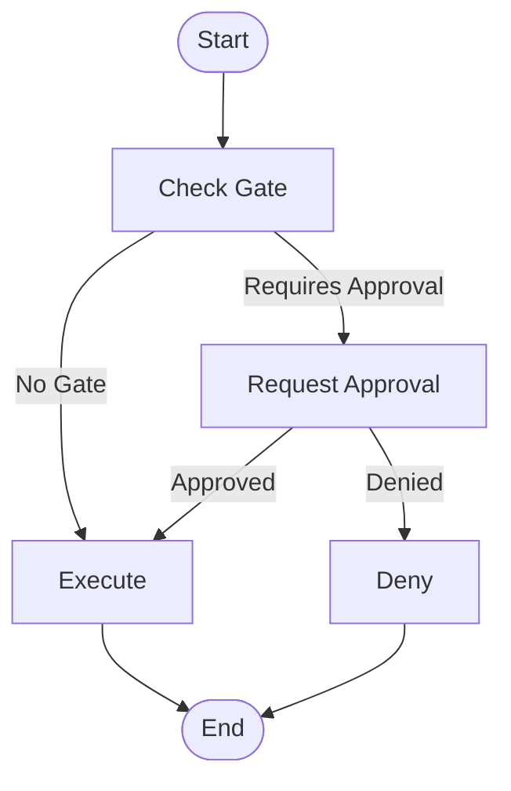

# Approval gates

## Introduction

Confirmation workflows ask "Do you want to do this?" Approval gates ask "Are you *allowed* to do this?" They're structural checkpoints that enforce organizational policies — which actions need sign-off, who can authorize them, and what gets logged for compliance.

In this lesson, we'll build gate systems that block critical actions until authorized, use thresholds to decide when gates activate, enforce role-based permissions, and maintain audit trails for every decision.

### What we'll cover

- Blocking irreversible actions with critical action gates
- Using measurable thresholds (cost, risk, confidence) to trigger gates
- Enforcing role-based authorization for different action types
- Maintaining audit trails that satisfy compliance requirements

### Prerequisites

- [Confirmation Workflows](./01-confirmation-workflows.md) — basic approve/reject patterns
- [Error Handling — Human Escalation](../08-error-handling-recovery/06-human-escalation-triggers.md) — escalation condition design

---

## Critical action gates

A critical action gate is a hard blocker — the agent *cannot* proceed without human authorization, regardless of its confidence. These protect against actions where mistakes are costly, irreversible, or legally significant.

### Defining gate policies

```python
from dataclasses import dataclass, field
from enum import Enum
from typing import Optional, Any


class GatePolicy(Enum):
    """When to require approval."""
    ALWAYS = "always"         # Every invocation requires approval
    CONDITIONAL = "conditional"  # Only when conditions are met
    NEVER = "never"           # Fully autonomous (no gate)


@dataclass
class ActionGate:
    """Defines an approval requirement for a specific action type."""
    
    action_pattern: str       # e.g., "delete_*", "send_email", "payment_*"
    policy: GatePolicy
    description: str
    required_role: str = "operator"  # Minimum role to approve
    max_auto_approve: int = 0  # How many times to auto-approve before requiring human
    condition: Optional[str] = None  # For CONDITIONAL: what triggers the gate
    
    def matches(self, action_name: str) -> bool:
        """Check if this gate applies to the given action."""
        if self.action_pattern.endswith("_*"):
            prefix = self.action_pattern[:-2]
            return action_name.startswith(prefix)
        return action_name == self.action_pattern


class GateRegistry:
    """Central registry of all approval gates."""
    
    def __init__(self):
        self.gates: list[ActionGate] = []
        self.approval_counts: dict[str, int] = {}
    
    def register(self, gate: ActionGate):
        """Register a new approval gate."""
        self.gates.append(gate)
    
    def check(self, action_name: str, context: Optional[dict] = None) -> dict:
        """Check if an action requires approval."""
        for gate in self.gates:
            if not gate.matches(action_name):
                continue
            
            if gate.policy == GatePolicy.NEVER:
                return {"requires_approval": False, "gate": gate.description}
            
            if gate.policy == GatePolicy.ALWAYS:
                return {
                    "requires_approval": True,
                    "gate": gate.description,
                    "required_role": gate.required_role
                }
            
            if gate.policy == GatePolicy.CONDITIONAL and gate.condition:
                # Evaluate the condition against context
                triggered = self._evaluate_condition(
                    gate.condition, context or {}
                )
                return {
                    "requires_approval": triggered,
                    "gate": gate.description,
                    "required_role": gate.required_role,
                    "condition": gate.condition
                }
        
        # No gate found — default to allow
        return {"requires_approval": False, "gate": None}
    
    def _evaluate_condition(self, condition: str, context: dict) -> bool:
        """Evaluate a simple condition string against context."""
        # In production, use a proper expression evaluator
        if ">" in condition:
            field, value = condition.split(">")
            return context.get(field.strip(), 0) > float(value.strip())
        if "<" in condition:
            field, value = condition.split("<")
            return context.get(field.strip(), 0) < float(value.strip())
        return True


# Usage
registry = GateRegistry()

registry.register(ActionGate(
    action_pattern="delete_*",
    policy=GatePolicy.ALWAYS,
    description="All deletions require approval",
    required_role="admin"
))

registry.register(ActionGate(
    action_pattern="send_email",
    policy=GatePolicy.CONDITIONAL,
    description="Emails to 10+ recipients need approval",
    required_role="operator",
    condition="recipient_count > 10"
))

registry.register(ActionGate(
    action_pattern="read_*",
    policy=GatePolicy.NEVER,
    description="Read operations are always allowed"
))

# Check gates
print(registry.check("delete_user"))
print(registry.check("send_email", {"recipient_count": 5}))
print(registry.check("send_email", {"recipient_count": 25}))
print(registry.check("read_document"))
```

**Output:**
```
{'requires_approval': True, 'gate': 'All deletions require approval', 'required_role': 'admin'}
{'requires_approval': False, 'gate': 'Emails to 10+ recipients need approval', 'required_role': 'operator', 'condition': 'recipient_count > 10'}
{'requires_approval': True, 'gate': 'Emails to 10+ recipients need approval', 'required_role': 'operator', 'condition': 'recipient_count > 10'}
{'requires_approval': False, 'gate': 'Read operations are always allowed'}
```

### Integrating gates with LangGraph

Gates work as conditional edges in a LangGraph workflow — routing to an approval node or bypassing it:

```python
from langgraph.graph import StateGraph, START, END
from langgraph.types import interrupt, Command
from langgraph.checkpoint.memory import MemorySaver
from typing import TypedDict, Literal


class TaskState(TypedDict):
    action: str
    context: dict
    gate_result: dict
    approved: bool
    result: str


# The gate registry from above (initialized with policies)
gate_registry = GateRegistry()
gate_registry.register(ActionGate(
    action_pattern="payment_*",
    policy=GatePolicy.ALWAYS,
    description="All payments require approval",
    required_role="finance_manager"
))


def check_gate(state: TaskState) -> dict:
    """Check if the action requires approval."""
    result = gate_registry.check(state["action"], state["context"])
    return {"gate_result": result}


def route_by_gate(state: TaskState) -> str:
    """Route based on gate check result."""
    if state["gate_result"].get("requires_approval"):
        return "request_approval"
    return "execute"


def request_approval(state: TaskState) -> dict:
    """Pause for human approval."""
    response = interrupt({
        "action": state["action"],
        "gate": state["gate_result"]["gate"],
        "required_role": state["gate_result"]["required_role"],
        "context": state["context"],
        "question": f"Approve {state['action']}?"
    })
    return {"approved": response.get("approved", False)}


def execute(state: TaskState) -> dict:
    """Execute the approved action."""
    return {"result": f"Executed: {state['action']}", "approved": True}


def deny(state: TaskState) -> dict:
    """Handle denial."""
    return {"result": f"Denied: {state['action']}"}


def route_after_approval(state: TaskState) -> str:
    """Route based on approval decision."""
    return "execute" if state["approved"] else "deny"


# Build graph
builder = StateGraph(TaskState)
builder.add_node("check_gate", check_gate)
builder.add_node("request_approval", request_approval)
builder.add_node("execute", execute)
builder.add_node("deny", deny)

builder.add_edge(START, "check_gate")
builder.add_conditional_edges("check_gate", route_by_gate)
builder.add_conditional_edges("request_approval", route_after_approval)
builder.add_edge("execute", END)
builder.add_edge("deny", END)

graph = builder.compile(checkpointer=MemorySaver())
```



---

## Threshold-based gates

Not every action is universally critical. A $5 expense report is routine; a $50,000 purchase order needs review. Threshold-based gates activate only when measurable values cross defined limits.

```python
from dataclasses import dataclass
from typing import Optional


@dataclass
class ThresholdGate:
    """Gate that activates when a metric exceeds a threshold."""
    
    metric_name: str
    threshold: float
    operator: str = ">"   # >, <, >=, <=, ==
    description: str = ""
    required_role: str = "operator"
    
    def is_triggered(self, value: float) -> bool:
        """Check if the threshold is breached."""
        ops = {
            ">": lambda a, b: a > b,
            "<": lambda a, b: a < b,
            ">=": lambda a, b: a >= b,
            "<=": lambda a, b: a <= b,
            "==": lambda a, b: a == b,
        }
        return ops[self.operator](value, self.threshold)


class ThresholdGateManager:
    """Manages multiple threshold-based gates."""
    
    def __init__(self):
        self.gates: list[ThresholdGate] = []
    
    def add_gate(self, gate: ThresholdGate):
        self.gates.append(gate)
    
    def evaluate(self, metrics: dict[str, float]) -> list[dict]:
        """Evaluate all gates against current metrics."""
        triggered = []
        
        for gate in self.gates:
            if gate.metric_name in metrics:
                value = metrics[gate.metric_name]
                if gate.is_triggered(value):
                    triggered.append({
                        "gate": gate.description or gate.metric_name,
                        "metric": gate.metric_name,
                        "value": value,
                        "threshold": gate.threshold,
                        "required_role": gate.required_role
                    })
        
        return triggered


# Usage
manager = ThresholdGateManager()

manager.add_gate(ThresholdGate(
    metric_name="amount_usd",
    threshold=1000,
    operator=">=",
    description="Transactions >= $1,000 need manager approval",
    required_role="manager"
))

manager.add_gate(ThresholdGate(
    metric_name="amount_usd",
    threshold=10000,
    operator=">=",
    description="Transactions >= $10,000 need VP approval",
    required_role="vp"
))

manager.add_gate(ThresholdGate(
    metric_name="confidence",
    threshold=0.5,
    operator="<",
    description="Low-confidence actions need review",
    required_role="operator"
))

# Small transaction — no gates triggered
result = manager.evaluate({"amount_usd": 50, "confidence": 0.9})
print(f"$50 transaction: {len(result)} gates triggered")

# Medium transaction — manager approval needed
result = manager.evaluate({"amount_usd": 5000, "confidence": 0.8})
print(f"$5,000 transaction: {len(result)} gates triggered")
for gate in result:
    print(f"  → {gate['gate']} (need: {gate['required_role']})")

# Large, low-confidence transaction — multiple gates
result = manager.evaluate({"amount_usd": 25000, "confidence": 0.3})
print(f"$25,000 low-confidence: {len(result)} gates triggered")
for gate in result:
    print(f"  → {gate['gate']} (need: {gate['required_role']})")
```

**Output:**
```
$50 transaction: 0 gates triggered
$5,000 transaction: 1 gates triggered
  → Transactions >= $1,000 need manager approval (need: manager)
$25,000 low-confidence: 3 gates triggered
  → Transactions >= $1,000 need manager approval (need: manager)
  → Transactions >= $10,000 need VP approval (need: vp)
  → Low-confidence actions need review (need: operator)
```

> **🤖 AI Context:** Threshold gates are particularly important for AI agents because confidence scores fluctuate. An agent might handle 100 requests autonomously at 85%+ confidence, but the one request where confidence drops to 30% is exactly the one that needs human review.

---

## Role-based approval

Not every human should approve every action. Role-based approval ensures that only qualified people authorize specific action types:

```python
from dataclasses import dataclass, field
from enum import IntEnum


class Role(IntEnum):
    """Role hierarchy — higher number = more authority."""
    VIEWER = 0
    OPERATOR = 1
    MANAGER = 2
    ADMIN = 3
    VP = 4
    EXECUTIVE = 5


@dataclass
class Approver:
    """A human who can approve actions."""
    user_id: str
    name: str
    role: Role
    department: str = ""
    max_approval_amount: float = float("inf")


class RoleBasedApproval:
    """Enforces role-based authorization for agent actions."""
    
    def __init__(self):
        self.approvers: dict[str, Approver] = {}
        self.action_requirements: dict[str, Role] = {}
    
    def register_approver(self, approver: Approver):
        """Register a human approver."""
        self.approvers[approver.user_id] = approver
    
    def set_requirement(self, action_pattern: str, min_role: Role):
        """Set minimum role required to approve an action type."""
        self.action_requirements[action_pattern] = min_role
    
    def can_approve(
        self,
        user_id: str,
        action: str,
        amount: float = 0
    ) -> dict:
        """Check if a user can approve a specific action."""
        approver = self.approvers.get(user_id)
        if not approver:
            return {
                "authorized": False,
                "reason": f"User '{user_id}' is not a registered approver"
            }
        
        # Find the matching requirement
        required_role = self._find_requirement(action)
        if required_role is None:
            return {"authorized": True, "reason": "No approval requirement"}
        
        # Check role level
        if approver.role < required_role:
            return {
                "authorized": False,
                "reason": f"Requires {required_role.name} role, "
                          f"user has {approver.role.name}"
            }
        
        # Check amount limit
        if amount > approver.max_approval_amount:
            return {
                "authorized": False,
                "reason": f"Amount ${amount:,.2f} exceeds user's limit "
                          f"of ${approver.max_approval_amount:,.2f}"
            }
        
        return {
            "authorized": True,
            "approver": approver.name,
            "role": approver.role.name
        }
    
    def _find_requirement(self, action: str) -> Role | None:
        """Find the role requirement for an action."""
        # Check exact match first
        if action in self.action_requirements:
            return self.action_requirements[action]
        
        # Check wildcard patterns
        for pattern, role in self.action_requirements.items():
            if pattern.endswith("_*") and action.startswith(pattern[:-2]):
                return role
        
        return None


# Usage
rbac = RoleBasedApproval()

rbac.register_approver(Approver("alice", "Alice Chen", Role.OPERATOR, max_approval_amount=5000))
rbac.register_approver(Approver("bob", "Bob Smith", Role.MANAGER, max_approval_amount=50000))
rbac.register_approver(Approver("carol", "Carol Davis", Role.VP))

rbac.set_requirement("delete_*", Role.ADMIN)
rbac.set_requirement("payment_*", Role.MANAGER)
rbac.set_requirement("send_email", Role.OPERATOR)

# Check authorization
print(rbac.can_approve("alice", "send_email"))
print(rbac.can_approve("alice", "payment_process", amount=2000))
print(rbac.can_approve("bob", "payment_process", amount=2000))
print(rbac.can_approve("bob", "delete_user"))
```

**Output:**
```
{'authorized': True, 'approver': 'Alice Chen', 'role': 'OPERATOR'}
{'authorized': False, 'reason': 'Requires MANAGER role, user has OPERATOR'}
{'authorized': True, 'approver': 'Bob Smith', 'role': 'MANAGER'}
{'authorized': False, 'reason': 'Requires ADMIN role, user has MANAGER'}
```

---

## Audit trails

Every approval decision must be logged — who approved what, when, why, and with what context. This isn't optional for production systems; it's a compliance requirement.

```python
from dataclasses import dataclass, field
from datetime import datetime
from typing import Any, Optional
import json


@dataclass
class AuditEntry:
    """A single audit trail entry."""
    
    timestamp: str
    action: str
    decision: str           # "approved", "rejected", "auto_approved"
    decided_by: str         # User ID or "system"
    approver_role: str
    gate_triggered: str     # Which gate required this approval
    context: dict           # Action details at decision time
    reason: Optional[str] = None  # Human's stated reason (especially for rejections)
    session_id: str = ""
    agent_id: str = ""


class AuditTrail:
    """Immutable audit trail for all approval decisions."""
    
    def __init__(self):
        self._entries: list[AuditEntry] = []
    
    def record(
        self,
        action: str,
        decision: str,
        decided_by: str,
        approver_role: str,
        gate_triggered: str,
        context: dict,
        reason: Optional[str] = None,
        session_id: str = "",
        agent_id: str = ""
    ) -> AuditEntry:
        """Record an approval decision. Entries are append-only."""
        entry = AuditEntry(
            timestamp=datetime.utcnow().isoformat() + "Z",
            action=action,
            decision=decision,
            decided_by=decided_by,
            approver_role=approver_role,
            gate_triggered=gate_triggered,
            context=context,
            reason=reason,
            session_id=session_id,
            agent_id=agent_id
        )
        self._entries.append(entry)
        return entry
    
    def query(
        self,
        action: Optional[str] = None,
        decided_by: Optional[str] = None,
        decision: Optional[str] = None,
        limit: int = 50
    ) -> list[AuditEntry]:
        """Query the audit trail with filters."""
        results = self._entries
        
        if action:
            results = [e for e in results if action in e.action]
        if decided_by:
            results = [e for e in results if e.decided_by == decided_by]
        if decision:
            results = [e for e in results if e.decision == decision]
        
        return results[-limit:]
    
    def summary(self) -> dict:
        """Generate an audit summary."""
        decisions = {}
        for entry in self._entries:
            decisions[entry.decision] = decisions.get(entry.decision, 0) + 1
        
        approvers = {}
        for entry in self._entries:
            approvers[entry.decided_by] = approvers.get(entry.decided_by, 0) + 1
        
        return {
            "total_entries": len(self._entries),
            "decisions": decisions,
            "approvers": approvers,
            "first_entry": self._entries[0].timestamp if self._entries else None,
            "last_entry": self._entries[-1].timestamp if self._entries else None
        }


# Usage
audit = AuditTrail()

audit.record(
    action="payment_process",
    decision="approved",
    decided_by="bob",
    approver_role="MANAGER",
    gate_triggered="Transactions >= $1,000 need manager approval",
    context={"amount": 5000, "recipient": "vendor-123"},
    session_id="sess-001",
    agent_id="finance-agent"
)

audit.record(
    action="delete_user",
    decision="rejected",
    decided_by="bob",
    approver_role="MANAGER",
    gate_triggered="All deletions require admin approval",
    context={"user_id": "user-456"},
    reason="Need to verify this user has no pending orders",
    session_id="sess-002",
    agent_id="admin-agent"
)

summary = audit.summary()
print(f"Total entries: {summary['total_entries']}")
print(f"Decisions: {summary['decisions']}")
print(f"Approvers: {summary['approvers']}")
```

**Output:**
```
Total entries: 2
Decisions: {'approved': 1, 'rejected': 1}
Approvers: {'bob': 2}
```

> **💡 Tip:** In production, store audit entries in an append-only database (not in-memory). Use a write-once storage pattern — entries should never be modified or deleted. This is a legal requirement for many regulated industries.

---

## Best practices

| Practice | Why it matters |
|----------|----------------|
| Define gate policies before deployment | Ad-hoc gating leads to inconsistent enforcement |
| Use the principle of least privilege | Require the minimum role needed, not always the highest |
| Combine threshold gates for multi-dimensional checks | Amount alone isn't enough — combine with confidence, risk type, and user context |
| Make audit trails append-only and tamper-proof | Modified audit trails are useless for compliance |
| Separate gate checking from action execution | Gates should be a middleware layer, not embedded in each tool |
| Review gate trigger rates regularly | Too many triggers = human fatigue; too few = insufficient oversight |

---

## Common pitfalls

| ❌ Mistake | ✅ Solution |
|-----------|-------------|
| Same approval threshold for all action types | Calibrate thresholds per domain — finance, HR, and ops have different risk profiles |
| No fallback when the required approver is unavailable | Implement delegation chains — if manager is unavailable, escalate to VP |
| Audit trails that only log approvals | Log rejections too, with the human's reason — they reveal what agents are doing wrong |
| Hard-coded role requirements | Make them configurable so policies can change without code deploys |
| No gate for novel or unknown action types | Default to requiring approval for any unrecognized action pattern |
| Letting the agent decide its own confidence score | Use independent confidence measures, not the agent's self-assessment |

---

## Hands-on exercise

### Your task

Build an `ApprovalGateSystem` that combines critical action gates, threshold-based gates, role-based authorization, and audit logging into a single check-and-approve pipeline.

### Requirements

1. Register gates for at least 3 action types with different policies (always, conditional, never)
2. Support threshold gates on both amount and confidence
3. Validate approver role before accepting an approval decision
4. Log every decision (approval, rejection, auto-approval) to an audit trail
5. Include a `process_action()` method that runs the full pipeline: check gate → request approval if needed → validate approver → log decision

### Expected result

```python
system = ApprovalGateSystem()
system.register_gate("payment_*", policy="always", min_role="manager")
system.register_gate("send_email", policy="conditional", threshold={"recipients": 10})
system.register_approver("alice", role="manager", max_amount=50000)

result = system.process_action(
    action="payment_process",
    context={"amount": 5000},
    approver_id="alice",
    decision="approve"
)
# result = {"executed": True, "audit_id": "..."}
```

<details>
<summary>💡 Hints (click to expand)</summary>

- Compose `GateRegistry`, `ThresholdGateManager`, `RoleBasedApproval`, and `AuditTrail` inside the system
- The `process_action()` pipeline should be: check gate → if triggered, validate approver → log → return result
- Auto-approved actions (no gate triggered) should also be logged with `decision="auto_approved"`
- Return the audit entry ID so the caller can reference it later

</details>

<details>
<summary>✅ Solution (click to expand)</summary>

```python
from dataclasses import dataclass
from typing import Optional
import uuid


class ApprovalGateSystem:
    """Unified approval gate system with full pipeline."""
    
    def __init__(self):
        self.gate_registry = GateRegistry()
        self.threshold_manager = ThresholdGateManager()
        self.rbac = RoleBasedApproval()
        self.audit = AuditTrail()
    
    def register_gate(
        self, action_pattern: str, policy: str,
        min_role: str = "operator", threshold: Optional[dict] = None
    ):
        """Register an action gate."""
        gate_policy = {
            "always": GatePolicy.ALWAYS,
            "conditional": GatePolicy.CONDITIONAL,
            "never": GatePolicy.NEVER
        }[policy]
        
        condition = None
        if threshold:
            for metric, value in threshold.items():
                condition = f"{metric} > {value}"
                self.threshold_manager.add_gate(ThresholdGate(
                    metric_name=metric,
                    threshold=value,
                    operator=">",
                    description=f"{action_pattern}: {metric} > {value}",
                    required_role=min_role
                ))
        
        role_enum = Role[min_role.upper()]
        self.gate_registry.register(ActionGate(
            action_pattern=action_pattern,
            policy=gate_policy,
            description=f"Gate for {action_pattern}",
            required_role=min_role,
            condition=condition
        ))
        self.rbac.set_requirement(action_pattern, role_enum)
    
    def register_approver(
        self, user_id: str, role: str,
        name: str = "", max_amount: float = float("inf")
    ):
        """Register a human approver."""
        self.rbac.register_approver(Approver(
            user_id=user_id,
            name=name or user_id,
            role=Role[role.upper()],
            max_approval_amount=max_amount
        ))
    
    def process_action(
        self, action: str, context: dict,
        approver_id: Optional[str] = None,
        decision: Optional[str] = None
    ) -> dict:
        """Full pipeline: check → authorize → log → execute."""
        
        # Step 1: Check if gate is triggered
        gate_result = self.gate_registry.check(action, context)
        
        if not gate_result["requires_approval"]:
            # Auto-approve and log
            entry = self.audit.record(
                action=action,
                decision="auto_approved",
                decided_by="system",
                approver_role="N/A",
                gate_triggered="none",
                context=context
            )
            return {
                "executed": True,
                "auto_approved": True,
                "audit_id": id(entry)
            }
        
        # Step 2: Validate approver
        if not approver_id or not decision:
            return {
                "executed": False,
                "requires_approval": True,
                "gate": gate_result["gate"],
                "required_role": gate_result["required_role"]
            }
        
        amount = context.get("amount", 0)
        auth = self.rbac.can_approve(approver_id, action, amount)
        
        if not auth["authorized"]:
            entry = self.audit.record(
                action=action,
                decision="unauthorized",
                decided_by=approver_id,
                approver_role="insufficient",
                gate_triggered=gate_result["gate"],
                context=context,
                reason=auth["reason"]
            )
            return {
                "executed": False,
                "reason": auth["reason"],
                "audit_id": id(entry)
            }
        
        # Step 3: Log the decision
        entry = self.audit.record(
            action=action,
            decision=decision,
            decided_by=approver_id,
            approver_role=auth.get("role", "unknown"),
            gate_triggered=gate_result["gate"],
            context=context
        )
        
        return {
            "executed": decision == "approve",
            "decision": decision,
            "approver": auth.get("approver"),
            "audit_id": id(entry)
        }
```
</details>

### Bonus challenges

- [ ] Add multi-level approval for high-value actions (e.g., > $10K needs both manager AND VP)
- [ ] Implement delegation — if the required approver is away, auto-route to their delegate
- [ ] Build a gate analytics dashboard that shows trigger rates, approval rates, and average response times per gate

---

## Summary

✅ **Critical action gates** block irreversible actions until a human authorizes them — the agent cannot bypass these regardless of its confidence

✅ **Threshold-based gates** activate dynamically based on measurable values like cost, recipient count, or confidence — routine actions pass through while outliers require review

✅ **Role-based authorization** ensures that only qualified humans approve specific action types — an operator can approve emails but not payments

✅ **Audit trails** log every decision (including auto-approvals and rejections) with full context — this is a compliance requirement, not a nice-to-have

**Next:** [Feedback Incorporation](./03-feedback-incorporation.md)

---

## Further reading

- [LangGraph — Interrupts](https://docs.langchain.com/oss/python/langgraph/interrupts) — conditional approval workflows
- [OWASP — Access Control Cheat Sheet](https://cheatsheetseries.owasp.org/cheatsheets/Access_Control_Cheat_Sheet.html) — role-based access control patterns
- [Google PAIR — Feedback + Control](https://pair.withgoogle.com/chapter/feedback-controls/) — balancing control and automation

*[Back to Human-in-the-Loop overview](./00-human-in-the-loop.md)*

<!-- 
Sources Consulted:
- LangGraph interrupts: https://docs.langchain.com/oss/python/langgraph/interrupts
- Google PAIR Feedback + Control: https://pair.withgoogle.com/chapter/feedback-controls/
- OWASP Access Control: https://cheatsheetseries.owasp.org/cheatsheets/Access_Control_Cheat_Sheet.html
-->
