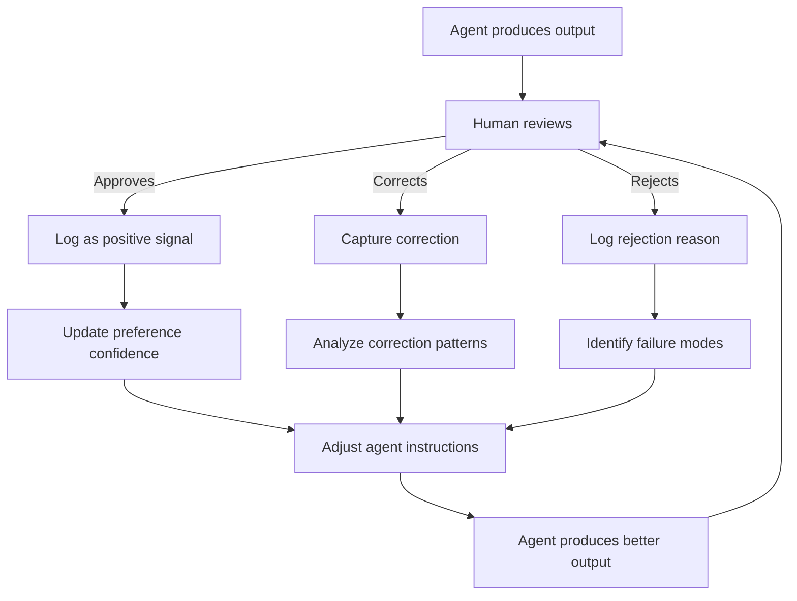

# Feedback incorporation

## Introduction

Agents don't just need approval — they need to *learn* from human input. When a user corrects an agent's output, adjusts its behavior, or expresses a preference, that feedback should make the agent better over time. Without feedback incorporation, agents repeat the same mistakes and humans grow frustrated.

In this lesson, we'll build systems that capture user corrections, learn preferences from patterns in human decisions, adjust agent behavior within a session and across sessions, and create continuous improvement loops.

### What we'll cover

- Capturing and applying user corrections to agent outputs
- Learning user preferences from implicit and explicit signals
- Adjusting agent behavior dynamically based on feedback
- Building continuous improvement loops that compound over time

### Prerequisites

- [Confirmation Workflows](./01-confirmation-workflows.md) — how humans interact with agent actions
- [Approval Gates](./02-approval-gates.md) — decision data that feeds into learning
- [Agent Memory Systems](../04-agent-memory-systems/) — storing preferences persistently

---

## User corrections

The simplest form of feedback is a correction: the agent produced something wrong, and the human fixes it. We need to capture *what* changed, *why*, and use it to prevent the same error.

### Correction capture

```python
from dataclasses import dataclass, field
from datetime import datetime
from difflib import unified_diff
from typing import Optional


@dataclass
class Correction:
    """Records what a human changed in agent output."""
    
    original: str
    corrected: str
    field_name: str           # Which field was corrected
    category: str = ""        # "factual", "style", "format", "safety"
    reason: Optional[str] = None  # Why the human made this change
    timestamp: str = field(
        default_factory=lambda: datetime.now().isoformat()
    )
    
    @property
    def diff(self) -> str:
        """Show what changed between original and corrected."""
        original_lines = self.original.splitlines(keepends=True)
        corrected_lines = self.corrected.splitlines(keepends=True)
        return "".join(unified_diff(
            original_lines, corrected_lines,
            fromfile="original", tofile="corrected"
        ))
    
    @property
    def change_ratio(self) -> float:
        """How much of the content was changed (0.0 = identical, 1.0 = completely different)."""
        from difflib import SequenceMatcher
        return 1.0 - SequenceMatcher(None, self.original, self.corrected).ratio()


class CorrectionTracker:
    """Tracks corrections and identifies patterns."""
    
    def __init__(self):
        self.corrections: list[Correction] = []
    
    def record(
        self,
        original: str,
        corrected: str,
        field_name: str,
        category: str = "",
        reason: Optional[str] = None
    ) -> Correction:
        """Record a correction."""
        correction = Correction(
            original=original,
            corrected=corrected,
            field_name=field_name,
            category=category,
            reason=reason
        )
        self.corrections.append(correction)
        return correction
    
    def get_patterns(self) -> dict:
        """Analyze correction patterns to find recurring issues."""
        # Count corrections by field and category
        by_field: dict[str, int] = {}
        by_category: dict[str, int] = {}
        total_change_ratio = 0.0
        
        for c in self.corrections:
            by_field[c.field_name] = by_field.get(c.field_name, 0) + 1
            if c.category:
                by_category[c.category] = by_category.get(c.category, 0) + 1
            total_change_ratio += c.change_ratio
        
        avg_change = (
            total_change_ratio / len(self.corrections)
            if self.corrections else 0
        )
        
        return {
            "total_corrections": len(self.corrections),
            "by_field": dict(sorted(by_field.items(), key=lambda x: -x[1])),
            "by_category": dict(sorted(by_category.items(), key=lambda x: -x[1])),
            "avg_change_ratio": round(avg_change, 3),
            "most_corrected_field": max(by_field, key=by_field.get) if by_field else None
        }


# Usage
tracker = CorrectionTracker()

tracker.record(
    original="The meeting is at 2 PM EST",
    corrected="The meeting is at 2 PM PST",
    field_name="email_body",
    category="factual",
    reason="Wrong timezone"
)

tracker.record(
    original="Hi there,",
    corrected="Dear Ms. Johnson,",
    field_name="email_greeting",
    category="style",
    reason="Too informal for this recipient"
)

tracker.record(
    original="Please see attached report.",
    corrected="Please find the Q3 report attached.",
    field_name="email_body",
    category="style",
    reason="Too vague"
)

patterns = tracker.get_patterns()
print(f"Total corrections: {patterns['total_corrections']}")
print(f"Most corrected field: {patterns['most_corrected_field']}")
print(f"By category: {patterns['by_category']}")
print(f"Average change ratio: {patterns['avg_change_ratio']:.1%}")
```

**Output:**
```
Total corrections: 3
Most corrected field: email_body
By category: {'style': 2, 'factual': 1}
Average change ratio: 44.7%
```

### Using corrections in LangGraph review flow

LangGraph's review-and-edit interrupt pattern captures corrections naturally — the human edits the output and the corrected version continues through the graph:

```python
from langgraph.types import interrupt


def review_output(state: dict) -> dict:
    """Let the human review and edit the agent's output."""
    
    # Pause with the agent's draft for human review
    edited = interrupt({
        "instruction": "Review and edit this content",
        "content": state["draft"],
        "editable_fields": ["subject", "body", "tone"]
    })
    
    # When resumed, 'edited' contains the human's version
    # Track the correction for future learning
    if edited != state["draft"]:
        corrections = state.get("corrections", [])
        corrections.append({
            "original": state["draft"],
            "corrected": edited,
            "field": "draft"
        })
        return {"draft": edited, "corrections": corrections}
    
    return {}  # No changes
```

> **🤖 AI Context:** Corrections are the highest-quality training signal available. Each correction tells you exactly what the agent got wrong and what the right answer looks like. Systems that capture and learn from corrections improve faster than those relying only on thumbs-up/thumbs-down feedback.

---

## Preference learning

Beyond individual corrections, we want to learn *patterns* — does this user prefer formal language? Do they always change the subject line? Do they reject actions on certain data types? These preferences shape future agent behavior.

### Explicit preferences

Users directly state what they want:

```python
from dataclasses import dataclass, field
from typing import Any


@dataclass
class UserPreference:
    """A single user preference."""
    category: str       # "communication_style", "risk_tolerance", "output_format"
    key: str            # "greeting_style", "max_email_length"
    value: Any          # "formal", 500
    source: str = ""    # "explicit" (user said it) or "inferred" (observed)
    confidence: float = 1.0  # How confident we are (1.0 for explicit, lower for inferred)


class PreferenceStore:
    """Stores and retrieves user preferences."""
    
    def __init__(self):
        self.preferences: dict[str, dict[str, UserPreference]] = {}
    
    def set_preference(
        self,
        user_id: str,
        category: str,
        key: str,
        value: Any,
        source: str = "explicit",
        confidence: float = 1.0
    ):
        """Set a user preference."""
        if user_id not in self.preferences:
            self.preferences[user_id] = {}
        
        pref_key = f"{category}.{key}"
        
        # Don't overwrite explicit preferences with lower-confidence inferred ones
        existing = self.preferences[user_id].get(pref_key)
        if existing and existing.source == "explicit" and source == "inferred":
            return  # Keep the explicit preference
        
        self.preferences[user_id][pref_key] = UserPreference(
            category=category,
            key=key,
            value=value,
            source=source,
            confidence=confidence
        )
    
    def get_preference(
        self, user_id: str, category: str, key: str, default: Any = None
    ) -> Any:
        """Get a preference value."""
        prefs = self.preferences.get(user_id, {})
        pref = prefs.get(f"{category}.{key}")
        return pref.value if pref else default
    
    def get_all_preferences(self, user_id: str) -> dict:
        """Get all preferences for a user."""
        prefs = self.preferences.get(user_id, {})
        return {
            key: {"value": p.value, "source": p.source, "confidence": p.confidence}
            for key, p in prefs.items()
        }


# Usage
store = PreferenceStore()

# Explicit preferences — user told us directly
store.set_preference("user-1", "style", "greeting", "formal", source="explicit")
store.set_preference("user-1", "style", "max_length", 200, source="explicit")
store.set_preference("user-1", "risk", "auto_approve_threshold", 100, source="explicit")

print(store.get_preference("user-1", "style", "greeting"))
print(store.get_preference("user-1", "style", "max_length"))
print(store.get_all_preferences("user-1"))
```

**Output:**
```
formal
200
{'style.greeting': {'value': 'formal', 'source': 'explicit', 'confidence': 1.0}, 'style.max_length': {'value': 200, 'source': 'explicit', 'confidence': 1.0}, 'risk.auto_approve_threshold': {'value': 100, 'source': 'explicit', 'confidence': 1.0}}
```

### Implicit preference inference

Observe patterns in human decisions to infer preferences they haven't stated explicitly:

```python
from collections import Counter


class PreferenceInferrer:
    """Infers preferences from patterns in human behavior."""
    
    def __init__(self, min_observations: int = 3, min_confidence: float = 0.7):
        self.min_observations = min_observations
        self.min_confidence = min_confidence
        self.observations: dict[str, list] = {}
    
    def observe(self, user_id: str, signal_type: str, value: Any):
        """Record an observed behavior."""
        key = f"{user_id}:{signal_type}"
        if key not in self.observations:
            self.observations[key] = []
        self.observations[key].append(value)
    
    def infer(self, user_id: str, signal_type: str) -> dict | None:
        """Try to infer a preference from observed patterns."""
        key = f"{user_id}:{signal_type}"
        values = self.observations.get(key, [])
        
        if len(values) < self.min_observations:
            return None  # Not enough data
        
        # Find the most common value
        counts = Counter(values)
        most_common_value, most_common_count = counts.most_common(1)[0]
        confidence = most_common_count / len(values)
        
        if confidence < self.min_confidence:
            return None  # Not confident enough
        
        return {
            "value": most_common_value,
            "confidence": round(confidence, 2),
            "observations": len(values),
            "source": "inferred"
        }


# Usage
inferrer = PreferenceInferrer(min_observations=3, min_confidence=0.7)

# Track that user always changes informal greetings to formal
inferrer.observe("user-1", "greeting_correction", "formal")
inferrer.observe("user-1", "greeting_correction", "formal")
inferrer.observe("user-1", "greeting_correction", "formal")
inferrer.observe("user-1", "greeting_correction", "casual")

result = inferrer.infer("user-1", "greeting_correction")
print(f"Inferred preference: {result}")

# Track approval patterns
for _ in range(8):
    inferrer.observe("user-1", "approval_for_emails", "approve")
for _ in range(2):
    inferrer.observe("user-1", "approval_for_emails", "reject")

result = inferrer.infer("user-1", "approval_for_emails")
print(f"Approval pattern: {result}")
```

**Output:**
```
Inferred preference: {'value': 'formal', 'confidence': 0.75, 'observations': 4, 'source': 'inferred'}
Approval pattern: {'value': 'approve', 'confidence': 0.8, 'observations': 10, 'source': 'inferred'}
```

> **Warning:** Inferred preferences should always have lower priority than explicit ones. A user saying "I want casual tone" overrides 10 observations of accepting formal tone — they might have been accepting it reluctantly.

---

## Behavior adjustment

Preferences are only useful if they change how the agent acts. We need to inject learned preferences into the agent's instructions, tool configurations, or decision-making logic.

### Dynamic instruction modification

```python
from typing import Optional


class AdaptiveInstructions:
    """Modifies agent instructions based on user preferences."""
    
    def __init__(self, base_instructions: str):
        self.base_instructions = base_instructions
        self.preference_rules: list[dict] = []
    
    def add_rule(
        self,
        preference_key: str,
        preference_value: str,
        instruction_addition: str,
        priority: int = 0
    ):
        """Add a rule that modifies instructions based on a preference."""
        self.preference_rules.append({
            "key": preference_key,
            "value": preference_value,
            "instruction": instruction_addition,
            "priority": priority
        })
    
    def build(self, user_preferences: dict) -> str:
        """Build final instructions incorporating user preferences."""
        additions = []
        
        for rule in sorted(self.preference_rules, key=lambda r: -r["priority"]):
            pref_value = user_preferences.get(rule["key"])
            if pref_value and str(pref_value) == str(rule["value"]):
                additions.append(rule["instruction"])
        
        if not additions:
            return self.base_instructions
        
        pref_section = "\n".join(f"- {a}" for a in additions)
        return (
            f"{self.base_instructions}\n\n"
            f"## User Preferences\n"
            f"Adjust your behavior based on these learned preferences:\n"
            f"{pref_section}"
        )


# Usage
instructions = AdaptiveInstructions(
    "You are a helpful email assistant. Draft emails based on user requests."
)

instructions.add_rule(
    "style.greeting", "formal",
    "Always use formal greetings (Dear Mr./Ms.) instead of casual (Hi/Hey)",
    priority=1
)
instructions.add_rule(
    "style.max_length", "200",
    "Keep emails concise — under 200 words",
    priority=0
)
instructions.add_rule(
    "style.tone", "professional",
    "Maintain a professional tone throughout",
    priority=1
)

# Build instructions for a user with these preferences
user_prefs = {
    "style.greeting": "formal",
    "style.max_length": "200",
    "style.tone": "professional"
}

final = instructions.build(user_prefs)
print(final)
```

**Output:**
```
You are a helpful email assistant. Draft emails based on user requests.

## User Preferences
Adjust your behavior based on these learned preferences:
- Always use formal greetings (Dear Mr./Ms.) instead of casual (Hi/Hey)
- Maintain a professional tone throughout
- Keep emails concise — under 200 words
```

### Correction-driven adjustments

Use correction patterns to automatically modify agent behavior:

```python
class CorrectionDrivenAdapter:
    """Adapts agent behavior based on correction patterns."""
    
    def __init__(
        self,
        correction_tracker: CorrectionTracker,
        preference_store: PreferenceStore,
        threshold: int = 3  # Corrections on same field before adapting
    ):
        self.tracker = correction_tracker
        self.store = preference_store
        self.threshold = threshold
    
    def check_and_adapt(self, user_id: str) -> list[str]:
        """Check correction patterns and create new preferences."""
        patterns = self.tracker.get_patterns()
        adaptations = []
        
        # If a field is corrected too often, flag it
        for field_name, count in patterns["by_field"].items():
            if count >= self.threshold:
                # Create an advisory preference
                self.store.set_preference(
                    user_id=user_id,
                    category="corrections",
                    key=f"frequently_corrected_{field_name}",
                    value=True,
                    source="inferred",
                    confidence=min(count / (self.threshold * 2), 0.95)
                )
                adaptations.append(
                    f"Field '{field_name}' corrected {count} times — "
                    f"added to watch list"
                )
        
        # High average change ratio = agent outputs are far from expectations
        if patterns["avg_change_ratio"] > 0.5:
            adaptations.append(
                f"Average change ratio {patterns['avg_change_ratio']:.0%} — "
                f"agent outputs need significant revision"
            )
        
        return adaptations


# Usage
adapter = CorrectionDrivenAdapter(tracker, store, threshold=2)
adaptations = adapter.check_and_adapt("user-1")
for a in adaptations:
    print(f"📝 {a}")
```

**Output:**
```
📝 Field 'email_body' corrected 2 times — added to watch list
```

---

## Continuous improvement

Individual corrections and preferences are point-in-time improvements. Continuous improvement means the agent gets *systematically* better over time through structured feedback loops.

### The feedback loop



### Improvement metrics

Track whether feedback is actually making the agent better:

```python
from dataclasses import dataclass, field
from collections import deque


@dataclass
class ImprovementTracker:
    """Tracks whether agent performance is improving over time."""
    
    window_size: int = 50  # Rolling window for metrics
    approval_history: deque = field(
        default_factory=lambda: deque(maxlen=50)
    )
    correction_ratios: deque = field(
        default_factory=lambda: deque(maxlen=50)
    )
    
    def record_interaction(
        self,
        approved: bool,
        corrected: bool,
        change_ratio: float = 0.0
    ):
        """Record the outcome of a human-agent interaction."""
        self.approval_history.append(approved)
        if corrected:
            self.correction_ratios.append(change_ratio)
    
    @property
    def approval_rate(self) -> float:
        """Percentage of outputs approved without changes."""
        if not self.approval_history:
            return 0.0
        return sum(self.approval_history) / len(self.approval_history)
    
    @property
    def avg_correction_size(self) -> float:
        """Average size of corrections when they happen."""
        if not self.correction_ratios:
            return 0.0
        return sum(self.correction_ratios) / len(self.correction_ratios)
    
    def trend(self) -> str:
        """Determine if performance is improving, declining, or stable."""
        if len(self.approval_history) < 10:
            return "insufficient_data"
        
        history = list(self.approval_history)
        midpoint = len(history) // 2
        
        first_half_rate = sum(history[:midpoint]) / midpoint
        second_half_rate = sum(history[midpoint:]) / (len(history) - midpoint)
        
        diff = second_half_rate - first_half_rate
        if diff > 0.1:
            return "improving"
        elif diff < -0.1:
            return "declining"
        return "stable"
    
    def report(self) -> dict:
        """Generate an improvement report."""
        return {
            "approval_rate": f"{self.approval_rate:.0%}",
            "avg_correction_size": f"{self.avg_correction_size:.0%}",
            "trend": self.trend(),
            "total_interactions": len(self.approval_history)
        }


# Usage
tracker = ImprovementTracker()

# Early interactions — lots of corrections
for _ in range(10):
    tracker.record_interaction(approved=False, corrected=True, change_ratio=0.4)
for _ in range(5):
    tracker.record_interaction(approved=True, corrected=False)

# Later interactions — agent has improved
for _ in range(15):
    tracker.record_interaction(approved=True, corrected=False)
for _ in range(5):
    tracker.record_interaction(approved=False, corrected=True, change_ratio=0.15)

report = tracker.report()
print(f"Approval rate: {report['approval_rate']}")
print(f"Avg correction: {report['avg_correction_size']}")
print(f"Trend: {report['trend']}")
print(f"Total interactions: {report['total_interactions']}")
```

**Output:**
```
Approval rate: 57%
Avg correction: 30%
Trend: improving
Total interactions: 35
```

> **💡 Tip:** Share improvement metrics with users. Showing "Your agent's approval rate improved from 50% to 85% this month" builds trust and encourages continued feedback.

---

## Best practices

| Practice | Why it matters |
|----------|----------------|
| Capture the *reason* for corrections, not just the change | "Wrong timezone" is actionable; a diff alone isn't |
| Prioritize explicit preferences over inferred ones | Users might accept suboptimal outputs without correcting them |
| Require minimum observations before inferring preferences | 1-2 corrections aren't a pattern; 5+ probably are |
| Track improvement metrics over time | Without metrics, you can't tell if feedback loops are working |
| Let users review and edit their learned preferences | Inferred preferences can be wrong — users should see and control them |
| Apply preferences per-user, not globally | One user's "too formal" is another user's "just right" |

---

## Common pitfalls

| ❌ Mistake | ✅ Solution |
|-----------|-------------|
| Inferring preferences from a single correction | Wait for 3+ similar corrections before creating a preference rule |
| Overriding explicit preferences with inferred ones | Always check `source` — explicit > inferred |
| Never expiring old preferences | Preferences change — add timestamps and review periodically |
| Treating every correction as equally important | Weight corrections by recency and by field importance |
| No way for users to see or reset learned preferences | Provide a "preferences" view where users can review and clear inferred rules |
| Only tracking thumbs-up/down, ignoring corrections | The diff between original and corrected is far more valuable than a binary signal |

---

## Hands-on exercise

### Your task

Build a `FeedbackSystem` that captures corrections, infers preferences, adjusts agent instructions, and tracks improvement over time.

### Requirements

1. Record corrections with category, reason, and original/corrected values
2. Infer preferences after 3+ observations of the same pattern
3. Build modified agent instructions that incorporate learned preferences
4. Track approval rate and correction size trends over a rolling window
5. Generate a report showing what the system has learned and how the agent is improving

### Expected result

```python
system = FeedbackSystem(user_id="user-1")

# Record corrections
system.record_correction(
    original="Hi there,", corrected="Dear Ms. Johnson,",
    field="greeting", category="style"
)
# ... more corrections ...

# Check for learnings
learnings = system.get_learnings()
# learnings = {"inferred_preferences": [...], "improvement_trend": "improving", ...}
```

<details>
<summary>💡 Hints (click to expand)</summary>

- Compose `CorrectionTracker`, `PreferenceInferrer`, `PreferenceStore`, `AdaptiveInstructions`, and `ImprovementTracker`
- The `record_correction()` method should update all relevant trackers
- `get_learnings()` should run inference, check improvement trends, and compile everything
- Consider adding a `build_instructions()` method that returns the adapted system prompt

</details>

<details>
<summary>✅ Solution (click to expand)</summary>

```python
class FeedbackSystem:
    """Complete feedback incorporation system."""
    
    def __init__(self, user_id: str, base_instructions: str = ""):
        self.user_id = user_id
        self.corrections = CorrectionTracker()
        self.inferrer = PreferenceInferrer(min_observations=3)
        self.preferences = PreferenceStore()
        self.instructions = AdaptiveInstructions(
            base_instructions or "You are a helpful assistant."
        )
        self.improvement = ImprovementTracker()
    
    def record_correction(
        self,
        original: str,
        corrected: str,
        field: str,
        category: str = "",
        reason: str = ""
    ):
        """Record a user correction and update all trackers."""
        correction = self.corrections.record(
            original, corrected, field, category, reason
        )
        
        # Observe the correction pattern for inference
        if category:
            self.inferrer.observe(
                self.user_id,
                f"{field}_correction_{category}",
                corrected[:50]  # First 50 chars as the pattern
            )
        
        # Record for improvement tracking
        self.improvement.record_interaction(
            approved=False,
            corrected=True,
            change_ratio=correction.change_ratio
        )
    
    def record_approval(self):
        """Record that the user approved without changes."""
        self.improvement.record_interaction(
            approved=True, corrected=False
        )
    
    def set_explicit_preference(
        self, category: str, key: str, value: any
    ):
        """Record an explicit user preference."""
        self.preferences.set_preference(
            self.user_id, category, key, value,
            source="explicit", confidence=1.0
        )
    
    def get_learnings(self) -> dict:
        """Get all learned information and improvement metrics."""
        patterns = self.corrections.get_patterns()
        
        # Try to infer preferences from correction patterns
        inferred = []
        for field in patterns["by_field"]:
            for category in patterns.get("by_category", {}):
                signal = f"{field}_correction_{category}"
                result = self.inferrer.infer(self.user_id, signal)
                if result:
                    inferred.append({
                        "field": field,
                        "category": category,
                        **result
                    })
        
        return {
            "correction_patterns": patterns,
            "inferred_preferences": inferred,
            "explicit_preferences": self.preferences.get_all_preferences(
                self.user_id
            ),
            "improvement": self.improvement.report()
        }
    
    def build_instructions(self) -> str:
        """Build adapted instructions from all learned preferences."""
        all_prefs = self.preferences.get_all_preferences(self.user_id)
        pref_dict = {k: v["value"] for k, v in all_prefs.items()}
        return self.instructions.build(pref_dict)
```
</details>

### Bonus challenges

- [ ] Add support for negative preferences ("never do X") alongside positive ones
- [ ] Implement preference decay — reduce confidence in inferred preferences that haven't been reinforced recently
- [ ] Build A/B testing: apply inferred preferences to 50% of interactions and measure if the approval rate improves

---

## Summary

✅ **Corrections are the richest feedback signal** — they show exactly what was wrong and what the right answer looks like, far more valuable than thumbs-up/down

✅ **Explicit preferences** (user-stated) always override **inferred preferences** (observed from behavior) — users might tolerate imperfect outputs without correcting them

✅ **Dynamic instruction modification** injects learned preferences into the agent's system prompt, changing behavior without retraining the model

✅ **Improvement metrics** (approval rate, correction size, trend direction) prove that feedback loops are actually working — without measurement, you're guessing

**Next:** [Override Mechanisms](./04-override-mechanisms.md)

---

## Further reading

- [Google PAIR — Feedback + Control](https://pair.withgoogle.com/chapter/feedback-controls/) — designing feedback mechanisms for AI products
- [Google PAIR — Trust + Explanations](https://pair.withgoogle.com/chapter/trust/) — building trust through feedback
- [LangGraph — Review and Edit State](https://docs.langchain.com/oss/python/langgraph/interrupts) — correction capture with interrupts

*[Back to Human-in-the-Loop overview](./00-human-in-the-loop.md)*

<!-- 
Sources Consulted:
- Google PAIR Feedback + Control: https://pair.withgoogle.com/chapter/feedback-controls/
- Google PAIR Trust + Explanations: https://pair.withgoogle.com/chapter/trust/
- LangGraph interrupts (review and edit): https://docs.langchain.com/oss/python/langgraph/interrupts
-->
