# Collaborative execution

## Introduction

The previous lessons covered humans *checking* agent work — approving, correcting, overriding. But the most effective HITL pattern isn't one or the other in control. It's both working together, each handling what they do best. The agent processes data, generates drafts, and handles repetitive tasks. The human provides judgment, creativity, domain expertise, and ethical reasoning.

In this lesson, we'll build collaborative execution patterns where humans and agents work as partners, with structured handoff protocols that maintain context and clear boundaries about who handles what.

### What we'll cover

- How to identify complementary strengths between humans and agents
- Task decomposition strategies for human-agent collaboration
- Structured handoff protocols that preserve context during transitions
- Building collaborative workflows in LangGraph

### Prerequisites

- [Confirmation Workflows](./01-confirmation-workflows.md) — basic human-agent interaction patterns
- [Override Mechanisms](./04-override-mechanisms.md) — how humans take control
- [Agent Architecture Patterns](../02-agent-architecture-patterns/) — workflow structure

---

## Complementary strengths

Effective collaboration starts with understanding what each party does well — and more importantly, what each does *poorly*.

### Capability mapping

```python
from dataclasses import dataclass
from enum import Enum


class Capability(Enum):
    SPEED = "speed"
    CONSISTENCY = "consistency"
    SCALE = "scale"
    PATTERN_MATCHING = "pattern_matching"
    CREATIVITY = "creativity"
    JUDGMENT = "judgment"
    EMPATHY = "empathy"
    DOMAIN_KNOWLEDGE = "domain_knowledge"
    CONTEXT_AWARENESS = "context_awareness"
    ETHICAL_REASONING = "ethical_reasoning"


@dataclass
class CapabilityProfile:
    """Rates a capability on a scale of 0.0 to 1.0 for human and agent."""
    capability: Capability
    agent_strength: float
    human_strength: float
    
    @property
    def best_performer(self) -> str:
        if self.agent_strength > self.human_strength + 0.1:
            return "agent"
        elif self.human_strength > self.agent_strength + 0.1:
            return "human"
        return "either"
    
    @property
    def collaboration_value(self) -> float:
        """Higher when both bring something different to the table."""
        return abs(self.agent_strength - self.human_strength)


# Define the capability landscape
CAPABILITIES = [
    CapabilityProfile(Capability.SPEED, agent_strength=0.95, human_strength=0.3),
    CapabilityProfile(Capability.CONSISTENCY, agent_strength=0.9, human_strength=0.5),
    CapabilityProfile(Capability.SCALE, agent_strength=0.95, human_strength=0.2),
    CapabilityProfile(Capability.PATTERN_MATCHING, agent_strength=0.85, human_strength=0.7),
    CapabilityProfile(Capability.CREATIVITY, agent_strength=0.5, human_strength=0.9),
    CapabilityProfile(Capability.JUDGMENT, agent_strength=0.4, human_strength=0.9),
    CapabilityProfile(Capability.EMPATHY, agent_strength=0.2, human_strength=0.95),
    CapabilityProfile(Capability.DOMAIN_KNOWLEDGE, agent_strength=0.6, human_strength=0.8),
    CapabilityProfile(Capability.CONTEXT_AWARENESS, agent_strength=0.5, human_strength=0.85),
    CapabilityProfile(Capability.ETHICAL_REASONING, agent_strength=0.3, human_strength=0.9),
]

print(f"{'Capability':<22} {'Agent':>6} {'Human':>6} {'Best':>8}")
print("-" * 46)
for cap in CAPABILITIES:
    print(
        f"{cap.capability.value:<22} {cap.agent_strength:>5.1f}  "
        f"{cap.human_strength:>5.1f}  {cap.best_performer:>8}"
    )
```

**Output:**
```
Capability             Agent  Human     Best
----------------------------------------------
speed                    1.0    0.3     agent
consistency              0.9    0.5     agent
scale                    1.0    0.2     agent
pattern_matching         0.9    0.7     agent
creativity               0.5    0.9     human
judgment                 0.4    0.9     human
empathy                  0.2    1.0     human
domain_knowledge         0.6    0.8     human
context_awareness        0.5    0.9     human
ethical_reasoning        0.3    0.9     human
```

> **🤖 AI Context:** This capability mapping isn't fixed — it changes with every model generation. GPT-3 had much lower creativity scores than GPT-4o. But the pattern holds: agents excel at speed, scale, and consistency; humans excel at judgment, empathy, and ethical reasoning. Design for the *category* of strength, not the specific score.

---

## Task decomposition for collaboration

Once you know what each party does well, decompose tasks to assign each part to the right performer.

### Task assignment engine

```python
from dataclasses import dataclass, field
from typing import Optional


class Performer(Enum):
    AGENT = "agent"
    HUMAN = "human"
    COLLABORATIVE = "collaborative"  # Both contribute


@dataclass
class SubTask:
    """A decomposed piece of a larger task."""
    name: str
    description: str
    required_capabilities: list[Capability]
    assigned_to: Optional[Performer] = None
    depends_on: list[str] = field(default_factory=list)
    output_type: str = "text"
    
    def assign(self, profiles: list[CapabilityProfile]) -> Performer:
        """Automatically assign based on capability profiles."""
        agent_score = 0.0
        human_score = 0.0
        
        for req in self.required_capabilities:
            for profile in profiles:
                if profile.capability == req:
                    agent_score += profile.agent_strength
                    human_score += profile.human_strength
                    break
        
        if not self.required_capabilities:
            self.assigned_to = Performer.AGENT  # Default to agent
        elif abs(agent_score - human_score) < 0.5:
            self.assigned_to = Performer.COLLABORATIVE
        elif agent_score > human_score:
            self.assigned_to = Performer.AGENT
        else:
            self.assigned_to = Performer.HUMAN
        
        return self.assigned_to


class TaskDecomposer:
    """Decomposes complex tasks and assigns sub-tasks."""
    
    def __init__(self, capability_profiles: list[CapabilityProfile]):
        self.profiles = capability_profiles
    
    def decompose_and_assign(
        self, subtasks: list[SubTask]
    ) -> dict[str, list[SubTask]]:
        """Assign all subtasks and group by performer."""
        result: dict[str, list[SubTask]] = {
            "agent": [],
            "human": [],
            "collaborative": []
        }
        
        for task in subtasks:
            performer = task.assign(self.profiles)
            result[performer.value].append(task)
        
        return result


# Usage: decompose a customer response task
subtasks = [
    SubTask(
        name="gather_history",
        description="Pull customer's past interactions and account data",
        required_capabilities=[Capability.SPEED, Capability.SCALE]
    ),
    SubTask(
        name="analyze_sentiment",
        description="Determine customer's emotional state from their message",
        required_capabilities=[Capability.PATTERN_MATCHING]
    ),
    SubTask(
        name="draft_response",
        description="Write initial response addressing the customer's issue",
        required_capabilities=[Capability.SPEED, Capability.PATTERN_MATCHING]
    ),
    SubTask(
        name="assess_escalation",
        description="Decide if this needs human escalation based on severity",
        required_capabilities=[Capability.JUDGMENT, Capability.CONTEXT_AWARENESS]
    ),
    SubTask(
        name="personalize_tone",
        description="Adjust tone based on customer relationship and situation",
        required_capabilities=[Capability.EMPATHY, Capability.CONTEXT_AWARENESS]
    ),
    SubTask(
        name="approve_compensation",
        description="Decide on refunds, credits, or other compensation",
        required_capabilities=[
            Capability.JUDGMENT, Capability.DOMAIN_KNOWLEDGE,
            Capability.ETHICAL_REASONING
        ]
    )
]

decomposer = TaskDecomposer(CAPABILITIES)
assignments = decomposer.decompose_and_assign(subtasks)

for performer, tasks in assignments.items():
    if tasks:
        icon = {"agent": "🤖", "human": "👤", "collaborative": "🤝"}[performer]
        print(f"\n{icon} {performer.upper()}:")
        for t in tasks:
            caps = ", ".join(c.value for c in t.required_capabilities)
            print(f"  • {t.name}: {caps}")
```

**Output:**
```
🤖 AGENT:
  • gather_history: speed, scale
  • analyze_sentiment: pattern_matching
  • draft_response: speed, pattern_matching

👤 HUMAN:
  • assess_escalation: judgment, context_awareness
  • personalize_tone: empathy, context_awareness
  • approve_compensation: judgment, domain_knowledge, ethical_reasoning
```

---

## Handoff protocols

When work transfers between agent and human (or back), context must transfer too. A handoff without context forces the receiving party to start over — wasting time and breaking flow.

### Handoff context design

```python
from dataclasses import dataclass, field
from datetime import datetime
from typing import Any, Optional


@dataclass
class HandoffContext:
    """Everything the receiving party needs to continue work."""
    
    # What was done
    from_performer: str            # "agent" or "human"
    to_performer: str
    completed_work: dict[str, Any] # Key outputs from previous steps
    
    # What needs to happen next
    next_action: str               # Clear description of what to do
    success_criteria: list[str]    # How to know the task is done
    constraints: list[str]         # Boundaries and limitations
    
    # Supporting information
    relevant_data: dict[str, Any] = field(default_factory=dict)
    warnings: list[str] = field(default_factory=list)
    time_sensitivity: str = "normal"  # "urgent", "normal", "low"
    timestamp: str = field(
        default_factory=lambda: datetime.now().isoformat()
    )
    
    def format_for_human(self) -> str:
        """Format handoff context for human readability."""
        lines = [
            f"📋 HANDOFF: {self.from_performer} → {self.to_performer}",
            f"⏱️  Priority: {self.time_sensitivity}",
            "",
            "## What's been done:",
        ]
        for key, value in self.completed_work.items():
            summary = str(value)[:100]
            lines.append(f"  • {key}: {summary}")
        
        lines.extend([
            "",
            f"## What you need to do:",
            f"  {self.next_action}",
            "",
            "## Success looks like:",
        ])
        for criterion in self.success_criteria:
            lines.append(f"  ✅ {criterion}")
        
        if self.constraints:
            lines.append("\n## Constraints:")
            for constraint in self.constraints:
                lines.append(f"  ⚠️ {constraint}")
        
        if self.warnings:
            lines.append("\n## ⚠️ Warnings:")
            for warning in self.warnings:
                lines.append(f"  • {warning}")
        
        return "\n".join(lines)
    
    def format_for_agent(self) -> str:
        """Format handoff context for agent consumption (system prompt)."""
        parts = [
            f"Previous step ({self.from_performer}) completed with these results:",
        ]
        for key, value in self.completed_work.items():
            parts.append(f"- {key}: {value}")
        
        parts.extend([
            "",
            f"Your task: {self.next_action}",
            "",
            "Success criteria:",
        ])
        for criterion in self.success_criteria:
            parts.append(f"- {criterion}")
        
        if self.constraints:
            parts.append("\nConstraints (do NOT violate):")
            for constraint in self.constraints:
                parts.append(f"- {constraint}")
        
        return "\n".join(parts)


# Usage
handoff = HandoffContext(
    from_performer="agent",
    to_performer="human",
    completed_work={
        "customer_history": "12 interactions, 2 complaints, $5,000 lifetime value",
        "sentiment_analysis": "Frustrated (confidence: 0.87)",
        "draft_response": "Dear Mr. Chen, Thank you for reaching out about..."
    },
    next_action="Review the draft response and decide on appropriate compensation",
    success_criteria=[
        "Response tone matches customer's emotional state",
        "Compensation is proportional to the issue severity",
        "Response addresses all customer concerns"
    ],
    constraints=[
        "Maximum compensation: $200 without manager approval",
        "Don't promise timeline we can't meet",
        "Follow legal template for warranty claims"
    ],
    warnings=[
        "Customer mentioned considering competitor — retention risk",
        "This is their second complaint in 30 days"
    ],
    time_sensitivity="urgent"
)

print(handoff.format_for_human())
```

**Output:**
```
📋 HANDOFF: agent → human
⏱️  Priority: urgent

## What's been done:
  • customer_history: 12 interactions, 2 complaints, $5,000 lifetime value
  • sentiment_analysis: Frustrated (confidence: 0.87)
  • draft_response: Dear Mr. Chen, Thank you for reaching out about...

## What you need to do:
  Review the draft response and decide on appropriate compensation

## Success looks like:
  ✅ Response tone matches customer's emotional state
  ✅ Compensation is proportional to the issue severity
  ✅ Response addresses all customer concerns

## Constraints:
  ⚠️ Maximum compensation: $200 without manager approval
  ⚠️ Don't promise timeline we can't meet
  ⚠️ Follow legal template for warranty claims

## ⚠️ Warnings:
  • Customer mentioned considering competitor — retention risk
  • This is their second complaint in 30 days
```

### Handoff manager

```python
from typing import Callable, Optional


class HandoffManager:
    """Manages transitions between human and agent execution."""
    
    def __init__(self):
        self.handoff_history: list[HandoffContext] = []
        self.current_performer: str = "agent"
        self.pending_handoff: Optional[HandoffContext] = None
    
    def create_handoff(
        self,
        to_performer: str,
        completed_work: dict,
        next_action: str,
        success_criteria: list[str],
        constraints: list[str] = None,
        warnings: list[str] = None,
        time_sensitivity: str = "normal"
    ) -> HandoffContext:
        """Create a handoff from the current performer to another."""
        handoff = HandoffContext(
            from_performer=self.current_performer,
            to_performer=to_performer,
            completed_work=completed_work,
            next_action=next_action,
            success_criteria=success_criteria,
            constraints=constraints or [],
            warnings=warnings or [],
            time_sensitivity=time_sensitivity
        )
        self.pending_handoff = handoff
        return handoff
    
    def accept_handoff(self, additional_context: dict = None) -> HandoffContext:
        """Accept a pending handoff and become the active performer."""
        if not self.pending_handoff:
            raise ValueError("No pending handoff to accept")
        
        handoff = self.pending_handoff
        if additional_context:
            handoff.relevant_data.update(additional_context)
        
        self.handoff_history.append(handoff)
        self.current_performer = handoff.to_performer
        self.pending_handoff = None
        
        return handoff
    
    def handoff_count(self) -> dict:
        """Count handoffs by direction."""
        counts = {"agent_to_human": 0, "human_to_agent": 0}
        for h in self.handoff_history:
            if h.from_performer == "agent":
                counts["agent_to_human"] += 1
            else:
                counts["human_to_agent"] += 1
        return counts
    
    def get_full_context(self) -> list[dict]:
        """Get the complete handoff chain for debugging."""
        return [
            {
                "step": i + 1,
                "from": h.from_performer,
                "to": h.to_performer,
                "action": h.next_action,
                "time": h.timestamp
            }
            for i, h in enumerate(self.handoff_history)
        ]


# Usage
manager = HandoffManager()

# Agent finishes research, hands off to human for decision
manager.create_handoff(
    to_performer="human",
    completed_work={
        "research": "Found 3 viable vendors",
        "comparison": "Vendor A: $5k, Vendor B: $3k, Vendor C: $7k"
    },
    next_action="Select a vendor based on the comparison",
    success_criteria=["Vendor selected", "Budget approved"]
)
manager.accept_handoff()

# Human makes decision, hands back to agent for execution
manager.create_handoff(
    to_performer="agent",
    completed_work={
        "selected_vendor": "Vendor B",
        "approved_budget": "$3,000",
        "special_instructions": "Negotiate 30-day payment terms"
    },
    next_action="Draft a purchase order for Vendor B",
    success_criteria=[
        "PO includes correct amount",
        "Payment terms specified",
        "Delivery date requested"
    ]
)
manager.accept_handoff()

print(f"Current performer: {manager.current_performer}")
print(f"Handoff counts: {manager.handoff_count()}")
for step in manager.get_full_context():
    print(f"  Step {step['step']}: {step['from']} → {step['to']} — {step['action']}")
```

**Output:**
```
Current performer: agent
Handoff counts: {'agent_to_human': 1, 'human_to_agent': 1}
  Step 1: agent → human — Select a vendor based on the comparison
  Step 2: human → agent — Draft a purchase order for Vendor B
```

---

## Building collaborative workflows

### Collaborative workflow pattern

The following diagram shows the alternating flow between agent and human in a collaborative workflow:

```mermaid
flowchart TD
    A[🤖 Agent: Research & Gather Data] --> B[📋 Handoff to Human]
    B --> C[👤 Human: Make Decision]
    C --> D[📋 Handoff to Agent]
    D --> E[🤖 Agent: Execute Decision]
    E --> F{More steps?}
    F -->|Yes| G[📋 Handoff to Human]
    G --> H[👤 Human: Review Results]
    H -->|Approve| I[✅ Complete]
    H -->|Revise| D
    F -->|No| I
```



### LangGraph collaborative workflow

```python
from typing import TypedDict
from langgraph.graph import StateGraph, END
from langgraph.checkpoint.memory import MemorySaver
from langgraph.types import interrupt, Command


class CollaborativeState(TypedDict):
    """State shared between agent and human."""
    task: str
    research: str
    human_decision: str
    execution_result: str
    handoff_context: dict
    review_status: str


def agent_research(state: CollaborativeState) -> dict:
    """Agent gathers data and prepares for human decision."""
    # Agent does what it's best at: fast data gathering
    research = f"Research on '{state['task']}': Found 3 options with cost analysis"
    
    return {
        "research": research,
        "handoff_context": {
            "completed": "research",
            "next": "Your decision needed on which option to proceed with",
            "options": ["Option A ($5k)", "Option B ($3k)", "Option C ($7k)"]
        }
    }


def human_decision(state: CollaborativeState) -> dict:
    """Human makes the strategic decision."""
    # Interrupt with full context for the human
    decision = interrupt({
        "role": "decision_maker",
        "context": state["handoff_context"],
        "research": state["research"],
        "question": "Which option do you choose? You can also modify the approach.",
        "expected_format": {"choice": "string", "notes": "string"}
    })
    
    return {"human_decision": decision}


def agent_execute(state: CollaborativeState) -> dict:
    """Agent executes the human's decision."""
    decision = state["human_decision"]
    result = f"Executed: {decision}"
    
    return {
        "execution_result": result,
        "handoff_context": {
            "completed": "execution",
            "result": result,
            "next": "Please review the execution result"
        }
    }


def human_review(state: CollaborativeState) -> dict:
    """Human reviews the agent's execution."""
    review = interrupt({
        "role": "reviewer",
        "execution_result": state["execution_result"],
        "question": "Review the result. Approve, or request revisions?",
        "options": ["approve", "revise"]
    })
    
    return {"review_status": review}


def route_after_review(state: CollaborativeState) -> str:
    """Route based on human's review decision."""
    if state.get("review_status") == "approve":
        return "end"
    return "agent_execute"  # Redo with revisions


# Build the collaborative graph
builder = StateGraph(CollaborativeState)

builder.add_node("agent_research", agent_research)
builder.add_node("human_decision", human_decision)
builder.add_node("agent_execute", agent_execute)
builder.add_node("human_review", human_review)

builder.set_entry_point("agent_research")
builder.add_edge("agent_research", "human_decision")
builder.add_edge("human_decision", "agent_execute")
builder.add_edge("agent_execute", "human_review")
builder.add_conditional_edges("human_review", route_after_review, {
    "end": END,
    "agent_execute": "agent_execute"
})

graph = builder.compile(checkpointer=MemorySaver())
```

> **Note:** Each `interrupt()` call creates a natural handoff point. The handoff context is embedded in the interrupt payload, giving the human everything they need to make an informed decision without searching for background information.

---

## Best practices

| Practice | Why it matters |
|----------|----------------|
| Assign tasks based on capability, not convenience | The agent is faster, but speed doesn't help if judgment is needed |
| Include all context in handoff payloads | Forcing the human to search for background breaks flow and causes errors |
| Track handoff counts per workflow | Too many handoffs means the decomposition is wrong — consolidate steps |
| Define success criteria at every handoff | The receiving party needs to know what "done" looks like |
| Keep the human in the decision role, agent in the execution role | This matches their strengths and maintains accountability |
| Build handoffs into the graph, not as afterthoughts | Planned handoffs are smoother than ad-hoc escalations |

---

## Common pitfalls

| ❌ Mistake | ✅ Solution |
|-----------|-------------|
| Passing raw data dumps as handoff context | Summarize and highlight what's relevant — humans don't read 10-page reports in a workflow |
| Agent makes decisions that require human judgment | Map capabilities first — judgment, ethics, and empathy go to humans |
| No way for the human to send work back to the agent | Always include a "hand back" path in the workflow graph |
| Handoffs without time sensitivity indicators | Mark urgency — a "review when you can" vs "review now" changes human behavior |
| Treating collaboration as sequential-only | Some tasks can run in parallel — agent drafts while human reviews previous step |
| Losing context across handoffs in long workflows | Accumulate a context chain — each handoff adds to, not replaces, the shared state |

---

## Hands-on exercise

### Your task

Build a `CollaborativeWorkflow` that decomposes a complex task, assigns sub-tasks to human or agent based on capabilities, manages handoffs with full context, and tracks the collaboration history.

### Requirements

1. Accept a list of sub-tasks with required capabilities
2. Automatically assign each sub-task to `agent`, `human`, or `collaborative`
3. Generate handoff contexts when execution transfers between performers
4. Track the complete execution chain with timestamps
5. Produce a collaboration report showing who did what and how many handoffs occurred

### Expected result

```python
workflow = CollaborativeWorkflow()

workflow.add_task("Research competitors", [Capability.SPEED, Capability.SCALE])
workflow.add_task("Choose strategy", [Capability.JUDGMENT, Capability.CREATIVITY])
workflow.add_task("Write proposal", [Capability.SPEED, Capability.PATTERN_MATCHING])
workflow.add_task("Review proposal", [Capability.JUDGMENT, Capability.DOMAIN_KNOWLEDGE])

plan = workflow.plan()
# plan shows: research→agent, strategy→human, proposal→agent, review→human
# with handoff contexts between each transition
```

<details>
<summary>💡 Hints (click to expand)</summary>

- Compose `TaskDecomposer` and `HandoffManager` inside `CollaborativeWorkflow`
- A handoff is needed whenever the performer changes between consecutive tasks
- Generate handoff context from the previous task's output description
- The `plan()` method should return the task order with assignments and handoff points

</details>

<details>
<summary>✅ Solution (click to expand)</summary>

```python
class CollaborativeWorkflow:
    """End-to-end collaborative workflow manager."""
    
    def __init__(self):
        self.decomposer = TaskDecomposer(CAPABILITIES)
        self.handoff_manager = HandoffManager()
        self.tasks: list[SubTask] = []
    
    def add_task(
        self,
        name: str,
        required_capabilities: list[Capability],
        description: str = ""
    ):
        """Add a sub-task to the workflow."""
        self.tasks.append(SubTask(
            name=name,
            description=description or name,
            required_capabilities=required_capabilities
        ))
    
    def plan(self) -> list[dict]:
        """Plan the workflow with assignments and handoffs."""
        # Assign all tasks
        for task in self.tasks:
            task.assign(self.decomposer.profiles)
        
        # Build execution plan with handoff points
        plan = []
        prev_performer = None
        
        for i, task in enumerate(self.tasks):
            entry = {
                "step": i + 1,
                "task": task.name,
                "assigned_to": task.assigned_to.value,
                "capabilities": [c.value for c in task.required_capabilities],
                "needs_handoff": False
            }
            
            # Check if we need a handoff
            if prev_performer and task.assigned_to.value != prev_performer:
                entry["needs_handoff"] = True
                entry["handoff"] = {
                    "from": prev_performer,
                    "to": task.assigned_to.value,
                    "context_needed": [
                        f"Results from: {self.tasks[i - 1].name}",
                        f"Next action: {task.name}",
                        f"Required: {', '.join(c.value for c in task.required_capabilities)}"
                    ]
                }
            
            plan.append(entry)
            prev_performer = task.assigned_to.value
        
        return plan
    
    def report(self) -> dict:
        """Generate a collaboration report."""
        plan = self.plan()
        
        agent_tasks = [p for p in plan if p["assigned_to"] == "agent"]
        human_tasks = [p for p in plan if p["assigned_to"] == "human"]
        collab_tasks = [p for p in plan if p["assigned_to"] == "collaborative"]
        handoffs = [p for p in plan if p["needs_handoff"]]
        
        return {
            "total_tasks": len(plan),
            "agent_tasks": len(agent_tasks),
            "human_tasks": len(human_tasks),
            "collaborative_tasks": len(collab_tasks),
            "handoffs_needed": len(handoffs),
            "plan": plan
        }
```
</details>

### Bonus challenges

- [ ] Add parallel execution support — tasks with no dependencies can run simultaneously
- [ ] Implement a "confidence transfer" system — if the agent is confident, it can suggest skipping human review
- [ ] Build a handoff quality metric — track whether humans had to ask for more context after handoffs (indicating insufficient handoff data)

---

## Summary

✅ **Agents and humans have complementary strengths** — agents excel at speed, scale, and consistency; humans excel at judgment, empathy, and ethical reasoning

✅ **Task decomposition** should assign sub-tasks based on required capabilities, not default everything to the agent or the human

✅ **Handoff protocols** must include completed work, next action, success criteria, constraints, and warnings — incomplete handoffs waste time and cause errors

✅ **Collaborative workflows** in LangGraph use `interrupt()` as natural handoff points, with the interrupt payload carrying the full handoff context

**Next:** [Trust Calibration](./06-trust-calibration.md)

---

## Further reading

- [Google PAIR — Feedback + Control](https://pair.withgoogle.com/chapter/feedback-controls/) — balancing control and automation
- [LangGraph — Human-in-the-Loop](https://docs.langchain.com/oss/python/langgraph/interrupts) — interrupt-based collaboration
- [Google PAIR — Guidebook](https://pair.withgoogle.com/guidebook) — AI + human interaction design principles

*[Back to Human-in-the-Loop overview](./00-human-in-the-loop.md)*

<!-- 
Sources Consulted:
- Google PAIR Feedback + Control: https://pair.withgoogle.com/chapter/feedback-controls/
- Google PAIR Guidebook: https://pair.withgoogle.com/guidebook
- LangGraph interrupts: https://docs.langchain.com/oss/python/langgraph/interrupts
-->
