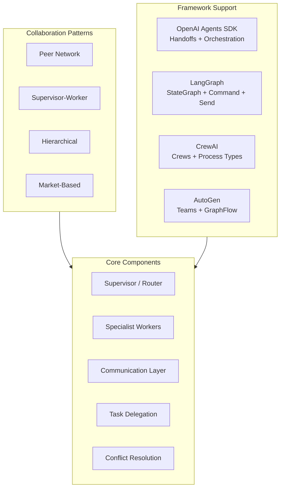

# Multi-agent systems

## Introduction

A single agent can handle a handful of tools effectively, but even powerful models struggle when given dozens of tools across multiple domains. The solution is the same one humans use: **specialization and teamwork**. Multi-agent systems divide complex tasks among specialized agents that collaborate, delegate, and coordinate to produce results no single agent could achieve alone.

In this lesson, we'll explore the architecture and patterns that make multi-agent systems work — from peer collaboration to hierarchical supervision, from message passing to conflict resolution.

### What we'll cover

| # | Topic | Description |
|---|-------|-------------|
| 1 | [Agent Collaboration Patterns](./01-agent-collaboration-patterns.md) | Peer, hierarchical, market-based, and blackboard architectures |
| 2 | [Supervisor Agents](./02-supervisor-agents.md) | Orchestration, task assignment, progress monitoring, quality control |
| 3 | [Specialist Agents](./03-specialist-agents.md) | Domain expertise, focused capabilities, role definition |
| 4 | [Agent Communication](./04-agent-communication.md) | Message passing, shared state, event-based coordination |
| 5 | [Task Delegation](./05-task-delegation.md) | Decomposition, agent selection, workload balancing, dependencies |
| 6 | [Conflict Resolution](./06-conflict-resolution.md) | Conflicting outputs, voting, consensus, arbitration |

### Prerequisites

- [Agent Fundamentals](../01-agent-fundamentals/) — core agent concepts and architecture
- [Tool Integration](../05-tool-integration/) — how agents use tools
- [Execution Loop Patterns](../06-execution-loop-patterns/) — agent execution models
- [Error Handling and Recovery](../08-error-handling-recovery/) — handling failures in agent systems

---

## Why multi-agent systems?

Single agents hit practical limits quickly:

| Limitation | Single Agent | Multi-Agent System |
|------------|-------------|-------------------|
| **Tool overload** | Struggles with 15+ tools | Each agent handles 3-5 tools |
| **Context pollution** | All instructions in one prompt | Focused prompts per role |
| **Error blast radius** | One failure affects everything | Failures are isolated to one agent |
| **Scalability** | Sequential processing | Parallel execution possible |
| **Specialization** | Jack of all trades | Domain experts |

### The multi-agent landscape

### Framework comparison for multi-agent systems

| Feature | OpenAI Agents SDK | LangGraph | CrewAI |
|---------|------------------|-----------|--------|
| **Multi-agent primitive** | Handoffs | Command + Send | Crews + Process |
| **Orchestration style** | LLM-driven or code | Graph-based routing | Sequential / Hierarchical |
| **Agent communication** | Conversation history transfer | Shared state (MessagesState) | Delegate work / Ask question tools |
| **Task delegation** | Agent-to-agent handoff | Send API for dynamic workers | `context` param between tasks |
| **Supervisor pattern** | Triage agent with handoffs | Supervisor node with Command | `Process.hierarchical` + manager_llm |
| **Parallel execution** | `asyncio.gather` | Fan-out edges + Send | `akickoff()` native async |
| **History management** | Input filters, nest_handoff_history | MessagesState with reducers | Automatic context passing |
| **Built-in collaboration** | — | — | `allow_delegation=True` auto-tools |

---

## Summary

✅ Multi-agent systems overcome single-agent limitations through specialization, isolation, and parallel execution

✅ Collaboration patterns range from peer networks to hierarchical supervisor-worker architectures

✅ Each major framework (OpenAI SDK, LangGraph, CrewAI) has distinct primitives for multi-agent orchestration

✅ The six topics in this lesson cover the complete lifecycle: patterns → supervision → specialization → communication → delegation → conflict resolution

**Next:** [Agent Collaboration Patterns](./01-agent-collaboration-patterns.md)

---

## Further reading

- [OpenAI — Orchestrating Multiple Agents](https://openai.github.io/openai-agents-python/multi_agent/) — LLM-driven and code-driven patterns
- [LangGraph — Multi-Agent Network](https://langchain-ai.github.io/langgraph/tutorials/multi_agent/multi-agent-collaboration/) — peer collaboration tutorial
- [CrewAI — Crews](https://docs.crewai.com/concepts/crews) — team-based agent orchestration
- [CrewAI — Collaboration](https://docs.crewai.com/concepts/collaboration) — delegation and communication patterns

*[Back to AI Agents overview](../00-overview.md)*

<!-- 
Sources Consulted:
- OpenAI multi-agent orchestration: https://openai.github.io/openai-agents-python/multi_agent/
- LangGraph multi-agent network: https://langchain-ai.github.io/langgraph/tutorials/multi_agent/multi-agent-collaboration/
- LangGraph workflows-agents: https://docs.langchain.com/oss/python/langgraph/workflows-agents
- CrewAI crews: https://docs.crewai.com/concepts/crews
- CrewAI collaboration: https://docs.crewai.com/concepts/collaboration
-->
