```mermaid
flowchart TD
    BB[🗂️ Blackboard<br>Shared Knowledge Space]
    A1[Fact Checker] -->|"read claims / write verdicts"| BB
    A2[Researcher] -->|"read gaps / write findings"| BB
    A3[Synthesizer] -->|"read all / write summary"| BB
    A4[Formatter] -->|"read summary / write output"| BB
```

# Agent collaboration patterns

## Introduction

How agents work together determines the capabilities and limitations of the entire system. Choose the wrong collaboration pattern and you'll fight coordination overhead, bottlenecks, or agents stepping on each other's work. Choose the right one and you get a system that's greater than the sum of its parts.

In this lesson, we'll explore the four fundamental collaboration architectures — peer networks, hierarchical structures, market-based coordination, and blackboard systems — and see how each maps to real framework implementations.

### What we'll cover

- Peer collaboration where agents coordinate as equals
- Hierarchical structures with supervisors directing workers
- Market-based coordination where agents bid on tasks
- Blackboard systems with shared knowledge spaces

### Prerequisites

- [Agent Fundamentals](../01-agent-fundamentals/) — core agent concepts
- [Execution Loop Patterns](../06-execution-loop-patterns/) — how agents execute tasks
- [State Management](../07-state-management/) — managing state across components

---

## Peer collaboration

In a peer network, agents operate as equals — no central coordinator decides who does what. Instead, each agent determines when to pass work to a colleague. This pattern works well when agents have clear, complementary capabilities and the workflow emerges naturally from their interactions.

### Architecture


In a peer network:
- Every agent can communicate with every other agent
- No single point of failure or bottleneck
- Routing decisions happen at each agent using the LLM's judgment
- The conversation "flows" to whoever is most relevant

### LangGraph implementation

LangGraph's multi-agent network pattern connects agents as peers, where each agent decides whether to hand off to a colleague or declare the work done:

```python
from langchain_core.messages import BaseMessage, HumanMessage
from langchain_anthropic import ChatAnthropic
from langgraph.prebuilt import create_react_agent
from langgraph.graph import MessagesState, StateGraph, START, END
from langgraph.types import Command
from typing import Literal

llm = ChatAnthropic(model="claude-sonnet-4-5-20250929")


def make_system_prompt(suffix: str) -> str:
    return (
        "You are a helpful AI assistant, collaborating with other assistants."
        " Use the provided tools to progress towards answering the question."
        " If you are unable to fully answer, that's OK — another assistant"
        " with different tools will help where you left off."
        " If you or any of the other assistants have the final answer,"
        " prefix your response with FINAL ANSWER so the team knows to stop."
        f"\n{suffix}"
    )


# Create specialized peer agents
research_agent = create_react_agent(
    llm,
    tools=[tavily_search],
    prompt=make_system_prompt(
        "You can only do research. You are working with a chart generator."
    ),
)

chart_agent = create_react_agent(
    llm,
    tools=[python_repl_tool],
    prompt=make_system_prompt(
        "You can only generate charts. You are working with a researcher."
    ),
)


def get_next_node(last_message: BaseMessage, goto: str):
    """Route to colleague or end based on agent output."""
    if "FINAL ANSWER" in last_message.content:
        return END
    return goto


def research_node(state: MessagesState) -> Command[Literal["chart_generator", END]]:
    result = research_agent.invoke(state)
    goto = get_next_node(result["messages"][-1], "chart_generator")
    # Wrap as HumanMessage so the next agent can process it
    result["messages"][-1] = HumanMessage(
        content=result["messages"][-1].content, name="researcher"
    )
    return Command(
        update={"messages": result["messages"]},
        goto=goto,
    )


def chart_node(state: MessagesState) -> Command[Literal["researcher", END]]:
    result = chart_agent.invoke(state)
    goto = get_next_node(result["messages"][-1], "researcher")
    result["messages"][-1] = HumanMessage(
        content=result["messages"][-1].content, name="chart_generator"
    )
    return Command(
        update={"messages": result["messages"]},
        goto=goto,
    )


# Build the peer network
workflow = StateGraph(MessagesState)
workflow.add_node("researcher", research_node)
workflow.add_node("chart_generator", chart_node)
workflow.add_edge(START, "researcher")

graph = workflow.compile()
```

**Output (conceptual):**
```
researcher: Found UK GDP data for 2019-2023...
chart_generator: Created line chart from the data...
chart_generator: FINAL ANSWER — Here is the GDP chart.
```

> **🔑 Key concept:** In a peer network, agents use `Command(goto=...)` to route to each other. The routing logic is simple — each agent either declares "FINAL ANSWER" or passes to the next peer.

### When to use peer collaboration

| ✅ Good for | ❌ Not ideal for |
|------------|----------------|
| 2-3 agents with complementary skills | 5+ agents (too many routing decisions) |
| Clear handoff signals ("FINAL ANSWER") | Ambiguous task boundaries |
| Simple pass-the-baton workflows | Tasks requiring centralized quality control |
| Research + analysis + visualization | Dynamic task decomposition |

---

## Hierarchical structures

In hierarchical systems, a **supervisor agent** coordinates the work of **worker agents**. The supervisor decides which worker handles each subtask, monitors progress, and synthesizes results. This is the most common pattern in production multi-agent systems.

### Architecture


### OpenAI Agents SDK implementation

The OpenAI Agents SDK implements hierarchy through **handoffs** — the supervisor agent has handoff connections to each specialist:

```python
from agents import Agent, Runner, handoff

# Define specialist workers
research_agent = Agent(
    name="Research Specialist",
    instructions="""You are a research specialist. 
    Gather information thoroughly and return structured findings.
    Focus only on research — do not write final reports.""",
    tools=[web_search_tool, document_search_tool],
)

writing_agent = Agent(
    name="Writing Specialist",
    instructions="""You are a writing specialist.
    Transform research findings into polished, well-structured content.
    Focus only on writing — do not conduct research yourself.""",
    tools=[],
)

review_agent = Agent(
    name="Review Specialist",
    instructions="""You are a quality reviewer.
    Check content for accuracy, clarity, and completeness.
    Provide specific, actionable feedback.""",
    tools=[],
)

# Supervisor with handoffs to all workers
supervisor = Agent(
    name="Project Supervisor",
    instructions="""You coordinate a team of specialists:
    - Research Specialist: for gathering information
    - Writing Specialist: for creating content
    - Review Specialist: for quality assurance
    
    Break down the user's request into subtasks.
    Delegate each subtask to the appropriate specialist.
    Synthesize their outputs into a final deliverable.""",
    handoffs=[research_agent, writing_agent, review_agent],
)

# Run the hierarchical system
result = await Runner.run(
    supervisor,
    input="Create a comprehensive report on AI trends in healthcare",
    max_turns=30,
)
print(result.final_output)
```

**Output:**
```
[Supervisor delegates research → Research Specialist gathers data →
 Supervisor delegates writing → Writing Specialist creates draft →
 Supervisor delegates review → Review Specialist provides feedback →
 Supervisor synthesizes final report]
```

### CrewAI hierarchical process

CrewAI has built-in support for hierarchical collaboration through its `Process.hierarchical` mode:

```python
from crewai import Agent, Crew, Task, Process

# Specialist agents
researcher = Agent(
    role="Research Analyst",
    goal="Find accurate, comprehensive data on any topic",
    backstory="Expert researcher with access to diverse sources",
    allow_delegation=False,  # Specialists don't delegate
    verbose=True
)

writer = Agent(
    role="Content Writer",
    goal="Create engaging, well-structured content",
    backstory="Skilled writer who transforms research into content",
    allow_delegation=False,
    verbose=True
)

# Tasks
research_task = Task(
    description="Research AI trends in healthcare for 2025-2026",
    expected_output="Comprehensive research summary with key findings",
    agent=researcher
)

writing_task = Task(
    description="Write a report based on the research findings",
    expected_output="Polished 2000-word report with clear structure",
    agent=writer,
    context=[research_task]  # Gets research output as input
)

# Hierarchical crew with manager
crew = Crew(
    agents=[researcher, writer],
    tasks=[research_task, writing_task],
    process=Process.hierarchical,  # Manager coordinates
    manager_llm="gpt-4o",         # LLM for the auto-created manager
    verbose=True
)

result = crew.kickoff()
print(result.raw)
```

**Output:**
```
[Manager assigns research_task to Research Analyst →
 Research Analyst completes research →
 Manager assigns writing_task to Content Writer (with research context) →
 Content Writer produces final report]
```

> **🤖 AI Context:** Hierarchical systems mirror how human organizations work — managers don't do the work themselves but coordinate specialists. The same principle applies: a supervisor agent with a strong orchestration prompt outperforms a single agent trying to do everything.

---

## Market-based coordination

In market-based systems, tasks are "auctioned" and agents "bid" based on their capabilities, availability, or confidence. The agent most suited to the task wins the bid. This pattern is useful when you have many agents with overlapping capabilities and want optimal task-agent matching.

### Architecture


### Implementation

```python
from dataclasses import dataclass, field
from typing import Optional
import asyncio


@dataclass
class TaskBid:
    """A bid from an agent for a task."""
    agent_name: str
    confidence: float      # 0.0-1.0, how well-suited for this task
    estimated_cost: float   # Token cost estimate
    estimated_time: float   # Seconds estimate
    
    @property
    def score(self) -> float:
        """Combined bid score — higher is better."""
        # Weight confidence most, penalize cost and time
        return (self.confidence * 0.6 
                - self.estimated_cost * 0.0001 * 0.2 
                - self.estimated_time * 0.01 * 0.2)


@dataclass
class AgentCapability:
    """Describes what an agent can do."""
    name: str
    domains: list[str]
    tools: list[str]
    max_concurrent: int = 1
    current_load: int = 0
    
    def bid_on_task(self, task_description: str) -> TaskBid:
        """Generate a bid based on task-domain match."""
        # Simple keyword matching for domain relevance
        description_lower = task_description.lower()
        domain_matches = sum(
            1 for domain in self.domains
            if domain.lower() in description_lower
        )
        
        confidence = min(domain_matches / max(len(self.domains), 1), 1.0)
        
        # Reduce confidence when agent is busy
        load_factor = 1 - (self.current_load / self.max_concurrent)
        confidence *= max(load_factor, 0.1)
        
        return TaskBid(
            agent_name=self.name,
            confidence=round(confidence, 2),
            estimated_cost=500 + (1 - confidence) * 1000,
            estimated_time=5 + (1 - confidence) * 15,
        )


class TaskAuction:
    """Auction system for task assignment."""
    
    def __init__(self, agents: list[AgentCapability]):
        self.agents = agents
    
    def assign_task(self, task_description: str) -> Optional[str]:
        """Collect bids and assign task to highest scorer."""
        bids = []
        for agent in self.agents:
            bid = agent.bid_on_task(task_description)
            bids.append(bid)
            print(f"  📋 {bid.agent_name}: confidence={bid.confidence}, "
                  f"score={bid.score:.3f}")
        
        if not bids:
            return None
        
        winner = max(bids, key=lambda b: b.score)
        print(f"  🏆 Winner: {winner.agent_name} (score: {winner.score:.3f})")
        return winner.agent_name


# Usage
agents = [
    AgentCapability(
        name="data_analyst",
        domains=["data", "statistics", "visualization", "charts"],
        tools=["python_repl", "sql_query"],
    ),
    AgentCapability(
        name="researcher",
        domains=["research", "search", "articles", "papers"],
        tools=["web_search", "arxiv_search"],
    ),
    AgentCapability(
        name="writer",
        domains=["writing", "report", "summary", "blog"],
        tools=["text_editor"],
    ),
]

auction = TaskAuction(agents)

print("Task: 'Analyze sales data and create visualization charts'")
winner = auction.assign_task("Analyze sales data and create visualization charts")

print(f"\nTask: 'Research recent papers on transformer architectures'")
winner = auction.assign_task("Research recent papers on transformer architectures")
```

**Output:**
```
Task: 'Analyze sales data and create visualization charts'
  📋 data_analyst: confidence=0.5, score=0.187
  📋 researcher: confidence=0.0, score=-0.130
  📋 writer: confidence=0.0, score=-0.130
  🏆 Winner: data_analyst (score: 0.187)

Task: 'Research recent papers on transformer architectures'
  📋 data_analyst: confidence=0.0, score=-0.130
  📋 researcher: confidence=0.5, score=0.187
  📋 writer: confidence=0.0, score=-0.130
  🏆 Winner: researcher (score: 0.187)
```

> **💡 Tip:** Market-based coordination is most valuable when you have many agents with overlapping capabilities. For systems with 2-4 clearly differentiated agents, hierarchical or peer patterns are simpler and more effective.

---

## Blackboard systems

A blackboard system uses a **shared knowledge space** that all agents can read from and write to. Agents monitor the blackboard for changes relevant to their expertise and contribute when they can. No direct agent-to-agent communication occurs — all interaction happens through the shared state.

### Architecture



### Implementation

```python
from dataclasses import dataclass, field
from enum import Enum
from typing import Any, Optional
from datetime import datetime


class EntryStatus(Enum):
    NEW = "new"
    IN_PROGRESS = "in_progress"
    COMPLETED = "completed"
    NEEDS_REVIEW = "needs_review"


@dataclass
class BlackboardEntry:
    """A single entry on the blackboard."""
    key: str
    value: Any
    author: str
    status: EntryStatus = EntryStatus.NEW
    timestamp: str = field(
        default_factory=lambda: datetime.now().isoformat()
    )
    metadata: dict = field(default_factory=dict)


class Blackboard:
    """Shared knowledge space for agent collaboration."""
    
    def __init__(self):
        self.entries: dict[str, BlackboardEntry] = {}
        self.listeners: dict[str, list[callable]] = {}
    
    def write(self, key: str, value: Any, author: str, 
              status: EntryStatus = EntryStatus.NEW, **metadata):
        """Write an entry to the blackboard."""
        entry = BlackboardEntry(
            key=key, value=value, author=author,
            status=status, metadata=metadata
        )
        self.entries[key] = entry
        self._notify(key, entry)
        print(f"  📝 [{author}] wrote '{key}': {str(value)[:80]}...")
    
    def read(self, key: str) -> Optional[BlackboardEntry]:
        """Read an entry from the blackboard."""
        return self.entries.get(key)
    
    def read_by_status(self, status: EntryStatus) -> list[BlackboardEntry]:
        """Find all entries with a given status."""
        return [e for e in self.entries.values() if e.status == status]
    
    def read_by_author(self, author: str) -> list[BlackboardEntry]:
        """Find all entries by a specific agent."""
        return [e for e in self.entries.values() if e.author == author]
    
    def subscribe(self, key_prefix: str, callback: callable):
        """Register a listener for changes matching a key prefix."""
        self.listeners.setdefault(key_prefix, []).append(callback)
    
    def _notify(self, key: str, entry: BlackboardEntry):
        """Notify listeners of changes."""
        for prefix, callbacks in self.listeners.items():
            if key.startswith(prefix):
                for cb in callbacks:
                    cb(entry)
    
    def summary(self) -> str:
        """Display current blackboard state."""
        lines = ["=== Blackboard State ==="]
        for key, entry in self.entries.items():
            lines.append(
                f"  [{entry.status.value}] {key} "
                f"(by {entry.author}): {str(entry.value)[:60]}"
            )
        return "\n".join(lines)


# Usage
board = Blackboard()

# Researcher adds findings
board.write("research.market_size", "$150B by 2030", author="researcher")
board.write("research.key_players", ["OpenAI", "Google", "Anthropic"], 
            author="researcher")

# Fact checker verifies
board.write("verified.market_size", True, author="fact_checker",
            status=EntryStatus.COMPLETED)

# Synthesizer reads all research and creates summary
findings = board.read_by_author("researcher")
board.write("synthesis.draft", 
            f"Summary based on {len(findings)} research entries",
            author="synthesizer")

print(board.summary())
```

**Output:**
```
  📝 [researcher] wrote 'research.market_size': $150B by 2030...
  📝 [researcher] wrote 'research.key_players': ['OpenAI', 'Google', 'Anthropic']...
  📝 [fact_checker] wrote 'verified.market_size': True...
  📝 [synthesizer] wrote 'synthesis.draft': Summary based on 2 research entries...
=== Blackboard State ===
  [new] research.market_size (by researcher): $150B by 2030
  [new] research.key_players (by researcher): ['OpenAI', 'Google', 'Anthropic']
  [completed] verified.market_size (by fact_checker): True
  [new] synthesis.draft (by synthesizer): Summary based on 2 research entries
```

> **🤖 AI Context:** LangGraph's `StateGraph` is essentially a formalized blackboard — agents (nodes) read from and write to a shared state. The graph structure just controls *when* each agent gets to read/write.

---

## Choosing the right pattern

| Pattern | Best for | Agents | Coordination | Complexity |
|---------|----------|--------|-------------|------------|
| **Peer network** | 2-3 complementary agents, clear handoffs | Few | Decentralized | Low |
| **Hierarchical** | Well-defined subtasks, quality control needed | 3-8 | Centralized (supervisor) | Medium |
| **Market-based** | Many agents with overlapping skills | 5+ | Auction-based | High |
| **Blackboard** | Asynchronous collaboration, knowledge accumulation | Any | Shared state | Medium |

---

## Best practices

| Practice | Why it matters |
|----------|----------------|
| Start with the simplest pattern that works | Peer for 2 agents, hierarchical for 3-8, market for 5+ |
| Give each agent a focused, non-overlapping role | Reduces confusion and conflicting outputs |
| Define explicit completion criteria | Without "FINAL ANSWER" or equivalent, agents loop forever |
| Limit the total number of agents | Each additional agent adds coordination overhead |
| Use the pattern your framework supports natively | Don't fight the framework — OpenAI SDK favors handoffs, CrewAI favors crews |

---

## Common pitfalls

| ❌ Mistake | ✅ Solution |
|-----------|-------------|
| Too many peer agents (5+) in a flat network | Use hierarchical with a supervisor to manage routing |
| Agents with overlapping responsibilities | Define clear boundaries — one domain per agent |
| No termination condition | Always include "FINAL ANSWER" checks or max-turn limits |
| Supervisor micromanaging every step | Let specialists work autonomously; supervisor synthesizes |
| Agents re-doing each other's work | Use shared state or context passing to show what's done |
| Choosing market-based for 2-3 agents | Overkill — peer or hierarchical is simpler and faster |

---

## Hands-on exercise

### Your task

Build a peer collaboration system with three agents — Researcher, Analyst, and Reporter — where each agent can pass work to either of the other two. Implement a `PeerNetwork` class that manages the routing.

### Requirements

1. Define three agents with distinct roles and tool lists
2. Implement routing logic where each agent decides the next agent or declares "DONE"
3. Include a step counter and max-steps safety limit
4. Track which agents participated and how many steps each took
5. Return the final output along with execution statistics

### Expected result

```python
network = PeerNetwork(agents=[researcher, analyst, reporter], max_steps=15)
result = network.run("Analyze recent trends in renewable energy adoption")
# result.output = "Final report on renewable energy trends..."
# result.stats = {"researcher": 3, "analyst": 2, "reporter": 1, "total_steps": 6}
```

<details>
<summary>💡 Hints (click to expand)</summary>

- Each agent returns a tuple of (output, next_agent_name_or_DONE)
- Use a dictionary to map agent names to their execution functions
- The routing loop continues until an agent returns "DONE" or max_steps is hit
- Track steps per agent using a `Counter` from the `collections` module

</details>

<details>
<summary>✅ Solution (click to expand)</summary>

```python
from collections import Counter
from dataclasses import dataclass, field
from typing import Callable, Optional


@dataclass
class AgentRole:
    """Defines a peer agent's role and behavior."""
    name: str
    description: str
    tools: list[str]
    process: Callable  # (input, context) -> (output, next_agent | "DONE")


@dataclass
class PeerResult:
    """Result of a peer network execution."""
    output: str
    stats: dict
    history: list[dict]


class PeerNetwork:
    """Manages a peer collaboration network."""
    
    def __init__(self, agents: list[AgentRole], max_steps: int = 15):
        self.agents = {a.name: a for a in agents}
        self.max_steps = max_steps
    
    def run(self, task: str, start_agent: Optional[str] = None) -> PeerResult:
        """Execute the peer network on a task."""
        current = start_agent or list(self.agents.keys())[0]
        context = {"task": task, "findings": []}
        history = []
        step_counter = Counter()
        
        for step in range(self.max_steps):
            agent = self.agents[current]
            output, next_agent = agent.process(task, context)
            
            step_counter[current] += 1
            history.append({
                "step": step + 1,
                "agent": current,
                "output_preview": output[:100],
                "next": next_agent
            })
            
            context["findings"].append({
                "from": current, 
                "content": output
            })
            
            if next_agent == "DONE":
                return PeerResult(
                    output=output,
                    stats={
                        **dict(step_counter),
                        "total_steps": step + 1
                    },
                    history=history
                )
            
            if next_agent not in self.agents:
                raise ValueError(
                    f"Agent '{current}' routed to unknown agent '{next_agent}'"
                )
            current = next_agent
        
        # Max steps reached
        last_output = history[-1]["output_preview"] if history else "No output"
        return PeerResult(
            output=f"[Max steps reached] {last_output}",
            stats={**dict(step_counter), "total_steps": self.max_steps},
            history=history
        )


# Example agent process functions
def researcher_process(task, context):
    findings = f"Research findings for: {task}"
    return (findings, "analyst")

def analyst_process(task, context):
    research = context["findings"][-1]["content"]
    analysis = f"Analysis of: {research}"
    return (analysis, "reporter")

def reporter_process(task, context):
    all_work = [f["content"] for f in context["findings"]]
    report = f"Final Report based on {len(all_work)} contributions"
    return (report, "DONE")


# Run the network
network = PeerNetwork(
    agents=[
        AgentRole("researcher", "Gathers info", ["search"], researcher_process),
        AgentRole("analyst", "Analyzes data", ["python"], analyst_process),
        AgentRole("reporter", "Writes reports", ["editor"], reporter_process),
    ],
    max_steps=15
)

result = network.run("Analyze trends in renewable energy")
print(f"Output: {result.output}")
print(f"Stats: {result.stats}")
```
</details>

### Bonus challenges

- [ ] Add a `confidence` field to each agent's output and route to a different agent if confidence is below a threshold
- [ ] Implement a `broadcast` mode where the task is sent to all agents simultaneously and results are merged
- [ ] Add a blackboard to the peer network so agents can share intermediate findings without direct routing

---

## Summary

✅ **Peer networks** connect agents as equals — simple for 2-3 agents with clear handoff signals, implemented via LangGraph `Command(goto=...)` routing

✅ **Hierarchical structures** use a supervisor to coordinate specialists — the most common production pattern, supported natively by OpenAI SDK handoffs and CrewAI `Process.hierarchical`

✅ **Market-based coordination** assigns tasks through bidding — useful for large agent pools with overlapping capabilities, but adds complexity

✅ **Blackboard systems** decouple agents via shared state — agents read/write independently, similar to how LangGraph's `StateGraph` manages shared state

**Next:** [Supervisor Agents](./02-supervisor-agents.md)

---

## Further reading

- [LangGraph — Multi-Agent Network Tutorial](https://langchain-ai.github.io/langgraph/tutorials/multi_agent/multi-agent-collaboration/) — peer collaboration with Command routing
- [OpenAI — Orchestrating Multiple Agents](https://openai.github.io/openai-agents-python/multi_agent/) — LLM-driven and code-driven patterns
- [CrewAI — Collaboration](https://docs.crewai.com/concepts/collaboration) — delegation tools and hierarchical patterns
- [AutoGen — Multi-Agent Conversation](https://arxiv.org/abs/2308.08155) — research paper on multi-agent patterns

*[Back to Multi-Agent Systems overview](./00-multi-agent-systems.md)*

<!-- 
Sources Consulted:
- LangGraph multi-agent network: https://langchain-ai.github.io/langgraph/tutorials/multi_agent/multi-agent-collaboration/
- OpenAI multi-agent orchestration: https://openai.github.io/openai-agents-python/multi_agent/
- CrewAI collaboration: https://docs.crewai.com/concepts/collaboration
- LangGraph workflows-agents: https://docs.langchain.com/oss/python/langgraph/workflows-agents
-->
