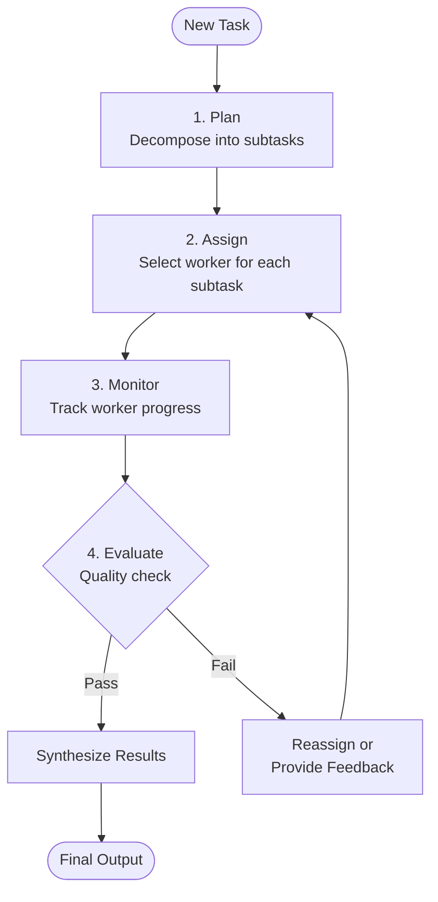

# Supervisor agents

## Introduction

A supervisor agent is the "manager" of a multi-agent system — it doesn't do the actual work but decides *who* does what, *when* they do it, and whether the output meets quality standards. Good supervisor design is the difference between a well-coordinated team and a group of agents talking past each other.

In this lesson, we'll build supervisor agents that assign tasks intelligently, monitor worker progress, enforce quality standards, and handle failures gracefully. We'll implement these patterns across OpenAI Agents SDK, LangGraph, and CrewAI.

### What we'll cover

- The supervisor's orchestration role and decision-making loop
- Task assignment strategies based on worker capabilities
- Progress monitoring to detect stalled or failed workers
- Quality control through evaluation and feedback loops

### Prerequisites

- [Agent Collaboration Patterns](./01-agent-collaboration-patterns.md) — hierarchical pattern overview
- [Execution Loop Patterns](../06-execution-loop-patterns/) — agent execution models
- [Error Handling and Recovery](../08-error-handling-recovery/) — handling worker failures

---

## The orchestration role

A supervisor agent sits at the center of a multi-agent system and makes four key decisions at each step:



### Supervisor vs. worker responsibilities

| Responsibility | Supervisor | Worker |
|---------------|-----------|--------|
| Task decomposition | ✅ Breaks down complex tasks | ❌ Receives focused subtasks |
| Tool selection | ❌ Has no domain tools | ✅ Uses specialized tools |
| Quality assessment | ✅ Evaluates worker outputs | ❌ Just produces output |
| Error handling | ✅ Reassigns on failure | ✅ Reports errors back |
| Final synthesis | ✅ Combines all worker outputs | ❌ Returns individual results |

### OpenAI SDK: triage agent as supervisor

The most common supervisor pattern in the OpenAI Agents SDK is a **triage agent** that routes work to specialists via handoffs:

```python
from agents import Agent, handoff, Runner
from agents.extensions.handoff_prompt import RECOMMENDED_PROMPT_PREFIX

# Specialist workers
billing_agent = Agent(
    name="Billing Specialist",
    handoff_description="Handles billing inquiries, invoices, payment issues",
    instructions="You handle billing questions. Be precise with amounts.",
    tools=[lookup_invoice, process_refund],
)

technical_agent = Agent(
    name="Technical Support",
    handoff_description="Handles technical issues, bugs, configuration problems",
    instructions="You solve technical problems. Ask for error messages.",
    tools=[search_knowledge_base, check_system_status],
)

account_agent = Agent(
    name="Account Manager",
    handoff_description="Handles account changes, upgrades, cancellations",
    instructions="You manage account changes. Verify identity first.",
    tools=[update_account, check_subscription],
)

# Supervisor (triage) agent
supervisor = Agent(
    name="Customer Support Supervisor",
    instructions=f"""{RECOMMENDED_PROMPT_PREFIX}
    You are the first point of contact for customer support.
    
    Your job:
    1. Understand the customer's issue
    2. Route to the appropriate specialist
    3. If the issue spans multiple areas, handle one at a time
    
    Available specialists:
    - Billing Specialist: payment, invoice, refund issues
    - Technical Support: bugs, errors, configuration
    - Account Manager: upgrades, cancellations, account changes
    
    Never try to solve issues yourself — always delegate.""",
    handoffs=[billing_agent, technical_agent, account_agent],
)

# Run
result = await Runner.run(
    supervisor,
    input="I was charged twice and now my account is locked",
)
print(result.final_output)
```

**Output:**
```
[Supervisor identifies two issues: billing (double charge) + technical (locked account)]
[Routes to Billing Specialist first → resolves double charge]
[Routes to Technical Support → unlocks account]
[Returns combined resolution to user]
```

---

## Task assignment strategies

A supervisor needs a strategy for deciding which worker handles which task. The strategy depends on your system's requirements.

### Strategy comparison

| Strategy | How it works | Best for |
|----------|-------------|----------|
| **Rule-based routing** | Keyword/category matching | Predictable task types |
| **LLM-based routing** | Supervisor LLM decides | Complex, ambiguous tasks |
| **Capability matching** | Compare task requirements to agent skills | Large agent pools |
| **Round-robin** | Distribute evenly across agents | Load balancing |

### LLM-based routing with structured output

```python
from pydantic import BaseModel, Field
from typing import Literal


class TaskAssignment(BaseModel):
    """Supervisor's decision on task assignment."""
    worker: Literal["researcher", "analyst", "writer"] = Field(
        description="Which worker should handle this task"
    )
    subtask: str = Field(
        description="Specific instructions for the worker"
    )
    reasoning: str = Field(
        description="Why this worker was chosen"
    )
    priority: Literal["low", "medium", "high"] = Field(
        description="Task priority level"
    )


# Create a structured router
router_llm = llm.with_structured_output(TaskAssignment)

# Supervisor decides
assignment = router_llm.invoke([
    {"role": "system", "content": """You assign tasks to workers:
    - researcher: finding information, searching databases, gathering data
    - analyst: processing data, statistics, creating charts, pattern analysis
    - writer: creating reports, summaries, documentation, emails"""},
    {"role": "user", "content": "Create a quarterly sales analysis report"}
])

print(f"Worker: {assignment.worker}")
print(f"Subtask: {assignment.subtask}")
print(f"Reasoning: {assignment.reasoning}")
print(f"Priority: {assignment.priority}")
```

**Output:**
```
Worker: analyst
Subtask: Analyze quarterly sales data — calculate trends, compare to previous quarters, identify top/bottom performers
Reasoning: This task requires data processing and statistical analysis before any report can be written
Priority: high
```

### Multi-step planning

For complex tasks, the supervisor should decompose the work into an ordered plan:

```python
from pydantic import BaseModel, Field
from typing import Literal


class SubTask(BaseModel):
    """A single subtask in the execution plan."""
    id: int
    worker: str
    description: str
    depends_on: list[int] = Field(
        default_factory=list,
        description="IDs of subtasks that must complete first"
    )


class ExecutionPlan(BaseModel):
    """Supervisor's complete execution plan."""
    goal: str
    subtasks: list[SubTask]
    estimated_steps: int


planner_llm = llm.with_structured_output(ExecutionPlan)

plan = planner_llm.invoke([
    {"role": "system", "content": """Create an execution plan.
    Available workers: researcher, analyst, writer, reviewer.
    Break the task into subtasks with dependencies."""},
    {"role": "user", "content": "Produce a competitive analysis report on AI coding tools"}
])

print(f"Goal: {plan.goal}")
print(f"Estimated steps: {plan.estimated_steps}")
for task in plan.subtasks:
    deps = f" (after: {task.depends_on})" if task.depends_on else ""
    print(f"  [{task.id}] {task.worker}: {task.description}{deps}")
```

**Output:**
```
Goal: Competitive analysis of AI coding tools
Estimated steps: 5
  [1] researcher: Identify top AI coding tools (Copilot, Cursor, Cody, etc.)
  [2] researcher: Gather pricing, features, and user reviews for each tool (after: [1])
  [3] analyst: Compare features, create comparison matrices and charts (after: [2])
  [4] writer: Write competitive analysis report with recommendations (after: [3])
  [5] reviewer: Review report for accuracy, completeness, and clarity (after: [4])
```

---

## Progress monitoring

A supervisor must track whether workers are making progress or getting stuck. We combine the stuck detection techniques from [lesson 08](../08-error-handling-recovery/05-stuck-detection.md) with supervisor-level monitoring.

### Worker status tracking

```python
from dataclasses import dataclass, field
from enum import Enum
from time import time
from typing import Optional


class WorkerStatus(Enum):
    IDLE = "idle"
    WORKING = "working"
    COMPLETED = "completed"
    FAILED = "failed"
    STALLED = "stalled"


@dataclass
class WorkerState:
    """Tracks the current state of a worker agent."""
    name: str
    status: WorkerStatus = WorkerStatus.IDLE
    current_task: Optional[str] = None
    started_at: Optional[float] = None
    steps_taken: int = 0
    max_steps: int = 10
    timeout_seconds: float = 120.0
    result: Optional[str] = None
    error: Optional[str] = None
    
    def start_task(self, task: str):
        self.status = WorkerStatus.WORKING
        self.current_task = task
        self.started_at = time()
        self.steps_taken = 0
        self.result = None
        self.error = None
    
    def record_step(self):
        self.steps_taken += 1
        if self.steps_taken >= self.max_steps:
            self.status = WorkerStatus.STALLED
    
    def complete(self, result: str):
        self.status = WorkerStatus.COMPLETED
        self.result = result
    
    def fail(self, error: str):
        self.status = WorkerStatus.FAILED
        self.error = error
    
    def check_timeout(self) -> bool:
        if self.started_at and self.status == WorkerStatus.WORKING:
            elapsed = time() - self.started_at
            if elapsed > self.timeout_seconds:
                self.status = WorkerStatus.STALLED
                return True
        return False


class SupervisorMonitor:
    """Monitors all workers and takes action on issues."""
    
    def __init__(self, workers: list[str]):
        self.workers = {
            name: WorkerState(name=name)
            for name in workers
        }
    
    def assign(self, worker_name: str, task: str):
        self.workers[worker_name].start_task(task)
        print(f"📋 Assigned to {worker_name}: {task[:60]}")
    
    def check_all(self) -> list[dict]:
        """Check all workers and return any issues."""
        issues = []
        for name, worker in self.workers.items():
            worker.check_timeout()
            if worker.status == WorkerStatus.STALLED:
                issues.append({
                    "worker": name,
                    "issue": "stalled",
                    "steps": worker.steps_taken,
                    "task": worker.current_task
                })
            elif worker.status == WorkerStatus.FAILED:
                issues.append({
                    "worker": name,
                    "issue": "failed",
                    "error": worker.error,
                    "task": worker.current_task
                })
        return issues
    
    def dashboard(self) -> str:
        """Display worker status dashboard."""
        icons = {
            WorkerStatus.IDLE: "⚪",
            WorkerStatus.WORKING: "🔵",
            WorkerStatus.COMPLETED: "🟢",
            WorkerStatus.FAILED: "🔴",
            WorkerStatus.STALLED: "🟡",
        }
        lines = ["=== Worker Dashboard ==="]
        for name, w in self.workers.items():
            icon = icons[w.status]
            task = f" — {w.current_task[:40]}" if w.current_task else ""
            lines.append(f"  {icon} {name}: {w.status.value}{task}")
        return "\n".join(lines)


# Usage
monitor = SupervisorMonitor(["researcher", "analyst", "writer"])
monitor.assign("researcher", "Find competitive data on AI coding tools")
monitor.assign("analyst", "Analyze pricing models across competitors")

# Simulate researcher getting stuck
for _ in range(10):
    monitor.workers["researcher"].record_step()

# Check status
issues = monitor.check_all()
for issue in issues:
    print(f"⚠️ {issue['worker']}: {issue['issue']} after {issue['steps']} steps")

print(monitor.dashboard())
```

**Output:**
```
📋 Assigned to researcher: Find competitive data on AI coding tools
📋 Assigned to analyst: Analyze pricing models across competitors
⚠️ researcher: stalled after 10 steps
=== Worker Dashboard ===
  🟡 researcher: stalled — Find competitive data on AI coding tools
  🔵 analyst: working — Analyze pricing models across competitors
  ⚪ writer: idle
```

---

## Quality control

The supervisor's final responsibility is ensuring worker outputs meet quality standards before synthesis. This uses the evaluator-optimizer pattern.

### Evaluation loop

```python
from pydantic import BaseModel, Field
from typing import Literal


class QualityEvaluation(BaseModel):
    """Supervisor's quality assessment of worker output."""
    verdict: Literal["accept", "revise", "reject"] = Field(
        description="Whether the output meets quality standards"
    )
    score: float = Field(
        description="Quality score from 0.0 to 1.0"
    )
    feedback: str = Field(
        description="Specific feedback for improvement"
    )
    issues: list[str] = Field(
        default_factory=list,
        description="List of specific issues found"
    )


evaluator_llm = llm.with_structured_output(QualityEvaluation)


async def evaluate_worker_output(
    task_description: str,
    worker_output: str,
    quality_criteria: list[str]
) -> QualityEvaluation:
    """Supervisor evaluates a worker's output."""
    criteria_text = "\n".join(f"- {c}" for c in quality_criteria)
    
    evaluation = evaluator_llm.invoke([
        {"role": "system", "content": f"""Evaluate this output against quality criteria.
        
        Quality criteria:
        {criteria_text}
        
        Be strict but fair. Only accept outputs that meet ALL criteria."""},
        {"role": "user", "content": f"""Task: {task_description}
        
        Worker output:
        {worker_output}"""}
    ])
    
    return evaluation


# Usage pattern in supervisor loop
async def supervisor_loop(task: str, workers: dict, max_revisions: int = 3):
    """Supervisor assigns, evaluates, and re-assigns until quality passes."""
    criteria = [
        "Contains specific data points, not just generalizations",
        "Covers all aspects mentioned in the task description",
        "Well-structured with clear sections",
        "No factual contradictions"
    ]
    
    worker_name = "researcher"
    output = await workers[worker_name].run(task)
    
    for revision in range(max_revisions):
        evaluation = await evaluate_worker_output(task, output, criteria)
        
        print(f"  Round {revision + 1}: {evaluation.verdict} "
              f"(score: {evaluation.score})")
        
        if evaluation.verdict == "accept":
            return output
        
        if evaluation.verdict == "reject":
            # Try a different worker
            worker_name = "backup_researcher"
        
        # Provide feedback and re-run
        enhanced_task = (
            f"{task}\n\nPrevious attempt feedback:\n{evaluation.feedback}"
            f"\n\nIssues to fix:\n"
            + "\n".join(f"- {issue}" for issue in evaluation.issues)
        )
        output = await workers[worker_name].run(enhanced_task)
    
    return output  # Return best effort after max revisions
```

**Output:**
```
  Round 1: revise (score: 0.6)
  Round 2: revise (score: 0.8)
  Round 3: accept (score: 0.92)
```

> **🔑 Key concept:** The evaluator-optimizer loop is the quality backbone of supervised systems. The supervisor never generates content — it only *judges* content and provides feedback for improvement.

### LangGraph evaluator-optimizer

LangGraph implements this pattern with a conditional edge that loops back to the generator:

```python
from langgraph.graph import StateGraph, START, END
from typing_extensions import TypedDict, Literal


class EvalState(TypedDict):
    task: str
    output: str
    feedback: str
    verdict: str


def generate(state: EvalState):
    """Worker generates output, incorporating feedback if available."""
    prompt = state["task"]
    if state.get("feedback"):
        prompt += f"\n\nFeedback to address: {state['feedback']}"
    
    result = llm.invoke(prompt)
    return {"output": result.content}


def evaluate(state: EvalState):
    """Supervisor evaluates the output."""
    grade = evaluator_llm.invoke(
        f"Evaluate this output for the task '{state['task']}':\n\n"
        f"{state['output']}"
    )
    return {"verdict": grade.verdict, "feedback": grade.feedback}


def route_evaluation(state: EvalState) -> Literal["generate", "__end__"]:
    if state["verdict"] == "accept":
        return END
    return "generate"  # Loop back with feedback


builder = StateGraph(EvalState)
builder.add_node("generate", generate)
builder.add_node("evaluate", evaluate)

builder.add_edge(START, "generate")
builder.add_edge("generate", "evaluate")
builder.add_conditional_edges("evaluate", route_evaluation)

graph = builder.compile()
```

---

## Best practices

| Practice | Why it matters |
|----------|----------------|
| Give the supervisor zero domain tools | It should only orchestrate, never do the work itself |
| Use structured output for routing decisions | Parsed JSON is more reliable than free-text routing |
| Set max revisions per subtask | Prevents infinite evaluate-revise loops |
| Log all supervisor decisions | Essential for debugging multi-agent flows |
| Include "reasoning" in routing output | Explains *why* a worker was chosen for traceability |
| Monitor token usage at the supervisor level | Supervisor calls add overhead — keep prompts focused |

---

## Common pitfalls

| ❌ Mistake | ✅ Solution |
|-----------|-------------|
| Supervisor tries to do work instead of delegating | Remove all domain tools — give it only routing/handoff capabilities |
| No quality gate before synthesis | Always evaluate worker outputs before combining them |
| Supervisor re-routes to same stalled worker | Track worker failures and try alternatives after 2-3 failures |
| Overly complex routing prompts | Keep supervisor instructions focused on *who* and *when*, not *how* |
| No plan — supervisor makes one decision at a time | Use multi-step planning (ExecutionPlan) for complex tasks |
| Supervisor evaluates its own output | Use a separate evaluator LLM or at minimum a different prompt |

---

## Hands-on exercise

### Your task

Build a `SupervisorAgent` class that manages a team of workers through a plan-assign-evaluate cycle. The supervisor should create a plan, assign subtasks to workers, evaluate results, and re-assign on failure.

### Requirements

1. Accept a task and decompose it into 2-4 subtasks with dependencies
2. Assign each subtask to the most appropriate worker (from a registered pool)
3. Evaluate each worker's output against quality criteria
4. Re-assign to a different worker if evaluation fails twice
5. Return a `SupervisorResult` with the final output, execution log, and quality scores

### Expected result

```python
supervisor = SupervisorAgent(
    workers={"researcher": researcher_fn, "analyst": analyst_fn, "writer": writer_fn},
    max_revisions=3
)
result = supervisor.execute("Create a market analysis of cloud AI platforms")
# result.final_output = "Combined report..."
# result.quality_scores = {"research": 0.9, "analysis": 0.85, "writing": 0.92}
# result.execution_log = [{"subtask": ..., "worker": ..., "revisions": 1}, ...]
```

<details>
<summary>💡 Hints (click to expand)</summary>

- Use a Pydantic model for the execution plan (structured output)
- Process subtasks in dependency order — topological sort
- Track revisions per subtask and switch workers after max failures
- The quality evaluator should use a different prompt than the supervisor's routing prompt

</details>

<details>
<summary>✅ Solution (click to expand)</summary>

```python
from dataclasses import dataclass, field
from typing import Callable, Optional


@dataclass
class SubTaskResult:
    subtask: str
    worker: str
    output: str
    quality_score: float
    revisions: int


@dataclass
class SupervisorResult:
    final_output: str
    quality_scores: dict[str, float]
    execution_log: list[SubTaskResult]
    total_revisions: int


class SupervisorAgent:
    """Manages workers through a plan-assign-evaluate cycle."""
    
    def __init__(
        self,
        workers: dict[str, Callable],
        max_revisions: int = 3,
        quality_threshold: float = 0.7
    ):
        self.workers = workers
        self.max_revisions = max_revisions
        self.quality_threshold = quality_threshold
    
    def plan(self, task: str) -> list[dict]:
        """Decompose task into subtasks."""
        # In production, use LLM with structured output
        return [
            {"id": 1, "worker": "researcher", "task": f"Research: {task}",
             "depends_on": []},
            {"id": 2, "worker": "analyst", "task": f"Analyze research on: {task}",
             "depends_on": [1]},
            {"id": 3, "worker": "writer", "task": f"Write report on: {task}",
             "depends_on": [2]},
        ]
    
    def evaluate(self, output: str, task: str) -> tuple[float, str]:
        """Evaluate output quality. Returns (score, feedback)."""
        # In production, use LLM evaluator
        score = 0.85 if len(output) > 50 else 0.4
        feedback = "" if score >= self.quality_threshold else "Too brief"
        return score, feedback
    
    def execute(self, task: str) -> SupervisorResult:
        """Execute the full supervisor cycle."""
        plan = self.plan(task)
        results = []
        context = {}
        
        for subtask in plan:
            worker_name = subtask["worker"]
            subtask_desc = subtask["task"]
            
            # Add context from dependencies
            for dep_id in subtask["depends_on"]:
                dep_result = next(
                    r for r in results if True  # Match by order
                )
                subtask_desc += f"\n\nContext: {dep_result.output[:200]}"
            
            # Execute with evaluation loop
            worker_fn = self.workers[worker_name]
            output = worker_fn(subtask_desc)
            
            for revision in range(self.max_revisions):
                score, feedback = self.evaluate(output, subtask_desc)
                
                if score >= self.quality_threshold:
                    results.append(SubTaskResult(
                        subtask=subtask_desc, worker=worker_name,
                        output=output, quality_score=score,
                        revisions=revision
                    ))
                    break
                
                # Try with feedback
                enhanced = f"{subtask_desc}\nFeedback: {feedback}"
                output = worker_fn(enhanced)
            else:
                # Max revisions — accept best effort
                results.append(SubTaskResult(
                    subtask=subtask_desc, worker=worker_name,
                    output=output, quality_score=score,
                    revisions=self.max_revisions
                ))
        
        # Synthesize
        final = "\n\n---\n\n".join(r.output for r in results)
        
        return SupervisorResult(
            final_output=final,
            quality_scores={
                r.worker: r.quality_score for r in results
            },
            execution_log=results,
            total_revisions=sum(r.revisions for r in results)
        )
```
</details>

### Bonus challenges

- [ ] Add parallel execution for subtasks that have no dependencies on each other
- [ ] Implement a "worker pool" where the supervisor can choose from multiple workers per role (e.g., 2 researchers) and pick the less-busy one
- [ ] Add cost tracking — each worker call costs tokens, and the supervisor has a token budget

---

## Summary

✅ **Supervisors orchestrate, not execute** — they decompose tasks, assign workers, evaluate outputs, and synthesize results without using domain tools themselves

✅ **LLM-based routing with structured output** produces reliable, parseable task assignments with reasoning — more maintainable than keyword matching

✅ **Progress monitoring** catches stalled or failed workers early — combining step counts, timeouts, and status dashboards prevents wasted resources

✅ **Quality control loops** (evaluator-optimizer) ensure worker outputs meet standards before synthesis — the supervisor provides specific, actionable feedback for revisions

**Next:** [Specialist Agents](./03-specialist-agents.md)

---

## Further reading

- [OpenAI — Orchestrating Multiple Agents](https://openai.github.io/openai-agents-python/multi_agent/) — triage agent pattern
- [LangGraph — Workflows and Agents](https://docs.langchain.com/oss/python/langgraph/workflows-agents) — evaluator-optimizer pattern
- [CrewAI — Crews (Hierarchical Process)](https://docs.crewai.com/concepts/crews) — `Process.hierarchical` with manager_llm
- [OpenAI Agents SDK — Handoffs](https://openai.github.io/openai-agents-python/handoffs/) — handoff configuration and input filters

*[Back to Multi-Agent Systems overview](./00-multi-agent-systems.md)*

<!-- 
Sources Consulted:
- OpenAI multi-agent: https://openai.github.io/openai-agents-python/multi_agent/
- OpenAI handoffs: https://openai.github.io/openai-agents-python/handoffs/
- LangGraph workflows-agents: https://docs.langchain.com/oss/python/langgraph/workflows-agents
- CrewAI crews: https://docs.crewai.com/concepts/crews
-->
