# Specialist agents

## Introduction

Specialist agents are the workers that do the actual domain work in a multi-agent system. While supervisors decide *who* and *when*, specialists decide *how*. A well-designed specialist has a narrow scope, focused tools, and clear instructions — it does one thing and does it well.

In this lesson, we'll define specialist agents across OpenAI Agents SDK, LangGraph, and CrewAI, learn how to scope their capabilities, compose them into teams, and avoid the common trap of building "jack-of-all-trades" agents that underperform.

### What we'll cover

- Defining domain expertise through focused instructions and tool sets
- Scoping capabilities to keep specialists reliable
- Composing specialists into teams for complex workflows
- Role definition patterns across frameworks

### Prerequisites

- [Supervisor Agents](./02-supervisor-agents.md) — how supervisors assign work
- [Tool Integration Fundamentals](../05-tool-integration-fundamentals/) — building agent tools
- [Agent Collaboration Patterns](./01-agent-collaboration-patterns.md) — how agents work together

---

## Defining domain expertise

A specialist agent's expertise comes from three elements working together:

```mermaid
flowchart LR
    INSTRUCTIONS["🎯 Instructions<br>What the agent knows"] --> SPECIALIST((Specialist<br>Agent))
    TOOLS["🔧 Tools<br>What it can do"] --> SPECIALIST
    CONSTRAINTS["🚫 Constraints<br>What it should NOT do"] --> SPECIALIST
    SPECIALIST --> OUTPUT["📦 Focused<br>Output"]
```



### The expertise triad

| Element | Purpose | Example (Research Agent) |
|---------|---------|--------------------------|
| **Instructions** | Domain knowledge and approach | "Search academic databases. Summarize findings with citations." |
| **Tools** | Actions it can take | `search_arxiv`, `search_pubmed`, `fetch_paper` |
| **Constraints** | Boundaries to prevent scope creep | "Never write conclusions — only gather evidence." |

> **🔑 Key concept:** Specialists perform better with fewer tools and tighter instructions. An agent with 3 focused tools outperforms one with 15 generic tools because the LLM has fewer options to get confused by.

### OpenAI Agents SDK specialist definition

```python
from agents import Agent

research_agent = Agent(
    name="Research Specialist",
    handoff_description="Gathers information from databases and web sources",
    instructions="""You are a research specialist. Your job is ONLY to gather 
    and summarize information.
    
    Rules:
    1. Always cite your sources with URLs or paper titles
    2. Present findings as bullet points with evidence
    3. Never draw conclusions or make recommendations
    4. If you can't find reliable data, say so explicitly
    5. Limit results to the top 5 most relevant sources""",
    tools=[search_web, search_arxiv, fetch_webpage],
)

analysis_agent = Agent(
    name="Data Analyst",
    handoff_description="Analyzes data, creates statistics, identifies patterns",
    instructions="""You are a data analysis specialist. Your job is ONLY to 
    analyze data and produce statistics.
    
    Rules:
    1. Always show your calculations
    2. Include confidence intervals when possible
    3. Present results in tables
    4. Never write narrative text — only data and numbers
    5. Flag any data quality issues you notice""",
    tools=[run_statistics, create_chart, query_database],
)

writing_agent = Agent(
    name="Technical Writer",
    handoff_description="Writes clear, structured reports and documentation",
    instructions="""You are a technical writing specialist. Your job is ONLY to
    write well-structured documents from provided data and analysis.
    
    Rules:
    1. Use the provided research and analysis — never make up data
    2. Follow the structure: Executive Summary → Findings → Recommendations
    3. Write in active voice with short sentences
    4. Include section headings every 200-300 words
    5. End with 3-5 actionable recommendations""",
    tools=[format_document, check_grammar],
)
```

**Key pattern:** Each agent has 3-5 tools maximum and instructions that explicitly state what it should *not* do.

---

## Scoping capabilities

The most common mistake in multi-agent design is making specialists too broad. Here's how to scope them properly.

### The capability boundary test

Ask these questions for each specialist:

1. **Can another agent do this better?** → If yes, remove it from this specialist
2. **Does this capability require different tools?** → If yes, it belongs in a different specialist
3. **Would removing this capability reduce quality for the primary task?** → If no, remove it

### Too broad vs. focused

```python
# ❌ Too broad — this agent does everything
bad_agent = Agent(
    name="Research and Analysis and Writing Agent",
    instructions="Research topics, analyze data, and write reports.",
    tools=[
        search_web, search_arxiv,  # Research tools
        run_statistics, create_chart, query_database,  # Analysis tools
        format_document, check_grammar, translate,  # Writing tools
        send_email, schedule_meeting,  # Admin tools
    ],
)

# ✅ Focused — does one thing well
good_agent = Agent(
    name="Research Specialist",
    instructions="""Find and summarize information from academic and web sources.
    Return bullet-point summaries with source citations.
    Do NOT analyze data or write reports.""",
    tools=[search_web, search_arxiv, fetch_webpage],
)
```

### CrewAI role definition

CrewAI uses three properties to define a specialist's identity:

```python
from crewai import Agent

senior_researcher = Agent(
    role="Senior Research Analyst",
    goal="Find comprehensive, accurate information on assigned topics "
         "with proper source citations",
    backstory="""You are a veteran research analyst with 15 years of 
    experience in technology market research. You're known for your 
    thoroughness and ability to find non-obvious insights. You always 
    verify information from multiple sources before reporting it.""",
    tools=[search_tool, scrape_tool],
    allow_delegation=False,  # Specialists don't delegate
    verbose=True,
)

data_engineer = Agent(
    role="Data Engineer",
    goal="Transform raw data into clean, structured datasets "
         "ready for analysis",
    backstory="""You are a meticulous data engineer who believes in 
    data quality above all else. You always validate data types, 
    check for missing values, and document your transformation steps.""",
    tools=[query_db, transform_data, validate_schema],
    allow_delegation=False,
    verbose=True,
)
```

> **🤖 AI Context:** CrewAI's `backstory` field shapes how the LLM approaches problems. A backstory like "meticulous, validates everything" produces more careful outputs than "fast-moving, ships quickly." Choose backstories that align with the quality you need.

### LangGraph specialist with create_react_agent

```python
from langgraph.prebuilt import create_react_agent


def make_research_agent(llm, tools):
    """Create a focused research specialist."""
    prompt = """You are a research specialist.
    
    Your ONLY job: Find and summarize information.
    
    Output format:
    ## Findings
    - [Source 1](url): Key finding
    - [Source 2](url): Key finding
    
    ## Confidence
    High/Medium/Low with explanation
    
    NEVER: Draw conclusions, make recommendations, or write reports."""
    
    return create_react_agent(
        model=llm,
        tools=tools,
        prompt=prompt,
    )


research_agent = make_research_agent(llm, [search_web, fetch_page])
analysis_agent = make_research_agent(llm, [run_query, compute_stats])
```

---

## Composing specialists into teams

Individual specialists become powerful when composed into teams. The composition pattern defines how specialists interact.

### Sequential pipeline

Specialists execute in order, each receiving the output of the previous one:

```python
from crewai import Agent, Task, Crew, Process

# Define agents
researcher = Agent(
    role="Market Researcher",
    goal="Gather comprehensive market data",
    backstory="Expert at finding market data and trends.",
    tools=[search_tool],
    allow_delegation=False,
)

analyst = Agent(
    role="Market Analyst",
    goal="Analyze market data and identify opportunities",
    backstory="Expert at statistical analysis and trend identification.",
    tools=[analysis_tool],
    allow_delegation=False,
)

strategist = Agent(
    role="Strategy Consultant",
    goal="Create actionable strategy recommendations",
    backstory="Expert at turning analysis into strategic plans.",
    tools=[],
    allow_delegation=False,
)

# Define tasks with context dependencies
research_task = Task(
    description="Research the current state of the AI coding tools market",
    expected_output="Comprehensive market data with sources",
    agent=researcher,
)

analysis_task = Task(
    description="Analyze the market data and identify key opportunities",
    expected_output="Statistical analysis with opportunity rankings",
    agent=analyst,
    context=[research_task],  # Receives research output
)

strategy_task = Task(
    description="Create a market entry strategy based on the analysis",
    expected_output="3-5 strategic recommendations with justification",
    agent=strategist,
    context=[analysis_task],  # Receives analysis output
)

# Compose into sequential crew
crew = Crew(
    agents=[researcher, analyst, strategist],
    tasks=[research_task, analysis_task, strategy_task],
    process=Process.sequential,
    verbose=True,
)

result = crew.kickoff()
print(result)
```

**Output:**
```
[2024-01-15 10:00:01] Working Agent: Market Researcher
[2024-01-15 10:00:01] Starting Task: Research the current state of...
...
[2024-01-15 10:00:15] Working Agent: Market Analyst
[2024-01-15 10:00:15] Starting Task: Analyze the market data...
...
[2024-01-15 10:00:28] Working Agent: Strategy Consultant
[2024-01-15 10:00:28] Starting Task: Create a market entry strategy...
...
Final result: 5 strategic recommendations with market justification
```

### Parallel specialists

When subtasks are independent, specialists can run in parallel:

```python
from langgraph.graph import StateGraph, START, END
from typing import Annotated
import operator


class ParallelState(TypedDict):
    query: str
    web_results: str
    academic_results: str
    patent_results: str
    combined: str


def web_researcher(state: ParallelState):
    """Specialist: search the web."""
    result = web_search_agent.invoke(state["query"])
    return {"web_results": result}


def academic_researcher(state: ParallelState):
    """Specialist: search academic papers."""
    result = academic_search_agent.invoke(state["query"])
    return {"academic_results": result}


def patent_researcher(state: ParallelState):
    """Specialist: search patents."""
    result = patent_search_agent.invoke(state["query"])
    return {"patent_results": result}


def synthesizer(state: ParallelState):
    """Combine all specialist outputs."""
    combined = (
        f"## Web Research\n{state['web_results']}\n\n"
        f"## Academic Research\n{state['academic_results']}\n\n"
        f"## Patent Research\n{state['patent_results']}"
    )
    return {"combined": combined}


builder = StateGraph(ParallelState)

# Add specialist nodes
builder.add_node("web_researcher", web_researcher)
builder.add_node("academic_researcher", academic_researcher)
builder.add_node("patent_researcher", patent_researcher)
builder.add_node("synthesizer", synthesizer)

# Fan out: all specialists start simultaneously
builder.add_edge(START, "web_researcher")
builder.add_edge(START, "academic_researcher")
builder.add_edge(START, "patent_researcher")

# Fan in: all specialists feed into synthesizer
builder.add_edge("web_researcher", "synthesizer")
builder.add_edge("academic_researcher", "synthesizer")
builder.add_edge("patent_researcher", "synthesizer")

builder.add_edge("synthesizer", END)

graph = builder.compile()
result = graph.invoke({"query": "transformer architecture innovations 2024"})
```

> **Note:** LangGraph automatically waits for all fan-out nodes to complete before executing the fan-in node (`synthesizer`). You don't need manual synchronization.

---

## Best practices

| Practice | Why it matters |
|----------|----------------|
| Limit each specialist to 3-5 tools | Fewer tools = more reliable tool selection by the LLM |
| Set `allow_delegation=False` for specialists | Prevents delegation loops where specialists bounce tasks |
| Include "NEVER" constraints in instructions | Explicit constraints prevent scope creep |
| Use handoff_description (OpenAI SDK) | Helps supervisors route to the right specialist |
| Give each specialist a distinct output format | Makes it easy to compose outputs downstream |
| Test specialists in isolation first | Debug one agent before debugging the whole team |

---

## Common pitfalls

| ❌ Mistake | ✅ Solution |
|-----------|-------------|
| One "super agent" with 20+ tools | Split into 3-5 specialists with 3-5 tools each |
| Vague role definitions ("helps with stuff") | Specific: "Finds academic papers and summarizes key findings" |
| All specialists share the same tools | Give each specialist unique tools matching its expertise |
| No output format specified | Define exact output structure in instructions |
| Specialist tries to do the next agent's job | Add explicit "NEVER do X" constraints |
| CrewAI delegation loops | Set `allow_delegation=False` on non-coordinator agents |

---

## Hands-on exercise

### Your task

Create a team of three specialist agents for a content production pipeline: a `Researcher`, a `Fact Checker`, and a `Writer`. Each specialist should have focused tools, clear constraints, and a defined output format.

### Requirements

1. Define each specialist with role, instructions, tools (use mock functions), and constraints
2. Each specialist must have a unique output format (e.g., researcher returns bullet lists, writer returns prose)
3. Wire them together so: Researcher → Fact Checker → Writer
4. The Fact Checker should flag any unverified claims and the Writer should exclude flagged claims
5. Test with the task: "Write about the impact of AI on software testing"

### Expected result

```
Researcher → 5-8 bullet points with source URLs
Fact Checker → Same bullets marked ✅ verified or ⚠️ unverified
Writer → 300-word article using only ✅ verified points
```

<details>
<summary>💡 Hints (click to expand)</summary>

- Use a simple function for each specialist that takes a prompt and returns structured output
- The Fact Checker should parse the Researcher's bullet points and verify each one
- The Writer should filter out any bullets marked ⚠️ before writing
- You can mock tools with simple functions that return hardcoded data

</details>

<details>
<summary>✅ Solution (click to expand)</summary>

```python
from dataclasses import dataclass


@dataclass
class ResearchFinding:
    claim: str
    source: str
    verified: bool = False


@dataclass
class FactCheckResult:
    finding: ResearchFinding
    status: str  # "verified" or "unverified"
    reason: str


# Mock tools
def search_web(query: str) -> list[dict]:
    """Mock web search."""
    return [
        {"title": "AI in Software Testing 2024", "url": "https://example.com/1",
         "snippet": "AI reduces manual test writing by 40%"},
        {"title": "Automated Test Generation", "url": "https://example.com/2",
         "snippet": "LLMs can generate unit tests with 70% code coverage"},
        {"title": "AI Testing Challenges", "url": "https://example.com/3",
         "snippet": "AI-generated tests may miss edge cases"},
    ]


def verify_claim(claim: str) -> dict:
    """Mock fact verification."""
    # In production, cross-reference multiple sources
    verified_claims = ["reduces manual test", "generate unit tests"]
    is_verified = any(v in claim.lower() for v in verified_claims)
    return {"verified": is_verified, "confidence": 0.9 if is_verified else 0.4}


# Specialist implementations
def researcher(task: str) -> list[ResearchFinding]:
    """Research specialist — returns structured findings."""
    results = search_web(task)
    findings = []
    for r in results:
        findings.append(ResearchFinding(
            claim=r["snippet"],
            source=r["url"]
        ))
    print("📚 Researcher found:")
    for f in findings:
        print(f"  - {f.claim} ({f.source})")
    return findings


def fact_checker(findings: list[ResearchFinding]) -> list[FactCheckResult]:
    """Fact check specialist — verifies each claim."""
    results = []
    for finding in findings:
        verification = verify_claim(finding.claim)
        status = "verified" if verification["verified"] else "unverified"
        results.append(FactCheckResult(
            finding=finding,
            status=status,
            reason=f"Confidence: {verification['confidence']}"
        ))
    
    print("\n🔍 Fact Checker results:")
    for r in results:
        icon = "✅" if r.status == "verified" else "⚠️"
        print(f"  {icon} {r.finding.claim} — {r.reason}")
    return results


def writer(fact_checked: list[FactCheckResult]) -> str:
    """Writer specialist — uses only verified facts."""
    verified = [r for r in fact_checked if r.status == "verified"]
    excluded = [r for r in fact_checked if r.status == "unverified"]
    
    print(f"\n✍️ Writer using {len(verified)} verified, "
          f"excluding {len(excluded)} unverified")
    
    # Build article from verified facts only
    article = "# AI's Impact on Software Testing\n\n"
    article += "Artificial intelligence is transforming software testing. "
    for r in verified:
        article += f"{r.finding.claim}. "
    article += ("\n\nThese developments suggest that AI will augment, "
                "not replace, human testers.\n")
    
    return article


# Run the pipeline
findings = researcher("impact of AI on software testing")
checked = fact_checker(findings)
article = writer(checked)
print(f"\n{article}")
```

**Output:**
```
📚 Researcher found:
  - AI reduces manual test writing by 40% (https://example.com/1)
  - LLMs can generate unit tests with 70% code coverage (https://example.com/2)
  - AI-generated tests may miss edge cases (https://example.com/3)

🔍 Fact Checker results:
  ✅ AI reduces manual test writing by 40% — Confidence: 0.9
  ✅ LLMs can generate unit tests with 70% code coverage — Confidence: 0.9
  ⚠️ AI-generated tests may miss edge cases — Confidence: 0.4

✍️ Writer using 2 verified, excluding 1 unverified

# AI's Impact on Software Testing

Artificial intelligence is transforming software testing. AI reduces manual test writing by 40%. LLMs can generate unit tests with 70% code coverage.

These developments suggest that AI will augment, not replace, human testers.
```
</details>

### Bonus challenges

- [ ] Add a fourth specialist — an `Editor` that improves the Writer's output and checks for tone/style
- [ ] Implement confidence thresholds — the Fact Checker accepts claims above 0.7, flags between 0.4-0.7, and rejects below 0.4
- [ ] Convert the pipeline to use CrewAI's `Crew` with `context` dependencies between tasks

---

## Summary

✅ **Specialists are defined by three elements** — focused instructions, limited tools (3-5 max), and explicit constraints on what *not* to do

✅ **CrewAI's role/goal/backstory** shapes specialist behavior through persona — choose backstories that match the quality profile you need

✅ **Set `allow_delegation=False` on specialists** to prevent delegation loops — only supervisors and coordinators should delegate

✅ **Composition patterns** (sequential pipeline, parallel fan-out/fan-in) let you wire specialists into powerful teams that handle complex workflows

**Next:** [Agent Communication](./04-agent-communication.md)

---

## Further reading

- [OpenAI Agents SDK — Agent Configuration](https://openai.github.io/openai-agents-python/agents/) — defining agents with instructions and tools
- [CrewAI — Agents](https://docs.crewai.com/concepts/agents) — role, goal, backstory, and delegation settings
- [LangGraph — Prebuilt ReAct Agent](https://langchain-ai.github.io/langgraph/how-tos/create-react-agent/) — creating agents with `create_react_agent`
- [OpenAI — Handoff Descriptions](https://openai.github.io/openai-agents-python/handoffs/) — routing to specialists

*[Back to Multi-Agent Systems overview](./00-multi-agent-systems.md)*

<!-- 
Sources Consulted:
- OpenAI multi-agent: https://openai.github.io/openai-agents-python/multi_agent/
- OpenAI handoffs: https://openai.github.io/openai-agents-python/handoffs/
- CrewAI agents: https://docs.crewai.com/concepts/agents
- CrewAI collaboration: https://docs.crewai.com/concepts/collaboration
- LangGraph workflows: https://docs.langchain.com/oss/python/langgraph/workflows-agents
-->
