# Agent communication

## Introduction

Agents in a multi-agent system need to talk to each other — they share results, request information, signal completion, and pass context. The communication mechanism you choose determines how tightly or loosely coupled your agents are, and directly affects scalability and debuggability.

In this lesson, we'll implement four communication patterns: direct message passing, shared state, event-based coordination, and structured communication protocols. We'll see how each framework handles the fundamental challenge of getting information from one agent to another.

### What we'll cover

- Message passing between agents using handoffs and tool calls
- Shared state as a communication backbone (LangGraph `StateGraph`)
- Event-based coordination with publish/subscribe patterns
- Communication protocols for managing conversation history across agents

### Prerequisites

- [Agent Collaboration Patterns](./01-agent-collaboration-patterns.md) — how agents work together
- [Supervisor Agents](./02-supervisor-agents.md) — orchestration patterns
- [Specialist Agents](./03-specialist-agents.md) — worker agent design

---

## Message passing

The simplest communication model: agents send messages directly to each other. One agent's output becomes the next agent's input.


### OpenAI SDK: handoffs as message passing

In the OpenAI Agents SDK, **handoffs** are the primary message-passing mechanism. When Agent A hands off to Agent B, the entire conversation history transfers:

```python
from agents import Agent, handoff, Runner

researcher = Agent(
    name="Researcher",
    instructions="Find information and present it as bullet points.",
    tools=[search_tool],
)

writer = Agent(
    name="Writer",
    instructions="""Write a report based on the conversation history.
    The research findings will be in previous messages.""",
    handoffs=[],  # Terminal agent — no further handoffs
)

supervisor = Agent(
    name="Supervisor",
    instructions="""Route tasks to the appropriate specialist.
    1. Send research tasks to the Researcher
    2. Once research is complete, hand off to Writer""",
    handoffs=[
        handoff(researcher),
        handoff(writer),
    ],
)

result = await Runner.run(
    supervisor,
    input="Create a brief report on Python web frameworks",
)
print(result.final_output)
```

**Output:**
```
[Supervisor → Researcher: conversation transfers]
[Researcher completes research, results in conversation]
[Researcher → Writer: full conversation history transfers]
[Writer produces report using research from conversation history]
```

### Controlling what messages transfer

By default, handoffs transfer the *entire* conversation history. For large systems, this wastes tokens. Use `input_filter` to control what each agent sees:

```python
from agents import handoff, handoff_filters

# Transfer only the last message (not full history)
writer_handoff = handoff(
    agent=writer,
    input_filter=handoff_filters.remove_all_tools,
)

# Custom filter: only pass relevant messages
def research_filter(input_data):
    """Filter conversation to only include research-relevant messages."""
    # Keep system message and last 3 user/assistant messages
    filtered = []
    for msg in input_data.history:
        if msg.role == "system":
            filtered.append(msg)
        elif msg.role in ("user", "assistant") and len(filtered) < 4:
            filtered.append(msg)
    
    input_data.history = filtered
    return input_data


researcher_handoff = handoff(
    agent=researcher,
    input_filter=research_filter,
)
```

> **Warning:** Aggressive filtering can cause agents to lose important context. Start with full history, then filter only when you hit token limits or see performance issues.

### Typed handoff data

For structured communication, use `input_type` to pass specific data rather than relying on conversation history:

```python
from pydantic import BaseModel, Field
from agents import handoff


class ResearchRequest(BaseModel):
    """Structured data passed from supervisor to researcher."""
    topic: str = Field(description="What to research")
    depth: str = Field(description="'brief' or 'comprehensive'")
    max_sources: int = Field(default=5, description="Maximum sources to return")


class EscalationData(BaseModel):
    """Structured data for escalation to human."""
    reason: str
    severity: str
    context_summary: str


researcher_handoff = handoff(
    agent=researcher,
    input_type=ResearchRequest,
    tool_description_override="Send a research task to the researcher",
)

escalation_handoff = handoff(
    agent=escalation_agent,
    input_type=EscalationData,
    tool_description_override="Escalate to human support",
)
```

---

## Shared state

Instead of passing messages directly, agents read from and write to a shared data structure. This is the core pattern in LangGraph.

```mermaid
flowchart TD
    STATE[("🗄️ Shared State<br>messages, data, flags")]
    
    A["Agent A<br>Reads & writes"] <--> STATE
    B["Agent B<br>Reads & writes"] <--> STATE
    C["Agent C<br>Reads & writes"] <--> STATE
```



### LangGraph MessagesState

LangGraph uses `TypedDict` (or `MessagesState`) as the shared state that every node reads from and writes to:

```python
from langgraph.graph import StateGraph, START, END, MessagesState
from langchain_core.messages import HumanMessage, AIMessage


def researcher_node(state: MessagesState):
    """Researcher reads the query and writes findings to shared state."""
    query = state["messages"][-1].content
    
    # Do research (simplified)
    findings = f"Research findings for: {query}\n- Finding 1\n- Finding 2"
    
    return {
        "messages": [AIMessage(content=findings, name="researcher")]
    }


def writer_node(state: MessagesState):
    """Writer reads ALL messages (including research) from shared state."""
    # The writer can see everything in shared state
    all_context = "\n".join(m.content for m in state["messages"])
    
    report = f"Report based on gathered context:\n{all_context[:200]}"
    
    return {
        "messages": [AIMessage(content=report, name="writer")]
    }


builder = StateGraph(MessagesState)
builder.add_node("researcher", researcher_node)
builder.add_node("writer", writer_node)

builder.add_edge(START, "researcher")
builder.add_edge("researcher", "writer")
builder.add_edge("writer", END)

graph = builder.compile()

result = graph.invoke({
    "messages": [HumanMessage(content="AI coding tools market")]
})

for msg in result["messages"]:
    name = getattr(msg, "name", msg.__class__.__name__)
    print(f"[{name}]: {msg.content[:80]}")
```

**Output:**
```
[HumanMessage]: AI coding tools market
[researcher]: Research findings for: AI coding tools market
- Finding 1
- Finding 2
[writer]: Report based on gathered context:
AI coding tools market
Research findi...
```

### Custom shared state with typed fields

For richer communication, define custom state fields beyond just messages:

```python
from typing import Annotated, TypedDict
import operator


class TeamState(TypedDict):
    messages: Annotated[list, operator.add]  # Append-only message log
    research_data: dict                      # Structured research output
    analysis_results: dict                   # Analysis output
    quality_score: float                     # Evaluator's score
    status: str                              # Current workflow status


def researcher_node(state: TeamState):
    """Write structured data to shared state — not just messages."""
    return {
        "research_data": {
            "topic": "AI coding tools",
            "sources": ["source1.com", "source2.com"],
            "findings": [
                {"claim": "Market growing 40% YoY", "confidence": 0.85},
                {"claim": "GitHub Copilot leads market", "confidence": 0.92},
            ]
        },
        "status": "research_complete",
        "messages": [AIMessage(content="Research complete", name="researcher")]
    }


def analyst_node(state: TeamState):
    """Read research_data, write analysis_results."""
    findings = state["research_data"]["findings"]
    avg_confidence = sum(f["confidence"] for f in findings) / len(findings)
    
    return {
        "analysis_results": {
            "num_findings": len(findings),
            "avg_confidence": avg_confidence,
            "recommendation": "proceed" if avg_confidence > 0.8 else "verify"
        },
        "status": "analysis_complete",
        "messages": [AIMessage(
            content=f"Analysis: {len(findings)} findings, "
                    f"avg confidence {avg_confidence:.2f}",
            name="analyst"
        )]
    }
```

> **🔑 Key concept:** Custom state fields give agents structured access to each other's outputs. The `Annotated[list, operator.add]` pattern ensures parallel agents can safely append to the same list.

### HumanMessage wrapping for cross-agent compatibility

When one agent's output feeds into another agent in LangGraph, wrap the output in `HumanMessage` so the receiving agent processes it as input:

```python
from langchain_core.messages import HumanMessage


def researcher_node(state: MessagesState):
    """Research and format output for the next agent."""
    response = research_agent.invoke(state)
    
    # Wrap in HumanMessage so the next agent treats it as input
    return {
        "messages": [
            HumanMessage(
                content=response["messages"][-1].content,
                name="researcher"
            )
        ]
    }
```

---

## Event-based coordination

For loosely coupled systems, agents communicate through events rather than direct connections. An agent publishes an event, and any interested agents react to it.

```mermaid
flowchart TD
    EVENTBUS["📡 Event Bus"]
    
    A["Agent A<br>publishes: research_complete"] --> EVENTBUS
    EVENTBUS --> B["Agent B<br>subscribes: research_complete"]
    EVENTBUS --> C["Agent C<br>subscribes: research_complete"]
    
    B --> |"publishes: analysis_done"| EVENTBUS
    EVENTBUS --> D["Agent D<br>subscribes: analysis_done"]
```



### Event bus implementation

```python
from dataclasses import dataclass, field
from typing import Callable, Any
from collections import defaultdict
from datetime import datetime


@dataclass
class AgentEvent:
    """An event published by an agent."""
    event_type: str
    source_agent: str
    data: Any
    timestamp: datetime = field(default_factory=datetime.now)
    
    def __repr__(self):
        return (f"Event({self.event_type} from {self.source_agent} "
                f"at {self.timestamp:%H:%M:%S})")


class EventBus:
    """Pub/sub event bus for agent communication."""
    
    def __init__(self):
        self.subscribers: dict[str, list[Callable]] = defaultdict(list)
        self.event_log: list[AgentEvent] = []
    
    def subscribe(self, event_type: str, handler: Callable):
        """Register a handler for an event type."""
        self.subscribers[event_type].append(handler)
        print(f"  📌 Subscribed to '{event_type}'")
    
    def publish(self, event: AgentEvent):
        """Publish an event to all subscribers."""
        self.event_log.append(event)
        print(f"  📡 Published: {event}")
        
        handlers = self.subscribers.get(event.event_type, [])
        for handler in handlers:
            handler(event)
    
    def get_history(self, event_type: str = None) -> list[AgentEvent]:
        """Get event history, optionally filtered by type."""
        if event_type:
            return [e for e in self.event_log if e.event_type == event_type]
        return self.event_log


# Usage
bus = EventBus()

# Analyst subscribes to research completion
def on_research_complete(event: AgentEvent):
    print(f"  🔬 Analyst received: {len(event.data['findings'])} findings")

# Writer subscribes to analysis completion
def on_analysis_complete(event: AgentEvent):
    print(f"  ✍️ Writer received analysis: {event.data['recommendation']}")

bus.subscribe("research_complete", on_research_complete)
bus.subscribe("analysis_complete", on_analysis_complete)

# Researcher publishes findings
bus.publish(AgentEvent(
    event_type="research_complete",
    source_agent="researcher",
    data={"findings": [{"claim": "AI growing"}, {"claim": "LLMs leading"}]}
))

# Analyst publishes results
bus.publish(AgentEvent(
    event_type="analysis_complete",
    source_agent="analyst",
    data={"recommendation": "proceed", "confidence": 0.88}
))
```

**Output:**
```
  📌 Subscribed to 'research_complete'
  📌 Subscribed to 'analysis_complete'
  📡 Published: Event(research_complete from researcher at 10:30:15)
  🔬 Analyst received: 2 findings
  📡 Published: Event(analysis_complete from analyst at 10:30:15)
  ✍️ Writer received analysis: proceed
```

> **💡 Tip:** Event-based systems are excellent for monitoring and debugging — the event log provides a complete audit trail of all inter-agent communication.

---

## Communication protocols

As multi-agent systems scale, you need formal protocols for how agents exchange information — especially for managing conversation history.

### Protocol comparison

| Protocol | Mechanism | History management | Best for |
|----------|-----------|-------------------|----------|
| **Full transfer** | Entire conversation passes to next agent | Everything shared | Small systems (2-3 agents) |
| **Filtered transfer** | Only relevant messages pass | Controlled sharing | Medium systems |
| **Summary transfer** | Previous work summarized, not raw | Compressed context | Large systems |
| **Blackboard** | Agents read/write to shared store | Selective access | Complex coordination |

### Summary-based communication

For systems with many agents, passing full conversation history becomes expensive. Instead, summarize each agent's output before passing it:

```python
from pydantic import BaseModel, Field


class AgentSummary(BaseModel):
    """Standardized summary from any agent."""
    agent_name: str
    task_completed: str
    key_findings: list[str] = Field(max_length=5)
    confidence: float
    next_steps: list[str] = Field(max_length=3)


def summarize_agent_output(
    agent_name: str,
    raw_output: str,
    llm
) -> AgentSummary:
    """Compress raw agent output into a structured summary."""
    summarizer = llm.with_structured_output(AgentSummary)
    
    summary = summarizer.invoke(
        f"Summarize this agent's output:\n\n"
        f"Agent: {agent_name}\n"
        f"Output: {raw_output}\n\n"
        f"Extract the key findings and suggested next steps."
    )
    
    return summary


# Usage in a multi-agent pipeline
def create_handoff_context(summaries: list[AgentSummary]) -> str:
    """Build context for the next agent from summaries."""
    context_parts = []
    for s in summaries:
        context_parts.append(
            f"## {s.agent_name}\n"
            f"Completed: {s.task_completed}\n"
            f"Findings:\n" +
            "\n".join(f"- {f}" for f in s.key_findings) +
            f"\nConfidence: {s.confidence}"
        )
    return "\n\n".join(context_parts)
```

### OpenAI SDK: nest_handoff_history

The OpenAI Agents SDK offers a built-in solution for history management between agents:

```python
from agents import Agent, handoff

# nest_handoff_history collapses prior conversation into a single message
research_agent = Agent(
    name="Researcher",
    instructions="You research topics thoroughly.",
    handoffs=[
        handoff(
            agent=writer_agent,
            tool_description_override="Pass research to the writer",
        )
    ],
)

# On the Runner, enable history nesting (beta feature)
result = await Runner.run(
    research_agent,
    input="Research Python web frameworks",
    # When a handoff occurs, the prior conversation is collapsed
    # into a single message rather than passed as full history
)
```

> **Note:** `nest_handoff_history` is a beta feature in the OpenAI Agents SDK. It collapses the previous agent's conversation into a single context message, significantly reducing token usage in multi-hop handoff chains.

---

## Best practices

| Practice | Why it matters |
|----------|----------------|
| Use typed data models for inter-agent messages | Prevents misinterpretation — agents know exact structure |
| Log all inter-agent communication | Essential for debugging "who said what to whom" |
| Filter conversation history in large systems | Full history transfer wastes tokens exponentially |
| Use `name` field on messages in LangGraph | Makes it clear which agent produced each message |
| Wrap cross-agent output in `HumanMessage` | Ensures receiving agents process it correctly |
| Choose the simplest protocol that works | Start with message passing, add events only when needed |

---

## Common pitfalls

| ❌ Mistake | ✅ Solution |
|-----------|-------------|
| Passing full conversation history to every agent | Use `input_filter` or summary-based communication |
| No `name` on messages — can't tell which agent said what | Always set `name` on `AIMessage` and `HumanMessage` |
| Agent ignores previous agent's output (lost context) | Verify history transfer with logging before adding agents |
| Event subscribers modify shared data without locking | Use immutable events — agents publish new events, never modify existing ones |
| Mixing communication patterns randomly | Pick one primary pattern per system, use others only for specific needs |
| Circular message passing (A → B → A → B...) | Add termination conditions (step count, "FINAL ANSWER" signal) |

---

## Hands-on exercise

### Your task

Build a `MessageRouter` that connects 3 agents through both direct messaging and shared state. The router should log all communication and provide a communication audit trail.

### Requirements

1. Create a `MessageRouter` class with `send_message(from_agent, to_agent, content)` and `broadcast(from_agent, content)` methods
2. Maintain a shared `context` dictionary that any agent can read/write to via `update_context(agent, key, value)` and `get_context(key)`
3. Keep a full audit log of all messages and context updates with timestamps
4. Wire up three agents: `researcher` → `analyst` → `writer`, where each sends a message to the next and also writes to shared context
5. Print the full audit trail at the end

### Expected result

```
=== Communication Audit Trail ===
[10:00:01] MESSAGE researcher → analyst: "Found 5 data sources..."
[10:00:01] CONTEXT researcher set 'sources' = ['src1', 'src2', ...]
[10:00:02] MESSAGE analyst → writer: "Analysis complete: 3 trends..."
[10:00:02] CONTEXT analyst set 'trends' = ['trend1', 'trend2', 'trend3']
[10:00:03] MESSAGE writer → broadcast: "Report ready: 450 words"
[10:00:03] CONTEXT writer set 'report_status' = 'complete'
```

<details>
<summary>💡 Hints (click to expand)</summary>

- Use `datetime.now()` for timestamps in the audit log
- The `broadcast` method sends to all agents except the sender
- Store context updates and messages in the same audit log for chronological ordering
- Use an enum or string literal for log entry types (`MESSAGE`, `CONTEXT`, `BROADCAST`)

</details>

<details>
<summary>✅ Solution (click to expand)</summary>

```python
from dataclasses import dataclass, field
from datetime import datetime
from typing import Any, Optional


@dataclass
class AuditEntry:
    timestamp: datetime
    entry_type: str  # MESSAGE, CONTEXT, BROADCAST
    source: str
    target: Optional[str]
    content: str


class MessageRouter:
    """Routes messages between agents with audit logging."""
    
    def __init__(self, agent_names: list[str]):
        self.agents = set(agent_names)
        self.context: dict[str, Any] = {}
        self.audit_log: list[AuditEntry] = []
    
    def send_message(self, from_agent: str, to_agent: str, content: str):
        """Send a direct message from one agent to another."""
        self.audit_log.append(AuditEntry(
            timestamp=datetime.now(),
            entry_type="MESSAGE",
            source=from_agent,
            target=to_agent,
            content=content[:100]
        ))
    
    def broadcast(self, from_agent: str, content: str):
        """Broadcast a message to all other agents."""
        self.audit_log.append(AuditEntry(
            timestamp=datetime.now(),
            entry_type="BROADCAST",
            source=from_agent,
            target="all",
            content=content[:100]
        ))
    
    def update_context(self, agent: str, key: str, value: Any):
        """Update shared context."""
        self.context[key] = value
        self.audit_log.append(AuditEntry(
            timestamp=datetime.now(),
            entry_type="CONTEXT",
            source=agent,
            target=None,
            content=f"set '{key}' = {repr(value)[:60]}"
        ))
    
    def get_context(self, key: str) -> Any:
        return self.context.get(key)
    
    def print_audit_trail(self):
        """Display the full communication audit trail."""
        print("=== Communication Audit Trail ===")
        for entry in self.audit_log:
            ts = entry.timestamp.strftime("%H:%M:%S")
            if entry.entry_type == "MESSAGE":
                print(f"[{ts}] MESSAGE {entry.source} → "
                      f"{entry.target}: \"{entry.content}\"")
            elif entry.entry_type == "BROADCAST":
                print(f"[{ts}] BROADCAST {entry.source} → "
                      f"all: \"{entry.content}\"")
            elif entry.entry_type == "CONTEXT":
                print(f"[{ts}] CONTEXT {entry.source} "
                      f"{entry.content}")


# Run the pipeline
router = MessageRouter(["researcher", "analyst", "writer"])

# Researcher
router.send_message("researcher", "analyst",
                    "Found 5 data sources on AI market trends")
router.update_context("researcher", "sources",
                     ["gartner.com", "mckinsey.com", "arxiv.org"])

# Analyst
sources = router.get_context("sources")
router.send_message("analyst", "writer",
                    f"Analysis complete: 3 trends from {len(sources)} sources")
router.update_context("analyst", "trends",
                     ["growth", "consolidation", "specialization"])

# Writer
trends = router.get_context("trends")
router.broadcast("writer",
                f"Report ready: 450 words covering {len(trends)} trends")
router.update_context("writer", "report_status", "complete")

router.print_audit_trail()
```

**Output:**
```
=== Communication Audit Trail ===
[10:30:01] MESSAGE researcher → analyst: "Found 5 data sources on AI market trends"
[10:30:01] CONTEXT researcher set 'sources' = ['gartner.com', 'mckinsey.com', 'arx
[10:30:01] MESSAGE analyst → writer: "Analysis complete: 3 trends from 3 sources"
[10:30:01] CONTEXT analyst set 'trends' = ['growth', 'consolidation', 'specializat
[10:30:01] BROADCAST writer → all: "Report ready: 450 words covering 3 trends"
[10:30:01] CONTEXT writer set 'report_status' = 'complete'
```
</details>

### Bonus challenges

- [ ] Add message delivery confirmation — the router tracks whether the target agent has "read" each message
- [ ] Implement message priority — urgent messages get processed before normal ones
- [ ] Add a `replay(from_timestamp)` method that replays all messages after a given time (useful for debugging)

---

## Summary

✅ **Message passing** (handoffs) transfers context directly between agents — the OpenAI SDK's `input_filter` and `input_type` control what gets transferred

✅ **Shared state** (LangGraph `StateGraph`) lets all agents read and write to a common data structure — use `Annotated[list, operator.add]` for safe parallel writes

✅ **Event-based coordination** decouples agents through publish/subscribe — excellent for monitoring and audit trails but adds complexity

✅ **Communication protocols** (full, filtered, summary) manage history growth — summary-based transfer prevents token explosion in multi-agent chains

**Next:** [Task Delegation](./05-task-delegation.md)

---

## Further reading

- [OpenAI Agents SDK — Handoffs](https://openai.github.io/openai-agents-python/handoffs/) — input_filter, input_type, and nest_handoff_history
- [LangGraph — State Management](https://langchain-ai.github.io/langgraph/concepts/low_level/#state) — MessagesState and custom state
- [CrewAI — Collaboration](https://docs.crewai.com/concepts/collaboration) — delegation tools and context sharing
- [LangGraph — Multi-Agent Collaboration](https://langchain-ai.github.io/langgraph/tutorials/multi_agent/multi-agent-collaboration/) — HumanMessage wrapping

*[Back to Multi-Agent Systems overview](./00-multi-agent-systems.md)*

<!-- 
Sources Consulted:
- OpenAI handoffs: https://openai.github.io/openai-agents-python/handoffs/
- LangGraph multi-agent-collaboration: https://langchain-ai.github.io/langgraph/tutorials/multi_agent/multi-agent-collaboration/
- CrewAI collaboration: https://docs.crewai.com/concepts/collaboration
- LangGraph workflows-agents: https://docs.langchain.com/oss/python/langgraph/workflows-agents
-->
