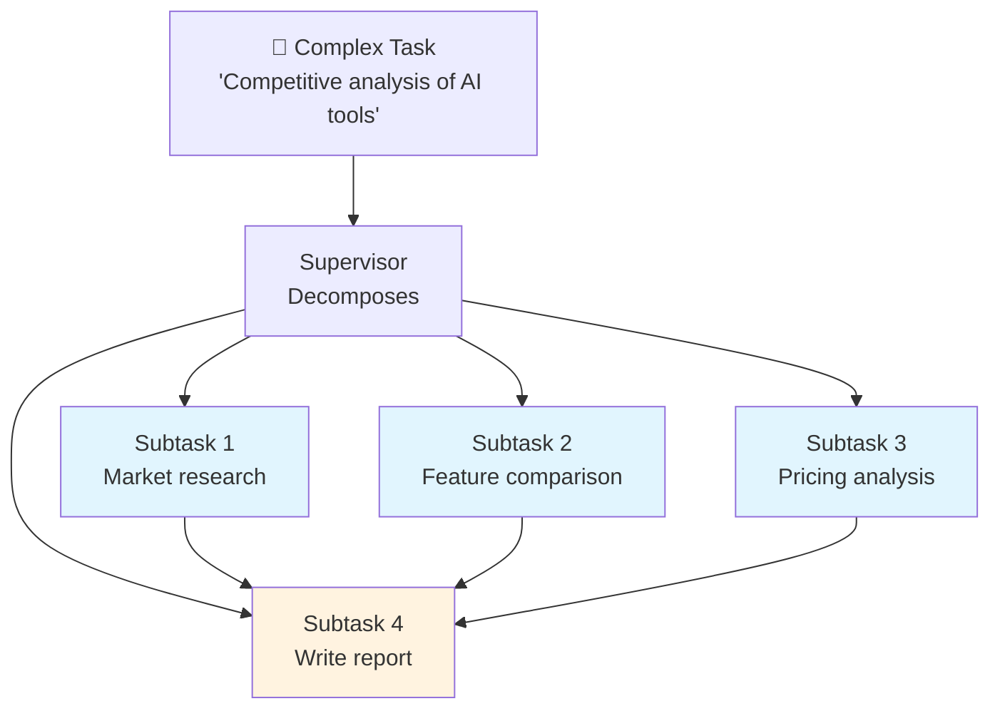

# Task delegation

## Introduction

Task delegation is where the supervisor's plan meets execution — a complex request gets broken into subtasks, each subtask gets assigned to the right agent, dependencies are respected, and workload stays balanced. Poor delegation creates bottlenecks; good delegation lets your system scale.

In this lesson, we'll build task decomposition systems, implement agent selection strategies, handle dependencies between subtasks, and balance work across agent pools. We'll use LangGraph's `Send` API for dynamic worker spawning, CrewAI's `context` parameter for task chaining, and OpenAI's structured handoffs for typed delegation.

### What we'll cover

- Task decomposition: breaking complex work into focused subtasks
- Agent selection: matching subtasks to the best available agent
- Workload balancing: distributing work across agent pools
- Dependency management: respecting execution order across subtasks

### Prerequisites

- [Supervisor Agents](./02-supervisor-agents.md) — orchestration patterns
- [Specialist Agents](./03-specialist-agents.md) — worker agent design
- [Agent Communication](./04-agent-communication.md) — inter-agent messaging

---

## Task decomposition

The first step in delegation is breaking a complex task into subtasks that individual agents can handle. The supervisor uses structured output to produce an execution plan.



### Structured task decomposition

```python
from pydantic import BaseModel, Field
from typing import Literal


class SubTask(BaseModel):
    """A single subtask in the delegation plan."""
    id: int = Field(description="Unique subtask identifier")
    title: str = Field(description="Brief title for the subtask")
    description: str = Field(description="Detailed instructions")
    required_capability: str = Field(
        description="What skill is needed: research, analysis, writing, review"
    )
    estimated_complexity: Literal["low", "medium", "high"] = Field(
        description="How complex this subtask is"
    )
    depends_on: list[int] = Field(
        default_factory=list,
        description="IDs of subtasks that must complete first"
    )
    max_retries: int = Field(
        default=2,
        description="How many times to retry on failure"
    )


class DelegationPlan(BaseModel):
    """Complete plan for delegating a complex task."""
    original_task: str
    subtasks: list[SubTask]
    parallel_groups: list[list[int]] = Field(
        description="Groups of subtask IDs that can run in parallel"
    )
    estimated_total_steps: int


# Generate a delegation plan
planner = llm.with_structured_output(DelegationPlan)

plan = planner.invoke([
    {"role": "system", "content": """Decompose the task into subtasks.
    Rules:
    - Each subtask should take one specialist 1-3 steps to complete
    - Identify which subtasks can run in parallel
    - Mark dependencies between subtasks
    - Available capabilities: research, analysis, writing, review"""},
    {"role": "user", "content": "Create a competitive analysis of AI coding tools "
     "including market position, features, pricing, and recommendations"}
])

print(f"Task: {plan.original_task}")
print(f"Subtasks: {len(plan.subtasks)}")
print(f"Parallel groups: {plan.parallel_groups}")
for st in plan.subtasks:
    deps = f" → depends on [{', '.join(str(d) for d in st.depends_on)}]" if st.depends_on else ""
    print(f"  [{st.id}] {st.title} ({st.required_capability}, {st.estimated_complexity}){deps}")
```

**Output:**
```
Task: Create a competitive analysis of AI coding tools...
Subtasks: 5
Parallel groups: [[1, 2, 3]]
  [1] Market research (research, medium)
  [2] Feature comparison (research, medium)
  [3] Pricing analysis (research, low)
  [4] Synthesize analysis (analysis, high) → depends on [1, 2, 3]
  [5] Write report (writing, high) → depends on [4]
```

### Topological execution

Subtasks with dependencies must execute in the right order. A topological sort ensures that:

```python
from collections import defaultdict, deque


def topological_sort(subtasks: list[SubTask]) -> list[list[SubTask]]:
    """Sort subtasks into execution waves respecting dependencies.
    
    Returns a list of waves — each wave contains subtasks that 
    can run in parallel.
    """
    # Build dependency graph
    in_degree = {st.id: len(st.depends_on) for st in subtasks}
    dependents = defaultdict(list)
    task_map = {st.id: st for st in subtasks}
    
    for st in subtasks:
        for dep in st.depends_on:
            dependents[dep].append(st.id)
    
    # BFS by waves
    waves = []
    queue = deque([sid for sid, deg in in_degree.items() if deg == 0])
    
    while queue:
        current_wave = []
        next_queue = deque()
        
        while queue:
            sid = queue.popleft()
            current_wave.append(task_map[sid])
            
            for dependent_id in dependents[sid]:
                in_degree[dependent_id] -= 1
                if in_degree[dependent_id] == 0:
                    next_queue.append(dependent_id)
        
        waves.append(current_wave)
        queue = next_queue
    
    return waves


# Usage
waves = topological_sort(plan.subtasks)
for i, wave in enumerate(waves):
    tasks = ", ".join(f"{st.title} ({st.required_capability})" for st in wave)
    parallel = " [PARALLEL]" if len(wave) > 1 else ""
    print(f"Wave {i + 1}{parallel}: {tasks}")
```

**Output:**
```
Wave 1 [PARALLEL]: Market research (research), Feature comparison (research), Pricing analysis (research)
Wave 2: Synthesize analysis (analysis)
Wave 3: Write report (writing)
```

---

## Agent selection

Once tasks are decomposed, the supervisor must select the best agent for each subtask. Selection can be rule-based, capability-scored, or load-aware.

### Capability-based selection

```python
from dataclasses import dataclass, field


@dataclass
class AgentProfile:
    """An agent's capabilities and current status."""
    name: str
    capabilities: dict[str, float]  # capability → proficiency (0-1)
    current_load: int = 0           # Active tasks
    max_concurrent: int = 2         # Max parallel tasks
    completed_tasks: int = 0
    avg_quality: float = 0.0
    
    @property
    def available(self) -> bool:
        return self.current_load < self.max_concurrent
    
    def score_for_task(self, required_capability: str) -> float:
        """Score this agent's fit for a task."""
        proficiency = self.capabilities.get(required_capability, 0.0)
        load_factor = 1.0 - (self.current_load / self.max_concurrent)
        quality_bonus = self.avg_quality * 0.2
        
        return proficiency * 0.6 + load_factor * 0.2 + quality_bonus
    

class AgentSelector:
    """Selects the best agent for each subtask."""
    
    def __init__(self, agents: list[AgentProfile]):
        self.agents = {a.name: a for a in agents}
    
    def select(self, subtask: SubTask) -> AgentProfile:
        """Select the best available agent for a subtask."""
        candidates = [
            a for a in self.agents.values()
            if a.available and subtask.required_capability in a.capabilities
        ]
        
        if not candidates:
            raise RuntimeError(
                f"No available agent for capability: "
                f"{subtask.required_capability}"
            )
        
        # Score and rank
        scored = [(a, a.score_for_task(subtask.required_capability))
                  for a in candidates]
        scored.sort(key=lambda x: x[1], reverse=True)
        
        best_agent = scored[0][0]
        best_agent.current_load += 1
        
        return best_agent
    
    def release(self, agent_name: str, quality_score: float):
        """Release an agent after task completion."""
        agent = self.agents[agent_name]
        agent.current_load -= 1
        agent.completed_tasks += 1
        # Running average of quality
        n = agent.completed_tasks
        agent.avg_quality = (
            (agent.avg_quality * (n - 1) + quality_score) / n
        )


# Define agent pool
agents = [
    AgentProfile("researcher-1", {"research": 0.95, "analysis": 0.3}),
    AgentProfile("researcher-2", {"research": 0.85, "analysis": 0.5}),
    AgentProfile("analyst-1", {"analysis": 0.92, "research": 0.4}),
    AgentProfile("writer-1", {"writing": 0.90, "review": 0.6}),
    AgentProfile("reviewer-1", {"review": 0.95, "writing": 0.3}),
]

selector = AgentSelector(agents)

# Assign subtasks
for subtask in plan.subtasks:
    agent = selector.select(subtask)
    print(f"  [{subtask.id}] {subtask.title} → {agent.name} "
          f"(score: {agent.score_for_task(subtask.required_capability):.2f})")
```

**Output:**
```
  [1] Market research → researcher-1 (score: 0.77)
  [2] Feature comparison → researcher-2 (score: 0.71)
  [3] Pricing analysis → researcher-1 (score: 0.57)
  [4] Synthesize analysis → analyst-1 (score: 0.75)
  [5] Write report → writer-1 (score: 0.74)
```

---

## Workload balancing

In systems with multiple agents per role, the supervisor should distribute work to prevent any single agent from becoming a bottleneck.

### LangGraph Send API: dynamic worker spawning

LangGraph's `Send` API creates worker nodes dynamically based on the number of subtasks:

```python
from langgraph.graph import StateGraph, START, END
from langgraph.types import Send
from typing_extensions import TypedDict


class OrchestratorState(TypedDict):
    task: str
    subtasks: list[str]
    results: list[str]


class WorkerState(TypedDict):
    subtask: str


def orchestrator(state: OrchestratorState):
    """Decompose task into subtasks."""
    # In production, use LLM to decompose
    subtasks = [
        "Research market size and growth",
        "Compare features across tools",
        "Analyze pricing models",
    ]
    return {"subtasks": subtasks}


def assign_workers(state: OrchestratorState):
    """Create a worker for each subtask using Send."""
    return [
        Send("worker", {"subtask": subtask})
        for subtask in state["subtasks"]
    ]


def worker(state: WorkerState):
    """Each worker handles one subtask independently."""
    # In production, this would call an LLM agent
    result = f"Completed: {state['subtask'][:40]}"
    return {"results": [result]}


def synthesize(state: OrchestratorState):
    """Combine all worker results."""
    combined = "\n".join(f"- {r}" for r in state["results"])
    return {"results": [f"Final Report:\n{combined}"]}


builder = StateGraph(OrchestratorState)

builder.add_node("orchestrator", orchestrator)
builder.add_node("worker", worker)
builder.add_node("synthesize", synthesize)

builder.add_edge(START, "orchestrator")
builder.add_conditional_edges("orchestrator", assign_workers)
builder.add_edge("worker", "synthesize")
builder.add_edge("synthesize", END)

graph = builder.compile()

result = graph.invoke({"task": "Competitive analysis of AI tools"})
print(result["results"][-1])
```

**Output:**
```
Final Report:
- Completed: Research market size and growth
- Completed: Compare features across tools
- Completed: Analyze pricing models
```

> **🔑 Key concept:** The `Send` API is LangGraph's answer to dynamic fan-out. Unlike static edges, `Send` creates workers at runtime based on the decomposition result — you don't need to know the number of subtasks in advance.

### CrewAI delegation with context

CrewAI handles delegation through the `context` parameter on tasks, which chains outputs:

```python
from crewai import Agent, Task, Crew, Process

# Agents
researchers = [
    Agent(role="Web Researcher", goal="Find web sources",
          backstory="Web search expert", tools=[search_tool],
          allow_delegation=False),
    Agent(role="Academic Researcher", goal="Find academic papers",
          backstory="Academic research expert", tools=[arxiv_tool],
          allow_delegation=False),
]

analyst = Agent(
    role="Lead Analyst", goal="Synthesize research into insights",
    backstory="Expert analyst", tools=[],
    allow_delegation=False,
)

# Tasks with delegation
web_research = Task(
    description="Find 5 web sources on AI coding tool market share",
    expected_output="List of 5 sources with key data points",
    agent=researchers[0],
)

academic_research = Task(
    description="Find 3 academic papers on AI-assisted development",
    expected_output="List of 3 papers with key findings",
    agent=researchers[1],
)

# Analysis task depends on BOTH research tasks
analysis = Task(
    description="Synthesize web and academic research into a coherent analysis",
    expected_output="500-word analysis with citations",
    agent=analyst,
    context=[web_research, academic_research],  # Receives both outputs
)

crew = Crew(
    agents=[*researchers, analyst],
    tasks=[web_research, academic_research, analysis],
    process=Process.sequential,
)

result = crew.kickoff()
```

---

## Dependency management

Real delegation systems must handle three dependency challenges: ordering, data flow, and failure propagation.

### Dependency-aware executor

```python
import asyncio
from dataclasses import dataclass, field
from enum import Enum
from typing import Callable, Any, Optional


class TaskStatus(Enum):
    PENDING = "pending"
    READY = "ready"
    RUNNING = "running"
    COMPLETED = "completed"
    FAILED = "failed"


@dataclass
class DelegatedTask:
    """A task with dependency tracking."""
    id: int
    name: str
    agent: str
    execute_fn: Callable
    depends_on: list[int] = field(default_factory=list)
    status: TaskStatus = TaskStatus.PENDING
    result: Optional[Any] = None
    error: Optional[str] = None
    
    def is_ready(self, completed_ids: set[int]) -> bool:
        """Check if all dependencies are satisfied."""
        return all(dep in completed_ids for dep in self.depends_on)


class DependencyExecutor:
    """Executes tasks respecting dependency order."""
    
    def __init__(self, tasks: list[DelegatedTask]):
        self.tasks = {t.id: t for t in tasks}
        self.completed: set[int] = set()
        self.failed: set[int] = set()
    
    def get_ready_tasks(self) -> list[DelegatedTask]:
        """Find tasks whose dependencies are all satisfied."""
        ready = []
        for task in self.tasks.values():
            if task.status == TaskStatus.PENDING and task.is_ready(self.completed):
                # Check if any dependency failed
                failed_deps = set(task.depends_on) & self.failed
                if failed_deps:
                    task.status = TaskStatus.FAILED
                    task.error = f"Dependency failed: {failed_deps}"
                    self.failed.add(task.id)
                else:
                    task.status = TaskStatus.READY
                    ready.append(task)
        return ready
    
    def execute_all(self) -> dict[int, Any]:
        """Execute all tasks in dependency order."""
        results = {}
        
        while True:
            ready = self.get_ready_tasks()
            if not ready:
                break
            
            # Execute ready tasks (could be parallelized)
            for task in ready:
                task.status = TaskStatus.RUNNING
                print(f"  ▶️ Running: [{task.id}] {task.name} → {task.agent}")
                
                try:
                    # Gather dependency results as context
                    dep_results = {
                        dep_id: self.tasks[dep_id].result
                        for dep_id in task.depends_on
                    }
                    task.result = task.execute_fn(task.name, dep_results)
                    task.status = TaskStatus.COMPLETED
                    self.completed.add(task.id)
                    results[task.id] = task.result
                    print(f"  ✅ Completed: [{task.id}] {task.name}")
                except Exception as e:
                    task.status = TaskStatus.FAILED
                    task.error = str(e)
                    self.failed.add(task.id)
                    print(f"  ❌ Failed: [{task.id}] {task.name}: {e}")
        
        # Report
        total = len(self.tasks)
        done = len(self.completed)
        fail = len(self.failed)
        print(f"\n📊 Results: {done}/{total} completed, {fail} failed")
        
        return results


# Usage
def mock_execute(task_name: str, dep_results: dict) -> str:
    context = ", ".join(str(v)[:30] for v in dep_results.values())
    return f"Result of {task_name}" + (f" (using: {context})" if context else "")


tasks = [
    DelegatedTask(1, "Market research", "researcher-1", mock_execute),
    DelegatedTask(2, "Feature comparison", "researcher-2", mock_execute),
    DelegatedTask(3, "Pricing analysis", "researcher-1", mock_execute),
    DelegatedTask(4, "Synthesize analysis", "analyst-1", mock_execute,
                  depends_on=[1, 2, 3]),
    DelegatedTask(5, "Write report", "writer-1", mock_execute,
                  depends_on=[4]),
]

executor = DependencyExecutor(tasks)
results = executor.execute_all()
```

**Output:**
```
  ▶️ Running: [1] Market research → researcher-1
  ✅ Completed: [1] Market research
  ▶️ Running: [2] Feature comparison → researcher-2
  ✅ Completed: [2] Feature comparison
  ▶️ Running: [3] Pricing analysis → researcher-1
  ✅ Completed: [3] Pricing analysis
  ▶️ Running: [4] Synthesize analysis → analyst-1
  ✅ Completed: [4] Synthesize analysis
  ▶️ Running: [5] Write report → writer-1
  ✅ Completed: [5] Write report

📊 Results: 5/5 completed, 0 failed
```

> **Note:** In the example above, tasks 1, 2, and 3 could run in parallel since they have no inter-dependencies. The sequential execution here is for clarity — in production, use `asyncio.gather()` or LangGraph's `Send` for true parallelism.

---

## Best practices

| Practice | Why it matters |
|----------|----------------|
| Use structured output for decomposition | Parseable plans are more reliable than free-text planning |
| Score agents on capability + availability | Prevents overloading your best agent while others sit idle |
| Propagate dependency failures immediately | Don't run downstream tasks when their input has failed |
| Keep subtasks small and focused | Easier to retry, evaluate, and debug than large tasks |
| Include `depends_on` in every plan | Implicit ordering via list position breaks when parallelized |
| Set `max_retries` per subtask | Prevents infinite retry loops on fundamentally broken tasks |

---

## Common pitfalls

| ❌ Mistake | ✅ Solution |
|-----------|-------------|
| Decomposing into too many tiny subtasks | Aim for 3-7 subtasks — more creates coordination overhead |
| No dependency tracking (assumes sequential) | Explicit `depends_on` enables parallel execution |
| Always assigning to the "best" agent | Factor in current load — a slightly less capable idle agent beats a busy expert |
| No failure propagation | When task 2 fails, don't run task 4 that depends on it |
| Static worker count | Use `Send` API or dynamic spawning to scale workers with task count |
| Missing context from dependencies | Pass dependency results as context to downstream tasks |

---

## Hands-on exercise

### Your task

Build a `TaskDelegator` that takes a high-level task, decomposes it, assigns subtasks to agents respecting dependencies and load, and executes the full plan.

### Requirements

1. Decompose a task into 4-6 subtasks with dependencies
2. Maintain a pool of agents with capability scores and load tracking
3. Assign each subtask to the best available agent using capability + load scoring
4. Execute in dependency order, running independent tasks in parallel (simulated)
5. Handle one simulated failure: if a subtask fails, propagate the failure to dependents

### Expected result

```
=== Delegation Plan ===
[1] Market research (research) → researcher-1 (score: 0.85)
[2] User survey (research) → researcher-2 (score: 0.78)  [PARALLEL with 1]
[3] Data analysis (analysis) → analyst-1 (score: 0.90)   [after 1, 2]
[4] Write report (writing) → writer-1 (score: 0.88)       [after 3]

=== Execution ===
Wave 1: Market research ✅, User survey ✅
Wave 2: Data analysis ✅
Wave 3: Write report ✅
```

<details>
<summary>💡 Hints (click to expand)</summary>

- Combine the `topological_sort` and `AgentSelector` classes from earlier in this lesson
- Process each wave — all tasks in a wave can run "in parallel"
- When a task fails, mark it and all its transitive dependents as failed
- Use the `DependencyExecutor` pattern but add agent selection

</details>

<details>
<summary>✅ Solution (click to expand)</summary>

```python
from dataclasses import dataclass, field
from collections import defaultdict, deque
from typing import Callable, Any, Optional


@dataclass
class AgentProfile:
    name: str
    capabilities: dict[str, float]
    load: int = 0
    max_load: int = 2
    
    @property
    def available(self) -> bool:
        return self.load < self.max_load
    
    def score(self, capability: str) -> float:
        prof = self.capabilities.get(capability, 0.0)
        load_factor = 1.0 - (self.load / self.max_load)
        return prof * 0.7 + load_factor * 0.3


@dataclass
class PlanTask:
    id: int
    name: str
    capability: str
    depends_on: list[int] = field(default_factory=list)
    agent: Optional[str] = None
    result: Optional[str] = None
    failed: bool = False


class TaskDelegator:
    def __init__(self, agents: list[AgentProfile]):
        self.agents = {a.name: a for a in agents}
    
    def decompose(self, task: str) -> list[PlanTask]:
        """Break task into subtasks."""
        return [
            PlanTask(1, "Market research", "research"),
            PlanTask(2, "User survey analysis", "research"),
            PlanTask(3, "Data synthesis", "analysis", depends_on=[1, 2]),
            PlanTask(4, "Write final report", "writing", depends_on=[3]),
        ]
    
    def select_agent(self, capability: str) -> AgentProfile:
        candidates = [
            a for a in self.agents.values()
            if a.available and capability in a.capabilities
        ]
        if not candidates:
            raise RuntimeError(f"No agent for: {capability}")
        best = max(candidates, key=lambda a: a.score(capability))
        best.load += 1
        return best
    
    def get_waves(self, tasks: list[PlanTask]) -> list[list[PlanTask]]:
        in_degree = {t.id: len(t.depends_on) for t in tasks}
        deps = defaultdict(list)
        task_map = {t.id: t for t in tasks}
        for t in tasks:
            for d in t.depends_on:
                deps[d].append(t.id)
        
        waves, queue = [], deque(
            tid for tid, deg in in_degree.items() if deg == 0
        )
        while queue:
            wave, nxt = [], deque()
            while queue:
                tid = queue.popleft()
                wave.append(task_map[tid])
                for dep_id in deps[tid]:
                    in_degree[dep_id] -= 1
                    if in_degree[dep_id] == 0:
                        nxt.append(dep_id)
            waves.append(wave)
            queue = nxt
        return waves
    
    def execute(self, task: str, fail_task_id: int = None):
        plan = self.decompose(task)
        
        # Assign agents
        print("=== Delegation Plan ===")
        for t in plan:
            agent = self.select_agent(t.capability)
            t.agent = agent.name
            deps_str = f" [after {t.depends_on}]" if t.depends_on else ""
            print(f"  [{t.id}] {t.name} → {t.agent} "
                  f"(score: {agent.score(t.capability):.2f}){deps_str}")
        
        # Execute in waves
        task_map = {t.id: t for t in plan}
        failed_ids = set()
        
        print("\n=== Execution ===")
        for i, wave in enumerate(self.get_waves(plan)):
            results = []
            for t in wave:
                # Check failed dependencies
                if any(d in failed_ids for d in t.depends_on):
                    t.failed = True
                    failed_ids.add(t.id)
                    results.append(f"{t.name} ⛔ (dependency failed)")
                    continue
                
                # Simulate failure
                if t.id == fail_task_id:
                    t.failed = True
                    failed_ids.add(t.id)
                    results.append(f"{t.name} ❌")
                    continue
                
                t.result = f"Completed by {t.agent}"
                self.agents[t.agent].load -= 1
                results.append(f"{t.name} ✅")
            
            print(f"  Wave {i + 1}: {', '.join(results)}")


# Run
agents = [
    AgentProfile("researcher-1", {"research": 0.9}),
    AgentProfile("researcher-2", {"research": 0.8}),
    AgentProfile("analyst-1", {"analysis": 0.92}),
    AgentProfile("writer-1", {"writing": 0.88}),
]

delegator = TaskDelegator(agents)
delegator.execute("Competitive analysis of AI tools")
```

**Output:**
```
=== Delegation Plan ===
  [1] Market research → researcher-1 (score: 0.93)
  [2] User survey analysis → researcher-2 (score: 0.86)
  [3] Data synthesis → analyst-1 (score: 0.94) [after [1, 2]]
  [4] Write final report → writer-1 (score: 0.92) [after [3]]

=== Execution ===
  Wave 1: Market research ✅, User survey analysis ✅
  Wave 2: Data synthesis ✅
  Wave 3: Write final report ✅
```
</details>

### Bonus challenges

- [ ] Add retry logic: if a task fails, retry up to `max_retries` times before marking it as permanently failed
- [ ] Implement priority: high-priority subtasks get assigned first, getting the best available agent
- [ ] Add cost tracking: each agent has a per-call cost, and the delegator reports total cost alongside results

---

## Summary

✅ **Structured decomposition** with Pydantic models produces reliable, parseable task plans — always include `depends_on` for explicit dependency tracking

✅ **Capability-based agent selection** with load awareness prevents bottlenecks — score agents on proficiency × 0.7 + availability × 0.3 for balanced assignment

✅ **LangGraph's `Send` API** dynamically spawns workers at runtime — you don't need to know the number of subtasks when building the graph

✅ **Dependency-aware execution** processes tasks in waves, enabling parallelism for independent tasks while respecting ordering constraints and propagating failures

**Next:** [Conflict Resolution](./06-conflict-resolution.md)

---

## Further reading

- [LangGraph — Send API (Orchestrator-Worker)](https://docs.langchain.com/oss/python/langgraph/workflows-agents) — dynamic worker spawning
- [CrewAI — Tasks with Context](https://docs.crewai.com/concepts/tasks) — chaining task outputs
- [OpenAI Agents SDK — Structured Handoffs](https://openai.github.io/openai-agents-python/handoffs/) — typed delegation with input_type
- [LangGraph — Parallelization](https://docs.langchain.com/oss/python/langgraph/workflows-agents) — fan-out/fan-in patterns

*[Back to Multi-Agent Systems overview](./00-multi-agent-systems.md)*

<!-- 
Sources Consulted:
- LangGraph workflows-agents: https://docs.langchain.com/oss/python/langgraph/workflows-agents
- OpenAI handoffs: https://openai.github.io/openai-agents-python/handoffs/
- CrewAI tasks: https://docs.crewai.com/concepts/tasks
- CrewAI collaboration: https://docs.crewai.com/concepts/collaboration
-->
