# Conflict resolution

## Introduction

When multiple agents work on related problems, they inevitably disagree. One agent recommends Tool A while another recommends Tool B. A researcher finds contradictory data. Two analysts produce conflicting statistics from the same dataset. Without a resolution mechanism, these conflicts either block execution or produce inconsistent outputs.

In this lesson, we'll build four conflict resolution strategies: voting mechanisms, weighted authority, consensus protocols, and evaluator arbitration. We'll implement each pattern with practical code and learn when to apply each one.

### What we'll cover

- When and why agents produce conflicting outputs
- Voting mechanisms for resolving disagreements
- Weighted authority systems based on agent expertise
- Consensus and evaluator-based arbitration patterns

### Prerequisites

- [Supervisor Agents](./02-supervisor-agents.md) — supervisor evaluation patterns
- [Specialist Agents](./03-specialist-agents.md) — why specialists may disagree
- [Task Delegation](./05-task-delegation.md) — how tasks get distributed

---

## When agents conflict

Conflicts arise in multi-agent systems for predictable reasons:

```mermaid
flowchart TD
    SAME_TASK["Same Task<br>Given to Multiple Agents"] --> DIFF_DATA["Different Data<br>Sources"]
    SAME_TASK --> DIFF_INTERPRET["Different<br>Interpretation"]
    SAME_TASK --> DIFF_PRIORITY["Different<br>Priorities"]
    
    DIFF_DATA --> CONFLICT{{"⚡ Conflict"}}
    DIFF_INTERPRET --> CONFLICT
    DIFF_PRIORITY --> CONFLICT
    
    CONFLICT --> RESOLVE["Resolution<br>Strategy"]
```



### Common conflict types

| Conflict type | Example | Frequency |
|--------------|---------|-----------|
| **Factual disagreement** | Agent A says "market growing 40%", Agent B says "growing 25%" | Common |
| **Recommendation conflict** | Agent A recommends Python, Agent B recommends JavaScript | Very common |
| **Priority mismatch** | Agent A optimizes for speed, Agent B for accuracy | Common |
| **Contradictory analysis** | Agent A sees an uptrend, Agent B sees a downtrend | Moderate |
| **Scope disagreement** | Agent A covers too much, Agent B covers too little | Moderate |

> **🤖 AI Context:** Conflicts are more frequent with LLM-based agents because small prompt differences lead to different reasoning paths. Two agents with similar but not identical instructions will naturally diverge in their conclusions.

---

## Voting mechanisms

The simplest resolution: ask multiple agents and go with the majority.

### Majority vote

```python
from dataclasses import dataclass
from collections import Counter
from typing import Any


@dataclass
class AgentVote:
    """A single agent's vote on a decision."""
    agent_name: str
    choice: str
    confidence: float  # 0.0 to 1.0
    reasoning: str


class MajorityVoter:
    """Resolve conflicts by majority vote."""
    
    def __init__(self, min_votes: int = 3):
        self.min_votes = min_votes
    
    def resolve(self, votes: list[AgentVote]) -> dict:
        """Pick the choice with the most votes."""
        if len(votes) < self.min_votes:
            raise ValueError(
                f"Need at least {self.min_votes} votes, got {len(votes)}"
            )
        
        # Count votes
        counts = Counter(v.choice for v in votes)
        winner, win_count = counts.most_common(1)[0]
        total = len(votes)
        
        # Check for ties
        tied = [choice for choice, count in counts.items()
                if count == win_count]
        
        if len(tied) > 1:
            # Break tie by average confidence
            tie_scores = {}
            for choice in tied:
                choice_votes = [v for v in votes if v.choice == choice]
                tie_scores[choice] = sum(
                    v.confidence for v in choice_votes
                ) / len(choice_votes)
            winner = max(tie_scores, key=tie_scores.get)
        
        # Build result
        winner_votes = [v for v in votes if v.choice == winner]
        dissenting = [v for v in votes if v.choice != winner]
        
        return {
            "decision": winner,
            "vote_count": f"{win_count}/{total}",
            "avg_confidence": sum(
                v.confidence for v in winner_votes
            ) / len(winner_votes),
            "consensus": win_count == total,
            "dissenting_views": [
                {"agent": v.agent_name, "choice": v.choice,
                 "reasoning": v.reasoning}
                for v in dissenting
            ]
        }


# Usage
voter = MajorityVoter(min_votes=3)

votes = [
    AgentVote("analyst-1", "Python", 0.85,
              "Strongest AI/ML ecosystem with PyTorch and TensorFlow"),
    AgentVote("analyst-2", "Python", 0.90,
              "Most popular for data science with extensive libraries"),
    AgentVote("analyst-3", "JavaScript", 0.70,
              "Better for full-stack with TensorFlow.js and ONNX"),
]

result = voter.resolve(votes)
print(f"Decision: {result['decision']}")
print(f"Votes: {result['vote_count']}")
print(f"Avg confidence: {result['avg_confidence']:.2f}")
print(f"Consensus: {result['consensus']}")
if result['dissenting_views']:
    print("Dissenting views:")
    for d in result['dissenting_views']:
        print(f"  - {d['agent']}: {d['choice']} — {d['reasoning']}")
```

**Output:**
```
Decision: Python
Votes: 2/3
Avg confidence: 0.88
Consensus: False
Dissenting views:
  - analyst-3: JavaScript — Better for full-stack with TensorFlow.js and ONNX
```

---

## Weighted authority

Not all agents should have equal votes. A domain expert's opinion on their specialty should carry more weight than a generalist's.

### Expertise-weighted resolution

```python
from dataclasses import dataclass, field
from collections import defaultdict


@dataclass
class WeightedVote:
    """A vote with an expertise-based weight."""
    agent_name: str
    choice: str
    confidence: float
    reasoning: str
    expertise_weight: float  # 0.0 to 1.0 based on domain proficiency


class WeightedResolver:
    """Resolve conflicts using expertise-weighted scoring."""
    
    def __init__(self, agreement_threshold: float = 0.6):
        self.agreement_threshold = agreement_threshold
    
    def resolve(self, votes: list[WeightedVote]) -> dict:
        """Score each choice by weighted confidence."""
        scores: dict[str, float] = defaultdict(float)
        vote_details: dict[str, list] = defaultdict(list)
        
        for vote in votes:
            # Score = confidence × expertise_weight
            weighted_score = vote.confidence * vote.expertise_weight
            scores[vote.choice] += weighted_score
            vote_details[vote.choice].append({
                "agent": vote.agent_name,
                "score": weighted_score,
                "confidence": vote.confidence,
                "weight": vote.expertise_weight,
            })
        
        # Normalize scores
        total_score = sum(scores.values())
        normalized = {
            choice: score / total_score
            for choice, score in scores.items()
        }
        
        # Pick winner
        winner = max(normalized, key=normalized.get)
        winner_share = normalized[winner]
        
        return {
            "decision": winner,
            "share": f"{winner_share:.0%}",
            "strong_consensus": winner_share >= self.agreement_threshold,
            "score_breakdown": dict(normalized),
            "contributions": vote_details[winner],
            "alternatives": {
                k: f"{v:.0%}" for k, v in normalized.items()
                if k != winner
            }
        }


# Usage
resolver = WeightedResolver(agreement_threshold=0.6)

votes = [
    WeightedVote("ml-expert", "PyTorch", 0.92, 
                 "Better for research, dynamic graphs",
                 expertise_weight=0.95),  # ML domain expert
    WeightedVote("devops-engineer", "TensorFlow", 0.80,
                 "Better deployment with TF Serving",
                 expertise_weight=0.40),  # Less ML expertise
    WeightedVote("full-stack-dev", "PyTorch", 0.75,
                 "More Pythonic API, easier to learn",
                 expertise_weight=0.50),  # Moderate expertise
]

result = resolver.resolve(votes)
print(f"Decision: {result['decision']}")
print(f"Score share: {result['share']}")
print(f"Strong consensus: {result['strong_consensus']}")
print(f"Alternatives: {result['alternatives']}")
print("Top contributors:")
for c in result['contributions']:
    print(f"  - {c['agent']}: score {c['score']:.2f} "
          f"(conf: {c['confidence']}, weight: {c['weight']})")
```

**Output:**
```
Decision: PyTorch
Score share: 69%
Strong consensus: True
Alternatives: {'TensorFlow': '31%'}
Top contributors:
  - ml-expert: score 0.87 (conf: 0.92, weight: 0.95)
  - full-stack-dev: score 0.38 (conf: 0.75, weight: 0.50)
```

> **💡 Tip:** Expertise weights should come from agent definitions, not be self-reported. Set them based on the agent's `role`, `tools`, and `backstory` — not by asking the agent "how confident are you?"

---

## Consensus protocols

For high-stakes decisions, you may need all agents to agree. Consensus protocols iterate until agents converge or a deadline is reached.

### Deliberation-based consensus

```python
from pydantic import BaseModel, Field
from typing import Literal


class Position(BaseModel):
    """An agent's position on a decision."""
    choice: str
    confidence: float
    key_argument: str
    willing_to_change: bool = Field(
        description="Would change position given strong evidence"
    )


class Deliberation(BaseModel):
    """An agent's response after hearing other positions."""
    original_choice: str
    updated_choice: str
    changed: bool
    reasoning: str


class ConsensusProtocol:
    """Iterative deliberation until agents agree or rounds expire."""
    
    def __init__(self, max_rounds: int = 3, agreement_threshold: float = 0.8):
        self.max_rounds = max_rounds
        self.agreement_threshold = agreement_threshold
    
    def run(
        self,
        question: str,
        agents: dict[str, callable],  # agent_name → callable
    ) -> dict:
        """Run deliberation rounds until consensus or max rounds."""
        positions = {}
        history = []
        
        # Round 0: Initial positions
        print(f"📋 Question: {question}\n")
        for name, agent_fn in agents.items():
            pos = agent_fn(question)
            positions[name] = pos
            print(f"  Round 0 — {name}: {pos['choice']} "
                  f"(confidence: {pos['confidence']:.2f})")
        
        # Deliberation rounds
        for round_num in range(1, self.max_rounds + 1):
            # Check if consensus reached
            choices = [p["choice"] for p in positions.values()]
            if self._check_agreement(choices):
                print(f"\n✅ Consensus reached in round {round_num - 1}!")
                return self._build_result(positions, round_num - 1, True)
            
            print(f"\n  Round {round_num} — Sharing positions...")
            
            # Each agent sees others' positions and can update
            new_positions = {}
            for name, agent_fn in agents.items():
                others = {
                    k: v for k, v in positions.items() if k != name
                }
                # Agent deliberates
                updated = agent_fn(
                    question,
                    own_position=positions[name],
                    others_positions=others,
                )
                new_positions[name] = updated
                
                changed = updated["choice"] != positions[name]["choice"]
                marker = " ← CHANGED" if changed else ""
                print(f"    {name}: {updated['choice']} "
                      f"(confidence: {updated['confidence']:.2f}){marker}")
            
            positions = new_positions
            history.append(dict(positions))
        
        # Max rounds — check final state
        choices = [p["choice"] for p in positions.values()]
        agreed = self._check_agreement(choices)
        status = "consensus" if agreed else "no consensus"
        print(f"\n{'✅' if agreed else '⚠️'} After {self.max_rounds} rounds: {status}")
        
        return self._build_result(positions, self.max_rounds, agreed)
    
    def _check_agreement(self, choices: list[str]) -> bool:
        """Check if enough agents agree."""
        from collections import Counter
        most_common_count = Counter(choices).most_common(1)[0][1]
        return most_common_count / len(choices) >= self.agreement_threshold
    
    def _build_result(
        self, positions: dict, rounds: int, consensus: bool
    ) -> dict:
        from collections import Counter
        choices = [p["choice"] for p in positions.values()]
        winner = Counter(choices).most_common(1)[0][0]
        return {
            "decision": winner,
            "consensus": consensus,
            "rounds": rounds,
            "final_positions": positions,
        }


# Simulated agents
def make_agent(initial_choice, initial_conf, flexibility=0.5):
    """Create a simple simulated agent."""
    state = {"choice": initial_choice, "confidence": initial_conf}
    
    def agent_fn(question, own_position=None, others_positions=None):
        if others_positions is None:
            return dict(state)
        
        # Count how many others disagree
        other_choices = [p["choice"] for p in others_positions.values()]
        from collections import Counter
        most_popular = Counter(other_choices).most_common(1)[0]
        
        # Possibly change position if majority disagrees
        if (most_popular[0] != state["choice"] 
                and most_popular[1] >= len(other_choices) * 0.5
                and state["confidence"] < 0.85):
            state["choice"] = most_popular[0]
            state["confidence"] = min(state["confidence"] + 0.1, 1.0)
        
        return dict(state)
    
    return agent_fn


# Run consensus
protocol = ConsensusProtocol(max_rounds=3, agreement_threshold=0.8)

agents = {
    "analyst-1": make_agent("React", 0.80),
    "analyst-2": make_agent("Vue", 0.70),
    "analyst-3": make_agent("React", 0.75),
    "analyst-4": make_agent("React", 0.65),
}

result = protocol.run("Best framework for AI dashboard?", agents)
print(f"\nFinal decision: {result['decision']}")
```

**Output:**
```
📋 Question: Best framework for AI dashboard?

  Round 0 — analyst-1: React (confidence: 0.80)
  Round 0 — analyst-2: Vue (confidence: 0.70)
  Round 0 — analyst-3: React (confidence: 0.75)
  Round 0 — analyst-4: React (confidence: 0.65)

  Round 1 — Sharing positions...
    analyst-1: React (confidence: 0.80)
    analyst-2: React (confidence: 0.80) ← CHANGED
    analyst-3: React (confidence: 0.75)
    analyst-4: React (confidence: 0.65)

✅ Consensus reached in round 1!

Final decision: React
```

---

## Evaluator arbitration

When agents can't agree, escalate to a dedicated evaluator agent — an impartial judge that reviews all arguments and makes a final decision.

### LLM-based arbitrator

```python
from pydantic import BaseModel, Field
from typing import Literal


class ArbitrationDecision(BaseModel):
    """The arbitrator's final ruling."""
    chosen: str = Field(description="The selected option")
    reasoning: str = Field(description="Why this option was chosen")
    strength: Literal["strong", "moderate", "weak"] = Field(
        description="How clear-cut the decision is"
    )
    dissent_acknowledged: str = Field(
        description="Summary of the minority view and why it was overruled"
    )


async def arbitrate(
    question: str,
    agent_positions: dict[str, dict],
    llm
) -> ArbitrationDecision:
    """Use an LLM arbitrator to resolve a conflict."""
    
    # Format positions for the arbitrator
    positions_text = ""
    for name, pos in agent_positions.items():
        positions_text += (
            f"\n### {name}\n"
            f"Choice: {pos['choice']}\n"
            f"Confidence: {pos['confidence']}\n"
            f"Argument: {pos['reasoning']}\n"
        )
    
    arbitrator = llm.with_structured_output(ArbitrationDecision)
    
    decision = arbitrator.invoke([
        {"role": "system", "content": """You are an impartial arbitrator.
        Review all agent positions on the question below.
        Make a decision based on the strength of arguments, not popularity.
        Acknowledge the dissenting view fairly."""},
        {"role": "user", "content": f"""Question: {question}
        
        Agent Positions:
        {positions_text}
        
        Make your ruling."""}
    ])
    
    return decision


# Usage (pseudo-code)
# decision = await arbitrate(
#     question="Best database for vector search?",
#     agent_positions={
#         "db-expert": {"choice": "Pinecone", "confidence": 0.9,
#                       "reasoning": "Purpose-built, managed service"},
#         "cost-analyst": {"choice": "pgvector", "confidence": 0.85,
#                         "reasoning": "Free, runs on existing Postgres"},
#     },
#     llm=llm
# )
# print(f"Ruling: {decision.chosen} ({decision.strength})")
# print(f"Reasoning: {decision.reasoning}")
# print(f"Dissent: {decision.dissent_acknowledged}")
```

**Output:**
```
Ruling: pgvector (moderate)
Reasoning: For the described use case (startup with existing Postgres), pgvector 
avoids additional infrastructure costs while providing adequate performance
Dissent: Pinecone offers better scaling and managed operations, which would 
matter more at scale, but the current requirements don't justify the added cost
```

### When to use each resolution strategy

| Strategy | Best for | Agents needed | Latency |
|----------|----------|--------------|---------|
| **Majority vote** | Clear-cut choices with 3+ options | 3+ | Low |
| **Weighted authority** | Decisions where expertise matters | 2+ | Low |
| **Consensus (deliberation)** | High-stakes decisions needing buy-in | 3-5 | High |
| **Evaluator arbitration** | Complex conflicts between 2 positions | 2+ arbiter | Medium |

---

## Best practices

| Practice | Why it matters |
|----------|----------------|
| Always record dissenting views | Minority positions may become relevant later |
| Use expertise weights from agent profiles, not self-assessment | Agents tend to overrate their own confidence |
| Set a maximum deliberation round count | Prevents infinite debate loops |
| Include "strength of decision" in arbitration output | Helps the supervisor know how confident the resolution is |
| Log all conflict resolutions for analysis | Patterns in conflicts reveal system design issues |
| Default to the most conservative option on ties | Safer than random selection in production systems |

---

## Common pitfalls

| ❌ Mistake | ✅ Solution |
|-----------|-------------|
| Ignoring conflicts (using first agent's output) | Always detect and resolve — silent conflicts produce inconsistent outputs |
| Equal weights for all agents regardless of expertise | Weight votes by domain proficiency scores |
| Deliberation loops where agents flip-flop endlessly | Cap rounds at 3 and fall back to weighted vote |
| Arbitrator has access to agent names (bias) | Anonymize positions before passing to arbitrator |
| No fallback when consensus fails | Define a clear default: weighted vote → arbitration → supervisor decides |
| Using conflict resolution for every decision | Only invoke on actual disagreements — most tasks have a single assignee |

---

## Hands-on exercise

### Your task

Build a `ConflictResolver` class that supports three resolution modes — majority vote, weighted authority, and arbitrator — and automatically selects the best mode based on the conflict characteristics.

### Requirements

1. Accept a list of `AgentPosition` objects (agent name, choice, confidence, expertise weight, reasoning)
2. Auto-select resolution mode:
   - **Majority vote** if 3+ agents and one choice has > 60% of votes
   - **Weighted authority** if expertise weights vary significantly (max - min > 0.3)
   - **Arbitrator** (mock LLM call) if only 2 agents or no clear majority
3. Return a `Resolution` with the decision, mode used, confidence, and dissenting summary
4. Test with three different conflict scenarios that trigger each mode

### Expected result

```
Scenario 1 (clear majority):
  Mode: majority_vote | Decision: Python | Confidence: 0.87

Scenario 2 (expertise mismatch):
  Mode: weighted_authority | Decision: PyTorch | Confidence: 0.91

Scenario 3 (split decision):
  Mode: arbitrator | Decision: FastAPI | Confidence: 0.78
```

<details>
<summary>💡 Hints (click to expand)</summary>

- Calculate the "dominance ratio" (top choice votes / total) to decide between majority vote and arbitration
- Compute the expertise weight range (max - min) to decide if weighted authority applies
- For the arbitrator, mock it by picking the choice with the highest individual confidence score
- Check weighted authority first — if expertise varies a lot, use it regardless of vote distribution

</details>

<details>
<summary>✅ Solution (click to expand)</summary>

```python
from dataclasses import dataclass
from collections import Counter, defaultdict


@dataclass
class AgentPosition:
    agent_name: str
    choice: str
    confidence: float
    expertise_weight: float
    reasoning: str


@dataclass
class Resolution:
    decision: str
    mode: str
    confidence: float
    dissenting: list[str]


class ConflictResolver:
    """Auto-selects and applies the best resolution strategy."""
    
    def resolve(self, positions: list[AgentPosition]) -> Resolution:
        mode = self._select_mode(positions)
        
        if mode == "majority_vote":
            return self._majority_vote(positions, mode)
        elif mode == "weighted_authority":
            return self._weighted_authority(positions, mode)
        else:
            return self._arbitrate(positions, mode)
    
    def _select_mode(self, positions: list[AgentPosition]) -> str:
        # Check expertise weight variance
        weights = [p.expertise_weight for p in positions]
        weight_range = max(weights) - min(weights)
        if weight_range > 0.3:
            return "weighted_authority"
        
        # Check vote distribution
        if len(positions) >= 3:
            counts = Counter(p.choice for p in positions)
            top_count = counts.most_common(1)[0][1]
            if top_count / len(positions) > 0.6:
                return "majority_vote"
        
        return "arbitrator"
    
    def _majority_vote(
        self, positions: list[AgentPosition], mode: str
    ) -> Resolution:
        counts = Counter(p.choice for p in positions)
        winner = counts.most_common(1)[0][0]
        
        winner_pos = [p for p in positions if p.choice == winner]
        avg_conf = sum(p.confidence for p in winner_pos) / len(winner_pos)
        dissenting = [
            f"{p.agent_name}: {p.choice} — {p.reasoning}"
            for p in positions if p.choice != winner
        ]
        
        return Resolution(winner, mode, avg_conf, dissenting)
    
    def _weighted_authority(
        self, positions: list[AgentPosition], mode: str
    ) -> Resolution:
        scores = defaultdict(float)
        for p in positions:
            scores[p.choice] += p.confidence * p.expertise_weight
        
        total = sum(scores.values())
        winner = max(scores, key=scores.get)
        confidence = scores[winner] / total
        
        dissenting = [
            f"{p.agent_name}: {p.choice} — {p.reasoning}"
            for p in positions if p.choice != winner
        ]
        
        return Resolution(winner, mode, confidence, dissenting)
    
    def _arbitrate(
        self, positions: list[AgentPosition], mode: str
    ) -> Resolution:
        # Mock arbitrator: pick highest individual confidence
        best = max(positions, key=lambda p: p.confidence)
        dissenting = [
            f"{p.agent_name}: {p.choice} — {p.reasoning}"
            for p in positions if p.choice != best.choice
        ]
        
        return Resolution(best.choice, mode, best.confidence, dissenting)


# Test scenarios
resolver = ConflictResolver()

# Scenario 1: Clear majority
scenario1 = [
    AgentPosition("a1", "Python", 0.85, 0.7, "Best ML ecosystem"),
    AgentPosition("a2", "Python", 0.90, 0.7, "Most libraries"),
    AgentPosition("a3", "JavaScript", 0.65, 0.7, "Full-stack option"),
]
r1 = resolver.resolve(scenario1)
print(f"Scenario 1: mode={r1.mode} | decision={r1.decision} | "
      f"confidence={r1.confidence:.2f}")

# Scenario 2: Expertise mismatch
scenario2 = [
    AgentPosition("ml-expert", "PyTorch", 0.92, 0.95, "Research standard"),
    AgentPosition("web-dev", "TensorFlow.js", 0.80, 0.40, "Browser-native"),
    AgentPosition("student", "Keras", 0.70, 0.30, "Easy to learn"),
]
r2 = resolver.resolve(scenario2)
print(f"Scenario 2: mode={r2.mode} | decision={r2.decision} | "
      f"confidence={r2.confidence:.2f}")

# Scenario 3: Split decision (2 agents)
scenario3 = [
    AgentPosition("backend", "FastAPI", 0.88, 0.70, "Async, modern"),
    AgentPosition("devops", "Flask", 0.82, 0.70, "Simpler deployment"),
]
r3 = resolver.resolve(scenario3)
print(f"Scenario 3: mode={r3.mode} | decision={r3.decision} | "
      f"confidence={r3.confidence:.2f}")
```

**Output:**
```
Scenario 1: mode=majority_vote | decision=Python | confidence=0.88
Scenario 2: mode=weighted_authority | decision=PyTorch | confidence=0.63
Scenario 3: mode=arbitrator | decision=FastAPI | confidence=0.88
```
</details>

### Bonus challenges

- [ ] Add a "confidence threshold" — if the winning confidence is below 0.5, escalate to a human decision-maker
- [ ] Implement an "appeal" mechanism — the losing agent can present one counter-argument, and the resolver re-evaluates
- [ ] Track conflict resolution history across a session and report which agent pairs conflict most often

---

## Summary

✅ **Majority voting** resolves clear-cut disagreements quickly — break ties with average confidence scores rather than random selection

✅ **Weighted authority** ensures domain experts have proportionally more influence — calculate scores as confidence × expertise_weight for balanced ranking

✅ **Consensus protocols** iterate through deliberation rounds for high-stakes decisions — cap at 3 rounds to prevent infinite debate loops

✅ **Evaluator arbitration** handles complex 1v1 conflicts by using an impartial LLM judge — anonymize positions to prevent name-based bias

**Next:** [OpenAI Agents SDK](../11-openai-agents-sdk/00-openai-agents-sdk.md)

---

## Further reading

- [LangGraph — Evaluator-Optimizer Loop](https://docs.langchain.com/oss/python/langgraph/workflows-agents) — feedback-based resolution
- [CrewAI — Collaboration Troubleshooting](https://docs.crewai.com/concepts/collaboration) — resolving delegation loops
- [OpenAI — Multi-Agent Orchestration](https://openai.github.io/openai-agents-python/multi_agent/) — monitoring disagreements
- [Multi-Agent Debate (Research)](https://arxiv.org/abs/2305.14325) — LLM debate for improved reasoning

*[Back to Multi-Agent Systems overview](./00-multi-agent-systems.md)*

<!-- 
Sources Consulted:
- OpenAI multi-agent: https://openai.github.io/openai-agents-python/multi_agent/
- LangGraph workflows-agents: https://docs.langchain.com/oss/python/langgraph/workflows-agents
- CrewAI collaboration: https://docs.crewai.com/concepts/collaboration
- Multi-agent debate paper: https://arxiv.org/abs/2305.14325
-->
