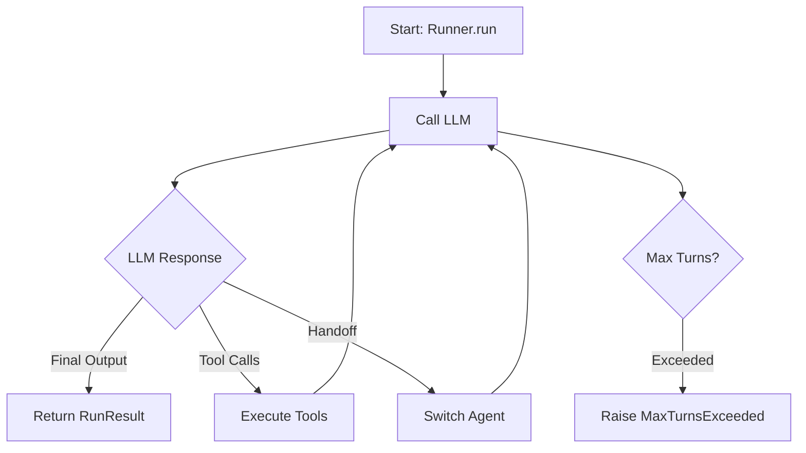

# Runner Execution Model

## Introduction

Defining an agent gives you a blueprint. The `Runner` is what brings that blueprint to life. It manages the **agent loop** — the iterative process where the LLM generates responses, calls tools, performs handoffs, and eventually produces a final output.

Understanding the Runner is critical because it controls how agents execute, how conversations persist across turns, and how you handle errors, streaming, and multi-turn interactions.

### What we'll cover

- The three Runner methods: `run()`, `run_sync()`, `run_streamed()`
- How the agent loop works step by step
- Configuring runs with `RunConfig`
- Managing multi-turn conversations
- Handling errors and setting guardrails at the run level
- Streaming responses in real time

### Prerequisites

- [Agent Class Fundamentals](./01-agent-class-fundamentals.md)
- Python async/await basics

---

## The three runner methods

The `Runner` class provides three ways to execute an agent:

```python
from agents import Agent, Runner

agent = Agent(name="Assistant", instructions="Be helpful.")

# 1. Async (recommended for production)
result = await Runner.run(agent, "Hello!")

# 2. Synchronous (convenient for scripts and testing)
result = Runner.run_sync(agent, "Hello!")

# 3. Streaming (real-time output)
result = Runner.run_streamed(agent, "Hello!")
async for event in result.stream_events():
    print(event)
```

| Method | Returns | Use when |
|--------|---------|----------|
| `Runner.run()` | `RunResult` | Async code, production apps |
| `Runner.run_sync()` | `RunResult` | Scripts, notebooks, quick tests |
| `Runner.run_streamed()` | `RunResultStreaming` | Chat UIs, real-time display |

> **Note:** `run_sync()` is a convenience wrapper that calls `run()` internally. For production applications, prefer `run()` with proper async handling.

---

## The agent loop

When you call `Runner.run()`, the SDK enters a loop that continues until a final output is produced or a limit is hit:



The loop has three possible outcomes on each iteration:

1. **Final output** — The LLM returns text (or structured output). The loop ends and `RunResult` is returned.
2. **Tool calls** — The LLM wants to call one or more tools. The tools are executed, their results are fed back, and the loop continues.
3. **Handoff** — The LLM triggers a handoff to another agent. The active agent is swapped, and the loop continues with the new agent.

### Observing the loop

```python
from agents import Agent, Runner, function_tool

@function_tool
def get_temperature(city: str) -> str:
    """Get the current temperature for a city."""
    return f"72°F in {city}"

agent = Agent(
    name="Weather Bot",
    instructions="Help users check the weather.",
    tools=[get_temperature],
)

result = Runner.run_sync(agent, "What's the temperature in Paris?")

# Inspect what happened during the run
print(f"Final output: {result.final_output}")
print(f"Items generated: {len(result.new_items)}")
for item in result.new_items:
    print(f"  - {type(item).__name__}")
```

**Output:**
```
Final output: The current temperature in Paris is 72°F.
Items generated: 3
  - MessageOutputItem
  - ToolCallItem
  - ToolCallOutputItem
```

---

## Configuring runs with RunConfig

`RunConfig` lets you customize behavior for a specific run without modifying the agent:

```python
from agents import Agent, Runner, RunConfig

agent = Agent(name="Assistant", instructions="Be helpful.")

result = await Runner.run(
    agent,
    "Summarize this article...",
    run_config=RunConfig(
        model="gpt-4o-mini",          # Override agent's model
        max_turns=5,                   # Limit loop iterations
        tracing_disabled=False,        # Enable tracing (default)
        workflow_name="summarizer",    # Name for traces
    ),
)
```

### Key RunConfig parameters

| Parameter | Type | Description |
|-----------|------|-------------|
| `model` | `str \| Model` | Override the agent's model for this run |
| `model_settings` | `ModelSettings` | Override temperature, tool_choice, etc. |
| `max_turns` | `int` | Maximum agent loop iterations (default: 10) |
| `tracing_disabled` | `bool` | Disable tracing for this run |
| `workflow_name` | `str` | Name for the trace (default: "Agent workflow") |
| `trace_id` | `str` | Custom trace ID |
| `group_id` | `str` | Link multiple traces (e.g., by conversation ID) |
| `trace_include_sensitive_data` | `bool` | Include LLM inputs/outputs in traces |
| `input_guardrails` | `list` | Run-level input guardrails |
| `output_guardrails` | `list` | Run-level output guardrails |

---

## Multi-turn conversations

Agents are stateless by default. To maintain conversation history across multiple calls, you have three options:

### Option 1: Manual with `to_input_list()`

The most explicit approach — you manage the conversation history yourself:

```python
from agents import Agent, Runner

agent = Agent(name="Assistant", instructions="Be helpful and concise.")

# First turn
result = await Runner.run(agent, "My name is Alice.")
print(result.final_output)

# Second turn — pass previous conversation as input
new_input = result.to_input_list() + [
    {"role": "user", "content": "What's my name?"}
]
result = await Runner.run(agent, new_input)
print(result.final_output)
```

**Output:**
```
Nice to meet you, Alice!
Your name is Alice.
```

### Option 2: Automatic with sessions

Sessions handle history automatically — covered in detail in [Sessions and Persistence](./09-sessions-persistence.md):

```python
from agents import Agent, Runner, SQLiteSession

agent = Agent(name="Assistant", instructions="Be concise.")
session = SQLiteSession("conversation_123")

# First turn
result = await Runner.run(agent, "My name is Alice.", session=session)

# Second turn — session remembers automatically
result = await Runner.run(agent, "What's my name?", session=session)
print(result.final_output)  # "Your name is Alice."
```

### Option 3: Server-managed with conversation_id

For Responses API users, the server handles state:

```python
from agents import Agent, Runner

agent = Agent(name="Assistant")

# First turn
result = await Runner.run(agent, "My name is Alice.")

# Second turn — use previous_response_id
result = await Runner.run(
    agent,
    "What's my name?",
    previous_response_id=result.last_response_id,
)
```

---

## Streaming responses

For chat interfaces, streaming lets you display tokens as they arrive:

```python
from agents import Agent, Runner

agent = Agent(name="Storyteller", instructions="Tell short stories.")

result = Runner.run_streamed(agent, "Tell me a story about a robot.")

async for event in result.stream_events():
    if event.type == "raw_response_event":
        # Access raw streaming data
        if hasattr(event.data, "delta") and event.data.delta:
            print(event.data.delta, end="", flush=True)
    elif event.type == "run_item_stream_event":
        # Tool calls, handoffs, etc.
        if event.item:
            print(f"\n[Event: {type(event.item).__name__}]")
    elif event.type == "agent_updated_stream_event":
        print(f"\n[Agent: {event.new_agent.name}]")
```

> **🤖 AI Context:** Streaming is essential for production chat applications. Without it, users stare at a blank screen for seconds while the full response generates. With streaming, they see tokens appear in real time — matching the experience of ChatGPT and similar products.

---

## Error handling

The SDK raises specific exceptions you can catch and handle:

```python
from agents import Agent, Runner, RunConfig
from agents.exceptions import (
    MaxTurnsExceeded,
    ModelBehaviorError,
    UserError,
    InputGuardrailTripwireTriggered,
    OutputGuardrailTripwireTriggered,
)

agent = Agent(name="Assistant", instructions="Be helpful.")

try:
    result = await Runner.run(
        agent,
        "Help me with this complex task...",
        run_config=RunConfig(max_turns=3),
    )
    print(result.final_output)

except MaxTurnsExceeded:
    print("Agent couldn't finish within the turn limit.")

except ModelBehaviorError as e:
    print(f"LLM produced invalid output: {e}")

except InputGuardrailTripwireTriggered:
    print("Input failed safety checks.")

except OutputGuardrailTripwireTriggered:
    print("Output failed safety checks.")
```

### Custom error handlers

You can also handle `max_turns` gracefully without exceptions:

```python
from agents import Agent, Runner, RunConfig

async def on_max_turns(context, agent, max_turns):
    """Return a friendly message instead of raising an exception."""
    from agents import RunErrorHandlerResult
    return RunErrorHandlerResult(
        final_output="I'm still working on this. Could you simplify your request?",
        include_in_history=True,
    )

result = await Runner.run(
    agent,
    "Very complex multi-step task...",
    run_config=RunConfig(
        max_turns=3,
        error_handlers={"max_turns": on_max_turns},
    ),
)
print(result.final_output)
```

**Output:**
```
I'm still working on this. Could you simplify your request?
```

---

## The call model input filter

Before each LLM call, you can inspect and modify what gets sent:

```python
from agents import Agent, Runner, RunConfig

def trim_history(call_model_data):
    """Keep only the last 10 messages to manage context window."""
    from agents import ModelInputData
    items = call_model_data.input
    if len(items) > 10:
        items = items[-10:]
    return ModelInputData(input=items)

result = await Runner.run(
    agent,
    long_conversation,
    run_config=RunConfig(call_model_input_filter=trim_history),
)
```

> **Warning:** The filter modifies what the LLM sees but doesn't change the stored conversation history. Use it for context window management, not for permanent data removal.

---

## Best practices

| Practice | Why it matters |
|----------|----------------|
| Set `max_turns` appropriate to your task | Prevents runaway loops and unexpected costs |
| Use `run_config` over agent modification | Keeps agents reusable across different contexts |
| Catch specific exceptions | Enables graceful degradation per error type |
| Use sessions for chat apps | Eliminates manual history management |
| Stream for user-facing applications | Dramatically improves perceived latency |
| Set `workflow_name` in RunConfig | Makes traces searchable and debuggable |

---

## Common pitfalls

| ❌ Mistake | ✅ Solution |
|-----------|-------------|
| Not setting `max_turns` | Always set a reasonable limit (5-15 for most tasks) |
| Using `run_sync()` in async code | Use `await Runner.run()` — `run_sync` blocks the event loop |
| Ignoring `to_input_list()` for multi-turn | Pass previous conversation or use sessions |
| Catching bare `Exception` | Catch specific SDK exceptions for proper handling |
| Running in production without tracing | Keep tracing enabled — it's free and invaluable for debugging |

---

## Hands-on exercise

### Your task

Build a **multi-turn quiz agent** that asks three trivia questions, tracks the score, and announces the final result.

### Requirements

1. Create an agent with instructions to run a 3-question quiz
2. Use `to_input_list()` to maintain conversation across turns
3. Set `max_turns=5` via `RunConfig`
4. Catch `MaxTurnsExceeded` with a friendly message
5. Print the conversation flow showing questions and answers

### Expected result

A working multi-turn interaction where the agent remembers previous questions and tracks the user's score.

<details>
<summary>💡 Hints (click to expand)</summary>

- Start with `Runner.run_sync(agent, "Start the quiz")`
- After each result, build new input: `result.to_input_list() + [{"role": "user", "content": user_answer}]`
- Wrap in try/except for `MaxTurnsExceeded`

</details>

<details>
<summary>✅ Solution (click to expand)</summary>

```python
from agents import Agent, Runner, RunConfig
from agents.exceptions import MaxTurnsExceeded

agent = Agent(
    name="Quiz Master",
    instructions="""You are a quiz master. Run a 3-question trivia quiz.
- Ask one question at a time
- After the user answers, tell them if they're right/wrong and give the score
- After 3 questions, announce the final score""",
)

config = RunConfig(max_turns=5)

try:
    # Turn 1: Start the quiz
    result = Runner.run_sync(agent, "Start the quiz!", run_config=config)
    print(f"Quiz Master: {result.final_output}\n")

    # Turn 2: Answer first question
    input_2 = result.to_input_list() + [
        {"role": "user", "content": "Paris"}
    ]
    result = Runner.run_sync(agent, input_2, run_config=config)
    print(f"Quiz Master: {result.final_output}\n")

    # Turn 3: Answer second question
    input_3 = result.to_input_list() + [
        {"role": "user", "content": "7"}
    ]
    result = Runner.run_sync(agent, input_3, run_config=config)
    print(f"Quiz Master: {result.final_output}\n")

except MaxTurnsExceeded:
    print("Quiz took too many turns — try again!")
```

</details>

### Bonus challenges

- [ ] Add streaming to display the quiz master's questions token-by-token
- [ ] Use `RunConfig(group_id="quiz_session_1")` to group traces
- [ ] Add a custom error handler that returns partial quiz results on max_turns

---

## Summary

✅ `Runner.run()`, `run_sync()`, and `run_streamed()` provide async, sync, and streaming execution modes

✅ The agent loop iterates through LLM calls → tool execution → handoffs until a final output or max turns

✅ `RunConfig` customizes model, limits, tracing, and guardrails per run without changing the agent

✅ Multi-turn conversations use `to_input_list()` (manual), sessions (automatic), or server-managed state

✅ Specific exception classes enable graceful error handling for each failure mode

**Next:** [Tool Implementation Patterns](./03-tool-implementation-patterns.md)

---

## Further reading

- [Running Agents docs](https://openai.github.io/openai-agents-python/running_agents/) — Full Runner reference
- [Streaming docs](https://openai.github.io/openai-agents-python/streaming/) — Stream event types
- [Results reference](https://openai.github.io/openai-agents-python/results/) — RunResult API

---

*[Back to OpenAI Agents SDK Overview](./00-openai-agents-sdk.md)*

<!-- 
Sources Consulted:
- OpenAI Agents SDK Running Agents: https://openai.github.io/openai-agents-python/running_agents/
- OpenAI Agents SDK Streaming: https://openai.github.io/openai-agents-python/streaming/
- OpenAI Agents SDK Results: https://openai.github.io/openai-agents-python/results/
-->
