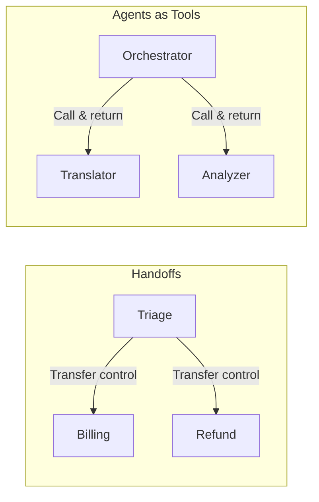

# Handoffs and Multi-Agent Orchestration

## Introduction

In complex workflows, a single agent can't do everything. A customer support system needs separate agents for billing, refunds, technical support, and escalation. The OpenAI Agents SDK provides **handoffs** — a mechanism for one agent to transfer control to another, passing along the full conversation context.

Handoffs are different from the agents-as-tools pattern (covered in the [Tools lesson](./03-tool-implementation-patterns.md)). With handoffs, the new agent **takes over completely**. With agents-as-tools, the orchestrator stays in control.

### What we'll cover

- Creating basic handoffs between agents
- Customizing handoffs with the `handoff()` function
- Passing structured data during handoffs
- Filtering conversation history with input filters
- Adding recommended handoff prompts
- Dynamically enabling/disabling handoffs

### Prerequisites

- [Agent Class Fundamentals](./01-agent-class-fundamentals.md)
- [Runner Execution Model](./02-runner-execution-model.md)

---

## Basic handoffs

The simplest way to create a handoff — just add agents to the `handoffs` list:

```python
from agents import Agent, Runner

billing_agent = Agent(
    name="Billing Agent",
    instructions="You handle billing questions. Be precise with numbers.",
    handoff_description="Handles billing and payment inquiries",
)

refund_agent = Agent(
    name="Refund Agent",
    instructions="You process refund requests. Be empathetic.",
    handoff_description="Handles refund requests and returns",
)

triage_agent = Agent(
    name="Triage Agent",
    instructions="""You are a customer support triage agent. 
Route users to the right specialist:
- Billing questions → Billing Agent
- Refund requests → Refund Agent
If unclear, ask the user to clarify.""",
    handoffs=[billing_agent, refund_agent],
)

result = Runner.run_sync(triage_agent, "I'd like a refund for my last order")
print(result.final_output)
```

**Output:**
```
I understand you'd like a refund. Let me connect you with our refund specialist who can help process that for you.
```

> **🔑 Key concept:** Handoffs are presented to the LLM as tools named `transfer_to_<agent_name>`. When the triage agent "decides" to hand off, it calls a tool like `transfer_to_refund_agent`, and the SDK swaps the active agent.

### Using `handoff_description`

The `handoff_description` property on an `Agent` is appended to the default tool description. It helps the LLM decide **when** to pick a particular handoff:

```python
billing_agent = Agent(
    name="Billing Agent",
    handoff_description="Use this when the user asks about invoices, charges, or payments",
    instructions="...",
)
```

---

## Customizing handoffs

For more control, use the `handoff()` function instead of passing agents directly:

```python
from agents import Agent, handoff, RunContextWrapper

def on_handoff(ctx: RunContextWrapper[None]):
    """Callback executed when this handoff is triggered."""
    print("📋 Logging handoff to support team...")
    # Could kick off data fetching, logging, etc.

support_agent = Agent(name="Support Agent", instructions="Help with technical issues.")

custom_handoff = handoff(
    agent=support_agent,
    tool_name_override="escalate_to_support",
    tool_description_override="Escalate complex technical issues to the support team",
    on_handoff=on_handoff,
)

triage_agent = Agent(
    name="Triage",
    instructions="Route issues to the appropriate team.",
    handoffs=[custom_handoff],
)
```

### Handoff customization options

| Parameter | Description |
|-----------|-------------|
| `agent` | The target agent to hand off to |
| `tool_name_override` | Custom tool name (default: `transfer_to_<name>`) |
| `tool_description_override` | Custom description for the LLM |
| `on_handoff` | Callback function on handoff trigger |
| `input_type` | Pydantic model for structured handoff data |
| `input_filter` | Function to filter conversation history |
| `is_enabled` | Boolean or callable to enable/disable at runtime |

---

## Handoff inputs

Sometimes you need the LLM to provide data when initiating a handoff — like a reason for escalation:

```python
from pydantic import BaseModel
from agents import Agent, handoff, RunContextWrapper

class EscalationData(BaseModel):
    reason: str
    priority: str  # "low", "medium", "high"

async def on_escalation(ctx: RunContextWrapper[None], input_data: EscalationData):
    print(f"⚠️ Escalation: {input_data.reason} (Priority: {input_data.priority})")
    # Log to incident tracking system
    
escalation_agent = Agent(
    name="Escalation Agent",
    instructions="Handle escalated issues with urgency.",
)

escalation_handoff = handoff(
    agent=escalation_agent,
    on_handoff=on_escalation,
    input_type=EscalationData,
)

support_agent = Agent(
    name="Support",
    instructions="""Handle support requests. If you can't resolve an issue,
escalate with a reason and priority level.""",
    handoffs=[escalation_handoff],
)
```

**During execution:**
```
⚠️ Escalation: Customer's account was charged twice (Priority: high)
```

---

## Input filters

By default, the new agent receives the **entire** conversation history from the previous agent. Input filters let you control what gets passed:

```python
from agents import Agent, handoff
from agents.extensions import handoff_filters

# Remove all tool call artifacts from history
clean_handoff = handoff(
    agent=specialist_agent,
    input_filter=handoff_filters.remove_all_tools,
)
```

### Custom input filters

```python
from agents import handoff, HandoffInputData

def keep_last_n_messages(data: HandoffInputData) -> HandoffInputData:
    """Only pass the last 5 messages to the new agent."""
    return HandoffInputData(
        input_history=data.input_history[-5:],
        pre_handoff_items=data.pre_handoff_items[-3:],
        new_items=data.new_items,
    )

filtered_handoff = handoff(
    agent=target_agent,
    input_filter=keep_last_n_messages,
)
```

### Nested handoff history (beta)

Instead of passing raw history, you can collapse it into a summary:

```python
from agents import RunConfig

result = await Runner.run(
    triage_agent,
    "I need help with billing",
    run_config=RunConfig(
        nest_handoff_history=True,  # Beta feature
    ),
)
```

When enabled, prior conversation is collapsed into a single `<CONVERSATION HISTORY>` block — keeping context concise for the receiving agent.

---

## Recommended handoff prompts

The SDK provides a helper to add handoff-aware instructions to your agents:

```python
from agents import Agent
from agents.extensions.handoff_prompt import (
    RECOMMENDED_PROMPT_PREFIX,
    prompt_with_handoff_instructions,
)

# Option 1: Use the recommended prefix directly
billing_agent = Agent(
    name="Billing",
    instructions=f"""{RECOMMENDED_PROMPT_PREFIX}
You handle billing inquiries. Be precise and professional.""",
)

# Option 2: Use the helper function
support_agent = Agent(
    name="Support",
    instructions=prompt_with_handoff_instructions(
        "You handle technical support. Be patient and thorough."
    ),
)
```

> **💡 Tip:** Always use `prompt_with_handoff_instructions()` when your agent participates in handoffs. It teaches the LLM how handoffs work, improving routing accuracy.

---

## Dynamic handoff enabling

Enable or disable handoffs based on runtime conditions:

```python
from agents import Agent, handoff, RunContextWrapper, AgentBase

def is_business_hours(ctx: RunContextWrapper, agent: AgentBase) -> bool:
    """Only allow escalation during business hours."""
    import datetime
    hour = datetime.datetime.now().hour
    return 9 <= hour < 17  # 9 AM to 5 PM

live_agent = Agent(name="Live Agent", instructions="You are a human support agent.")

triage = Agent(
    name="Triage",
    instructions="Route customer inquiries. Note: live agent is only available during business hours.",
    handoffs=[
        handoff(
            agent=live_agent,
            is_enabled=is_business_hours,
        ),
    ],
)
```

When `is_enabled` returns `False`, the handoff tool is completely hidden from the LLM.

---

## Handoffs vs agents-as-tools

Choosing the right pattern depends on your workflow:



| Aspect | Handoffs | Agents as tools |
|--------|----------|-----------------|
| Control flow | New agent takes over | Orchestrator stays in control |
| Conversation | New agent sees full history | Sub-agent gets just the tool input |
| Use case | Specialized routing (support tiers) | Parallel subtasks (translate + analyze) |
| Return | New agent responds directly | Result returns to orchestrator |

---

## Best practices

| Practice | Why it matters |
|----------|----------------|
| Use `handoff_description` on every agent | Helps the LLM decide when to route |
| Apply `prompt_with_handoff_instructions()` | Teaches the model about handoff mechanics |
| Filter history for specialized agents | Avoids irrelevant context polluting responses |
| Use `input_type` for structured handoff data | Captures metadata (reason, priority) for logging |
| Test handoff decisions with varied inputs | LLMs can be unpredictable about routing choices |

---

## Common pitfalls

| ❌ Mistake | ✅ Solution |
|-----------|-------------|
| No `handoff_description` on target agents | Always describe when to use each handoff |
| Circular handoffs (A → B → A) | Design clear hierarchies; use `max_turns` as a safety net |
| Passing too much history | Use `input_filter` to trim irrelevant conversation |
| Confusing handoffs with agents-as-tools | Handoffs = transfer control; tools = call and return |
| Forgetting `on_handoff` for logging | Track handoffs for analytics and debugging |

---

## Hands-on exercise

### Your task

Build a **multi-department support system** with a triage agent that routes to billing, technical support, and a fallback human agent.

### Requirements

1. Create three specialist agents: `billing_agent`, `tech_agent`, `human_agent`
2. Add `handoff_description` to each specialist
3. Create a `triage_agent` with `prompt_with_handoff_instructions()`
4. Use `input_type` on the human agent handoff to capture an escalation reason
5. Make the human agent handoff conditionally available with `is_enabled`

### Expected result

The triage agent correctly routes different types of queries to the appropriate specialist.

<details>
<summary>💡 Hints (click to expand)</summary>

- Use `from agents.extensions.handoff_prompt import prompt_with_handoff_instructions`
- Create an `EscalationReason` Pydantic model with a `reason` field
- `is_enabled` can be a simple boolean `True` for now (or a function for business hours)

</details>

<details>
<summary>✅ Solution (click to expand)</summary>

```python
from pydantic import BaseModel
from agents import Agent, Runner, handoff, RunContextWrapper
from agents.extensions.handoff_prompt import prompt_with_handoff_instructions

class EscalationReason(BaseModel):
    reason: str
    severity: str  # "low", "medium", "high"

async def log_escalation(ctx: RunContextWrapper, data: EscalationReason):
    print(f"📋 Human escalation: {data.reason} (Severity: {data.severity})")

billing_agent = Agent(
    name="Billing Agent",
    handoff_description="Handles invoices, payments, charges, and subscription questions",
    instructions="You are a billing specialist. Help with payment-related questions.",
)

tech_agent = Agent(
    name="Technical Support",
    handoff_description="Handles bugs, errors, setup issues, and technical troubleshooting",
    instructions="You are a technical support specialist. Help debug and resolve issues.",
)

human_agent = Agent(
    name="Human Agent",
    instructions="A human agent will take over from here.",
)

triage_agent = Agent(
    name="Triage",
    instructions=prompt_with_handoff_instructions(
        """You are a customer support triage agent.
Route users to the appropriate specialist based on their issue.
If no specialist fits, escalate to a human agent with a reason."""
    ),
    handoffs=[
        billing_agent,
        tech_agent,
        handoff(
            agent=human_agent,
            on_handoff=log_escalation,
            input_type=EscalationReason,
            is_enabled=True,
        ),
    ],
)

# Test routing
result = Runner.run_sync(triage_agent, "My app keeps crashing when I open settings")
print(result.final_output)
```

</details>

### Bonus challenges

- [ ] Add an `input_filter` that removes tool calls before handing off
- [ ] Implement circular handoff protection with `max_turns=10`
- [ ] Add a feedback loop where the specialist can hand back to triage

---

## Summary

✅ Handoffs transfer complete control from one agent to another — the new agent responds directly to the user

✅ The `handoff()` function provides customization: callbacks, input types, filters, and conditional enabling

✅ Input filters control what conversation history the receiving agent sees

✅ `prompt_with_handoff_instructions()` teaches the LLM about handoff mechanics for better routing

✅ Use handoffs for routing workflows; use agents-as-tools for orchestration workflows

**Next:** [Guardrails and Safety](./05-guardrails-safety.md)

---

## Further reading

- [Handoffs docs](https://openai.github.io/openai-agents-python/handoffs/) — Full handoff reference
- [Multi-agent orchestration](https://openai.github.io/openai-agents-python/multi_agent/) — Patterns guide
- [Handoff filters](https://openai.github.io/openai-agents-python/ref/extensions/handoff_filters/) — Built-in filter functions

---

*[Back to OpenAI Agents SDK Overview](./00-openai-agents-sdk.md)*

<!-- 
Sources Consulted:
- OpenAI Agents SDK Handoffs: https://openai.github.io/openai-agents-python/handoffs/
- OpenAI Agents SDK Multi-agent: https://openai.github.io/openai-agents-python/multi_agent/
- Handoff prompt extension: https://openai.github.io/openai-agents-python/ref/extensions/handoff_prompt/
-->
