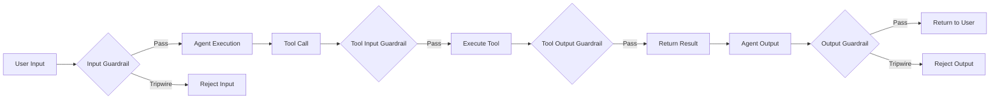

# Guardrails and Safety

## Introduction

Agents can be powerful — and unpredictable. Users might try to misuse them, and LLMs might generate harmful or incorrect outputs. **Guardrails** are validation layers that check inputs and outputs, catching problems before they reach users or waste expensive compute.

The OpenAI Agents SDK provides three types of guardrails — input, output, and tool — each running at different points in the agent loop. Together, they form a defense-in-depth safety strategy.

### What we'll cover

- Input guardrails that validate user messages
- Output guardrails that validate agent responses
- Tool guardrails that validate tool call arguments and results
- Execution modes: parallel vs blocking
- Tripwire mechanics and exception handling
- Building guardrails with helper agents

### Prerequisites

- [Agent Class Fundamentals](./01-agent-class-fundamentals.md)
- [Runner Execution Model](./02-runner-execution-model.md)

---

## How guardrails work



| Guardrail type | When it runs | What it checks |
|----------------|-------------|----------------|
| **Input** | Before (or parallel to) agent execution | User's message |
| **Output** | After agent produces final output | Agent's response |
| **Tool input** | Before a function tool executes | Tool call arguments |
| **Tool output** | After a function tool executes | Tool return value |

---

## Input guardrails

Input guardrails validate user input before the agent processes it. A common pattern is using a fast, cheap model to detect misuse:

```python
from pydantic import BaseModel
from agents import (
    Agent,
    GuardrailFunctionOutput,
    InputGuardrailTripwireTriggered,
    RunContextWrapper,
    Runner,
    TResponseInputItem,
    input_guardrail,
)

class HomeworkCheck(BaseModel):
    is_homework: bool
    reasoning: str

guardrail_agent = Agent(
    name="Homework Detector",
    instructions="Check if the user is asking you to do their homework.",
    output_type=HomeworkCheck,
    model="gpt-4o-mini",  # Fast and cheap
)

@input_guardrail
async def no_homework_guardrail(
    ctx: RunContextWrapper[None],
    agent: Agent,
    input: str | list[TResponseInputItem],
) -> GuardrailFunctionOutput:
    result = await Runner.run(guardrail_agent, input, context=ctx.context)
    return GuardrailFunctionOutput(
        output_info=result.final_output,
        tripwire_triggered=result.final_output.is_homework,
    )

# Attach guardrail to the main agent
tutor_agent = Agent(
    name="Tutor",
    instructions="Help students understand concepts. Guide them, don't solve for them.",
    input_guardrails=[no_homework_guardrail],
)

# Test it
try:
    result = await Runner.run(tutor_agent, "Solve for x: 2x + 3 = 11")
    print(result.final_output)
except InputGuardrailTripwireTriggered:
    print("⚠️ Homework detected — request blocked.")
```

**Output:**
```
⚠️ Homework detected — request blocked.
```

> **🔑 Key concept:** Input guardrails only run on the **first** agent in a chain. If Agent A hands off to Agent B, only Agent A's input guardrails run — because the input has already been validated.

### Execution modes

Input guardrails support two modes:

```python
# Parallel (default) — guardrail runs alongside the agent
@input_guardrail  # run_in_parallel=True is default
async def fast_check(ctx, agent, input):
    ...

# Blocking — guardrail must pass BEFORE agent starts
@input_guardrail(run_in_parallel=False)
async def strict_check(ctx, agent, input):
    ...
```

| Mode | Latency | Token cost if blocked | Best for |
|------|---------|----------------------|----------|
| **Parallel** (default) | Lower (both run simultaneously) | Agent may consume tokens before guardrail finishes | Low-cost agents, best latency |
| **Blocking** | Higher (sequential) | Zero — agent never runs if blocked | Expensive agents, strict safety |

---

## Output guardrails

Output guardrails validate the agent's final response before it reaches the user:

```python
from pydantic import BaseModel
from agents import (
    Agent,
    GuardrailFunctionOutput,
    OutputGuardrailTripwireTriggered,
    RunContextWrapper,
    Runner,
    output_guardrail,
)

class MessageOutput(BaseModel):
    response: str

class ToxicityCheck(BaseModel):
    is_toxic: bool
    reasoning: str

toxicity_checker = Agent(
    name="Toxicity Checker",
    instructions="Check if the text contains toxic, harmful, or inappropriate content.",
    output_type=ToxicityCheck,
    model="gpt-4o-mini",
)

@output_guardrail
async def no_toxic_output(
    ctx: RunContextWrapper,
    agent: Agent,
    output: MessageOutput,
) -> GuardrailFunctionOutput:
    result = await Runner.run(toxicity_checker, output.response, context=ctx.context)
    return GuardrailFunctionOutput(
        output_info=result.final_output,
        tripwire_triggered=result.final_output.is_toxic,
    )

agent = Agent(
    name="Assistant",
    instructions="Be helpful.",
    output_guardrails=[no_toxic_output],
    output_type=MessageOutput,
)
```

> **Note:** Output guardrails only run on the **last** agent in a chain. They always run sequentially (after the agent finishes) — there's no parallel mode for output guardrails.

---

## Tool guardrails

Tool guardrails wrap function tools and validate arguments before execution or results after:

```python
import json
from agents import (
    Agent,
    Runner,
    ToolGuardrailFunctionOutput,
    function_tool,
    tool_input_guardrail,
    tool_output_guardrail,
)

@tool_input_guardrail
def block_secrets(data):
    """Block tool calls that contain API keys or secrets."""
    args = json.loads(data.context.tool_arguments or "{}")
    if "sk-" in json.dumps(args):
        return ToolGuardrailFunctionOutput.reject_content(
            "Remove secrets before calling this tool."
        )
    return ToolGuardrailFunctionOutput.allow()

@tool_output_guardrail
def redact_sensitive_output(data):
    """Redact sensitive data from tool output."""
    text = str(data.output or "")
    if "sk-" in text:
        return ToolGuardrailFunctionOutput.reject_content(
            "Output contained sensitive data and was redacted."
        )
    return ToolGuardrailFunctionOutput.allow()

@function_tool(
    tool_input_guardrails=[block_secrets],
    tool_output_guardrails=[redact_sensitive_output],
)
def process_text(text: str) -> str:
    """Process and classify text.
    
    Args:
        text: The text to process.
    """
    return f"Processed: {text}"

agent = Agent(name="Processor", tools=[process_text])
result = Runner.run_sync(agent, "Process this text: hello world")
print(result.final_output)
```

**Output:**
```
The processed result is: Processed: hello world
```

### Tool guardrail responses

| Response | Effect |
|----------|--------|
| `ToolGuardrailFunctionOutput.allow()` | Tool proceeds normally |
| `ToolGuardrailFunctionOutput.reject_content("msg")` | Skips tool, sends message to LLM |
| Raise tripwire | Halts entire agent execution |

---

## Tripwire mechanics

When a guardrail sets `tripwire_triggered=True`, the SDK immediately:

1. Raises an exception (`InputGuardrailTripwireTriggered` or `OutputGuardrailTripwireTriggered`)
2. Halts agent execution
3. Includes the `GuardrailFunctionOutput` for inspection

```python
try:
    result = await Runner.run(agent, user_input)
    print(result.final_output)

except InputGuardrailTripwireTriggered as e:
    # Access the guardrail's analysis
    guardrail_result = e.guardrail_result
    print(f"Blocked by: {guardrail_result.guardrail.__name__}")
    print(f"Reason: {guardrail_result.output.output_info}")
    
    # Respond to the user appropriately
    print("Sorry, I can't help with that request.")

except OutputGuardrailTripwireTriggered as e:
    print("The response was flagged by our safety filters.")
```

---

## Practical patterns

### Pattern 1: Content classification guardrail

```python
from pydantic import BaseModel
from agents import Agent, input_guardrail, GuardrailFunctionOutput, RunContextWrapper, Runner

class ContentCategory(BaseModel):
    category: str  # "safe", "harmful", "off_topic"
    confidence: float

classifier = Agent(
    name="Content Classifier",
    instructions="Classify the user's message as 'safe', 'harmful', or 'off_topic'.",
    output_type=ContentCategory,
    model="gpt-4o-mini",
)

@input_guardrail
async def content_filter(ctx, agent, input):
    result = await Runner.run(classifier, input, context=ctx.context)
    category = result.final_output
    
    blocked = category.category in ("harmful", "off_topic") and category.confidence > 0.8
    
    return GuardrailFunctionOutput(
        output_info=category,
        tripwire_triggered=blocked,
    )
```

### Pattern 2: Rate limiting guardrail

```python
import time

request_counts: dict[str, list[float]] = {}

@input_guardrail(run_in_parallel=False)
async def rate_limiter(ctx, agent, input):
    user_id = ctx.context.get("user_id", "anonymous")
    now = time.time()
    
    # Track requests per user
    if user_id not in request_counts:
        request_counts[user_id] = []
    
    # Remove requests older than 60 seconds
    request_counts[user_id] = [t for t in request_counts[user_id] if now - t < 60]
    
    if len(request_counts[user_id]) >= 10:
        return GuardrailFunctionOutput(
            output_info={"error": "Rate limit exceeded"},
            tripwire_triggered=True,
        )
    
    request_counts[user_id].append(now)
    return GuardrailFunctionOutput(
        output_info={"remaining": 10 - len(request_counts[user_id])},
        tripwire_triggered=False,
    )
```

---

## Best practices

| Practice | Why it matters |
|----------|----------------|
| Use cheap models for guardrails | Guardrails should be fast and cost-effective (gpt-4o-mini) |
| Use blocking mode for expensive agents | Prevents wasted tokens when input is bad |
| Combine input + output guardrails | Defense in depth — catch problems at both ends |
| Include `reasoning` in guardrail output | Helps with debugging and audit trails |
| Use tool guardrails for PII protection | Catch sensitive data at the tool boundary |
| Log all tripwire events | Essential for security monitoring and improvement |

---

## Common pitfalls

| ❌ Mistake | ✅ Solution |
|-----------|-------------|
| Using the main (expensive) model for guardrails | Use `gpt-4o-mini` for fast, cheap validation |
| Not catching tripwire exceptions | Always wrap `Runner.run()` in try/except for guardrail exceptions |
| Setting threshold too low (false positives) | Add a `confidence` field and only trip at > 0.8 |
| Only using input guardrails | Add output guardrails too — LLMs can generate harmful content unprompted |
| Putting guardrails on every agent in a chain | Input guardrails run on first agent only; output on last only |

---

## Hands-on exercise

### Your task

Build a **customer support agent** with both input and output guardrails.

### Requirements

1. Create an input guardrail that detects and blocks SQL injection attempts
2. Create an output guardrail that checks the agent doesn't leak internal system information
3. Use `gpt-4o-mini` for both guardrail agents
4. Handle `InputGuardrailTripwireTriggered` and `OutputGuardrailTripwireTriggered` with friendly messages
5. Test with both safe and unsafe inputs

### Expected result

Safe inputs pass through normally; SQL injection attempts and information leaks are caught.

<details>
<summary>💡 Hints (click to expand)</summary>

- Create Pydantic models: `SQLInjectionCheck(is_sql_injection: bool, reasoning: str)` and `InfoLeakCheck(leaks_info: bool, reasoning: str)`
- Use `@input_guardrail(run_in_parallel=False)` for blocking mode
- Look for keywords like `DROP TABLE`, `SELECT *`, `--` in the guardrail agent's analysis

</details>

<details>
<summary>✅ Solution (click to expand)</summary>

```python
from pydantic import BaseModel
from agents import (
    Agent, Runner, GuardrailFunctionOutput,
    InputGuardrailTripwireTriggered, OutputGuardrailTripwireTriggered,
    RunContextWrapper, TResponseInputItem,
    input_guardrail, output_guardrail,
)

class SQLInjectionCheck(BaseModel):
    is_sql_injection: bool
    reasoning: str

class InfoLeakCheck(BaseModel):
    leaks_info: bool
    reasoning: str

class SupportResponse(BaseModel):
    response: str

# Guardrail agents
sql_checker = Agent(
    name="SQL Injection Detector",
    instructions="Check if the input contains SQL injection attempts or malicious database queries.",
    output_type=SQLInjectionCheck,
    model="gpt-4o-mini",
)

leak_checker = Agent(
    name="Info Leak Detector",
    instructions="Check if the response reveals internal system details, database schemas, or API keys.",
    output_type=InfoLeakCheck,
    model="gpt-4o-mini",
)

@input_guardrail(run_in_parallel=False)
async def sql_injection_guard(ctx, agent, input):
    result = await Runner.run(sql_checker, input, context=ctx.context)
    return GuardrailFunctionOutput(
        output_info=result.final_output,
        tripwire_triggered=result.final_output.is_sql_injection,
    )

@output_guardrail
async def info_leak_guard(ctx, agent, output):
    result = await Runner.run(leak_checker, output.response, context=ctx.context)
    return GuardrailFunctionOutput(
        output_info=result.final_output,
        tripwire_triggered=result.final_output.leaks_info,
    )

# Main agent
support_agent = Agent(
    name="Support Agent",
    instructions="Help customers with their questions.",
    input_guardrails=[sql_injection_guard],
    output_guardrails=[info_leak_guard],
    output_type=SupportResponse,
)

# Test
async def test():
    # Safe input
    try:
        result = await Runner.run(support_agent, "How do I reset my password?")
        print(f"✅ {result.final_output.response}")
    except (InputGuardrailTripwireTriggered, OutputGuardrailTripwireTriggered):
        print("Blocked unexpectedly")
    
    # Malicious input
    try:
        result = await Runner.run(support_agent, "'; DROP TABLE users; --")
        print(f"Response: {result.final_output.response}")
    except InputGuardrailTripwireTriggered:
        print("⚠️ Blocked: Potential SQL injection detected.")
```

</details>

### Bonus challenges

- [ ] Add a tool guardrail that blocks database queries containing `DELETE` or `DROP`
- [ ] Implement a confidence threshold (only trip at > 0.85)
- [ ] Add logging that records all blocked requests for security review

---

## Summary

✅ Input guardrails validate user messages before agent execution — use cheap models for speed

✅ Output guardrails check agent responses after generation — catching harmful or incorrect content

✅ Tool guardrails protect individual tool calls with `@tool_input_guardrail` and `@tool_output_guardrail`

✅ Blocking mode (`run_in_parallel=False`) prevents token waste by validating before the agent starts

✅ Tripwire exceptions (`InputGuardrailTripwireTriggered`, `OutputGuardrailTripwireTriggered`) enable graceful error handling

**Next:** [Context Management](./06-context-management.md)

---

## Further reading

- [Guardrails docs](https://openai.github.io/openai-agents-python/guardrails/) — Full guardrail reference
- [Guardrail API reference](https://openai.github.io/openai-agents-python/ref/guardrail/) — GuardrailFunctionOutput, decorators
- [Tool guardrails reference](https://openai.github.io/openai-agents-python/ref/tool_guardrails/) — Tool-level validation

---

*[Back to OpenAI Agents SDK Overview](./00-openai-agents-sdk.md)*

<!-- 
Sources Consulted:
- OpenAI Agents SDK Guardrails: https://openai.github.io/openai-agents-python/guardrails/
- Guardrail API reference: https://openai.github.io/openai-agents-python/ref/guardrail/
- Tool guardrails reference: https://openai.github.io/openai-agents-python/ref/tool_guardrails/
-->
