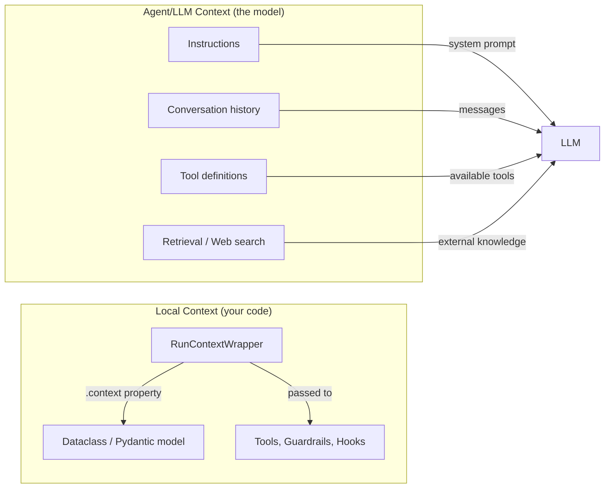

# Context Management

## Introduction

Every real agent needs access to shared state — user preferences, database connections, API clients, or accumulated data. The OpenAI Agents SDK solves this with **context management**: a type-safe way to pass data through the entire agent execution pipeline without global variables.

There are two distinct types of context in the SDK. Understanding the difference is critical for building effective agents.

### What we'll cover

- The two types of context (local vs agent/LLM context)
- `RunContextWrapper` and the generic `Agent[T]` pattern
- Passing context to tools, guardrails, and lifecycle hooks
- `ToolContext` and its extra properties
- Practical patterns for dependency injection

### Prerequisites

- [Agent Class Fundamentals](./01-agent-class-fundamentals.md)
- [Runner Execution Model](./02-runner-execution-model.md)
- [Tool Implementation Patterns](./03-tool-implementation-patterns.md)

---

## Two types of context



| Aspect | Local context | Agent/LLM context |
|--------|--------------|-------------------|
| **Who sees it** | Your code (tools, hooks, guardrails) | The LLM model |
| **What it contains** | DB connections, API clients, user data | Instructions, history, tool schemas |
| **How to set it** | `Runner.run(context=obj)` | `instructions`, `tools`, input messages |
| **Passed to LLM?** | ❌ Never | ✅ Yes |

> **🔑 Key concept:** Local context is **invisible** to the LLM. The model never sees your database connections, API keys, or internal objects. Agent/LLM context is what the model receives as part of its prompt.

---

## RunContextWrapper

`RunContextWrapper[T]` wraps your custom context object and is passed to every tool, guardrail, and hook. Access your data via the `.context` property:

```python
from dataclasses import dataclass
from agents import Agent, RunContextWrapper, Runner, function_tool

@dataclass
class UserContext:
    user_id: str
    user_name: str
    is_premium: bool
    request_count: int = 0

@function_tool
async def get_user_profile(ctx: RunContextWrapper[UserContext]) -> str:
    """Get the current user's profile information."""
    user = ctx.context
    user.request_count += 1  # Mutable — changes persist during the run
    return f"User: {user.user_name} (ID: {user.user_id}), Premium: {user.is_premium}"

agent = Agent[UserContext](
    name="Profile Agent",
    instructions="Help users manage their profile.",
    tools=[get_user_profile],
)

# Pass context when running
ctx = UserContext(user_id="u_123", user_name="Alice", is_premium=True)
result = Runner.run_sync(agent, "Show me my profile", context=ctx)
print(result.final_output)
print(f"Requests made: {ctx.request_count}")
```

**Output:**
```
Your profile: User Alice (ID: u_123), Premium: True
Requests made: 1
```

### Key behaviors

| Behavior | Detail |
|----------|--------|
| **Type-safe** | `Agent[UserContext]` ensures type checking throughout |
| **Mutable** | Changes to `ctx.context` persist across the entire run |
| **Shared** | All tools, guardrails, and hooks in the same run share the same instance |
| **Not sent to LLM** | The context object is never serialized or sent to the model |

---

## Defining context types

We can use either dataclasses or Pydantic models for context:

### Dataclass pattern (recommended for most cases)

```python
from dataclasses import dataclass, field
from typing import Any

@dataclass
class AppContext:
    # User info
    user_id: str
    session_id: str
    
    # Dependencies (set up before the run)
    db_connection: Any = None
    api_client: Any = None
    
    # Accumulated state (mutated during the run)
    tool_calls: list[str] = field(default_factory=list)
    errors: list[str] = field(default_factory=list)
```

### Pydantic pattern (when validation matters)

```python
from pydantic import BaseModel, Field

class AppContext(BaseModel):
    user_id: str
    session_id: str
    max_tool_calls: int = Field(default=10, ge=1, le=100)
    
    model_config = {"arbitrary_types_allowed": True}
```

> **💡 Tip:** Use dataclasses when your context holds non-serializable objects (DB connections, HTTP clients). Use Pydantic when you want input validation on context fields.

---

## ToolContext

When a function tool receives context, it actually gets a `RunContextWrapper`. But tools also have access to `ToolContext`, which extends `RunContextWrapper` with tool-specific metadata:

```python
from agents import function_tool, ToolContext

@function_tool
async def smart_tool(ctx: ToolContext[UserContext], query: str) -> str:
    """A tool that knows about itself.
    
    Args:
        query: The search query.
    """
    # Standard context access
    user = ctx.context
    
    # Tool-specific metadata
    print(f"Tool name: {ctx.tool_name}")
    print(f"Tool call ID: {ctx.tool_call_id}")
    print(f"Raw arguments: {ctx.tool_arguments}")
    
    return f"Processed '{query}' for user {user.user_name}"
```

| Property | Type | Description |
|----------|------|-------------|
| `ctx.context` | `T` | Your custom context object |
| `ctx.tool_name` | `str` | Name of the current tool |
| `ctx.tool_call_id` | `str` | Unique ID for this tool call |
| `ctx.tool_arguments` | `str` | Raw JSON arguments from the LLM |

---

## Context in dynamic instructions

Dynamic instructions receive the context wrapper, enabling personalized system prompts:

```python
from agents import Agent, RunContextWrapper

@dataclass
class UserContext:
    user_name: str
    language: str
    expertise_level: str  # "beginner", "intermediate", "expert"

def personalized_instructions(
    ctx: RunContextWrapper[UserContext],
    agent: Agent[UserContext],
) -> str:
    user = ctx.context
    return f"""You are a helpful assistant for {user.user_name}.
    
Respond in {user.language}.
Adjust explanations for {user.expertise_level} level.
The user's name is {user.user_name} — use it occasionally for a personal touch."""

agent = Agent[UserContext](
    name="Personal Assistant",
    instructions=personalized_instructions,
    tools=[...],
)

# Different contexts produce different behaviors
beginner = UserContext(user_name="Alex", language="English", expertise_level="beginner")
expert = UserContext(user_name="Dr. Chen", language="English", expertise_level="expert")

result_beginner = Runner.run_sync(agent, "Explain neural networks", context=beginner)
result_expert = Runner.run_sync(agent, "Explain neural networks", context=expert)
```

---

## Context in guardrails and hooks

Context flows to every extension point in the SDK:

### Guardrails

```python
from agents import input_guardrail, GuardrailFunctionOutput, RunContextWrapper

@input_guardrail
async def premium_only_guard(ctx: RunContextWrapper[UserContext], agent, input):
    if not ctx.context.is_premium:
        return GuardrailFunctionOutput(
            output_info="Premium required",
            tripwire_triggered=True,
        )
    return GuardrailFunctionOutput(
        output_info="Access granted",
        tripwire_triggered=False,
    )
```

### Lifecycle hooks

```python
from agents import AgentHooks, RunContextWrapper, Agent
from agents.types import Tool

class AuditHooks(AgentHooks[UserContext]):
    async def on_start(self, ctx: RunContextWrapper[UserContext], agent: Agent[UserContext]):
        print(f"[AUDIT] User {ctx.context.user_id} started agent '{agent.name}'")
    
    async def on_tool_start(
        self, ctx: RunContextWrapper[UserContext], agent: Agent, tool: Tool
    ):
        ctx.context.tool_calls.append(tool.name)
        print(f"[AUDIT] Tool called: {tool.name}")
    
    async def on_end(self, ctx: RunContextWrapper[UserContext], agent: Agent, output):
        print(f"[AUDIT] Agent completed. Total tool calls: {len(ctx.context.tool_calls)}")
```

---

## Context through handoffs

When agents hand off to each other, context flows automatically:

```python
from dataclasses import dataclass
from agents import Agent, Runner, function_tool, RunContextWrapper

@dataclass
class SupportContext:
    customer_id: str
    tier: str  # "free", "pro", "enterprise"
    escalated: bool = False

@function_tool
async def lookup_account(ctx: RunContextWrapper[SupportContext]) -> str:
    """Look up the customer's account details."""
    return f"Customer: {ctx.context.customer_id}, Tier: {ctx.context.tier}"

billing_agent = Agent[SupportContext](
    name="Billing Agent",
    instructions="Handle billing questions.",
    tools=[lookup_account],
)

support_agent = Agent[SupportContext](
    name="Support Agent",
    instructions="Handle support requests. Hand off billing questions to the Billing Agent.",
    handoffs=[billing_agent],
)

# The same context is available in both agents
ctx = SupportContext(customer_id="C_456", tier="pro")
result = Runner.run_sync(support_agent, "I have a billing question", context=ctx)
```

> **Note:** All agents in a handoff chain must share the same context type `T`. The SDK enforces this through the `Agent[T]` generic parameter.

---

## Best practices

| Practice | Why it matters |
|----------|----------------|
| Use `@dataclass` for contexts with non-serializable objects | DB connections, API clients can't be Pydantic models easily |
| Type your agents with `Agent[T]` | Catches context type mismatches at development time |
| Keep context flat (avoid deep nesting) | Easier to access and debug |
| Initialize dependencies before `Runner.run()` | Don't create DB connections inside tools |
| Use context for dependency injection | Test tools by mocking context objects |
| Never put secrets in agent instructions | Use local context for API keys; instructions go to the LLM |

---

## Common pitfalls

| ❌ Mistake | ✅ Solution |
|-----------|-------------|
| Putting API keys in `instructions` | Store in context — instructions are sent to the LLM |
| Creating DB connections inside tools | Initialize once in context, share across all tools |
| Using global variables instead of context | Use `RunContextWrapper` for type-safe, testable state |
| Mismatched context types across handoff agents | All agents in a chain must use the same `Agent[T]` |
| Forgetting context is mutable | Changes in one tool are visible in subsequent tools — design for this |

---

## Hands-on exercise

### Your task

Build an **expense tracking agent** with a shared context that accumulates data across tool calls.

### Requirements

1. Create an `ExpenseContext` dataclass with: `user_id`, `budget_limit` (float), `expenses` (list of dicts), and `total_spent` (float)
2. Create tools: `add_expense(ctx, description, amount)`, `get_remaining_budget(ctx)`, and `list_expenses(ctx)`
3. Use dynamic instructions that mention the user's remaining budget
4. Add a guardrail that blocks requests when the budget is exceeded
5. Test with multiple tool calls that accumulate in context

### Expected result

The agent should track expenses in context, update totals, and block when over budget.

<details>
<summary>💡 Hints (click to expand)</summary>

- `ctx.context.expenses.append({"description": description, "amount": amount})`
- Update `ctx.context.total_spent` in the `add_expense` tool
- The guardrail can check `ctx.context.total_spent >= ctx.context.budget_limit`
- Dynamic instructions: `f"Remaining budget: ${ctx.context.budget_limit - ctx.context.total_spent:.2f}"`

</details>

<details>
<summary>✅ Solution (click to expand)</summary>

```python
from dataclasses import dataclass, field
from agents import (
    Agent, Runner, RunContextWrapper,
    function_tool, input_guardrail,
    GuardrailFunctionOutput, InputGuardrailTripwireTriggered,
)

@dataclass
class ExpenseContext:
    user_id: str
    budget_limit: float
    expenses: list[dict] = field(default_factory=list)
    total_spent: float = 0.0

@function_tool
async def add_expense(ctx: RunContextWrapper[ExpenseContext], description: str, amount: float) -> str:
    """Add a new expense.
    
    Args:
        description: What the expense was for.
        amount: The dollar amount.
    """
    ctx.context.expenses.append({"description": description, "amount": amount})
    ctx.context.total_spent += amount
    remaining = ctx.context.budget_limit - ctx.context.total_spent
    return f"Added ${amount:.2f} for '{description}'. Remaining budget: ${remaining:.2f}"

@function_tool
async def get_remaining_budget(ctx: RunContextWrapper[ExpenseContext]) -> str:
    """Check remaining budget."""
    remaining = ctx.context.budget_limit - ctx.context.total_spent
    return f"Remaining: ${remaining:.2f} of ${ctx.context.budget_limit:.2f}"

@function_tool
async def list_expenses(ctx: RunContextWrapper[ExpenseContext]) -> str:
    """List all expenses."""
    if not ctx.context.expenses:
        return "No expenses recorded."
    lines = [f"- {e['description']}: ${e['amount']:.2f}" for e in ctx.context.expenses]
    return "\n".join(lines)

@input_guardrail(run_in_parallel=False)
async def budget_guard(ctx: RunContextWrapper[ExpenseContext], agent, input):
    over = ctx.context.total_spent >= ctx.context.budget_limit
    return GuardrailFunctionOutput(
        output_info={"over_budget": over, "spent": ctx.context.total_spent},
        tripwire_triggered=over,
    )

def dynamic_instructions(ctx: RunContextWrapper[ExpenseContext], agent):
    remaining = ctx.context.budget_limit - ctx.context.total_spent
    return f"""You are an expense tracker for user {ctx.context.user_id}.
Budget: ${ctx.context.budget_limit:.2f} | Spent: ${ctx.context.total_spent:.2f} | Remaining: ${remaining:.2f}
Help the user track expenses using the available tools."""

expense_agent = Agent[ExpenseContext](
    name="Expense Tracker",
    instructions=dynamic_instructions,
    tools=[add_expense, get_remaining_budget, list_expenses],
    input_guardrails=[budget_guard],
)

ctx = ExpenseContext(user_id="u_789", budget_limit=100.00)

try:
    result = Runner.run_sync(expense_agent, "Add lunch for $12.50", context=ctx)
    print(result.final_output)
    print(f"Context state: spent=${ctx.total_spent}, expenses={len(ctx.expenses)}")
except InputGuardrailTripwireTriggered:
    print("Budget exceeded!")
```

</details>

### Bonus challenges

- [ ] Add a `category` field to expenses and a `get_spending_by_category` tool
- [ ] Create a second agent (Budget Advisor) that receives the same context via handoff
- [ ] Log all tool calls in context using `AgentHooks`

---

## Summary

✅ Local context (`RunContextWrapper[T]`) passes data to tools, guardrails, and hooks — invisible to the LLM

✅ Agent/LLM context (instructions, history, tools) is what the model sees and reasons about

✅ `ToolContext` extends `RunContextWrapper` with `tool_name`, `tool_call_id`, and `tool_arguments`

✅ Context flows automatically through handoffs — all agents in a chain share the same instance

✅ Use dataclasses for contexts with non-serializable objects; Pydantic for validated inputs

**Next:** [Tracing and Observability](./07-tracing-observability.md)

---

## Further reading

- [Context docs](https://openai.github.io/openai-agents-python/context/) — RunContextWrapper reference
- [Agent generics](https://openai.github.io/openai-agents-python/agents/) — Agent[T] pattern
- [ToolContext reference](https://openai.github.io/openai-agents-python/ref/tool_context/) — Tool-specific metadata

---

*[Back to OpenAI Agents SDK Overview](./00-openai-agents-sdk.md)*

<!-- 
Sources Consulted:
- OpenAI Agents SDK Context: https://openai.github.io/openai-agents-python/context/
- Agent reference: https://openai.github.io/openai-agents-python/agents/
- Tool context reference: https://openai.github.io/openai-agents-python/ref/tool_context/
-->
