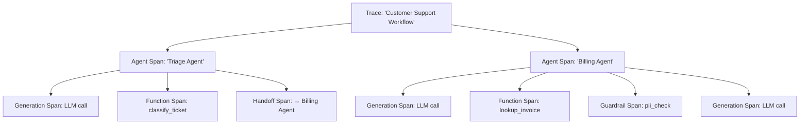

# Tracing and Observability

## Introduction

When agents call tools, hand off to other agents, and make multiple LLM requests, debugging becomes hard. **Tracing** records every step of agent execution — model calls, tool invocations, guardrail checks, and handoffs — in a structured timeline you can inspect after the fact.

The OpenAI Agents SDK has built-in tracing that works automatically. Every `Runner.run()` call creates a trace with nested spans, and sends it to the OpenAI dashboard by default. We can also export traces to 20+ third-party platforms.

### What we'll cover

- How traces and spans work
- Automatic tracing (what the SDK records by default)
- Custom traces and spans for your own logic
- Configuring traces via `RunConfig`
- Sensitive data handling
- Custom trace processors and exporters
- Third-party integrations (Langfuse, Arize, Weights & Biases, etc.)

### Prerequisites

- [Runner Execution Model](./02-runner-execution-model.md)
- [Tool Implementation Patterns](./03-tool-implementation-patterns.md)

---

## Traces and spans



| Concept | Description |
|---------|-------------|
| **Trace** | Top-level container for an entire workflow execution |
| **Span** | A single operation within a trace (agent run, LLM call, tool call, etc.) |
| **workflow_name** | Human-readable name for the trace |
| **trace_id** | Unique identifier for linking spans |
| **group_id** | Groups related traces (e.g., a conversation session) |

---

## Automatic tracing

By default, the SDK creates traces and spans automatically:

```python
from agents import Agent, Runner, function_tool

@function_tool
def get_weather(city: str) -> str:
    """Get current weather for a city.
    
    Args:
        city: The city name.
    """
    return f"72°F and sunny in {city}"

agent = Agent(
    name="Weather Bot",
    instructions="Help users check the weather.",
    tools=[get_weather],
)

# This automatically creates a trace with:
# - Agent span for "Weather Bot"
# - Generation span for each LLM call
# - Function span for get_weather tool calls
result = Runner.run_sync(agent, "What's the weather in Tokyo?")
print(result.final_output)
```

**Output:**
```
It's currently 72°F and sunny in Tokyo!
```

### What gets traced automatically

| Operation | Span type | Recorded data |
|-----------|-----------|---------------|
| `Runner.run()` | Trace (top-level) | workflow_name, trace_id, group_id |
| Agent execution | `agent_span()` | Agent name, handoffs, tools, output_type |
| LLM call | `generation_span()` | Model, input messages, output, usage |
| Function tool | `function_span()` | Tool name, input, output |
| Guardrail | `guardrail_span()` | Guardrail name, triggered status |
| Handoff | `handoff_span()` | Source agent, target agent |
| STT (voice) | `transcription_span()` | Audio input, transcript |
| TTS (voice) | `speech_span()` | Text input, audio output |

---

## Configuring traces with RunConfig

Control tracing behavior through `RunConfig`:

```python
from agents import Agent, Runner, RunConfig

agent = Agent(name="Assistant", instructions="Be helpful.")

# Full configuration
config = RunConfig(
    workflow_name="Customer Support v2",   # Human-readable name in dashboard
    trace_id="trace_abc123",               # Custom trace ID (for linking)
    group_id="session_789",                # Group related traces together
    tracing_disabled=False,                # Set True to disable tracing
    trace_include_sensitive_data=True,      # Include LLM inputs/outputs
    trace_metadata={"environment": "production", "version": "2.1"},
)

result = Runner.run_sync(agent, "Hello!", run_config=config)
```

| RunConfig field | Default | Purpose |
|----------------|---------|---------|
| `workflow_name` | `"Agent workflow"` | Label in the tracing dashboard |
| `trace_id` | Auto-generated | Custom ID to link traces externally |
| `group_id` | `None` | Groups traces by conversation/session |
| `tracing_disabled` | `False` | Completely disables tracing |
| `trace_include_sensitive_data` | `True` | Whether to log LLM inputs/outputs |
| `trace_metadata` | `None` | Arbitrary key-value pairs for filtering |

---

## Custom traces and spans

Wrap your own logic in traces and spans for end-to-end visibility:

### Higher-level traces

```python
from agents import Agent, Runner, trace

async def support_pipeline(user_message: str):
    # Create a higher-level trace that wraps multiple agent runs
    with trace("Support Pipeline"):
        # First agent: classify
        triage_agent = Agent(name="Triage", instructions="Classify the request.")
        triage_result = await Runner.run(triage_agent, user_message)
        
        # Second agent: respond (both appear under the same trace)
        response_agent = Agent(name="Responder", instructions="Draft a response.")
        final_result = await Runner.run(response_agent, triage_result.final_output)
        
        return final_result.final_output
```

### Custom spans

```python
from agents import custom_span

async def complex_tool_logic(data: str) -> str:
    with custom_span("data_processing"):
        # Your custom logic — not an LLM call, but still traced
        processed = data.upper().strip()
        
    with custom_span("validation"):
        # Another tracked step
        is_valid = len(processed) > 0
        
    return processed if is_valid else "Invalid input"
```

### Manual trace management

```python
from agents import trace

# Context manager (recommended)
with trace("My Workflow", trace_id="custom_123", group_id="session_456"):
    # Everything inside gets this trace
    result = await Runner.run(agent, "Hello")

# Or manual start/finish
my_trace = trace("My Workflow")
my_trace.start()
try:
    result = await Runner.run(agent, "Hello")
finally:
    my_trace.finish()
```

---

## Sensitive data handling

By default, traces include LLM inputs and outputs. For privacy, we can disable this:

```python
from agents import RunConfig

# Option 1: Per-run configuration
config = RunConfig(trace_include_sensitive_data=False)
result = Runner.run_sync(agent, "Process my SSN: 123-45-6789", run_config=config)

# With sensitive data disabled, the trace records:
# - That a generation happened (model, token count)
# - That tools were called (tool names)
# - But NOT the actual messages or tool arguments/outputs
```

```python
# Option 2: Global environment variable
import os
os.environ["OPENAI_AGENTS_DISABLE_TRACING"] = "1"  # Disables ALL tracing
```

| Setting | LLM inputs/outputs | Tool args/results | Span metadata |
|---------|-------------------|-------------------|---------------|
| `trace_include_sensitive_data=True` (default) | ✅ Recorded | ✅ Recorded | ✅ Recorded |
| `trace_include_sensitive_data=False` | ❌ Omitted | ❌ Omitted | ✅ Recorded |
| `tracing_disabled=True` | ❌ No trace | ❌ No trace | ❌ No trace |
| `OPENAI_AGENTS_DISABLE_TRACING=1` | ❌ No trace | ❌ No trace | ❌ No trace |

---

## Custom trace processors

Replace or extend the default tracing backend with custom processors:

```python
from agents.tracing import (
    add_trace_processor,
    set_trace_processors,
    BatchTraceProcessor,
    TracingExporter,
    Trace,
    Span,
)

class ConsoleExporter(TracingExporter):
    """Export spans to the console for debugging."""
    
    def export(self, items: list[Trace | Span]) -> None:
        for item in items:
            if isinstance(item, Span):
                print(f"[SPAN] {item.span_data.__class__.__name__}: "
                      f"started={item.started_at}, ended={item.ended_at}")
            elif isinstance(item, Trace):
                print(f"[TRACE] {item.name}: id={item.trace_id}")

# Add alongside the default processor
add_trace_processor(BatchTraceProcessor(ConsoleExporter()))

# Or replace all processors
set_trace_processors([BatchTraceProcessor(ConsoleExporter())])
```

### Using non-OpenAI models with tracing

When using models from other providers, traces can still be sent to OpenAI's dashboard:

```python
from agents.tracing import set_tracing_export_api_key

# Use a separate API key for trace export (even with non-OpenAI models)
set_tracing_export_api_key("sk-your-openai-key-for-tracing")
```

---

## Third-party integrations

The SDK supports 20+ external tracing platforms. Most require only a few lines of setup:

### Langfuse

```python
import langfuse
langfuse.openai.patch()  # Auto-patches OpenAI calls

# Traces appear in both OpenAI dashboard and Langfuse
result = Runner.run_sync(agent, "Hello")
```

### Arize Phoenix

```python
from phoenix.otel import register
from openinference.instrumentation.openai_agents import OpenAIAgentsInstrumentor

register()
OpenAIAgentsInstrumentor().instrument()

# Traces flow to Phoenix
result = Runner.run_sync(agent, "Hello")
```

### Weights & Biases (Weave)

```python
import weave
weave.init("my-project")

# Traces appear in W&B Weave
result = Runner.run_sync(agent, "Hello")
```

### Full list of supported platforms

| Platform | Integration type |
|----------|-----------------|
| Langfuse | OpenAI SDK patch |
| Arize Phoenix | OpenInference instrumentation |
| Weights & Biases (Weave) | Weave init |
| LangSmith | LangSmith wrapper |
| Braintrust | Braintrust proxy |
| Pydantic Logfire | Logfire instrumentation |
| AgentOps | AgentOps integration |
| Keywords AI | Keywords proxy |
| Scorecard AI | Custom exporter |
| MLflow | MLflow tracing |
| HoneyHive | HoneyHive tracer |
| Maxim AI | Maxim SDK |
| Galileo | Galileo observe |
| Comet Opik | Opik integration |
| Langtrace | OpenTelemetry integration |

> **💡 Tip:** Check the [OpenAI Agents SDK tracing docs](https://openai.github.io/openai-agents-python/tracing/) for the latest integration guides — new platforms are added frequently.

---

## Best practices

| Practice | Why it matters |
|----------|----------------|
| Set meaningful `workflow_name` | Makes traces easy to find in dashboards |
| Use `group_id` for conversations | Links all turns of a conversation together |
| Disable sensitive data in production | Avoid logging PII or secrets |
| Add `trace_metadata` for filtering | Environment, version, and user-tier tags |
| Use `custom_span` for non-LLM logic | Complete visibility into data processing steps |
| Export to a third-party platform | OpenAI dashboard is limited; production needs Langfuse, Arize, etc. |

---

## Common pitfalls

| ❌ Mistake | ✅ Solution |
|-----------|-------------|
| Logging sensitive data in production | Set `trace_include_sensitive_data=False` in `RunConfig` |
| No `group_id` for multi-turn conversations | Set `group_id` to session/conversation ID |
| Creating traces inside traces unintentionally | The SDK auto-attaches child traces; use `with trace()` for explicit grouping |
| Not verifying traces are being sent | Check the OpenAI dashboard or add a `ConsoleExporter` during development |
| Using `OPENAI_AGENTS_DISABLE_TRACING=1` in dev | Only disable tracing in tests; keep it on during development |

---

## Hands-on exercise

### Your task

Build a **research assistant** with comprehensive tracing that tracks every step.

### Requirements

1. Create two agents: `Researcher` (finds information) and `Summarizer` (condenses it)
2. Wrap both in a single `trace("Research Pipeline")` context
3. Use `RunConfig` with: custom `workflow_name`, `group_id`, and `trace_metadata`
4. Add a `custom_span("post_processing")` for a formatting step after the agents run
5. Create a `ConsoleExporter` that logs spans to stdout

### Expected result

The console shows a structured trace with agent, generation, function, and custom spans.

<details>
<summary>💡 Hints (click to expand)</summary>

- Use `with trace("Research Pipeline"):` to wrap multiple `Runner.run()` calls
- The `ConsoleExporter` class implements `TracingExporter` with an `export(items)` method
- `add_trace_processor(BatchTraceProcessor(ConsoleExporter()))` registers it
- `RunConfig(workflow_name="Research", group_id="session_1", trace_metadata={"topic": "AI"})`

</details>

<details>
<summary>✅ Solution (click to expand)</summary>

```python
from agents import Agent, Runner, RunConfig, trace, custom_span, function_tool
from agents.tracing import (
    add_trace_processor,
    BatchTraceProcessor,
    TracingExporter,
    Trace,
    Span,
)

# Custom exporter
class ConsoleExporter(TracingExporter):
    def export(self, items):
        for item in items:
            if isinstance(item, Span):
                print(f"  [SPAN] {item.span_data.__class__.__name__}")
            elif isinstance(item, Trace):
                print(f"[TRACE] {item.name} (id={item.trace_id})")

add_trace_processor(BatchTraceProcessor(ConsoleExporter()))

# Tools
@function_tool
def search_web(query: str) -> str:
    """Search the web for information.
    
    Args:
        query: The search query.
    """
    return f"Results for '{query}': AI is transforming software development..."

# Agents
researcher = Agent(
    name="Researcher",
    instructions="Find relevant information using the search tool.",
    tools=[search_web],
)

summarizer = Agent(
    name="Summarizer",
    instructions="Condense the given information into 2-3 key points.",
)

# Pipeline
async def research_pipeline(topic: str):
    config = RunConfig(
        workflow_name="Research Pipeline",
        group_id="session_research_001",
        trace_metadata={"topic": topic, "environment": "development"},
    )
    
    with trace("Research Pipeline"):
        # Step 1: Research
        research_result = await Runner.run(
            researcher, f"Research: {topic}", run_config=config
        )
        
        # Step 2: Summarize
        summary_result = await Runner.run(
            summarizer, research_result.final_output, run_config=config
        )
        
        # Step 3: Post-process
        with custom_span("post_processing"):
            final = f"## Research Summary: {topic}\n\n{summary_result.final_output}"
        
        return final

import asyncio
result = asyncio.run(research_pipeline("AI agents in 2025"))
print(result)
```

</details>

### Bonus challenges

- [ ] Create a `FileExporter` that writes traces to a JSON file
- [ ] Add `trace_include_sensitive_data=False` and verify inputs/outputs are omitted
- [ ] Integrate with Langfuse or Arize Phoenix for a real observability dashboard

---

## Summary

✅ The SDK automatically traces every agent run, LLM call, tool invocation, guardrail, and handoff

✅ `RunConfig` controls trace naming (`workflow_name`), grouping (`group_id`), and metadata

✅ `with trace()` and `custom_span()` add visibility to custom logic and multi-agent pipelines

✅ `trace_include_sensitive_data=False` protects PII in production environments

✅ 20+ third-party platforms (Langfuse, Arize, W&B) integrate with just a few lines of setup

**Next:** [Voice and Realtime Agents](./08-voice-realtime-agents.md)

---

## Further reading

- [Tracing docs](https://openai.github.io/openai-agents-python/tracing/) — Complete tracing guide
- [Tracing API reference](https://openai.github.io/openai-agents-python/ref/tracing/) — TracingExporter, processors
- [OpenAI Traces Dashboard](https://platform.openai.com/traces) — View traces online

---

*[Back to OpenAI Agents SDK Overview](./00-openai-agents-sdk.md)*

<!-- 
Sources Consulted:
- OpenAI Agents SDK Tracing: https://openai.github.io/openai-agents-python/tracing/
- Tracing API reference: https://openai.github.io/openai-agents-python/ref/tracing/
- RunConfig reference: https://openai.github.io/openai-agents-python/ref/run_config/
-->
