# Voice and Realtime Agents

## Introduction

Text-based agents are powerful, but sometimes users need to **speak** to an agent. The OpenAI Agents SDK offers two approaches to voice: the **VoicePipeline** (speech-to-text → agent → text-to-speech) and **RealtimeAgent** (direct audio via the Realtime API). Each approach has different trade-offs in latency, flexibility, and complexity.

### What we'll cover

- VoicePipeline: the 3-step STT → Agent → TTS approach
- RealtimeAgent: native audio with the Realtime API
- Audio configuration (voices, formats, turn detection)
- Streaming voice output
- Comparing the two approaches

### Prerequisites

- [Agent Class Fundamentals](./01-agent-class-fundamentals.md)
- [Runner Execution Model](./02-runner-execution-model.md)
- Install voice extras: `pip install 'openai-agents[voice]'`

---

## Two approaches to voice

```mermaid
flowchart LR
    subgraph Pipeline["VoicePipeline (3-step)"]
        A[🎤 Audio In] --> B[STT]
        B --> C[Text Agent]
        C --> D[TTS]
        D --> E[🔊 Audio Out]
    end
    
    subgraph Realtime["RealtimeAgent (direct)"]
        F[🎤 Audio In] --> G[Realtime API]
        G --> H[🔊 Audio Out]
    end
```



| Aspect | VoicePipeline | RealtimeAgent |
|--------|--------------|---------------|
| **How it works** | STT → your agent → TTS (3 steps) | Direct audio-to-audio via Realtime API |
| **Latency** | Higher (3 network calls) | Lower (single connection) |
| **Agent reuse** | ✅ Use existing text agents | ❌ Requires `RealtimeAgent` class |
| **Tool support** | ✅ All tools work | ✅ Tools supported |
| **Handoffs** | ❌ Not directly supported | ✅ Handoffs between realtime agents |
| **Stability** | Stable | Beta |
| **Best for** | Adding voice to existing agents | Building voice-first experiences |

---

## VoicePipeline

The VoicePipeline wraps an existing text agent in a speech pipeline. Audio goes through three steps: speech-to-text (STT), your agent processes the text, then text-to-speech (TTS) converts the response back to audio.

### Basic setup

```python
from agents import Agent
from agents.voice import VoicePipeline, SingleAgentVoiceWorkflow, AudioInput

# Your existing text agent — no changes needed
agent = Agent(
    name="Assistant",
    instructions="Help users with their questions. Be concise.",
)

# Wrap it in a voice pipeline
pipeline = VoicePipeline(workflow=SingleAgentVoiceWorkflow(agent))
```

### Processing audio

```python
import numpy as np

# From a microphone (numpy array of audio samples)
audio_data = np.zeros(16000, dtype=np.int16)  # 1 second of silence
audio_input = AudioInput(buffer=audio_data)

result = await pipeline.run(audio_input)

# The result contains audio output
async for event in result.stream():
    if event.type == "voice_stream_event_audio":
        # event.data contains audio bytes
        play_audio(event.data)
```

### Playing audio with sounddevice

```python
import sounddevice as sd
import numpy as np
from agents import Agent
from agents.voice import VoicePipeline, SingleAgentVoiceWorkflow, AudioInput

agent = Agent(name="Voice Bot", instructions="Be helpful and concise.")
pipeline = VoicePipeline(workflow=SingleAgentVoiceWorkflow(agent))

async def voice_interaction(audio_buffer: np.ndarray):
    """Process audio input and play the response."""
    audio_input = AudioInput(buffer=audio_buffer)
    result = await pipeline.run(audio_input)
    
    audio_chunks = []
    async for event in result.stream():
        if event.type == "voice_stream_event_audio":
            audio_chunks.append(event.data)
    
    # Combine and play
    if audio_chunks:
        full_audio = b"".join(audio_chunks)
        audio_array = np.frombuffer(full_audio, dtype=np.int16)
        sd.play(audio_array, samplerate=24000)
        sd.wait()
```

### VoicePipeline configuration

```python
from agents.voice import VoicePipeline, VoicePipelineConfig, STTModelSettings, TTSModelSettings

pipeline = VoicePipeline(
    workflow=SingleAgentVoiceWorkflow(agent),
    config=VoicePipelineConfig(
        stt_settings=STTModelSettings(
            model="whisper-1",       # STT model
            language="en",           # Input language hint
        ),
        tts_settings=TTSModelSettings(
            model="tts-1",           # TTS model ("tts-1" or "tts-1-hd")
            voice="nova",            # Voice selection
            speed=1.0,               # Speech speed (0.25 to 4.0)
        ),
    ),
)
```

---

## RealtimeAgent

`RealtimeAgent` connects directly to OpenAI's Realtime API for low-latency, audio-native interactions. This is a **beta** feature.

### Basic setup

```python
from agents.realtime import RealtimeAgent, RealtimeRunner, RealtimeSession

agent = RealtimeAgent(
    name="Realtime Assistant",
    instructions="Help users with their questions. You are speaking out loud, so be conversational.",
    model="gpt-4o-realtime-preview",
)

async def run_realtime():
    runner = RealtimeRunner(agent=agent)
    
    async with runner.connect() as session:
        # Session is now connected to the Realtime API
        
        # Send audio
        await session.send_audio(audio_bytes)
        
        # Or send text (will be spoken)
        await session.send_text("Hello!")
        
        # Listen for events
        async for event in session.events():
            if event.type == "audio":
                play_audio(event.audio)
            elif event.type == "audio_end":
                print("Agent finished speaking")
```

### RealtimeAgent configuration

```python
from agents.realtime import RealtimeAgent, RealtimeModelSettings

agent = RealtimeAgent(
    name="Voice Agent",
    instructions="You are a helpful voice assistant.",
    model="gpt-4o-realtime-preview",
    model_settings=RealtimeModelSettings(
        voice="shimmer",             # Voice selection
        modalities=["audio", "text"],  # Both audio and text
        input_audio_format="pcm16",  # Input format
        output_audio_format="pcm16", # Output format
        input_audio_transcription=True,  # Get text transcripts
        turn_detection="server_vad",     # Turn detection mode
    ),
)
```

### Handoffs between realtime agents

```python
from agents.realtime import RealtimeAgent

# Specialized agents
spanish_agent = RealtimeAgent(
    name="Spanish Agent",
    instructions="Habla en español. Eres un asistente amigable.",
    model="gpt-4o-realtime-preview",
    model_settings=RealtimeModelSettings(voice="nova"),
)

english_agent = RealtimeAgent(
    name="English Agent",
    instructions="Speak in English. You are a friendly assistant. "
                 "If the user speaks Spanish, hand off to the Spanish Agent.",
    model="gpt-4o-realtime-preview",
    model_settings=RealtimeModelSettings(voice="alloy"),
    handoffs=[spanish_agent],
)
```

### Session events

| Event | When it fires |
|-------|---------------|
| `agent_start` | Agent begins processing |
| `agent_end` | Agent finishes processing |
| `handoff` | Agent hands off to another agent |
| `tool_start` | Tool call begins |
| `tool_end` | Tool call completes |
| `audio` | Audio chunk available |
| `audio_end` | Agent finished speaking |
| `audio_interrupted` | User interrupted the agent |
| `error` | An error occurred |
| `history_updated` | Conversation history changed |

---

## Audio configuration

### Available voices

| Voice | Description | Best for |
|-------|-------------|----------|
| `alloy` | Neutral, balanced | General purpose |
| `echo` | Warm, engaging | Storytelling |
| `fable` | Expressive, British | Educational content |
| `onyx` | Deep, authoritative | Professional contexts |
| `nova` | Friendly, natural | Customer service |
| `shimmer` | Clear, upbeat | Assistants |

### Audio formats

| Format | Sample rate | Size | Quality |
|--------|-------------|------|---------|
| `pcm16` | 24kHz | Large | Highest |
| `g711_ulaw` | 8kHz | Small | Phone quality |
| `g711_alaw` | 8kHz | Small | Phone quality |

### Turn detection modes

| Mode | How it works |
|------|-------------|
| `server_vad` | Server detects when user stops speaking (Voice Activity Detection) |
| `semantic_vad` | Server uses semantic understanding to detect turn boundaries |
| `none` | Manual turn management (you control when the agent responds) |

> **💡 Tip:** `semantic_vad` produces more natural conversations because it understands pauses within sentences vs. actual turn endings. However, it has slightly higher latency than `server_vad`.

---

## Best practices

| Practice | Why it matters |
|----------|----------------|
| Use VoicePipeline for existing agents | Reuse your text agents without rewriting them |
| Use RealtimeAgent for voice-first apps | Lower latency, more natural conversations |
| Keep voice instructions conversational | "You are speaking out loud" helps the model respond naturally |
| Use `pcm16` during development | Highest quality for debugging audio issues |
| Use `g711_ulaw` for phone systems | Standard telephony format |
| Set language hints in STT | Improves transcription accuracy for non-English |

---

## Common pitfalls

| ❌ Mistake | ✅ Solution |
|-----------|-------------|
| Using long, text-style responses for voice | Add "Be conversational and concise" to instructions |
| Not installing voice extras | Run `pip install 'openai-agents[voice]'` |
| Mixing VoicePipeline and RealtimeAgent concepts | They are separate approaches — choose one per agent |
| Ignoring `audio_interrupted` events | Handle interruptions gracefully; stop playback |
| Using `tts-1-hd` for real-time conversations | `tts-1` has lower latency; use HD only for pre-generated audio |

---

## Hands-on exercise

### Your task

Build a **language tutor** using VoicePipeline that responds in the user's target language.

### Requirements

1. Create a text agent with instructions to teach a language (e.g., Spanish)
2. Wrap it in a `VoicePipeline` with `SingleAgentVoiceWorkflow`
3. Configure TTS with an appropriate voice
4. Process a simulated audio input and collect the streamed audio output
5. Print a message for each audio chunk received

### Expected result

The pipeline processes audio input through STT → Agent → TTS and streams audio chunks.

<details>
<summary>💡 Hints (click to expand)</summary>

- Create a numpy array of zeros as simulated audio: `np.zeros(16000, dtype=np.int16)`
- Use `AudioInput(buffer=audio_array)` to create the input
- Loop through `result.stream()` events checking `event.type == "voice_stream_event_audio"`
- The voice "nova" works well for friendly conversational agents

</details>

<details>
<summary>✅ Solution (click to expand)</summary>

```python
import numpy as np
from agents import Agent
from agents.voice import (
    VoicePipeline,
    SingleAgentVoiceWorkflow,
    AudioInput,
    VoicePipelineConfig,
    TTSModelSettings,
)

# Language tutor agent (text-based — VoicePipeline handles audio)
tutor = Agent(
    name="Spanish Tutor",
    instructions="""You are a friendly Spanish language tutor.
    
When the user speaks in English, respond with:
1. The Spanish translation
2. A brief pronunciation tip
3. A follow-up question in simple Spanish

Be conversational — you are speaking out loud, so keep responses short.""",
)

# Voice pipeline with configuration
pipeline = VoicePipeline(
    workflow=SingleAgentVoiceWorkflow(tutor),
    config=VoicePipelineConfig(
        tts_settings=TTSModelSettings(
            voice="nova",
            speed=0.9,  # Slightly slower for language learning
        ),
    ),
)

async def tutor_session():
    # Simulated audio input (replace with real microphone input)
    audio_data = np.zeros(16000, dtype=np.int16)
    audio_input = AudioInput(buffer=audio_data)
    
    result = await pipeline.run(audio_input)
    
    chunk_count = 0
    async for event in result.stream():
        if event.type == "voice_stream_event_audio":
            chunk_count += 1
            print(f"🔊 Audio chunk {chunk_count}: {len(event.data)} bytes")
    
    print(f"✅ Received {chunk_count} audio chunks total")

import asyncio
asyncio.run(tutor_session())
```

</details>

### Bonus challenges

- [ ] Add a `@function_tool` for vocabulary lookup and verify it works through the pipeline
- [ ] Record real microphone input using `sounddevice.rec()` and process it
- [ ] Build a RealtimeAgent version of the same tutor with handoffs between languages

---

## Summary

✅ VoicePipeline wraps existing text agents in STT → Agent → TTS — great for adding voice to existing agents

✅ RealtimeAgent connects directly to the Realtime API for low-latency, audio-native conversations (beta)

✅ Six voices available: alloy, echo, fable, onyx, nova, shimmer

✅ Turn detection modes: `server_vad` (fast), `semantic_vad` (natural), `none` (manual)

✅ Voice instructions should be conversational — tell the agent it's speaking out loud

**Next:** [Sessions and Persistence](./09-sessions-persistence.md)

---

## Further reading

- [Voice Pipeline docs](https://openai.github.io/openai-agents-python/voice/quickstart/) — VoicePipeline guide
- [Realtime Agent docs](https://openai.github.io/openai-agents-python/realtime/quickstart/) — RealtimeAgent guide
- [OpenAI Realtime API](https://platform.openai.com/docs/guides/realtime) — Underlying Realtime API

---

*[Back to OpenAI Agents SDK Overview](./00-openai-agents-sdk.md)*

<!-- 
Sources Consulted:
- Voice Pipeline quickstart: https://openai.github.io/openai-agents-python/voice/quickstart/
- Realtime Agent quickstart: https://openai.github.io/openai-agents-python/realtime/quickstart/
- Realtime API reference: https://platform.openai.com/docs/guides/realtime
-->
