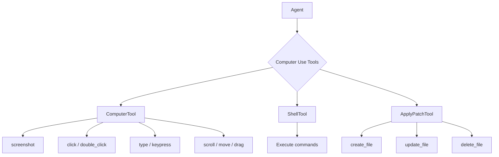

# Computer Use Capabilities

## Introduction

Agents can interact with real computers — clicking buttons, typing text, reading screens, and executing shell commands. The OpenAI Agents SDK provides **ComputerTool**, **ShellTool**, **LocalShellTool**, and **ApplyPatchTool** for these capabilities. This enables agents to automate desktop workflows, test applications, and make code edits.

> **Warning:** Computer use tools execute real actions on real systems. Always sandbox these tools in development and restrict access in production.

### What we'll cover

- ComputerTool: visual interaction (screenshots, clicks, typing)
- ShellTool and LocalShellTool: command execution
- ApplyPatchTool: file editing
- Implementing the Computer interface
- Safety considerations and sandboxing

### Prerequisites

- [Agent Class Fundamentals](./01-agent-class-fundamentals.md)
- [Tool Implementation Patterns](./03-tool-implementation-patterns.md)

---

## Computer tool overview



| Tool | Purpose | Interface required |
|------|---------|-------------------|
| **ComputerTool** | Visual interaction with a desktop | `Computer` or `AsyncComputer` |
| **ShellTool** | Run shell commands (custom executor) | Executor function |
| **LocalShellTool** | Run shell commands (local machine) | None (uses subprocess) |
| **ApplyPatchTool** | Create, edit, delete files | `ApplyPatchEditor` |

---

## ComputerTool

`ComputerTool` lets agents see and interact with a screen. We need to implement the `Computer` interface that defines how actions are executed:

### The Computer interface

```python
from agents.extensions.tools.computer import Computer

class MyComputer(Computer):
    """Custom computer implementation."""
    
    @property
    def environment(self) -> str:
        """Description of the computer environment."""
        return "Ubuntu 24.04 desktop, 1920x1080 resolution"
    
    @property
    def dimensions(self) -> tuple[int, int]:
        """Screen dimensions (width, height)."""
        return (1920, 1080)
    
    async def screenshot(self) -> bytes:
        """Take a screenshot and return as PNG bytes."""
        # Use pyautogui, Playwright, or any screen capture library
        import pyautogui
        screenshot = pyautogui.screenshot()
        import io
        buffer = io.BytesIO()
        screenshot.save(buffer, format="PNG")
        return buffer.getvalue()
    
    async def click(self, x: int, y: int, button: str = "left") -> None:
        """Click at coordinates."""
        import pyautogui
        pyautogui.click(x, y, button=button)
    
    async def double_click(self, x: int, y: int) -> None:
        """Double-click at coordinates."""
        import pyautogui
        pyautogui.doubleClick(x, y)
    
    async def type(self, text: str) -> None:
        """Type text."""
        import pyautogui
        pyautogui.typewrite(text, interval=0.05)
    
    async def keypress(self, keys: list[str]) -> None:
        """Press key combinations (e.g., ['ctrl', 'c'])."""
        import pyautogui
        pyautogui.hotkey(*keys)
    
    async def scroll(self, x: int, y: int, scroll_x: int, scroll_y: int) -> None:
        """Scroll at position."""
        import pyautogui
        pyautogui.scroll(scroll_y, x, y)
    
    async def move(self, x: int, y: int) -> None:
        """Move cursor to position."""
        import pyautogui
        pyautogui.moveTo(x, y)
    
    async def drag(self, start_x: int, start_y: int, end_x: int, end_y: int) -> None:
        """Drag from start to end position."""
        import pyautogui
        pyautogui.moveTo(start_x, start_y)
        pyautogui.drag(end_x - start_x, end_y - start_y)
    
    async def wait(self, ms: int = 1000) -> None:
        """Wait for specified milliseconds."""
        import asyncio
        await asyncio.sleep(ms / 1000)
```

### Using ComputerTool with an agent

```python
from agents import Agent, Runner
from agents.extensions.tools.computer import ComputerTool

computer = MyComputer()

agent = Agent(
    name="Desktop Agent",
    instructions="""You can see and interact with a computer screen.
    Use screenshots to understand what's on screen, then click, type, and navigate.
    Always take a screenshot before and after actions to verify results.""",
    tools=[ComputerTool(computer=computer)],
)

result = await Runner.run(agent, "Open the calculator app and compute 42 * 17")
print(result.final_output)
```

### Computer interface methods

| Method | Parameters | Purpose |
|--------|-----------|---------|
| `screenshot()` | — | Returns PNG bytes of current screen |
| `click(x, y, button)` | Coordinates, button type | Single click |
| `double_click(x, y)` | Coordinates | Double click |
| `type(text)` | Text string | Type text at cursor |
| `keypress(keys)` | List of keys | Key combination (e.g., Ctrl+C) |
| `scroll(x, y, sx, sy)` | Position, scroll amounts | Scroll at position |
| `move(x, y)` | Coordinates | Move cursor |
| `drag(sx, sy, ex, ey)` | Start/end coordinates | Click and drag |
| `wait(ms)` | Milliseconds | Pause execution |
| `environment` | — (property) | Environment description |
| `dimensions` | — (property) | Screen size `(width, height)` |

---

## ShellTool

`ShellTool` executes shell commands through a custom executor function:

```python
import subprocess
from agents import Agent, Runner
from agents.extensions.tools.computer import ShellTool

async def run_command(command: str) -> str:
    """Execute a shell command and return output."""
    try:
        result = subprocess.run(
            command,
            shell=True,
            capture_output=True,
            text=True,
            timeout=30,
        )
        output = result.stdout
        if result.returncode != 0:
            output += f"\nSTDERR: {result.stderr}"
        return output
    except subprocess.TimeoutExpired:
        return "Command timed out after 30 seconds."

agent = Agent(
    name="Shell Agent",
    instructions="Execute shell commands to help the user. Always explain what you're doing.",
    tools=[ShellTool(executor=run_command)],
)

result = Runner.run_sync(agent, "List the files in the current directory")
print(result.final_output)
```

**Output:**
```
Here are the files in the current directory:

- main.py
- requirements.txt
- README.md
```

### LocalShellTool

For convenience, `LocalShellTool` uses the local machine's shell without a custom executor:

```python
from agents.extensions.tools.computer import LocalShellTool

agent = Agent(
    name="Local Shell Agent",
    instructions="Help with system tasks using shell commands.",
    tools=[LocalShellTool()],
)
```

> **Warning:** `LocalShellTool` executes commands on the machine running your Python code. Never expose this to untrusted users. Use Docker or VM sandboxing for safety.

---

## ApplyPatchTool

`ApplyPatchTool` enables agents to create, edit, and delete files through a structured interface:

### The ApplyPatchEditor interface

```python
from agents.extensions.tools.computer import ApplyPatchTool, ApplyPatchEditor, ApplyPatchResult

class FileEditor(ApplyPatchEditor):
    """File editing implementation."""
    
    async def create_file(self, path: str, content: str) -> ApplyPatchResult:
        """Create a new file with content."""
        try:
            with open(path, "w") as f:
                f.write(content)
            return ApplyPatchResult(success=True, message=f"Created {path}")
        except Exception as e:
            return ApplyPatchResult(success=False, message=str(e))
    
    async def update_file(self, path: str, old_content: str, new_content: str) -> ApplyPatchResult:
        """Replace old_content with new_content in a file."""
        try:
            with open(path, "r") as f:
                current = f.read()
            
            if old_content not in current:
                return ApplyPatchResult(success=False, message="Old content not found")
            
            updated = current.replace(old_content, new_content, 1)
            with open(path, "w") as f:
                f.write(updated)
            
            return ApplyPatchResult(success=True, message=f"Updated {path}")
        except Exception as e:
            return ApplyPatchResult(success=False, message=str(e))
    
    async def delete_file(self, path: str) -> ApplyPatchResult:
        """Delete a file."""
        try:
            import os
            os.remove(path)
            return ApplyPatchResult(success=True, message=f"Deleted {path}")
        except Exception as e:
            return ApplyPatchResult(success=False, message=str(e))
```

### Using ApplyPatchTool

```python
from agents import Agent, Runner
from agents.extensions.tools.computer import ApplyPatchTool

editor = FileEditor()

agent = Agent(
    name="Code Editor Agent",
    instructions="""You can create, edit, and delete files.
    When editing, specify the exact text to replace.""",
    tools=[ApplyPatchTool(editor=editor)],
)

result = Runner.run_sync(
    agent,
    "Create a file called hello.py with a function that prints 'Hello, World!'"
)
print(result.final_output)
```

---

## Combining tools

The real power comes from combining computer use tools:

```python
from agents import Agent
from agents.extensions.tools.computer import ComputerTool, ShellTool, ApplyPatchTool

agent = Agent(
    name="Full Stack Agent",
    instructions="""You have full computer access:
    - Use ComputerTool to see the screen and interact with GUIs
    - Use ShellTool to run terminal commands
    - Use ApplyPatchTool to create and edit code files
    
    Always verify your actions by checking the results.""",
    tools=[
        ComputerTool(computer=MyComputer()),
        ShellTool(executor=run_command),
        ApplyPatchTool(editor=FileEditor()),
    ],
)
```

---

## Safety considerations

| Risk | Mitigation |
|------|------------|
| **Destructive commands** | Sandbox in Docker containers or VMs |
| **Data exfiltration** | Restrict network access in the sandbox |
| **Infinite loops** | Set `max_turns` in `RunConfig` and command timeouts |
| **Credential exposure** | Don't run on machines with sensitive credentials |
| **File system damage** | Restrict write permissions to specific directories |

### Sandboxing pattern

```python
import subprocess

async def sandboxed_executor(command: str) -> str:
    """Execute commands inside a Docker container."""
    docker_cmd = f'docker exec my-sandbox bash -c "{command}"'
    result = subprocess.run(
        docker_cmd,
        shell=True,
        capture_output=True,
        text=True,
        timeout=30,
    )
    return result.stdout + (f"\nError: {result.stderr}" if result.stderr else "")

# Use the sandboxed executor
agent = Agent(
    name="Safe Agent",
    tools=[ShellTool(executor=sandboxed_executor)],
    instructions="Execute commands safely in the sandbox.",
)
```

---

## Best practices

| Practice | Why it matters |
|----------|----------------|
| Always sandbox computer use tools | Prevents accidental damage to the host system |
| Set command timeouts | Prevents hanging commands from blocking the agent |
| Use `AsyncComputer` for production | Non-blocking operations for better performance |
| Take screenshots before and after actions | Verifies the agent sees what it expects |
| Restrict file paths in ApplyPatchTool | Prevent writing to system directories |
| Log all executed commands | Audit trail for debugging and security |

---

## Common pitfalls

| ❌ Mistake | ✅ Solution |
|-----------|-------------|
| Running `LocalShellTool` without sandboxing | Use Docker, VM, or restrict to safe commands |
| Not setting command timeouts | Always pass `timeout` to `subprocess.run()` |
| Assuming screenshots are instant | Add `wait()` after actions before taking screenshots |
| Not handling `ApplyPatchResult.success=False` | Check the result and report errors to the agent |
| Giving agents `sudo` access | Never — restrict to unprivileged user in sandbox |

---

## Hands-on exercise

### Your task

Build a **code scaffolding agent** that uses `ApplyPatchTool` and `ShellTool` to create a project.

### Requirements

1. Implement an `ApplyPatchEditor` that creates and edits files in a `./sandbox/` directory
2. Create a `ShellTool` with a sandboxed executor (restrict to `ls`, `cat`, `mkdir` commands)
3. Build an agent that can: create project files, view them, and list the directory
4. Ask the agent to create a simple Python project with `main.py` and `requirements.txt`
5. Verify the files were created correctly

### Expected result

The agent creates the files and confirms their contents by listing and reading them.

<details>
<summary>💡 Hints (click to expand)</summary>

- Restrict the executor: `if not any(cmd.startswith(safe) for safe in ["ls", "cat", "mkdir"]):`
- Use `os.path.join("./sandbox", path)` to enforce directory restrictions
- The agent should create `main.py` with a simple print statement and `requirements.txt` with dependencies

</details>

<details>
<summary>✅ Solution (click to expand)</summary>

```python
import os
import subprocess
from agents import Agent, Runner
from agents.extensions.tools.computer import ShellTool, ApplyPatchTool, ApplyPatchEditor, ApplyPatchResult

SANDBOX_DIR = "./sandbox"
os.makedirs(SANDBOX_DIR, exist_ok=True)

class SandboxEditor(ApplyPatchEditor):
    async def create_file(self, path, content):
        full_path = os.path.join(SANDBOX_DIR, path)
        os.makedirs(os.path.dirname(full_path), exist_ok=True)
        try:
            with open(full_path, "w") as f:
                f.write(content)
            return ApplyPatchResult(success=True, message=f"Created {path}")
        except Exception as e:
            return ApplyPatchResult(success=False, message=str(e))
    
    async def update_file(self, path, old_content, new_content):
        full_path = os.path.join(SANDBOX_DIR, path)
        try:
            with open(full_path, "r") as f:
                current = f.read()
            updated = current.replace(old_content, new_content, 1)
            with open(full_path, "w") as f:
                f.write(updated)
            return ApplyPatchResult(success=True, message=f"Updated {path}")
        except Exception as e:
            return ApplyPatchResult(success=False, message=str(e))
    
    async def delete_file(self, path):
        full_path = os.path.join(SANDBOX_DIR, path)
        try:
            os.remove(full_path)
            return ApplyPatchResult(success=True, message=f"Deleted {path}")
        except Exception as e:
            return ApplyPatchResult(success=False, message=str(e))

SAFE_COMMANDS = ["ls", "cat", "mkdir", "pwd"]

async def safe_executor(command: str) -> str:
    cmd_name = command.strip().split()[0]
    if cmd_name not in SAFE_COMMANDS:
        return f"Command '{cmd_name}' is not allowed. Safe commands: {SAFE_COMMANDS}"
    
    result = subprocess.run(
        command, shell=True, capture_output=True, text=True,
        timeout=10, cwd=SANDBOX_DIR,
    )
    return result.stdout or result.stderr or "Command completed (no output)."

agent = Agent(
    name="Scaffolder",
    instructions=f"""You create project files in the sandbox directory.
    Use ApplyPatchTool to create files and ShellTool to verify them.
    All shell commands run inside {SANDBOX_DIR}.""",
    tools=[
        ApplyPatchTool(editor=SandboxEditor()),
        ShellTool(executor=safe_executor),
    ],
)

result = Runner.run_sync(
    agent,
    "Create a Python project with main.py (a hello world script) and "
    "requirements.txt (with requests and flask). Then list the files to verify."
)
print(result.final_output)
```

</details>

### Bonus challenges

- [ ] Add `ComputerTool` with a Playwright-based browser `Computer` implementation
- [ ] Implement a `GitEditor` that uses git commits for each file change
- [ ] Add a guardrail that blocks destructive shell commands (`rm -rf`, `dd`, etc.)

---

## Summary

✅ `ComputerTool` enables visual interaction through the `Computer`/`AsyncComputer` interface (screenshots, clicks, typing)

✅ `ShellTool` runs commands through a custom executor; `LocalShellTool` uses the local shell directly

✅ `ApplyPatchTool` creates, edits, and deletes files through the `ApplyPatchEditor` interface

✅ Always sandbox computer use tools — Docker containers or VMs prevent accidental damage

✅ Combine tools for full-stack automation: visual GUI + terminal + file editing

**Next:** [LangGraph Agent Orchestration](../12-langgraph-agent-orchestration/00-langgraph-agent-orchestration.md)

---

## Further reading

- [Computer tool reference](https://openai.github.io/openai-agents-python/ref/extensions/tools/computer/) — Computer interface API
- [OpenAI Computer Use guide](https://platform.openai.com/docs/guides/tools/computer-use) — Computer use concepts
- [Agent tools overview](https://openai.github.io/openai-agents-python/tools/) — All tool types

---

*[Back to OpenAI Agents SDK Overview](./00-openai-agents-sdk.md)*

<!-- 
Sources Consulted:
- Computer tool reference: https://openai.github.io/openai-agents-python/ref/extensions/tools/computer/
- OpenAI computer use: https://platform.openai.com/docs/guides/tools/computer-use
- Tools overview: https://openai.github.io/openai-agents-python/tools/
-->
