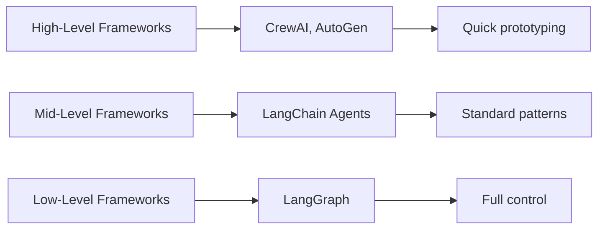
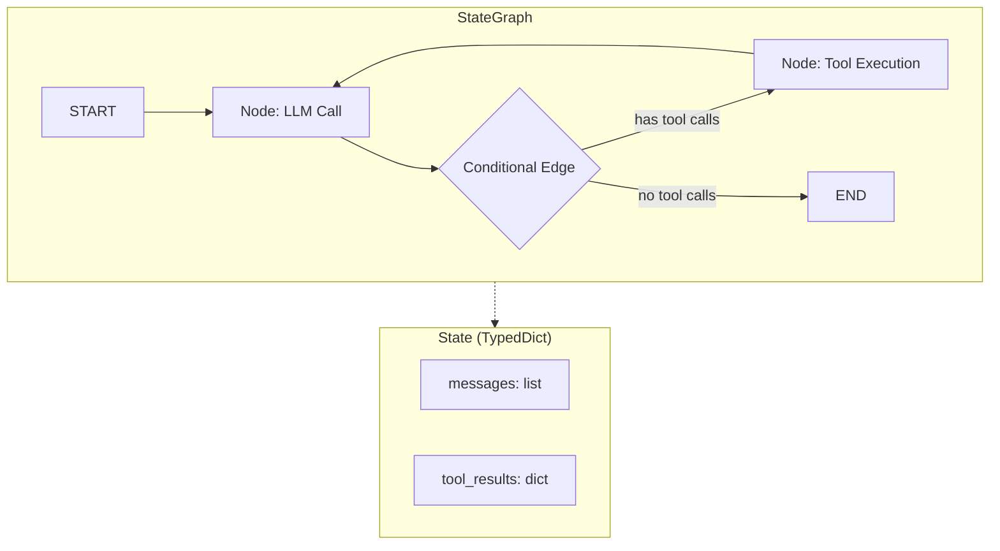

# LangGraph Agent Orchestration

## Overview

LangGraph is a low-level orchestration framework from LangChain for building stateful, multi-step agent workflows as directed graphs. Unlike higher-level frameworks that abstract away control flow, LangGraph gives you explicit control over every node, edge, and state transition in your agent system. This lesson explores the complete LangGraph ecosystem — from core graph construction to production deployment.

> **🤖 AI Context:** LangGraph is inspired by Google's Pregel system and Apache Beam. It models agent workflows as graphs where nodes represent computation steps and edges define the flow between them. This graph-based approach makes complex agent behaviors explicit, debuggable, and reproducible.

### What We'll Cover

This lesson is organized into the following sub-lessons:

| # | Topic | Description |
|---|-------|-------------|
| 01 | [Core Concepts](./01-core-concepts.md) | StateGraph, nodes, edges, conditional routing, TypedDict schemas |
| 02 | [Graph Construction Patterns](./02-graph-construction-patterns.md) | Building graphs with `add_node()`, `add_edge()`, `Command`, `Send` |
| 03 | [State Management](./03-state-management.md) | Annotated reducers, `MessagesState`, custom schemas, state persistence |
| 04 | [Prebuilt Agents](./04-prebuilt-agents.md) | `create_react_agent()`, `ToolNode`, ReAct loop implementation |
| 05 | [Checkpointing and Memory](./05-checkpointing-and-memory.md) | `MemorySaver`, `SqliteSaver`, `PostgresSaver`, threads, memory store |
| 06 | [Human-in-the-Loop Patterns](./06-human-in-the-loop-patterns.md) | `interrupt()`, `Command(resume=)`, approval workflows, input validation |
| 07 | [Streaming in LangGraph](./07-streaming-in-langgraph.md) | Stream modes, LLM token streaming, custom data, subgraph streaming |
| 08 | [Subgraphs and Composition](./08-subgraphs-and-composition.md) | Nested graphs, graph as node, modular agent design |
| 09 | [Durable Execution](./09-durable-execution.md) | Fault tolerance, durability modes, determinism, resumable workflows |
| 10 | [Platform and Deployment](./10-platform-and-deployment.md) | LangSmith Cloud, application structure, `langgraph.json`, API testing |

### Prerequisites

Before starting this lesson, you should be familiar with:

- Python fundamentals (functions, classes, type hints)
- Async programming basics (`async`/`await`)
- LLM API concepts (from [Unit 4: AI API Integration](../../04-ai-api-integration/00-overview.md))
- Basic agent concepts (from [Introduction to AI Agents](../01-introduction-to-artificial-intelligence/00-introduction-to-artificial-intelligence.md))

### Installation

```bash
pip install -U langgraph langchain-core langchain-anthropic
```

> **Note:** LangGraph works with any LangChain-compatible LLM provider. We use Anthropic in examples, but you can substitute OpenAI, Google, or others.

---

## Why LangGraph?

LangGraph fills a specific niche in the agent framework landscape:



| Feature | LangGraph | Higher-Level Frameworks |
|---------|-----------|------------------------|
| Control over execution flow | Full (node-by-node) | Limited (abstracted) |
| State management | Explicit (TypedDict/Pydantic) | Implicit |
| Human-in-the-loop | Built-in (`interrupt()`) | Varies |
| Persistence | First-class (checkpointers) | Add-on |
| Streaming | Multi-mode support | Basic |
| Debugging | Graph visualization + LangSmith | Varies |
| Learning curve | Steeper | Gentler |

### When to Choose LangGraph

✅ **Use LangGraph when you need:**
- Fine-grained control over agent execution flow
- Complex state management with custom reducers
- Production-grade persistence and fault tolerance
- Human-in-the-loop workflows with approval gates
- Multi-agent systems with explicit communication patterns

❌ **Consider alternatives when you need:**
- Rapid prototyping without custom graph logic
- Simple single-agent, single-tool setups
- Minimal code for standard ReAct patterns

---

## Key Concepts at a Glance

LangGraph organizes agent logic around three core primitives:



| Primitive | What It Is | Example |
|-----------|-----------|---------|
| **State** | Shared data structure passed between nodes | `TypedDict` with `messages`, custom fields |
| **Node** | A function that reads and updates state | LLM calls, tool execution, data processing |
| **Edge** | Connection defining flow between nodes | Normal edges, conditional edges, `Send` |

---

## Learning Path

We recommend working through the sub-lessons in order:

1. **Start with fundamentals** (01–03): Understand core concepts, graph construction, and state management
2. **Learn prebuilt shortcuts** (04): Use `create_react_agent()` for common patterns
3. **Add persistence** (05–06): Enable memory, checkpointing, and human-in-the-loop
4. **Master advanced features** (07–09): Streaming, subgraphs, and fault tolerance
5. **Deploy to production** (10): Platform deployment and monitoring

---

## Summary

✅ LangGraph models agent workflows as directed graphs with explicit state management

✅ Nodes are functions, edges define flow, and state is a shared TypedDict

✅ Built-in support for persistence, streaming, human-in-the-loop, and fault tolerance

✅ Ideal for production agents requiring fine-grained control and debugging

✅ Part of the LangChain ecosystem with LangSmith integration for monitoring

**Next:** [Core Concepts](./01-core-concepts.md)

---

## Further Reading

- [LangGraph Documentation](https://docs.langchain.com/oss/python/langgraph/overview) — Official docs and API reference
- [LangGraph Workflows and Agents](https://docs.langchain.com/oss/python/langgraph/workflows-agents) — Common patterns guide
- [LangSmith](https://smith.langchain.com/) — Monitoring and debugging platform

*Back to [AI Agents Overview](../00-overview.md)*
