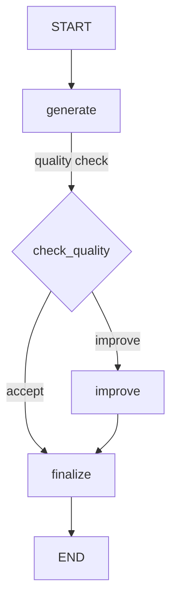

# Core Concepts

## Introduction

Every LangGraph application is built on three primitives: **state**, **nodes**, and **edges**. Understanding how these pieces fit together is the foundation for building any agent workflow — from simple chains to complex multi-agent systems.

In this lesson, we explore the core building blocks that make LangGraph tick: `StateGraph` for defining workflows, nodes as computation steps, edges for controlling flow, and state schemas for managing data.

### What We'll Cover

- The `StateGraph` class and how it organizes agent logic
- Nodes as Python functions that read and update state
- Edges for connecting nodes (normal, conditional, and entry point)
- State schemas using `TypedDict`, dataclasses, and Pydantic
- `START` and `END` sentinel nodes for graph boundaries

### Prerequisites

- Python type hints (`TypedDict`, `Annotated`, `Literal`)
- Basic understanding of directed graphs (nodes + edges)
- LangGraph installed (`pip install -U langgraph`)

---

## StateGraph: The Foundation

A `StateGraph` is a parameterized container that holds your workflow's nodes, edges, and state definition. You create one by passing a state schema, then build up the graph by adding nodes and edges before compiling it into a runnable.

```python
from langgraph.graph import StateGraph, START, END
from typing_extensions import TypedDict

# 1. Define the state schema
class MyState(TypedDict):
    topic: str
    result: str

# 2. Create the graph builder
builder = StateGraph(MyState)

# 3. Add nodes and edges (covered below)
# ...

# 4. Compile into a runnable graph
graph = builder.compile()
```

**Output:**
```
<langgraph.graph.state.CompiledStateGraph object>
```

The `StateGraph` acts as a **builder** — you configure it step by step, then call `.compile()` to produce an immutable, executable graph. Once compiled, the graph can be invoked, streamed, or deployed.

> **🔑 Key concept:** The state schema defines what data flows through your graph. Every node receives the current state and returns updates to it. The schema acts as the contract between all nodes in your graph.

---

## Nodes: Computation Steps

Nodes are Python functions that perform the actual work in your graph. Each node receives the current state, does some computation, and returns a dictionary of state updates.

### Defining a Node

A node is any callable that accepts the state and returns a partial state update:

```python
from typing_extensions import TypedDict
from langgraph.graph import StateGraph, START, END


class State(TypedDict):
    topic: str
    joke: str


def generate_joke(state: State) -> dict:
    """Node that creates a joke about the given topic."""
    # In a real app, this would call an LLM
    return {"joke": f"Why did the {state['topic']} cross the road? To get to the other side!"}


# Build the graph
builder = StateGraph(State)
builder.add_node("generate_joke", generate_joke)
builder.add_edge(START, "generate_joke")
builder.add_edge("generate_joke", END)

graph = builder.compile()

# Run it
result = graph.invoke({"topic": "chicken"})
print(result)
```

**Output:**
```
{'topic': 'chicken', 'joke': 'Why did the chicken cross the road? To get to the other side!'}
```

### Node Naming

When you call `add_node()`, the first argument is the node's name (a string used to reference it in edges). If you omit the name, LangGraph uses the function name:

```python
# Explicit name
builder.add_node("my_node", my_function)

# Implicit name (uses function.__name__)
builder.add_node(my_function)  # name becomes "my_function"
```

### Nodes with LLM Calls

In practice, most nodes call an LLM. Here is a node that uses a LangChain chat model:

```python
from langchain_anthropic import ChatAnthropic
from langgraph.graph import StateGraph, START, END, MessagesState

model = ChatAnthropic(model="claude-sonnet-4-5-20250929")

def call_model(state: MessagesState):
    """Node that calls an LLM with the current messages."""
    response = model.invoke(state["messages"])
    return {"messages": [response]}

builder = StateGraph(MessagesState)
builder.add_node("call_model", call_model)
builder.add_edge(START, "call_model")
builder.add_edge("call_model", END)

graph = builder.compile()
```

**Output:**
```
{'messages': [HumanMessage(content='Hello'), AIMessage(content='Hello! How can I help you today?')]}
```

> **Note:** Nodes return **partial** state updates, not the complete state. LangGraph merges the returned dict into the existing state using the configured reducers (covered in the State Management lesson).

---

## START and END Nodes

LangGraph provides two special sentinel nodes:

| Node | Purpose | Usage |
|------|---------|-------|
| `START` | Entry point — where execution begins | `builder.add_edge(START, "first_node")` |
| `END` | Exit point — where execution terminates | `builder.add_edge("last_node", END)` |

Every graph must have at least one edge from `START` and at least one path to `END`:

```python
from langgraph.graph import StateGraph, START, END

builder = StateGraph(State)
builder.add_node("step_1", step_1_fn)
builder.add_node("step_2", step_2_fn)

# START → step_1 → step_2 → END
builder.add_edge(START, "step_1")
builder.add_edge("step_1", "step_2")
builder.add_edge("step_2", END)
```

> **Warning:** If no path from `START` to `END` exists, the graph will raise a validation error at compile time.

---

## Edges: Controlling Flow

Edges define how execution moves between nodes. LangGraph supports three types of edges:

### Normal Edges

A normal edge creates a fixed, unconditional connection from one node to another:

```python
# After "node_a" completes, always go to "node_b"
builder.add_edge("node_a", "node_b")
```

You can also create **fan-out** by adding multiple edges from `START` to run nodes in parallel:

```python
# Run three nodes in parallel
builder.add_edge(START, "node_a")
builder.add_edge(START, "node_b")
builder.add_edge(START, "node_c")

# Fan back in
builder.add_edge("node_a", "aggregator")
builder.add_edge("node_b", "aggregator")
builder.add_edge("node_c", "aggregator")
```

### Conditional Edges

Conditional edges route execution based on the current state. You provide a **routing function** that returns the name of the next node:

```python
from typing import Literal
from langgraph.graph import StateGraph, START, END

class State(TypedDict):
    input: str
    category: str
    result: str

def classify(state: State):
    """Classify the input."""
    # Simplified classification logic
    if "price" in state["input"].lower():
        return {"category": "pricing"}
    return {"category": "general"}

def handle_pricing(state: State):
    return {"result": "Here are our pricing details..."}

def handle_general(state: State):
    return {"result": "Here is some general information..."}

# Routing function — returns the next node name
def route_by_category(state: State) -> Literal["handle_pricing", "handle_general"]:
    if state["category"] == "pricing":
        return "handle_pricing"
    return "handle_general"

builder = StateGraph(State)
builder.add_node("classify", classify)
builder.add_node("handle_pricing", handle_pricing)
builder.add_node("handle_general", handle_general)

builder.add_edge(START, "classify")
builder.add_conditional_edges("classify", route_by_category)
builder.add_edge("handle_pricing", END)
builder.add_edge("handle_general", END)

graph = builder.compile()

result = graph.invoke({"input": "What is the price?"})
print(result["result"])
```

**Output:**
```
Here are our pricing details...
```

The routing function must return a string matching a node name (or `END`). Using `Literal` type hints helps LangGraph validate the graph at compile time.

### Conditional Entry Points

You can also add conditional edges from `START` to route based on the initial input:

```python
builder.add_conditional_edges(START, route_function)
```

This replaces the fixed `add_edge(START, "node")` with dynamic routing from the very beginning.

---

## State Schemas

The state schema defines the shape of data flowing through your graph. LangGraph supports three schema types:

### TypedDict (Most Common)

```python
from typing_extensions import TypedDict

class AgentState(TypedDict):
    messages: list       # Chat messages
    tool_results: dict   # Results from tool calls
    iteration: int       # Loop counter
```

### Dataclass

```python
from dataclasses import dataclass

@dataclass
class AgentState:
    messages: list
    tool_results: dict = None
    iteration: int = 0
```

### Pydantic Model

```python
from pydantic import BaseModel, Field

class AgentState(BaseModel):
    messages: list = Field(default_factory=list)
    tool_results: dict = Field(default_factory=dict)
    iteration: int = 0
```

> **💡 Tip:** Use `TypedDict` for simple schemas, `dataclass` when you need default values and methods, and `Pydantic` when you need validation. `TypedDict` is the most common choice in LangGraph examples.

---

## Putting It All Together

Here is a complete example that combines all the core concepts into a simple agent loop:

```python
from typing import Literal
from typing_extensions import TypedDict
from langgraph.graph import StateGraph, START, END


class State(TypedDict):
    topic: str
    joke: str
    improved_joke: str
    final_joke: str


def generate_joke(state: State):
    """Generate an initial joke."""
    return {"joke": f"Why did the {state['topic']} go to school? To get a little brighter!"}


def check_quality(state: State) -> Literal["improve", "accept"]:
    """Route based on joke quality (simplified check)."""
    if "?" in state["joke"] and "!" in state["joke"]:
        return "accept"
    return "improve"


def improve_joke(state: State):
    """Improve the joke with wordplay."""
    return {"improved_joke": f"{state['joke']} (Get it? Because it's a bright idea!)"}


def finalize(state: State):
    """Polish the final output."""
    source = state.get("improved_joke", state["joke"])
    return {"final_joke": f"🎭 {source}"}


# Build the graph
builder = StateGraph(State)

# Add nodes
builder.add_node("generate", generate_joke)
builder.add_node("improve", improve_joke)
builder.add_node("finalize", finalize)

# Add edges
builder.add_edge(START, "generate")
builder.add_conditional_edges("generate", check_quality)
builder.add_edge("improve", "finalize")
builder.add_edge("accept", "finalize")  # Direct path when quality is good
builder.add_edge("finalize", END)

graph = builder.compile()

# Visualize (in Jupyter, this would render a diagram)
print(graph.get_graph().draw_ascii())

# Run the graph
result = graph.invoke({"topic": "lightbulb"})
print(result["final_joke"])
```

**Output:**
```
🎭 Why did the lightbulb go to school? To get a little brighter! (Get it? Because it's a bright idea!)
```



---

## Best Practices

| Practice | Why It Matters |
|----------|----------------|
| Keep nodes small and focused | Each node should do one thing well — easier to debug and test |
| Use descriptive node names | Names appear in traces and visualizations — clarity saves time |
| Type-hint your routing functions | `Literal` return types enable compile-time graph validation |
| Define state schemas explicitly | Prevents runtime key errors and documents the data contract |
| Compile once, invoke many times | The compiled graph is immutable and thread-safe |

---

## Common Pitfalls

| ❌ Mistake | ✅ Solution |
|-----------|-------------|
| Returning full state from a node | Return only the keys you want to update — LangGraph merges them |
| Forgetting the `START` edge | Every graph needs `add_edge(START, "first_node")` |
| Using mutable defaults in state | Use `TypedDict` or `Field(default_factory=list)` for mutable types |
| Not compiling before invoking | Always call `builder.compile()` before `graph.invoke()` |
| Circular edges without an exit condition | Ensure at least one path leads to `END` to avoid infinite loops |

---

## Hands-on Exercise

### Your Task

Build a LangGraph workflow that classifies text into categories and processes each category differently.

### Requirements

1. Define a `State` with fields: `text`, `category`, `result`
2. Create a `classify` node that categorizes text as "question", "statement", or "command"
3. Create three handler nodes — one for each category
4. Use conditional edges to route from `classify` to the correct handler
5. All handlers should connect to `END`

### Expected Result

```python
result = graph.invoke({"text": "What is the weather today?"})
# result["category"] == "question"
# result["result"] contains a response appropriate for questions
```

<details>
<summary>💡 Hints (click to expand)</summary>

- Use `TypedDict` for your state schema
- The routing function should return a `Literal["handle_question", "handle_statement", "handle_command"]`
- Don't forget `add_edge(START, "classify")`

</details>

<details>
<summary>✅ Solution (click to expand)</summary>

```python
from typing import Literal
from typing_extensions import TypedDict
from langgraph.graph import StateGraph, START, END


class State(TypedDict):
    text: str
    category: str
    result: str


def classify(state: State):
    text = state["text"].strip().lower()
    if text.endswith("?"):
        return {"category": "question"}
    elif text.startswith(("please", "do", "run", "stop", "create")):
        return {"category": "command"}
    return {"category": "statement"}


def handle_question(state: State):
    return {"result": f"That's a great question: '{state['text']}'"}


def handle_statement(state: State):
    return {"result": f"Interesting point: '{state['text']}'"}


def handle_command(state: State):
    return {"result": f"Processing command: '{state['text']}'"}


def route(state: State) -> Literal["handle_question", "handle_statement", "handle_command"]:
    return f"handle_{state['category']}"


builder = StateGraph(State)
builder.add_node("classify", classify)
builder.add_node("handle_question", handle_question)
builder.add_node("handle_statement", handle_statement)
builder.add_node("handle_command", handle_command)

builder.add_edge(START, "classify")
builder.add_conditional_edges("classify", route)
builder.add_edge("handle_question", END)
builder.add_edge("handle_statement", END)
builder.add_edge("handle_command", END)

graph = builder.compile()

# Test
result = graph.invoke({"text": "What is the weather today?"})
print(result)
```

**Output:**
```
{'text': 'What is the weather today?', 'category': 'question', 'result': "That's a great question: 'What is the weather today?'"}
```

</details>

### Bonus Challenges

- [ ] Add a `validate` node between `START` and `classify` that checks for empty input
- [ ] Visualize your graph using `graph.get_graph().draw_ascii()`
- [ ] Add a `log` node after each handler that records the category and result

---

## Summary

✅ `StateGraph` is the builder for defining agent workflows as directed graphs

✅ Nodes are Python functions that receive state and return partial updates

✅ Edges control flow — normal edges for fixed paths, conditional edges for dynamic routing

✅ State schemas (`TypedDict`, dataclass, Pydantic) define the shared data contract

✅ `START` and `END` mark the graph's entry and exit points

**Next:** [Graph Construction Patterns](./02-graph-construction-patterns.md)

---

## Further Reading

- [LangGraph Graph API](https://docs.langchain.com/oss/python/langgraph/graph-api) — Comprehensive API reference for StateGraph, nodes, and edges
- [LangGraph Workflows and Agents](https://docs.langchain.com/oss/python/langgraph/workflows-agents) — Common workflow patterns
- [Python TypedDict](https://docs.python.org/3/library/typing.html#typing.TypedDict) — Official Python docs on TypedDict

*Back to [LangGraph Agent Orchestration](./00-langgraph-agent-orchestration.md)*

<!-- 
Sources Consulted:
- LangGraph Graph API: https://docs.langchain.com/oss/python/langgraph/graph-api
- LangGraph Overview: https://docs.langchain.com/oss/python/langgraph/overview
- LangGraph Workflows and Agents: https://docs.langchain.com/oss/python/langgraph/workflows-agents
-->
