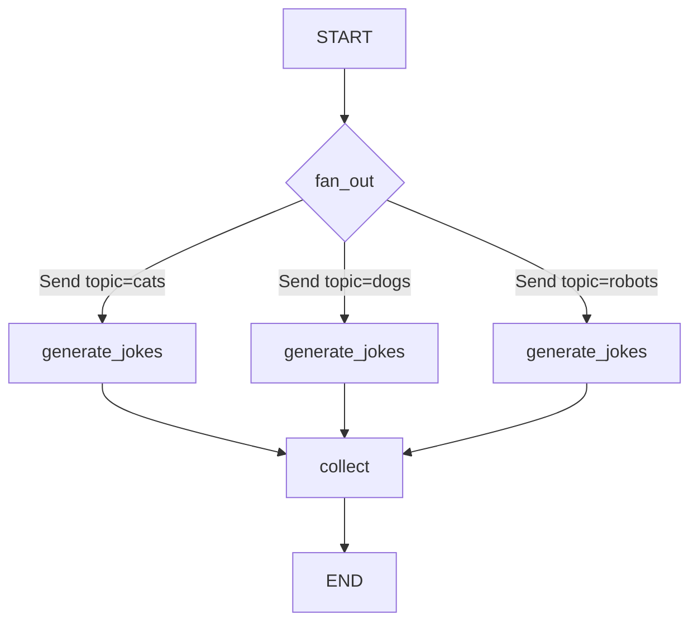

# Graph Construction Patterns

## Introduction

Knowing the core concepts is one thing — building real graphs is another. LangGraph provides a rich set of construction methods that go beyond simple linear chains. With `Command` for combined routing and state updates, `Send` for dynamic fan-out, and method chaining for concise definitions, you can express sophisticated agent workflows in clean, readable Python.

This lesson covers the practical patterns for constructing graphs — from the basic builder methods to advanced techniques like map-reduce parallelism and command-based routing.

### What We'll Cover

- The graph builder API: `add_node()`, `add_edge()`, `add_conditional_edges()`
- Compilation and the compiled graph object
- `Command` for combining state updates with routing decisions
- `Send` for dynamic map-reduce workflows
- Method chaining for concise graph definitions
- Graph visualization techniques

### Prerequisites

- Completed [Core Concepts](./01-core-concepts.md) lesson
- Understanding of `StateGraph`, nodes, edges, and state schemas

---

## The Builder API

### Adding Nodes

The `add_node()` method registers a function as a computation step:

```python
from langgraph.graph import StateGraph, START, END
from typing_extensions import TypedDict


class State(TypedDict):
    value: str


def process(state: State):
    return {"value": state["value"].upper()}


builder = StateGraph(State)

# Option 1: Explicit name
builder.add_node("process", process)

# Option 2: Function name used automatically
builder.add_node(process)  # name becomes "process"
```

> **Note:** Node names must be unique within a graph. If two functions share the same `__name__`, use explicit naming to avoid conflicts.

### Adding Edges

Normal edges create fixed connections:

```python
builder.add_edge(START, "step_1")
builder.add_edge("step_1", "step_2")
builder.add_edge("step_2", END)
```

### Adding Conditional Edges

Conditional edges use a routing function to determine the next node dynamically:

```python
from typing import Literal


def route(state: State) -> Literal["node_a", "node_b"]:
    if state["value"] == "go_a":
        return "node_a"
    return "node_b"


# Option 1: Automatic detection from type hints
builder.add_conditional_edges("router", route)

# Option 2: Explicit mapping
builder.add_conditional_edges(
    "router",
    route,
    {"node_a": "node_a", "node_b": "node_b"}
)
```

The explicit mapping is useful when the routing function's return values don't directly match node names:

```python
def route(state: State) -> Literal["yes", "no"]:
    return "yes" if state["approved"] else "no"

builder.add_conditional_edges(
    "check",
    route,
    {"yes": "proceed", "no": "reject"}  # Map return values to node names
)
```

---

## Compilation

Calling `.compile()` converts the builder into an immutable, executable graph:

```python
# Basic compilation
graph = builder.compile()

# Compilation with a checkpointer (enables persistence)
from langgraph.checkpoint.memory import MemorySaver
graph = builder.compile(checkpointer=MemorySaver())

# Compilation with static interrupt points (for debugging)
graph = builder.compile(
    checkpointer=MemorySaver(),
    interrupt_before=["critical_node"],
    interrupt_after=["review_node"]
)
```

Once compiled, the graph exposes several execution methods:

| Method | Description |
|--------|-------------|
| `graph.invoke(input)` | Run the graph synchronously and return the final state |
| `graph.stream(input)` | Stream results as an iterator (node updates, values, etc.) |
| `graph.ainvoke(input)` | Async version of `invoke` |
| `graph.astream(input)` | Async version of `stream` |
| `graph.get_graph()` | Get the graph structure for visualization |

```python
# Synchronous invocation
result = graph.invoke({"value": "hello"})
print(result)
```

**Output:**
```
{'value': 'HELLO'}
```

> **Warning:** You must compile a graph before invoking it. Calling `builder.invoke()` directly will raise an error.

---

## Method Chaining

LangGraph supports method chaining for concise graph construction:

```python
from langgraph.graph import StateGraph, START, END
from typing_extensions import TypedDict


class State(TypedDict):
    topic: str
    joke: str


def refine_topic(state: State):
    return {"topic": state["topic"] + " and cats"}


def generate_joke(state: State):
    return {"joke": f"This is a joke about {state['topic']}"}


# Chained construction — clean and readable
graph = (
    StateGraph(State)
    .add_node(refine_topic)
    .add_node(generate_joke)
    .add_edge(START, "refine_topic")
    .add_edge("refine_topic", "generate_joke")
    .add_edge("generate_joke", END)
    .compile()
)

result = graph.invoke({"topic": "dogs"})
print(result)
```

**Output:**
```
{'topic': 'dogs and cats', 'joke': 'This is a joke about dogs and cats'}
```

> **💡 Tip:** Method chaining works because each builder method returns `self`. This is especially clean for simple graphs, but for complex ones with many conditionals, separate statements may be more readable.

---

## Command: Routing + State Updates

The `Command` class lets a node combine state updates with routing decisions in a single return value. Instead of using separate conditional edges, the node itself decides where to go next.

### Basic Command Usage

```python
from typing import Literal
from typing_extensions import TypedDict
from langgraph.graph import StateGraph, START, END
from langgraph.types import Command


class State(TypedDict):
    input: str
    result: str
    status: str


def process_input(state: State) -> Command[Literal["success_handler", "error_handler"]]:
    """Process input and route based on the result."""
    if len(state["input"]) > 0:
        return Command(
            update={"status": "valid", "result": f"Processed: {state['input']}"},
            goto="success_handler"
        )
    else:
        return Command(
            update={"status": "invalid"},
            goto="error_handler"
        )


def success_handler(state: State):
    return {"result": f"✅ {state['result']}"}


def error_handler(state: State):
    return {"result": "❌ Empty input received"}


builder = StateGraph(State)
builder.add_node("process", process_input)
builder.add_node("success_handler", success_handler)
builder.add_node("error_handler", error_handler)

builder.add_edge(START, "process")
builder.add_edge("success_handler", END)
builder.add_edge("error_handler", END)

graph = builder.compile()

result = graph.invoke({"input": "Hello world"})
print(result["result"])
```

**Output:**
```
✅ Processed: Hello world
```

### Command vs Conditional Edges

| Feature | Conditional Edges | Command |
|---------|------------------|---------|
| Where routing lives | Separate function + `add_conditional_edges()` | Inside the node function |
| State updates | Node returns dict, routing is separate | Combined in single `Command` return |
| Use case | Routing based on state inspection | Routing decided during computation |
| Readability | Better when routing logic is independent | Better when routing depends on computation |

> **🔑 Key concept:** `Command` eliminates the need for a separate routing function when the node itself knows the next step. Use it when the routing decision is tightly coupled to the node's computation.

### Navigating to Parent Graphs

When working with subgraphs, `Command` can route to the parent graph:

```python
from langgraph.types import Command

def subgraph_node(state: State):
    return Command(
        update={"result": "done"},
        goto="parent_node",
        graph=Command.PARENT  # Navigate to parent graph
    )
```

---

## Send: Dynamic Fan-Out (Map-Reduce)

The `Send` class enables dynamic parallelism — creating multiple instances of a node at runtime, each with its own input. This is the map-reduce pattern in LangGraph.

### How Send Works

```python
from typing import Annotated
import operator
from typing_extensions import TypedDict
from langgraph.graph import StateGraph, START, END
from langgraph.types import Send


class State(TypedDict):
    topics: list[str]
    jokes: Annotated[list[str], operator.add]  # Reducer: append results


class WorkerState(TypedDict):
    topic: str
    jokes: Annotated[list[str], operator.add]


def generate_jokes(state: WorkerState):
    """Worker: generate a joke for a single topic."""
    joke = f"Why is {state['topic']} so funny? Because it's {state['topic']}!"
    return {"jokes": [joke]}


def fan_out(state: State):
    """Route: create one worker per topic."""
    return [Send("generate_jokes", {"topic": t}) for t in state["topics"]]


def collect(state: State):
    """Aggregate: combine all jokes."""
    return {"jokes": state["jokes"]}


builder = StateGraph(State)
builder.add_node("generate_jokes", generate_jokes)
builder.add_node("collect", collect)

builder.add_conditional_edges(START, fan_out, ["generate_jokes"])
builder.add_edge("generate_jokes", "collect")
builder.add_edge("collect", END)

graph = builder.compile()

result = graph.invoke({"topics": ["cats", "dogs", "robots"]})
for joke in result["jokes"]:
    print(f"  - {joke}")
```

**Output:**
```
  - Why is cats so funny? Because it's cats!
  - Why is dogs so funny? Because it's dogs!
  - Why is robots so funny? Because it's robots!
```



> **🤖 AI Context:** The `Send` API is essential for orchestrator-worker patterns in multi-agent systems. An orchestrator LLM can plan subtasks, then use `Send` to dispatch each subtask to a worker node in parallel — like assigning different sections of a report to different writer agents.

---

## Graph Visualization

LangGraph provides built-in visualization to inspect your graph structure:

### ASCII Visualization

```python
# Print an ASCII representation
print(graph.get_graph().draw_ascii())
```

**Output:**
```
     +-----------+
     | __start__ |
     +-----------+
           |
           v
     +-----------+
     |  process  |
     +-----------+
           |
           v
     +-----------+
     | __end__   |
     +-----------+
```

### Mermaid Diagram

```python
# Get Mermaid syntax for rendering
print(graph.get_graph().draw_mermaid())
```

### PNG Image (Jupyter)

```python
from IPython.display import Image, display

# Render and display the graph as a PNG
display(Image(graph.get_graph().draw_mermaid_png()))
```

> **💡 Tip:** Use `xray=True` to see the internal structure of subgraphs: `graph.get_graph(xray=True).draw_mermaid_png()`.

---

## Best Practices

| Practice | Why It Matters |
|----------|----------------|
| Use method chaining for simple graphs | Reduces boilerplate and improves readability |
| Prefer `Command` when routing is tightly coupled to node logic | Keeps related code together, avoids separate routing functions |
| Use `Send` for dynamic parallelism | Cleaner than manually creating nodes at build time |
| Visualize your graph during development | Catches edge mistakes and missing connections early |
| Keep routing functions pure | No side effects — they should only inspect state and return a node name |

---

## Common Pitfalls

| ❌ Mistake | ✅ Solution |
|-----------|-------------|
| Using `Command` without type hints | Add `Command[Literal["node_a", "node_b"]]` for compile-time validation |
| Forgetting the reducer on `Send` target fields | Use `Annotated[list, operator.add]` for fields receiving parallel results |
| Adding edges after compilation | Edges must be added to the builder before `.compile()` |
| Using `goto` with a non-existent node name | Ensure all `goto` targets are registered with `add_node()` |
| Not handling `Send` worker state independently | Each `Send` creates a fresh worker state — design schemas accordingly |

---

## Hands-on Exercise

### Your Task

Build a document processing pipeline that analyzes text from multiple sources in parallel, then combines the results.

### Requirements

1. Define a main `State` with `sources: list[str]` and `analyses: Annotated[list[str], operator.add]`
2. Create a fan-out using `Send` that dispatches each source to an `analyze` node
3. Each `analyze` worker should return a summary like `"Source '<text>' has <N> words"`
4. Create a `synthesize` node that joins all analyses into a final report
5. Use method chaining for the graph construction

### Expected Result

```python
result = graph.invoke({"sources": ["Hello world", "LangGraph is great", "AI agents"]})
print(result["report"])
# "Analysis complete: Source 'Hello world' has 2 words | Source 'LangGraph is great' has 3 words | Source 'AI agents' has 2 words"
```

<details>
<summary>💡 Hints (click to expand)</summary>

- The worker state needs `source: str` and `analyses: Annotated[list[str], operator.add]`
- The fan-out function returns `[Send("analyze", {"source": s}) for s in state["sources"]]`
- Use `" | ".join(state["analyses"])` in the synthesize node

</details>

<details>
<summary>✅ Solution (click to expand)</summary>

```python
from typing import Annotated
import operator
from typing_extensions import TypedDict
from langgraph.graph import StateGraph, START, END
from langgraph.types import Send


class State(TypedDict):
    sources: list[str]
    analyses: Annotated[list[str], operator.add]
    report: str


class WorkerState(TypedDict):
    source: str
    analyses: Annotated[list[str], operator.add]


def analyze(state: WorkerState):
    word_count = len(state["source"].split())
    return {"analyses": [f"Source '{state['source']}' has {word_count} words"]}


def fan_out(state: State):
    return [Send("analyze", {"source": s}) for s in state["sources"]]


def synthesize(state: State):
    combined = " | ".join(state["analyses"])
    return {"report": f"Analysis complete: {combined}"}


graph = (
    StateGraph(State)
    .add_node("analyze", analyze)
    .add_node("synthesize", synthesize)
    .add_conditional_edges(START, fan_out, ["analyze"])
    .add_edge("analyze", "synthesize")
    .add_edge("synthesize", END)
    .compile()
)

result = graph.invoke({"sources": ["Hello world", "LangGraph is great", "AI agents"]})
print(result["report"])
```

**Output:**
```
Analysis complete: Source 'Hello world' has 2 words | Source 'LangGraph is great' has 3 words | Source 'AI agents' has 2 words
```

</details>

### Bonus Challenges

- [ ] Add error handling to the `analyze` node for empty sources
- [ ] Use `Command` in one of the nodes to route based on the analysis result
- [ ] Visualize the graph using `draw_ascii()` or `draw_mermaid()`

---

## Summary

✅ The builder API (`add_node`, `add_edge`, `add_conditional_edges`) provides full control over graph construction

✅ `Command` combines state updates and routing decisions in a single return value

✅ `Send` enables dynamic fan-out for map-reduce parallelism at runtime

✅ Method chaining produces concise graph definitions for simple workflows

✅ Built-in visualization (ASCII, Mermaid, PNG) helps debug graph structure

**Next:** [State Management](./03-state-management.md)

---

## Further Reading

- [LangGraph Graph API](https://docs.langchain.com/oss/python/langgraph/graph-api) — Full reference for StateGraph, Command, and Send
- [LangGraph Orchestrator-Worker Pattern](https://docs.langchain.com/oss/python/langgraph/workflows-agents) — Send-based patterns
- [Graph Visualization](https://docs.langchain.com/oss/python/langgraph/graph-api) — Mermaid and ASCII rendering

*Back to [LangGraph Agent Orchestration](./00-langgraph-agent-orchestration.md)*

<!-- 
Sources Consulted:
- LangGraph Graph API: https://docs.langchain.com/oss/python/langgraph/graph-api
- LangGraph Workflows and Agents: https://docs.langchain.com/oss/python/langgraph/workflows-agents
- LangGraph Overview: https://docs.langchain.com/oss/python/langgraph/overview
-->
