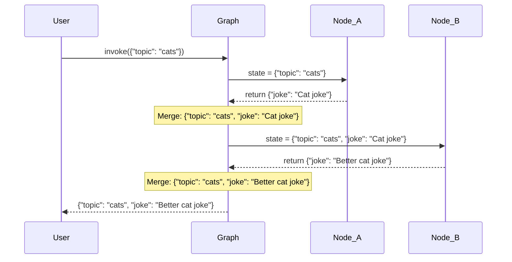

# State Management

## Introduction

State is the backbone of every LangGraph application. It is the shared data structure that nodes read from and write to as they execute. Getting state management right — choosing the correct schema, configuring reducers, and understanding how updates merge — is what separates fragile prototypes from robust production agents.

This lesson covers LangGraph's state system in depth: how reducers control state updates, how `MessagesState` simplifies chat applications, and how to design custom schemas for complex workflows.

### What We'll Cover

- How state flows through a graph
- Default overwrite behavior and `Annotated` reducers
- The built-in `MessagesState` and `add_messages` reducer
- Custom state schemas with multiple reducer strategies
- Private state and input/output schemas
- Runtime configuration via `RunnableConfig`

### Prerequisites

- Completed [Core Concepts](./01-core-concepts.md)
- Python type hints (`TypedDict`, `Annotated`)
- Basic understanding of reducers (functions that combine values)

---

## How State Flows Through a Graph

When you invoke a graph, LangGraph creates an initial state from your input, then passes it through each node along the execution path. Each node receives the **current state** and returns a **partial update**. LangGraph then merges the update back into the state before passing it to the next node.



> **🔑 Key concept:** Nodes return **partial** state updates, not the full state. LangGraph handles the merge. How keys are merged depends on whether a **reducer** is configured.

---

## Default Behavior: Overwrite

By default, when a node returns a value for a state key, it **overwrites** the existing value:

```python
from typing_extensions import TypedDict
from langgraph.graph import StateGraph, START, END


class State(TypedDict):
    value: str


def step_1(state: State):
    return {"value": "from step 1"}


def step_2(state: State):
    # This OVERWRITES the value from step_1
    return {"value": "from step 2"}


graph = (
    StateGraph(State)
    .add_node(step_1)
    .add_node(step_2)
    .add_edge(START, "step_1")
    .add_edge("step_1", "step_2")
    .add_edge("step_2", END)
    .compile()
)

result = graph.invoke({"value": "initial"})
print(result["value"])
```

**Output:**
```
from step 2
```

The final value is `"from step 2"` because the default behavior is last-write-wins.

---

## Annotated Reducers

When you need more control over how updates merge, use `Annotated` to attach a **reducer function** to a state key. A reducer takes the existing value and the new value, then returns the combined result.

### Appending to Lists

The most common reducer appends new items to a list:

```python
from typing import Annotated
import operator
from typing_extensions import TypedDict
from langgraph.graph import StateGraph, START, END


class State(TypedDict):
    items: Annotated[list[str], operator.add]  # Reducer: list concatenation


def add_fruits(state: State):
    return {"items": ["apple", "banana"]}


def add_veggies(state: State):
    return {"items": ["carrot", "broccoli"]}


graph = (
    StateGraph(State)
    .add_node(add_fruits)
    .add_node(add_veggies)
    .add_edge(START, "add_fruits")
    .add_edge("add_fruits", "add_veggies")
    .add_edge("add_veggies", END)
    .compile()
)

result = graph.invoke({"items": []})
print(result["items"])
```

**Output:**
```
['apple', 'banana', 'carrot', 'broccoli']
```

Instead of overwriting, `operator.add` concatenates the lists. Each node's return value is *added* to the existing list.

### Custom Reducer Functions

You can write any function that takes `(existing, new)` and returns the merged result:

```python
from typing import Annotated
from typing_extensions import TypedDict


def keep_max(existing: int, new: int) -> int:
    """Always keep the larger value."""
    return max(existing, new)


def merge_dicts(existing: dict, new: dict) -> dict:
    """Deep merge two dictionaries."""
    result = {**existing}
    result.update(new)
    return result


class State(TypedDict):
    high_score: Annotated[int, keep_max]
    metadata: Annotated[dict, merge_dicts]
```

### Common Reducer Patterns

| Reducer | Type | Behavior |
|---------|------|----------|
| `operator.add` | `list` | Concatenate lists |
| `operator.add` | `int` | Sum integers |
| Custom `keep_max` | `int` | Keep the maximum value |
| Custom `merge_dicts` | `dict` | Merge dictionaries |
| `add_messages` | `list[BaseMessage]` | Append/update messages by ID |

---

## MessagesState: Chat Applications

For chat-based agents, LangGraph provides a built-in `MessagesState` with a pre-configured `add_messages` reducer. This is the recommended state for most agent applications.

### Using MessagesState

```python
from langgraph.graph import StateGraph, START, END, MessagesState
from langchain_core.messages import HumanMessage, AIMessage


def respond(state: MessagesState):
    """Simple echo node."""
    last_message = state["messages"][-1]
    return {"messages": [AIMessage(content=f"You said: {last_message.content}")]}


graph = (
    StateGraph(MessagesState)
    .add_node("respond", respond)
    .add_edge(START, "respond")
    .add_edge("respond", END)
    .compile()
)

result = graph.invoke({"messages": [HumanMessage(content="Hello!")]})
for msg in result["messages"]:
    print(f"{msg.type}: {msg.content}")
```

**Output:**
```
human: Hello!
ai: You said: Hello!
```

### How add_messages Works

The `add_messages` reducer is smarter than simple list concatenation:

| Behavior | Description |
|----------|-------------|
| **Append new messages** | Messages with new IDs are appended to the list |
| **Update existing messages** | Messages with matching IDs replace the existing version |
| **Preserve order** | Messages maintain chronological order |

```python
from langchain_core.messages import HumanMessage, AIMessage, RemoveMessage

# Append: new messages are added
state = {"messages": [HumanMessage(content="Hi", id="1")]}
update = {"messages": [AIMessage(content="Hello!", id="2")]}
# Result: [HumanMessage("Hi"), AIMessage("Hello!")]

# Update: matching ID replaces
update = {"messages": [HumanMessage(content="Hi there!", id="1")]}
# Result: [HumanMessage("Hi there!"), AIMessage("Hello!")]

# Remove: special RemoveMessage deletes by ID
update = {"messages": [RemoveMessage(id="1")]}
# Result: [AIMessage("Hello!")]
```

> **🤖 AI Context:** `add_messages` is designed for the LLM conversation pattern where you accumulate a growing message history. It handles the common case where tool messages reference specific AI messages by ID, ensuring updates are applied correctly.

### Extending MessagesState

You can add custom fields alongside the built-in `messages` key:

```python
from langgraph.graph import MessagesState


class AgentState(MessagesState):
    """Extended state with custom fields."""
    tool_calls_count: int
    current_task: str
    is_complete: bool
```

This gives you `messages` with the `add_messages` reducer plus your custom fields with default overwrite behavior.

---

## Custom State Schemas

For complex workflows, design state schemas that capture all the data your nodes need:

### Multi-Agent Research Example

```python
from typing import Annotated
import operator
from typing_extensions import TypedDict


class ResearchState(TypedDict):
    # Input
    query: str
    
    # Accumulated results (append reducer)
    sources: Annotated[list[str], operator.add]
    findings: Annotated[list[dict], operator.add]
    
    # Overwrite fields (default behavior)
    summary: str
    confidence: float
    
    # Control flow
    iteration: int
    max_iterations: int
```

### Input and Output Schemas

You can restrict which fields are accepted as input and which are returned as output:

```python
from typing_extensions import TypedDict
from langgraph.graph import StateGraph, START, END


class InputState(TypedDict):
    query: str


class OutputState(TypedDict):
    answer: str
    confidence: float


class InternalState(InputState, OutputState):
    """Full internal state — not exposed to caller."""
    intermediate_results: list
    iteration: int


def process(state: InternalState):
    return {
        "intermediate_results": ["step 1 done"],
        "answer": f"Answer to: {state['query']}",
        "confidence": 0.95,
        "iteration": 1,
    }


# StateGraph uses InternalState internally but restricts I/O
builder = StateGraph(InternalState, input=InputState, output=OutputState)
builder.add_node("process", process)
builder.add_edge(START, "process")
builder.add_edge("process", END)

graph = builder.compile()

# Caller only sends InputState fields
result = graph.invoke({"query": "What is LangGraph?"})

# Result only contains OutputState fields
print(result)
```

**Output:**
```
{'answer': 'Answer to: What is LangGraph?', 'confidence': 0.95}
```

> **💡 Tip:** Input/output schemas are a powerful pattern for encapsulating internal state. The caller never sees `intermediate_results` or `iteration` — they are implementation details.

---

## Runtime Configuration

Nodes can access runtime configuration via the `config` parameter. This is useful for passing API keys, model names, or other settings that shouldn't live in the state:

```python
from langchain_core.runnables import RunnableConfig
from typing_extensions import TypedDict
from langgraph.graph import StateGraph, START, END


class State(TypedDict):
    query: str
    result: str


def process(state: State, config: RunnableConfig):
    """Node that uses runtime configuration."""
    model_name = config.get("configurable", {}).get("model", "default")
    thread_id = config.get("configurable", {}).get("thread_id", "unknown")
    return {"result": f"Processed '{state['query']}' with model={model_name}, thread={thread_id}"}


builder = StateGraph(State)
builder.add_node("process", process)
builder.add_edge(START, "process")
builder.add_edge("process", END)

graph = builder.compile()

# Pass configuration at runtime
result = graph.invoke(
    {"query": "Hello"},
    config={"configurable": {"model": "claude-sonnet", "thread_id": "abc-123"}}
)
print(result["result"])
```

**Output:**
```
Processed 'Hello' with model=claude-sonnet, thread=abc-123
```

### Context Schema

For type-safe runtime context, use `context_schema` on the `StateGraph`:

```python
from typing_extensions import TypedDict
from langgraph.graph import StateGraph
from langgraph.config import get_context


class ContextConfig(TypedDict):
    user_id: str
    permissions: list[str]


class State(TypedDict):
    query: str
    result: str


builder = StateGraph(State, context_schema=ContextConfig)
```

---

## Best Practices

| Practice | Why It Matters |
|----------|----------------|
| Use `MessagesState` for chat agents | Pre-configured `add_messages` handles message management correctly |
| Choose reducers deliberately | `operator.add` for accumulation, overwrite for latest-value fields |
| Separate input/output schemas | Keeps internal state private and API surface clean |
| Keep state schemas flat | Deeply nested state is harder to update and debug |
| Use `config` for runtime settings | API keys and model names don't belong in graph state |

---

## Common Pitfalls

| ❌ Mistake | ✅ Solution |
|-----------|-------------|
| Expecting list append without a reducer | Add `Annotated[list, operator.add]` — default behavior is overwrite |
| Modifying state in-place in a node | Always return a new dict — mutations can cause unexpected behavior |
| Using `MessagesState` without `add_messages` import | `MessagesState` is imported from `langgraph.graph`, not built manually |
| Storing large objects in state | State is checkpointed — large objects increase storage and serialization costs |
| Forgetting `id` on messages for updates | `add_messages` uses `id` for update/remove — without it, messages always append |

---

## Hands-on Exercise

### Your Task

Build a graph with a custom state schema that tracks a multi-step analysis pipeline.

### Requirements

1. Define a `State` with: `text: str`, `word_count: int`, `analysis_steps: Annotated[list[str], operator.add]`, `result: str`
2. Create a `count_words` node that sets `word_count` and appends to `analysis_steps`
3. Create a `classify_length` node that classifies text as "short" (< 10 words), "medium" (10-50), or "long" (> 50) and appends to `analysis_steps`
4. Create a `summarize` node that combines everything into `result`
5. Chain all three nodes in sequence

### Expected Result

```python
result = graph.invoke({"text": "Hello world this is a test"})
print(result["analysis_steps"])
# ['Counted 6 words', 'Classified as: short']
print(result["result"])
# 'Text "Hello world this is a test" has 6 words (short)'
```

<details>
<summary>💡 Hints (click to expand)</summary>

- `word_count` doesn't need a reducer — it's overwritten once
- `analysis_steps` needs `Annotated[list[str], operator.add]` to accumulate
- Each node appends a single-item list: `{"analysis_steps": ["step description"]}`

</details>

<details>
<summary>✅ Solution (click to expand)</summary>

```python
from typing import Annotated
import operator
from typing_extensions import TypedDict
from langgraph.graph import StateGraph, START, END


class State(TypedDict):
    text: str
    word_count: int
    analysis_steps: Annotated[list[str], operator.add]
    length_class: str
    result: str


def count_words(state: State):
    count = len(state["text"].split())
    return {
        "word_count": count,
        "analysis_steps": [f"Counted {count} words"],
    }


def classify_length(state: State):
    count = state["word_count"]
    if count < 10:
        cls = "short"
    elif count <= 50:
        cls = "medium"
    else:
        cls = "long"
    return {
        "length_class": cls,
        "analysis_steps": [f"Classified as: {cls}"],
    }


def summarize(state: State):
    return {
        "result": f'Text "{state["text"]}" has {state["word_count"]} words ({state["length_class"]})'
    }


graph = (
    StateGraph(State)
    .add_node(count_words)
    .add_node(classify_length)
    .add_node(summarize)
    .add_edge(START, "count_words")
    .add_edge("count_words", "classify_length")
    .add_edge("classify_length", "summarize")
    .add_edge("summarize", END)
    .compile()
)

result = graph.invoke({"text": "Hello world this is a test"})
print(result["analysis_steps"])
print(result["result"])
```

**Output:**
```
['Counted 6 words', 'Classified as: short']
Text "Hello world this is a test" has 6 words (short)
```

</details>

### Bonus Challenges

- [ ] Add a `sentiment` node that classifies text as positive, negative, or neutral
- [ ] Use `MessagesState` as a base and add custom fields on top
- [ ] Create input/output schemas that hide `analysis_steps` from the caller

---

## Summary

✅ Default state update behavior is **overwrite** — last node to write a key wins

✅ `Annotated[type, reducer]` lets you customize how state keys merge (append, max, etc.)

✅ `MessagesState` with `add_messages` is the go-to schema for chat-based agents

✅ Input/output schemas restrict what callers see, keeping internal state private

✅ Runtime configuration via `config` separates settings from state data

**Next:** [Prebuilt Agents](./04-prebuilt-agents.md)

---

## Further Reading

- [LangGraph Graph API — State](https://docs.langchain.com/oss/python/langgraph/graph-api) — Reducers, MessagesState, and schemas
- [LangGraph Persistence](https://docs.langchain.com/oss/python/langgraph/persistence) — How state is persisted across invocations
- [Python Annotated Types](https://docs.python.org/3/library/typing.html#typing.Annotated) — Official Python docs

*Back to [LangGraph Agent Orchestration](./00-langgraph-agent-orchestration.md)*

<!-- 
Sources Consulted:
- LangGraph Graph API: https://docs.langchain.com/oss/python/langgraph/graph-api
- LangGraph Persistence: https://docs.langchain.com/oss/python/langgraph/persistence
- LangGraph Overview: https://docs.langchain.com/oss/python/langgraph/overview
-->
