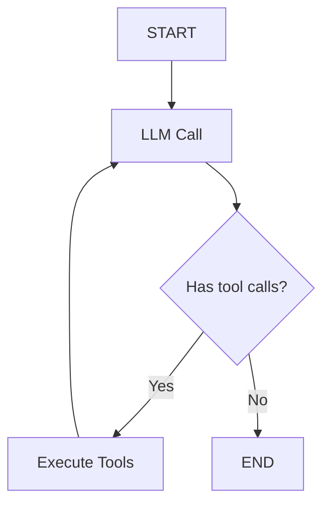

# Prebuilt Agents

## Introduction

Building an agent from scratch with `StateGraph` gives you full control, but many agent use cases follow the same pattern: an LLM decides whether to call tools, tools execute, results feed back to the LLM, and the loop continues until the LLM produces a final answer. This is the **ReAct** (Reason + Act) pattern, and LangGraph provides `create_react_agent()` to set it up in a single function call.

This lesson covers LangGraph's prebuilt agent utilities — how to use them for rapid prototyping, when to customize them, and when to drop down to manual graph construction.

### What We'll Cover

- The ReAct agent pattern and how it maps to a graph
- `create_react_agent()` for one-line agent creation
- Adding tools, system prompts, and structured output
- Manual ReAct implementation with `MessagesState`
- When to use prebuilt vs custom agents

### Prerequisites

- Completed [Core Concepts](./01-core-concepts.md) and [State Management](./03-state-management.md)
- Understanding of LLM tool calling (from [Unit 10: Function Calling](../../10-function-calling-tool-use/00-overview.md))
- A LangChain-compatible LLM API key (Anthropic, OpenAI, etc.)

---

## The ReAct Pattern

ReAct (Reason + Act) is the most common agent pattern. The LLM reasons about what to do, calls tools when needed, and processes tool results until it has a final answer.



This loop has three components:
1. **LLM call** — The model receives messages and decides to call tools or respond
2. **Tool execution** — Tools run with the LLM's provided arguments
3. **Routing** — Check if the LLM made tool calls; if yes, loop back; if no, finish

---

## create_react_agent()

The `create_react_agent()` function builds this entire pattern in one call:

```python
from langgraph.prebuilt import create_react_agent
from langchain_anthropic import ChatAnthropic
from langchain_core.tools import tool


# Define tools
@tool
def get_weather(city: str) -> str:
    """Get the current weather for a city."""
    # Simulated weather data
    weather_data = {
        "london": "15°C, cloudy",
        "tokyo": "22°C, sunny",
        "new york": "18°C, partly cloudy",
    }
    return weather_data.get(city.lower(), f"Weather data not available for {city}")


@tool
def get_time(city: str) -> str:
    """Get the current time for a city."""
    time_data = {
        "london": "14:30 GMT",
        "tokyo": "23:30 JST",
        "new york": "09:30 EST",
    }
    return time_data.get(city.lower(), f"Time data not available for {city}")


# Create the agent in one line
model = ChatAnthropic(model="claude-sonnet-4-5-20250929")
agent = create_react_agent(model, tools=[get_weather, get_time])

# Use it
result = agent.invoke({
    "messages": [{"role": "user", "content": "What's the weather and time in Tokyo?"}]
})

for msg in result["messages"]:
    print(f"{msg.type}: {msg.content}")
```

**Output:**
```
human: What's the weather and time in Tokyo?
ai: I'll check both for you.
tool: 22°C, sunny
tool: 23:30 JST
ai: In Tokyo, it's currently 22°C and sunny. The local time is 23:30 JST.
```

> **🔑 Key concept:** `create_react_agent()` returns a compiled `StateGraph` — it's the same graph you could build manually, just pre-configured. You can still stream, checkpoint, and add persistence to it.

---

## Customizing the Prebuilt Agent

### Adding a System Prompt

Control the agent's behavior with a system prompt:

```python
agent = create_react_agent(
    model,
    tools=[get_weather, get_time],
    prompt="You are a travel assistant. Always provide helpful context about cities along with the requested information."
)
```

You can also use a `ChatPromptTemplate` for more complex prompts:

```python
from langchain_core.prompts import ChatPromptTemplate

prompt = ChatPromptTemplate.from_messages([
    ("system", "You are a {role}. Respond in {language}."),
    ("placeholder", "{messages}"),
])

agent = create_react_agent(
    model,
    tools=[get_weather],
    prompt=prompt,
)

result = agent.invoke({
    "messages": [{"role": "user", "content": "Weather in London?"}],
    "role": "meteorologist",
    "language": "French",
})
```

### Adding Persistence

Attach a checkpointer to enable memory across conversations:

```python
from langgraph.checkpoint.memory import MemorySaver

agent = create_react_agent(
    model,
    tools=[get_weather, get_time],
    checkpointer=MemorySaver(),
)

# Use thread_id for conversation persistence
config = {"configurable": {"thread_id": "user-123"}}

result = agent.invoke(
    {"messages": [{"role": "user", "content": "Weather in Tokyo?"}]},
    config=config,
)

# Continue the conversation — agent remembers context
result = agent.invoke(
    {"messages": [{"role": "user", "content": "And what about London?"}]},
    config=config,
)
```

### Structured Output

Force the agent to return a specific schema alongside or instead of free-text responses:

```python
from pydantic import BaseModel, Field


class WeatherReport(BaseModel):
    city: str = Field(description="The city name")
    temperature: str = Field(description="Current temperature")
    conditions: str = Field(description="Weather conditions")
    recommendation: str = Field(description="Activity recommendation")


agent = create_react_agent(
    model,
    tools=[get_weather],
    response_format=WeatherReport,
)

result = agent.invoke({
    "messages": [{"role": "user", "content": "Weather in Tokyo?"}]
})

# The structured response is in the last message
print(result["structured_response"])
```

**Output:**
```
WeatherReport(city='Tokyo', temperature='22°C', conditions='sunny', recommendation='Great day for outdoor activities!')
```

---

## Building a ReAct Agent Manually

Understanding the manual implementation helps you customize beyond what the prebuilt version offers:

```python
from typing import Literal
from langgraph.graph import StateGraph, START, END, MessagesState
from langchain_anthropic import ChatAnthropic
from langchain_core.messages import ToolMessage
from langchain_core.tools import tool


@tool
def multiply(a: int, b: int) -> int:
    """Multiply two numbers."""
    return a * b


@tool
def add(a: int, b: int) -> int:
    """Add two numbers."""
    return a + b


# Setup
tools = [multiply, add]
tools_by_name = {t.name: t for t in tools}
model = ChatAnthropic(model="claude-sonnet-4-5-20250929").bind_tools(tools)


# Node: call the LLM
def call_model(state: MessagesState):
    response = model.invoke(state["messages"])
    return {"messages": [response]}


# Node: execute tools
def call_tools(state: MessagesState):
    last_message = state["messages"][-1]
    results = []
    for tool_call in last_message.tool_calls:
        tool_fn = tools_by_name[tool_call["name"]]
        result = tool_fn.invoke(tool_call["args"])
        results.append(
            ToolMessage(content=str(result), tool_call_id=tool_call["id"])
        )
    return {"messages": results}


# Routing: check if the LLM made tool calls
def should_continue(state: MessagesState) -> Literal["call_tools", "__end__"]:
    last_message = state["messages"][-1]
    if last_message.tool_calls:
        return "call_tools"
    return "__end__"


# Build the graph
builder = StateGraph(MessagesState)
builder.add_node("call_model", call_model)
builder.add_node("call_tools", call_tools)

builder.add_edge(START, "call_model")
builder.add_conditional_edges("call_model", should_continue)
builder.add_edge("call_tools", "call_model")

agent = builder.compile()

# Use it
result = agent.invoke({
    "messages": [{"role": "user", "content": "What is 6 multiplied by 7, then add 8?"}]
})

for msg in result["messages"]:
    msg.pretty_print()
```

**Output:**
```
================================ Human Message =================================
What is 6 multiplied by 7, then add 8?
================================== AI Message ==================================
I'll calculate that step by step.
================================= Tool Message =================================
42
================================= Tool Message =================================
50
================================== AI Message ==================================
6 × 7 = 42, then 42 + 8 = 50.
```

### Comparing the Two Approaches

| Aspect | `create_react_agent()` | Manual Construction |
|--------|----------------------|---------------------|
| Lines of code | ~5 | ~30+ |
| Customizable routing | Limited | Full control |
| Custom state fields | Via extending `MessagesState` | Any schema |
| Pre/post processing nodes | Limited | Add any nodes you need |
| Learning curve | Minimal | Moderate |
| Use case | Standard ReAct pattern | Custom agent loops |

---

## When to Use Prebuilt vs Custom

### Use `create_react_agent()` When:

✅ You need a standard tool-calling agent quickly

✅ The ReAct loop (LLM → tools → LLM) fits your use case

✅ You want persistence, streaming, and structured output with minimal code

✅ Prototyping before building a custom solution

### Build Custom When:

✅ You need additional nodes (validation, logging, preprocessing)

✅ Your routing logic is more complex than "has tool calls?"

✅ You want multiple LLMs in the same graph

✅ You need custom state beyond messages (scores, metadata, counters)

✅ You're building multi-agent systems with specialized subgraphs

> **🤖 AI Context:** Think of `create_react_agent()` as the "90% solution." It covers the most common agent pattern perfectly. The other 10% of cases — multi-agent orchestration, custom evaluation loops, complex state machines — need the full `StateGraph` API.

---

## Best Practices

| Practice | Why It Matters |
|----------|----------------|
| Start with `create_react_agent()`, then customize | Proves the concept before adding complexity |
| Use `@tool` decorator for tool definitions | Provides name, description, and schema automatically |
| Add system prompts for behavior control | Guides the LLM's tool usage and response style |
| Enable checkpointing from the start | Adds memory and debugging with minimal overhead |
| Test with deterministic tools first | Verify graph structure before connecting real APIs |

---

## Common Pitfalls

| ❌ Mistake | ✅ Solution |
|-----------|-------------|
| Forgetting to bind tools to the model (manual approach) | Use `model.bind_tools(tools)` before passing to the node |
| Not handling missing tool names | Add error handling in `call_tools` for unknown tool names |
| Using `create_react_agent` for non-ReAct patterns | Build custom graphs for routing, parallelization, or evaluation loops |
| Expecting structured output without `response_format` | Pass a Pydantic model to `response_format` parameter |
| Not including tool docstrings | The LLM uses docstrings to decide when and how to call tools |

---

## Hands-on Exercise

### Your Task

Build a calculator agent that can perform basic arithmetic, then extend it with a custom graph.

### Requirements

1. Define four tools: `add`, `subtract`, `multiply`, `divide`
2. Create a prebuilt agent with `create_react_agent()`
3. Test it with: "What is (15 + 7) × 3 ÷ 2?"
4. Then build the same agent manually with `StateGraph`
5. Add a `log_result` node after the tool loop that records the final answer

### Expected Result

```
The result of (15 + 7) × 3 ÷ 2 = 33
```

<details>
<summary>💡 Hints (click to expand)</summary>

- Use `@tool` decorator for all four operations
- For division, handle the divide-by-zero case
- The manual version needs `should_continue` routing to check `tool_calls`
- The `log_result` node goes after the ReAct loop exits

</details>

<details>
<summary>✅ Solution (click to expand)</summary>

```python
from langchain_core.tools import tool
from langgraph.prebuilt import create_react_agent
from langchain_anthropic import ChatAnthropic


@tool
def add(a: float, b: float) -> float:
    """Add two numbers."""
    return a + b

@tool
def subtract(a: float, b: float) -> float:
    """Subtract b from a."""
    return a - b

@tool
def multiply(a: float, b: float) -> float:
    """Multiply two numbers."""
    return a * b

@tool
def divide(a: float, b: float) -> float:
    """Divide a by b."""
    if b == 0:
        return "Error: division by zero"
    return a / b


model = ChatAnthropic(model="claude-sonnet-4-5-20250929")

# Prebuilt version
agent = create_react_agent(model, tools=[add, subtract, multiply, divide])

result = agent.invoke({
    "messages": [{"role": "user", "content": "What is (15 + 7) × 3 ÷ 2?"}]
})

for msg in result["messages"]:
    msg.pretty_print()
```

</details>

### Bonus Challenges

- [ ] Add a system prompt that makes the agent show its work step by step
- [ ] Add `MemorySaver` so the agent remembers previous calculations
- [ ] Create a custom version with a `validate_result` node that checks for reasonable answers

---

## Summary

✅ `create_react_agent()` builds a complete ReAct agent in one function call

✅ Customize with system prompts, persistence, and structured output parameters

✅ The manual approach gives full control over nodes, routing, and state

✅ Both approaches produce the same compiled `StateGraph` under the hood

✅ Start with prebuilt for prototyping, drop to custom for advanced use cases

**Next:** [Checkpointing and Memory](./05-checkpointing-and-memory.md)

---

## Further Reading

- [LangGraph Workflows and Agents](https://docs.langchain.com/oss/python/langgraph/workflows-agents) — ReAct and other patterns
- [LangChain Tools](https://docs.langchain.com/oss/python/langchain/tools) — Defining tools with `@tool`
- [LangGraph Persistence](https://docs.langchain.com/oss/python/langgraph/persistence) — Adding memory to agents

*Back to [LangGraph Agent Orchestration](./00-langgraph-agent-orchestration.md)*

<!-- 
Sources Consulted:
- LangGraph Workflows and Agents: https://docs.langchain.com/oss/python/langgraph/workflows-agents
- LangGraph Graph API: https://docs.langchain.com/oss/python/langgraph/graph-api
- LangGraph Overview: https://docs.langchain.com/oss/python/langgraph/overview
-->
