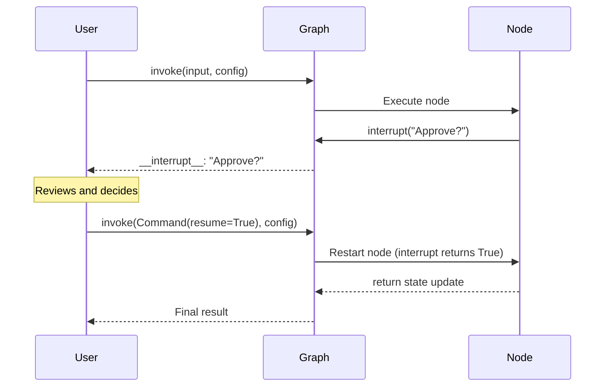

# Human-in-the-Loop Patterns

## Introduction

Not every agent decision should be autonomous. Some actions — sending emails, modifying databases, making purchases — require human approval before execution. LangGraph's `interrupt()` function lets you pause a graph at any point, surface information to a human, wait for their response, and then resume execution with that input.

This lesson covers the full spectrum of human-in-the-loop (HITL) patterns: from simple approval gates to validated input loops, tool-level interrupts, and the critical rules for writing reliable interrupt code.

### What We'll Cover

- The `interrupt()` function and `Command(resume=)` pattern
- Approval/reject workflows
- Review and edit state patterns
- Interrupts inside tools
- Input validation loops
- Rules for writing safe interrupt code
- Static breakpoints for debugging

### Prerequisites

- Completed [Checkpointing and Memory](./05-checkpointing-and-memory.md)
- Understanding of threads and checkpointers (required for interrupts)

---

## How Interrupts Work

The `interrupt()` function pauses graph execution and returns a value to the caller. When you call `interrupt()` within a node, LangGraph saves the current state and waits indefinitely until you resume with a response.



### Requirements

To use interrupts, you need three things:

1. **A checkpointer** — to persist the graph state while paused
2. **A thread ID** — so the runtime knows which state to resume
3. **JSON-serializable payloads** — the interrupt value must be serializable

---

## Basic Interrupt and Resume

```python
from langgraph.graph import StateGraph, START, END, MessagesState
from langgraph.checkpoint.memory import MemorySaver
from langgraph.types import interrupt, Command
from langchain_core.messages import AIMessage


def propose_action(state: MessagesState):
    """Node that proposes an action and waits for approval."""
    # Pause and ask for approval
    approved = interrupt("Do you approve sending this notification?")
    
    if approved:
        return {"messages": [AIMessage(content="✅ Notification sent!")]}
    else:
        return {"messages": [AIMessage(content="❌ Notification cancelled.")]}


builder = StateGraph(MessagesState)
builder.add_node("propose", propose_action)
builder.add_edge(START, "propose")
builder.add_edge("propose", END)

graph = builder.compile(checkpointer=MemorySaver())

config = {"configurable": {"thread_id": "thread-1"}}

# Step 1: Run until the interrupt
result = graph.invoke(
    {"messages": [{"role": "user", "content": "Send a notification"}]},
    config=config,
)

# The interrupt payload is surfaced under __interrupt__
print(result["__interrupt__"])
```

**Output:**
```
[Interrupt(value='Do you approve sending this notification?')]
```

```python
# Step 2: Resume with the human's response
result = graph.invoke(Command(resume=True), config=config)
print(result["messages"][-1].content)
```

**Output:**
```
✅ Notification sent!
```

> **🔑 Key concept:** When you resume, the node **restarts from the beginning**. Code before `interrupt()` runs again. The `resume` value becomes the return value of the `interrupt()` call.

---

## Approval/Reject Pattern

The most common HITL pattern — pause before a critical action and ask for approval:

```python
from typing import Literal
from langgraph.types import interrupt, Command


def approval_node(state: MessagesState) -> Command[Literal["execute", "cancel"]]:
    """Pause for approval, then route accordingly."""
    is_approved = interrupt({
        "question": "Do you want to proceed with this action?",
        "details": state["messages"][-1].content,
    })

    if is_approved:
        return Command(goto="execute")
    else:
        return Command(goto="cancel")


def execute(state: MessagesState):
    return {"messages": [AIMessage(content="Action executed successfully!")]}


def cancel(state: MessagesState):
    return {"messages": [AIMessage(content="Action cancelled by user.")]}
```

Resume with `True` to approve or `False` to reject:

```python
# Approve
graph.invoke(Command(resume=True), config=config)

# Reject
graph.invoke(Command(resume=False), config=config)
```

---

## Review and Edit Pattern

Let a human review and modify generated content before it's used:

```python
from langgraph.types import interrupt


def generate_email(state):
    """Generate an email draft and let the human edit it."""
    draft = f"Dear customer, thank you for contacting us about {state['topic']}..."
    
    # Pause and show the draft for review
    edited_content = interrupt({
        "instruction": "Review and edit this email draft",
        "content": draft,
    })
    
    # The resume value is the edited text
    return {"email": edited_content}
```

When resuming, provide the edited content:

```python
# The human can modify the text before sending
graph.invoke(
    Command(resume="Dear valued customer, we appreciate your inquiry about..."),
    config=config,
)
```

---

## Interrupts in Tools

You can place interrupts directly inside tool functions. This makes the tool itself pause for approval whenever it's called:

```python
from langchain_core.tools import tool
from langgraph.types import interrupt


@tool
def send_email(to: str, subject: str, body: str):
    """Send an email to a recipient."""
    # Pause before sending — payload surfaces in result["__interrupt__"]
    response = interrupt({
        "action": "send_email",
        "to": to,
        "subject": subject,
        "body": body,
        "message": "Approve sending this email?",
    })

    if response.get("action") == "approve":
        # The resume value can override inputs
        final_to = response.get("to", to)
        final_subject = response.get("subject", subject)
        final_body = response.get("body", body)
        return f"Email sent to {final_to} with subject '{final_subject}'"
    return "Email cancelled by user"
```

Resume with approval (optionally modifying the parameters):

```python
# Approve as-is
graph.invoke(Command(resume={"action": "approve"}), config=config)

# Approve with modifications
graph.invoke(
    Command(resume={
        "action": "approve",
        "to": "updated@example.com",
        "subject": "Updated subject",
    }),
    config=config,
)

# Reject
graph.invoke(Command(resume={"action": "reject"}), config=config)
```

> **🤖 AI Context:** Tool-level interrupts are powerful because the LLM can call the tool naturally, and the interrupt pauses execution automatically. This pattern is ideal for high-stakes actions (payments, deletions, external API calls) where you want human oversight without changing the agent's architecture.

---

## Input Validation Loop

Validate human input and ask again if it's invalid:

```python
from langgraph.types import interrupt


def get_age_node(state):
    prompt = "What is your age?"

    while True:
        answer = interrupt(prompt)

        # Validate the input
        if isinstance(answer, int) and answer > 0:
            break
        else:
            # Invalid — ask again with a clearer message
            prompt = f"'{answer}' is not a valid age. Please enter a positive number."

    return {"age": answer}
```

Each time you resume with invalid input, the interrupt fires again with an updated prompt:

```python
# First attempt — invalid
graph.invoke(Command(resume="not a number"), config=config)
# Interrupt: "'not a number' is not a valid age. Please enter a positive number."

# Second attempt — valid
graph.invoke(Command(resume=25), config=config)
# Continues execution with age=25
```

---

## Rules for Safe Interrupts

When a node resumes, it **restarts from the beginning** of the node. This means code before `interrupt()` runs again. Follow these rules to avoid bugs:

### ✅ Do Not Wrap interrupt() in try/except

The interrupt mechanism works by raising a special exception. Catching it prevents the pause:

```python
# ❌ BAD: bare try/except catches the interrupt exception
def node(state):
    try:
        interrupt("Approve?")
    except Exception as e:
        print(e)  # This catches the interrupt!
    return state

# ✅ GOOD: separate interrupt from error-prone code
def node(state):
    answer = interrupt("Approve?")
    try:
        fetch_data()  # Only this can fail
    except ConnectionError as e:
        print(e)
    return state
```

### ✅ Keep interrupt() Order Consistent

Multiple interrupts in a node are matched by index. Don't skip or reorder them:

```python
# ✅ GOOD: same order every time
def node(state):
    name = interrupt("What's your name?")
    age = interrupt("What's your age?")
    return {"name": name, "age": age}

# ❌ BAD: conditional skip changes the order
def node(state):
    name = interrupt("What's your name?")
    if state.get("needs_age"):
        age = interrupt("What's your age?")  # Index mismatch on resume!
    city = interrupt("What's your city?")
    return state
```

### ✅ Use JSON-Serializable Values

```python
# ✅ GOOD: strings, numbers, dicts, lists
answer = interrupt("What's your name?")
answer = interrupt({"question": "Approve?", "details": "..."})
answer = interrupt(42)

# ❌ BAD: functions, class instances
answer = interrupt({"validator": lambda x: len(x) > 0})  # Can't serialize!
```

### ✅ Make Pre-Interrupt Side Effects Idempotent

Code before `interrupt()` runs again on resume. Use idempotent operations:

```python
# ✅ GOOD: upsert is idempotent
def node(state):
    db.upsert_user(user_id=state["user_id"], status="pending")
    approved = interrupt("Approve?")
    return {"approved": approved}

# ❌ BAD: creates duplicate records on each resume
def node(state):
    db.create_audit_log({"action": "pending", "timestamp": datetime.now()})
    approved = interrupt("Approve?")
    return {"approved": approved}
```

---

## Static Breakpoints (Debugging)

For debugging, you can set static interrupt points at compile time. These pause before or after specific nodes:

```python
graph = builder.compile(
    checkpointer=MemorySaver(),
    interrupt_before=["critical_node"],
    interrupt_after=["review_node"],
)

config = {"configurable": {"thread_id": "debug-1"}}

# Run until the breakpoint
graph.invoke(inputs, config=config)

# Step through by resuming with None
graph.invoke(None, config=config)
```

> **Note:** Static breakpoints are for **debugging only**. For production human-in-the-loop workflows, use the `interrupt()` function instead.

---

## Best Practices

| Practice | Why It Matters |
|----------|----------------|
| Always use a checkpointer with interrupts | Interrupts require state persistence to work |
| Keep interrupt payloads descriptive | Include context so the human knows what they're approving |
| Use the same `thread_id` when resuming | Different thread = different state, resume won't work |
| Place side effects after `interrupt()` | Avoids duplicate operations when the node restarts |
| Use tool-level interrupts for high-stakes actions | Keeps approval logic with the tool, reusable across graphs |

---

## Common Pitfalls

| ❌ Mistake | ✅ Solution |
|-----------|-------------|
| Wrapping `interrupt()` in `try/except` | Use specific exception types, keep `interrupt()` outside try blocks |
| Conditionally skipping interrupts | Keep interrupt order consistent across all code paths |
| Using non-serializable interrupt payloads | Stick to strings, numbers, dicts, lists |
| Performing non-idempotent operations before `interrupt()` | Move side effects after interrupt or use idempotent operations |
| Using static breakpoints in production | Use `interrupt()` function for production HITL |

---

## Hands-on Exercise

### Your Task

Build an email approval agent with human-in-the-loop.

### Requirements

1. Create a `draft_email` node that generates an email draft
2. Create an `approve_email` node that uses `interrupt()` to pause for approval
3. The interrupt payload should show the draft and ask "Approve, edit, or reject?"
4. If approved: send the email (return success message)
5. If edited: use the edited text from the resume value
6. If rejected: return a cancellation message
7. Route to `send` or `cancel` nodes based on the response

### Expected Result

```python
# Run — hits interrupt with draft
result = graph.invoke({"to": "alice@example.com", "topic": "meeting"}, config=config)
# __interrupt__: {"draft": "Dear Alice...", "question": "Approve, edit, or reject?"}

# Approve
result = graph.invoke(Command(resume={"action": "approve"}), config=config)
# "Email sent to alice@example.com"
```

<details>
<summary>💡 Hints (click to expand)</summary>

- Use `Command(goto="send")` or `Command(goto="cancel")` in the approval node
- The resume value should be a dict with an "action" key
- Check `response.get("action")` for "approve", "edit", or "reject"
- For "edit", use `response.get("text")` as the new email body

</details>

<details>
<summary>✅ Solution (click to expand)</summary>

```python
from typing import Literal
from typing_extensions import TypedDict
from langgraph.graph import StateGraph, START, END
from langgraph.checkpoint.memory import MemorySaver
from langgraph.types import interrupt, Command


class State(TypedDict):
    to: str
    topic: str
    draft: str
    result: str


def draft_email(state: State):
    draft = f"Dear {state['to']},\n\nRegarding {state['topic']}, I wanted to reach out..."
    return {"draft": draft}


def approve_email(state: State) -> Command[Literal["send", "cancel"]]:
    response = interrupt({
        "draft": state["draft"],
        "question": "Approve, edit, or reject?",
    })

    action = response.get("action", "reject")

    if action == "approve":
        return Command(goto="send")
    elif action == "edit":
        return Command(
            update={"draft": response.get("text", state["draft"])},
            goto="send",
        )
    else:
        return Command(goto="cancel")


def send(state: State):
    return {"result": f"Email sent to {state['to']}: {state['draft']}"}


def cancel(state: State):
    return {"result": "Email cancelled."}


builder = StateGraph(State)
builder.add_node("draft", draft_email)
builder.add_node("approve", approve_email)
builder.add_node("send", send)
builder.add_node("cancel", cancel)

builder.add_edge(START, "draft")
builder.add_edge("draft", "approve")
builder.add_edge("send", END)
builder.add_edge("cancel", END)

graph = builder.compile(checkpointer=MemorySaver())

config = {"configurable": {"thread_id": "email-1"}}

# Step 1: Run until interrupt
result = graph.invoke({"to": "alice@example.com", "topic": "meeting"}, config=config)
print(result["__interrupt__"][0].value)

# Step 2: Approve
result = graph.invoke(Command(resume={"action": "approve"}), config=config)
print(result["result"])
```

**Output:**
```
{'draft': 'Dear alice@example.com,...', 'question': 'Approve, edit, or reject?'}
Email sent to alice@example.com: Dear alice@example.com,...
```

</details>

### Bonus Challenges

- [ ] Add input validation that re-prompts if the action is not "approve", "edit", or "reject"
- [ ] Add an `interrupt()` inside a tool that the agent calls
- [ ] Stream HITL interrupts using `stream_mode=["messages", "updates"]`

---

## Summary

✅ `interrupt()` pauses graph execution and waits for external input indefinitely

✅ `Command(resume=value)` resumes execution — the value becomes `interrupt()`'s return

✅ Common patterns: approval gates, review-and-edit, tool-level interrupts, validation loops

✅ Follow the rules: no try/except wrapping, consistent order, serializable values, idempotent pre-interrupt code

✅ Static breakpoints (`interrupt_before`/`interrupt_after`) are for debugging only

**Next:** [Streaming in LangGraph](./07-streaming-in-langgraph.md)

---

## Further Reading

- [LangGraph Interrupts](https://docs.langchain.com/oss/python/langgraph/interrupts) — Complete interrupts documentation
- [LangGraph Persistence](https://docs.langchain.com/oss/python/langgraph/persistence) — Checkpointer requirements for HITL
- [LangSmith Studio](https://docs.langchain.com/langsmith/studio) — Visual interrupt debugging

*Back to [LangGraph Agent Orchestration](./00-langgraph-agent-orchestration.md)*

<!-- 
Sources Consulted:
- LangGraph Interrupts: https://docs.langchain.com/oss/python/langgraph/interrupts
- LangGraph Persistence: https://docs.langchain.com/oss/python/langgraph/persistence
- LangGraph Overview: https://docs.langchain.com/oss/python/langgraph/overview
-->
