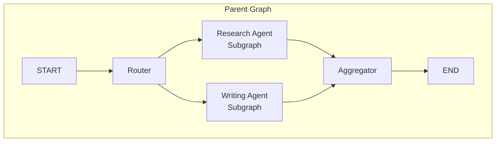

# Subgraphs and Composition

## Introduction

As agent systems grow in complexity, cramming everything into a single graph becomes unmaintainable. Subgraphs let you decompose large graphs into smaller, reusable components — each with their own nodes, edges, and optionally their own state schema. This is the foundation for multi-agent systems, modular workflows, and team-based development.

This lesson covers both approaches to subgraph composition: invoking a graph from inside a node (for different state schemas) and adding a compiled graph directly as a node (for shared state).

### What We'll Cover

- Why subgraphs matter for scalable agent design
- Invoking a graph from a node (different state schemas)
- Adding a graph as a node (shared state keys)
- Persistence in subgraphs
- Streaming from subgraphs
- Viewing and debugging subgraph state

### Prerequisites

- Completed [Core Concepts](./01-core-concepts.md) and [State Management](./03-state-management.md)
- Understanding of `StateGraph` compilation

---

## Why Subgraphs?

Subgraphs solve three problems in complex agent systems:



| Problem | How Subgraphs Help |
|---------|-------------------|
| **Complexity** | Break large graphs into manageable, focused components |
| **Reusability** | Use the same subgraph in multiple parent graphs |
| **Team development** | Different teams work on different subgraphs independently |

---

## Approach 1: Invoke a Graph from a Node

When the subgraph has a **different state schema** than the parent, invoke it from inside a node function. The node transforms state between the two schemas.

```python
from typing_extensions import TypedDict
from langgraph.graph import StateGraph, START, END


# --- Subgraph: has its own state schema ---
class SubgraphState(TypedDict):
    query: str
    result: str


def search(state: SubgraphState):
    return {"result": f"Found results for: {state['query']}"}


subgraph_builder = StateGraph(SubgraphState)
subgraph_builder.add_node("search", search)
subgraph_builder.add_edge(START, "search")
subgraph_builder.add_edge("search", END)
subgraph = subgraph_builder.compile()


# --- Parent graph: different state schema ---
class ParentState(TypedDict):
    topic: str
    search_results: str
    summary: str


def call_research_agent(state: ParentState):
    """Node that invokes the subgraph with state transformation."""
    # Transform: parent state → subgraph state
    subgraph_input = {"query": state["topic"]}
    
    # Invoke the subgraph
    subgraph_output = subgraph.invoke(subgraph_input)
    
    # Transform: subgraph state → parent state
    return {"search_results": subgraph_output["result"]}


def summarize(state: ParentState):
    return {"summary": f"Summary of {state['search_results']}"}


parent_builder = StateGraph(ParentState)
parent_builder.add_node("research", call_research_agent)
parent_builder.add_node("summarize", summarize)
parent_builder.add_edge(START, "research")
parent_builder.add_edge("research", "summarize")
parent_builder.add_edge("summarize", END)

parent_graph = parent_builder.compile()

result = parent_graph.invoke({"topic": "LangGraph subgraphs"})
print(result["summary"])
```

**Output:**
```
Summary of Found results for: LangGraph subgraphs
```

### When to Use This Approach

✅ Subgraph has a completely different state schema

✅ You need to transform data between parent and child

✅ The subgraph maintains private state (e.g., internal message history)

✅ Multi-agent systems where agents have independent state

---

## Approach 2: Add a Graph as a Node

When the parent and subgraph share state keys, add the compiled subgraph directly as a node. LangGraph automatically handles the state mapping.

```python
from typing_extensions import TypedDict
from langgraph.graph import StateGraph, START, END


# Shared state schema
class State(TypedDict):
    value: str


# --- Subgraph ---
def subgraph_step(state: State):
    return {"value": state["value"] + " → processed by subgraph"}


subgraph_builder = StateGraph(State)
subgraph_builder.add_node("step", subgraph_step)
subgraph_builder.add_edge(START, "step")
subgraph_builder.add_edge("step", END)
subgraph = subgraph_builder.compile()


# --- Parent graph ---
def prepare(state: State):
    return {"value": state["value"] + " → prepared"}


parent_builder = StateGraph(State)
parent_builder.add_node("prepare", prepare)
parent_builder.add_node("subgraph", subgraph)  # Add compiled graph as a node
parent_builder.add_edge(START, "prepare")
parent_builder.add_edge("prepare", "subgraph")
parent_builder.add_edge("subgraph", END)

parent_graph = parent_builder.compile()

result = parent_graph.invoke({"value": "input"})
print(result["value"])
```

**Output:**
```
input → prepared → processed by subgraph
```

### When to Use This Approach

✅ Parent and subgraph share state keys (e.g., `messages`)

✅ No state transformation needed

✅ Simpler setup — no wrapper node function

✅ Multi-agent systems where agents communicate through shared message lists

---

## Comparing the Two Approaches

| Feature | Invoke from Node | Add as Node |
|---------|-----------------|-------------|
| State schemas | Can be completely different | Must share key(s) |
| State transformation | Manual (in wrapper node) | Automatic |
| Code complexity | More boilerplate | Less boilerplate |
| Private subgraph state | ✅ Supported | ❌ Shared with parent |
| Use case | Independent agent state | Shared message passing |

---

## Persistence in Subgraphs

When using checkpointers, you only need to provide the checkpointer to the **parent graph**. LangGraph automatically propagates it to child subgraphs:

```python
from langgraph.checkpoint.memory import MemorySaver

# No checkpointer on the subgraph
subgraph = subgraph_builder.compile()

# Checkpointer on the parent only
parent_graph = parent_builder.compile(checkpointer=MemorySaver())

# Both parent and subgraph states are now checkpointed
```

### Independent Subgraph Memory

If you want a subgraph to maintain its own separate memory (e.g., private message history in a multi-agent system), compile it with `checkpointer=True`:

```python
# Subgraph with its own memory
subgraph = subgraph_builder.compile(checkpointer=True)

# Parent with its own checkpointer
parent_graph = parent_builder.compile(checkpointer=MemorySaver())
```

> **🔑 Key concept:** `checkpointer=True` on a subgraph tells LangGraph to give it an independent checkpoint namespace. The subgraph tracks its own state history separately from the parent.

---

## Streaming from Subgraphs

By default, streaming only shows parent graph outputs. Enable `subgraphs=True` to include subgraph outputs:

```python
for chunk in parent_graph.stream(
    {"value": "input"},
    subgraphs=True,
    stream_mode="updates",
):
    print(chunk)
```

**Output:**
```
((), {'prepare': {'value': 'input → prepared'}})
(('subgraph:abc123',), {'step': {'value': 'input → prepared → processed by subgraph'}})
```

The first element of each tuple is a namespace path. An empty tuple `()` means the parent graph; nested tuples show the subgraph path.

---

## Viewing Subgraph State

When a graph is interrupted (e.g., at a breakpoint or `interrupt()`), you can inspect subgraph state:

```python
# Get state including subgraph details
state = parent_graph.get_state(config, subgraphs=True)

# Access subgraph state
for task in state.tasks:
    if task.state:  # Subgraph state is available when interrupted
        print(f"Subgraph state: {task.state.values}")
```

> **Warning:** Subgraph state is only accessible when the subgraph is interrupted. Once the graph resumes, you can't access the subgraph's internal state directly.

---

## Multi-Agent Example

Here's a practical example of a multi-agent system using subgraphs:

```python
from langgraph.graph import StateGraph, START, END, MessagesState
from langchain_core.messages import AIMessage, HumanMessage


# --- Research Agent (Subgraph) ---
def research_agent_node(state: MessagesState):
    query = state["messages"][-1].content
    return {"messages": [AIMessage(
        content=f"[Research Agent] Found 3 papers on: {query}",
        name="researcher",
    )]}


research_agent = (
    StateGraph(MessagesState)
    .add_node("research", research_agent_node)
    .add_edge(START, "research")
    .add_edge("research", END)
    .compile()
)


# --- Writing Agent (Subgraph) ---
def writing_agent_node(state: MessagesState):
    context = state["messages"][-1].content
    return {"messages": [AIMessage(
        content=f"[Writing Agent] Drafted report based on: {context}",
        name="writer",
    )]}


writing_agent = (
    StateGraph(MessagesState)
    .add_node("write", writing_agent_node)
    .add_edge(START, "write")
    .add_edge("write", END)
    .compile()
)


# --- Orchestrator (Parent Graph) ---
def router(state: MessagesState):
    return {"messages": [AIMessage(
        content="Routing to research first, then writing.",
        name="orchestrator",
    )]}


orchestrator = StateGraph(MessagesState)
orchestrator.add_node("router", router)
orchestrator.add_node("researcher", research_agent)  # Subgraph as node
orchestrator.add_node("writer", writing_agent)       # Subgraph as node

orchestrator.add_edge(START, "router")
orchestrator.add_edge("router", "researcher")
orchestrator.add_edge("researcher", "writer")
orchestrator.add_edge("writer", END)

multi_agent = orchestrator.compile()

result = multi_agent.invoke({
    "messages": [HumanMessage(content="Write a report on AI agents")]
})

for msg in result["messages"]:
    if hasattr(msg, "name"):
        print(f"[{msg.name}] {msg.content}")
    else:
        print(f"[user] {msg.content}")
```

**Output:**
```
[user] Write a report on AI agents
[orchestrator] Routing to research first, then writing.
[researcher] [Research Agent] Found 3 papers on: Routing to research first, then writing.
[writer] [Writing Agent] Drafted report based on: [Research Agent] Found 3 papers on: ...
```

---

## Best Practices

| Practice | Why It Matters |
|----------|----------------|
| Use shared state (approach 2) for agents that communicate via messages | Simplest setup for multi-agent chat systems |
| Use invoke-from-node (approach 1) for agents with private state | Prevents internal state from leaking to parent |
| Only checkpoint the parent graph | LangGraph propagates checkpointers automatically |
| Use `subgraphs=True` when streaming | Otherwise subgraph outputs are hidden |
| Visualize with `xray=True` | Shows subgraph internals: `graph.get_graph(xray=True)` |

---

## Common Pitfalls

| ❌ Mistake | ✅ Solution |
|-----------|-------------|
| Adding checkpointer to both parent and subgraph | Add checkpointer to parent only — it propagates automatically |
| Forgetting state transformation in invoke-from-node | Transform input to subgraph schema and output back to parent schema |
| Not enabling `subgraphs=True` for streaming | Subgraph outputs are hidden by default |
| Sharing mutable state between subgraphs | Each subgraph should manage its own state; use messages for communication |
| Trying to view subgraph state after resume | Subgraph state is only accessible during interrupts |

---

## Hands-on Exercise

### Your Task

Build a multi-agent system with a research agent and a summary agent as subgraphs.

### Requirements

1. Create a research subgraph with its own `ResearchState` (different from parent)
2. Create a summary subgraph that shares `MessagesState` with the parent
3. The parent graph routes: START → research → summary → END
4. The research agent is invoked from a node (approach 1, state transformation)
5. The summary agent is added as a node directly (approach 2, shared state)
6. Stream the output with `subgraphs=True`

### Expected Result

```
Parent: Received query about "AI agents"
Research (subgraph): Found 5 papers on AI agents
Summary (subgraph): AI agents are autonomous systems that...
```

<details>
<summary>💡 Hints (click to expand)</summary>

- The research subgraph has `ResearchState(query, papers)` — different from `MessagesState`
- The wrapper node transforms `messages[-1].content` → `query` and `papers` → new message
- The summary subgraph uses `MessagesState` and can be added directly with `add_node`
- Use `subgraphs=True` in `graph.stream()` to see nested outputs

</details>

<details>
<summary>✅ Solution (click to expand)</summary>

```python
from typing_extensions import TypedDict
from langgraph.graph import StateGraph, START, END, MessagesState
from langchain_core.messages import AIMessage, HumanMessage


# Research subgraph (different state)
class ResearchState(TypedDict):
    query: str
    papers: list[str]


def find_papers(state: ResearchState):
    return {"papers": [f"Paper on {state['query']} #{i}" for i in range(1, 4)]}


research_subgraph = (
    StateGraph(ResearchState)
    .add_node("find", find_papers)
    .add_edge(START, "find")
    .add_edge("find", END)
    .compile()
)


# Summary subgraph (shared state)
def write_summary(state: MessagesState):
    context = state["messages"][-1].content
    return {"messages": [AIMessage(content=f"Summary: {context}", name="summarizer")]}


summary_subgraph = (
    StateGraph(MessagesState)
    .add_node("summarize", write_summary)
    .add_edge(START, "summarize")
    .add_edge("summarize", END)
    .compile()
)


# Parent graph
def call_research(state: MessagesState):
    query = state["messages"][-1].content
    result = research_subgraph.invoke({"query": query})
    papers_text = ", ".join(result["papers"])
    return {"messages": [AIMessage(content=f"Research findings: {papers_text}", name="researcher")]}


parent = StateGraph(MessagesState)
parent.add_node("research", call_research)        # Invoke from node
parent.add_node("summary", summary_subgraph)       # Add as node
parent.add_edge(START, "research")
parent.add_edge("research", "summary")
parent.add_edge("summary", END)

graph = parent.compile()

result = graph.invoke({"messages": [HumanMessage(content="AI agents")]})
for msg in result["messages"]:
    name = getattr(msg, "name", msg.type)
    print(f"[{name}] {msg.content}")
```

**Output:**
```
[human] AI agents
[researcher] Research findings: Paper on AI agents #1, Paper on AI agents #2, Paper on AI agents #3
[summarizer] Summary: Research findings: Paper on AI agents #1, Paper on AI agents #2, Paper on AI agents #3
```

</details>

### Bonus Challenges

- [ ] Add a checkpointer and test that subgraph state is persisted
- [ ] Use `graph.get_graph(xray=True).draw_ascii()` to visualize the full graph
- [ ] Add a third subgraph (editor agent) between research and summary

---

## Summary

✅ **Invoke from node** — for subgraphs with different state schemas (full control, requires state transformation)

✅ **Add as node** — for subgraphs sharing state keys (simpler, automatic state mapping)

✅ Persistence propagates automatically from parent to subgraphs

✅ Use `subgraphs=True` to include subgraph outputs in streaming

✅ Subgraphs are the foundation for scalable multi-agent architectures

**Next:** [Durable Execution](./09-durable-execution.md)

---

## Further Reading

- [LangGraph Subgraphs](https://docs.langchain.com/oss/python/langgraph/use-subgraphs) — Complete subgraph documentation
- [LangGraph Multi-Agent](https://docs.langchain.com/oss/python/langchain/multi-agent) — Multi-agent patterns
- [LangGraph Streaming](https://docs.langchain.com/oss/python/langgraph/streaming) — Streaming from subgraphs

*Back to [LangGraph Agent Orchestration](./00-langgraph-agent-orchestration.md)*

<!-- 
Sources Consulted:
- LangGraph Subgraphs: https://docs.langchain.com/oss/python/langgraph/use-subgraphs
- LangGraph Streaming: https://docs.langchain.com/oss/python/langgraph/streaming
- LangGraph Graph API: https://docs.langchain.com/oss/python/langgraph/graph-api
-->
