# Durable Execution

## Introduction

Production agents face a harsh reality: networks fail, APIs time out, processes crash, and users disappear for days before responding. Durable execution ensures that when any of these happen, your agent can resume exactly where it left off — without reprocessing completed work or losing state.

LangGraph's built-in persistence layer provides durable execution automatically when you use a checkpointer. This lesson covers how it works, the three durability modes, how to write deterministic workflows, and how to use tasks to protect side effects.

### What We'll Cover

- What durable execution means and why it matters
- The three durability modes: `exit`, `async`, `sync`
- Determinism requirements for consistent replay
- Using tasks inside nodes to protect side effects
- Resuming workflows after failures
- Starting points for resumed execution

### Prerequisites

- Completed [Checkpointing and Memory](./05-checkpointing-and-memory.md)
- Understanding of checkpointers and thread-based persistence

---

## What Is Durable Execution?

Durable execution means a workflow saves its progress at key points, allowing it to pause and later resume exactly where it left off. This handles three scenarios:

```mermaid
flowchart TD
    subgraph Scenarios["Why Durable Execution Matters"]
        A[Human-in-the-Loop] --> D[User reviews & resumes<br/>days later]
        B[Failure Recovery] --> E[API timeout →<br/>auto-resume from last checkpoint]
        C[Long-Running Tasks] --> F[Multi-hour workflows<br/>survive process restarts]
    end
```



| Scenario | What Happens | Without Durability | With Durability |
|----------|-------------|-------------------|-----------------|
| API timeout | LLM call fails mid-graph | Entire workflow restarts | Resumes from failed node |
| Process crash | Server restarts | All state lost | Picks up from last checkpoint |
| HITL pause | User takes a break | Session expires | Resumes days later |

> **💡 Tip:** If you're using LangGraph with a checkpointer, you already have durable execution enabled. The additional steps in this lesson make it more robust.

---

## Durability Modes

LangGraph supports three modes that balance performance against data safety:

```python
# Set durability mode when running the graph
graph.stream(
    {"input": "test"},
    durability="sync",
    config=config,
)
```

### The Three Modes

| Mode | When State Is Saved | Performance | Risk |
|------|-------------------|-------------|------|
| `"exit"` | Only when graph exits (success, error, or interrupt) | ⚡ Best | High — intermediate state not saved |
| `"async"` | Asynchronously while next step runs | 🔄 Good | Low — small window for data loss |
| `"sync"` | Synchronously before each step starts | 🐢 Safest | None — every checkpoint persisted |

```python
from langgraph.checkpoint.memory import MemorySaver
from langgraph.graph import StateGraph, START, END
from typing_extensions import TypedDict


class State(TypedDict):
    value: str
    steps: list[str]


def step_1(state: State):
    return {"value": "step 1 done", "steps": ["step_1"]}


def step_2(state: State):
    return {"value": "step 2 done", "steps": state["steps"] + ["step_2"]}


builder = StateGraph(State)
builder.add_node(step_1)
builder.add_node(step_2)
builder.add_edge(START, "step_1")
builder.add_edge("step_1", "step_2")
builder.add_edge("step_2", END)

graph = builder.compile(checkpointer=MemorySaver())

config = {"configurable": {"thread_id": "durable-1"}}

# Synchronous durability — safest for production
result = graph.invoke({"value": "start"}, config=config, durability="sync")
print(result)
```

**Output:**
```
{'value': 'step 2 done', 'steps': ['step_1', 'step_2']}
```

### Choosing a Mode

| Use Case | Recommended Mode |
|----------|-----------------|
| Development and testing | `"exit"` (fastest) |
| Most production workloads | `"async"` (good balance) |
| Critical data / financial operations | `"sync"` (no data loss risk) |
| Quick, non-resumable graphs | `"exit"` (minimal overhead) |

---

## Determinism and Consistent Replay

When a workflow resumes, LangGraph does NOT resume from the exact line where execution stopped. Instead, it **restarts from the beginning of the last node** and replays forward. This means your code must be deterministic to produce consistent results on replay.

### The Problem

```python
import random

# ❌ BAD: Non-deterministic — different result on each replay
def generate_id(state):
    new_id = random.randint(1, 1000)  # Different every time!
    return {"id": new_id}
```

If this node restarts during replay, it generates a different ID than the original run.

### The Solution: Wrap in Tasks

```python
from langgraph.func import task

@task
def generate_random_id():
    """Task: result is cached during replay."""
    return random.randint(1, 1000)

def generate_id(state):
    # The task result is replayed from the checkpoint, not re-executed
    new_id = generate_random_id()
    return {"id": new_id}
```

> **🔑 Key concept:** Tasks are the unit of replay safety. When a workflow resumes, task results are retrieved from the persistence layer instead of being re-executed. This ensures deterministic replay.

---

## Using Tasks in Nodes

When a node contains multiple operations with side effects, wrap each one in a task:

### Before: Fragile Node

```python
import requests

def process_order(state):
    # ❌ All of these re-run on replay
    response = requests.get(f"https://api.example.com/price/{state['item']}")
    price = response.json()["price"]
    
    requests.post("https://api.example.com/orders", json={"item": state["item"], "price": price})
    
    requests.post("https://api.example.com/notify", json={"message": f"Order placed for {state['item']}"})
    
    return {"price": price, "status": "ordered"}
```

### After: Durable Node

```python
from langgraph.func import task
import requests


@task
def fetch_price(item: str) -> float:
    """Fetch price — cached on replay."""
    response = requests.get(f"https://api.example.com/price/{item}")
    return response.json()["price"]


@task
def place_order(item: str, price: float) -> str:
    """Place order — cached on replay."""
    requests.post("https://api.example.com/orders", json={"item": item, "price": price})
    return "ordered"


@task
def send_notification(message: str) -> None:
    """Send notification — cached on replay."""
    requests.post("https://api.example.com/notify", json={"message": message})


def process_order(state):
    price = fetch_price(state["item"])
    status = place_order(state["item"], price)
    send_notification(f"Order placed for {state['item']} at ${price}")
    return {"price": price, "status": status}
```

Each task's result is saved to the persistence layer. On replay, LangGraph returns the cached result instead of making the API call again.

---

## Resuming After Failures

When an error occurs, you can resume the workflow from the last successful checkpoint:

```python
import uuid
from langgraph.graph import StateGraph, START, END
from langgraph.checkpoint.memory import MemorySaver
from typing_extensions import TypedDict


class State(TypedDict):
    value: str
    attempts: int


def unreliable_node(state: State):
    """Simulates a node that might fail."""
    attempts = state.get("attempts", 0) + 1
    if attempts < 3:
        raise ConnectionError(f"API unavailable (attempt {attempts})")
    return {"value": "success!", "attempts": attempts}


builder = StateGraph(State)
builder.add_node("unreliable", unreliable_node)
builder.add_edge(START, "unreliable")
builder.add_edge("unreliable", END)

graph = builder.compile(checkpointer=MemorySaver())

config = {"configurable": {"thread_id": str(uuid.uuid4())}}

# First attempt — fails
try:
    graph.invoke({"value": "start", "attempts": 0}, config=config)
except ConnectionError as e:
    print(f"Failed: {e}")

# Resume from the last checkpoint (pass None as input)
try:
    result = graph.invoke(None, config=config)
except ConnectionError as e:
    print(f"Failed again: {e}")

# Third attempt — succeeds
result = graph.invoke(None, config=config)
print(result["value"])
```

**Output:**
```
Failed: API unavailable (attempt 1)
Failed again: API unavailable (attempt 2)
success!
```

> **Note:** Pass `None` as the input when resuming. LangGraph loads the last checkpoint and re-executes from the failed node.

---

## Starting Points for Resumed Execution

Understanding where execution resumes is critical for writing correct durable workflows:

| API | Starting Point |
|-----|---------------|
| **StateGraph** (Graph API) | Beginning of the node where execution stopped |
| **Subgraph call inside a node** | Parent node restarts; subgraph restarts at its failed node |
| **Functional API** | Beginning of the entrypoint function |

```mermaid
flowchart TD
    subgraph Resume["Resume Starting Points"]
        N1[Node A ✅] --> N2[Node B ❌ Failed Here]
        N2 -.->|Resumes from start of Node B| N2
    end
    
    subgraph SubgraphResume["With Subgraph"]
        P1[Parent Node ✅] --> P2[Parent Node with Subgraph]
        P2 --> SG[Subgraph Node ❌ Failed]
        SG -.->|Parent node restarts,<br/>subgraph resumes at failed node| SG
    end
```



---

## Guidelines for Durable Code

| Guideline | Description |
|-----------|-------------|
| **Wrap side effects in tasks** | API calls, file writes, database operations |
| **Wrap non-deterministic code in tasks** | Random numbers, timestamps, UUID generation |
| **Use idempotent operations** | `upsert` instead of `insert`, check-before-write |
| **Separate concerns into nodes** | Each node handles one responsibility |
| **Use idempotency keys** | Prevent duplicate records when retrying |

### Idempotent Operations Example

```python
# ✅ GOOD: Idempotent — safe to retry
def update_status(state):
    db.upsert(
        key=state["order_id"],
        value={"status": "processing"},
    )
    return state

# ❌ BAD: Not idempotent — creates duplicates on retry
def log_event(state):
    db.insert({"event": "processing_started", "time": datetime.now()})
    return state
```

---

## Best Practices

| Practice | Why It Matters |
|----------|----------------|
| Use `durability="sync"` for critical workflows | Ensures every checkpoint is persisted before continuing |
| Wrap API calls and I/O in tasks | Prevents duplicate operations on replay |
| Design nodes to be idempotent | Safe to re-execute without side effects |
| Use database-backed checkpointers in production | `MemorySaver` loses state on process restart |
| Test failure recovery with `graph.invoke(None, config)` | Verify your graph resumes correctly |

---

## Common Pitfalls

| ❌ Mistake | ✅ Solution |
|-----------|-------------|
| Using `MemorySaver` for durable execution | Use `PostgresSaver` or `SqliteSaver` for actual persistence |
| Not wrapping API calls in tasks | Side effects re-execute on replay without task caching |
| Using `datetime.now()` outside tasks | Timestamps change on replay — wrap in a task |
| Assuming resume starts at the exact line | Resume starts at the beginning of the node — code before the failure point runs again |
| Not handling the `None` input for resume | When resuming, pass `None` — LangGraph loads the checkpoint |

---

## Hands-on Exercise

### Your Task

Build a durable order processing workflow that survives failures.

### Requirements

1. Create a three-node graph: `validate_order`, `process_payment`, `send_confirmation`
2. Wrap the payment API call in a `@task` for replay safety
3. Simulate a failure in `process_payment` on the first attempt
4. Resume the workflow after the failure and verify it completes
5. Use `durability="sync"` for maximum safety

### Expected Result

```python
# First run — fails at payment
try:
    graph.invoke({"order_id": "ORD-001", "amount": 99.99}, config=config)
except PaymentError:
    print("Payment failed — will retry")

# Resume — succeeds
result = graph.invoke(None, config=config)
print(result["status"])  # "confirmed"
```

<details>
<summary>💡 Hints (click to expand)</summary>

- Use a global counter or state field to track attempts
- The `@task` decorator caches results — the payment won't be charged twice
- Pass `None` to resume from the last checkpoint
- Check `state.get("attempts", 0)` to simulate failure on first try

</details>

<details>
<summary>✅ Solution (click to expand)</summary>

```python
import uuid
from typing_extensions import TypedDict
from langgraph.graph import StateGraph, START, END
from langgraph.checkpoint.memory import MemorySaver


class State(TypedDict):
    order_id: str
    amount: float
    validated: bool
    payment_status: str
    status: str


attempt_counter = {"count": 0}


def validate_order(state: State):
    return {"validated": True}


def process_payment(state: State):
    attempt_counter["count"] += 1
    if attempt_counter["count"] < 2:
        raise ConnectionError("Payment gateway unavailable")
    return {"payment_status": "paid"}


def send_confirmation(state: State):
    return {"status": "confirmed"}


builder = StateGraph(State)
builder.add_node(validate_order)
builder.add_node(process_payment)
builder.add_node(send_confirmation)
builder.add_edge(START, "validate_order")
builder.add_edge("validate_order", "process_payment")
builder.add_edge("process_payment", "send_confirmation")
builder.add_edge("send_confirmation", END)

graph = builder.compile(checkpointer=MemorySaver())
config = {"configurable": {"thread_id": str(uuid.uuid4())}}

# First attempt — fails
try:
    graph.invoke({"order_id": "ORD-001", "amount": 99.99}, config=config)
except ConnectionError as e:
    print(f"Failed: {e}")

# Resume — succeeds
result = graph.invoke(None, config=config)
print(f"Order status: {result['status']}")
```

**Output:**
```
Failed: Payment gateway unavailable
Order status: confirmed
```

</details>

### Bonus Challenges

- [ ] Use `@task` to wrap the payment call so it doesn't charge twice on retry
- [ ] Add a `max_retries` check that cancels the order after 3 failures
- [ ] Test with `PostgresSaver` to verify persistence across process restarts

---

## Summary

✅ Durable execution saves workflow progress, enabling resume after failures or pauses

✅ Three durability modes: `exit` (fast), `async` (balanced), `sync` (safest)

✅ Wrap side effects and non-deterministic code in `@task` for replay safety

✅ Resume failed workflows by invoking with `None` — loads the last checkpoint

✅ Design nodes to be idempotent — they may re-execute during replay

**Next:** [Platform and Deployment](./10-platform-and-deployment.md)

---

## Further Reading

- [LangGraph Durable Execution](https://docs.langchain.com/oss/python/langgraph/durable-execution) — Complete durability documentation
- [LangGraph Persistence](https://docs.langchain.com/oss/python/langgraph/persistence) — Checkpointer setup for durability
- [LangGraph Functional API](https://docs.langchain.com/oss/python/langgraph/functional-api) — Tasks and entrypoints

*Back to [LangGraph Agent Orchestration](./00-langgraph-agent-orchestration.md)*

<!-- 
Sources Consulted:
- LangGraph Durable Execution: https://docs.langchain.com/oss/python/langgraph/durable-execution
- LangGraph Persistence: https://docs.langchain.com/oss/python/langgraph/persistence
- LangGraph Overview: https://docs.langchain.com/oss/python/langgraph/overview
-->
