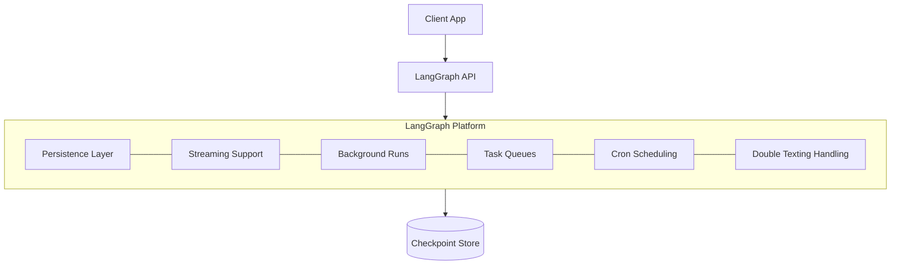
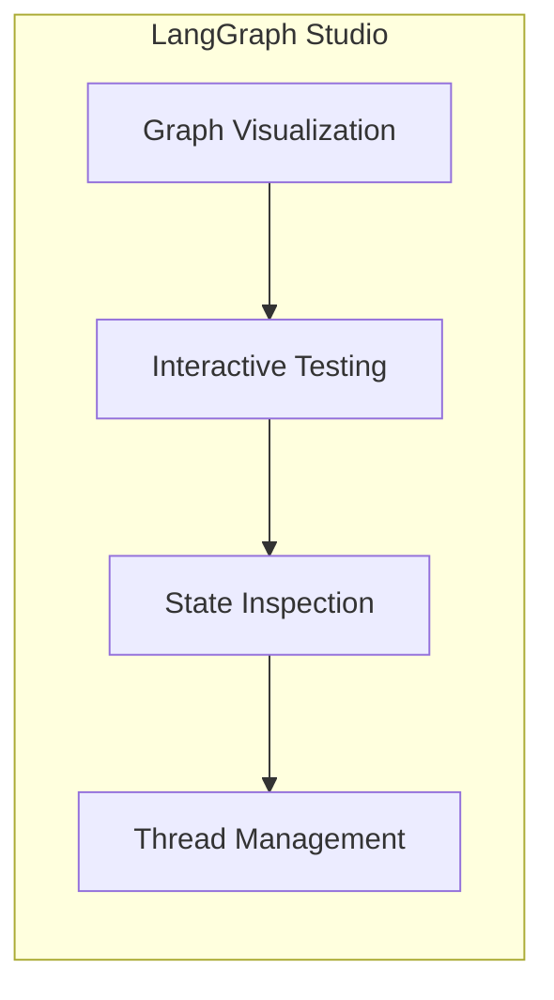

# Platform and Deployment

## Introduction

Building a LangGraph agent on your laptop is just the beginning. To serve real users, you need to deploy your agent as a production service with persistent state, streaming support, and monitoring. LangGraph Platform provides purpose-built infrastructure for deploying stateful agents, while the LangGraph SDK gives you a client library to interact with deployed graphs.

This lesson covers the LangGraph Platform architecture, application configuration, deployment options, and how to connect to your deployed agents using the SDK.

### What We'll Cover

- LangGraph Platform architecture and components
- Application structure and configuration with `langgraph.json`
- Deployment options (Cloud, self-hosted, standalone)
- Using LangGraph Studio for testing
- Connecting with the LangGraph SDK
- Production monitoring with LangSmith

### Prerequisites

- Understanding of all previous LangGraph concepts (state, checkpointing, streaming)
- Familiarity with Git and GitHub for deployment

---

## LangGraph Platform Overview

LangGraph Platform is a deployment service built specifically for stateful, long-running agent applications. Unlike general-purpose serverless platforms, it provides:



| Feature | Description |
|---------|-------------|
| **Persistence** | Built-in checkpointer — no database setup needed |
| **Streaming** | All 5 stream modes available over HTTP |
| **Background runs** | Long-running tasks don't block your API |
| **Task queues** | Manage concurrent agent executions |
| **Cron jobs** | Schedule recurring agent tasks |
| **Double texting** | Handle users sending messages while agent is thinking |

> **🤖 AI Context:** Traditional web servers are request-response (seconds). AI agents run for minutes or hours, need persistent memory, and stream partial results. LangGraph Platform is designed for this.

---

## Application Structure

Every LangGraph deployment needs a `langgraph.json` configuration file and a Python project with your graph code.

### Directory Layout

```
my-agent/
├── langgraph.json          # Configuration file
├── requirements.txt        # Python dependencies
├── .env                    # Environment variables (local)
└── src/
    └── agent/
        ├── __init__.py
        ├── graph.py        # Your graph definition
        └── tools.py        # Tool definitions
```

### The `langgraph.json` File

This is the entry point for LangGraph Platform. It tells the platform where to find your graph(s) and what dependencies to install:

```json
{
  "dependencies": ["."],
  "graphs": {
    "my_agent": "./src/agent/graph.py:graph"
  },
  "env": ".env"
}
```

| Field | Description | Example |
|-------|-------------|---------|
| `dependencies` | Python packages or local paths | `["."]` or `["./libs/common"]` |
| `graphs` | Named graphs with module paths | `"name": "path/to/module.py:variable"` |
| `env` | Path to environment variables file | `".env"` |

### Graph Module

The graph variable referenced in `langgraph.json` must be a compiled `CompiledStateGraph`:

```python
# src/agent/graph.py
from langgraph.graph import StateGraph, START, END
from langgraph.prebuilt import create_react_agent
from langchain_openai import ChatOpenAI
from langchain_core.tools import tool


@tool
def search(query: str) -> str:
    """Search the web for information."""
    return f"Results for: {query}"


@tool
def calculator(expression: str) -> str:
    """Evaluate a math expression."""
    return str(eval(expression))


model = ChatOpenAI(model="gpt-4o-mini")

# This variable is referenced in langgraph.json
graph = create_react_agent(
    model,
    tools=[search, calculator],
    prompt="You are a helpful research assistant.",
)
```

### Multiple Graphs

You can deploy multiple graphs in a single application:

```json
{
  "dependencies": ["."],
  "graphs": {
    "research_agent": "./src/agents/research.py:graph",
    "coding_agent": "./src/agents/coding.py:graph",
    "chat_agent": "./src/agents/chat.py:graph"
  }
}
```

Each graph gets its own API endpoint:

```
POST /runs/stream  (specify assistant_id for the graph)
```

---

## Deployment Options

LangGraph Platform offers three deployment paths:

| Option | Best For | Infrastructure |
|--------|----------|---------------|
| **Cloud (LangSmith)** | Most teams | Fully managed by LangChain |
| **Self-hosted** | Enterprise / compliance | Your cloud, LangChain license |
| **Standalone** | Development / testing | Local machine or any server |

### Cloud Deployment (LangSmith)

The simplest path — deploy directly from a GitHub repository:

#### Step 1: Push Code to GitHub

```bash
# Initialize and push your project
git init
git add .
git commit -m "Initial agent deployment"
git remote add origin https://github.com/your-org/my-agent.git
git push -u origin main
```

#### Step 2: Deploy from LangSmith

1. Go to [LangSmith](https://smith.langchain.com)
2. Navigate to **Deployments** → **New Deployment**
3. Connect your GitHub repository
4. Select the branch and `langgraph.json` path
5. Add environment variables (API keys)
6. Click **Deploy**

#### Step 3: Get Your API URL

After deployment, LangSmith provides:
- **API URL**: `https://your-deployment-id.us.langgraph.app`
- **API Key**: For authentication

```python
# Test your deployed agent
from langgraph_sdk import get_client

client = get_client(
    url="https://your-deployment-id.us.langgraph.app",
    api_key="your-langsmith-api-key",
)
```

### Standalone Server (Development)

Run the LangGraph server locally for development and testing:

```bash
# Install the CLI
pip install -U "langgraph-cli[inmem]"

# Start the development server
langgraph dev
```

This starts a local server at `http://localhost:2024` with:
- Hot reloading on code changes
- In-memory checkpointer (no database needed)
- LangGraph Studio UI at `http://localhost:2024/studio`

---

## LangGraph Studio

LangGraph Studio provides a visual interface for testing and debugging your agents:



### Key Features

| Feature | Description |
|---------|-------------|
| **Graph view** | Visual representation of your graph topology |
| **Chat interface** | Send messages and see streaming responses |
| **State inspector** | View checkpoint state at any point |
| **Thread browser** | List, filter, and manage conversation threads |
| **Interrupt handling** | Approve/reject human-in-the-loop requests |

### Accessing Studio

```bash
# Local development
langgraph dev
# Open browser to http://localhost:2024/studio

# Cloud deployment
# Studio is available in the LangSmith UI under Deployments
```

> **💡 Tip:** Studio is invaluable for debugging. Use it to step through your graph execution, inspect state at each checkpoint, and test HITL interrupts interactively.

---

## LangGraph SDK

The LangGraph SDK provides a Python client for interacting with deployed LangGraph agents:

```bash
pip install langgraph-sdk
```

### Creating a Client

```python
from langgraph_sdk import get_client

# For cloud deployment
client = get_client(
    url="https://your-deployment-id.us.langgraph.app",
    api_key="your-api-key",
)

# For local development
client = get_client(url="http://localhost:2024")
```

### Creating Threads and Running Agents

```python
import asyncio
from langgraph_sdk import get_client


async def run_agent():
    client = get_client(url="http://localhost:2024")

    # Create a thread (conversation)
    thread = await client.threads.create()
    print(f"Thread ID: {thread['thread_id']}")

    # Run the agent
    input_data = {
        "messages": [{"role": "user", "content": "What is the weather in Tokyo?"}]
    }

    # Stream the response
    async for event in client.runs.stream(
        thread["thread_id"],
        assistant_id="my_agent",  # Matches the key in langgraph.json
        input=input_data,
        stream_mode="messages",
    ):
        if event.event == "messages/partial":
            for msg in event.data:
                if msg.get("type") == "ai":
                    print(msg.get("content", ""), end="", flush=True)

    print()  # Newline after streaming

asyncio.run(run_agent())
```

### Background Runs

For long-running tasks, use background runs that don't block:

```python
async def background_example():
    client = get_client(url="http://localhost:2024")
    thread = await client.threads.create()

    # Start a background run
    run = await client.runs.create(
        thread["thread_id"],
        assistant_id="my_agent",
        input={"messages": [{"role": "user", "content": "Research quantum computing"}]},
    )
    print(f"Run started: {run['run_id']}")

    # Check status later
    status = await client.runs.get(thread["thread_id"], run["run_id"])
    print(f"Status: {status['status']}")

    # Wait for completion
    result = await client.runs.join(thread["thread_id"], run["run_id"])
    print(f"Result: {result}")
```

### Managing Threads

```python
async def thread_management():
    client = get_client(url="http://localhost:2024")

    # List threads
    threads = await client.threads.search(limit=10)
    for t in threads:
        print(f"Thread: {t['thread_id']}, Created: {t['created_at']}")

    # Get thread state
    thread_id = threads[0]["thread_id"]
    state = await client.threads.get_state(thread_id)
    print(f"State: {state['values']}")

    # Delete a thread
    await client.threads.delete(thread_id)
```

---

## Production Monitoring with LangSmith

When deployed to LangGraph Cloud, every run is automatically traced in LangSmith:

| Monitoring Feature | What It Shows |
|-------------------|---------------|
| **Traces** | Full execution path through nodes |
| **Latency** | Time spent in each node and LLM call |
| **Token usage** | Input/output tokens per LLM call |
| **Errors** | Failed runs with stack traces |
| **Feedback** | User ratings and corrections |

### Adding Custom Metadata

```python
config = {
    "configurable": {"thread_id": "user-123"},
    "metadata": {
        "user_id": "user-123",
        "session_type": "support",
        "priority": "high",
    },
}

result = graph.invoke(input_data, config=config)
```

Metadata appears in LangSmith traces, making it easy to filter and search runs.

---

## Best Practices

| Practice | Why It Matters |
|----------|----------------|
| Use `langgraph dev` for local testing | Fast iteration with hot reloading |
| Keep `langgraph.json` minimal | Only list graphs you want to expose |
| Use environment variables for secrets | Never hardcode API keys |
| Test with Studio before deploying | Catch graph logic issues visually |
| Add metadata to runs | Enables filtering and debugging in LangSmith |
| Use background runs for long tasks | Prevents HTTP timeouts |

---

## Common Pitfalls

| ❌ Mistake | ✅ Solution |
|-----------|-------------|
| Hardcoding API keys in graph code | Use `.env` files and `os.environ` |
| Forgetting to export the compiled graph variable | Ensure `langgraph.json` points to the correct `module:variable` |
| Not testing locally before deploying | Use `langgraph dev` to verify your graph works |
| Using `MemorySaver` in production deployments | LangGraph Platform provides persistence — you don't need to specify a checkpointer |
| Ignoring streaming in the SDK | Always use `client.runs.stream()` for responsive UIs |
| Not setting `assistant_id` in SDK calls | Must match a key from the `graphs` section in `langgraph.json` |

---

## Hands-on Exercise

### Your Task

Set up a LangGraph application structure ready for deployment.

### Requirements

1. Create the directory structure for a LangGraph project
2. Write a `langgraph.json` configuration with two graphs: a `chat_agent` and a `research_agent`
3. Implement the `chat_agent` as a simple `create_react_agent` with a greeting tool
4. Write SDK client code that creates a thread and streams a response
5. Include a `.env.example` file listing required environment variables

### Expected Result

```
my-langgraph-app/
├── langgraph.json
├── requirements.txt
├── .env.example
└── src/
    └── agents/
        ├── __init__.py
        ├── chat.py          # Chat agent graph
        ├── research.py      # Research agent graph (stub)
        └── client_example.py # SDK usage example
```

<details>
<summary>💡 Hints (click to expand)</summary>

- The `langgraph.json` `graphs` key maps names to `"path:variable"` strings
- Use `create_react_agent` for quick graph creation
- The SDK client needs `url` and optionally `api_key`
- Use `client.runs.stream()` with `stream_mode="messages"` for chat

</details>

<details>
<summary>✅ Solution (click to expand)</summary>

**langgraph.json:**
```json
{
  "dependencies": ["."],
  "graphs": {
    "chat_agent": "./src/agents/chat.py:graph",
    "research_agent": "./src/agents/research.py:graph"
  },
  "env": ".env"
}
```

**src/agents/chat.py:**
```python
from langgraph.prebuilt import create_react_agent
from langchain_openai import ChatOpenAI
from langchain_core.tools import tool


@tool
def greet(name: str) -> str:
    """Greet a user by name."""
    return f"Hello, {name}! How can I help you today?"


model = ChatOpenAI(model="gpt-4o-mini")

graph = create_react_agent(
    model,
    tools=[greet],
    prompt="You are a friendly assistant. Use the greet tool when users introduce themselves.",
)
```

**src/agents/client_example.py:**
```python
import asyncio
from langgraph_sdk import get_client


async def main():
    client = get_client(url="http://localhost:2024")
    
    thread = await client.threads.create()
    
    input_data = {
        "messages": [{"role": "user", "content": "Hi, my name is Alice!"}]
    }
    
    async for event in client.runs.stream(
        thread["thread_id"],
        assistant_id="chat_agent",
        input=input_data,
        stream_mode="messages",
    ):
        if event.event == "messages/partial":
            for msg in event.data:
                if msg.get("type") == "ai":
                    print(msg.get("content", ""), end="", flush=True)
    
    print()


if __name__ == "__main__":
    asyncio.run(main())
```

**.env.example:**
```
OPENAI_API_KEY=sk-your-key-here
LANGSMITH_API_KEY=lsv2-your-key-here
```

</details>

### Bonus Challenges

- [ ] Add a `Dockerfile` for self-hosted deployment
- [ ] Implement the `research_agent` with web search and summarization tools
- [ ] Add a health check endpoint that verifies all graphs load correctly

---

## Summary

✅ LangGraph Platform provides purpose-built infrastructure for stateful agent deployment

✅ `langgraph.json` configures your application — mapping graph names to Python modules

✅ Three deployment options: Cloud (LangSmith), Self-hosted, and Standalone (`langgraph dev`)

✅ LangGraph Studio provides visual testing and debugging for your graphs

✅ The LangGraph SDK (`langgraph-sdk`) enables streaming, thread management, and background runs

**Next:** [CrewAI with Flows](../13-crewai-with-flows/00-crewai-with-flows.md)

---

## Further Reading

- [LangGraph Platform Docs](https://docs.langchain.com/oss/python/langgraph/deploy) — Deployment documentation
- [LangGraph Application Structure](https://docs.langchain.com/oss/python/langgraph/application-structure) — Configuration reference
- [LangGraph SDK Reference](https://docs.langchain.com/oss/python/langgraph/sdk) — Client library documentation
- [LangSmith](https://smith.langchain.com) — Monitoring and deployment platform

*Back to [LangGraph Agent Orchestration](./00-langgraph-agent-orchestration.md)*

<!-- 
Sources Consulted:
- LangGraph Deploy: https://docs.langchain.com/oss/python/langgraph/deploy
- LangGraph Application Structure: https://docs.langchain.com/oss/python/langgraph/application-structure
- LangGraph Overview: https://docs.langchain.com/oss/python/langgraph/overview
-->
