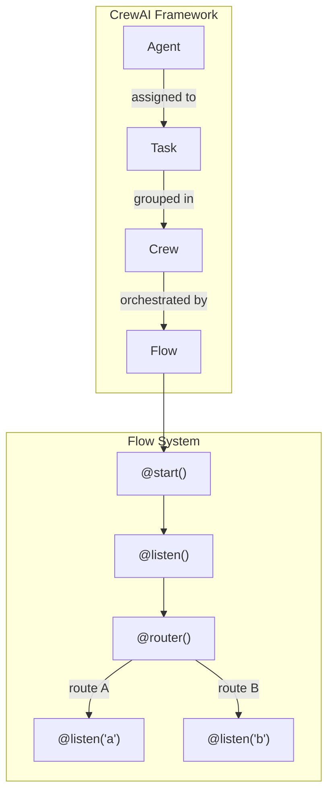

# CrewAI with Flows

## Overview

CrewAI is a multi-agent framework that enables you to build teams of AI agents — called **Crews** — that collaborate on complex tasks. In 2025, CrewAI introduced **Flows**, an event-driven orchestration system that lets you chain crews, manage state, and control execution flow with Python decorators.

This lesson covers everything from CrewAI's core building blocks (Agents, Tasks, Crews) through the Flow system's architecture, state management, human feedback, streaming, and production deployment.

### Why CrewAI?

| Feature | CrewAI | LangGraph | OpenAI Agents SDK |
|---------|--------|-----------|-------------------|
| **Primary paradigm** | Role-based agents in crews | Graph-based state machines | Handoff-based agents |
| **Orchestration** | Flows (event-driven) | StateGraph (nodes/edges) | Runner (handoff loop) |
| **Multi-agent** | Built-in (Crew) | Manual (subgraphs) | Handoffs |
| **State management** | Pydantic models + @persist | Annotated reducers | Context variables |
| **Learning curve** | Low (decorator-based) | Medium (graph concepts) | Low (minimal API) |
| **Best for** | Role-based collaboration | Complex stateful workflows | Simple production agents |

### Prerequisites

- Completed [LangGraph Agent Orchestration](../12-langgraph-agent-orchestration/00-langgraph-agent-orchestration.md) (recommended)
- Python 3.10+ and familiarity with decorators
- Understanding of AI agent concepts from earlier lessons

### Installation

```bash
pip install -U crewai crewai-tools
```

Or create a new project with the CLI:

```bash
crewai create flow my_project
```

---

## Sub-Lessons

| # | Topic | Description |
|---|-------|-------------|
| 01 | [Core Concepts](./01-core-concepts.md) | Agents, Tasks, Crews, and Process types |
| 02 | [Flow System Architecture](./02-flow-system-architecture.md) | Event-driven workflows with @start, @listen, @router |
| 03 | [Flow Decorators in Depth](./03-flow-decorators-in-depth.md) | @start(), @listen(), @router(), or_(), and_() |
| 04 | [State Management in Flows](./04-state-management-in-flows.md) | Structured and unstructured state, @persist |
| 05 | [Crews Within Flows](./05-crews-within-flows.md) | Integrating Crew.kickoff() into flow methods |
| 06 | [Knowledge and Memory](./06-knowledge-and-memory.md) | Short-term, long-term, entity memory, and RAG |
| 07 | [CrewAI Tools](./07-crewai-tools.md) | Built-in tools, custom @tool, async tools |
| 08 | [Production Deployment](./08-production-deployment.md) | Enterprise features, monitoring, error handling |
| 09 | [Human Feedback Decorator](./09-human-feedback-decorator.md) | @human_feedback for approval gates and routing |
| 10 | [Flow Plotting and Visualization](./10-flow-plotting-and-visualization.md) | flow.plot(), CLI commands, interactive diagrams |
| 11 | [Streaming Flow Execution](./11-streaming-flow-execution.md) | Real-time output with stream=True |
| 12 | [Agent Within Flow](./12-agent-within-flow.md) | Direct Agent use without Crew wrappers |
| 13 | [A2A Protocol Integration](./13-a2a-protocol-integration.md) | Cross-framework agent-to-agent communication |
| 14 | [Native Async Support](./14-native-async-support.md) | async/await patterns across the framework |
| 15 | [HITL for Flows](./15-hitl-for-flows.md) | Global human feedback, events, and listeners |

---

## Key Concepts at a Glance



| Concept | Description |
|---------|-------------|
| **Agent** | An AI entity with a role, goal, and backstory |
| **Task** | A specific assignment with description and expected output |
| **Crew** | A team of agents collaborating on tasks |
| **Flow** | An event-driven workflow orchestrating crews and code |
| **@start()** | Marks entry points for a flow |
| **@listen()** | Triggers a method when another method completes |
| **@router()** | Routes execution based on return value |

---

## Learning Path

1. **Start with fundamentals** (Lessons 01–03): Understand Agents, Tasks, Crews, and how Flows work
2. **Master flow mechanics** (Lessons 03–05): Decorators, state, and crew integration
3. **Add capabilities** (Lessons 06–07): Knowledge, memory, and tools
4. **Go to production** (Lessons 08–10): Deployment, human feedback, visualization
5. **Advanced features** (Lessons 11–15): Streaming, A2A, async, and advanced HITL

---

## Summary

✅ CrewAI provides role-based multi-agent collaboration with Agents, Tasks, and Crews

✅ Flows add event-driven orchestration using Python decorators (@start, @listen, @router)

✅ 15 sub-lessons cover everything from basics to A2A protocol integration

✅ CrewAI excels at structured, role-based collaboration with low boilerplate

**Next:** [Core Concepts](./01-core-concepts.md)

---

*Back to [Unit 11 Overview](../00-overview.md)*

<!-- 
Sources Consulted:
- CrewAI Flows: https://docs.crewai.com/concepts/flows
- CrewAI Tasks: https://docs.crewai.com/concepts/tasks
- CrewAI Crews: https://docs.crewai.com/concepts/crews
- CrewAI Tools: https://docs.crewai.com/concepts/tools
- CrewAI Memory: https://docs.crewai.com/concepts/memory
-->
