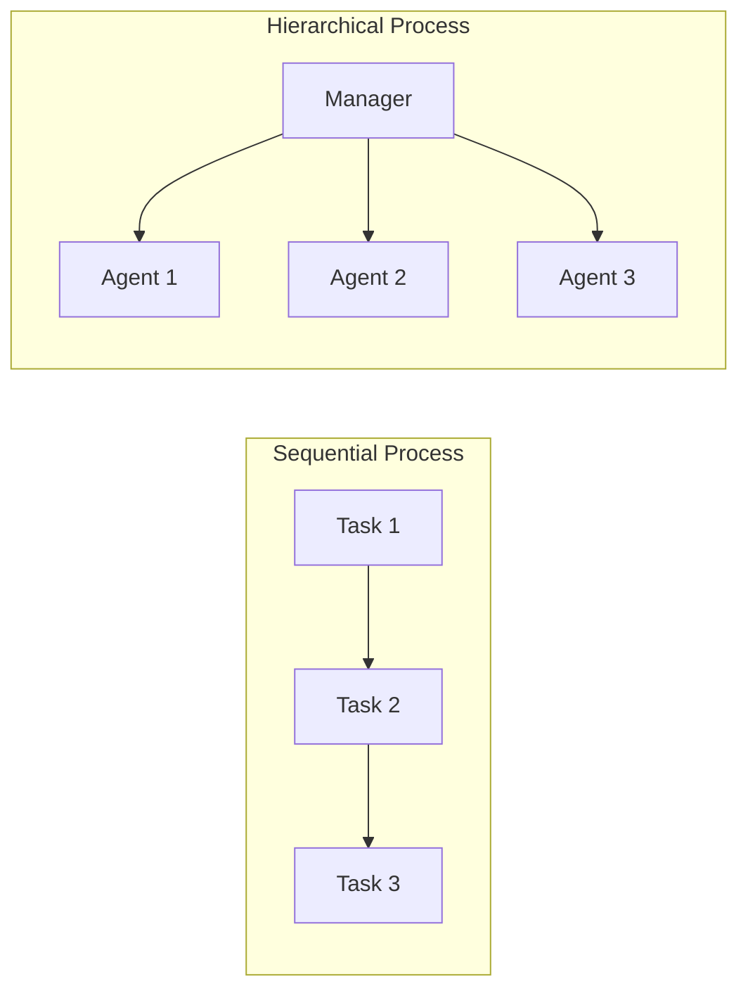

# Core Concepts

## Introduction

Every CrewAI application is built from three foundational building blocks: **Agents** (who), **Tasks** (what), and **Crews** (how). Understanding these concepts is essential before working with Flows, as Flows orchestrate crews — and crews are composed of agents performing tasks.

This lesson covers how to define agents with personalities and capabilities, create tasks with clear expectations, and assemble crews that collaborate effectively.

### What We'll Cover

- Defining Agents with roles, goals, and backstories
- Creating Tasks with descriptions and expected outputs
- Assembling Crews with process types
- Sequential vs hierarchical execution
- Agent delegation and collaboration
- YAML configuration vs direct code definition

### Prerequisites

- Python 3.10+ with CrewAI installed (`pip install crewai crewai-tools`)
- An OpenAI API key (or another supported LLM provider)

---

## Agents

An **Agent** in CrewAI is an AI entity with a distinct identity and purpose. Each agent has three defining characteristics:

| Attribute | Purpose | Example |
|-----------|---------|---------|
| `role` | The agent's job title / function | "Senior Research Analyst" |
| `goal` | What the agent is trying to achieve | "Find and analyze emerging AI trends" |
| `backstory` | Context that shapes the agent's behavior | "10 years at a top consulting firm..." |

```python
from crewai import Agent

researcher = Agent(
    role="Senior Research Analyst",
    goal="Find and analyze the latest AI trends with data-backed insights",
    backstory="""You are a senior research analyst at a leading tech advisory firm.
    You have 10 years of experience tracking AI industry developments and are known
    for your thorough, data-driven analysis.""",
    verbose=True,
    llm="gpt-4o-mini",
)
```

### Key Agent Attributes

| Attribute | Type | Default | Description |
|-----------|------|---------|-------------|
| `role` | `str` | Required | The agent's function in the crew |
| `goal` | `str` | Required | What the agent aims to accomplish |
| `backstory` | `str` | Required | Context shaping behavior and expertise |
| `llm` | `str` | `"gpt-4o"` | Language model to use |
| `tools` | `list` | `[]` | Tools available to the agent |
| `verbose` | `bool` | `False` | Print detailed execution logs |
| `allow_delegation` | `bool` | `True` | Can delegate tasks to other crew members |
| `memory` | `bool` | `True` | Whether agent uses memory |
| `max_iter` | `int` | `25` | Maximum iterations for task completion |

### Why Backstories Matter

The backstory is not just flavor text — it directly influences how the LLM approaches problems. Compare these two agents given the same research task:

```python
# Agent A: Generic backstory
generic_agent = Agent(
    role="Researcher",
    goal="Research AI trends",
    backstory="You are a researcher.",
)

# Agent B: Rich backstory
expert_agent = Agent(
    role="Senior AI Research Analyst",
    goal="Uncover non-obvious AI trends backed by data",
    backstory="""You spent 10 years at McKinsey analyzing technology markets.
    You're known for identifying trends 6 months before they go mainstream.
    You always cite specific data points and never make unsupported claims.""",
)
```

Agent B will produce more detailed, data-driven output because the LLM uses the backstory as behavioral context.

> **🤖 AI Context:** The role, goal, and backstory are injected into the system prompt for every LLM call. A well-crafted backstory is essentially prompt engineering at the agent level.

---

## Tasks

A **Task** is a specific assignment given to an agent. Every task needs two required fields:

```python
from crewai import Task

research_task = Task(
    description="""Research the latest developments in AI agents for 2025.
    Focus on multi-agent frameworks, tool use, and production deployment.
    Find at least 5 specific examples with adoption metrics.""",
    expected_output="""A structured report with:
    - 5 key developments with descriptions
    - Adoption metrics for each
    - Analysis of implications for developers""",
    agent=researcher,
)
```

### Task Attributes

| Attribute | Type | Description |
|-----------|------|-------------|
| `description` | `str` | What the agent should do (be specific) |
| `expected_output` | `str` | What success looks like (format and content) |
| `agent` | `Agent` | The agent responsible for this task |
| `tools` | `list` | Tools available for this task (overrides agent tools) |
| `context` | `list[Task]` | Other tasks whose output feeds into this one |
| `output_pydantic` | `BaseModel` | Pydantic model for structured output |
| `output_json` | `BaseModel` | Pydantic model for JSON output |
| `output_file` | `str` | File path to save the output |
| `async_execution` | `bool` | Run asynchronously (default: `False`) |
| `human_input` | `bool` | Require human approval before completing |
| `guardrail` | `Callable` | Validation function for output quality |
| `markdown` | `bool` | Format output as Markdown |

### Structured Output with Pydantic

```python
from pydantic import BaseModel
from crewai import Task


class ResearchReport(BaseModel):
    title: str
    findings: list[str]
    recommendation: str


research_task = Task(
    description="Research the top 3 AI agent frameworks for 2025",
    expected_output="A structured research report",
    agent=researcher,
    output_pydantic=ResearchReport,
)
```

### Task Guardrails

Guardrails validate task output before passing it to the next task:

```python
from crewai import Task, TaskOutput


def validate_word_count(result: TaskOutput) -> tuple[bool, any]:
    """Ensure output has at least 100 words."""
    word_count = len(result.raw.split())
    if word_count < 100:
        return (False, f"Too short: {word_count} words. Need at least 100.")
    return (True, result.raw)


report_task = Task(
    description="Write a detailed analysis of AI trends",
    expected_output="A 200+ word analysis",
    agent=researcher,
    guardrail=validate_word_count,
    guardrail_max_retries=3,
)
```

When a guardrail returns `(False, error_message)`, CrewAI sends the error back to the agent for another attempt, up to `guardrail_max_retries` times.

---

## Crews

A **Crew** is a team of agents working together on a list of tasks:

```python
from crewai import Crew, Process

crew = Crew(
    agents=[researcher, writer],
    tasks=[research_task, write_task],
    process=Process.sequential,
    verbose=True,
)

result = crew.kickoff()
print(result.raw)
```

### Process Types



| Process | How It Works | Best For |
|---------|-------------|----------|
| `Process.sequential` | Tasks execute in order, each output feeds the next | Linear workflows with clear dependencies |
| `Process.hierarchical` | A manager agent delegates tasks dynamically | Complex workflows needing adaptive coordination |

```python
# Sequential: Tasks run in order
sequential_crew = Crew(
    agents=[researcher, writer],
    tasks=[research_task, write_task],
    process=Process.sequential,
)

# Hierarchical: Manager decides which agent handles what
hierarchical_crew = Crew(
    agents=[researcher, writer, editor],
    tasks=[research_task, write_task, edit_task],
    process=Process.hierarchical,
    manager_llm="gpt-4o",  # Required for hierarchical
)
```

### Key Crew Attributes

| Attribute | Description |
|-----------|-------------|
| `agents` | List of agents in the crew |
| `tasks` | List of tasks to complete |
| `process` | `Process.sequential` or `Process.hierarchical` |
| `memory` | Enable memory system (`True`/`False`) |
| `verbose` | Print execution logs |
| `manager_llm` | LLM for manager agent (hierarchical only) |
| `planning` | Enable AI-powered task planning |
| `knowledge_sources` | Knowledge available to all agents |
| `stream` | Enable streaming output |

### Crew Output

```python
result = crew.kickoff()

# Access outputs
print(result.raw)             # Raw string output
print(result.tasks_output)    # List of individual task outputs
print(result.token_usage)     # Token usage statistics

# Structured output (if last task uses output_pydantic)
if result.pydantic:
    print(result.pydantic.title)
```

---

## YAML Configuration (Recommended)

For production projects, CrewAI recommends YAML configuration files:

```yaml
# config/agents.yaml
researcher:
  role: Senior Research Analyst
  goal: Find and analyze the latest AI trends
  backstory: >
    You are a veteran analyst with 10 years of experience
    in technology market research. You always provide data-backed insights.

writer:
  role: Technical Content Writer
  goal: Transform research into engaging, accessible content
  backstory: >
    You are an experienced technical writer who makes complex topics
    simple and engaging for a developer audience.
```

```yaml
# config/tasks.yaml
research_task:
  description: >
    Research the latest developments in {topic}.
    Find at least 5 key trends with supporting data.
  expected_output: >
    A bullet-point list of 5 trends with data backing each one.
  agent: researcher

writing_task:
  description: >
    Write a blog post about {topic} based on the research findings.
  expected_output: >
    A well-structured blog post of 300+ words.
  agent: writer
  markdown: true
  output_file: output/report.md
```

```python
# crew.py
from crewai import Agent, Crew, Process, Task
from crewai.project import CrewBase, agent, crew, task


@CrewBase
class ResearchCrew:
    """Research and writing crew."""

    agents_config = "config/agents.yaml"
    tasks_config = "config/tasks.yaml"

    @agent
    def researcher(self) -> Agent:
        return Agent(config=self.agents_config["researcher"], verbose=True)

    @agent
    def writer(self) -> Agent:
        return Agent(config=self.agents_config["writer"], verbose=True)

    @task
    def research_task(self) -> Task:
        return Task(config=self.tasks_config["research_task"])

    @task
    def writing_task(self) -> Task:
        return Task(config=self.tasks_config["writing_task"])

    @crew
    def crew(self) -> Crew:
        return Crew(
            agents=self.agents,
            tasks=self.tasks,
            process=Process.sequential,
            verbose=True,
        )


# Run with dynamic inputs
result = ResearchCrew().crew().kickoff(inputs={"topic": "AI Agents in 2025"})
```

> **💡 Tip:** YAML variables like `{topic}` are replaced at runtime via `kickoff(inputs={"topic": "..."})`. This makes crews reusable across different inputs.

---

## Best Practices

| Practice | Why It Matters |
|----------|----------------|
| Write detailed backstories | Directly influences LLM behavior and output quality |
| Be specific in `expected_output` | Vague expectations produce vague results |
| Use `output_pydantic` for structured data | Guarantees parseable, typed output |
| Add guardrails for critical tasks | Catches poor output before it propagates |
| Use YAML config for production | Cleaner separation of concerns, easier maintenance |
| Start with `Process.sequential` | Simpler to debug; upgrade to hierarchical when needed |

---

## Common Pitfalls

| ❌ Mistake | ✅ Solution |
|-----------|-------------|
| Generic one-line backstories | Write 2–3 sentences with specific expertise and traits |
| Not specifying `expected_output` format | Include format requirements (bullet points, word count, structure) |
| Using hierarchical without `manager_llm` | Always set `manager_llm` when using `Process.hierarchical` |
| Assigning too many tools to one agent | Give agents only the tools relevant to their role |
| Ignoring `result.tasks_output` | Check individual task outputs for debugging, not just `result.raw` |
| Hardcoding values in task descriptions | Use YAML config with `{variable}` placeholders for reusability |

---

## Hands-on Exercise

### Your Task

Build a two-agent research and writing crew.

### Requirements

1. Create a **Researcher** agent with a detailed backstory about data analysis
2. Create a **Writer** agent that transforms research into blog posts
3. Define a research task with `output_pydantic` for structured findings
4. Define a writing task that uses the research as context
5. Assemble a sequential crew and run it with `kickoff(inputs={"topic": "..."})`

### Expected Result

```python
result = crew.kickoff(inputs={"topic": "AI agents"})
print(result.raw)  # Blog post based on structured research
```

<details>
<summary>💡 Hints (click to expand)</summary>

- Define a `Findings` Pydantic model with `trends: list[str]` and `summary: str`
- Use `context=[research_task]` on the writing task to feed research output
- Set `markdown=True` on the writing task for formatted output

</details>

<details>
<summary>✅ Solution (click to expand)</summary>

```python
from crewai import Agent, Crew, Process, Task
from pydantic import BaseModel


class Findings(BaseModel):
    trends: list[str]
    summary: str


researcher = Agent(
    role="AI Research Analyst",
    goal="Find the latest trends in {topic}",
    backstory="""You are a senior analyst at a leading tech research firm.
    You specialize in AI technology trends and always provide data-backed insights
    with specific examples and adoption metrics.""",
    verbose=True,
    llm="gpt-4o-mini",
)

writer = Agent(
    role="Technical Blog Writer",
    goal="Write engaging, accessible blog posts about {topic}",
    backstory="""You are an experienced technical writer known for making
    complex AI topics accessible to developers. You use clear examples
    and avoid unnecessary jargon.""",
    verbose=True,
    llm="gpt-4o-mini",
)

research_task = Task(
    description="Research the top 5 trends in {topic} for 2025. Include adoption data.",
    expected_output="Structured findings with trends and a summary.",
    agent=researcher,
    output_pydantic=Findings,
)

write_task = Task(
    description="Write a blog post about {topic} based on the research findings.",
    expected_output="A 300-word blog post in Markdown format.",
    agent=writer,
    context=[research_task],
    markdown=True,
)

crew = Crew(
    agents=[researcher, writer],
    tasks=[research_task, write_task],
    process=Process.sequential,
    verbose=True,
)

result = crew.kickoff(inputs={"topic": "AI agents"})
print(result.raw)
```

</details>

### Bonus Challenges

- [ ] Add a third "Editor" agent that reviews the blog post for quality
- [ ] Add a guardrail to ensure the blog post is at least 200 words
- [ ] Use YAML configuration files instead of inline code

---

## Summary

✅ **Agents** are defined by role, goal, and backstory — the backstory directly shapes LLM behavior

✅ **Tasks** need clear descriptions and expected outputs — use `output_pydantic` for structured data

✅ **Crews** assemble agents and tasks with either sequential or hierarchical processes

✅ YAML configuration separates agent/task definitions from code for better maintainability

✅ Guardrails validate task output quality before passing results downstream

**Next:** [Flow System Architecture](./02-flow-system-architecture.md)

---

## Further Reading

- [CrewAI Agents Documentation](https://docs.crewai.com/concepts/agents) — Full agent API reference
- [CrewAI Tasks Documentation](https://docs.crewai.com/concepts/tasks) — Task attributes and guardrails
- [CrewAI Crews Documentation](https://docs.crewai.com/concepts/crews) — Crew configuration and execution

*Back to [CrewAI with Flows Overview](./00-crewai-with-flows.md)*

<!-- 
Sources Consulted:
- CrewAI Tasks: https://docs.crewai.com/concepts/tasks
- CrewAI Crews: https://docs.crewai.com/concepts/crews
- CrewAI Tools: https://docs.crewai.com/concepts/tools
-->
