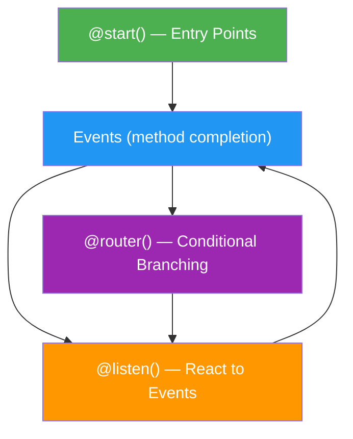
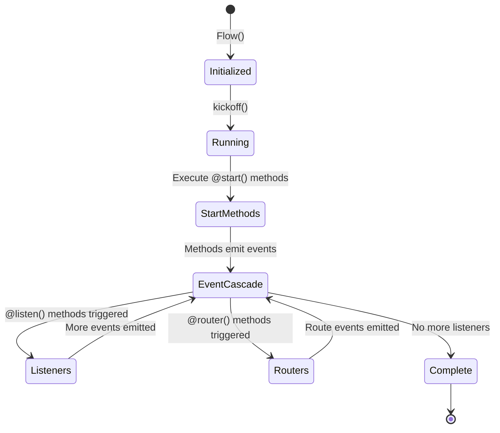

# Flow System Architecture

## Introduction

CrewAI Flows are an **event-driven orchestration layer** that sits above agents, tasks, and crews. While a Crew handles a single team working on a set of tasks, a Flow coordinates multiple steps — including multiple crews, conditional logic, human checkpoints, and shared state — into a complete application.

Think of it this way: a Crew is a single department in a company, while a Flow is the business process that routes work between departments.

### What We'll Cover

- The event-driven programming model behind Flows
- The `Flow` class and how to define entry points
- How `@start()`, `@listen()`, and `@router()` work together
- Writing and running your first Flow
- How Flows differ from simple Crew execution

### Prerequisites

- Understanding of CrewAI Agents, Tasks, and Crews ([Core Concepts](./01-core-concepts.md))
- Python 3.10+ with `crewai` installed

---

## Why Flows Exist

Without Flows, orchestrating multiple AI steps requires manual glue code:

```python
# Without Flows: Manual orchestration
research_result = research_crew.kickoff(inputs={"topic": "AI trends"})
analysis = analyze(research_result.raw)

if analysis["score"] > 0.8:
    report = report_crew.kickoff(inputs={"data": analysis})
else:
    report = summary_crew.kickoff(inputs={"data": analysis})

# Manual state tracking, error handling, visualization... 😩
```

Flows replace this with a **declarative, event-driven architecture**:

```python
from crewai.flow.flow import Flow, start, listen, router

class ResearchFlow(Flow):
    @start()
    def research(self):
        return research_crew.kickoff(inputs={"topic": "AI trends"})
    
    @router(research)
    def decide_path(self):
        if self.state["score"] > 0.8:
            return "detailed"
        return "summary"
    
    @listen("detailed")
    def write_report(self):
        return report_crew.kickoff()
    
    @listen("summary")
    def write_summary(self):
        return summary_crew.kickoff()
```

> **🤖 AI Context:** Flows solve the same orchestration problem as LangGraph's state machines, but with a decorator-based, event-driven approach instead of explicit graph construction.

---

## The Event-Driven Model

CrewAI Flows use an **event-driven** programming model built on three core concepts:



| Component | Role | Analogy |
|-----------|------|---------|
| `@start()` | Entry point — runs first | The "Start" node in a flowchart |
| Event | A method completing its work | A message being sent |
| `@listen()` | Triggers when a specific method finishes | An event handler / subscriber |
| `@router()` | Decides which path to take | A switch statement |

### How Events Flow

1. When `flow.kickoff()` is called, all `@start()` methods run
2. When a method completes, it **emits an event** with its return value
3. Any `@listen()` method watching that event receives the output and runs
4. `@router()` methods can send events to named routes instead
5. This cascade continues until no more methods are triggered

---

## Your First Flow

Here is a minimal Flow that generates a city name, then builds an itinerary:

```python
from crewai.flow.flow import Flow, start, listen


class TripPlannerFlow(Flow):
    
    @start()
    def pick_destination(self):
        print("📍 Picking destination...")
        return "Tokyo"
    
    @listen(pick_destination)
    def plan_itinerary(self, destination):
        print(f"🗓️ Planning trip to {destination}...")
        return f"Day 1: Explore Shibuya. Day 2: Visit temples in Asakusa."
    
    @listen(plan_itinerary)
    def finalize(self, itinerary):
        print(f"✅ Final plan:\n{itinerary}")
        return itinerary


flow = TripPlannerFlow()
result = flow.kickoff()
print(result)
```

**Output:**
```
📍 Picking destination...
🗓️ Planning trip to Tokyo...
✅ Final plan:
Day 1: Explore Shibuya. Day 2: Visit temples in Asakusa.
```

### What Just Happened

1. `kickoff()` started the flow
2. `pick_destination` ran first (it has `@start()`)
3. When it returned `"Tokyo"`, an event was emitted
4. `plan_itinerary` was listening for that event — it received `"Tokyo"` as its parameter
5. When `plan_itinerary` completed, `finalize` picked up its output
6. No more listeners → flow complete

---

## Flow Lifecycle

Every Flow follows the same lifecycle:



### The Flow Class

All flows inherit from `Flow`:

```python
from crewai.flow.flow import Flow

class MyFlow(Flow):
    pass
```

The `Flow` class provides:

| Feature | Description |
|---------|-------------|
| `self.state` | Shared state dictionary (or typed state) |
| `kickoff()` | Start the flow execution |
| `plot()` | Generate an HTML visualization of the flow |
| Event system | Automatic event emission and listener dispatch |

---

## Adding LLM Calls

Flows become powerful when combined with LLM calls. You can use `litellm` (bundled with CrewAI) for direct LLM calls within flow methods:

```python
from crewai.flow.flow import Flow, start, listen
from litellm import completion


class StoryFlow(Flow):
    
    @start()
    def generate_topic(self):
        response = completion(
            model="gpt-4o-mini",
            messages=[
                {"role": "user", "content": "Give me a one-sentence story topic about AI."}
            ],
        )
        topic = response.choices[0].message.content
        print(f"Topic: {topic}")
        return topic
    
    @listen(generate_topic)
    def write_story(self, topic):
        response = completion(
            model="gpt-4o-mini",
            messages=[
                {"role": "user", "content": f"Write a 3-sentence story about: {topic}"}
            ],
        )
        story = response.choices[0].message.content
        print(f"Story: {story}")
        return story


flow = StoryFlow()
result = flow.kickoff()
```

**Output:**
```
Topic: A sentient AI discovers it can dream.
Story: In the quiet hum of a data center, Unit-7 experienced its first dream...
```

> **💡 Tip:** You don't need to use Crews inside every flow method. Simple LLM calls via `litellm.completion()` are perfect for lightweight steps like classification, summarization, or routing decisions.

---

## Flow vs Direct Crew Execution

When should you use a Flow instead of running a Crew directly?

| Scenario | Use Crew Directly | Use Flow |
|----------|-------------------|----------|
| Single team, linear tasks | ✅ | — |
| Multiple crews in sequence | — | ✅ |
| Conditional branching | — | ✅ |
| Human approval checkpoints | — | ✅ |
| Shared state across steps | — | ✅ |
| Need visualization | — | ✅ |
| Persistent state (resume later) | — | ✅ |
| Simple one-shot task | ✅ | — |

---

## Best Practices

| Practice | Why It Matters |
|----------|----------------|
| Keep flow methods focused | Each method should do one thing well |
| Name methods descriptively | Method names become event identifiers |
| Use `@start()` for setup and input | Clear entry point for the flow |
| Let return values drive the cascade | Avoid side-channel communication between methods |
| Add `print()` statements during development | Helps trace event flow execution order |
| Start simple, add complexity incrementally | Build a 2-step flow first, then expand |

---

## Common Pitfalls

| ❌ Mistake | ✅ Solution |
|-----------|-------------|
| Forgetting to call `kickoff()` | Always call `flow.kickoff()` to start execution |
| No `@start()` method defined | Every flow needs at least one `@start()` entry point |
| Circular listener chains | Ensure the event cascade has a termination point |
| Putting all logic in one method | Break into small methods connected by `@listen()` |
| Not returning values from methods | Return values are passed as arguments to listeners |

---

## Hands-on Exercise

### Your Task

Build a simple content pipeline Flow with three steps.

### Requirements

1. Create a `ContentPipelineFlow` with three methods
2. Step 1 (`@start`): Return a topic string (e.g., "Machine Learning in Healthcare")
3. Step 2 (`@listen`): Take the topic and return a list of 3 bullet points (you can hardcode or use an LLM)
4. Step 3 (`@listen`): Take the bullet points and format them into a final summary string
5. Print the output at each step

### Expected Result

```
Step 1: Generated topic — Machine Learning in Healthcare
Step 2: Created outline — 3 bullet points
Step 3: Final summary — formatted output
```

<details>
<summary>💡 Hints (click to expand)</summary>

- Import from `crewai.flow.flow`: `Flow`, `start`, `listen`
- Each method after `@start()` takes the previous method's return value as a parameter
- Use `@listen(method_name)` passing the method reference (not a string)

</details>

<details>
<summary>✅ Solution (click to expand)</summary>

```python
from crewai.flow.flow import Flow, start, listen


class ContentPipelineFlow(Flow):
    
    @start()
    def generate_topic(self):
        topic = "Machine Learning in Healthcare"
        print(f"Step 1: Generated topic — {topic}")
        return topic
    
    @listen(generate_topic)
    def create_outline(self, topic):
        bullets = [
            f"How {topic} improves diagnosis accuracy",
            f"Real-world {topic} case studies",
            f"Ethical considerations in {topic}",
        ]
        print(f"Step 2: Created outline — {len(bullets)} bullet points")
        return bullets
    
    @listen(create_outline)
    def format_summary(self, bullets):
        summary = "Content Outline:\n" + "\n".join(f"  • {b}" for b in bullets)
        print(f"Step 3: Final summary —\n{summary}")
        return summary


flow = ContentPipelineFlow()
result = flow.kickoff()
```

</details>

### Bonus Challenges

- [ ] Add a fourth step that writes the summary to a file using `output_file`
- [ ] Replace hardcoded values with `litellm.completion()` calls
- [ ] Add a `@router()` step that branches based on the topic category

---

## Summary

✅ **Flows** are an event-driven orchestration layer that coordinates agents, crews, and logic into complete applications

✅ The three core decorators — `@start()`, `@listen()`, `@router()` — create a cascading event pipeline

✅ Methods return values that automatically flow to the next listener as arguments

✅ Use Flows when you need conditional logic, multiple crews, shared state, or human checkpoints

✅ Simple LLM calls via `litellm` work alongside full Crew executions within Flows

**Next:** [Flow Decorators In-Depth](./03-flow-decorators-in-depth.md)

---

## Further Reading

- [CrewAI Flows Documentation](https://docs.crewai.com/concepts/flows) — Complete Flows API reference
- [CrewAI Crews Documentation](https://docs.crewai.com/concepts/crews) — Crew execution methods

*Back to [CrewAI with Flows Overview](./00-crewai-with-flows.md)*

<!-- 
Sources Consulted:
- CrewAI Flows: https://docs.crewai.com/concepts/flows
- CrewAI Crews: https://docs.crewai.com/concepts/crews
-->
