# Flow Decorators In-Depth

## Introduction

CrewAI Flows are built on five decorators that control execution order and branching: `@start()`, `@listen()`, `@router()`, `or_()`, and `and_()`. Mastering these decorators is the key to building sophisticated multi-step AI workflows.

This lesson examines each decorator in detail, with practical examples of how they combine to create complex execution patterns.

### What We'll Cover

- `@start()` — entry points (unconditional and gated)
- `@listen()` — event listeners (by method reference and by name)
- `@router()` — conditional branching with named routes
- `or_()` — trigger when *any* upstream method completes
- `and_()` — trigger when *all* upstream methods complete

### Prerequisites

- Completed [Flow System Architecture](./02-flow-system-architecture.md)
- Understanding of Python decorators

---

## @start() — Entry Points

The `@start()` decorator marks a method as a flow entry point. When `flow.kickoff()` is called, **all** `@start()` methods execute:

```python
from crewai.flow.flow import Flow, start, listen


class MultiStartFlow(Flow):
    
    @start()
    def fetch_news(self):
        print("📰 Fetching news...")
        return ["AI breakthrough", "New framework released"]
    
    @start()
    def fetch_market_data(self):
        print("📊 Fetching market data...")
        return {"AI_sector": "+15%", "tech_index": "+3.2%"}
    
    @listen(fetch_news)
    def process_news(self, news):
        print(f"Processing {len(news)} news items")
```

**Output:**
```
📰 Fetching news...
📊 Fetching market data...
Processing 2 news items
```

Both `@start()` methods run when `kickoff()` is called. They execute **in parallel** (concurrently), not sequentially.

### Gated Starts

You can gate a `@start()` with a condition by checking state early:

```python
class ConditionalStartFlow(Flow):
    
    @start()
    def initialize(self):
        # Always runs — sets up state
        self.state["mode"] = "production"
        return self.state["mode"]
    
    @start()
    def load_cache(self):
        # Always runs — but can exit early
        if not self.state.get("use_cache", True):
            return None
        print("Loading cache...")
        return {"cached": True}
```

> **Note:** `@start()` methods always execute. To conditionally skip work, add logic *inside* the method rather than trying to prevent it from running.

---

## @listen() — Event Listeners

The `@listen()` decorator triggers a method when another method completes. It can reference methods in two ways:

### By Method Reference (Recommended)

```python
class ExampleFlow(Flow):
    
    @start()
    def step_one(self):
        return "data from step one"
    
    @listen(step_one)  # Direct reference to the method
    def step_two(self, data):
        print(f"Received: {data}")
        return f"processed: {data}"
```

### By String Name

```python
class ExampleFlow(Flow):
    
    @start()
    def step_one(self):
        return "data from step one"
    
    @listen("step_one")  # String name of the method
    def step_two(self, data):
        print(f"Received: {data}")
```

> **💡 Tip:** Method reference is preferred because your IDE can detect typos and provide autocomplete. String names are useful when listening for router outputs (route names).

### Multiple Listeners on One Event

Multiple methods can listen to the same event. They all fire when the event occurs:

```python
class FanOutFlow(Flow):
    
    @start()
    def generate_content(self):
        return "Breaking: AI agents now write code"
    
    @listen(generate_content)
    def post_to_twitter(self, content):
        print(f"🐦 Tweeting: {content[:50]}...")
        return "tweeted"
    
    @listen(generate_content)
    def post_to_blog(self, content):
        print(f"📝 Blogging: {content[:50]}...")
        return "blogged"
    
    @listen(generate_content)
    def send_newsletter(self, content):
        print(f"📧 Emailing: {content[:50]}...")
        return "emailed"
```

**Output:**
```
🐦 Tweeting: Breaking: AI agents now write code...
📝 Blogging: Breaking: AI agents now write code...
📧 Emailing: Breaking: AI agents now write code...
```

This creates a **fan-out** pattern where one event triggers multiple parallel actions.

---

## @router() — Conditional Branching

The `@router()` decorator lets a method decide which path to take by returning a **route name** as a string. Downstream methods listen for those route names:

```python
from crewai.flow.flow import Flow, start, listen, router


class ContentRouterFlow(Flow):
    
    @start()
    def classify_content(self):
        content = "New research paper on quantum computing"
        # In practice, use an LLM to classify
        return {"text": content, "category": "technical"}
    
    @router(classify_content)
    def route_content(self, classification):
        category = classification["category"]
        print(f"🔀 Routing to: {category}")
        
        if category == "technical":
            return "technical_path"
        elif category == "business":
            return "business_path"
        else:
            return "general_path"
    
    @listen("technical_path")
    def handle_technical(self):
        print("🔬 Processing as technical content")
        return "Technical report generated"
    
    @listen("business_path")
    def handle_business(self):
        print("💼 Processing as business content")
        return "Business brief generated"
    
    @listen("general_path")
    def handle_general(self):
        print("📄 Processing as general content")
        return "General summary generated"
```

**Output:**
```
🔀 Routing to: technical
🔬 Processing as technical content
```

### How Routing Works


Key rules for `@router()`:

| Rule | Detail |
|------|--------|
| Return value | Must be a **string** (the route name) |
| Listeners | Use `@listen("route_name")` with the **string** the router returns |
| One active route | Only one route fires per execution of the router |
| Router input | Receives the output of the method it decorates |

### Router with LLM Classification

```python
from litellm import completion


class SmartRouterFlow(Flow):
    
    @start()
    def receive_query(self):
        return "How do I fix a memory leak in my Python application?"
    
    @router(receive_query)
    def classify_query(self, query):
        response = completion(
            model="gpt-4o-mini",
            messages=[
                {"role": "system", "content": "Classify as: 'debug', 'learn', or 'build'. Reply with one word."},
                {"role": "user", "content": query},
            ],
        )
        category = response.choices[0].message.content.strip().lower()
        print(f"Classified as: {category}")
        return category
    
    @listen("debug")
    def debugging_flow(self):
        print("🐛 Starting debugging assistant...")
    
    @listen("learn")
    def learning_flow(self):
        print("📚 Starting learning path...")
    
    @listen("build")
    def building_flow(self):
        print("🔨 Starting build assistant...")
```

---

## or_() — Any Trigger

The `or_()` function triggers a listener when **any** of the specified methods complete:

```python
from crewai.flow.flow import Flow, start, listen, or_


class AnyTriggerFlow(Flow):
    
    @start()
    def source_a(self):
        return "Data from source A"
    
    @start()
    def source_b(self):
        return "Data from source B"
    
    @listen(or_(source_a, source_b))
    def process_data(self, data):
        print(f"Processing: {data}")
```

**Output:**
```
Processing: Data from source A
Processing: Data from source B
```

> **Warning:** With `or_()`, the listener fires **each time** any upstream method completes. If both `source_a` and `source_b` complete, `process_data` runs **twice** — once per event.

### or_() Use Cases

| Pattern | Example |
|---------|---------|
| Multiple data sources | Process whichever source responds first |
| Fallback paths | Listen for success OR error events |
| Fan-in from parallel steps | Collect results as they arrive |

---

## and_() — Join Trigger

The `and_()` function triggers a listener only when **all** specified methods have completed:

```python
from crewai.flow.flow import Flow, start, listen, and_


class JoinFlow(Flow):
    
    @start()
    def research_market(self):
        print("📊 Researching market...")
        self.state["market"] = "Market data: AI growing 35% YoY"
        return self.state["market"]
    
    @start()
    def research_competitors(self):
        print("🔍 Researching competitors...")
        self.state["competitors"] = "Competitors: 5 major players identified"
        return self.state["competitors"]
    
    @listen(and_(research_market, research_competitors))
    def synthesize_report(self):
        print("📋 Both research streams complete — synthesizing...")
        market = self.state["market"]
        competitors = self.state["competitors"]
        return f"Report: {market} | {competitors}"
```

**Output:**
```
📊 Researching market...
🔍 Researching competitors...
📋 Both research streams complete — synthesizing...
```

> **Important:** With `and_()`, the listener receives **no direct arguments** because there are multiple upstream methods. Access shared data through `self.state` instead.

### and_() Execution Pattern

```mermaid
flowchart TD
    A["research_market()"] --> J{"and_() — Wait for all"}
    B["research_competitors()"] --> J
    J --> C["synthesize_report()"]
    
    style J fill:#FF5722,color:#fff
```



---

## Combining Decorators

The real power comes from combining these decorators in a single flow:

```python
from crewai.flow.flow import Flow, start, listen, router, or_, and_


class FullPipelineFlow(Flow):
    
    # 1. Parallel data gathering
    @start()
    def gather_internal_data(self):
        return {"source": "internal", "records": 1500}
    
    @start()
    def gather_external_data(self):
        return {"source": "external", "records": 3200}
    
    # 2. Wait for both sources
    @listen(and_(gather_internal_data, gather_external_data))
    def merge_data(self):
        total = 1500 + 3200  # From state in real implementation
        print(f"Merged {total} records")
        return {"total_records": total}
    
    # 3. Route based on data volume
    @router(merge_data)
    def decide_analysis_depth(self, merged):
        if merged["total_records"] > 5000:
            return "deep_analysis"
        return "quick_analysis"
    
    # 4. Branch paths
    @listen("deep_analysis")
    def run_deep_analysis(self):
        print("🔬 Running comprehensive analysis...")
        return "Deep analysis complete"
    
    @listen("quick_analysis")
    def run_quick_analysis(self):
        print("⚡ Running quick analysis...")
        return "Quick analysis complete"
    
    # 5. Both paths converge here
    @listen(or_(run_deep_analysis, run_quick_analysis))
    def generate_report(self, analysis_result):
        print(f"📄 Generating report: {analysis_result}")
        return f"Final Report: {analysis_result}"
```

**Output:**
```
Merged 4700 records
⚡ Running quick analysis...
📄 Generating report: Quick analysis complete
```

### Execution Flow Diagram

```mermaid
flowchart TD
    A["gather_internal_data()"] --> C{"and_()"}
    B["gather_external_data()"] --> C
    C --> D["merge_data()"]
    D --> E{"@router"}
    E -->|"> 5000 records"| F["run_deep_analysis()"]
    E -->|"≤ 5000 records"| G["run_quick_analysis()"]
    F --> H{"or_()"}
    G --> H
    H --> I["generate_report()"]
    
    style E fill:#9C27B0,color:#fff
    style C fill:#FF5722,color:#fff
    style H fill:#FF9800,color:#fff
```



---

## Best Practices

| Practice | Why It Matters |
|----------|----------------|
| Use method references over strings for `@listen()` | IDE support, refactoring safety, typo detection |
| Use strings only for `@listen()` on router routes | Router returns strings; listeners must match them |
| Keep router logic simple | Complex classification should be in a separate method |
| Use `and_()` with state for collecting parallel results | `and_()` listeners don't receive direct arguments |
| Name methods as verbs | `fetch_data`, `classify_input`, `generate_report` |
| One responsibility per method | Easier to test, debug, and reuse |

---

## Common Pitfalls

| ❌ Mistake | ✅ Solution |
|-----------|-------------|
| Returning non-string from `@router()` | Always return a string route name |
| Expecting `and_()` to pass arguments | Use `self.state` to share data between parallel branches |
| Listening for a route name that doesn't match | Ensure `@listen("route_name")` exactly matches the router's return string |
| Creating infinite loops with circular listeners | Ensure the listener chain has a clear termination point |
| Mixing `@listen()` and `@router()` on the same method | A method should be either a listener or a router, not both |
| Assuming `or_()` fires once | `or_()` fires for **each** completing upstream method |

---

## Hands-on Exercise

### Your Task

Build a document processing flow that classifies incoming documents and routes them to appropriate handlers.

### Requirements

1. Create a `DocumentProcessorFlow` with a `@start()` method that returns a document dict with `title` and `type` fields
2. Add a `@router()` that routes based on the document type: `"invoice"`, `"report"`, or `"email"`
3. Create three `@listen()` handlers — one for each document type
4. Each handler prints the document title and returns a processing result
5. Add a final `@listen()` using `or_()` that catches all three paths and prints "Processing complete"

### Expected Result

```
📄 Document received: Q4 Financial Report
🔀 Routing to: report
📊 Processing report: Q4 Financial Report
✅ Processing complete: Report analyzed
```

<details>
<summary>💡 Hints (click to expand)</summary>

- The router receives the document dict from `@start()` as its argument
- Route names must match exactly between `return "invoice"` and `@listen("invoice")`
- Use `or_(handle_invoice, handle_report, handle_email)` for the final convergence step

</details>

<details>
<summary>✅ Solution (click to expand)</summary>

```python
from crewai.flow.flow import Flow, start, listen, router, or_


class DocumentProcessorFlow(Flow):
    
    @start()
    def receive_document(self):
        document = {"title": "Q4 Financial Report", "type": "report"}
        print(f"📄 Document received: {document['title']}")
        return document
    
    @router(receive_document)
    def classify_document(self, doc):
        doc_type = doc["type"]
        print(f"🔀 Routing to: {doc_type}")
        return doc_type  # Returns "invoice", "report", or "email"
    
    @listen("invoice")
    def handle_invoice(self):
        print("💰 Processing invoice")
        return "Invoice processed"
    
    @listen("report")
    def handle_report(self):
        print("📊 Processing report")
        return "Report analyzed"
    
    @listen("email")
    def handle_email(self):
        print("📧 Processing email")
        return "Email categorized"
    
    @listen(or_(handle_invoice, handle_report, handle_email))
    def finalize(self, result):
        print(f"✅ Processing complete: {result}")
        return result


flow = DocumentProcessorFlow()
flow.kickoff()
```

</details>

### Bonus Challenges

- [ ] Add `and_()` to wait for two parallel `@start()` methods before routing
- [ ] Use an LLM call in the router to classify documents dynamically
- [ ] Add a `@listen()` chain after the router handlers for post-processing

---

## Summary

✅ `@start()` marks entry points — multiple `@start()` methods run in parallel on `kickoff()`

✅ `@listen(method)` triggers when a specific method completes, receiving its return value

✅ `@router(method)` enables conditional branching by returning route name strings

✅ `or_()` fires when **any** upstream method completes (fires multiple times)

✅ `and_()` fires when **all** upstream methods complete (use `self.state` for data)

**Next:** [State Management in Flows](./04-state-management-in-flows.md)

---

## Further Reading

- [CrewAI Flows Documentation](https://docs.crewai.com/concepts/flows) — Full Flows API with decorator reference
- [Python Decorators Guide](https://docs.python.org/3/glossary.html#term-decorator) — Python decorator fundamentals

*Back to [CrewAI with Flows Overview](./00-crewai-with-flows.md)*

<!-- 
Sources Consulted:
- CrewAI Flows: https://docs.crewai.com/concepts/flows
-->
