# Crews Within Flows

## Introduction

The most powerful pattern in CrewAI is embedding **Crews inside Flows**. This lets you use Flows for orchestration — routing, state, branching — while Crews handle the AI-heavy work of multi-agent collaboration. A single Flow can coordinate multiple Crews, each with different agents and tasks, passing results between them through state.

This lesson shows how to integrate Crews into Flow methods, chain multiple Crews, and structure production-ready Flow projects.

### What We'll Cover

- Running a Crew inside a Flow method
- Passing Crew results into Flow state
- Chaining multiple Crews in a single Flow
- Conditional Crew execution with `@router()`
- Project structure for Flow-based applications
- Creating Flows with the CrewAI CLI

### Prerequisites

- Completed [Core Concepts](./01-core-concepts.md) (Agents, Tasks, Crews)
- Completed [State Management in Flows](./04-state-management-in-flows.md)

---

## Running a Crew Inside a Flow

To embed a Crew in a Flow, call `crew.kickoff()` inside a Flow method and return the result:

```python
from crewai import Agent, Crew, Process, Task
from crewai.flow.flow import Flow, start, listen
from pydantic import BaseModel


class BlogState(BaseModel):
    topic: str = ""
    research: str = ""
    blog_post: str = ""


class BlogFlow(Flow[BlogState]):
    
    @start()
    def set_topic(self):
        self.state.topic = "AI Agents in 2025"
        print(f"📝 Topic: {self.state.topic}")
    
    @listen(set_topic)
    def run_research_crew(self):
        researcher = Agent(
            role="AI Research Analyst",
            goal=f"Research {self.state.topic} thoroughly",
            backstory="Senior analyst with 10 years in AI research.",
            llm="gpt-4o-mini",
        )
        
        research_task = Task(
            description=f"Research the latest developments in {self.state.topic}",
            expected_output="A detailed research report with 5 key findings",
            agent=researcher,
        )
        
        crew = Crew(
            agents=[researcher],
            tasks=[research_task],
            process=Process.sequential,
        )
        
        result = crew.kickoff()
        self.state.research = result.raw
        print(f"🔍 Research complete: {len(result.raw)} chars")
    
    @listen(run_research_crew)
    def run_writing_crew(self):
        writer = Agent(
            role="Technical Blog Writer",
            goal="Write engaging blog posts based on research",
            backstory="Experienced tech writer for developer audiences.",
            llm="gpt-4o-mini",
        )
        
        write_task = Task(
            description=f"""Write a blog post about {self.state.topic}.
            Use this research: {self.state.research}""",
            expected_output="A well-structured blog post of 300+ words",
            agent=writer,
            markdown=True,
        )
        
        crew = Crew(
            agents=[writer],
            tasks=[write_task],
            process=Process.sequential,
        )
        
        result = crew.kickoff()
        self.state.blog_post = result.raw
        print(f"✍️ Blog written: {len(result.raw.split())} words")


flow = BlogFlow()
flow.kickoff()
print(flow.state.blog_post)
```

### Key Pattern

```mermaid
flowchart LR
    A["@start — Set Topic"] --> B["@listen — Research Crew"]
    B --> C["@listen — Writing Crew"]
    
    B -.->|"result → state.research"| S["Flow State"]
    S -.->|"state.research → task description"| C
    
    style S fill:#FF9800,color:#fff
```



The pattern is simple:
1. Crew runs inside a Flow method
2. `result.raw` is stored in `self.state`
3. The next method reads from `self.state` to inform its Crew

---

## Chaining Multiple Crews

Real applications often need several specialized teams working in sequence:

```python
from crewai import Agent, Crew, Process, Task
from crewai.flow.flow import Flow, start, listen, router
from pydantic import BaseModel


class ContentPipelineState(BaseModel):
    topic: str = ""
    research: str = ""
    draft: str = ""
    edited_draft: str = ""
    quality_score: float = 0.0


class ContentPipelineFlow(Flow[ContentPipelineState]):
    
    @start()
    def initialize(self):
        self.state.topic = "Building Production AI Agents"
        print(f"🚀 Pipeline started: {self.state.topic}")
    
    @listen(initialize)
    def research_phase(self):
        """Research crew: Analyst + Fact Checker"""
        analyst = Agent(
            role="Research Analyst",
            goal=f"Deep research on {self.state.topic}",
            backstory="Expert at finding authoritative sources and data.",
            llm="gpt-4o-mini",
        )
        fact_checker = Agent(
            role="Fact Checker",
            goal="Verify all claims and statistics",
            backstory="Meticulous reviewer who catches inaccuracies.",
            llm="gpt-4o-mini",
        )
        
        research = Task(
            description=f"Research {self.state.topic} with 5 key findings",
            expected_output="Verified research report with cited sources",
            agent=analyst,
        )
        verify = Task(
            description="Verify all claims in the research report",
            expected_output="Fact-checked report with confidence scores",
            agent=fact_checker,
            context=[research],
        )
        
        crew = Crew(
            agents=[analyst, fact_checker],
            tasks=[research, verify],
            process=Process.sequential,
        )
        result = crew.kickoff()
        self.state.research = result.raw
        print("📊 Research phase complete")
    
    @listen(research_phase)
    def writing_phase(self):
        """Writing crew: Writer + Editor"""
        writer = Agent(
            role="Technical Writer",
            goal="Create engaging, accurate content",
            backstory="Developer advocate known for clear explanations.",
            llm="gpt-4o-mini",
        )
        editor = Agent(
            role="Senior Editor",
            goal="Polish content for publication quality",
            backstory="15 years editing technical publications.",
            llm="gpt-4o-mini",
        )
        
        write = Task(
            description=f"""Write a comprehensive article about {self.state.topic}.
            Base it on: {self.state.research[:500]}""",
            expected_output="A 500-word article in Markdown",
            agent=writer,
            markdown=True,
        )
        edit = Task(
            description="Edit the article for clarity, grammar, and flow",
            expected_output="Publication-ready article",
            agent=editor,
            context=[write],
        )
        
        crew = Crew(
            agents=[writer, editor],
            tasks=[write, edit],
            process=Process.sequential,
        )
        result = crew.kickoff()
        self.state.edited_draft = result.raw
        print("✍️ Writing phase complete")
    
    @listen(writing_phase)
    def quality_check(self):
        word_count = len(self.state.edited_draft.split())
        self.state.quality_score = min(word_count / 500, 1.0)
        print(f"✅ Quality: {self.state.quality_score:.0%} ({word_count} words)")


flow = ContentPipelineFlow()
flow.kickoff()
```

---

## Conditional Crew Execution

Use `@router()` to run different Crews based on conditions:

```python
class AdaptiveFlow(Flow[ContentPipelineState]):
    
    @start()
    def analyze_input(self):
        self.state.topic = "Kubernetes Best Practices"
    
    @router(analyze_input)
    def select_crew(self):
        # In production, use an LLM to classify the topic
        if "AI" in self.state.topic or "ML" in self.state.topic:
            return "ai_crew"
        elif "cloud" in self.state.topic.lower() or "kubernetes" in self.state.topic.lower():
            return "devops_crew"
        return "general_crew"
    
    @listen("ai_crew")
    def run_ai_specialists(self):
        print("🤖 Running AI specialist crew...")
        # AI-focused agents and tasks
    
    @listen("devops_crew")
    def run_devops_specialists(self):
        print("☁️ Running DevOps specialist crew...")
        # DevOps-focused agents and tasks
    
    @listen("general_crew")
    def run_general_writers(self):
        print("📝 Running general writing crew...")
        # General-purpose agents and tasks
```

### Flow Diagram with Conditional Crews


---

## Using CrewBase with Flows

For production projects, define Crews as reusable classes with `@CrewBase`:

```python
# crews/research_crew.py
from crewai import Agent, Crew, Process, Task
from crewai.project import CrewBase, agent, crew, task


@CrewBase
class ResearchCrew:
    """Reusable research crew."""
    
    agents_config = "config/agents.yaml"
    tasks_config = "config/tasks.yaml"

    @agent
    def researcher(self) -> Agent:
        return Agent(config=self.agents_config["researcher"])

    @task
    def research_task(self) -> Task:
        return Task(config=self.tasks_config["research_task"])

    @crew
    def crew(self) -> Crew:
        return Crew(
            agents=self.agents,
            tasks=self.tasks,
            process=Process.sequential,
        )
```

```python
# main_flow.py
from crewai.flow.flow import Flow, start, listen
from crews.research_crew import ResearchCrew


class ProductionFlow(Flow):
    
    @start()
    def begin(self):
        self.state["topic"] = "AI Agents"
    
    @listen(begin)
    def research(self):
        crew = ResearchCrew().crew()
        result = crew.kickoff(inputs={"topic": self.state["topic"]})
        self.state["research"] = result.raw
        print("Research complete")
```

---

## Project Structure

CrewAI recommends this folder structure for Flow-based projects:

```
my_project/
├── main.py                    # Flow definition and entry point
├── crews/
│   ├── research_crew/
│   │   ├── crew.py            # @CrewBase class
│   │   └── config/
│   │       ├── agents.yaml
│   │       └── tasks.yaml
│   └── writing_crew/
│       ├── crew.py
│       └── config/
│           ├── agents.yaml
│           └── tasks.yaml
├── tools/
│   └── custom_tools.py        # Custom tool definitions
├── models/
│   └── state.py               # Pydantic state models
└── pyproject.toml
```

### Creating with the CLI

CrewAI provides a CLI to scaffold Flow projects:

```bash
# Create a new flow project
crewai create flow my_project

# This generates the folder structure above
cd my_project

# Run the flow
crewai run
```

> **💡 Tip:** `crewai create flow` generates the complete project structure with example crews, state models, and configuration files — much faster than building from scratch.

---

## Best Practices

| Practice | Why It Matters |
|----------|----------------|
| Store Crew results in state, not return values | State persists and is accessible to all methods |
| Use `@CrewBase` classes for reusable Crews | Avoids duplicating agent/task definitions |
| Limit research/context passed to downstream Crews | Truncate long results to stay within token limits |
| Use YAML config for agent/task definitions | Clean separation, easy to modify without code changes |
| Define state models in a separate file | Shared across Flow and Crew definitions |
| Use `@router()` for content-dependent Crew selection | Different topics may need different specialist teams |

---

## Common Pitfalls

| ❌ Mistake | ✅ Solution |
|-----------|-------------|
| Passing entire Crew output as task description | Truncate or summarize: `self.state.research[:500]` |
| Defining agents inline in every flow method | Extract into `@CrewBase` classes for reuse |
| Not handling Crew errors in Flow methods | Wrap `crew.kickoff()` in try/except blocks |
| Running Crews synchronously when they could be parallel | Use `and_()` with separate `@start()` methods for parallel Crews |
| Hardcoding topics in task descriptions | Use state variables: `f"Research {self.state.topic}"` |

---

## Hands-on Exercise

### Your Task

Build a two-crew content pipeline Flow with state management.

### Requirements

1. Define a `PipelineState` with: `topic`, `research`, `article`, `word_count`
2. Create a `ContentFlow(Flow[PipelineState])` with:
   - `@start()`: Set the topic from inputs
   - `research_phase()`: Run a single-agent research Crew, store result in state
   - `writing_phase()`: Run a single-agent writing Crew using research from state
   - `finalize()`: Print word count and topic
3. Each Crew should have at least one agent and one task
4. Run with `flow.kickoff(inputs={"topic": "Building AI Agents"})`

### Expected Result

```
📝 Topic: Building AI Agents
🔍 Research complete: 850 chars
✍️ Article written: 320 words
✅ Pipeline complete: 320 words on 'Building AI Agents'
```

<details>
<summary>💡 Hints (click to expand)</summary>

- Define agents with descriptive backstories for better output quality
- Use `result.raw` to get the string output from a Crew
- Calculate word count with `len(self.state.article.split())`

</details>

<details>
<summary>✅ Solution (click to expand)</summary>

```python
from crewai import Agent, Crew, Process, Task
from crewai.flow.flow import Flow, start, listen
from pydantic import BaseModel


class PipelineState(BaseModel):
    topic: str = ""
    research: str = ""
    article: str = ""
    word_count: int = 0


class ContentFlow(Flow[PipelineState]):
    
    @start()
    def set_topic(self):
        print(f"📝 Topic: {self.state.topic}")
    
    @listen(set_topic)
    def research_phase(self):
        researcher = Agent(
            role="Research Analyst",
            goal=f"Research {self.state.topic} with data-backed findings",
            backstory="Senior analyst at a tech advisory firm with 10 years experience.",
            llm="gpt-4o-mini",
        )
        task = Task(
            description=f"Research the latest trends in {self.state.topic}",
            expected_output="5 key findings with supporting data",
            agent=researcher,
        )
        crew = Crew(agents=[researcher], tasks=[task], process=Process.sequential)
        result = crew.kickoff()
        self.state.research = result.raw
        print(f"🔍 Research complete: {len(result.raw)} chars")
    
    @listen(research_phase)
    def writing_phase(self):
        writer = Agent(
            role="Technical Writer",
            goal="Write clear, engaging articles for developers",
            backstory="Developer advocate with a talent for simplifying complex topics.",
            llm="gpt-4o-mini",
        )
        task = Task(
            description=f"""Write an article about {self.state.topic}.
            Based on: {self.state.research[:500]}""",
            expected_output="A 300-word article in Markdown format",
            agent=writer,
            markdown=True,
        )
        crew = Crew(agents=[writer], tasks=[task], process=Process.sequential)
        result = crew.kickoff()
        self.state.article = result.raw
        self.state.word_count = len(result.raw.split())
        print(f"✍️ Article written: {self.state.word_count} words")
    
    @listen(writing_phase)
    def finalize(self):
        print(f"✅ Pipeline complete: {self.state.word_count} words on '{self.state.topic}'")


flow = ContentFlow()
flow.kickoff(inputs={"topic": "Building AI Agents"})
```

</details>

### Bonus Challenges

- [ ] Add a `@router()` after research that sends short research to a "deep_dive" crew
- [ ] Add a third "Editor" crew that reviews the article before finalizing
- [ ] Extract Crews into separate `@CrewBase` classes in a `crews/` directory

---

## Summary

✅ Embed Crews in Flow methods by calling `crew.kickoff()` and storing results in state

✅ Chain multiple Crews by reading upstream results from `self.state` in downstream methods

✅ Use `@router()` to conditionally select which Crew runs based on content or classification

✅ Use `@CrewBase` classes and YAML config for reusable, maintainable Crew definitions

✅ Use `crewai create flow` to scaffold production project structures

**Next:** [Knowledge and Memory](./06-knowledge-and-memory.md)

---

## Further Reading

- [CrewAI Flows Documentation](https://docs.crewai.com/concepts/flows) — Crews in Flows examples
- [CrewAI Crews Documentation](https://docs.crewai.com/concepts/crews) — Crew configuration and `@CrewBase`
- [CrewAI CLI Reference](https://docs.crewai.com/concepts/cli) — `crewai create flow` and project scaffolding

*Back to [CrewAI with Flows Overview](./00-crewai-with-flows.md)*

<!-- 
Sources Consulted:
- CrewAI Flows: https://docs.crewai.com/concepts/flows
- CrewAI Crews: https://docs.crewai.com/concepts/crews
-->
