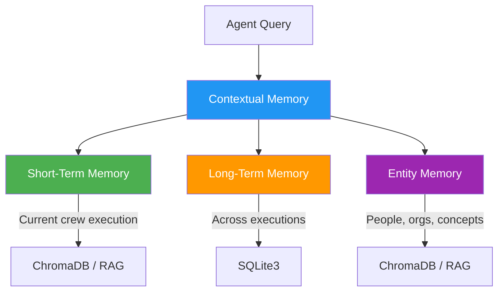

# Knowledge and Memory

## Introduction

CrewAI agents can remember past interactions, learn from experience, and access external knowledge sources. The **memory system** gives agents short-term, long-term, and entity-level recall, while **knowledge sources** let you feed domain-specific documents directly into agent context.

Together, these features transform agents from stateless LLM wrappers into systems that improve over time and reason over your data.

### What We'll Cover

- Memory system overview (short-term, long-term, entity, contextual)
- Enabling and configuring memory on Crews
- Custom embedder configuration
- External memory with Mem0
- Knowledge sources for domain-specific data
- Memory debugging and storage locations

### Prerequisites

- Completed [Core Concepts](./01-core-concepts.md) (Agents, Tasks, Crews)
- Understanding of embeddings and vector search concepts

---

## Memory System Overview

CrewAI's memory system has four layers:



| Memory Type | Scope | Storage | Purpose |
|-------------|-------|---------|---------|
| **Short-Term** | Current crew execution | ChromaDB (in-process) | Recent interactions and context within a run |
| **Long-Term** | Across all executions | SQLite3 | Lessons learned, accumulated knowledge |
| **Entity Memory** | Across all executions | ChromaDB (in-process) | Information about people, organizations, concepts |
| **Contextual Memory** | Current crew execution | Combines all layers | Synthesizes relevant context for each task |

---

## Enabling Memory

Memory is enabled with a single flag on the Crew:

```python
from crewai import Crew, Process

crew = Crew(
    agents=[researcher, writer],
    tasks=[research_task, write_task],
    process=Process.sequential,
    memory=True,  # Enable the memory system
    verbose=True,
)
```

When `memory=True`:
- Short-term memory tracks interactions within the current run
- Long-term memory saves insights across runs
- Entity memory builds a knowledge graph of named entities
- Contextual memory synthesizes relevant context before each task

### What Happens Behind the Scenes

```python
# First run
result1 = crew.kickoff(inputs={"topic": "AI agents"})
# Memory stores: key findings, entity relationships, task outcomes

# Second run — memory enhances context
result2 = crew.kickoff(inputs={"topic": "AI agents in production"})
# Agent now has context from the first run's findings
```

> **🤖 AI Context:** CrewAI's memory works similarly to RAG (Retrieval-Augmented Generation). Short-term and entity memories use ChromaDB as a vector store, embedding interactions and retrieving relevant context via semantic search before each LLM call.

---

## Memory Storage Locations

Memory files are stored in platform-specific directories:

| Platform | Default Path |
|----------|-------------|
| macOS | `~/Library/Application Support/crewai/` |
| Linux | `~/.local/share/crewai/` |
| Windows | `%LOCALAPPDATA%\crewai\` |

Inside the storage directory:
```
crewai/
├── short_term/           # ChromaDB collection
│   └── chroma.sqlite3
├── long_term/
│   └── long_term.db      # SQLite3 database
├── entity/               # ChromaDB collection
│   └── chroma.sqlite3
└── knowledge/            # Knowledge source embeddings
    └── chroma.sqlite3
```

---

## Custom Embedder Configuration

By default, CrewAI uses OpenAI embeddings. You can configure alternative providers:

### OpenAI (Default)

```python
crew = Crew(
    agents=[researcher],
    tasks=[research_task],
    memory=True,
    embedder={
        "provider": "openai",
        "config": {
            "model": "text-embedding-3-small",
        },
    },
)
```

### Ollama (Local)

```python
crew = Crew(
    agents=[researcher],
    tasks=[research_task],
    memory=True,
    embedder={
        "provider": "ollama",
        "config": {
            "model": "nomic-embed-text",
            "url": "http://localhost:11434/api/embeddings",
        },
    },
)
```

### Google AI

```python
crew = Crew(
    agents=[researcher],
    tasks=[research_task],
    memory=True,
    embedder={
        "provider": "google",
        "config": {
            "model": "models/text-embedding-004",
            "api_key": "your-google-api-key",
        },
    },
)
```

### Supported Embedder Providers

| Provider | Model Examples | Notes |
|----------|---------------|-------|
| `openai` | `text-embedding-3-small`, `text-embedding-3-large` | Default, requires API key |
| `ollama` | `nomic-embed-text`, `mxbai-embed-large` | Local, no API costs |
| `google` | `text-embedding-004` | Google AI Studio |
| `azure` | Azure OpenAI deployment name | Azure OpenAI Service |
| `cohere` | `embed-english-v3.0` | Cohere API |
| `voyageai` | `voyage-large-2` | Voyage AI API |
| `huggingface` | `sentence-transformers/all-MiniLM-L6-v2` | Local via HuggingFace |
| `bedrock` | `amazon.titan-embed-text-v2:0` | AWS Bedrock |
| `watson` | IBM Watson embedding models | IBM Cloud |

---

## External Memory with Mem0

For advanced memory needs, CrewAI integrates with [Mem0](https://mem0.ai/), which provides a managed memory service with user-level and session-level recall:

### Open Source (Self-Hosted)

```python
from crewai import Crew
from mem0 import MemoryClient

crew = Crew(
    agents=[researcher],
    tasks=[research_task],
    memory=True,
    memory_config={
        "provider": "mem0",
        "config": {
            "user_id": "user_123",
            "org_name": "my_org",
            "project_name": "ai_research",
        },
    },
)
```

### Mem0 Platform (Managed)

```python
crew = Crew(
    agents=[researcher],
    tasks=[research_task],
    memory=True,
    memory_config={
        "provider": "mem0",
        "config": {
            "user_id": "user_123",
            "api_key": "your-mem0-api-key",
        },
    },
)
```

> **💡 Tip:** Mem0 is useful when you need memory shared across different applications or users, not just within a single Crew.

---

## Knowledge Sources

Knowledge sources let you feed documents, text, and structured data directly into agent context:

```python
from crewai import Crew
from crewai.knowledge.source.text_file_knowledge_source import TextFileKnowledgeSource
from crewai.knowledge.source.pdf_knowledge_source import PDFKnowledgeSource

# Text file knowledge
text_source = TextFileKnowledgeSource(
    file_paths=["company_policies.txt", "product_docs.txt"],
)

# PDF knowledge
pdf_source = PDFKnowledgeSource(
    file_paths=["technical_spec.pdf"],
)

crew = Crew(
    agents=[support_agent],
    tasks=[answer_question],
    knowledge_sources=[text_source, pdf_source],
    process=Process.sequential,
)
```

### Available Knowledge Source Types

| Source Type | Class | Use Case |
|------------|-------|----------|
| Text files | `TextFileKnowledgeSource` | Plain text documents |
| PDF files | `PDFKnowledgeSource` | PDF documents |
| CSV files | `CSVKnowledgeSource` | Structured tabular data |
| JSON files | `JSONKnowledgeSource` | Structured JSON data |
| Excel files | `ExcelKnowledgeSource` | Spreadsheet data |
| Inline text | `StringKnowledgeSource` | Hardcoded text snippets |

### How Knowledge Sources Work


1. Documents are loaded and split into chunks
2. Chunks are embedded using the configured embedder
3. Embeddings are stored in ChromaDB
4. Before each task, relevant chunks are retrieved via semantic search
5. Retrieved chunks are injected into the agent's context

---

## Memory Debugging

CrewAI emits memory events that you can use for debugging:

```python
import logging

# Enable memory event logging
logging.basicConfig(level=logging.DEBUG)
logger = logging.getLogger("crewai.memory")
```

### Memory Events

| Event | When It Fires |
|-------|--------------|
| `memory.query.started` | Before searching memory |
| `memory.query.completed` | After memory search returns results |
| `memory.save.started` | Before saving to memory |
| `memory.save.completed` | After successfully saving |
| `memory.retrieval.started` | Before retrieving from long-term memory |
| `memory.retrieval.completed` | After retrieval completes |
| `memory.*.failed` | When any memory operation fails |

---

## Best Practices

| Practice | Why It Matters |
|----------|----------------|
| Enable `memory=True` for multi-run Crews | Agents improve over time with accumulated knowledge |
| Use local embedders (Ollama) for development | Faster, no API costs during iteration |
| Choose knowledge sources matching your data format | PDF, CSV, JSON each have optimized parsers |
| Set `user_id` in Mem0 for per-user memory | Keeps memory scoped and relevant |
| Monitor memory storage size over time | ChromaDB collections can grow large with heavy use |
| Start without memory, add it after core logic works | Memory adds complexity; get the basics right first |

---

## Common Pitfalls

| ❌ Mistake | ✅ Solution |
|-----------|-------------|
| Expecting memory to work without `memory=True` | Explicitly enable: `Crew(..., memory=True)` |
| Using OpenAI embeddings without an API key | Set `OPENAI_API_KEY` env var or use a local embedder |
| Loading huge documents without chunking | Knowledge sources auto-chunk, but very large files may need splitting |
| Assuming memory persists after container restart | Default ChromaDB is in-process; use Mem0 for persistent external memory |
| Not configuring embedder when using non-OpenAI LLMs | Embedder and LLM providers are independent — configure both |
| Ignoring memory storage disk usage | Monitor `~/.local/share/crewai/` for growing database files |

---

## Hands-on Exercise

### Your Task

Build a Crew with memory enabled and a knowledge source.

### Requirements

1. Create a text file `knowledge/company_info.txt` with 3-4 paragraphs about a fictional company
2. Create a `TextFileKnowledgeSource` pointing to that file
3. Create a "Support Agent" that answers questions using the knowledge source
4. Create a task asking a specific question about the company
5. Run the Crew with `memory=True` and the knowledge source attached

### Expected Result

```
Agent answers the question using information from company_info.txt
rather than generating generic responses.
```

<details>
<summary>💡 Hints (click to expand)</summary>

- Import `TextFileKnowledgeSource` from `crewai.knowledge.source.text_file_knowledge_source`
- Pass knowledge sources to the Crew with `knowledge_sources=[text_source]`
- The agent doesn't need to know about the knowledge source — it's injected automatically

</details>

<details>
<summary>✅ Solution (click to expand)</summary>

```python
from crewai import Agent, Crew, Process, Task
from crewai.knowledge.source.text_file_knowledge_source import TextFileKnowledgeSource

# Step 1: Create knowledge source
text_source = TextFileKnowledgeSource(
    file_paths=["knowledge/company_info.txt"],
)

# Step 2: Create support agent
support_agent = Agent(
    role="Customer Support Specialist",
    goal="Answer customer questions accurately using company knowledge",
    backstory="""You are a knowledgeable support specialist who always
    provides accurate answers based on official company documentation.
    You never make up information.""",
    llm="gpt-4o-mini",
)

# Step 3: Create task
answer_task = Task(
    description="What products does the company offer and what are their pricing tiers?",
    expected_output="A clear, accurate answer based on company documentation",
    agent=support_agent,
)

# Step 4: Assemble crew with memory and knowledge
crew = Crew(
    agents=[support_agent],
    tasks=[answer_task],
    process=Process.sequential,
    memory=True,
    knowledge_sources=[text_source],
    verbose=True,
)

result = crew.kickoff()
print(result.raw)
```

</details>

### Bonus Challenges

- [ ] Add a PDF knowledge source alongside the text file
- [ ] Configure a local Ollama embedder instead of OpenAI
- [ ] Run the Crew twice and observe how long-term memory affects the second run

---

## Summary

✅ Enable memory with `memory=True` — agents get short-term, long-term, and entity recall

✅ Short-term memory uses ChromaDB for the current run; long-term memory uses SQLite across runs

✅ Configure alternative embedders (Ollama, Google, Cohere) via the `embedder` dict

✅ Use Mem0 for external, managed memory shared across applications and users

✅ Knowledge sources (text, PDF, CSV, JSON) are automatically chunked, embedded, and retrieved via RAG

**Next:** [CrewAI Tools](./07-crewai-tools.md)

---

## Further Reading

- [CrewAI Memory Documentation](https://docs.crewai.com/concepts/memory) — Full memory system reference
- [CrewAI Knowledge Documentation](https://docs.crewai.com/concepts/knowledge) — Knowledge source types and configuration
- [Mem0 Documentation](https://docs.mem0.ai/) — External memory integration

*Back to [CrewAI with Flows Overview](./00-crewai-with-flows.md)*

<!-- 
Sources Consulted:
- CrewAI Memory: https://docs.crewai.com/concepts/memory
- CrewAI Crews: https://docs.crewai.com/concepts/crews
-->
