# Production Deployment

## Introduction

Moving CrewAI applications from development to production requires attention to error handling, monitoring, cost control, and operational reliability. This lesson covers the patterns and practices needed to run CrewAI Flows and Crews in production environments.

### What We'll Cover

- Error handling and retry strategies
- Token usage tracking and cost management
- Logging and observability
- Crew replay from failed tasks
- Rate limiting and concurrency
- CrewAI Enterprise overview

### Prerequisites

- Completed [Crews Within Flows](./05-crews-within-flows.md)
- Familiarity with Python error handling and logging

---

## Error Handling

### Wrapping Crew Execution

Always wrap `crew.kickoff()` in try/except blocks in production Flows:

```python
from crewai import Crew
from crewai.flow.flow import Flow, start, listen
from pydantic import BaseModel


class PipelineState(BaseModel):
    topic: str = ""
    result: str = ""
    error: str = ""
    success: bool = False


class RobustFlow(Flow[PipelineState]):
    
    @start()
    def run_crew(self):
        try:
            crew = self._build_crew()
            result = crew.kickoff(inputs={"topic": self.state.topic})
            self.state.result = result.raw
            self.state.success = True
            print(f"✅ Success: {len(result.raw)} chars")
        except Exception as e:
            self.state.error = str(e)
            self.state.success = False
            print(f"❌ Failed: {e}")
    
    @listen(run_crew)
    def handle_result(self):
        if self.state.success:
            print(f"Processing result: {self.state.result[:100]}...")
        else:
            print(f"Handling error: {self.state.error}")
            # Log, alert, or retry
    
    def _build_crew(self) -> Crew:
        # Crew construction logic
        ...
```

### Retry with Backoff

```python
import time
from crewai import Crew


def run_with_retry(crew: Crew, inputs: dict, max_retries: int = 3) -> str:
    """Execute a crew with exponential backoff on failure."""
    for attempt in range(max_retries):
        try:
            result = crew.kickoff(inputs=inputs)
            return result.raw
        except Exception as e:
            wait_time = 2 ** attempt  # 1s, 2s, 4s
            print(f"Attempt {attempt + 1} failed: {e}")
            if attempt < max_retries - 1:
                print(f"Retrying in {wait_time}s...")
                time.sleep(wait_time)
            else:
                raise RuntimeError(f"Failed after {max_retries} attempts: {e}")
```

---

## Token Usage and Cost Tracking

Every Crew execution returns token usage statistics:

```python
result = crew.kickoff(inputs={"topic": "AI agents"})

# Token usage for the entire crew run
usage = result.token_usage
print(f"Total tokens: {usage.total_tokens}")
print(f"Prompt tokens: {usage.prompt_tokens}")
print(f"Completion tokens: {usage.completion_tokens}")
print(f"Successful requests: {usage.successful_requests}")
```

### Cost Estimation

```python
def estimate_cost(usage, model: str = "gpt-4o-mini") -> float:
    """Estimate cost based on token usage and model pricing."""
    pricing = {
        "gpt-4o-mini": {"input": 0.00015, "output": 0.0006},  # per 1K tokens
        "gpt-4o": {"input": 0.0025, "output": 0.01},
    }
    
    if model not in pricing:
        return -1.0
    
    rates = pricing[model]
    input_cost = (usage.prompt_tokens / 1000) * rates["input"]
    output_cost = (usage.completion_tokens / 1000) * rates["output"]
    
    return input_cost + output_cost


result = crew.kickoff(inputs={"topic": "AI agents"})
cost = estimate_cost(result.token_usage, "gpt-4o-mini")
print(f"Estimated cost: ${cost:.4f}")
```

### Per-Task Usage

```python
result = crew.kickoff(inputs={"topic": "AI agents"})

for i, task_output in enumerate(result.tasks_output):
    print(f"Task {i + 1}: {task_output.description[:50]}...")
    print(f"  Output length: {len(task_output.raw)} chars")
```

---

## Logging and Observability

### Structured Logging

```python
import logging
import json
from datetime import datetime

# Configure structured logging
logging.basicConfig(
    level=logging.INFO,
    format="%(asctime)s [%(levelname)s] %(message)s",
)
logger = logging.getLogger("crewai_pipeline")


class ObservableFlow(Flow):
    
    @start()
    def process(self):
        run_id = self.state.get("id", "unknown")
        
        logger.info(json.dumps({
            "event": "flow_started",
            "run_id": run_id,
            "topic": self.state.get("topic"),
            "timestamp": datetime.now().isoformat(),
        }))
        
        try:
            result = crew.kickoff(inputs={"topic": self.state["topic"]})
            
            logger.info(json.dumps({
                "event": "flow_completed",
                "run_id": run_id,
                "tokens": result.token_usage.total_tokens,
                "output_length": len(result.raw),
            }))
            
            return result.raw
        except Exception as e:
            logger.error(json.dumps({
                "event": "flow_failed",
                "run_id": run_id,
                "error": str(e),
            }))
            raise
```

### Verbose Mode

For development and debugging, enable verbose output:

```python
crew = Crew(
    agents=[researcher, writer],
    tasks=[research_task, write_task],
    verbose=True,  # Prints detailed execution logs
)
```

Verbose mode shows:
- Which agent is executing which task
- Tool calls and their results
- Delegation between agents
- Task completion and output summaries

---

## Crew Replay

CrewAI can replay a crew execution **from a specific task**, skipping completed tasks:

```bash
# List recent crew runs
crewai log-tasks-outputs

# Replay from a specific task
crewai replay -t <task_id>
```

### How Replay Works

```mermaid
flowchart LR
    T1["Task 1 ✅"] --> T2["Task 2 ✅"] --> T3["Task 3 ❌"]
    
    T3 -.->|"replay -t task_3_id"| T3R["Task 3 🔄"]
    T3R --> T4["Task 4"]
    
    style T1 fill:#4CAF50,color:#fff
    style T2 fill:#4CAF50,color:#fff
    style T3 fill:#f44336,color:#fff
    style T3R fill:#FF9800,color:#fff
```



This is especially valuable for:
- Flows with expensive early tasks (web scraping, API calls)
- Debugging failures in later tasks without re-running the entire pipeline
- Iterating on prompt engineering for specific tasks

---

## Rate Limiting and Concurrency

### Controlling API Call Rate

```python
from crewai import Agent

# Limit agent iterations to prevent runaway API calls
agent = Agent(
    role="Researcher",
    goal="Research AI trends",
    backstory="Expert analyst.",
    max_iter=15,       # Max tool-use iterations (default: 25)
    max_rpm=10,        # Max requests per minute to the LLM
    llm="gpt-4o-mini",
)
```

### Batch Processing with Rate Limits

```python
import asyncio
from crewai import Crew


async def process_batch(crew: Crew, topics: list[str], concurrency: int = 3):
    """Process multiple topics with controlled concurrency."""
    semaphore = asyncio.Semaphore(concurrency)
    
    async def process_one(topic: str):
        async with semaphore:
            result = await crew.akickoff(inputs={"topic": topic})
            return {"topic": topic, "result": result.raw}
    
    tasks = [process_one(topic) for topic in topics]
    return await asyncio.gather(*tasks)


# Usage
topics = ["AI agents", "RAG systems", "Fine-tuning", "Embeddings"]
results = asyncio.run(process_batch(crew, topics, concurrency=2))
```

### kickoff_for_each

For simpler batch processing, use `kickoff_for_each`:

```python
inputs_list = [
    {"topic": "AI agents"},
    {"topic": "RAG systems"},
    {"topic": "Fine-tuning"},
]

results = crew.kickoff_for_each(inputs=inputs_list)

for result in results:
    print(f"Output: {result.raw[:100]}...")
```

---

## Environment Configuration

### Essential Environment Variables

```bash
# .env file
OPENAI_API_KEY=sk-...
SERPER_API_KEY=...              # For web search tools
CREWAI_TELEMETRY_ENABLED=false  # Disable telemetry in production
```

```python
# Load environment variables
from dotenv import load_dotenv
load_dotenv()
```

### Model Fallback Strategy

```python
from crewai import Agent


def create_agent_with_fallback(role: str, goal: str, backstory: str) -> Agent:
    """Create an agent with model fallback."""
    try:
        return Agent(
            role=role, goal=goal, backstory=backstory,
            llm="gpt-4o",  # Primary model
        )
    except Exception:
        return Agent(
            role=role, goal=goal, backstory=backstory,
            llm="gpt-4o-mini",  # Fallback model
        )
```

---

## CrewAI Enterprise

For teams needing managed infrastructure, CrewAI offers an Enterprise platform:

| Feature | Open Source | Enterprise |
|---------|------------|------------|
| Multi-agent Crews | ✅ | ✅ |
| Flows orchestration | ✅ | ✅ |
| Memory system | ✅ | ✅ (managed) |
| Monitoring dashboard | — | ✅ |
| Usage analytics | — | ✅ |
| Team collaboration | — | ✅ |
| Managed deployment | — | ✅ |
| SLA support | — | ✅ |

> **💡 Tip:** Start with open-source CrewAI for development and prototyping. Consider Enterprise when you need monitoring, team features, and managed infrastructure at scale.

---

## Best Practices

| Practice | Why It Matters |
|----------|----------------|
| Always wrap `kickoff()` in try/except | Prevents unhandled exceptions from crashing production |
| Track token usage per run | Essential for cost management and budgeting |
| Use structured logging (JSON) | Enables log aggregation and analysis tools |
| Set `max_iter` on agents | Prevents infinite loops and runaway API costs |
| Use `@persist` for long-running Flows | Resume from checkpoints after failures |
| Test with `gpt-4o-mini` first | Cheaper iteration; switch to larger models for production |

---

## Common Pitfalls

| ❌ Mistake | ✅ Solution |
|-----------|-------------|
| No error handling around `kickoff()` | Always use try/except with logging |
| Ignoring token usage | Track `result.token_usage` to control costs |
| Running verbose in production | Set `verbose=False` and use structured logging instead |
| No retry strategy for API failures | Implement exponential backoff (1s, 2s, 4s) |
| Hardcoding API keys in source code | Use environment variables and `.env` files |
| Not using `kickoff_for_each` for batch processing | It handles concurrency and error isolation per item |

---

## Hands-on Exercise

### Your Task

Build a production-ready Flow with error handling, logging, and cost tracking.

### Requirements

1. Create a `ProductionFlow` with structured state tracking: `topic`, `result`, `error`, `token_count`, `cost_estimate`, `success`
2. Add a `@start()` method that runs a Crew inside a try/except
3. Log the start time, completion time, and any errors
4. Track token usage and estimate cost
5. Add a `@listen()` method that prints a summary of the run

### Expected Result

```
[INFO] Flow started: topic=AI agents, run_id=abc123
[INFO] Flow completed: 1,234 tokens, ~$0.0012
Summary: 500 words generated on 'AI agents'
```

<details>
<summary>💡 Hints (click to expand)</summary>

- Use `result.token_usage.total_tokens` for token count
- Estimate cost using model-specific pricing per 1K tokens
- Use `datetime.now()` to track timing

</details>

<details>
<summary>✅ Solution (click to expand)</summary>

```python
import logging
from datetime import datetime
from crewai import Agent, Crew, Process, Task
from crewai.flow.flow import Flow, start, listen
from pydantic import BaseModel

logging.basicConfig(level=logging.INFO, format="%(asctime)s [%(levelname)s] %(message)s")
logger = logging.getLogger("production")


class RunState(BaseModel):
    topic: str = ""
    result: str = ""
    error: str = ""
    token_count: int = 0
    cost_estimate: float = 0.0
    success: bool = False


class ProductionFlow(Flow[RunState]):
    
    @start()
    def execute(self):
        logger.info(f"Flow started: topic={self.state.topic}")
        start_time = datetime.now()
        
        try:
            researcher = Agent(
                role="Analyst", goal=f"Research {self.state.topic}",
                backstory="Expert researcher.", llm="gpt-4o-mini",
            )
            task = Task(
                description=f"Research {self.state.topic}",
                expected_output="A brief research summary",
                agent=researcher,
            )
            crew = Crew(agents=[researcher], tasks=[task], process=Process.sequential)
            result = crew.kickoff()
            
            self.state.result = result.raw
            self.state.token_count = result.token_usage.total_tokens
            self.state.cost_estimate = (self.state.token_count / 1000) * 0.00015
            self.state.success = True
            
            elapsed = (datetime.now() - start_time).total_seconds()
            logger.info(f"Completed: {self.state.token_count} tokens, ${self.state.cost_estimate:.4f}, {elapsed:.1f}s")
        except Exception as e:
            self.state.error = str(e)
            self.state.success = False
            logger.error(f"Failed: {e}")
    
    @listen(execute)
    def summarize(self):
        if self.state.success:
            words = len(self.state.result.split())
            print(f"Summary: {words} words generated on '{self.state.topic}'")
        else:
            print(f"Error: {self.state.error}")


flow = ProductionFlow()
flow.kickoff(inputs={"topic": "AI agents"})
```

</details>

### Bonus Challenges

- [ ] Add retry logic with exponential backoff (3 attempts max)
- [ ] Add a `@router()` that retries on failure or proceeds on success
- [ ] Write logs to a JSON file for later analysis

---

## Summary

✅ Always wrap `crew.kickoff()` in try/except with structured logging

✅ Track `result.token_usage` for cost management and budget monitoring

✅ Use `crewai replay -t <task_id>` to resume failed Crews from specific tasks

✅ Control costs with `max_iter`, `max_rpm`, and model selection

✅ Use `kickoff_for_each` or async batching for processing multiple inputs

**Next:** [Human Feedback Decorator](./09-human-feedback-decorator.md)

---

## Further Reading

- [CrewAI Crews Documentation](https://docs.crewai.com/concepts/crews) — Execution methods and replay
- [CrewAI Enterprise](https://www.crewai.com/enterprise) — Managed deployment platform
- [LiteLLM Documentation](https://docs.litellm.ai/) — Model routing and fallback

*Back to [CrewAI with Flows Overview](./00-crewai-with-flows.md)*

<!-- 
Sources Consulted:
- CrewAI Crews: https://docs.crewai.com/concepts/crews
- CrewAI Flows: https://docs.crewai.com/concepts/flows
-->
