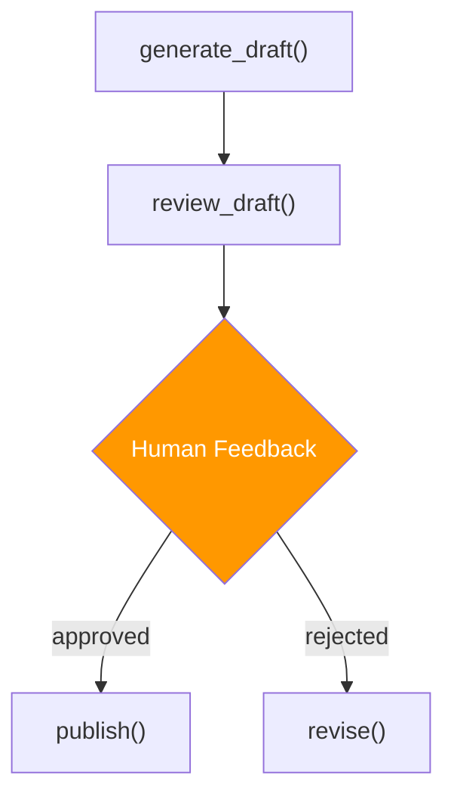

# Human Feedback Decorator

## Introduction

The `@human_feedback` decorator adds **human-in-the-loop checkpoints** to CrewAI Flows. When a flow method is decorated with `@human_feedback`, execution pauses and waits for human input before proceeding. This enables approval workflows, quality gates, and interactive decision-making within automated pipelines.

### What We'll Cover

- The `@human_feedback` decorator and its parameters
- Configuring feedback options with `emit`
- The `HumanFeedbackResult` object
- Accessing feedback history
- Custom feedback providers (Slack, webhooks)
- LLM-powered default responses

### Prerequisites

- Completed [Flow Decorators In-Depth](./03-flow-decorators-in-depth.md)
- Completed [State Management in Flows](./04-state-management-in-flows.md)

---

## Basic Usage

The `@human_feedback` decorator pauses a flow method and requests human input:

```python
from crewai.flow.flow import Flow, start, listen
from crewai.flow.human_feedback import human_feedback


class ApprovalFlow(Flow):
    
    @start()
    def generate_draft(self):
        draft = "AI agents are transforming software development..."
        self.state["draft"] = draft
        print(f"📝 Draft generated: {draft[:50]}...")
        return draft
    
    @human_feedback(
        message="Please review the draft. Approve or reject?",
        emit=["approved", "rejected"],
    )
    @listen(generate_draft)
    def review_draft(self):
        return self.state["draft"]
    
    @listen("approved")
    def publish(self):
        print("✅ Draft approved — publishing!")
        return "Published"
    
    @listen("rejected")
    def revise(self):
        print("🔄 Draft rejected — revising...")
        return "Revision started"
```

### How It Works



1. `generate_draft()` runs and produces a draft
2. `review_draft()` runs but then **pauses** for human input
3. The human sees the message and selects from the `emit` options
4. Based on the choice, the corresponding `@listen()` method fires

---

## Decorator Parameters

| Parameter | Type | Description |
|-----------|------|-------------|
| `message` | `str` | The prompt shown to the human reviewer |
| `emit` | `list[str]` | The available response options (become route names) |
| `llm` | `str` | Optional LLM to generate a default response if no human responds |
| `default_outcome` | `str` | Default option if timeout occurs (must be in `emit` list) |

### Example with All Parameters

```python
@human_feedback(
    message="Review this content for publication. Check for accuracy and tone.",
    emit=["approve", "revise", "reject"],
    llm="gpt-4o-mini",             # LLM suggests a default
    default_outcome="approve",      # Auto-approve if no response
)
@listen(generate_content)
def quality_gate(self):
    return self.state["content"]
```

---

## HumanFeedbackResult

After a human responds, the result is available through `self.last_human_feedback`:

```python
class FeedbackFlow(Flow):
    
    @start()
    def create_proposal(self):
        self.state["proposal"] = "Increase AI research budget by 20%"
        return self.state["proposal"]
    
    @human_feedback(
        message="Do you approve this budget proposal?",
        emit=["approved", "needs_changes"],
    )
    @listen(create_proposal)
    def review_proposal(self):
        return self.state["proposal"]
    
    @listen("approved")
    def process_approval(self):
        feedback = self.last_human_feedback
        print(f"Decision: {feedback.output}")       # "approved"
        print(f"Feedback: {feedback.feedback}")      # Optional text feedback
    
    @listen("needs_changes")
    def handle_changes(self):
        feedback = self.last_human_feedback
        print(f"Changes requested: {feedback.feedback}")
```

### HumanFeedbackResult Properties

| Property | Type | Description |
|----------|------|-------------|
| `output` | `str` | The selected option from `emit` |
| `feedback` | `str` | Optional free-text feedback from the reviewer |

---

## Feedback History

Access the full history of human feedback decisions in a flow:

```python
class MultiReviewFlow(Flow):
    
    @start()
    def begin(self):
        self.state["content"] = "Draft content..."
    
    @human_feedback(message="First review", emit=["pass", "fail"])
    @listen(begin)
    def first_review(self):
        return self.state["content"]
    
    @human_feedback(message="Final review", emit=["publish", "hold"])
    @listen("pass")
    def final_review(self):
        return self.state["content"]
    
    @listen("publish")
    def complete(self):
        # Access all feedback decisions
        for i, feedback in enumerate(self.human_feedback_history):
            print(f"Review {i + 1}: {feedback.output} — {feedback.feedback}")
```

---

## LLM-Powered Defaults

When `llm` is specified, the LLM can suggest a default response if no human is available:

```python
@human_feedback(
    message="Is this analysis accurate? Review the data and methodology.",
    emit=["accurate", "inaccurate", "needs_more_data"],
    llm="gpt-4o-mini",
)
@listen(run_analysis)
def validate_analysis(self):
    return self.state["analysis"]
```

The LLM receives:
- The message prompt
- The method's return value (the content to review)
- The list of `emit` options

It then selects the most appropriate option, which is used if the human doesn't respond.

> **Warning:** LLM defaults should only be used as a fallback, not as a replacement for genuine human review on critical decisions.

---

## Custom Feedback Providers

By default, CrewAI requests feedback via the terminal. For production applications, you can integrate with external systems:

### Slack Integration (Conceptual)

```python
import requests


class SlackFeedbackFlow(Flow):
    
    @start()
    def generate_report(self):
        self.state["report"] = "Monthly AI usage report: 1.2M tokens, $340 cost."
    
    @listen(generate_report)
    def request_slack_approval(self):
        # Send to Slack for approval
        requests.post(
            "https://hooks.slack.com/services/YOUR/WEBHOOK/URL",
            json={
                "text": f"📋 Report ready for review:\n{self.state['report']}\n\nReply: approve / reject",
            },
        )
        print("Approval request sent to Slack")
```

### Webhook Integration (Conceptual)

```python
class WebhookFeedbackFlow(Flow):
    
    @listen(generate_content)
    def request_external_approval(self):
        # POST to your approval system
        response = requests.post(
            "https://api.yourapp.com/approvals",
            json={
                "flow_id": self.state.get("id"),
                "content": self.state["content"],
                "options": ["approve", "reject", "revise"],
            },
        )
        # Poll or use webhooks to get the response
        return response.json()
```

---

## Best Practices

| Practice | Why It Matters |
|----------|----------------|
| Keep `emit` options to 2-4 choices | Too many options slow down decision-making |
| Write clear, specific `message` prompts | Reviewers need context to make good decisions |
| Always set `default_outcome` for automated pipelines | Prevents flows from hanging indefinitely |
| Use `@persist` with `@human_feedback` | Saves state before waiting — safe to restart |
| Log feedback history for audit trails | Critical for compliance and quality tracking |
| Use LLM defaults only as fallbacks | Human judgment should be primary for important decisions |

---

## Common Pitfalls

| ❌ Mistake | ✅ Solution |
|-----------|-------------|
| Using `@human_feedback` without `emit` | Always specify the available options |
| `default_outcome` not in `emit` list | Must be one of the listed `emit` values |
| Not using `@persist` before human feedback | Flow state lost if process restarts while waiting |
| Feedback options that are ambiguous | Use clear action verbs: "approve", "reject", "revise" |
| Forgetting to handle all `emit` options with `@listen()` | Each emitted option needs a corresponding listener |
| Blocking production flows without timeouts | Set `default_outcome` or `llm` for auto-fallback |

---

## Hands-on Exercise

### Your Task

Build a content approval flow with human feedback at a quality gate.

### Requirements

1. Create a `ContentApprovalFlow` with a `@start()` that generates draft content
2. Add a `@human_feedback` checkpoint with three options: `"publish"`, `"revise"`, `"reject"`
3. Create `@listen()` handlers for each option
4. The "revise" handler should loop back to content generation (or print a revision message)
5. Track feedback history and print it at the end

### Expected Result

```
📝 Draft created: "Understanding AI Agents..."
🔍 Review: Please review this content. Publish, revise, or reject?
> User selects: publish
✅ Published! Feedback: "Looks great, ship it."
📊 Review history: 1 decision(s)
```

<details>
<summary>💡 Hints (click to expand)</summary>

- Decorate the review method with both `@human_feedback(...)` and `@listen(method)`
- The `emit` list becomes the route names for downstream `@listen()` handlers
- Access feedback via `self.last_human_feedback.output` and `.feedback`

</details>

<details>
<summary>✅ Solution (click to expand)</summary>

```python
from crewai.flow.flow import Flow, start, listen
from crewai.flow.human_feedback import human_feedback


class ContentApprovalFlow(Flow):
    
    @start()
    def generate_content(self):
        self.state["draft"] = "Understanding AI Agents: A comprehensive guide to building intelligent systems."
        print(f"📝 Draft created: \"{self.state['draft'][:50]}...\"")
        return self.state["draft"]
    
    @human_feedback(
        message="Please review this content. Publish, revise, or reject?",
        emit=["publish", "revise", "reject"],
        default_outcome="publish",
    )
    @listen(generate_content)
    def review(self):
        return self.state["draft"]
    
    @listen("publish")
    def handle_publish(self):
        feedback = self.last_human_feedback
        print(f"✅ Published! Feedback: \"{feedback.feedback}\"")
        self._print_history()
    
    @listen("revise")
    def handle_revise(self):
        feedback = self.last_human_feedback
        print(f"🔄 Revision needed: \"{feedback.feedback}\"")
        self._print_history()
    
    @listen("reject")
    def handle_reject(self):
        feedback = self.last_human_feedback
        print(f"❌ Rejected: \"{feedback.feedback}\"")
        self._print_history()
    
    def _print_history(self):
        history = self.human_feedback_history
        print(f"📊 Review history: {len(history)} decision(s)")
        for i, fb in enumerate(history):
            print(f"  Decision {i+1}: {fb.output}")


flow = ContentApprovalFlow()
flow.kickoff()
```

</details>

### Bonus Challenges

- [ ] Add a second `@human_feedback` checkpoint after revision
- [ ] Set an `llm` parameter to auto-approve content above a quality threshold
- [ ] Integrate with a webhook instead of terminal input

---

## Summary

✅ `@human_feedback` pauses flow execution to collect human input

✅ The `emit` parameter defines available options that become route names for `@listen()`

✅ `HumanFeedbackResult` provides the selected option (`.output`) and free-text feedback (`.feedback`)

✅ Use `self.human_feedback_history` to access all feedback decisions in a flow

✅ Set `default_outcome` or `llm` for automated pipelines that can't wait for human response

**Next:** [Flow Plotting and Visualization](./10-flow-plotting-and-visualization.md)

---

## Further Reading

- [CrewAI Flows Documentation](https://docs.crewai.com/concepts/flows) — `@human_feedback` reference
- [Human-in-the-Loop AI Patterns](https://www.anthropic.com/research/human-feedback) — Design patterns for HITL systems

*Back to [CrewAI with Flows Overview](./00-crewai-with-flows.md)*

<!-- 
Sources Consulted:
- CrewAI Flows: https://docs.crewai.com/concepts/flows
-->
