# Flow Plotting and Visualization

## Introduction

CrewAI Flows can generate **interactive HTML visualizations** of their execution graph. This makes it easy to understand, debug, and document complex multi-step workflows. You can generate plots programmatically with `flow.plot()` or via the CLI with `crewai flow plot`.

### What We'll Cover

- Generating flow visualizations with `flow.plot()`
- Using the CrewAI CLI for plotting
- Reading and interpreting flow diagrams
- Sharing visualizations with your team

### Prerequisites

- Completed [Flow System Architecture](./02-flow-system-architecture.md)
- A flow class with `@start()`, `@listen()`, and optionally `@router()` methods

---

## Generating Visualizations

### Method 1: Programmatic

Call `plot()` on any Flow instance:

```python
from crewai.flow.flow import Flow, start, listen, router


class ContentFlow(Flow):
    
    @start()
    def generate_topic(self):
        return "AI Agents"
    
    @listen(generate_topic)
    def research(self, topic):
        return f"Research on {topic}"
    
    @router(research)
    def classify(self, data):
        return "technical"
    
    @listen("technical")
    def write_technical(self):
        return "Technical article"
    
    @listen("general")
    def write_general(self):
        return "General article"


# Generate the visualization
flow = ContentFlow()
flow.plot("content_flow")
```

This creates a file called `content_flow.html` in the current directory.

**Output:**
```
Plot saved to content_flow.html
```

### Method 2: CLI

```bash
# From your project directory
crewai flow plot
```

This scans for Flow classes in your project and generates HTML visualizations.

---

## Reading Flow Diagrams

The generated HTML visualization shows:

| Element | Representation |
|---------|---------------|
| `@start()` methods | Green nodes at the top |
| `@listen()` methods | Blue nodes connected by arrows |
| `@router()` methods | Purple nodes with multiple outgoing arrows |
| Route names | Labels on arrows from routers |
| `and_()` joins | Nodes with multiple incoming arrows |
| `or_()` triggers | Nodes with dashed incoming arrows |

### Example Visualization Structure

```mermaid
flowchart TD
    A["🟢 generate_topic"] --> B["research"]
    B --> C["🟣 classify"]
    C -->|"technical"| D["write_technical"]
    C -->|"general"| E["write_general"]
    
    style A fill:#4CAF50,color:#fff
    style C fill:#9C27B0,color:#fff
```



The actual HTML visualization is interactive — you can hover over nodes for details, zoom in/out, and drag nodes to rearrange the layout.

---

## Visualizing Complex Flows

For flows with parallel paths and joins:

```python
from crewai.flow.flow import Flow, start, listen, router, or_, and_


class AnalysisPipeline(Flow):
    
    @start()
    def fetch_data_a(self):
        return "Data A"
    
    @start()
    def fetch_data_b(self):
        return "Data B"
    
    @listen(and_(fetch_data_a, fetch_data_b))
    def merge_data(self):
        return "Merged"
    
    @router(merge_data)
    def decide_analysis(self, data):
        return "deep" if len(data) > 100 else "quick"
    
    @listen("deep")
    def deep_analysis(self):
        return "Deep results"
    
    @listen("quick")
    def quick_analysis(self):
        return "Quick results"
    
    @listen(or_(deep_analysis, quick_analysis))
    def generate_report(self, results):
        return f"Report: {results}"


pipeline = AnalysisPipeline()
pipeline.plot("analysis_pipeline")
```

The generated diagram clearly shows:
- Two parallel start nodes
- The `and_()` join point
- The router branching
- The `or_()` convergence

---

## Using Visualizations for Documentation

Flow plots serve as living documentation for your team:

```python
# Generate plots for all flows in your project
class ResearchFlow(Flow):
    """Research pipeline for data analysis."""
    # ... flow methods

class PublishingFlow(Flow):
    """Content publishing pipeline."""
    # ... flow methods

# Document each flow
ResearchFlow().plot("docs/research_flow")
PublishingFlow().plot("docs/publishing_flow")
```

These HTML files can be:
- Committed to your repository
- Included in project wikis
- Shared via internal documentation tools
- Used in design reviews and architecture discussions

---

## Best Practices

| Practice | Why It Matters |
|----------|----------------|
| Generate plots during development | Catch flow design issues early |
| Name plot files descriptively | `"research_pipeline"` not `"flow1"` |
| Regenerate after flow changes | Keep visualizations in sync with code |
| Use plots for code reviews | Reviewers understand flow structure instantly |
| Store plots in a `docs/` directory | Easy to find and version control |
| Add flow docstrings | Some viewers show class docstrings in the plot |

---

## Common Pitfalls

| ❌ Mistake | ✅ Solution |
|-----------|-------------|
| Forgetting to call `plot()` after changes | Add plot generation to your build/test script |
| Huge flows with 20+ nodes | Break into sub-flows; plot each separately |
| Not opening the HTML file | Open in a browser — it's interactive, not just an image |
| Expecting `plot()` to execute the flow | `plot()` only generates the visualization; use `kickoff()` to run |
| Sharing screenshots instead of HTML files | Share the `.html` file — it's interactive and more useful |

---

## Hands-on Exercise

### Your Task

Create a flow with at least 5 nodes including a router, then generate and inspect its visualization.

### Requirements

1. Create a `DocumentPipeline` with:
   - `@start()`: Initialize with a document type
   - `@listen()`: Validate the document
   - `@router()`: Route based on document type (at least 2 routes)
   - `@listen()` for each route: Process the document
   - `@listen(or_(...))`: Finalize regardless of which route was taken
2. Generate the plot with `flow.plot("document_pipeline")`
3. Open the HTML file and verify the graph matches your code

### Expected Result

An HTML file showing a clear flow from start → validation → router → branch handlers → finalization.

<details>
<summary>✅ Solution (click to expand)</summary>

```python
from crewai.flow.flow import Flow, start, listen, router, or_


class DocumentPipeline(Flow):
    
    @start()
    def receive_document(self):
        self.state["doc_type"] = "invoice"
        return self.state["doc_type"]
    
    @listen(receive_document)
    def validate(self, doc_type):
        print(f"Validating {doc_type}...")
        return {"type": doc_type, "valid": True}
    
    @router(validate)
    def route_by_type(self, doc):
        return doc["type"]
    
    @listen("invoice")
    def process_invoice(self):
        return "Invoice processed"
    
    @listen("contract")
    def process_contract(self):
        return "Contract processed"
    
    @listen("report")
    def process_report(self):
        return "Report processed"
    
    @listen(or_(process_invoice, process_contract, process_report))
    def finalize(self, result):
        print(f"✅ {result}")
        return result


flow = DocumentPipeline()
flow.plot("document_pipeline")
print("Open document_pipeline.html in your browser")
```

</details>

---

## Summary

✅ `flow.plot("name")` generates an interactive HTML visualization of the flow graph

✅ The CLI command `crewai flow plot` scans your project for flows to visualize

✅ Flow plots show entry points, listeners, routers, and joins in a clear diagram

✅ Use flow plots for debugging, documentation, code reviews, and team communication

**Next:** [Streaming Flow Execution](./11-streaming-flow-execution.md)

---

## Further Reading

- [CrewAI Flows Documentation](https://docs.crewai.com/concepts/flows) — Plot and visualization section
- [CrewAI CLI Reference](https://docs.crewai.com/concepts/cli) — `crewai flow plot` command

*Back to [CrewAI with Flows Overview](./00-crewai-with-flows.md)*

<!-- 
Sources Consulted:
- CrewAI Flows: https://docs.crewai.com/concepts/flows
-->
