# Agent Within Flow

## Introduction

Not every step in a Flow needs a full Crew. CrewAI lets you use a **single Agent directly** inside a Flow method — no Task or Crew wrapper required. This is ideal for lightweight steps like classification, summarization, or quick data extraction where the overhead of a full Crew is unnecessary.

### What We'll Cover

- Using `agent.kickoff_async()` for direct agent calls
- Structured output with `response_format`
- When to use agents vs crews in Flows
- Combining direct agents and crews in one Flow

### Prerequisites

- Completed [Core Concepts](./01-core-concepts.md)
- Completed [Flow System Architecture](./02-flow-system-architecture.md)

---

## Direct Agent Calls

Use `agent.kickoff_async()` to run an agent without a Crew:

```python
from crewai import Agent
from crewai.flow.flow import Flow, start, listen


class ClassificationFlow(Flow):
    
    @start()
    def receive_text(self):
        self.state["text"] = "Our Q4 revenue grew 15% to $2.3B, driven by cloud services."
        return self.state["text"]
    
    @listen(receive_text)
    async def classify(self, text):
        classifier = Agent(
            role="Content Classifier",
            goal="Classify text into categories",
            backstory="Expert at categorizing business documents.",
            llm="gpt-4o-mini",
        )
        
        result = await classifier.kickoff_async(
            query=f"Classify this text into one category (finance, tech, marketing, general): {text}"
        )
        
        self.state["category"] = result
        print(f"Category: {result}")
        return result
```

### Key Differences: Agent vs Crew

| Feature | Direct Agent | Full Crew |
|---------|-------------|-----------|
| Setup | Agent only | Agent + Task + Crew |
| Invocation | `agent.kickoff_async(query=...)` | `crew.kickoff(inputs=...)` |
| Multi-step reasoning | Single query | Multi-task, multi-agent |
| Tool use | ✅ Supported | ✅ Supported |
| Delegation | ❌ No other agents | ✅ Between crew members |
| Best for | Simple, focused tasks | Complex workflows |

---

## Structured Output with response_format

Direct agents support structured output via `response_format` with Pydantic models:

```python
from crewai import Agent
from crewai.flow.flow import Flow, start, listen
from pydantic import BaseModel


class SentimentResult(BaseModel):
    sentiment: str       # "positive", "negative", "neutral"
    confidence: float    # 0.0 to 1.0
    key_phrases: list[str]


class SentimentFlow(Flow):
    
    @start()
    def receive_review(self):
        return "This product exceeded my expectations. The build quality is outstanding."
    
    @listen(receive_review)
    async def analyze_sentiment(self, review):
        analyst = Agent(
            role="Sentiment Analyst",
            goal="Analyze sentiment with precision",
            backstory="NLP expert specializing in sentiment analysis.",
            llm="gpt-4o-mini",
        )
        
        result = await analyst.kickoff_async(
            query=f"Analyze the sentiment of this review: {review}",
            response_format=SentimentResult,
        )
        
        # result is a SentimentResult instance
        print(f"Sentiment: {result.sentiment}")
        print(f"Confidence: {result.confidence}")
        print(f"Key phrases: {result.key_phrases}")
        return result
```

**Output:**
```
Sentiment: positive
Confidence: 0.95
Key phrases: ["exceeded expectations", "outstanding build quality"]
```

> **🤖 AI Context:** `response_format` uses the LLM's structured output capability (similar to OpenAI's `response_format` parameter) combined with Pydantic validation. The LLM is constrained to output JSON matching your model schema.

---

## Combining Agents and Crews

A single Flow can mix lightweight agent calls with full Crew executions:

```python
from crewai import Agent, Crew, Process, Task
from crewai.flow.flow import Flow, start, listen, router
from pydantic import BaseModel


class ContentType(BaseModel):
    category: str
    complexity: str  # "simple" or "complex"


class HybridFlow(Flow):
    
    @start()
    def receive_request(self):
        self.state["request"] = "Write a technical deep-dive on vector databases"
        return self.state["request"]
    
    @listen(receive_request)
    async def classify_request(self, request):
        """Lightweight agent — no Crew needed."""
        classifier = Agent(
            role="Request Classifier",
            goal="Classify content requests by type and complexity",
            backstory="Expert at triaging content requests.",
            llm="gpt-4o-mini",
        )
        
        result = await classifier.kickoff_async(
            query=f"Classify this request: {request}",
            response_format=ContentType,
        )
        
        self.state["content_type"] = result
        print(f"📋 Type: {result.category}, Complexity: {result.complexity}")
        return result
    
    @router(classify_request)
    def route_by_complexity(self, content_type):
        if content_type.complexity == "complex":
            return "full_crew"
        return "quick_agent"
    
    @listen("full_crew")
    def run_full_crew(self):
        """Complex requests get a full multi-agent Crew."""
        researcher = Agent(
            role="Researcher", goal="Deep research",
            backstory="Expert researcher.", llm="gpt-4o-mini",
        )
        writer = Agent(
            role="Writer", goal="Write technical content",
            backstory="Technical writer.", llm="gpt-4o-mini",
        )
        
        research = Task(
            description=f"Research: {self.state['request']}",
            expected_output="Detailed research findings",
            agent=researcher,
        )
        write = Task(
            description="Write a deep-dive article based on research",
            expected_output="A comprehensive technical article",
            agent=writer,
            context=[research],
        )
        
        crew = Crew(
            agents=[researcher, writer],
            tasks=[research, write],
            process=Process.sequential,
        )
        result = crew.kickoff()
        self.state["output"] = result.raw
        print(f"📝 Full article: {len(result.raw.split())} words")
    
    @listen("quick_agent")
    async def run_quick_agent(self):
        """Simple requests get a single agent."""
        writer = Agent(
            role="Quick Writer",
            goal="Write concise summaries",
            backstory="Fast, accurate writer.",
            llm="gpt-4o-mini",
        )
        result = await writer.kickoff_async(
            query=f"Write a brief summary: {self.state['request']}"
        )
        self.state["output"] = result
        print(f"⚡ Quick summary: {len(result.split())} words")
```

### Execution Pattern

```mermaid
flowchart TD
    A["receive_request()"] --> B["classify_request() — Agent"]
    B --> C{"route_by_complexity()"}
    C -->|"complex"| D["run_full_crew() — Crew"]
    C -->|"simple"| E["run_quick_agent() — Agent"]
    
    style B fill:#4CAF50,color:#fff
    style D fill:#2196F3,color:#fff
    style E fill:#4CAF50,color:#fff
    style C fill:#9C27B0,color:#fff
```



---

## Best Practices

| Practice | Why It Matters |
|----------|----------------|
| Use direct agents for single-step tasks | Avoids Crew overhead for simple operations |
| Use `response_format` for structured output | Guarantees parseable, typed results |
| Use `await` with `kickoff_async` | Direct agent calls are async by default |
| Reserve Crews for multi-step workflows | Crews add value with task chaining and delegation |
| Mix agents and Crews freely in Flows | Use the right tool for each step's complexity |

---

## Common Pitfalls

| ❌ Mistake | ✅ Solution |
|-----------|-------------|
| Creating a Crew for a single classification | Use `agent.kickoff_async()` directly |
| Forgetting `await` on `kickoff_async` | Always `await` — it's an async method |
| Not using `response_format` for structured data | Without it, you get a raw string requiring manual parsing |
| Using direct agents for complex multi-step reasoning | Use a Crew with multiple tasks for complex workflows |
| Synchronous agent calls blocking the Flow | Use `async` methods with `await` for non-blocking execution |

---

## Hands-on Exercise

### Your Task

Build a Flow that uses a direct agent for classification and a Crew for content generation.

### Requirements

1. Create a `SmartPipeline` Flow with three steps:
   - `@start()`: Accept a content request string
   - `@listen()` (async): Use a direct agent with `response_format` to classify the request (returns `category` and `urgency`)
   - `@listen()`: Run a single-agent Crew based on the classification result
2. The classification agent should return a Pydantic model
3. The Crew should reference the classification in its task description

### Expected Result

```
📥 Request: Write an article about AI safety
📋 Category: technical, Urgency: normal
📝 Article generated: 250 words
```

<details>
<summary>💡 Hints (click to expand)</summary>

- Define a `Classification(BaseModel)` with `category: str` and `urgency: str`
- The classification method must be `async` to use `await agent.kickoff_async()`
- Pass classification data through `self.state` to the Crew step

</details>

<details>
<summary>✅ Solution (click to expand)</summary>

```python
from crewai import Agent, Crew, Process, Task
from crewai.flow.flow import Flow, start, listen
from pydantic import BaseModel


class Classification(BaseModel):
    category: str
    urgency: str


class SmartPipeline(Flow):
    
    @start()
    def receive(self):
        self.state["request"] = "Write an article about AI safety"
        print(f"📥 Request: {self.state['request']}")
    
    @listen(receive)
    async def classify(self):
        agent = Agent(
            role="Request Classifier",
            goal="Classify content requests",
            backstory="Expert at triaging requests by type and urgency.",
            llm="gpt-4o-mini",
        )
        result = await agent.kickoff_async(
            query=f"Classify: {self.state['request']}",
            response_format=Classification,
        )
        self.state["classification"] = result
        print(f"📋 Category: {result.category}, Urgency: {result.urgency}")
    
    @listen(classify)
    def generate(self):
        writer = Agent(
            role="Technical Writer",
            goal="Write high-quality articles",
            backstory="Expert writer for developer audiences.",
            llm="gpt-4o-mini",
        )
        task = Task(
            description=f"Write an article: {self.state['request']}",
            expected_output="A 200-word article",
            agent=writer,
        )
        crew = Crew(agents=[writer], tasks=[task], process=Process.sequential)
        result = crew.kickoff()
        print(f"📝 Article generated: {len(result.raw.split())} words")


flow = SmartPipeline()
flow.kickoff()
```

</details>

---

## Summary

✅ Use `agent.kickoff_async(query=...)` for lightweight, single-step agent calls without Crews

✅ `response_format=PydanticModel` gives you typed, validated structured output

✅ Mix direct agents (classification, extraction) with full Crews (research, writing) in a single Flow

✅ Direct agents are async — always use `await` and `async` methods

✅ Choose agents for simple tasks, Crews for complex multi-step workflows

**Next:** [A2A Protocol Integration](./13-a2a-protocol-integration.md)

---

## Further Reading

- [CrewAI Flows Documentation](https://docs.crewai.com/concepts/flows) — Agents in Flows section
- [CrewAI Agents Documentation](https://docs.crewai.com/concepts/agents) — Agent API reference

*Back to [CrewAI with Flows Overview](./00-crewai-with-flows.md)*

<!-- 
Sources Consulted:
- CrewAI Flows: https://docs.crewai.com/concepts/flows
- CrewAI Crews: https://docs.crewai.com/concepts/crews
-->
