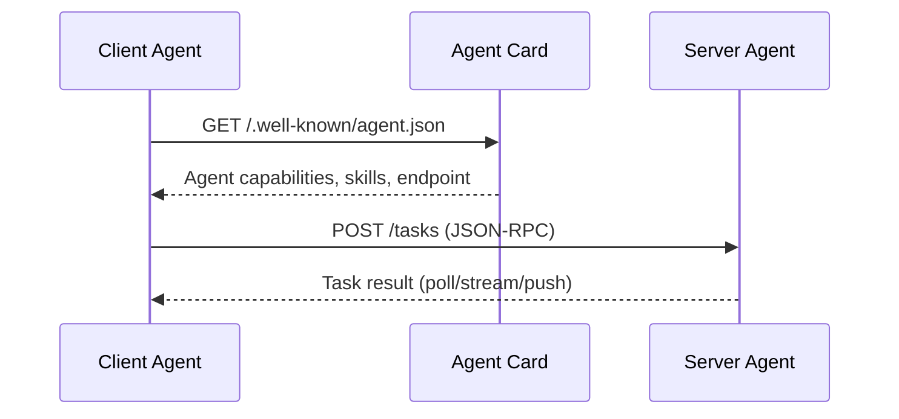
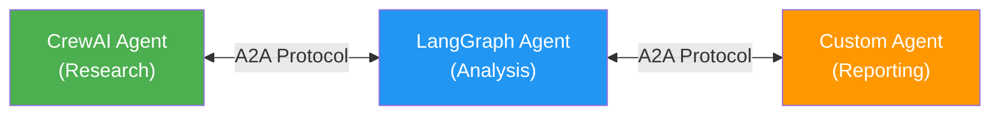

# A2A Protocol Integration

## Introduction

The **Agent-to-Agent (A2A) protocol** enables CrewAI agents to communicate with agents from other frameworks (LangGraph, OpenAI Agents SDK, custom implementations) over a standardized HTTP-based protocol. Starting with CrewAI v1.8+, Flows and Crews can expose themselves as A2A-compatible servers and discover other agents via **agent cards**.

This lesson covers how to set up A2A servers, create agent cards, and enable cross-framework agent interoperability.

### What We'll Cover

- What the A2A protocol is and why it matters
- Creating an A2A server from a CrewAI agent
- Agent cards for discovery
- Transport modes (poll, stream, push)
- Cross-framework interoperability

### Prerequisites

- Completed [Core Concepts](./01-core-concepts.md)
- Completed [Crews Within Flows](./05-crews-within-flows.md)
- Understanding of HTTP APIs and JSON

---

## What Is A2A?

A2A (Agent-to-Agent) is Google's open protocol for agent interoperability. It standardizes how agents:

1. **Discover** each other (agent cards)
2. **Send tasks** to each other (task execution)
3. **Receive results** (synchronous, streaming, or push)



### Why A2A Matters

| Without A2A | With A2A |
|-------------|----------|
| Agents locked to one framework | Agents from any framework can collaborate |
| Custom integration code per pair | Standard protocol for all agents |
| No discovery mechanism | Agent cards advertise capabilities |
| Tightly coupled systems | Loosely coupled, interoperable agents |

---

## Agent Cards

Every A2A agent publishes an **agent card** — a JSON document describing its capabilities:

```json
{
  "name": "Research Agent",
  "description": "Finds and analyzes information on any topic",
  "url": "http://localhost:8000",
  "version": "1.0.0",
  "capabilities": {
    "streaming": true,
    "pushNotifications": false
  },
  "skills": [
    {
      "id": "research",
      "name": "Topic Research",
      "description": "Researches any topic and returns a structured report"
    }
  ],
  "authentication": {
    "schemes": ["bearer"]
  }
}
```

Agent cards are served at the well-known URL: `GET /.well-known/agent.json`

### Agent Card Fields

| Field | Description |
|-------|-------------|
| `name` | Human-readable agent name |
| `description` | What the agent does |
| `url` | Base URL for the agent's A2A endpoint |
| `version` | Agent version |
| `capabilities` | Supported features (streaming, push notifications) |
| `skills` | List of tasks the agent can perform |
| `authentication` | Required auth schemes |

---

## Creating an A2A Server

CrewAI agents can be exposed as A2A servers:

```python
from crewai import Agent, Crew, Process, Task


# Define your crew
researcher = Agent(
    role="Research Analyst",
    goal="Research topics thoroughly",
    backstory="Expert researcher with 10 years experience.",
    llm="gpt-4o-mini",
)

research_task = Task(
    description="Research the given topic: {topic}",
    expected_output="A detailed research report",
    agent=researcher,
)

crew = Crew(
    agents=[researcher],
    tasks=[research_task],
    process=Process.sequential,
)
```

### Server Configuration

```python
# a2a_server.py
from crewai.a2a import CrewA2AServer

server = CrewA2AServer(
    crew=crew,
    name="Research Agent",
    description="Finds and analyzes information on any topic",
    port=8000,
    skills=[
        {
            "id": "research",
            "name": "Topic Research",
            "description": "Researches any topic and returns a structured report",
        }
    ],
)

# Start the server
server.start()
```

```bash
# Run the server
python a2a_server.py
# Server running at http://localhost:8000
# Agent card at http://localhost:8000/.well-known/agent.json
```

---

## Transport Modes

A2A supports three ways to receive task results:

### 1. Polling (Default)

```python
# Client sends a task and polls for the result
import requests

# Submit task
response = requests.post("http://localhost:8000/tasks", json={
    "jsonrpc": "2.0",
    "method": "tasks/send",
    "params": {
        "message": {
            "role": "user",
            "parts": [{"text": "Research AI agents in 2025"}]
        }
    },
    "id": "1"
})

task_id = response.json()["result"]["id"]

# Poll for completion
while True:
    status = requests.post("http://localhost:8000/tasks", json={
        "jsonrpc": "2.0",
        "method": "tasks/get",
        "params": {"id": task_id},
        "id": "2"
    })
    result = status.json()["result"]
    if result["status"]["state"] in ["completed", "failed"]:
        break
```

### 2. Streaming (SSE)

```python
# Stream results as they're generated
response = requests.post(
    "http://localhost:8000/tasks",
    json={
        "jsonrpc": "2.0",
        "method": "tasks/sendSubscribe",
        "params": {
            "message": {
                "role": "user",
                "parts": [{"text": "Research AI agents"}]
            }
        },
        "id": "1"
    },
    stream=True,
)

for line in response.iter_lines():
    if line:
        print(line.decode())
```

### 3. Push Notifications

```python
# Server pushes results to a webhook
response = requests.post("http://localhost:8000/tasks", json={
    "jsonrpc": "2.0",
    "method": "tasks/send",
    "params": {
        "message": {
            "role": "user",
            "parts": [{"text": "Research AI agents"}]
        },
        "pushNotification": {
            "url": "https://your-app.com/webhook/callback"
        }
    },
    "id": "1"
})
```

### Transport Comparison

| Mode | Pattern | Best For |
|------|---------|----------|
| Poll | Request → wait → check | Simple integrations |
| Stream | Request → receive chunks | Real-time UIs |
| Push | Request → webhook callback | Background processing |

---

## Cross-Framework Interoperability

A2A enables CrewAI agents to work with agents from other frameworks:



### Calling an External A2A Agent from a Flow

```python
import requests
from crewai.flow.flow import Flow, start, listen


class CrossFrameworkFlow(Flow):
    
    @start()
    def research(self):
        # Use CrewAI crew locally
        result = research_crew.kickoff(inputs={"topic": "AI agents"})
        self.state["research"] = result.raw
        return result.raw
    
    @listen(research)
    def analyze_with_external(self, research):
        """Call a LangGraph agent via A2A protocol."""
        response = requests.post(
            "http://langgraph-agent:8001/tasks",
            json={
                "jsonrpc": "2.0",
                "method": "tasks/send",
                "params": {
                    "message": {
                        "role": "user",
                        "parts": [{"text": f"Analyze this research: {research[:500]}"}]
                    }
                },
                "id": "1"
            },
        )
        result = response.json()["result"]
        self.state["analysis"] = result
        return result
```

---

## Best Practices

| Practice | Why It Matters |
|----------|----------------|
| Publish detailed agent cards | Other agents need to discover your capabilities |
| Use streaming for long-running tasks | Clients get progress updates without timeout issues |
| Keep skills focused and well-described | Clear skill descriptions help clients select the right agent |
| Add authentication for production agents | Prevent unauthorized access to your A2A endpoints |
| Version your agent cards | Clients can handle API changes gracefully |
| Test with the A2A reference client | Ensures protocol compliance |

---

## Common Pitfalls

| ❌ Mistake | ✅ Solution |
|-----------|-------------|
| No agent card at `/.well-known/agent.json` | Ensure the well-known path is configured and accessible |
| Vague skill descriptions | Be specific: "Research AI trends with data" not "Research" |
| Not handling task timeouts | Set appropriate timeouts for polling; use streaming for long tasks |
| Exposing agents without authentication | Add bearer token or API key authentication |
| Assuming all agents speak A2A | Check for agent card before sending tasks |

---

## Hands-on Exercise

### Your Task

Create a simple A2A-compatible agent card and understand the protocol flow.

### Requirements

1. Write an agent card JSON document for a "Content Writer" agent with two skills: "blog_post" and "summary"
2. Include capabilities for streaming (true) and push notifications (false)
3. Write a Python function that validates the agent card structure
4. Simulate a task request and response as JSON-RPC messages

### Expected Result

```json
{
  "name": "Content Writer Agent",
  "skills": [
    {"id": "blog_post", "name": "Blog Post Writer"},
    {"id": "summary", "name": "Content Summarizer"}
  ]
}
```

<details>
<summary>✅ Solution (click to expand)</summary>

```python
import json


# Step 1: Agent card
agent_card = {
    "name": "Content Writer Agent",
    "description": "Writes blog posts and summaries on any topic",
    "url": "http://localhost:8000",
    "version": "1.0.0",
    "capabilities": {
        "streaming": True,
        "pushNotifications": False,
    },
    "skills": [
        {
            "id": "blog_post",
            "name": "Blog Post Writer",
            "description": "Writes engaging blog posts of 300-500 words",
        },
        {
            "id": "summary",
            "name": "Content Summarizer",
            "description": "Summarizes long text into concise bullet points",
        },
    ],
    "authentication": {"schemes": ["bearer"]},
}


# Step 2: Validation
def validate_agent_card(card: dict) -> bool:
    required = ["name", "description", "url", "version", "skills"]
    for field in required:
        if field not in card:
            print(f"Missing: {field}")
            return False
    for skill in card.get("skills", []):
        if "id" not in skill or "name" not in skill:
            print(f"Invalid skill: {skill}")
            return False
    return True


print(f"Valid: {validate_agent_card(agent_card)}")
print(json.dumps(agent_card, indent=2))


# Step 3: Simulated task request
task_request = {
    "jsonrpc": "2.0",
    "method": "tasks/send",
    "params": {
        "message": {
            "role": "user",
            "parts": [{"text": "Write a blog post about AI agents"}],
        }
    },
    "id": "task-001",
}

# Simulated response
task_response = {
    "jsonrpc": "2.0",
    "result": {
        "id": "task-001",
        "status": {"state": "completed"},
        "artifacts": [
            {
                "parts": [{"text": "# AI Agents: The Future of Software\n\n..."}]
            }
        ],
    },
    "id": "task-001",
}

print(f"\nRequest: {json.dumps(task_request, indent=2)}")
print(f"\nResponse: {json.dumps(task_response, indent=2)}")
```

</details>

---

## Summary

✅ A2A is Google's open protocol for agent-to-agent communication across frameworks

✅ **Agent cards** advertise capabilities at `/.well-known/agent.json`

✅ Three transport modes: **polling** (simple), **streaming** (real-time), **push** (background)

✅ CrewAI agents can be exposed as A2A servers and consume external A2A agents

✅ A2A enables cross-framework interoperability (CrewAI ↔ LangGraph ↔ custom agents)

**Next:** [Native Async Support](./14-native-async-support.md)

---

## Further Reading

- [A2A Protocol Specification](https://github.com/google/A2A) — Google's official A2A repository
- [CrewAI A2A Integration](https://docs.crewai.com/concepts/a2a) — CrewAI-specific A2A documentation

*Back to [CrewAI with Flows Overview](./00-crewai-with-flows.md)*

<!-- 
Sources Consulted:
- Google A2A Protocol: https://github.com/google/A2A
- CrewAI Flows: https://docs.crewai.com/concepts/flows
-->
