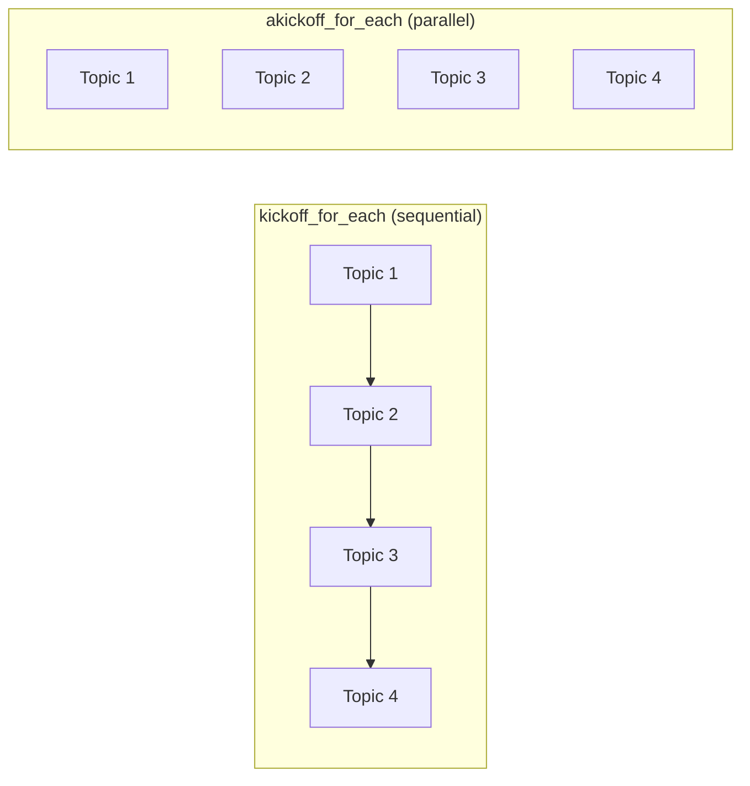

# Native Async Support

## Introduction

CrewAI v1.7+ provides **native async support** across Flows, Crews, Tasks, and Agents. This means you can run non-blocking operations — multiple LLM calls, API requests, and agent executions — concurrently without custom threading code.

Async support is especially valuable for batch processing, parallel crew execution, and building responsive web applications.

### What We'll Cover

- Async flow methods
- `akickoff()` for async crew execution
- `akickoff_for_each()` for parallel batch processing
- Async agents with `kickoff_async()`
- Combining async patterns in production

### Prerequisites

- Completed [Flow System Architecture](./02-flow-system-architecture.md)
- Understanding of Python `async`/`await` and `asyncio`

---

## Async Flow Methods

Flow methods can be defined as `async` to perform non-blocking operations:

```python
import asyncio
from crewai.flow.flow import Flow, start, listen


class AsyncFlow(Flow):
    
    @start()
    async def fetch_data(self):
        print("⏳ Fetching data (non-blocking)...")
        await asyncio.sleep(1)  # Simulate async I/O
        self.state["data"] = "Fetched data"
        print("✅ Data fetched")
        return self.state["data"]
    
    @listen(fetch_data)
    async def process_data(self, data):
        print(f"⚙️ Processing: {data}")
        await asyncio.sleep(0.5)
        return f"Processed: {data}"


flow = AsyncFlow()
result = flow.kickoff()
print(result)
```

**Output:**
```
⏳ Fetching data (non-blocking)...
✅ Data fetched
⚙️ Processing: Fetched data
Processed: Fetched data
```

Flow's `kickoff()` handles the event loop automatically — you don't need to call `asyncio.run()` manually.

---

## Async Crew Execution

### akickoff() — Single Async Run

```python
import asyncio
from crewai import Agent, Crew, Process, Task


async def run_research():
    researcher = Agent(
        role="Researcher",
        goal="Research AI trends",
        backstory="Expert researcher.",
        llm="gpt-4o-mini",
    )
    task = Task(
        description="Research AI agent trends for 2025",
        expected_output="Key trends summary",
        agent=researcher,
    )
    crew = Crew(
        agents=[researcher],
        tasks=[task],
        process=Process.sequential,
    )
    
    # Async execution — non-blocking
    result = await crew.akickoff(inputs={"topic": "AI agents"})
    print(f"Result: {result.raw[:100]}...")
    return result


asyncio.run(run_research())
```

### akickoff_for_each() — Parallel Batch

Process multiple inputs concurrently:

```python
import asyncio
from crewai import Agent, Crew, Process, Task


async def batch_research():
    researcher = Agent(
        role="Researcher",
        goal="Research the given topic",
        backstory="Expert at researching any topic.",
        llm="gpt-4o-mini",
    )
    task = Task(
        description="Write a 50-word summary of {topic}",
        expected_output="A concise summary",
        agent=researcher,
    )
    crew = Crew(
        agents=[researcher],
        tasks=[task],
        process=Process.sequential,
    )
    
    topics = [
        {"topic": "AI agents"},
        {"topic": "Vector databases"},
        {"topic": "Fine-tuning LLMs"},
        {"topic": "RAG architecture"},
    ]
    
    # All four run concurrently
    results = await crew.akickoff_for_each(inputs=topics)
    
    for i, result in enumerate(results):
        print(f"Topic {i+1}: {result.raw[:80]}...")
    
    return results


asyncio.run(batch_research())
```

### Execution Comparison

| Method | Behavior | Use Case |
|--------|----------|----------|
| `kickoff()` | Synchronous, blocking | Simple scripts |
| `akickoff()` | Async, non-blocking | Web servers, parallel operations |
| `kickoff_for_each()` | Synchronous batch | Sequential batch processing |
| `akickoff_for_each()` | Async parallel batch | High-throughput batch processing |



---

## Async in Flows with Crews

Combine async flow methods with async crew execution:

```python
from crewai import Agent, Crew, Process, Task
from crewai.flow.flow import Flow, start, listen, and_
from pydantic import BaseModel


class PipelineState(BaseModel):
    market_data: str = ""
    competitor_data: str = ""
    report: str = ""


class ParallelResearchFlow(Flow[PipelineState]):
    
    @start()
    async def research_market(self):
        """Run market research crew asynchronously."""
        crew = self._build_crew("market analysis")
        result = await crew.akickoff(inputs={"focus": "market trends"})
        self.state.market_data = result.raw
        print(f"📊 Market research: {len(result.raw)} chars")
    
    @start()
    async def research_competitors(self):
        """Run competitor research crew asynchronously."""
        crew = self._build_crew("competitor analysis")
        result = await crew.akickoff(inputs={"focus": "competitor landscape"})
        self.state.competitor_data = result.raw
        print(f"🔍 Competitor research: {len(result.raw)} chars")
    
    @listen(and_(research_market, research_competitors))
    async def synthesize(self):
        """Both research streams complete — synthesize report."""
        print("📋 Synthesizing report from both research streams...")
        crew = self._build_crew("report synthesis")
        result = await crew.akickoff(inputs={
            "market": self.state.market_data[:300],
            "competitors": self.state.competitor_data[:300],
        })
        self.state.report = result.raw
        print(f"✅ Report: {len(result.raw.split())} words")
    
    def _build_crew(self, focus: str) -> Crew:
        agent = Agent(
            role=f"{focus.title()} Analyst",
            goal=f"Analyze {focus}",
            backstory=f"Expert at {focus}.",
            llm="gpt-4o-mini",
        )
        task = Task(
            description=f"Analyze {focus}: {{focus}}",
            expected_output=f"Detailed {focus} report",
            agent=agent,
        )
        return Crew(agents=[agent], tasks=[task], process=Process.sequential)


flow = ParallelResearchFlow()
flow.kickoff()
```

Since both `@start()` methods are async, they run **concurrently** — cutting total execution time roughly in half compared to sequential execution.

---

## Async Agents (Direct)

Direct agent calls are async by default:

```python
from crewai import Agent
from crewai.flow.flow import Flow, start, listen


class QuickClassifyFlow(Flow):
    
    @start()
    async def classify(self):
        agent = Agent(
            role="Classifier",
            goal="Classify input text",
            backstory="Classification expert.",
            llm="gpt-4o-mini",
        )
        
        # Already async — no Crew needed
        result = await agent.kickoff_async(
            query="Classify this as positive or negative: 'Great product!'"
        )
        print(f"Classification: {result}")
        return result
```

---

## Concurrency Control

When running many async operations, control concurrency with semaphores:

```python
import asyncio
from crewai import Crew


async def controlled_batch(crew: Crew, inputs_list: list[dict], max_concurrent: int = 3):
    """Run crew for multiple inputs with controlled concurrency."""
    semaphore = asyncio.Semaphore(max_concurrent)
    
    async def process_one(inputs: dict):
        async with semaphore:
            return await crew.akickoff(inputs=inputs)
    
    tasks = [process_one(inputs) for inputs in inputs_list]
    results = await asyncio.gather(*tasks)
    return results


# Usage
inputs_list = [{"topic": f"Topic {i}"} for i in range(10)]
results = asyncio.run(controlled_batch(crew, inputs_list, max_concurrent=3))
# Only 3 crews run at a time, preventing API rate limit issues
```

---

## Best Practices

| Practice | Why It Matters |
|----------|----------------|
| Use `akickoff()` in web servers | Non-blocking keeps the server responsive |
| Use `akickoff_for_each()` for batch processing | Much faster than sequential `kickoff_for_each()` |
| Control concurrency with semaphores | Prevents API rate limit errors |
| Make flow methods `async` when doing I/O | Enables concurrent execution of `@start()` methods |
| Use `asyncio.gather()` for parallel tasks | Runs multiple coroutines concurrently |
| Don't mix `asyncio.run()` with Flow's `kickoff()` | Flow handles the event loop internally |

---

## Common Pitfalls

| ❌ Mistake | ✅ Solution |
|-----------|-------------|
| Using `kickoff()` in an async context | Use `akickoff()` — `kickoff()` is synchronous |
| Calling `asyncio.run()` inside a Flow method | Flow's `kickoff()` manages the event loop; just use `await` |
| No concurrency limit on batch operations | Use `asyncio.Semaphore` to control parallel execution |
| Forgetting `await` on async calls | Always `await` coroutines — missing it returns a coroutine object |
| Assuming parallel = faster | LLM API rate limits may throttle parallel requests |
| Not handling async exceptions | Use try/except inside async methods or `asyncio.gather(return_exceptions=True)` |

---

## Hands-on Exercise

### Your Task

Build a Flow that runs two research crews in parallel using async.

### Requirements

1. Create a `ParallelFlow` with two `@start()` async methods
2. Each `@start()` method runs a different crew with `akickoff()`
3. Use `and_()` to join both results
4. The join method prints both results and total word count
5. Compare execution time with sequential vs parallel execution

### Expected Result

```
📊 Crew A complete: 150 words (1.2s)
🔍 Crew B complete: 180 words (1.4s)
📋 Combined: 330 words total
Total time: ~1.4s (parallel) vs ~2.6s (sequential)
```

<details>
<summary>✅ Solution (click to expand)</summary>

```python
import time
from crewai import Agent, Crew, Process, Task
from crewai.flow.flow import Flow, start, listen, and_
from pydantic import BaseModel


class ParallelState(BaseModel):
    result_a: str = ""
    result_b: str = ""


class ParallelFlow(Flow[ParallelState]):
    
    @start()
    async def crew_a(self):
        t = time.time()
        agent = Agent(
            role="Market Analyst",
            goal="Analyze market trends",
            backstory="Expert market analyst.",
            llm="gpt-4o-mini",
        )
        task = Task(
            description="Write a 100-word summary of AI market trends",
            expected_output="A concise market summary",
            agent=agent,
        )
        crew = Crew(agents=[agent], tasks=[task], process=Process.sequential)
        result = await crew.akickoff()
        self.state.result_a = result.raw
        print(f"📊 Crew A: {len(result.raw.split())} words ({time.time()-t:.1f}s)")
    
    @start()
    async def crew_b(self):
        t = time.time()
        agent = Agent(
            role="Tech Analyst",
            goal="Analyze technology trends",
            backstory="Expert tech analyst.",
            llm="gpt-4o-mini",
        )
        task = Task(
            description="Write a 100-word summary of AI technology trends",
            expected_output="A concise tech summary",
            agent=agent,
        )
        crew = Crew(agents=[agent], tasks=[task], process=Process.sequential)
        result = await crew.akickoff()
        self.state.result_b = result.raw
        print(f"🔍 Crew B: {len(result.raw.split())} words ({time.time()-t:.1f}s)")
    
    @listen(and_(crew_a, crew_b))
    def combine(self):
        words_a = len(self.state.result_a.split())
        words_b = len(self.state.result_b.split())
        print(f"📋 Combined: {words_a + words_b} words total")


t_start = time.time()
flow = ParallelFlow()
flow.kickoff()
print(f"Total time: {time.time() - t_start:.1f}s")
```

</details>

---

## Summary

✅ Use `akickoff()` for non-blocking async crew execution

✅ Use `akickoff_for_each()` to process multiple inputs in parallel

✅ Async `@start()` methods in Flows run **concurrently**, reducing total execution time

✅ Control concurrency with `asyncio.Semaphore` to respect API rate limits

✅ Direct agent calls via `agent.kickoff_async()` are async by default

**Next:** [HITL for Flows](./15-hitl-for-flows.md)

---

## Further Reading

- [CrewAI Crews Documentation](https://docs.crewai.com/concepts/crews) — `akickoff()` and async execution
- [Python asyncio Documentation](https://docs.python.org/3/library/asyncio.html) — Async programming reference

*Back to [CrewAI with Flows Overview](./00-crewai-with-flows.md)*

<!-- 
Sources Consulted:
- CrewAI Crews: https://docs.crewai.com/concepts/crews
- CrewAI Flows: https://docs.crewai.com/concepts/flows
-->
