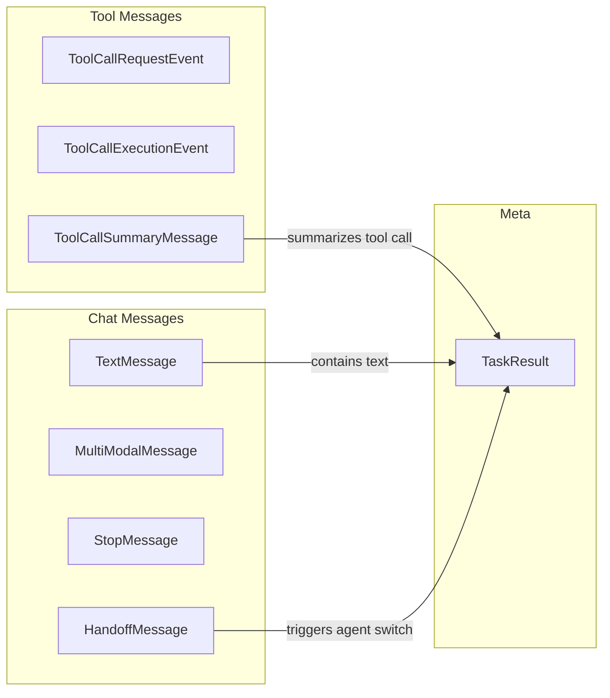

# Architecture and core concepts

## Introduction

AutoGen 0.7.5 is a complete async-first redesign of Microsoft's agent framework — built from the ground up for event-driven, multi-agent AI applications. If you've seen tutorials referencing the old `pyautogen` package, forget them — this is an entirely new system.

Understanding AutoGen's architecture is essential before building agents, because every agent, team, tool, and memory component follows the same design patterns: async messaging, modular packages, and serializable components.

### What we'll cover

- The three-package architecture (`autogen-core`, `autogen-agentchat`, `autogen-ext`)
- Async-first design and how `run()` / `run_stream()` work
- Event-driven messaging and the message type hierarchy
- The Component protocol for serialization and portability
- Cross-language support (Python and .NET)
- How all the pieces fit together in a real application

### Prerequisites

- Python 3.10+ installed
- Understanding of `async` / `await` in Python (see [Unit 02: Async Programming](../../02-python-for-ai-development/09-async-programming/00-async-programming.md))
- Familiarity with AI agent concepts (see [Agent Fundamentals](../01-agent-fundamentals/01-what-are-ai-agents.md))
- An OpenAI API key set as `OPENAI_API_KEY` environment variable

---

## The evolution to 0.7.x

AutoGen originated as a Microsoft Research project for multi-agent conversation. The original `pyautogen` (v0.2.x) used synchronous, class-based patterns where agents called each other directly. Version 0.7.x is a **complete rewrite** — not an incremental upgrade.

| Aspect | Old pyautogen (0.2.x) | AutoGen 0.7.5 |
|--------|----------------------|----------------|
| Execution model | Synchronous | Async-first (`async`/`await`) |
| Communication | Direct function calls | Event-driven messages |
| Package structure | Single monolith | Three modular packages |
| Agent types | `ConversableAgent` | `AssistantAgent`, `UserProxyAgent`, custom |
| Team patterns | Two-agent chat | RoundRobin, Selector, Swarm, GraphFlow, MagenticOne |
| Serialization | Manual | Built-in Component protocol |
| Language support | Python only | Python and .NET |

> **⚠️ Warning:** Code written for `pyautogen` 0.2.x will **not** work with AutoGen 0.7.x. The APIs are completely different. If you see imports from `autogen` (without the dash), that's the old package.

---

## Package architecture

AutoGen 0.7.5 follows a layered, modular design split into three packages. Each package has a clear responsibility, and you install only what you need.

```mermaid
graph TB
    subgraph "autogen-ext"
        E1[OpenAIChatCompletionClient]
        E2[AzureOpenAIChatCompletionClient]
        E3[McpWorkbench]
        E4[DockerCommandLineCodeExecutor]
        E5[ChromaDBVectorMemory]
        E6[RedisMemory]
        E7[Magentic-One Agents]
    end

    subgraph "autogen-agentchat"
        A1[AssistantAgent]
        A2[UserProxyAgent]
        A3[Teams: RoundRobin / Selector / Swarm]
        A4[GraphFlow / MagenticOne]
        A5[Termination Conditions]
    end

    subgraph "autogen-core"
        C1[Agent Runtime]
        C2[Messaging Protocol]
        C3[Component Protocol]
        C4[Model Client Interface]
        C5[Memory Protocol]
    end

    A1 --> C1
    A2 --> C1
    A3 --> C2
    E1 --> C4
    E5 --> C5
    E3 --> C1

    style C1 fill:#2d6a4f,color:#fff
    style C2 fill:#2d6a4f,color:#fff
    style C3 fill:#2d6a4f,color:#fff
    style C4 fill:#2d6a4f,color:#fff
    style C5 fill:#2d6a4f,color:#fff
```



### autogen-core — The foundation

`autogen-core` is the base layer that defines the contracts everything else builds on. You rarely import from it directly, but every agent and team depends on it.

```python
# Core abstractions you'll encounter
from autogen_core import CancellationToken, Component, ComponentModel
from autogen_core.models import (
    ChatCompletionClient,    # Interface for model clients
    SystemMessage,           # System prompt message
    UserMessage,             # User input message
    AssistantMessage,        # Model response message
)
from autogen_core.memory import Memory, MemoryContent  # Memory protocol
```

**Output:**
```
(No output — these are interface imports used by higher-level packages)
```

🔑 **Key concept:** `autogen-core` defines **protocols and interfaces**, not implementations. It specifies *what* a model client, memory store, or agent runtime must do — but not *how*.

The core package provides:

| Component | Purpose |
|-----------|---------|
| **Agent Runtime** | Manages agent lifecycle, message routing, and execution |
| **Messaging Protocol** | Typed message classes for inter-agent communication |
| **Component Protocol** | `dump_component()` / `load_component()` serialization |
| **Model Client Interface** | `ChatCompletionClient` abstract base for LLM providers |
| **Memory Protocol** | `Memory` abstract base for storage backends |

### autogen-agentchat — The high-level API

`autogen-agentchat` is where you spend most of your time. It provides ready-to-use agents and team orchestration patterns.

```python
from autogen_agentchat.agents import AssistantAgent, UserProxyAgent
from autogen_agentchat.teams import (
    RoundRobinGroupChat,
    SelectorGroupChat,
    Swarm,
    MagenticOneGroupChat,
    GraphFlow,
)
from autogen_agentchat.conditions import (
    TextMentionTermination,
    MaxMessageTermination,
    HandoffTermination,
)
from autogen_agentchat.messages import TextMessage, HandoffMessage
```

**Output:**
```
(No output — these are imports for building agent applications)
```

We explore each of these components in dedicated lessons. For now, understand the **scope**: `autogen-agentchat` gives you agents, teams, conditions, and messages.

### autogen-ext — Extensions and integrations

`autogen-ext` provides concrete implementations of the interfaces defined in `autogen-core`. We install specific extras based on what we need.

```bash
# Install with OpenAI support
pip install "autogen-ext[openai]"

# Install with Azure OpenAI support
pip install "autogen-ext[azure]"

# Install with MCP (Model Context Protocol) support
pip install "autogen-ext[mcp]"

# Install with memory backends
pip install "autogen-ext[chromadb]"
pip install "autogen-ext[redis]"

# Install with Docker code execution
pip install "autogen-ext[docker]"
```

**Output:**
```
Successfully installed autogen-ext-0.7.5 ...
```

Common extension imports:

```python
# Model clients (implementations of ChatCompletionClient)
from autogen_ext.models.openai import OpenAIChatCompletionClient
from autogen_ext.models.openai import AzureOpenAIChatCompletionClient

# Tool integrations
from autogen_ext.tools.mcp import McpWorkbench

# Code executors
from autogen_ext.code_executors.docker import DockerCommandLineCodeExecutor

# Memory backends
from autogen_ext.memory.chromadb import ChromaDBVectorMemory
```

**Output:**
```
(No output — these are imports for specific integrations)
```

> **💡 Tip:** Install only the extras you need. Each extra pulls in its own dependencies (e.g., `[chromadb]` installs ChromaDB, `[docker]` installs Docker SDK). This keeps your environment lean.

---

## Async-first design

Every operation in AutoGen 0.7.5 is asynchronous. There are no synchronous alternatives. We use `async`/`await` throughout, and the framework runs on Python's native `asyncio` event loop.

### Why async matters for agents

Agents often wait for LLM API responses, tool execution, or other agents to reply. Asynchronous design means we don't block the entire program while waiting — other agents can process messages concurrently.

```python
import asyncio
from autogen_agentchat.agents import AssistantAgent
from autogen_ext.models.openai import OpenAIChatCompletionClient

async def main():
    # Create a model client
    model_client = OpenAIChatCompletionClient(model="gpt-4o-mini")

    # Create an agent
    agent = AssistantAgent(
        name="assistant",
        model_client=model_client,
        system_message="You are a helpful assistant. Be concise.",
    )

    # Run the agent — returns a TaskResult
    result = await agent.run(task="What is the capital of France?")

    print(f"Result type: {type(result).__name__}")
    print(f"Messages: {len(result.messages)}")
    for msg in result.messages:
        print(f"  [{msg.source}] {msg.content[:80]}")

    # Always close the model client when done
    await model_client.close()

asyncio.run(main())
```

**Output:**
```
Result type: TaskResult
Messages: 2
  [user] What is the capital of France?
  [assistant] The capital of France is Paris.
```

### run() vs run_stream()

AutoGen provides two ways to execute agents and teams:

| Method | Returns | Use case |
|--------|---------|----------|
| `run(task=...)` | `TaskResult` (all at once) | Simple scripts, batch processing |
| `run_stream(task=...)` | `AsyncGenerator` of messages + `TaskResult` | Live UIs, streaming responses |

```python
import asyncio
from autogen_agentchat.agents import AssistantAgent
from autogen_ext.models.openai import OpenAIChatCompletionClient

async def stream_example():
    model_client = OpenAIChatCompletionClient(model="gpt-4o-mini")
    agent = AssistantAgent(
        name="assistant",
        model_client=model_client,
        system_message="You are a helpful assistant. Be concise.",
    )

    # run_stream yields messages as they arrive
    async for message in agent.run_stream(task="Name three planets."):
        if hasattr(message, "source"):
            print(f"[{message.source}] {message.content}")
        else:
            # The last item is the TaskResult
            print(f"--- Final: {type(message).__name__} ---")

    await model_client.close()

asyncio.run(stream_example())
```

**Output:**
```
[user] Name three planets.
[assistant] Three planets are Earth, Mars, and Jupiter.
--- Final: TaskResult ---
```

> **🤖 AI Context:** The `run_stream()` method is essential for web applications. When building chat UIs, we stream each agent's response as it arrives rather than waiting for the full team conversation to finish. This gives users immediate feedback.

### The TaskResult object

Every `run()` call returns a `TaskResult`. Every `run_stream()` yields individual messages and ends with a `TaskResult`. Let's inspect its structure.

```python
import asyncio
from autogen_agentchat.agents import AssistantAgent
from autogen_ext.models.openai import OpenAIChatCompletionClient

async def inspect_result():
    model_client = OpenAIChatCompletionClient(model="gpt-4o-mini")
    agent = AssistantAgent(
        name="assistant",
        model_client=model_client,
        system_message="You are a helpful assistant.",
    )

    result = await agent.run(task="Say hello in Spanish.")

    # TaskResult fields
    print(f"messages:      {len(result.messages)} messages")
    print(f"stop_reason:   {result.stop_reason}")

    # Each message has a type, source, and content
    for msg in result.messages:
        print(f"  type={type(msg).__name__}, source={msg.source}")

    await model_client.close()

asyncio.run(inspect_result())
```

**Output:**
```
messages:      2 messages
stop_reason:   None
  type=TextMessage, source=user
  type=TextMessage, source=assistant
```

---

## Event-driven messaging

Agents in AutoGen don't call each other directly. Instead, they communicate through **typed messages**. The runtime routes messages between agents, and each agent reacts to the messages it receives.

### Message type hierarchy

AutoGen defines a rich set of message types, each serving a specific purpose:



Here are the core message types:

| Message Type | Purpose | Key Fields |
|-------------|---------|------------|
| `TextMessage` | Plain text between agents | `source`, `content` |
| `MultiModalMessage` | Text + images | `source`, `content` (list of text/images) |
| `StopMessage` | Signals the agent wants to stop | `source`, `content` |
| `HandoffMessage` | Passes control to another agent | `source`, `target`, `content` |
| `ToolCallRequestEvent` | Agent requests a tool call | `source`, `content` (list of `FunctionCall`) |
| `ToolCallExecutionEvent` | Result of tool execution | `source`, `content` (list of `FunctionExecutionResult`) |
| `ToolCallSummaryMessage` | LLM summary of tool results | `source`, `content` |

### Working with messages

Let's examine the messages that flow through a simple tool-calling interaction:

```python
import asyncio
from autogen_agentchat.agents import AssistantAgent
from autogen_ext.models.openai import OpenAIChatCompletionClient

# Define a simple tool
def get_weather(city: str) -> str:
    """Get the current weather for a city."""
    weather_data = {
        "paris": "22°C, sunny",
        "london": "15°C, cloudy",
        "tokyo": "28°C, humid",
    }
    return weather_data.get(city.lower(), "Weather data not available")

async def message_inspection():
    model_client = OpenAIChatCompletionClient(model="gpt-4o-mini")
    agent = AssistantAgent(
        name="weather_bot",
        model_client=model_client,
        tools=[get_weather],
        system_message="You help with weather queries. Be concise.",
    )

    result = await agent.run(task="What's the weather in Paris?")

    # Inspect each message in the conversation
    for i, msg in enumerate(result.messages):
        print(f"Message {i}:")
        print(f"  Type:   {type(msg).__name__}")
        print(f"  Source: {msg.source}")
        print(f"  Content: {str(msg.content)[:100]}")
        print()

    await model_client.close()

asyncio.run(message_inspection())
```

**Output:**
```
Message 0:
  Type:   TextMessage
  Source: user
  Content: What's the weather in Paris?

Message 1:
  Type:   ToolCallRequestEvent
  Source: weather_bot
  Content: [FunctionCall(id='call_abc123', name='get_weather', arguments='{"city": "Paris"}')]

Message 2:
  Type:   ToolCallExecutionEvent
  Source: weather_bot
  Content: [FunctionExecutionResult(call_id='call_abc123', content='22°C, sunny')]

Message 3:
  Type:   ToolCallSummaryMessage
  Source: weather_bot
  Content: The weather in Paris is 22°C and sunny.
```

> **🔑 Key concept:** The message sequence tells a complete story: user asks → agent requests tool → tool executes → agent summarizes. Every step is captured as a typed message, making debugging and logging straightforward.

### Message fields

All messages share common fields:

```python
from autogen_agentchat.messages import TextMessage

# Creating a message manually (useful for testing)
msg = TextMessage(content="Hello, agent!", source="user")

print(f"content: {msg.content}")
print(f"source:  {msg.source}")
print(f"type:    {msg.type}")
```

**Output:**
```
content: Hello, agent!
source:  user
type:    TextMessage
```

---

## Component protocol

One of AutoGen's most powerful architectural features is the **Component protocol**. Every major component — agents, teams, model clients, memory backends — can serialize itself to JSON and reconstruct from JSON.

### How it works

The protocol defines two methods:

| Method | Direction | Purpose |
|--------|-----------|---------|
| `dump_component()` | Object → JSON | Serialize a component to a portable config |
| `Component.load_component()` | JSON → Object | Reconstruct a component from config |

```python
import asyncio
import json
from autogen_agentchat.agents import AssistantAgent
from autogen_ext.models.openai import OpenAIChatCompletionClient

async def serialization_demo():
    model_client = OpenAIChatCompletionClient(model="gpt-4o-mini")
    agent = AssistantAgent(
        name="assistant",
        model_client=model_client,
        system_message="You are a helpful coding assistant.",
    )

    # Serialize the agent to a component config
    config = agent.dump_component()
    config_json = config.model_dump_json(indent=2)
    print("Serialized config:")
    print(config_json[:300])
    print("...")

    # Reconstruct the agent from config
    restored_agent = AssistantAgent.load_component(json.loads(config_json))
    print(f"\nRestored agent name: {restored_agent.name}")

    await model_client.close()

asyncio.run(serialization_demo())
```

**Output:**
```
Serialized config:
{
  "provider": "autogen_agentchat.agents.AssistantAgent",
  "component_type": "agent",
  "version": 1,
  "description": "An agent that uses a language model.",
  "config": {
    "name": "assistant",
    "model_client": {
      "provider": "autogen_ext.models.openai.OpenAIChatCompletionClient",
      "config": {
        "model": "gpt-4o-mini"
      }
    },
    "system_message": "You are a helpful coding assistant."
  }
}
...

Restored agent name: assistant
```

### Why serialization matters

The Component protocol enables several critical workflows:

- **🔑 Portability:** Save agent configurations to files and share them across projects
- **🔑 Version control:** Store agent configs in Git alongside your code
- **🔑 AutoGen Studio:** The visual UI uses component configs to define and edit agents
- **🔑 Deployment:** Load agent configurations from environment-specific config files

> **🤖 AI Context:** In production web applications, we often define agent configurations in JSON files or databases rather than hardcoding them. The Component protocol makes this natural — we load the config at startup, modify parameters based on the environment, and instantiate agents dynamically.

### Pydantic BaseModel configs

Under the hood, every component config is a Pydantic `BaseModel`. This means we get automatic validation, type checking, and schema generation.

```python
from autogen_ext.models.openai import OpenAIChatCompletionClient

# The model client validates its configuration
client = OpenAIChatCompletionClient(model="gpt-4o-mini")

# dump_component returns a ComponentModel (Pydantic BaseModel)
config = client.dump_component()
print(f"Config type: {type(config).__name__}")
print(f"Provider:    {config.provider}")
```

**Output:**
```
Config type: ComponentModel
Provider:    autogen_ext.models.openai.OpenAIChatCompletionClient
```

---

## Cross-language support

AutoGen is not Python-only. Microsoft maintains both **Python** and **.NET** implementations that share the same architectural concepts.

| Feature | Python | .NET |
|---------|--------|------|
| Package | `autogen-agentchat` | `Microsoft.AutoGen` |
| Runtime | `asyncio` | `async`/`await` (C#) |
| Model clients | `OpenAIChatCompletionClient` | `OpenAIChatCompletionClient` |
| Agent types | Same concepts | Same concepts |
| Interop | gRPC-based agent runtime | gRPC-based agent runtime |

> **Note:** The .NET implementation follows the same core concepts but uses C# idioms. Agents built in Python and .NET can communicate through a shared gRPC-based runtime, enabling polyglot multi-agent systems.

For this course, we focus on the Python implementation. The architectural concepts transfer directly to .NET if you need them later.

---

## Putting it all together

Let's build a small example that demonstrates all the architectural concepts: the package layers, async execution, typed messages, and component serialization.

```python
import asyncio
import json
from autogen_agentchat.agents import AssistantAgent
from autogen_agentchat.teams import RoundRobinGroupChat
from autogen_agentchat.conditions import MaxMessageTermination
from autogen_ext.models.openai import OpenAIChatCompletionClient

async def architecture_demo():
    # 1. autogen-ext: Create a model client (implements core interface)
    model_client = OpenAIChatCompletionClient(model="gpt-4o-mini")

    # 2. autogen-agentchat: Create agents
    planner = AssistantAgent(
        name="planner",
        model_client=model_client,
        system_message="You plan solutions to problems. Be concise and specific.",
    )

    reviewer = AssistantAgent(
        name="reviewer",
        model_client=model_client,
        system_message="You review plans and suggest improvements. Be concise.",
    )

    # 3. autogen-agentchat: Create a team with termination
    termination = MaxMessageTermination(max_messages=4)
    team = RoundRobinGroupChat(
        participants=[planner, reviewer],
        termination_condition=termination,
    )

    # 4. Async execution: Run the team
    result = await team.run(task="How should we structure a REST API for a todo app?")

    # 5. Event-driven messaging: Inspect the messages
    print("=== Message Flow ===")
    for msg in result.messages:
        print(f"[{msg.source}] ({type(msg).__name__}) {msg.content[:80]}...")
    print(f"\nStop reason: {result.stop_reason}")

    # 6. Component protocol: Serialize the team
    team_config = team.dump_component()
    print(f"\n=== Serialized Team ===")
    print(f"Provider: {team_config.provider}")
    print(f"Type:     {team_config.component_type}")

    await model_client.close()

asyncio.run(architecture_demo())
```

**Output:**
```
=== Message Flow ===
[user] (TextMessage) How should we structure a REST API for a todo app?...
[planner] (TextMessage) Here's a concise plan for a REST API for a todo app:

1. **Resources*...
[reviewer] (TextMessage) Good plan! A few improvements:

1. **Versioning**: Add API vers...
[planner] (TextMessage) Great suggestions! Updated plan incorporating your feedback:

1. **Base ...

Stop reason: Maximum number of messages 4 reached, current message count: 4

=== Serialized Team ===
Provider: autogen_agentchat.teams.RoundRobinGroupChat
Type:     team
```

This example touches every layer:

- ✅ **autogen-ext** provides the `OpenAIChatCompletionClient`
- ✅ **autogen-agentchat** provides `AssistantAgent`, `RoundRobinGroupChat`, and `MaxMessageTermination`
- ✅ **autogen-core** powers the runtime, messaging, and component protocol underneath
- ✅ **Async-first** — everything uses `async`/`await`
- ✅ **Event-driven** — agents exchange typed `TextMessage` objects
- ✅ **Component protocol** — the entire team serializes to JSON

---

## Best practices

| Practice | Rationale |
|----------|-----------|
| Install only the `autogen-ext` extras you need | Keeps dependencies minimal and avoids version conflicts |
| Always use `async`/`await` — don't wrap in `threading` | AutoGen is designed for `asyncio`; mixing paradigms causes bugs |
| Close model clients with `await model_client.close()` | Prevents connection pool leaks in long-running applications |
| Use `run_stream()` for user-facing applications | Provides immediate feedback; `run()` blocks until completion |
| Serialize team configs to JSON files for production | Enables config-driven deployment without code changes |
| Set explicit termination conditions on every team | Prevents infinite agent loops and unexpected API costs |
| Pin your `autogen-agentchat` version in `requirements.txt` | API changes between minor versions; lock for reproducibility |

---

## Common pitfalls

| ❌ Mistake | ✅ Solution |
|-----------|------------|
| Installing the old `pyautogen` package | Install `autogen-agentchat` and `autogen-ext[openai]` for v0.7.x |
| Calling `agent.run()` without `await` | Every call must be awaited: `result = await agent.run(task=...)` |
| Using `asyncio.run()` inside Jupyter notebooks | Use `await agent.run(task=...)` directly — Jupyter has its own event loop |
| Forgetting termination conditions on teams | Always add `MaxMessageTermination` or similar to prevent runaway conversations |
| Importing from `autogen` instead of `autogen_agentchat` | The underscore packages (`autogen_agentchat`, `autogen_core`, `autogen_ext`) are the 0.7.x packages |
| Not closing model clients | Call `await model_client.close()` or use `async with` to avoid resource leaks |
| Mixing sync and async code | Don't call `asyncio.run()` inside an existing async context; nest with `await` instead |

---

## Hands-on exercise

### Your task

Build a simple "code review" system that demonstrates AutoGen's architecture. Create two agents — a **coder** and a **reviewer** — that collaborate using a `RoundRobinGroupChat`. Inspect the message flow and serialize the team configuration to JSON.

### Requirements

1. Create an `OpenAIChatCompletionClient` with `gpt-4o-mini`
2. Create a `coder` agent with a system message about writing Python functions
3. Create a `reviewer` agent with a system message about reviewing code for best practices
4. Assemble them in a `RoundRobinGroupChat` with `MaxMessageTermination(max_messages=4)`
5. Run the team with the task: `"Write a Python function to check if a string is a palindrome."`
6. Print each message's `type`, `source`, and first 100 characters of `content`
7. Serialize the team with `dump_component()` and print the JSON

<details>
<summary>💡 Hints</summary>

- Remember to import from three packages: `autogen_agentchat.agents`, `autogen_agentchat.teams`, and `autogen_ext.models.openai`
- Wrap everything in an `async def main()` and call it with `asyncio.run(main())`
- Use `result.messages` to iterate through the conversation
- Call `team.dump_component().model_dump_json(indent=2)` to get formatted JSON
- Don't forget `await model_client.close()` at the end

</details>

<details>
<summary>✅ Solution</summary>

```python
import asyncio
import json
from autogen_agentchat.agents import AssistantAgent
from autogen_agentchat.teams import RoundRobinGroupChat
from autogen_agentchat.conditions import MaxMessageTermination
from autogen_ext.models.openai import OpenAIChatCompletionClient

async def main():
    # Create model client
    model_client = OpenAIChatCompletionClient(model="gpt-4o-mini")

    # Create agents
    coder = AssistantAgent(
        name="coder",
        model_client=model_client,
        system_message=(
            "You are a Python developer. Write clean, well-documented "
            "functions with type hints and docstrings. Be concise."
        ),
    )

    reviewer = AssistantAgent(
        name="reviewer",
        model_client=model_client,
        system_message=(
            "You review Python code for best practices, edge cases, "
            "and performance. Suggest specific improvements. Be concise."
        ),
    )

    # Create team with termination
    termination = MaxMessageTermination(max_messages=4)
    team = RoundRobinGroupChat(
        participants=[coder, reviewer],
        termination_condition=termination,
    )

    # Run the team
    result = await team.run(
        task="Write a Python function to check if a string is a palindrome."
    )

    # Inspect messages
    print("=== Message Flow ===")
    for msg in result.messages:
        print(f"  Type: {type(msg).__name__}")
        print(f"  Source: {msg.source}")
        print(f"  Content: {msg.content[:100]}...")
        print()

    # Serialize team
    config_json = team.dump_component().model_dump_json(indent=2)
    print("=== Team Configuration ===")
    print(config_json)

    await model_client.close()

asyncio.run(main())
```

</details>

### Expected result

```
=== Message Flow ===
  Type: TextMessage
  Source: user
  Content: Write a Python function to check if a string is a palindrome....

  Type: TextMessage
  Source: coder
  Content: ```python
def is_palindrome(text: str) -> bool:
    """Check if a string is a palindrome..."""...

  Type: TextMessage
  Source: reviewer
  Content: Good implementation! A few suggestions: 1. Consider case-insensitivity...

  Type: TextMessage
  Source: coder
  Content: Updated based on feedback...

=== Team Configuration ===
{
  "provider": "autogen_agentchat.teams.RoundRobinGroupChat",
  ...
}
```

### Bonus challenges

1. Add a third agent (`tester`) that writes test cases, and observe how the round-robin pattern cycles through all three
2. Save the serialized team config to a `.json` file, then load it back with `RoundRobinGroupChat.load_component()` and run it again
3. Replace `run()` with `run_stream()` and print each message as it arrives in real time

---

## Summary

✅ AutoGen 0.7.5 is a complete async-first redesign — not compatible with the old `pyautogen` 0.2.x package

✅ The three-package architecture (`autogen-core` → `autogen-agentchat` → `autogen-ext`) separates interfaces from implementations, letting you install only what you need

✅ Everything is async — `run()` returns `TaskResult`, `run_stream()` yields messages for real-time UIs

✅ Agents communicate through typed messages (`TextMessage`, `HandoffMessage`, `ToolCallRequestEvent`, etc.) routed by the runtime

✅ The Component protocol (`dump_component()` / `load_component()`) enables portable, config-driven agent deployments

**Next:** [AgentChat High-Level API](./02-agentchat-high-level-api.md)

---

## Further reading

- 📖 [AutoGen Architecture Overview](https://microsoft.github.io/autogen/stable/user-guide/core-user-guide/design-patterns/intro.html) — Official design patterns guide
- 📖 [AgentChat Tutorial](https://microsoft.github.io/autogen/stable/user-guide/agentchat-user-guide/tutorial/agents.html) — Step-by-step agent tutorial
- 📖 [AutoGen Packages](https://microsoft.github.io/autogen/stable/packages/index.html) — Package reference documentation
- 📖 [Component Protocol](https://microsoft.github.io/autogen/stable/user-guide/agentchat-user-guide/serialize-components.html) — Serialization guide
- 📖 [AutoGen .NET](https://microsoft.github.io/autogen/stable/dotnet-user-guide/index.html) — .NET implementation guide

---

[Back to AutoGen AgentChat Overview](./00-autogen-agentchat.md)

<!-- Sources Consulted:
- AutoGen Documentation: https://microsoft.github.io/autogen/stable/
- AutoGen AgentChat Tutorial: https://microsoft.github.io/autogen/stable/user-guide/agentchat-user-guide/tutorial/agents.html
- AutoGen Quickstart: https://microsoft.github.io/autogen/stable/user-guide/agentchat-user-guide/quickstart.html
- AutoGen Packages: https://microsoft.github.io/autogen/stable/packages/index.html
- AutoGen Serialization: https://microsoft.github.io/autogen/stable/user-guide/agentchat-user-guide/serialize-components.html
- AutoGen GitHub: https://github.com/microsoft/autogen
- AutoGen PyPI: https://pypi.org/project/autogen-agentchat/
-->
