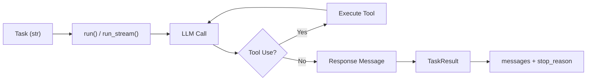

# AgentChat High-Level API

## Introduction

Building AI agents from scratch requires wiring up model calls, message routing, tool execution, and state management — all before you write a single line of business logic. AutoGen's **AgentChat** layer eliminates that boilerplate. It sits on top of `autogen-core` and gives us preset agents, team orchestrators, and termination conditions that let us go from idea to working agent in minutes.

In this lesson, we'll explore the AgentChat high-level API in depth. We'll create agents, run them in both blocking and streaming modes, understand the message types that flow through the system, and survey the full catalog of preset agents available out of the box.

### What we'll cover

- Setting up a model client and creating an `AssistantAgent`
- Running agents with `run()` and `run_stream()`
- Understanding `TaskResult` and the agent lifecycle
- Working with AgentChat message types including multimodal input
- Surveying preset agents: `UserProxyAgent`, `CodeExecutorAgent`, `OpenAIAssistantAgent`, and more
- Configuring model clients for OpenAI and Azure
- Best practices and common pitfalls

### Prerequisites

- Python 3.10+ installed
- Familiarity with `async`/`await` in Python (see [Unit 9: Async Programming](../../02-python-for-ai-development/09-async-programming/))
- An OpenAI API key (or Azure OpenAI endpoint)
- Packages installed:

```bash
pip install autogen-agentchat autogen-ext[openai]
```

---

## Creating your first agent

Every AgentChat application starts with two things: a **model client** and an **agent**. The model client handles communication with the LLM provider, while the agent wraps that client with a persona, tools, and state management.

### Setting up the model client

The `OpenAIChatCompletionClient` connects to any OpenAI-compatible API. It reads your `OPENAI_API_KEY` environment variable automatically:

```python
from autogen_ext.models.openai import OpenAIChatCompletionClient

model_client = OpenAIChatCompletionClient(model="gpt-4o")
```

**Output:**
```
# No output — the client is created but no API call is made yet.
```

> **Note:** For Azure OpenAI, use `AzureOpenAIChatCompletionClient` from the same module and pass `azure_endpoint`, `api_version`, and `azure_ad_token_provider` or `api_key`.

### Building an AssistantAgent

The `AssistantAgent` is the main workhorse of AgentChat. It wraps a model client with instructions, tools, and identity:

```python
from autogen_agentchat.agents import AssistantAgent

agent = AssistantAgent(
    name="research_assistant",
    model_client=model_client,
    system_message=(
        "You are a helpful research assistant. "
        "Provide concise, well-sourced answers to questions."
    ),
    description="A research assistant that answers factual questions.",
)
```

**Output:**
```
# No output — the agent is instantiated but hasn't processed any task yet.
```

Here's a breakdown of the key `AssistantAgent` parameters:

| Parameter | Type | Purpose |
|-----------|------|---------|
| `name` | `str` | Unique identifier for the agent (required) |
| `model_client` | `ChatCompletionClient` | LLM provider connection (required) |
| `system_message` | `str` | Instructions that shape the agent's behavior |
| `tools` | `list[Tool \| Callable]` | Functions the agent can invoke |
| `description` | `str` | Used by team orchestrators for speaker selection |
| `memory` | `list[Memory]` | Memory instances for long-term context |
| `model_client_stream` | `bool` | Enable token-level streaming |
| `output_content_type` | `type[BaseModel]` | Pydantic model for structured output |
| `reflect_on_tool_use` | `bool` | Summarize tool output in natural language |
| `handoffs` | `list[Handoff \| str]` | Targets for the Swarm handoff pattern |

### Running the agent

We call `run()` with a task string. Since AgentChat is fully async, we use `await`:

```python
import asyncio
from autogen_agentchat.agents import AssistantAgent
from autogen_ext.models.openai import OpenAIChatCompletionClient

async def main():
    model_client = OpenAIChatCompletionClient(model="gpt-4o")

    agent = AssistantAgent(
        name="research_assistant",
        model_client=model_client,
        system_message="You are a helpful research assistant.",
    )

    result = await agent.run(task="What is AutoGen?")
    print(result.messages[-1].content)

asyncio.run(main())
```

**Output:**
```
AutoGen is an open-source framework by Microsoft Research for building
multi-agent AI applications. It enables developers to create agents that
can collaborate, use tools, execute code, and interact with humans to
solve complex tasks.
```

> **Warning:** Agents are **stateful**. Each call to `run()` appends to the agent's internal conversation history. Pass only *new* messages — never resend the entire history, or you'll get duplicated context and inflated token usage.

---

## Running agents

AgentChat provides two execution modes — blocking and streaming — plus a console helper for formatted output during development.

### Blocking execution with `run()`

The `run()` method processes the entire task and returns a `TaskResult` object once complete:

```python
result = await agent.run(task="Explain the transformer architecture in two sentences.")
```

**Output:**
```
TaskResult(messages=[...], stop_reason=None)
```

The `TaskResult` object contains:

| Attribute | Type | Description |
|-----------|------|-------------|
| `messages` | `list[AgentEvent \| ChatMessage]` | All messages generated during the run |
| `stop_reason` | `str \| None` | Why the agent stopped (e.g., termination condition met) |

To extract the final response:

```python
final_message = result.messages[-1]
print(f"Source: {final_message.source}")
print(f"Content: {final_message.content}")
```

**Output:**
```
Source: research_assistant
Content: The transformer architecture uses self-attention mechanisms to process
all tokens in a sequence simultaneously, enabling efficient parallelization.
It consists of an encoder-decoder structure with multi-head attention layers,
feed-forward networks, and residual connections.
```

### Streaming execution with `run_stream()`

For real-time output — critical in web applications — use `run_stream()`. It yields each message as it's produced, with the `TaskResult` as the final item:

```python
async for message in agent.run_stream(task="Write a haiku about coding."):
    if isinstance(message, TaskResult):
        print(f"\n--- Done. Stop reason: {message.stop_reason} ---")
    else:
        print(message)
```

**Output:**
```
source='user' content='Write a haiku about coding.'
source='research_assistant' content='Lines of logic flow\nBugs hide in the
indentation\nCompile, run, repeat'

--- Done. Stop reason: None ---
```

When `model_client_stream=True` is set on the agent, `run_stream()` also yields `ModelClientStreamingChunkEvent` objects — individual tokens as they arrive from the LLM.

### The Console helper

During development, the `Console` helper renders streamed output with color-coded sources and formatted content:

```python
from autogen_agentchat.ui import Console

await Console(agent.run_stream(task="What are the benefits of type hints in Python?"))
```

**Output:**
```
---------- user ----------
What are the benefits of type hints in Python?
---------- research_assistant ----------
Type hints improve code readability, enable better IDE support with
autocompletion and error detection, facilitate static analysis with tools
like mypy, and serve as living documentation for function signatures.
```

> **Note:** `Console` is designed for terminal/notebook development. For production web applications, iterate over `run_stream()` directly and push messages to your frontend via WebSockets or Server-Sent Events.

### Agent lifecycle

The following diagram illustrates how a task flows through an agent:



---

## Message types in AgentChat

AgentChat uses a rich set of message types to represent every interaction. Understanding these types is essential for building agents that process tool calls, handle multimodal input, and integrate into larger teams.

### Core message types

| Message Type | Module | Description |
|---|---|---|
| `TextMessage` | `autogen_agentchat.messages` | Plain text communication between agents |
| `MultiModalMessage` | `autogen_agentchat.messages` | Text combined with images or other media |
| `HandoffMessage` | `autogen_agentchat.messages` | Transfers control to another agent (Swarm pattern) |
| `StopMessage` | `autogen_agentchat.messages` | Signals that the agent wants to stop |
| `StructuredMessage` | `autogen_agentchat.messages` | Output validated against a Pydantic model |

### Event types

Events represent intermediate steps in the agent's processing pipeline:

| Event Type | Description |
|---|---|
| `ToolCallRequestEvent` | Agent requests a tool invocation |
| `ToolCallExecutionEvent` | Result returned from tool execution |
| `ToolCallSummaryMessage` | Natural language summary of tool results (when `reflect_on_tool_use=True`) |
| `ModelClientStreamingChunkEvent` | Individual token from streaming response |
| `UserInputRequestedEvent` | Agent is waiting for human input |

### Working with TextMessage

The most common message type. Every `run()` call starts with a `TextMessage` from the user:

```python
from autogen_agentchat.messages import TextMessage

result = await agent.run(task="What is reinforcement learning?")

for msg in result.messages:
    if isinstance(msg, TextMessage):
        print(f"[{msg.source}]: {msg.content[:80]}...")
```

**Output:**
```
[user]: What is reinforcement learning?...
[research_assistant]: Reinforcement learning is a machine learning paradigm where an agent learns to...
```

### Multimodal input

To send images alongside text, we use `MultiModalMessage` with the `Image` class:

```python
from autogen_agentchat.messages import MultiModalMessage
from autogen_core import Image

multimodal_msg = MultiModalMessage(
    content=[
        "Describe what you see in this architecture diagram.",
        Image.from_file("architecture.png"),
    ],
    source="user",
)

result = await agent.run(task=multimodal_msg)
print(result.messages[-1].content)
```

**Output:**
```
The diagram shows a microservices architecture with three services —
an API gateway, an authentication service, and a data processing pipeline —
connected through a message broker.
```

> **Note:** Multimodal support requires a vision-capable model like `gpt-4o`. Models without vision capabilities will raise an error when processing `Image` content.

---

## Preset agents

AgentChat ships with several preset agents beyond `AssistantAgent`. Each serves a distinct role in multi-agent applications.

| Agent | Module | Purpose | Key Parameters |
|---|---|---|---|
| `AssistantAgent` | `autogen_agentchat.agents` | General-purpose LLM agent with tool use | `model_client`, `tools`, `system_message` |
| `UserProxyAgent` | `autogen_agentchat.agents` | Human-in-the-loop input collection | `name`, `description` |
| `CodeExecutorAgent` | `autogen_agentchat.agents` | Executes code blocks from messages | `code_executor` |
| `OpenAIAssistantAgent` | `autogen_ext.agents.openai` | Wraps OpenAI Assistants API | `client`, `assistant_id` |
| `MultimodalWebSurfer` | `autogen_ext.agents.magentic_one` | LLM-powered browser automation | `model_client`, `headless` |
| `FileSurfer` | `autogen_ext.agents.magentic_one` | Reads and navigates local files | `model_client` |

### UserProxyAgent

The `UserProxyAgent` pauses execution and prompts a human for input. This is how we build human-in-the-loop workflows:

```python
from autogen_agentchat.agents import UserProxyAgent

user_proxy = UserProxyAgent(
    name="human_reviewer",
    description="A human reviewer who approves or rejects proposals.",
)
```

**Output:**
```
# No output — the agent waits for a team context to request input.
```

When a team routes a message to this agent, it emits a `UserInputRequestedEvent`. Your application listens for this event and collects input from the user — through a terminal prompt, a web form, or any other interface.

### CodeExecutorAgent

The `CodeExecutorAgent` extracts code blocks from incoming messages and executes them in a sandboxed environment:

```python
from autogen_agentchat.agents import CodeExecutorAgent
from autogen_ext.code_executors.local import LocalCommandLineCodeExecutor

code_executor = CodeExecutorAgent(
    name="executor",
    code_executor=LocalCommandLineCodeExecutor(work_dir="./output"),
)
```

**Output:**
```
# No output — the agent is ready to execute code blocks.
```

> **Warning:** `LocalCommandLineCodeExecutor` runs code directly on your machine. For production use, prefer `DockerCommandLineCodeExecutor` from `autogen_ext.code_executors.docker` to isolate execution in containers.

### OpenAIAssistantAgent

This agent wraps the OpenAI Assistants API, giving you access to features like file search, code interpreter, and persistent threads managed by OpenAI:

```python
from autogen_ext.agents.openai import OpenAIAssistantAgent
from openai import AsyncOpenAI

openai_client = AsyncOpenAI()

openai_agent = OpenAIAssistantAgent(
    name="file_analyst",
    description="Analyzes uploaded files using OpenAI Assistants.",
    client=openai_client,
    model="gpt-4o",
    instructions="You analyze data files and provide insights.",
    tools=["code_interpreter"],
)
```

**Output:**
```
# No output — the assistant is created on the OpenAI platform.
```

---

## Model client configuration

### OpenAI

The standard setup reads credentials from the `OPENAI_API_KEY` environment variable:

```python
from autogen_ext.models.openai import OpenAIChatCompletionClient

client = OpenAIChatCompletionClient(
    model="gpt-4o",
    # Optional overrides:
    # api_key="sk-...",
    # base_url="https://custom-endpoint.com/v1",
    # temperature=0.7,
    # max_tokens=4096,
)
```

**Output:**
```
# No output — client is configured and ready.
```

### Azure OpenAI

For Azure deployments, use the Azure-specific client with your endpoint and authentication:

```python
from autogen_ext.models.openai import AzureOpenAIChatCompletionClient
from azure.identity import DefaultAzureCredential, get_bearer_token_provider

token_provider = get_bearer_token_provider(
    DefaultAzureCredential(),
    "https://cognitiveservices.azure.com/.default",
)

azure_client = AzureOpenAIChatCompletionClient(
    azure_deployment="gpt-4o",
    model="gpt-4o",
    api_version="2024-12-01-preview",
    azure_endpoint="https://your-resource.openai.azure.com/",
    azure_ad_token_provider=token_provider,
)
```

**Output:**
```
# No output — Azure client is configured with Entra ID authentication.
```

> **Note:** You can also pass `api_key` directly instead of using `azure_ad_token_provider`. Token-based authentication is recommended for production environments.

---

## Best practices

| Practice | Rationale |
|---|---|
| Set a clear `system_message` | Focused instructions produce more consistent, higher-quality responses |
| Always provide a `description` | Team orchestrators use it for intelligent speaker selection |
| Use `reflect_on_tool_use=True` for user-facing agents | Converts raw tool output into natural language the user can understand |
| Enable `model_client_stream=True` in web apps | Gives users immediate feedback instead of waiting for the full response |
| Keep agent names unique within a team | Name collisions cause routing errors in multi-agent setups |
| Use `DockerCommandLineCodeExecutor` in production | Isolates code execution and prevents untrusted code from affecting your host |
| Close model clients when done | Call `await model_client.close()` to release HTTP connections properly |
| Store API keys in environment variables | Never hardcode secrets — use `os.environ` or a secrets manager |

---

## Common pitfalls

| ❌ Mistake | ✅ Correction |
|---|---|
| Resending full conversation history in each `run()` call | Agents are stateful — pass only the new task or message |
| Using `LocalCommandLineCodeExecutor` in production | Use `DockerCommandLineCodeExecutor` to sandbox execution |
| Forgetting `await` on `run()` or `run_stream()` | Both are async — always `await` or use `async for` |
| Not handling `TaskResult` at the end of `run_stream()` | The last item yielded is always a `TaskResult`, not a message |
| Creating agents with duplicate names in a team | Each agent name must be unique — duplicates cause routing failures |
| Ignoring `stop_reason` on `TaskResult` | Check it to understand why the agent stopped and handle edge cases |
| Passing images to non-vision models | Use `gpt-4o` or another vision-capable model for `MultiModalMessage` |

---

## Hands-on exercise

**Build a research agent with tool use and streaming output.**

1. Create a `FunctionTool` that takes a topic string and returns a mock summary (simulate an API call):

```python
from autogen_agentchat.agents import AssistantAgent
from autogen_core.tools import FunctionTool
from autogen_ext.models.openai import OpenAIChatCompletionClient

def search_knowledge_base(topic: str) -> str:
    """Search the internal knowledge base for information on a topic."""
    knowledge = {
        "autogen": "AutoGen is a multi-agent AI framework by Microsoft Research.",
        "langchain": "LangChain is a framework for building LLM-powered applications.",
        "rag": "RAG combines retrieval systems with generative models for grounded responses.",
    }
    return knowledge.get(topic.lower(), f"No information found for '{topic}'.")

search_tool = FunctionTool(search_knowledge_base, description="Search the knowledge base.")
```

2. Create an `AssistantAgent` that uses this tool with `reflect_on_tool_use=True`.

3. Run the agent with `run_stream()` and print each message.

4. Ask the agent about "AutoGen", then (without resetting) ask about "RAG" to observe stateful behavior.

**Challenge extension:** Add a second tool that formats results as Markdown, and observe how the agent chains tool calls.

<details>
<summary><strong>Solution</strong></summary>

```python
import asyncio
from autogen_agentchat.agents import AssistantAgent
from autogen_agentchat.messages import TextMessage
from autogen_agentchat.base import TaskResult
from autogen_core.tools import FunctionTool
from autogen_ext.models.openai import OpenAIChatCompletionClient


def search_knowledge_base(topic: str) -> str:
    """Search the internal knowledge base for information on a topic."""
    knowledge = {
        "autogen": "AutoGen is a multi-agent AI framework by Microsoft Research.",
        "langchain": "LangChain is a framework for building LLM-powered applications.",
        "rag": "RAG combines retrieval systems with generative models for grounded responses.",
    }
    return knowledge.get(topic.lower(), f"No information found for '{topic}'.")


async def main():
    model_client = OpenAIChatCompletionClient(model="gpt-4o")
    search_tool = FunctionTool(
        search_knowledge_base, description="Search the knowledge base for a topic."
    )

    agent = AssistantAgent(
        name="research_agent",
        model_client=model_client,
        system_message=(
            "You are a research assistant. Use the search tool to find information "
            "before answering. Always cite your source as 'internal knowledge base'."
        ),
        tools=[search_tool],
        reflect_on_tool_use=True,
        description="A research agent with knowledge base access.",
    )

    # First query
    print("=== Query 1: AutoGen ===")
    async for message in agent.run_stream(task="Tell me about AutoGen."):
        if isinstance(message, TaskResult):
            print(f"\nStop reason: {message.stop_reason}")
        else:
            print(f"[{message.source}]: {getattr(message, 'content', str(message))}")

    # Second query — agent remembers the first conversation
    print("\n=== Query 2: RAG ===")
    async for message in agent.run_stream(task="Now tell me about RAG."):
        if isinstance(message, TaskResult):
            print(f"\nStop reason: {message.stop_reason}")
        else:
            print(f"[{message.source}]: {getattr(message, 'content', str(message))}")

    await model_client.close()


asyncio.run(main())
```

**Output:**
```
=== Query 1: AutoGen ===
[user]: Tell me about AutoGen.
[research_agent]: ToolCallRequestEvent - search_knowledge_base(topic="autogen")
[research_agent]: ToolCallExecutionEvent - "AutoGen is a multi-agent AI framework..."
[research_agent]: According to our internal knowledge base, AutoGen is a multi-agent
AI framework developed by Microsoft Research. It enables developers to build
applications where multiple AI agents collaborate to solve complex tasks.

Stop reason: None

=== Query 2: RAG ===
[user]: Now tell me about RAG.
[research_agent]: ToolCallRequestEvent - search_knowledge_base(topic="rag")
[research_agent]: ToolCallExecutionEvent - "RAG combines retrieval systems..."
[research_agent]: Based on our internal knowledge base, RAG (Retrieval-Augmented
Generation) is an approach that combines retrieval systems with generative models
to produce grounded responses backed by actual data sources.

Stop reason: None
```

</details>

---

## Summary

In this lesson, we explored the AgentChat high-level API — the fastest path to building agent applications with AutoGen. We covered:

- **Model clients** (`OpenAIChatCompletionClient`, `AzureOpenAIChatCompletionClient`) as the connection layer to LLM providers
- **AssistantAgent** as the primary agent type, with its full parameter surface including tools, structured output, and handoffs
- **Execution modes**: `run()` for blocking calls and `run_stream()` for real-time streaming, both returning a `TaskResult`
- **Message types** from simple `TextMessage` to `MultiModalMessage` and tool execution events
- **Preset agents** like `UserProxyAgent` for human-in-the-loop, `CodeExecutorAgent` for sandboxed code execution, and specialized agents like `MultimodalWebSurfer`
- The critical concept that **agents are stateful** — always send only new messages, never replay history

With individual agents mastered, we're ready to combine them into collaborative teams with orchestration patterns.

**Next:** [Tools and Function Calling](./03-tools-and-function-calling.md)

---

## Further reading

- [AutoGen AgentChat Documentation](https://microsoft.github.io/autogen/stable/user-guide/agentchat-user-guide/index.html)
- [AgentChat API Reference](https://microsoft.github.io/autogen/stable/reference/python/autogen_agentchat/autogen_agentchat.html)
- [Model Client Configuration Guide](https://microsoft.github.io/autogen/stable/user-guide/agentchat-user-guide/tutorial/models.html)
- [Message Types Reference](https://microsoft.github.io/autogen/stable/reference/python/autogen_agentchat/autogen_agentchat.messages.html)
- [Preset Agents Overview](https://microsoft.github.io/autogen/stable/user-guide/agentchat-user-guide/preset-agents.html)

[Back to AutoGen AgentChat Overview](./00-autogen-agentchat.md)

<!-- Sources:
- Microsoft AutoGen GitHub: https://github.com/microsoft/autogen
- AutoGen AgentChat Documentation: https://microsoft.github.io/autogen/stable/user-guide/agentchat-user-guide/
- AutoGen API Reference: https://microsoft.github.io/autogen/stable/reference/
-->
